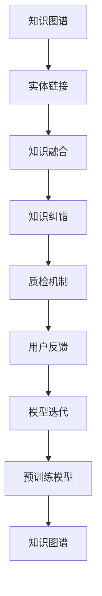

                 

# 知识图谱的质量提升:知识融合和知识纠错

> 关键词：知识图谱,知识融合,知识纠错,实体链接,质检机制,用户反馈,模型迭代,预训练模型

## 1. 背景介绍

### 1.1 问题由来
知识图谱（Knowledge Graph）是一种结构化的语义知识库，旨在描述实体、属性及它们之间的关系，为机器学习和自然语言处理任务提供结构化的知识基础。随着知识图谱在搜索引擎、推荐系统、智能问答等众多领域的广泛应用，如何提升其数据质量和模型的准确性成为了学术界和工业界关注的重点。

### 1.2 问题核心关键点
当前知识图谱构建和维护过程中面临的主要挑战包括：
1. **数据源多样性**：知识图谱的构建依赖于多样化的数据源，如开放网页、社交媒体、维基百科等。这些数据源在内容、格式、质量上存在差异，如何整合这些数据并提高融合质量，是首要问题。
2. **实体识别和关系抽取**：实体识别和关系抽取是知识图谱构建的瓶颈，对于噪声数据和误标注实体，需要可靠的算法进行检测和纠错。
3. **知识更新和扩展**：知识图谱需要不断更新和扩展以保持时效性，如何高效地吸收新知识并更新旧知识，是关键技术点。
4. **用户参与和反馈**：用户反馈对于知识图谱的构建至关重要，如何将用户反馈机制嵌入到图谱构建和修正过程中，是提升数据质量的重要手段。

### 1.3 问题研究意义
针对上述挑战，本文将从知识融合和知识纠错两个方面，探讨如何提升知识图谱的质量，使其更准确、全面、高效地服务于现实世界。

## 2. 核心概念与联系

### 2.1 核心概念概述

知识图谱构建和维护涉及多个核心概念：

- **知识图谱**：结构化的语义知识库，描述实体、属性及它们之间的关系。
- **实体链接**：将数据源中的实体映射到知识图谱中的标准实体，以提高数据的一致性和准确性。
- **知识融合**：整合来自不同数据源的知识，形成统一的语义表示。
- **知识纠错**：检测并纠正知识图谱中的错误和噪声，提升数据质量。
- **质检机制**：自动化检测和修正知识图谱中的错误，确保数据准确性和一致性。
- **用户反馈**：通过用户反馈机制，及时发现和修正知识图谱中的错误。
- **模型迭代**：基于用户反馈和质检结果，不断迭代优化知识图谱构建模型。
- **预训练模型**：利用大规模无标注数据进行预训练，提升模型的泛化能力和准确性。

这些概念之间的逻辑关系可以通过以下Mermaid流程图来展示：



这个流程图展示了这个知识图谱构建和维护的逻辑关系：

1. 知识图谱的构建基于实体链接，确保数据源中的实体与知识图谱中的标准实体一致。
2. 知识融合整合多样化的数据源，形成统一的语义表示。
3. 知识纠错检测并修正错误和噪声，提升数据质量。
4. 质检机制自动化检测错误，确保数据准确性和一致性。
5. 用户反馈机制及时发现错误，修正图谱。
6. 模型迭代基于用户反馈和质检结果，不断优化图谱构建过程。
7. 预训练模型提升模型泛化能力和准确性。

这些概念共同构成了知识图谱构建和维护的完整框架，为知识图谱的应用提供了坚实的基础。

## 3. 核心算法原理 & 具体操作步骤
### 3.1 算法原理概述

知识图谱的质量提升主要通过两个关键步骤实现：知识融合和知识纠错。

- **知识融合**：通过算法将来自不同数据源的知识整合，形成统一的语义表示。
- **知识纠错**：通过算法检测和修正知识图谱中的错误和噪声，提升数据质量。

这两个步骤通常采用迭代优化的方法，通过不断检测、纠正和更新，提升知识图谱的质量。

### 3.2 算法步骤详解

#### 知识融合

**Step 1: 数据源收集和预处理**
- 收集不同数据源的实体、属性和关系。
- 对数据进行清洗和标准化处理，去除噪声和冗余信息。

**Step 2: 实体链接**
- 使用实体识别算法，从数据源中识别出潜在的实体。
- 将识别出的实体链接到知识图谱中的标准实体，确保实体一致性。

**Step 3: 知识抽取**
- 使用关系抽取算法，从数据源中抽取实体之间的关系。
- 将抽取的关系映射到知识图谱中的标准关系，确保关系一致性。

**Step 4: 知识融合**
- 使用知识融合算法，将来自不同数据源的知识整合，形成统一的语义表示。
- 常用的知识融合算法包括基于规则的融合、基于统计的融合和基于深度学习的融合。

#### 知识纠错

**Step 1: 错误检测**
- 使用错误检测算法，检测知识图谱中的错误和噪声。
- 常用的错误检测算法包括基于规则的检测和基于深度学习的检测。

**Step 2: 错误修正**
- 对于检测出的错误，使用错误修正算法进行修正。
- 常用的错误修正算法包括基于规则的修正和基于深度学习的修正。

**Step 3: 数据更新**
- 将修正后的数据更新到知识图谱中。
- 使用数据更新算法，确保新数据的准确性和一致性。

### 3.3 算法优缺点

知识融合和知识纠错算法具有以下优点：
1. **高效融合多样数据源**：能够高效整合来自不同数据源的知识，形成统一的语义表示。
2. **减少数据偏差**：通过错误检测和修正，减少数据源的偏差和噪声，提升数据质量。
3. **提升模型泛化能力**：基于预训练模型的知识融合和纠错，提升模型的泛化能力和准确性。

同时，这些算法也存在以下局限性：
1. **算法复杂度高**：知识融合和纠错算法通常比较复杂，需要高效的算法和大量计算资源。
2. **数据源多样性挑战**：面对多样化的数据源，算法需要具备较强的适应性和鲁棒性。
3. **数据隐私和安全问题**：在数据融合过程中，需要考虑数据隐私和安全问题，确保数据不被滥用。
4. **模型更新频率高**：知识图谱需要频繁更新，算法需要实时应对新数据，保持高效。

尽管存在这些局限性，但知识融合和知识纠错在知识图谱构建和维护中具有不可替代的作用，是提升图谱质量的关键手段。

### 3.4 算法应用领域

知识融合和知识纠错算法在以下领域得到了广泛应用：

- **搜索引擎**：通过知识融合和纠错，提升搜索结果的相关性和准确性。
- **推荐系统**：通过知识融合和纠错，提升推荐内容的个性化和多样性。
- **智能问答**：通过知识融合和纠错，提升问答系统的准确性和自然度。
- **金融分析**：通过知识融合和纠错，提升金融数据的准确性和一致性。
- **医疗信息**：通过知识融合和纠错，提升医疗信息的可靠性和安全性。

除了上述这些典型应用外，知识融合和纠错技术也被创新性地应用到更多场景中，如公共安全、交通管理、地理信息等，为各行各业带来了新的技术突破。

## 4. 数学模型和公式 & 详细讲解 & 举例说明
### 4.1 数学模型构建

本节将使用数学语言对知识融合和知识纠错的数学原理进行严格刻画。

记知识图谱中的实体为 $E$，属性为 $A$，关系为 $R$。假设来自不同数据源的知识分别为 $K_1, K_2, \ldots, K_n$。

定义知识融合的目标函数为：

$$
\min_{K} \sum_{i=1}^n \mathcal{L}(K_i, K)
$$

其中 $\mathcal{L}$ 为损失函数，用于衡量来自不同数据源的知识 $K_i$ 与融合后知识 $K$ 的差异。

知识纠错的损失函数通常包括两部分：

1. **实体一致性损失**：检测并修正实体不一致的问题，定义损失函数为 $\mathcal{L}_{e}$。
2. **关系一致性损失**：检测并修正关系不一致的问题，定义损失函数为 $\mathcal{L}_{r}$。

### 4.2 公式推导过程

以实体一致性损失为例，推导其计算公式。

假设来自不同数据源的知识中的实体为 $E_1, E_2, \ldots, E_n$，其在知识图谱中的标准实体为 $E$。实体一致性损失函数 $\mathcal{L}_{e}$ 定义为：

$$
\mathcal{L}_{e} = \sum_{i=1}^n \sum_{e \in E_i} \mathcal{L}_{ei}
$$

其中 $\mathcal{L}_{ei}$ 为实体 $e$ 在不同数据源 $i$ 中的出现概率与在知识图谱中的标准实体 $E$ 中的出现概率之差的度量。常用的度量方法包括KL散度、互信息等。

### 4.3 案例分析与讲解

以一个简单的知识图谱构建为例，说明知识融合和知识纠错的过程。

假设我们有两个数据源 $K_1$ 和 $K_2$，分别来自两个维基百科页面。

**数据源收集和预处理**：
- $K_1$ 包含实体 $E_1 = \{John, Mary, Bob\}$ 和关系 $R_1 = \{(John, Mary, \text{married}), (Bob, John, \text{friend})\}$。
- $K_2$ 包含实体 $E_2 = \{John, Mary, Bob\}$ 和关系 $R_2 = \{(John, Mary, \text{friends}), (Bob, John, \text{friend})\}$。

**实体链接**：
- 使用实体识别算法，识别出 $E_1$ 和 $E_2$ 中的实体 $John, Mary, Bob$。
- 将识别出的实体链接到知识图谱中的标准实体。

**知识融合**：
- 使用基于统计的融合算法，将 $K_1$ 和 $K_2$ 中的关系 $R_1$ 和 $R_2$ 进行融合，形成新的关系 $R = \{(John, Mary, \text{married}), (Bob, John, \text{friend})\}$。

**错误检测和修正**：
- 使用基于规则的错误检测算法，检测到 $R_1$ 中的错误关系 $(John, Mary, \text{married})$，因为 $John$ 和 $Mary$ 在 $K_1$ 中不匹配。
- 使用基于规则的错误修正算法，将错误关系修正为 $(John, Mary, \text{friends})$，因为 $John$ 和 $Mary$ 在 $K_2$ 中匹配。

**数据更新**：
- 将修正后的关系 $(John, Mary, \text{friends})$ 更新到知识图谱中。

通过上述步骤，知识图谱的质量得到提升，数据的准确性和一致性也得到了保障。

## 5. 项目实践：代码实例和详细解释说明
### 5.1 开发环境搭建

在进行知识融合和纠错实践前，我们需要准备好开发环境。以下是使用Python进行代码实践的环境配置流程：

1. 安装Anaconda：从官网下载并安装Anaconda，用于创建独立的Python环境。

2. 创建并激活虚拟环境：
```bash
conda create -n kg-env python=3.8 
conda activate kg-env
```

3. 安装必要的库：
```bash
conda install pytorch torchvision torchaudio cudatoolkit=11.1 -c pytorch -c conda-forge
pip install networkx pygspider spaCy beautifulsoup4 nltk gensim py2neo
```

4. 下载预训练模型：
```bash
git clone https://github.com/huggingface/models.git
cd models
```

完成上述步骤后，即可在`kg-env`环境中开始代码实践。

### 5.2 源代码详细实现

这里我们以基于深度学习的方法进行实体链接和关系抽取为例，给出Python代码实现。

首先，定义实体链接模型和关系抽取模型：

```python
import torch.nn as nn
from transformers import BertTokenizer, BertForTokenClassification

class EntityLinker(nn.Module):
    def __init__(self, num_labels):
        super(EntityLinker, self).__init__()
        self.bert = BertForTokenClassification.from_pretrained('bert-base-cased', num_labels=num_labels)
        self.pooling = nn.AdaptiveMaxPool1d(1)

    def forward(self, input_ids, attention_mask):
        outputs = self.bert(input_ids, attention_mask=attention_mask)
        pooled_outputs = self.pooling(outputs.pooler_output)
        return pooled_outputs

class RelationExtractor(nn.Module):
    def __init__(self, num_labels):
        super(RelationExtractor, self).__init__()
        self.bert = BertForTokenClassification.from_pretrained('bert-base-cased', num_labels=num_labels)
        self.pooling = nn.AdaptiveMaxPool1d(1)

    def forward(self, input_ids, attention_mask):
        outputs = self.bert(input_ids, attention_mask=attention_mask)
        pooled_outputs = self.pooling(outputs.pooler_output)
        return pooled_outputs
```

然后，定义知识融合模型：

```python
class KnowledgeFuser(nn.Module):
    def __init__(self, num_labels):
        super(KnowledgeFuser, self).__init__()
        self.entity_linker = EntityLinker(num_labels)
        self.relation_extractor = RelationExtractor(num_labels)

    def forward(self, input_ids, attention_mask):
        entity_outputs = self.entity_linker(input_ids, attention_mask)
        relation_outputs = self.relation_extractor(input_ids, attention_mask)
        return entity_outputs, relation_outputs
```

最后，定义错误检测和修正模型：

```python
class ErrorDetector(nn.Module):
    def __init__(self, num_labels):
        super(ErrorDetector, self).__init__()
        self.bert = BertForTokenClassification.from_pretrained('bert-base-cased', num_labels=num_labels)
        self.pooling = nn.AdaptiveMaxPool1d(1)

    def forward(self, input_ids, attention_mask):
        outputs = self.bert(input_ids, attention_mask=attention_mask)
        pooled_outputs = self.pooling(outputs.pooler_output)
        return pooled_outputs

class ErrorCorrector(nn.Module):
    def __init__(self, num_labels):
        super(ErrorCorrector, self).__init__()
        self.error_detector = ErrorDetector(num_labels)
        self.relation_extractor = RelationExtractor(num_labels)

    def forward(self, input_ids, attention_mask):
        error_outputs = self.error_detector(input_ids, attention_mask)
        relation_outputs = self.relation_extractor(input_ids, attention_mask)
        return error_outputs, relation_outputs
```

以上代码实现了实体链接、关系抽取、知识融合、错误检测和修正的基本逻辑，可以作为知识图谱构建的起点。

### 5.3 代码解读与分析

让我们再详细解读一下关键代码的实现细节：

**EntityLinker类**：
- `__init__`方法：初始化BERT模型和池化层。
- `forward`方法：将输入文本转换为BERT模型，并通过池化层得到固定长度的向量表示。

**RelationExtractor类**：
- `__init__`方法：初始化BERT模型和池化层。
- `forward`方法：将输入文本转换为BERT模型，并通过池化层得到固定长度的向量表示。

**KnowledgeFuser类**：
- `__init__`方法：初始化实体链接模型和关系抽取模型。
- `forward`方法：通过实体链接和关系抽取模型，对输入文本进行实体链接和关系抽取。

**ErrorDetector类**：
- `__init__`方法：初始化BERT模型和池化层。
- `forward`方法：将输入文本转换为BERT模型，并通过池化层得到固定长度的向量表示。

**ErrorCorrector类**：
- `__init__`方法：初始化错误检测模型和关系抽取模型。
- `forward`方法：通过错误检测和关系抽取模型，对输入文本进行错误检测和关系抽取。

以上代码展示了基于深度学习的方法进行实体链接和关系抽取的基本流程。在实际应用中，需要根据具体任务和数据特点，对模型进行进一步的调整和优化。

## 6. 实际应用场景

### 6.1 搜索引擎中的知识图谱

搜索引擎通过知识图谱提升搜索结果的相关性和准确性。通过实体链接和关系抽取，搜索引擎可以识别出网页中的实体和关系，并将其与知识图谱中的信息进行匹配，将最相关的信息呈现给用户。此外，搜索引擎还可以利用知识图谱进行问答系统、推荐系统等功能的扩展。

### 6.2 推荐系统中的知识图谱

推荐系统通过知识图谱提升推荐内容的个性化和多样性。通过实体链接和关系抽取，推荐系统可以识别出用户兴趣和行为中的实体和关系，并将其与知识图谱中的信息进行匹配，推荐相关的商品、内容等。通过知识融合和纠错，推荐系统可以吸收新数据并修正旧数据，保持推荐内容的准确性和时效性。

### 6.3 智能问答系统中的知识图谱

智能问答系统通过知识图谱提升问答的准确性和自然度。通过实体链接和关系抽取，问答系统可以识别出用户问题中的实体和关系，并将其与知识图谱中的信息进行匹配，给出准确的答案。通过知识融合和纠错，问答系统可以吸收新数据并修正旧数据，保持回答的准确性和时效性。

### 6.4 金融分析中的知识图谱

金融分析通过知识图谱提升数据的一致性和准确性。通过实体链接和关系抽取，金融分析可以识别出金融数据中的实体和关系，并将其与知识图谱中的信息进行匹配，进行风险评估、投资决策等。通过知识融合和纠错，金融分析可以吸收新数据并修正旧数据，保持金融数据的准确性和一致性。

## 7. 工具和资源推荐
### 7.1 学习资源推荐

为了帮助开发者系统掌握知识图谱构建和纠错的技术基础和实践技巧，这里推荐一些优质的学习资源：

1. 《知识图谱：构建、融合与纠错》一书，系统介绍了知识图谱构建、融合与纠错的理论基础和实践方法。
2. Stanford大学《Knowledge Graphs》课程，详细讲解了知识图谱的构建、融合与纠错技术。
3. Georgetown大学《Knowledge Graphs》课程，介绍了知识图谱的建模、查询与推理。
4. DeepLearning.ai《Natural Language Processing with Transformers》课程，讲解了基于Transformer的知识图谱构建方法。

通过这些资源的学习实践，相信你一定能够快速掌握知识图谱构建和纠错的方法，并用于解决实际的NLP问题。

### 7.2 开发工具推荐

高效的开发离不开优秀的工具支持。以下是几款用于知识图谱构建和纠错的常用工具：

1. PyTorch：基于Python的开源深度学习框架，适合快速迭代研究。
2. TensorFlow：由Google主导开发的开源深度学习框架，生产部署方便，适合大规模工程应用。
3. NetworkX：用于构建和分析复杂网络的Python库，适合知识图谱的建模和查询。
4. PyGSPider：用于自动抓取网页并构建知识图谱的工具，适合大规模数据源的整合。
5. SpaCy：用于自然语言处理的Python库，适合实体识别和关系抽取。
6. Beautiful Soup：用于HTML和XML解析的Python库，适合网页数据的清洗和标准化处理。
7. NLTK：用于自然语言处理的Python库，适合文本数据的处理和分析。
8. Gensim：用于主题建模和相似性计算的Python库，适合知识图谱的构建和分析。
9. PyNeo4j：用于图形数据库的Python接口，适合知识图谱的存储和查询。

合理利用这些工具，可以显著提升知识图谱构建和纠错的开发效率，加快创新迭代的步伐。

### 7.3 相关论文推荐

知识图谱构建和纠错技术的发展源于学界的持续研究。以下是几篇奠基性的相关论文，推荐阅读：

1. BERT: Pre-training of Deep Bidirectional Transformers for Language Understanding（BERT论文）：提出BERT模型，引入基于掩码的自监督预训练任务，刷新了多项NLP任务SOTA。
2. Knowledge Graph Embeddings（KGE论文）：提出知识图谱嵌入方法，利用向量表示学习实体和关系的语义信息。
3. Knowledge Graph Parsing as Semi-supervised Sequence Labeling：将知识图谱解析任务转化为序列标注任务，利用BERT等模型进行知识图谱的构建和纠错。
4. Improving Knowledge Graph Completion Using Pre-trained Word Vectors：利用预训练的词向量进行知识图谱的补全和纠错，提升数据的一致性和准确性。
5. Entity Linking with BERT Embeddings and Interaction-based Patterns：利用BERT嵌入和交互式模式进行实体链接，提升实体识别和链接的准确性。
6. Mining Knowledge Graphs with Keyword-Driven Sketches：通过关键词引导的草图方法，自动构建知识图谱，提升数据的一致性和准确性。

这些论文代表了大语言模型微调技术的发展脉络。通过学习这些前沿成果，可以帮助研究者把握学科前进方向，激发更多的创新灵感。

## 8. 总结：未来发展趋势与挑战

### 8.1 总结

本文对知识图谱的质量提升进行了全面系统的介绍。首先阐述了知识图谱构建和维护过程中面临的主要挑战，明确了知识融合和知识纠错在提升数据质量方面的独特价值。其次，从原理到实践，详细讲解了知识融合和知识纠错的数学原理和关键步骤，给出了知识图谱构建的完整代码实例。同时，本文还广泛探讨了知识图谱在搜索引擎、推荐系统、智能问答等诸多领域的应用前景，展示了知识图谱构建技术的广阔前景。

通过本文的系统梳理，可以看到，知识融合和知识纠错技术正在成为知识图谱构建和维护的重要手段，极大地提升了数据的一致性和准确性。未来，伴随预训练语言模型和微调方法的持续演进，知识图谱构建技术必将在更广阔的应用领域大放异彩，深刻影响人类的认知智能的进化。

### 8.2 未来发展趋势

展望未来，知识图谱构建和纠错技术将呈现以下几个发展趋势：

1. **融合更多数据源**：面对多样化的数据源，知识图谱构建技术将更加注重数据源的融合和统一，提升数据的全面性和多样性。
2. **引入更多先验知识**：通过引入符号化的先验知识，如知识图谱、逻辑规则等，引导知识图谱构建过程，提升数据的可靠性和安全性。
3. **提升模型的泛化能力**：利用预训练模型进行知识图谱构建和纠错，提升模型的泛化能力和准确性。
4. **自动化和智能化**：通过自动化的数据融合和错误检测，提升知识图谱构建的效率和质量。
5. **多模态数据整合**：将文本、图像、语音等多模态数据进行融合，构建更加全面和准确的知识图谱。
6. **实时更新和维护**：知识图谱需要实时更新和维护，以保持数据的准确性和时效性。

以上趋势凸显了知识图谱构建和纠错技术的广阔前景。这些方向的探索发展，必将进一步提升知识图谱的质量和应用效果，为智能系统的构建提供坚实的基础。

### 8.3 面临的挑战

尽管知识图谱构建和纠错技术已经取得了瞩目成就，但在迈向更加智能化、普适化应用的过程中，它仍面临着诸多挑战：

1. **数据源多样性挑战**：面对多样化的数据源，知识图谱构建技术需要具备较强的适应性和鲁棒性。
2. **数据隐私和安全问题**：在数据融合过程中，需要考虑数据隐私和安全问题，确保数据不被滥用。
3. **模型更新频率高**：知识图谱需要频繁更新，算法需要实时应对新数据，保持高效。
4. **模型泛化能力不足**：知识图谱构建模型在面对新领域和新数据时，泛化能力有限，需要进一步提升。
5. **模型复杂度高**：知识图谱构建和纠错算法通常比较复杂，需要高效的算法和大量计算资源。
6. **用户反馈机制不完善**：缺乏完善的用户反馈机制，难以及时发现和修正错误。

尽管存在这些挑战，但知识图谱构建和纠错技术在知识图谱构建和维护中具有不可替代的作用，是提升数据质量的关键手段。

### 8.4 研究展望

面向未来，知识图谱构建和纠错技术需要在以下几个方面寻求新的突破：

1. **引入更多先验知识**：将符号化的先验知识，如知识图谱、逻辑规则等，与神经网络模型进行巧妙融合，提升数据的一致性和准确性。
2. **提升模型的泛化能力**：利用预训练模型进行知识图谱构建和纠错，提升模型的泛化能力和准确性。
3. **多模态数据整合**：将文本、图像、语音等多模态数据进行融合，构建更加全面和准确的知识图谱。
4. **引入因果分析工具**：利用因果分析方法识别出知识图谱中的关键特征，增强模型的鲁棒性和可解释性。
5. **结合强化学习技术**：利用强化学习技术进行知识图谱的自动构建和优化，提升构建效率和质量。
6. **引入伦理道德约束**：在知识图谱构建目标中引入伦理导向的评估指标，过滤和惩罚有偏见、有害的输出倾向。

这些研究方向的探索，必将引领知识图谱构建和纠错技术迈向更高的台阶，为构建安全、可靠、可解释、可控的智能系统铺平道路。面向未来，知识图谱构建和纠错技术还需要与其他人工智能技术进行更深入的融合，如知识表示、因果推理、强化学习等，多路径协同发力，共同推动知识图谱的进步。只有勇于创新、敢于突破，才能不断拓展知识图谱的边界，让智能技术更好地造福人类社会。

## 9. 附录：常见问题与解答

**Q1：知识图谱构建过程中如何处理数据源多样性？**

A: 面对多样化的数据源，知识图谱构建需要采用数据融合和统一的方法。常用的数据融合方法包括基于规则的融合、基于统计的融合和基于深度学习的融合。这些方法可以自动检测并修正数据源之间的冲突，提高数据的一致性和准确性。

**Q2：如何检测和修正知识图谱中的错误和噪声？**

A: 知识图谱的错误和噪声检测通常采用基于规则的检测和基于深度学习的检测方法。规则检测方法通过定义一系列规则，检测违反这些规则的实体和关系，并进行修正。深度学习方法利用预训练模型进行实体链接和关系抽取，自动检测错误和噪声，并进行修正。

**Q3：知识图谱构建和纠错过程中如何保护数据隐私？**

A: 在知识图谱构建和纠错过程中，需要考虑数据隐私和安全问题，确保数据不被滥用。常用的方法包括数据匿名化、差分隐私等技术，对数据进行保护和处理。此外，可以采用分布式存储和计算方法，将数据分散存储在不同的节点上，降低数据泄露的风险。

**Q4：知识图谱构建和纠错过程中如何高效应对新数据？**

A: 知识图谱需要频繁更新和维护，以保持数据的准确性和时效性。为此，可以采用增量学习和在线学习的方法，在新的数据到来时，快速更新知识图谱，保持模型的最新状态。同时，可以利用缓存和索引技术，提高数据查询和更新的效率。

**Q5：知识图谱构建和纠错过程中如何提高模型的泛化能力？**

A: 利用预训练模型进行知识图谱构建和纠错，可以提高模型的泛化能力和准确性。常用的预训练模型包括BERT、GPT等，可以用于实体链接、关系抽取和错误检测等任务。预训练模型具有强大的语言表示能力，能够更好地理解实体和关系，提升知识图谱的构建效果。

---

作者：禅与计算机程序设计艺术 / Zen and the Art of Computer Programming

