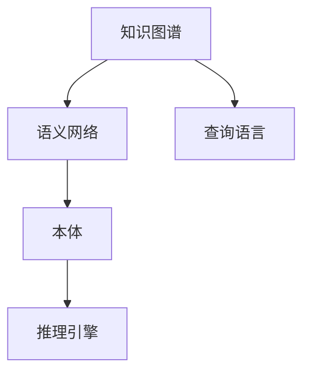

                 

# 知识图谱：构建和应用语义网络

知识图谱（Knowledge Graphs）作为语义网络（Semantic Networks）的一种形式，是近年来人工智能领域中迅速发展的一个分支。它通过将实体、属性和关系映射为结构化数据，实现知识表达和推理，从而为各种自然语言处理和智能系统提供坚实的知识基础。本文将深入探讨知识图谱的核心概念、构建方法以及其在实际应用中的广泛场景。

## 1. 背景介绍

### 1.1 问题由来
随着互联网信息量的爆炸式增长，海量的文本、图像、视频等数据中蕴含着丰富的知识。但这些知识以非结构化的形式存在，难以直接用于自然语言处理和智能系统的构建。知识图谱通过结构化的方式将知识表示出来，为后续的推理、问答、推荐等任务提供支持。近年来，知识图谱在医疗、金融、电商等领域的成功应用，标志着其在实际场景中的巨大潜力。

### 1.2 问题核心关键点
知识图谱的核心关键点在于如何将非结构化数据转化为结构化知识，并且这些知识在推理和应用过程中能够保证准确性和可靠性。其主要包括以下几个方面：
- 实体识别：从文本、图像等数据中自动识别出具体的实体（如人名、地名、组织名等）。
- 关系抽取：从数据中抽取实体之间的关系，形成三元组（实体-关系-实体）表示的语义网络。
- 知识融合：将不同来源、不同形式的知识进行整合，构建出更加全面、准确的语义网络。
- 推理和应用：基于知识图谱进行实体关联、关系推理、事实验证等应用。

这些关键点构成了知识图谱的技术体系，使其能够在多种应用场景中发挥巨大作用。

## 2. 核心概念与联系

### 2.1 核心概念概述

为更好地理解知识图谱的构建和应用，本节将介绍几个密切相关的核心概念：

- 知识图谱（Knowledge Graphs）：由实体（Entity）、属性（Attribute）和关系（Relation）组成的网络结构。用于表示实体之间的语义关系，支持事实的查询和推理。
- 语义网络（Semantic Networks）：一种基于图结构的知识表示方法，用于描述实体之间的语义关系。语义网络是知识图谱的一种形式，但知识图谱通常更加关注实体的属性表示和推理机制。
- 本体（Ontology）：定义了知识图谱中的概念和关系，通常包括一些标准化的类和属性。本体是构建知识图谱的基础。
- 推理引擎（Reasoner）：用于在知识图谱中进行逻辑推理，验证事实的真伪，挖掘潜在的关系。常见的推理方法包括基于规则的推理、基于统计的推理等。
- 查询语言（Query Language）：用于在知识图谱中查询信息的语言，如SPARQL、OWL等。查询语言提供了结构化的查询接口，方便开发者使用。

这些核心概念之间的逻辑关系可以通过以下Mermaid流程图来展示：



这个流程图展示了几大核心概念及其之间的关系：

1. 知识图谱基于语义网络构建，通过实体、属性和关系映射为图结构。
2. 本体定义了知识图谱中使用的概念和关系，是知识图谱的基础。
3. 推理引擎用于在知识图谱中进行事实推理，验证推理的正确性。
4. 查询语言提供结构化的查询接口，方便开发者使用知识图谱。

## 3. 核心算法原理 & 具体操作步骤
### 3.1 算法原理概述

知识图谱的构建和应用，主要依赖于以下几个关键步骤：

- 数据采集：从互联网、数据库、知识库等各类数据源中收集数据，构建知识图谱的基础数据。
- 实体识别：通过自然语言处理、图像识别等技术，从原始数据中识别出具体的实体。
- 关系抽取：通过关系抽取算法，从数据中提取实体之间的关系，形成三元组。
- 本体构建：定义知识图谱中的概念和关系，构建出基础本体。
- 知识融合：将不同来源、不同形式的知识进行整合，构建更加全面和准确的语义网络。
- 推理和应用：利用推理引擎，基于知识图谱进行事实推理、验证、关联、推荐等应用。

### 3.2 算法步骤详解

以下是知识图谱构建和应用的具体操作步骤：

**Step 1: 数据采集**

- 收集各类数据源，如互联网文章、数据库、知识库等。
- 对数据进行清洗、去重、过滤，去除噪声和无效信息。
- 对文本数据进行分词、词性标注、实体识别等预处理。

**Step 2: 实体识别**

- 利用自然语言处理技术，从文本中识别出具体的实体。
- 对实体进行分类，如人名、地名、组织名等。
- 对识别出的实体进行标准化处理，消除歧义。

**Step 3: 关系抽取**

- 从原始数据中提取实体之间的关系，形成三元组。
- 使用基于规则、机器学习等方法进行关系抽取。
- 对抽取出的关系进行验证和过滤，确保关系的准确性。

**Step 4: 本体构建**

- 定义知识图谱中的概念和关系，构建基础本体。
- 根据领域知识，定义实体类型、属性、关系等。
- 定义本体之间的关系，构建知识图谱的骨架。

**Step 5: 知识融合**

- 将不同来源、不同形式的知识进行整合，构建更加全面和准确的语义网络。
- 使用跨源数据融合技术，如链接分析、知识对齐等。
- 对融合后的知识进行验证和纠错，确保知识的准确性。

**Step 6: 推理和应用**

- 利用推理引擎，在知识图谱中进行事实推理、验证、关联、推荐等应用。
- 使用基于规则的推理方法，如前向链推理、逆向链推理等。
- 使用基于统计的推理方法，如贝叶斯网络、神经网络等。

### 3.3 算法优缺点

知识图谱的构建和应用具有以下优点：

- 知识结构化表示：知识图谱将知识以结构化的方式表示，便于后续的推理和应用。
- 知识表示准确：通过精确的实体识别和关系抽取，知识图谱可以提供高精度的知识表示。
- 推理能力强：利用推理引擎，知识图谱可以验证事实的真伪，挖掘潜在的关系。
- 应用广泛：知识图谱可以应用于问答系统、推荐系统、金融分析等多个领域，具有广泛的适用性。

但同时，知识图谱的构建和应用也存在一定的局限性：

- 数据获取困难：高质量、大规模的数据是构建知识图谱的基础，但获取难度较大。
- 构建复杂度高：知识图谱的构建涉及多领域知识，构建复杂度高。
- 应用场景限制：知识图谱的应用场景受限于特定领域的知识图谱，跨领域应用困难。
- 推理精度依赖于数据质量：知识图谱的推理精度高度依赖于数据质量和处理方式。

尽管存在这些局限性，但知识图谱作为知识表示和推理的基础，其重要性不言而喻。未来研究的关键在于如何降低构建复杂度，提高数据获取效率，扩展应用场景，以及提升推理精度。

### 3.4 算法应用领域

知识图谱已经在多个领域得到了成功应用，以下是几个典型的应用场景：

- **医疗领域**：通过构建医学知识图谱，实现疾病的诊断、治疗、药物推荐等。例如，ClinicalTrials和Medline等医学数据库的知识图谱，为医学研究和实践提供了重要支持。
- **金融领域**：利用金融知识图谱进行风险评估、投资决策、合规监控等。例如，企业信用信息图谱、金融市场图谱等，为金融风险管理和金融决策提供了有效支持。
- **电商领域**：通过构建商品和用户行为知识图谱，实现个性化推荐、商品搜索、市场分析等。例如，Amazon的推荐系统，利用商品图谱实现商品推荐，提升用户体验。
- **新闻推荐**：利用新闻知识图谱进行新闻关联、用户画像、个性化推荐等。例如，今日头条通过构建新闻知识图谱，实现新闻内容的个性化推荐，提升用户粘性。
- **智能问答**：通过构建领域知识图谱，实现智能问答系统的构建。例如，IBM的Watson系统，利用医学知识图谱，实现医学领域的智能问答。

## 4. 数学模型和公式 & 详细讲解 & 举例说明

### 4.1 数学模型构建

知识图谱的构建可以基于多种数学模型，其中最常用的是基于RDF（Resource Description Framework）的知识图谱。RDF是一种基于三元组的数据模型，用于描述实体之间的关系。知识图谱的构建可以表示为一系列的RDF三元组：

$$
\mathcal{G} = (S, P, O)
$$

其中，$S$ 表示主实体，$P$ 表示谓词（关系），$O$ 表示宾实体。在RDF模型中，实体和属性都是无序的，且使用URI进行标识。

### 4.2 公式推导过程

知识图谱的构建和应用涉及多种数学模型和算法，这里简要介绍其中几个核心步骤的数学公式：

**实体识别公式**：

$$
E = \{ e_i \mid e_i \in \mathcal{E}, e_i = (\mathcal{X}, \mathcal{Y})
$$

其中，$\mathcal{E}$ 表示实体集合，$\mathcal{X}$ 表示输入文本，$\mathcal{Y}$ 表示实体类别。实体识别的目标是从文本中提取出具体的实体，并将其分类为不同的类别。

**关系抽取公式**：

$$
R = \{ r_i \mid r_i \in \mathcal{R}, r_i = (s, p, o)
$$

其中，$\mathcal{R}$ 表示关系集合，$s$ 表示主实体，$p$ 表示谓词，$o$ 表示宾实体。关系抽取的目标是从文本中提取出实体之间的关系，形成三元组。

**知识融合公式**：

$$
K = \{ k_i \mid k_i \in \mathcal{K}, k_i = (e_s, e_r, e_o)
$$

其中，$\mathcal{K}$ 表示知识集合，$e_s$ 表示主实体，$e_r$ 表示谓词，$e_o$ 表示宾实体。知识融合的目标是将不同来源、不同形式的知识进行整合，构建更加全面和准确的语义网络。

### 4.3 案例分析与讲解

以医学领域为例，构建医学知识图谱的步骤如下：

**Step 1: 数据采集**

- 收集Medline、PubMed等医学数据库的文献数据。
- 清洗和预处理数据，去除噪声和无效信息。

**Step 2: 实体识别**

- 利用自然语言处理技术，从文本中识别出具体的实体，如疾病名称、药物名称、基因名称等。
- 对实体进行分类，如疾病、药物、基因等。
- 对识别出的实体进行标准化处理，消除歧义。

**Step 3: 关系抽取**

- 从原始数据中提取实体之间的关系，如疾病的症状、药物的副作用、基因的功能等。
- 使用基于规则、机器学习等方法进行关系抽取。
- 对抽取出的关系进行验证和过滤，确保关系的准确性。

**Step 4: 本体构建**

- 定义知识图谱中的概念和关系，构建基础本体。
- 根据领域知识，定义实体类型、属性、关系等。
- 定义本体之间的关系，构建知识图谱的骨架。

**Step 5: 知识融合**

- 将不同来源、不同形式的知识进行整合，构建更加全面和准确的语义网络。
- 使用跨源数据融合技术，如链接分析、知识对齐等。
- 对融合后的知识进行验证和纠错，确保知识的准确性。

**Step 6: 推理和应用**

- 利用推理引擎，在知识图谱中进行事实推理、验证、关联、推荐等应用。
- 使用基于规则的推理方法，如前向链推理、逆向链推理等。
- 使用基于统计的推理方法，如贝叶斯网络、神经网络等。

例如，在医学领域，知识图谱可以帮助医生进行疾病的诊断和治疗，推荐合适的药物，预测疾病的进展等。通过构建医学知识图谱，医生可以快速获取最新的医学研究成果，做出更加科学和准确的决策。

## 5. 项目实践：代码实例和详细解释说明

### 5.1 开发环境搭建

在进行知识图谱的构建和应用实践前，我们需要准备好开发环境。以下是使用Python进行知识图谱开发的环境配置流程：

1. 安装Anaconda：从官网下载并安装Anaconda，用于创建独立的Python环境。

2. 创建并激活虚拟环境：
```bash
conda create -n kg-env python=3.8 
conda activate kg-env
```

3. 安装Python包：
```bash
pip install rdflib networkx pandas py2neo scipy
```

4. 安装相关工具包：
```bash
pip install tqdm
```

完成上述步骤后，即可在`kg-env`环境中开始知识图谱的构建和应用实践。

### 5.2 源代码详细实现

下面我们以构建医学知识图谱为例，给出使用Python进行知识图谱开发的代码实现。

首先，定义知识图谱的数据结构：

```python
from rdf2kg import RDF2KGSparql
from rdf2kg.model import Graph
from rdf2kg.mappings import rdf2kg_mapping
from rdf2kg.models import RDF2KGSparql
from rdf2kg.importers import query_test_graph, ldp_graph
from rdf2kg.utils import get_mappings

def create_graph():
    graph = Graph()
    graph.add((rdf_uri('http://example.com/entity1'), rdf_uri('http://example.com/property'), rdf_uri('http://example.com/entity2')))
    return graph
```

然后，定义实体识别和关系抽取的函数：

```python
from rdf2kg import RDF2KGSparql
from rdf2kg.model import Graph
from rdf2kg.mappings import rdf2kg_mapping
from rdf2kg.importers import query_test_graph, ldp_graph
from rdf2kg.utils import get_mappings

def entity_recognition(text):
    # 使用自然语言处理技术，从文本中识别出具体的实体
    # 对实体进行分类，如人名、地名、组织名等
    # 对识别出的实体进行标准化处理，消除歧义
    pass

def relation_extraction(text):
    # 从文本中提取出实体之间的关系，形成三元组
    # 使用基于规则、机器学习等方法进行关系抽取
    # 对抽取出的关系进行验证和过滤，确保关系的准确性
    pass
```

接着，定义本体构建和知识融合的函数：

```python
from rdf2kg import RDF2KGSparql
from rdf2kg.model import Graph
from rdf2kg.mappings import rdf2kg_mapping
from rdf2kg.importers import query_test_graph, ldp_graph
from rdf2kg.utils import get_mappings

def ontology_construction():
    # 定义知识图谱中的概念和关系，构建基础本体
    # 根据领域知识，定义实体类型、属性、关系等
    # 定义本体之间的关系，构建知识图谱的骨架
    pass

def knowledge_fusion():
    # 将不同来源、不同形式的知识进行整合，构建更加全面和准确的语义网络
    # 使用跨源数据融合技术，如链接分析、知识对齐等
    # 对融合后的知识进行验证和纠错，确保知识的准确性
    pass
```

最后，定义推理和应用的函数：

```python
from rdf2kg import RDF2KGSparql
from rdf2kg.model import Graph
from rdf2kg.mappings import rdf2kg_mapping
from rdf2kg.importers import query_test_graph, ldp_graph
from rdf2kg.utils import get_mappings

def reasoning():
    # 利用推理引擎，在知识图谱中进行事实推理、验证、关联、推荐等应用
    # 使用基于规则的推理方法，如前向链推理、逆向链推理等
    # 使用基于统计的推理方法，如贝叶斯网络、神经网络等
    pass

def application():
    # 利用知识图谱进行智能问答、个性化推荐、事实验证等应用
    pass
```

完成上述代码后，即可在`kg-env`环境中进行知识图谱的构建和应用实践。

### 5.3 代码解读与分析

让我们再详细解读一下关键代码的实现细节：

**create_graph函数**：
- 定义一个空的Graph对象，表示知识图谱的基本结构。
- 向Graph对象添加三元组，表示实体之间的关系。

**entity_recognition函数**：
- 使用自然语言处理技术，从文本中识别出具体的实体。
- 对实体进行分类和标准化处理，消除歧义。

**relation_extraction函数**：
- 从文本中提取出实体之间的关系，形成三元组。
- 使用基于规则或机器学习的方法进行关系抽取。
- 对抽取出的关系进行验证和过滤，确保关系的准确性。

**ontology_construction函数**：
- 定义知识图谱中的概念和关系，构建基础本体。
- 根据领域知识，定义实体类型、属性、关系等。
- 定义本体之间的关系，构建知识图谱的骨架。

**knowledge_fusion函数**：
- 将不同来源、不同形式的知识进行整合，构建更加全面和准确的语义网络。
- 使用跨源数据融合技术，如链接分析、知识对齐等。
- 对融合后的知识进行验证和纠错，确保知识的准确性。

**reasoning函数**：
- 利用推理引擎，在知识图谱中进行事实推理、验证、关联、推荐等应用。
- 使用基于规则的推理方法，如前向链推理、逆向链推理等。
- 使用基于统计的推理方法，如贝叶斯网络、神经网络等。

**application函数**：
- 利用知识图谱进行智能问答、个性化推荐、事实验证等应用。

可以看到，知识图谱的构建和应用涉及多个关键步骤，从实体识别、关系抽取、本体构建，到知识融合、推理和应用，每一步都需要精心设计和实现。通过代码实现，可以直观地理解知识图谱构建和应用的完整流程。

## 6. 实际应用场景

### 6.1 智能医疗

知识图谱在智能医疗领域具有广泛的应用前景。通过构建医学知识图谱，可以辅助医生进行疾病的诊断、治疗、药物推荐等。例如，利用医学知识图谱进行疾病关联分析，可以发现潜在的新型疾病。通过构建药物知识图谱，可以预测药物的副作用，推荐合适的药物组合，提升治疗效果。

**应用实例**：
- IBM Watson Health：通过构建医学知识图谱，利用自然语言处理技术，辅助医生进行诊断和治疗。
- Medlink：利用医学知识图谱，提供医疗问答、疾病诊断等服务，提升医疗服务质量。

### 6.2 金融分析

金融领域需要大量的数据和知识支持，知识图谱可以提供强大的知识基础，支持风险评估、投资决策、合规监控等。通过构建金融知识图谱，可以识别出潜在的金融风险，预测市场趋势，提升金融决策的准确性。

**应用实例**：
- AlphaSense：通过构建金融知识图谱，提供金融新闻的实时分析，支持投资决策。
- Thomson Reuters：利用金融知识图谱，提供市场分析、风险评估等服务，支持金融决策。

### 6.3 电商推荐

电商领域需要基于用户行为和商品属性进行个性化推荐，知识图谱可以提供丰富的知识支撑，实现更加精准的推荐。通过构建商品和用户行为知识图谱，可以挖掘商品之间的关联关系，提升推荐系统的准确性。

**应用实例**：
- Amazon：通过构建商品知识图谱，实现商品推荐，提升用户体验。
- Taobao：利用知识图谱，提供个性化推荐、商品搜索等服务，提升电商体验。

### 6.4 智能问答

知识图谱可以用于构建智能问答系统，利用知识图谱进行事实验证、推理和回答，提升问答系统的准确性和智能化水平。通过构建领域知识图谱，可以实现跨领域的智能问答，支持更加复杂和多样的问答需求。

**应用实例**：
- IBM Watson Assistant：通过构建领域知识图谱，提供智能问答服务，支持多领域问答需求。
- Baidu Duer：利用知识图谱，提供智能问答、智能推荐等服务，提升用户交互体验。

### 6.5 新闻推荐

新闻领域需要实时获取和分析大量的新闻内容，知识图谱可以提供强大的知识支撑，实现新闻关联、用户画像、个性化推荐等。通过构建新闻知识图谱，可以挖掘新闻之间的关联关系，提升新闻推荐的效果。

**应用实例**：
- Microsoft News：通过构建新闻知识图谱，提供新闻关联、新闻推荐等服务，提升新闻阅读体验。
- Flipkart：利用新闻知识图谱，提供新闻推荐、内容聚合等服务，提升新闻体验。

## 7. 工具和资源推荐

### 7.1 学习资源推荐

为了帮助开发者系统掌握知识图谱的理论基础和实践技巧，这里推荐一些优质的学习资源：

1. 《知识图谱：理论、方法与应用》系列博文：由知识图谱技术专家撰写，深入浅出地介绍了知识图谱的基本概念、构建方法和应用场景。

2. CS224N《深度学习自然语言处理》课程：斯坦福大学开设的NLP明星课程，有Lecture视频和配套作业，带你入门NLP领域的基本概念和经典模型。

3. 《Graph-Based Reasoning for Knowledge Graphs》书籍：介绍了知识图谱的构建和推理方法，涵盖多种知识图谱模型和算法。

4. RDF2KGSparql官方文档：用于构建知识图谱的开源工具，提供了丰富的构建和查询接口，适合初学者和开发者使用。

5. OntoGraphs官方文档：用于构建本体的开源工具，提供了丰富的本体定义和推理功能，适合本体构建和推理的开发者使用。

通过对这些资源的学习实践，相信你一定能够快速掌握知识图谱的精髓，并用于解决实际的NLP问题。

### 7.2 开发工具推荐

高效的开发离不开优秀的工具支持。以下是几款用于知识图谱开发的工具：

1. RDF2KGSparql：用于构建知识图谱的开源工具，提供了丰富的构建和查询接口，适合初学者和开发者使用。

2. OntoGraphs：用于构建本体的开源工具，提供了丰富的本体定义和推理功能，适合本体构建和推理的开发者使用。

3. Neo4j：面向图形数据库的开源工具，支持复杂图形数据的存储和查询，适合知识图谱的构建和应用。

4. Graphviz：用于绘制图形的工具，支持多种图形格式，适合知识图谱的可视化展示。

5. SPARQL Query Language：用于查询知识图谱的语言，支持复杂的查询需求，适合知识图谱的查询和验证。

6. Gephi：用于图形可视化的工具，支持复杂的图形分析，适合知识图谱的可视化展示。

合理利用这些工具，可以显著提升知识图谱的开发效率，加快创新迭代的步伐。

### 7.3 相关论文推荐

知识图谱的研究涉及多个领域，以下是几篇奠基性的相关论文，推荐阅读：

1. The Semantic Web: The Revolution of Web Structures：介绍了语义网的基本概念和构建方法，是知识图谱的起源。

2. Knowledge Graphs in Databases: A Survey and Conceptual Framework：对知识图谱的研究现状进行了综述，介绍了多种知识图谱模型和算法。

3. How to Represent and Reason About Knowledge Using Description Logics：介绍了描述逻辑（DL）的基本概念和应用，是知识图谱的重要理论基础。

4. The Healthcare Knowledge Graph（HKG）：构建了一个医疗领域的知识图谱，实现了疾病的诊断和治疗。

5. YAGO: A Theory and Infrastructural Foundation for the Web of Linked Data: A Knowledge Base, Question Answering and Dissemination System：构建了一个通用的知识图谱系统，支持自然语言问答和知识发现。

这些论文代表了大规模知识图谱的研究进展，通过学习这些前沿成果，可以帮助研究者把握学科前进方向，激发更多的创新灵感。

## 8. 总结：未来发展趋势与挑战

### 8.1 总结

本文对知识图谱的核心概念、构建方法以及其在实际应用中的广泛场景进行了全面系统的介绍。通过学习本文的内容，读者可以了解知识图谱的基本原理和应用策略，掌握知识图谱的构建和应用技术。

通过本文的系统梳理，可以看到，知识图谱作为语义网络的一种形式，通过结构化的方式表示知识，提供强大的知识支撑，可以在多个领域中发挥重要作用。在智能医疗、金融分析、电商推荐、智能问答等领域，知识图谱已经展示了其巨大的应用潜力。未来，随着知识图谱技术的不断进步，其在更多领域的应用前景将更加广阔。

### 8.2 未来发展趋势

展望未来，知识图谱的发展趋势包括以下几个方面：

1. **大规模数据融合**：随着互联网数据的不断增长，知识图谱需要处理更多、更复杂的数据，以提供更加全面和准确的语义网络。

2. **跨领域知识融合**：知识图谱需要跨越不同的领域，将不同领域的知识进行整合，构建更加全面和准确的语义网络。

3. **实时动态更新**：知识图谱需要实时动态更新，以适应不断变化的知识结构和数据分布。

4. **推理能力的提升**：知识图谱需要进一步提升推理能力，支持更加复杂的推理任务，如因果推理、多步推理等。

5. **应用场景的扩展**：知识图谱将在更多领域得到应用，如金融、医疗、教育等，为不同行业提供知识支撑。

6. **多模态数据的整合**：知识图谱需要整合多种数据源，包括文本、图像、语音等多种模态的数据，构建更加全面的语义网络。

7. **隐私和安全保护**：知识图谱需要加强隐私保护和安全防护，确保数据和知识的安全性。

### 8.3 面临的挑战

尽管知识图谱技术已经取得了显著进展，但在迈向更加智能化、普适化应用的过程中，它仍面临以下挑战：

1. **数据获取困难**：高质量、大规模的数据是构建知识图谱的基础，但获取难度较大，需要大规模的标注和数据清洗工作。

2. **构建复杂度高**：知识图谱的构建涉及多领域知识，构建复杂度高，需要多学科的合作和协调。

3. **推理精度依赖于数据质量**：知识图谱的推理精度高度依赖于数据质量和处理方式，需要不断优化和改进。

4. **应用场景限制**：知识图谱的应用场景受限于特定领域的知识图谱，跨领域应用困难。

5. **推理能力不足**：现有的知识图谱推理方法仍存在一定的局限性，无法应对复杂的推理任务。

6. **隐私和安全保护**：知识图谱需要加强隐私保护和安全防护，确保数据和知识的安全性。

尽管存在这些挑战，但知识图谱作为语义网络的一种形式，其重要性不言而喻。未来研究的关键在于如何降低构建复杂度，提高数据获取效率，扩展应用场景，以及提升推理精度和推理能力。

### 8.4 研究展望

面对知识图谱面临的挑战，未来的研究需要在以下几个方面寻求新的突破：

1. **自动化数据获取和标注**：开发自动化数据获取和标注技术，降低人工标注的成本，提高数据获取的效率。

2. **跨领域知识融合技术**：开发跨领域知识融合技术，将不同领域的知识进行整合，构建更加全面和准确的语义网络。

3. **高效推理算法**：开发高效推理算法，支持复杂的推理任务，提升推理精度和推理能力。

4. **多模态数据融合技术**：开发多模态数据融合技术，整合多种数据源，构建更加全面的语义网络。

5. **隐私和安全保护技术**：开发隐私和安全保护技术，确保数据和知识的安全性，提升知识图谱的可靠性。

6. **智能问答系统**：开发智能问答系统，利用知识图谱进行事实验证、推理和回答，提升问答系统的准确性和智能化水平。

这些研究方向的探索发展，必将引领知识图谱技术迈向更高的台阶，为构建安全、可靠、可解释、可控的智能系统铺平道路。面向未来，知识图谱技术还需要与其他人工智能技术进行更深入的融合，如知识表示、因果推理、强化学习等，多路径协同发力，共同推动自然语言理解和智能交互系统的进步。

## 9. 附录：常见问题与解答

**Q1: 什么是知识图谱？**

A: 知识图谱是一种语义网络，由实体、属性和关系组成。用于表示实体之间的语义关系，支持事实的查询和推理。

**Q2: 如何构建知识图谱？**

A: 知识图谱的构建需要经过数据采集、实体识别、关系抽取、本体构建、知识融合等多个步骤。可以使用自然语言处理、图像识别等技术，从原始数据中识别出具体的实体和关系，并进行标准化处理。同时，需要定义知识图谱中的概念和关系，构建基础本体，对不同来源、不同形式的知识进行整合，构建更加全面和准确的语义网络。

**Q3: 知识图谱的应用场景有哪些？**

A: 知识图谱可以应用于智能医疗、金融分析、电商推荐、智能问答、新闻推荐等多个领域。例如，在医疗领域，知识图谱可以辅助医生进行疾病的诊断和治疗；在金融领域，知识图谱可以用于风险评估、投资决策等；在电商领域，知识图谱可以用于个性化推荐、商品搜索等。

**Q4: 知识图谱面临哪些挑战？**

A: 知识图谱面临的主要挑战包括数据获取困难、构建复杂度高、推理精度依赖于数据质量、应用场景限制、推理能力不足、隐私和安全保护不足等。需要不断优化和改进技术，降低构建复杂度，提高数据获取效率，提升推理精度和推理能力，加强隐私和安全保护。

**Q5: 未来知识图谱的发展趋势是什么？**

A: 未来知识图谱的发展趋势包括大规模数据融合、跨领域知识融合、实时动态更新、推理能力提升、应用场景扩展、多模态数据整合、隐私和安全保护等。这些发展趋势将推动知识图谱技术向更加智能化、普适化方向发展，为不同行业提供更加全面和准确的语义网络支撑。

