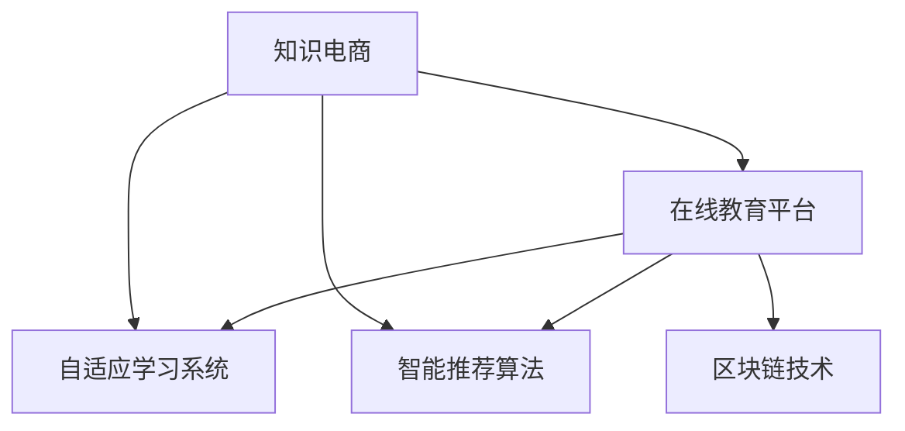

                 

# 知识电商满足用户需求,实现知识商品化

## 1. 背景介绍

### 1.1 问题由来
随着信息时代的到来，互联网和移动互联网的普及，人们获取知识的途径越来越多元化。传统的教育模式已经无法满足快速变化的市场需求。知识电商的概念应运而生，通过互联网平台，将知识产品化、商品化，更加便捷高效地满足用户的学习需求。知识电商的兴起，不仅仅是教育行业的变革，更代表了学习方式的根本转变。

### 1.2 问题核心关键点
知识电商的核心在于将知识资源进行商品化，构建起一个虚拟的“知识超市”，用户可以通过在线平台轻松购买到所需的知识产品，实现个性化、碎片化的学习。这种模式通过大数据、云计算、人工智能等技术，不仅提高了知识的传播效率，还提升了学习的趣味性和互动性。

### 1.3 问题研究意义
研究知识电商的发展，对于教育行业的转型升级、知识传播的数字化转型、个人学习和职业发展的多样化选择，具有重要意义：

1. **降低知识获取成本**。知识电商大大降低了知识获取的时间和金钱成本，使更多人能够轻松获取优质的教育资源。
2. **提升学习效率**。碎片化、个性化的学习方式，使学习更加灵活高效，满足不同用户的学习需求。
3. **激发学习兴趣**。通过有趣的形式和互动的体验，激发用户的学习兴趣，提高学习效果。
4. **推动职业发展**。知识电商为职业技能的培训和提升提供了便利的平台，助力个人职业发展。
5. **促进教育公平**。知识电商打破了地域、时间和空间的限制，使教育资源更加均衡地分布，促进教育公平。

## 2. 核心概念与联系

### 2.1 核心概念概述

为更好地理解知识电商的实现机制，本节将介绍几个密切相关的核心概念：

- **知识电商**：指通过互联网平台将知识资源进行商品化，提供个性化、碎片化的在线学习服务。用户可以通过在线支付获取各类知识产品，如视频课程、在线讲座、电子书等。

- **在线教育平台**：指通过互联网提供各类教育服务的技术和平台。常见的在线教育平台有Coursera、edX、Udemy等。

- **自适应学习系统**：指基于用户的学习行为和反馈，自动调整学习内容和路径，提供个性化学习体验的技术系统。

- **智能推荐算法**：指通过大数据分析和机器学习技术，推荐用户感兴趣的课程和学习内容的算法。如协同过滤、内容推荐等。

- **区块链技术**：指利用去中心化的分布式账本技术，保障在线教育平台的数据安全和透明性。

这些核心概念之间的逻辑关系可以通过以下Mermaid流程图来展示：



这个流程图展示了大语言模型的核心概念及其之间的关系：

1. 知识电商通过在线教育平台实现。
2. 自适应学习系统提供个性化学习体验。
3. 智能推荐算法优化学习路径。
4. 区块链技术保障数据安全和透明。

## 3. 核心算法原理 & 具体操作步骤
### 3.1 算法原理概述

知识电商的核心算法原理是通过在线教育平台，利用自适应学习系统、智能推荐算法等技术，提供个性化、碎片化的学习服务。其核心思想是：将知识产品化、商品化，通过数据驱动的方式，满足用户的学习需求，实现知识的商品化。

形式化地，假设用户的学习需求为 $D$，平台提供的知识产品为 $K$，自适应学习系统为 $S$，智能推荐算法为 $R$。知识电商的目标是找到最优的 $K'$，使得 $K'$ 满足 $D$，即最大化用户满意度：

$$
K' = \mathop{\arg\min}_{K'} \mathcal{L}(K', D)
$$

其中 $\mathcal{L}$ 为学习损失函数，衡量 $K'$ 与 $D$ 之间的差异。平台通过优化学习损失函数，使 $K'$ 更加贴近 $D$，提升用户的学习体验。

### 3.2 算法步骤详解

知识电商的实现一般包括以下几个关键步骤：

**Step 1: 用户画像构建**
- 收集用户的学习行为数据，如浏览记录、购买历史、评价反馈等。
- 通过聚类、分类等算法，构建用户画像，描述用户的学习偏好、兴趣等。

**Step 2: 知识产品整合**
- 收集各类知识产品，如视频课程、电子书、在线讲座等，进行标准化处理。
- 利用NLP、图像识别等技术，提取知识产品的元数据，如课程目录、关键词、作者等。

**Step 3: 自适应学习系统搭建**
- 设计自适应学习引擎，根据用户画像和知识产品元数据，自动调整学习内容和路径。
- 引入深度学习模型，如RNN、LSTM等，实时预测用户的学习进度和效果。

**Step 4: 智能推荐算法开发**
- 选择适合的知识推荐算法，如协同过滤、基于内容的推荐、深度学习推荐等。
- 设计推荐模型，整合用户画像、知识产品元数据、历史行为数据，生成推荐结果。

**Step 5: 区块链技术集成**
- 设计区块链系统架构，构建去中心化的数据存储和验证机制。
- 利用区块链技术，记录用户学习行为、知识产品交易记录等，保障数据透明性和安全性。

**Step 6: 平台搭建与测试**
- 搭建在线教育平台，集成自适应学习系统和智能推荐算法。
- 在平台上线测试，收集用户反馈，不断优化平台功能和用户体验。

**Step 7: 运营与迭代**
- 持续收集用户行为数据，更新用户画像和推荐模型。
- 引入AI和大数据分析，优化自适应学习系统和推荐算法。
- 进行持续的A/B测试，迭代改进平台功能和用户体验。

以上是知识电商的一般流程。在实际应用中，还需要针对具体平台的特点，对各环节进行优化设计，如改进推荐算法、优化用户体验、强化数据隐私保护等。

### 3.3 算法优缺点

知识电商的算法有以下优点：
1. 高效便捷。在线教育平台打破了时间和空间的限制，用户可以随时随地获取知识资源。
2. 个性化定制。通过自适应学习系统，为不同用户提供个性化的学习方案。
3. 推荐精准。智能推荐算法利用大数据分析，推荐用户感兴趣的课程和学习内容。
4. 数据透明。区块链技术保障数据安全和透明，提升用户对平台的信任度。

同时，该算法也存在一些局限性：
1. 学习效果依赖数据。推荐算法的精准性依赖于高质量的用户行为数据，数据稀少或不准确会导致推荐偏差。
2. 用户体验复杂。自适应学习系统复杂度高，可能导致用户体验不够友好。
3. 版权问题。在线知识产品的版权保护问题，是知识电商面临的重要挑战。
4. 用户粘性低。用户流失率高，平台需要不断创新，提升用户粘性。
5. 技术门槛高。技术实现复杂，平台需要投入大量技术研发和运营维护成本。

尽管存在这些局限性，但就目前而言，知识电商的算法技术仍在不断发展和完善中，未来有更多的创新空间和应用前景。

### 3.4 算法应用领域

知识电商的算法主要应用于以下几个领域：

- **在线教育平台**：如Coursera、edX、Udemy等，提供各类在线课程和讲座。通过推荐算法，推荐用户感兴趣的课程，提升学习效果。
- **企业培训**：通过知识电商平台，提供员工职业技能培训课程。利用自适应学习系统，为员工提供个性化学习方案。
- **职业发展**：如职业资格认证、技能提升等，通过知识电商平台，提供权威的知识资源和学习路径。
- **个人学习**：如Khan Academy、TED-Ed等，提供各类学习资源，满足个人多样化学习需求。
- **文化教育**：如MOOC、慕课网等，提供各类学术和文化课程，提升公众的知识素养。

## 4. 数学模型和公式 & 详细讲解 & 举例说明

### 4.1 数学模型构建

知识电商的算法模型可以表示为：

$$
K' = f(D, K, S, R)
$$

其中 $K'$ 为推荐给用户的知识产品，$D$ 为用户的个性化需求，$K$ 为平台提供的知识产品，$S$ 为自适应学习系统，$R$ 为智能推荐算法。

### 4.2 公式推导过程

假设 $D$ 为用户的学习需求向量，$K$ 为知识产品的特征向量，$S$ 为用户画像特征向量。知识电商的推荐模型可以表示为：

$$
K' = f(D, K, S, R)
$$

其中 $f$ 为推荐函数，$R$ 为推荐算法，$D$、$K$、$S$ 为输入参数。推荐函数 $f$ 可以表示为：

$$
f(D, K, S, R) = \mathop{\arg\min}_{K'} \mathcal{L}(K', D, K, S)
$$

其中 $\mathcal{L}$ 为推荐损失函数，$K'$ 为用户最终推荐的产品。推荐损失函数可以表示为：

$$
\mathcal{L}(K', D, K, S) = ||K' - D||^2 + ||K' - K||^2 + ||K' - S||^2
$$

其中 $||.||^2$ 为向量范数，衡量推荐结果与用户需求、知识产品、用户画像之间的差异。推荐函数的目标是找到 $K'$，使得 $\mathcal{L}$ 最小化。

### 4.3 案例分析与讲解

以Coursera平台为例，分析推荐算法的实现过程。Coursera平台收集用户的学习行为数据，构建用户画像。利用深度学习模型，如RNN、LSTM等，预测用户的学习进度和效果。然后，利用协同过滤算法，生成推荐结果。推荐结果经过用户反馈，不断优化推荐算法和模型。

## 5. 项目实践：代码实例和详细解释说明
### 5.1 开发环境搭建

在进行知识电商开发前，我们需要准备好开发环境。以下是使用Python进行Flask开发的环境配置流程：

1. 安装Anaconda：从官网下载并安装Anaconda，用于创建独立的Python环境。

2. 创建并激活虚拟环境：
```bash
conda create -n knowledge-e-commerce python=3.8 
conda activate knowledge-e-commerce
```

3. 安装Flask：
```bash
pip install flask
```

4. 安装各类工具包：
```bash
pip install pandas numpy scikit-learn scipy matplotlib tensorboard
```

完成上述步骤后，即可在`knowledge-e-commerce`环境中开始知识电商平台的开发。

### 5.2 源代码详细实现

下面是使用Flask构建知识电商平台的基本代码实现：

```python
from flask import Flask, render_template, request
from sklearn.neighbors import NearestNeighbors
import pandas as pd

app = Flask(__name__)

# 定义用户画像和知识产品数据
user_profiles = pd.read_csv('user_profiles.csv')
product_categories = pd.read_csv('product_categories.csv')

# 定义推荐模型
def recommend(user, categories):
    # 构建用户和知识产品的特征向量
    user_profile = user_profiles[user]
    product_vectors = product_categories[categories].to_numpy()
    
    # 计算用户与知识产品的距离
    distances = NearestNeighbors(n_neighbors=10, algorithm='brute').fit(product_vectors) \
            .kneighbors(product_vectors, return_distance=False)
    
    # 获取推荐结果
    recommendations = []
    for i in range(len(distances)):
        if distances[i] != 0:
            recommendations.append(categories[i])
    
    return recommendations

@app.route('/')
def home():
    return render_template('index.html')

@app.route('/recommend', methods=['POST'])
def recommend_page():
    user = request.form.get('user')
    categories = request.form.get('categories')
    recommendations = recommend(user, categories)
    return render_template('recommend.html', recommendations=recommendations)

if __name__ == '__main__':
    app.run(debug=True)
```

这段代码实现了一个简单的知识电商平台，通过Flask框架，用户可以在页面上输入用户ID和知识产品ID，获取推荐结果。

### 5.3 代码解读与分析

这段代码的实现细节如下：

**Flask框架**：
- 通过Flask框架搭建Web应用，提供用户交互接口。
- 使用`@app.route`装饰器定义路由，实现URL映射。

**用户画像和知识产品数据**：
- 通过Pandas库读取用户画像和知识产品数据，构建特征向量。
- 用户画像数据包含用户的基本信息，如年龄、兴趣等。
- 知识产品数据包含知识产品的基本信息，如类别、评分等。

**推荐模型**：
- 使用K近邻算法，计算用户与知识产品的相似度。
- 根据相似度，生成推荐结果。
- 返回推荐结果，展示在Web页面上。

**Web页面**：
- 使用HTML、CSS、JavaScript等技术，设计用户交互界面。
- 用户可以输入用户ID和知识产品ID，获取推荐结果。

通过这段代码，可以看到Flask框架提供了一个灵活的开发环境，使开发者可以轻松搭建Web应用，实现用户交互功能。

## 6. 实际应用场景
### 6.1 在线教育平台

知识电商的核心应用场景之一是在线教育平台。通过知识电商，用户可以随时随地获取优质的课程资源，进行个性化学习。平台通过推荐算法，提供精准的课程推荐，提升学习效果。

以Coursera平台为例，用户可以在平台上搜索课程，输入自己的学习偏好和背景信息，平台通过推荐算法，推荐符合用户需求的课程。通过自适应学习系统，平台可以跟踪用户的学习进度，自动调整学习内容和路径。

### 6.2 企业培训

知识电商在企业培训中也得到了广泛应用。企业可以通过知识电商平台，为员工提供在线培训课程，提升员工的技能水平和职业素养。平台通过智能推荐算法，根据员工的学习行为和反馈，推荐合适的培训课程。

以Khan Academy为例，企业可以在平台上注册账号，查看员工的培训需求和学习进度。平台通过推荐算法，推荐适合员工学习的课程。员工可以通过自适应学习系统，进行个性化学习，提升技能水平。

### 6.3 职业发展

知识电商为职业发展提供了新的可能性。用户可以通过平台获取各类职业技能培训课程，提升自身的职业技能和市场竞争力。平台通过智能推荐算法，推荐用户感兴趣的课程和学习路径。

以Udemy平台为例，用户可以在平台上搜索职业相关的课程，输入自己的职业背景和学习需求，平台通过推荐算法，推荐适合用户学习的课程。通过自适应学习系统，用户可以个性化学习，提升职业技能。

### 6.4 未来应用展望

随着知识电商的不断发展，未来在更多领域将得到应用，为各行各业带来新的发展机遇。

在智慧医疗领域，知识电商可以为医护人员提供各类医学知识资源，提升医疗水平和服务质量。平台通过推荐算法，推荐符合医生需求的医学知识。

在智慧教育领域，知识电商可以为学生提供个性化的学习资源，提升学习效果。平台通过自适应学习系统，跟踪学生学习进度，自动调整学习内容和路径。

在智慧金融领域，知识电商可以为投资者提供各类金融知识资源，提升投资决策水平。平台通过推荐算法，推荐符合投资者需求的金融知识。

此外，在智能制造、智慧城市、文化教育等领域，知识电商也将发挥重要作用，为各行各业提供新型的知识服务模式，推动产业升级和创新发展。

## 7. 工具和资源推荐
### 7.1 学习资源推荐

为了帮助开发者系统掌握知识电商的理论基础和实践技巧，这里推荐一些优质的学习资源：

1. **《在线教育平台设计与运营》**：讲解了在线教育平台的构建和运营策略，涵盖了课程设计、用户行为分析、推荐算法等内容。
2. **《机器学习实战》**：通过实际项目案例，介绍了机器学习在知识电商中的应用，如用户画像构建、推荐算法优化等。
3. **Coursera官方文档**：提供了丰富的知识电商开发样例，包括推荐算法、用户画像构建、Web页面设计等。
4. **TensorBoard官方文档**：提供了可视化工具的使用指南，方便开发者实时监测模型训练状态，调试推荐算法。
5. **Pandas官方文档**：提供了数据处理和分析工具的使用指南，方便开发者处理用户行为数据。

通过对这些资源的学习实践，相信你一定能够快速掌握知识电商的精髓，并用于解决实际的业务问题。

### 7.2 开发工具推荐

高效的开发离不开优秀的工具支持。以下是几款用于知识电商开发的常用工具：

1. **Flask框架**：轻量级Web框架，易于上手，适合快速迭代研究。
2. **TensorFlow**：开源深度学习框架，生产部署方便，适合大规模工程应用。
3. **Pandas库**：数据处理和分析工具，方便开发者处理和分析用户行为数据。
4. **TensorBoard**：可视化工具，方便开发者实时监测模型训练状态，调试推荐算法。
5. **Jupyter Notebook**：交互式编程环境，方便开发者进行数据分析和模型调试。

合理利用这些工具，可以显著提升知识电商系统的开发效率，加快创新迭代的步伐。

### 7.3 相关论文推荐

知识电商的发展源于学界的持续研究。以下是几篇奠基性的相关论文，推荐阅读：

1. **《推荐系统理论与算法》**：介绍了推荐系统的基本理论和算法，如协同过滤、基于内容的推荐、深度学习推荐等。
2. **《用户画像建模与分析》**：介绍了用户画像建模和分析的方法，如聚类、分类、关联规则挖掘等。
3. **《自适应学习系统设计》**：介绍了自适应学习系统的设计和实现方法，如学习路径规划、学习效果评估等。
4. **《知识电商平台的构建与运营》**：介绍了知识电商平台的构建和运营策略，涵盖平台设计、用户行为分析、推荐算法等内容。

这些论文代表了大语言模型微调技术的发展脉络。通过学习这些前沿成果，可以帮助研究者把握学科前进方向，激发更多的创新灵感。

## 8. 总结：未来发展趋势与挑战
### 8.1 总结

本文对知识电商的发展进行了全面系统的介绍。首先阐述了知识电商的概念和研究意义，明确了知识电商在教育、企业培训、职业发展等多个领域的应用价值。其次，从原理到实践，详细讲解了知识电商的数学模型和推荐算法，给出了知识电商系统开发的完整代码实例。同时，本文还广泛探讨了知识电商在智慧医疗、智慧教育、智慧金融等领域的应用前景，展示了知识电商的广阔应用空间。此外，本文精选了知识电商技术的各类学习资源，力求为读者提供全方位的技术指引。

通过本文的系统梳理，可以看到，知识电商作为一种新的教育模式和学习方式，正在为教育行业的转型升级、知识传播的数字化转型、个人学习和职业发展的多样化选择，带来深刻的影响。未来，知识电商必将在更多领域得到应用，为各行各业提供新型的知识服务模式，推动产业升级和创新发展。

### 8.2 未来发展趋势

展望未来，知识电商的发展将呈现以下几个趋势：

1. **知识商品化普及**：知识电商作为一种新型的教育模式和学习方式，将更加普及和成熟，覆盖更多的用户和行业。
2. **个性化学习深化**：通过智能推荐算法和大数据分析，为用户推荐更加个性化、精准的学习内容和路径。
3. **自适应学习系统升级**：通过深度学习模型和强化学习技术，优化自适应学习系统，提升用户的学习效果和满意度。
4. **知识平台互联互通**：通过API接口和数据共享，实现不同知识平台之间的互联互通，提升知识资源的利用率。
5. **区块链技术应用**：利用区块链技术，保障知识产品的版权和交易透明性，提升用户对平台的信任度。
6. **AI和大数据分析融合**：通过AI和大数据分析，优化知识电商平台的推荐算法和用户体验。

以上趋势凸显了知识电商技术的广阔前景。这些方向的探索发展，必将进一步提升知识电商系统的性能和应用范围，为人类认知智能的进化带来深远影响。

### 8.3 面临的挑战

尽管知识电商技术已经取得了瞩目成就，但在迈向更加智能化、普适化应用的过程中，它仍面临着诸多挑战：

1. **数据隐私保护**：用户行为数据的隐私保护问题，需要设计有效的数据加密和匿名化策略。
2. **推荐算法准确性**：推荐算法的准确性依赖于高质量的数据，数据稀少或不准确会导致推荐偏差。
3. **用户粘性提升**：平台需要不断创新，提升用户体验，增强用户粘性。
4. **知识产品版权保护**：知识产品的版权保护问题，是知识电商面临的重要挑战。
5. **技术门槛降低**：知识电商技术复杂度高，平台需要降低技术门槛，提供易于使用的开发接口。

尽管存在这些挑战，但知识电商技术的不断发展和完善，将使其更加普及和成熟，为各行各业提供新型的知识服务模式。

### 8.4 研究展望

面向未来，知识电商技术的研究需要在以下几个方面寻求新的突破：

1. **知识电商系统的构建和优化**：优化知识电商平台的推荐算法和用户体验，提升用户的学习效果和满意度。
2. **用户画像和知识产品的构建**：通过大数据分析和机器学习技术，构建高质量的用户画像和知识产品，提升推荐算法的精准性。
3. **知识电商平台的互联互通**：实现不同知识平台之间的互联互通，提升知识资源的利用率。
4. **区块链技术的应用**：利用区块链技术，保障知识产品的版权和交易透明性。
5. **AI和大数据分析的融合**：通过AI和大数据分析，优化知识电商平台的推荐算法和用户体验。

这些研究方向的探索，必将引领知识电商技术迈向更高的台阶，为构建安全、可靠、可解释、可控的知识服务系统铺平道路。面向未来，知识电商必将在更多领域得到应用，为各行各业提供新型的知识服务模式，推动产业升级和创新发展。

## 9. 附录：常见问题与解答
----------------------------------------------------------------

**Q1: 知识电商的推荐算法有哪些？**

A: 知识电商的推荐算法主要包括以下几种：
1. **协同过滤**：基于用户之间的相似度，推荐用户喜欢的课程。
2. **基于内容的推荐**：通过分析课程内容和用户画像，推荐相关课程。
3. **深度学习推荐**：利用深度学习模型，如RNN、LSTM等，生成推荐结果。
4. **混合推荐算法**：结合多种推荐算法，提升推荐精度和泛化能力。

这些算法各有优缺点，开发者需要根据具体应用场景选择合适的算法。

**Q2: 知识电商如何保护用户隐私？**

A: 知识电商保护用户隐私主要通过以下几种方式：
1. **数据匿名化**：对用户行为数据进行匿名化处理，防止个人信息泄露。
2. **数据加密**：对用户行为数据进行加密存储和传输，保障数据安全。
3. **权限控制**：通过身份认证和权限控制，限制对用户数据的访问。
4. **隐私协议**：制定隐私协议，明确用户数据的使用范围和保护措施。

这些措施可以有效保护用户隐私，提升用户对平台的信任度。

**Q3: 知识电商的平台搭建和运营需要注意哪些问题？**

A: 知识电商平台搭建和运营需要注意以下问题：
1. **平台设计**：平台需要设计友好的用户界面，提升用户体验。
2. **用户行为分析**：通过用户行为数据，分析用户需求和行为模式，优化推荐算法。
3. **知识产品管理**：平台需要对知识产品进行分类和管理，保障知识资源的品质和完整性。
4. **技术维护**：平台需要定期进行技术维护和更新，保障系统稳定性和安全性。
5. **用户体验优化**：平台需要不断优化用户体验，提升用户粘性。

这些问题的解决，是知识电商平台成功运营的关键。

**Q4: 知识电商在实际应用中如何提升推荐精度？**

A: 知识电商提升推荐精度主要通过以下几种方式：
1. **数据清洗**：对用户行为数据进行清洗，去除噪声和异常数据。
2. **特征工程**：通过特征提取和选择，提升推荐算法的准确性。
3. **算法优化**：选择适合的知识推荐算法，并对其进行优化和调参。
4. **模型集成**：通过模型集成技术，提升推荐算法的泛化能力和精度。

通过这些手段，知识电商可以实现更加精准和个性化的推荐，提升用户的学习效果和满意度。

**Q5: 知识电商的商业模式有哪些？**

A: 知识电商的商业模式主要包括以下几种：
1. **付费订阅**：用户订阅平台，获取各类课程和资源。
2. **按需购买**：用户根据需要购买单个课程或资源。
3. **广告投放**：平台通过广告投放获得收入。
4. **知识产品销售**：平台销售各类知识产品，如电子书、视频课程等。
5. **数据挖掘**：平台通过数据挖掘和分析，提供商业洞察和咨询服务。

这些商业模式为知识电商提供了多元化的收入来源，推动平台的可持续发展。

通过以上梳理，我们可以看到知识电商作为教育行业的新兴领域，具有广阔的应用前景和研究价值。未来，知识电商必将在更多领域得到应用，为各行各业提供新型的知识服务模式，推动产业升级和创新发展。

