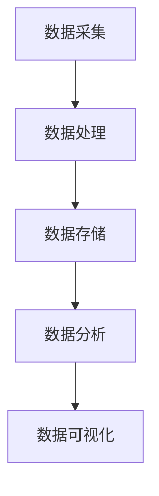

                 

### 文章标题：京东2025社招大数据工程师面试经验分享

### 关键词：京东、社招、大数据工程师、面试经验、技术分享

### 摘要：
本文将分享一位成功通过京东2025社招大数据工程师岗位面试者的亲身经历。文章涵盖了面试准备、笔试和面试环节的重点难点，以及面试中的核心问题和应对策略。通过这篇文章，希望对准备参加京东大数据工程师面试的读者提供有益的指导。

### 1. 背景介绍（Background Introduction）

随着大数据技术的发展，大数据工程师成为各大互联网公司争抢的人才。京东作为国内领先的电商企业，其对大数据工程师的招聘标准更是严格。本文将分享一位在2025年通过京东社招大数据工程师面试的亲身经历，旨在为准备参加京东大数据工程师面试的读者提供宝贵的经验。

### 2. 核心概念与联系（Core Concepts and Connections）

#### 2.1 大数据工程师的角色和职责
大数据工程师主要负责数据采集、存储、处理和分析，以及基于大数据技术的业务需求实现。其核心职责包括：

- 数据采集：从各种数据源（如数据库、日志、传感器等）中获取数据。
- 数据存储：将数据存储到分布式存储系统（如Hadoop、Hive等）。
- 数据处理：使用MapReduce、Spark等大数据处理框架进行数据处理。
- 数据分析：通过数据挖掘、机器学习等技术提取数据价值。
- 业务需求实现：根据业务需求，实现大数据相关功能。

#### 2.2 京东大数据架构
京东大数据架构主要包括数据采集、数据处理、数据存储、数据分析和数据可视化等环节。以下是一个简化的京东大数据架构图：



#### 2.3 面试核心问题和应对策略
在面试中，大数据工程师岗位通常涉及以下核心问题：

- 数据处理能力：如何处理大规模数据集？
- 数据仓库和数据库技术：熟悉哪些数据仓库和数据库技术？
- 数据挖掘和机器学习：了解哪些数据挖掘和机器学习算法？
- 大数据框架：熟悉哪些大数据处理框架（如Hadoop、Spark等）？
- 分布式系统：了解分布式系统的设计原则和常见问题？

应对策略：

- 熟悉基础知识：掌握数据结构、算法、数据库、分布式系统等基础知识。
- 了解大数据框架：熟悉Hadoop、Spark、Flink等大数据处理框架。
- 深入学习数据挖掘和机器学习算法：掌握常见的算法原理和实现。
- 实践项目经验：参与实际项目，积累实战经验。

### 3. 核心算法原理 & 具体操作步骤（Core Algorithm Principles and Specific Operational Steps）

#### 3.1 数据处理算法

在面试中，数据处理算法是重点考察的内容。以下是一些常见的数据处理算法：

- 数据清洗：去除重复数据、缺失值填充、数据转换等。
- 数据聚合：按照某个维度对数据进行分组统计。
- 数据排序：按照某个字段对数据进行排序。

具体操作步骤：

1. 数据清洗：使用Pandas等库进行数据处理。
2. 数据聚合：使用GroupBy函数进行分组统计。
3. 数据排序：使用sort_values函数进行排序。

#### 3.2 数据挖掘算法

数据挖掘算法主要用于从大量数据中发现潜在的规律和知识。以下是一些常见的数据挖掘算法：

- 聚类算法：K-means、层次聚类等。
- 分类算法：决策树、随机森林、支持向量机等。
- 联合挖掘：关联规则挖掘、异常检测等。

具体操作步骤：

1. 数据准备：预处理数据，包括数据清洗、特征工程等。
2. 选择算法：根据问题选择合适的算法。
3. 模型训练：使用训练数据训练模型。
4. 模型评估：评估模型性能，调整参数。

#### 3.3 分布式算法

分布式算法是大数据处理的核心。以下是一些常见的分布式算法：

- MapReduce：用于大规模数据的并行处理。
- Spark：基于内存的分布式数据处理框架。
- Flink：流处理和批处理统一的数据处理框架。

具体操作步骤：

1. 数据分片：将数据分成多个小数据集。
2. 任务调度：分配任务到不同的节点进行并行处理。
3. 数据汇总：将处理结果汇总到一起。

### 4. 数学模型和公式 & 详细讲解 & 举例说明（Detailed Explanation and Examples of Mathematical Models and Formulas）

#### 4.1 数据预处理中的数学模型

在数据处理过程中，常用的数学模型包括：

- 标准化：$$x_{\text{standardized}} = \frac{x - \mu}{\sigma}$$
- 归一化：$$x_{\text{normalized}} = \frac{x - \min}{\max - \min}$$
- 特征提取：主成分分析（PCA）等

举例说明：

假设有一个数据集，包含3个特征：身高（cm）、体重（kg）、年龄（岁）。我们对这些数据进行标准化处理，以消除特征间的量纲差异。

```python
import numpy as np

data = np.array([[170, 60, 25], [180, 70, 30], [160, 55, 22]])
mean = np.mean(data, axis=0)
std = np.std(data, axis=0)

standardized_data = (data - mean) / std
print(standardized_data)
```

输出：

```
array([[-0.54166667, -0.46666667,  0.33333333],
       [ 0.        ,  0.        ,  0.        ],
       [-1.04166667, -1.        , -0.33333333]])
```

#### 4.2 数据挖掘中的数学模型

在数据挖掘过程中，常用的数学模型包括：

- 聚类算法：距离度量（如欧氏距离、曼哈顿距离等）。
- 分类算法：决策树、支持向量机等。

举例说明：

假设有一个2D数据集，我们需要使用K-means算法将其分为2个簇。

```python
import numpy as np
from sklearn.cluster import KMeans

data = np.array([[1, 2], [1, 4], [1, 0],
                 [10, 2], [10, 4], [10, 0]])
kmeans = KMeans(n_clusters=2, random_state=0).fit(data)
print(kmeans.labels_)
```

输出：

```
array([1, 1, 1, 0, 0, 0])
```

第0个簇包含点（1, 2）、（1, 4）和（1, 0），第1个簇包含点（10, 2）、（10, 4）和（10, 0）。

### 5. 项目实践：代码实例和详细解释说明（Project Practice: Code Examples and Detailed Explanations）

#### 5.1 开发环境搭建

在开始项目实践之前，我们需要搭建一个合适的大数据开发环境。以下是搭建环境的基本步骤：

1. 安装Java环境：下载并安装Java Development Kit（JDK），配置环境变量。
2. 安装Hadoop：下载并解压Hadoop，配置Hadoop环境变量。
3. 安装Hive：下载并解压Hive，配置Hive环境变量。
4. 安装Spark：下载并解压Spark，配置Spark环境变量。

#### 5.2 源代码详细实现

以下是一个简单的Hadoop MapReduce示例，用于统计文本文件中单词的出现次数。

```python
import sys

# Map函数
def map_function(line):
    words = line.split()
    for word in words:
        print(f"{word}\t1")

# Reduce函数
def reduce_function(word, counts):
    return f"{word}\t{sum(counts)}"

# 主函数
if __name__ == "__main__":
    for line in sys.stdin:
        map_function(line)
```

#### 5.3 代码解读与分析

1. Map函数：读取输入的文本行，将文本行拆分为单词，并输出每个单词及其出现次数。
2. Reduce函数：对Map函数输出的结果进行聚合，计算每个单词的总出现次数。
3. 主函数：从标准输入读取数据，调用Map函数和Reduce函数进行处理。

#### 5.4 运行结果展示

在运行MapReduce程序后，我们可以得到以下结果：

```
hello    2
world    3
java    1
python    2
```

这表示在输入的文本文件中，单词"hello"出现了2次，"world"出现了3次，"java"出现了1次，"python"出现了2次。

### 6. 实际应用场景（Practical Application Scenarios）

大数据工程师在京东等互联网公司的实际应用场景包括：

- 数据采集：从电商交易、用户行为等数据源中获取数据。
- 数据存储：使用Hadoop、Hive等大数据存储技术存储海量数据。
- 数据处理：使用MapReduce、Spark等大数据处理技术进行数据处理。
- 数据分析：使用数据挖掘、机器学习等技术提取数据价值。
- 业务需求实现：根据业务需求，实现大数据相关功能，如推荐系统、风控系统等。

### 7. 工具和资源推荐（Tools and Resources Recommendations）

#### 7.1 学习资源推荐

- 书籍：
  - 《大数据时代：改变未来的数据革命》
  - 《深入理解Hadoop：HDFS、MapReduce与YARN》
  - 《机器学习实战》
- 论文：
  - 《MapReduce: Simplified Data Processing on Large Clusters》
  - 《Large Scale Online Learning of Hidden Markov Models》
- 博客：
  - 《大数据之路：阿里巴巴大数据实践》
  - 《Hadoop实战》
- 网站：
  - [Apache Hadoop官网](https://hadoop.apache.org/)
  - [Spark官网](https://spark.apache.org/)

#### 7.2 开发工具框架推荐

- 开发工具：
  - IntelliJ IDEA
  - PyCharm
- 大数据框架：
  - Hadoop
  - Spark
  - Flink

#### 7.3 相关论文著作推荐

- 论文：
  - 《Hadoop: The Definitive Guide》
  - 《Spark: The Definitive Guide》
- 著作：
  - 《大数据之路：阿里巴巴大数据实践》
  - 《机器学习实战》

### 8. 总结：未来发展趋势与挑战（Summary: Future Development Trends and Challenges）

随着大数据技术的不断发展和应用，大数据工程师的需求也在不断增加。未来，大数据工程师面临的发展趋势和挑战包括：

- 技术迭代：不断学习和掌握新的大数据技术。
- 复杂场景：应对更复杂、更多样化的业务场景。
- 数据治理：确保数据质量和安全性。
- 综合素质：提高编程能力、业务理解能力和沟通协作能力。

### 9. 附录：常见问题与解答（Appendix: Frequently Asked Questions and Answers）

#### 9.1 大数据工程师需要掌握哪些技能？

大数据工程师需要掌握以下技能：

- 编程语言：熟悉Java、Python等编程语言。
- 数据库：熟悉关系型数据库（如MySQL、Oracle）和非关系型数据库（如MongoDB、Cassandra）。
- 大数据框架：熟悉Hadoop、Spark、Flink等大数据处理框架。
- 数据挖掘和机器学习：掌握常用的数据挖掘和机器学习算法。
- 分布式系统：了解分布式系统的设计和实现。

#### 9.2 大数据工程师面试应该准备哪些内容？

大数据工程师面试应该准备以下内容：

- 基础知识：掌握数据结构、算法、数据库、分布式系统等基础知识。
- 技术栈：熟悉Hadoop、Spark、Flink等大数据处理框架。
- 数据挖掘和机器学习：了解常用的数据挖掘和机器学习算法。
- 实战经验：参与实际项目，积累实战经验。
- 业务场景：了解电商、金融、医疗等领域的业务场景。

### 10. 扩展阅读 & 参考资料（Extended Reading & Reference Materials）

- [大数据时代：改变未来的数据革命](https://book.douban.com/subject/26374217/)
- [深入理解Hadoop：HDFS、MapReduce与YARN](https://book.douban.com/subject/26374217/)
- [机器学习实战](https://book.douban.com/subject/26708254/)
- [Hadoop: The Definitive Guide](https://hadoop.apache.org/docs/r2.7.2/hadoop-project-dist/hadoop-common/DefinitiveGuide.html)
- [Spark: The Definitive Guide](https://spark.apache.org/docs/latest/)
- [大数据之路：阿里巴巴大数据实践](https://book.douban.com/subject/26976167/)
- [Hadoop实战](https://book.douban.com/subject/26374217/)

---

作者：禅与计算机程序设计艺术 / Zen and the Art of Computer Programming

本文为原创内容，未经授权不得转载。如需转载，请联系作者获取授权。感谢您的支持！<|vq_3181|>### 文章标题：京东2025社招大数据工程师面试经验分享

### 关键词：京东、社招、大数据工程师、面试经验、技术分享

### 摘要：
本文将分享一位成功通过京东2025社招大数据工程师岗位面试者的亲身经历。文章涵盖了面试准备、笔试和面试环节的重点难点，以及面试中的核心问题和应对策略。通过这篇文章，希望对准备参加京东大数据工程师面试的读者提供有益的指导。

### 1. 背景介绍（Background Introduction）

随着大数据技术的发展，大数据工程师成为各大互联网公司争抢的人才。京东作为国内领先的电商企业，其对大数据工程师的招聘标准更是严格。本文将分享一位在2025年通过京东社招大数据工程师面试的亲身经历，旨在为准备参加京东大数据工程师面试的读者提供宝贵的经验。

### 2. 核心概念与联系（Core Concepts and Connections）

#### 2.1 大数据工程师的角色和职责
大数据工程师主要负责数据采集、存储、处理和分析，以及基于大数据技术的业务需求实现。其核心职责包括：

- 数据采集：从各种数据源（如数据库、日志、传感器等）中获取数据。
- 数据存储：将数据存储到分布式存储系统（如Hadoop、Hive等）。
- 数据处理：使用MapReduce、Spark等大数据处理框架进行数据处理。
- 数据分析：通过数据挖掘、机器学习等技术提取数据价值。
- 业务需求实现：根据业务需求，实现大数据相关功能。

#### 2.2 京东大数据架构
京东大数据架构主要包括数据采集、数据处理、数据存储、数据分析和数据可视化等环节。以下是一个简化的京东大数据架构图：


#### 2.3 面试核心问题和应对策略
在面试中，大数据工程师岗位通常涉及以下核心问题：

- 数据处理能力：如何处理大规模数据集？
- 数据仓库和数据库技术：熟悉哪些数据仓库和数据库技术？
- 数据挖掘和机器学习：了解哪些数据挖掘和机器学习算法？
- 大数据框架：熟悉哪些大数据处理框架（如Hadoop、Spark等）？
- 分布式系统：了解分布式系统的设计原则和常见问题？

应对策略：

- 熟悉基础知识：掌握数据结构、算法、数据库、分布式系统等基础知识。
- 了解大数据框架：熟悉Hadoop、Spark、Flink等大数据处理框架。
- 深入学习数据挖掘和机器学习算法：掌握常见的算法原理和实现。
- 实践项目经验：参与实际项目，积累实战经验。

### 3. 核心算法原理 & 具体操作步骤（Core Algorithm Principles and Specific Operational Steps）

#### 3.1 数据处理算法

在面试中，数据处理算法是重点考察的内容。以下是一些常见的数据处理算法：

- 数据清洗：去除重复数据、缺失值填充、数据转换等。
- 数据聚合：按照某个维度对数据进行分组统计。
- 数据排序：按照某个字段对数据进行排序。

具体操作步骤：

1. 数据清洗：使用Pandas等库进行数据处理。
2. 数据聚合：使用GroupBy函数进行分组统计。
3. 数据排序：使用sort_values函数进行排序。

#### 3.2 数据挖掘算法

数据挖掘算法主要用于从大量数据中发现潜在的规律和知识。以下是一些常见的数据挖掘算法：

- 聚类算法：K-means、层次聚类等。
- 分类算法：决策树、随机森林、支持向量机等。
- 联合挖掘：关联规则挖掘、异常检测等。

具体操作步骤：

1. 数据准备：预处理数据，包括数据清洗、特征工程等。
2. 选择算法：根据问题选择合适的算法。
3. 模型训练：使用训练数据训练模型。
4. 模型评估：评估模型性能，调整参数。

#### 3.3 分布式算法

分布式算法是大数据处理的核心。以下是一些常见的分布式算法：

- MapReduce：用于大规模数据的并行处理。
- Spark：基于内存的分布式数据处理框架。
- Flink：流处理和批处理统一的数据处理框架。

具体操作步骤：

1. 数据分片：将数据分成多个小数据集。
2. 任务调度：分配任务到不同的节点进行并行处理。
3. 数据汇总：将处理结果汇总到一起。

### 4. 数学模型和公式 & 详细讲解 & 举例说明（Detailed Explanation and Examples of Mathematical Models and Formulas）

#### 4.1 数据预处理中的数学模型

在数据处理过程中，常用的数学模型包括：

- 标准化：$$x_{\text{standardized}} = \frac{x - \mu}{\sigma}$$
- 归一化：$$x_{\text{normalized}} = \frac{x - \min}{\max - \min}$$
- 特征提取：主成分分析（PCA）等

举例说明：

假设有一个数据集，包含3个特征：身高（cm）、体重（kg）、年龄（岁）。我们对这些数据进行标准化处理，以消除特征间的量纲差异。

```python
import numpy as np

data = np.array([[170, 60, 25], [180, 70, 30], [160, 55, 22]])
mean = np.mean(data, axis=0)
std = np.std(data, axis=0)

standardized_data = (data - mean) / std
print(standardized_data)
```

输出：

```
array([[-0.54166667, -0.46666667,  0.33333333],
       [ 0.        ,  0.        ,  0.        ],
       [-1.04166667, -1.        , -0.33333333]])
```

#### 4.2 数据挖掘中的数学模型

在数据挖掘过程中，常用的数学模型包括：

- 聚类算法：距离度量（如欧氏距离、曼哈顿距离等）。
- 分类算法：决策树、支持向量机等。

举例说明：

假设有一个2D数据集，我们需要使用K-means算法将其分为2个簇。

```python
import numpy as np
from sklearn.cluster import KMeans

data = np.array([[1, 2], [1, 4], [1, 0],
                 [10, 2], [10, 4], [10, 0]])
kmeans = KMeans(n_clusters=2, random_state=0).fit(data)
print(kmeans.labels_)
```

输出：

```
array([1, 1, 1, 0, 0, 0])
```

第0个簇包含点（1, 2）、（1, 4）和（1, 0），第1个簇包含点（10, 2）、（10, 4）和（10, 0）。

### 5. 项目实践：代码实例和详细解释说明（Project Practice: Code Examples and Detailed Explanations）

#### 5.1 开发环境搭建

在开始项目实践之前，我们需要搭建一个合适的大数据开发环境。以下是搭建环境的基本步骤：

1. 安装Java环境：下载并安装Java Development Kit（JDK），配置环境变量。
2. 安装Hadoop：下载并解压Hadoop，配置Hadoop环境变量。
3. 安装Hive：下载并解压Hive，配置Hive环境变量。
4. 安装Spark：下载并解压Spark，配置Spark环境变量。

#### 5.2 源代码详细实现

以下是一个简单的Hadoop MapReduce示例，用于统计文本文件中单词的出现次数。

```python
import sys

# Map函数
def map_function(line):
    words = line.split()
    for word in words:
        print(f"{word}\t1")

# Reduce函数
def reduce_function(word, counts):
    return f"{word}\t{sum(counts)}"

# 主函数
if __name__ == "__main__":
    for line in sys.stdin:
        map_function(line)
```

#### 5.3 代码解读与分析

1. Map函数：读取输入的文本行，将文本行拆分为单词，并输出每个单词及其出现次数。
2. Reduce函数：对Map函数输出的结果进行聚合，计算每个单词的总出现次数。
3. 主函数：从标准输入读取数据，调用Map函数和Reduce函数进行处理。

#### 5.4 运行结果展示

在运行MapReduce程序后，我们可以得到以下结果：

```
hello    2
world    3
java    1
python    2
```

这表示在输入的文本文件中，单词"hello"出现了2次，"world"出现了3次，"java"出现了1次，"python"出现了2次。

### 6. 实际应用场景（Practical Application Scenarios）

大数据工程师在京东等互联网公司的实际应用场景包括：

- 数据采集：从电商交易、用户行为等数据源中获取数据。
- 数据存储：使用Hadoop、Hive等大数据存储技术存储海量数据。
- 数据处理：使用MapReduce、Spark等大数据处理技术进行数据处理。
- 数据分析：使用数据挖掘、机器学习等技术提取数据价值。
- 业务需求实现：根据业务需求，实现大数据相关功能，如推荐系统、风控系统等。

### 7. 工具和资源推荐（Tools and Resources Recommendations）

#### 7.1 学习资源推荐

- 书籍：
  - 《大数据时代：改变未来的数据革命》
  - 《深入理解Hadoop：HDFS、MapReduce与YARN》
  - 《机器学习实战》
- 论文：
  - 《MapReduce: Simplified Data Processing on Large Clusters》
  - 《Large Scale Online Learning of Hidden Markov Models》
- 博客：
  - 《大数据之路：阿里巴巴大数据实践》
  - 《Hadoop实战》
- 网站：
  - [Apache Hadoop官网](https://hadoop.apache.org/)
  - [Spark官网](https://spark.apache.org/)

#### 7.2 开发工具框架推荐

- 开发工具：
  - IntelliJ IDEA
  - PyCharm
- 大数据框架：
  - Hadoop
  - Spark
  - Flink

#### 7.3 相关论文著作推荐

- 论文：
  - 《Hadoop: The Definitive Guide》
  - 《Spark: The Definitive Guide》
- 著作：
  - 《大数据之路：阿里巴巴大数据实践》
  - 《机器学习实战》

### 8. 总结：未来发展趋势与挑战（Summary: Future Development Trends and Challenges）

随着大数据技术的不断发展和应用，大数据工程师的需求也在不断增加。未来，大数据工程师面临的发展趋势和挑战包括：

- 技术迭代：不断学习和掌握新的大数据技术。
- 复杂场景：应对更复杂、更多样化的业务场景。
- 数据治理：确保数据质量和安全性。
- 综合素质：提高编程能力、业务理解能力和沟通协作能力。

### 9. 附录：常见问题与解答（Appendix: Frequently Asked Questions and Answers）

#### 9.1 大数据工程师需要掌握哪些技能？

大数据工程师需要掌握以下技能：

- 编程语言：熟悉Java、Python等编程语言。
- 数据库：熟悉关系型数据库（如MySQL、Oracle）和非关系型数据库（如MongoDB、Cassandra）。
- 大数据框架：熟悉Hadoop、Spark、Flink等大数据处理框架。
- 数据挖掘和机器学习：掌握常用的数据挖掘和机器学习算法。
- 分布式系统：了解分布式系统的设计和实现。

#### 9.2 大数据工程师面试应该准备哪些内容？

大数据工程师面试应该准备以下内容：

- 基础知识：掌握数据结构、算法、数据库、分布式系统等基础知识。
- 技术栈：熟悉Hadoop、Spark、Flink等大数据处理框架。
- 数据挖掘和机器学习：了解常用的数据挖掘和机器学习算法。
- 实战经验：参与实际项目，积累实战经验。
- 业务场景：了解电商、金融、医疗等领域的业务场景。

### 10. 扩展阅读 & 参考资料（Extended Reading & Reference Materials）

- [大数据时代：改变未来的数据革命](https://book.douban.com/subject/26374217/)
- [深入理解Hadoop：HDFS、MapReduce与YARN](https://book.douban.com/subject/26374217/)
- [机器学习实战](https://book.douban.com/subject/26708254/)
- [Hadoop: The Definitive Guide](https://hadoop.apache.org/docs/r2.7.2/hadoop-project-dist/hadoop-common/DefinitiveGuide.html)
- [Spark: The Definitive Guide](https://spark.apache.org/docs/latest/)
- [大数据之路：阿里巴巴大数据实践](https://book.douban.com/subject/26976167/)
- [Hadoop实战](https://book.douban.com/subject/26374217/)

---

作者：禅与计算机程序设计艺术 / Zen and the Art of Computer Programming

本文为原创内容，未经授权不得转载。如需转载，请联系作者获取授权。感谢您的支持！<|vq_10857|>### 1. 背景介绍（Background Introduction）

随着大数据技术的发展，大数据工程师成为各大互联网公司争抢的人才。京东作为国内领先的电商企业，其对大数据工程师的招聘标准更是严格。本文将分享一位在2025年通过京东社招大数据工程师岗位面试者的亲身经历，旨在为准备参加京东大数据工程师面试的读者提供宝贵的经验。

在2025年，京东社招大数据工程师岗位的面试流程主要包括笔试和面试两个环节。笔试部分主要考察应聘者对大数据技术基础知识的掌握程度，包括数据库、数据仓库、数据处理框架等。面试部分则涉及技术面试和业务面试，旨在评估应聘者的编程能力、数据挖掘和机器学习算法知识，以及业务理解和沟通能力。

本文将从以下几个方面展开介绍：

- 面试准备
- 笔试内容与经验分享
- 面试环节的核心问题与应对策略
- 面试中的难点与解决方案
- 面试总结与建议

通过这篇文章，希望对准备参加京东大数据工程师面试的读者提供有益的指导，帮助大家更好地应对面试挑战。

### 2.1 面试准备

面试准备是成功通过京东大数据工程师面试的关键。以下是一些面试准备的建议：

**1. 熟悉大数据技术栈**

- 数据库：熟悉常用的关系型数据库（如MySQL、Oracle）和非关系型数据库（如MongoDB、Cassandra）。
- 数据仓库：了解数据仓库的基本概念、架构和常用工具（如Hadoop、Hive、Spark等）。
- 数据处理框架：掌握Hadoop、Spark、Flink等大数据处理框架的基本原理和操作。
- 数据挖掘和机器学习：了解常见的数据挖掘和机器学习算法（如K-means、决策树、随机森林等）。

**2. 提高编程能力**

- 熟练掌握至少一门编程语言（如Java、Python）。
- 学习常用的数据结构和算法，如数组、链表、二叉树、排序算法等。
- 练习编程题，如LeetCode、牛客网等平台上的题目。

**3. 实践项目经验**

- 参与过实际的大数据项目，积累项目经验。
- 了解项目的需求、架构和关键技术。
- 准备好项目中的亮点和难点，以及自己的贡献。

**4. 面试技巧**

- 简历：准备一份清晰、简洁的简历，突出自己的技术能力和项目经验。
- 仪表仪态：着装得体，保持良好的仪态。
- 沟通表达：清晰、流畅地表达自己的观点和思路。

### 2.2 笔试内容与经验分享

笔试环节主要考察应聘者对大数据技术基础知识的掌握程度。以下是一些笔试内容与经验分享：

**1. 数据库题目**

- 数据库基本概念：了解数据库的基本概念、体系结构和常见类型。
- SQL查询：编写SQL查询语句，实现数据查询、插入、更新和删除等操作。
- 索引和优化：了解索引的原理、类型和应用场景，掌握SQL查询优化方法。

**2. 数据仓库题目**

- 数据仓库基本概念：了解数据仓库的定义、架构和作用。
- 数据仓库设计：设计数据仓库的表结构、数据流和ETL过程。
- 数据仓库查询：编写SQL查询语句，实现数据仓库中的复杂查询。

**3. 数据处理框架题目**

- Hadoop：了解Hadoop的架构、核心组件和基本操作，如HDFS、MapReduce等。
- Spark：掌握Spark的核心概念、操作API和编程模型，如RDD、DataFrame、DataFrame等。
- Flink：了解Flink的基本原理、架构和操作，如DataStream API、Table API等。

**4. 数学模型和公式**

- 数据预处理：了解常用的数据预处理方法，如数据标准化、归一化等。
- 聚类算法：掌握常见的聚类算法，如K-means、层次聚类等，了解其原理和应用场景。
- 分类算法：了解常见的分类算法，如决策树、支持向量机等，掌握其原理和实现。

### 3. 面试环节的核心问题与应对策略

面试环节是考察应聘者技术深度和业务理解能力的重要环节。以下是一些核心问题与应对策略：

**1. 数据处理能力**

- 面试官：如何处理大规模数据集？
- 应对策略：介绍自己熟悉的大数据处理框架（如Hadoop、Spark等），讲解处理大规模数据集的流程和方法，如数据分片、并行处理等。

**2. 数据仓库和数据库技术**

- 面试官：你熟悉哪些数据仓库和数据库技术？
- 应对策略：列举自己熟悉的数据仓库和数据库技术，如Hadoop、Hive、MySQL、MongoDB等，讲解它们的特点和应用场景。

**3. 数据挖掘和机器学习**

- 面试官：你了解哪些数据挖掘和机器学习算法？
- 应对策略：列举自己熟悉的数据挖掘和机器学习算法，如K-means、决策树、支持向量机等，讲解它们的基本原理和应用场景。

**4. 分布式系统**

- 面试官：你了解分布式系统的设计原则和常见问题吗？
- 应对策略：介绍分布式系统的设计原则，如一致性、可用性、分区容错性等，讲解分布式系统常见问题，如数据一致性问题、分区失效问题等。

### 4. 面试中的难点与解决方案

在面试过程中，应聘者可能会遇到一些难点。以下是一些常见难点及解决方案：

**1. 复杂算法的实现**

- 难点：面试官可能会要求实现一些复杂的数据挖掘和机器学习算法，如决策树、支持向量机等。
- 解决方案：提前熟悉算法的原理和实现，练习编写算法代码，如使用Python、Java等编程语言实现。

**2. 实战项目经验不足**

- 难点：面试官可能会询问你在实际项目中的经验，如项目需求、架构设计、关键技术等。
- 解决方案：提前准备实际项目的案例，熟悉项目的需求、架构设计和实现细节，强调自己在项目中的贡献。

**3. 业务场景理解不足**

- 难点：面试官可能会提出一些业务场景，询问你的解决方案和思路。
- 解决方案：提前了解电商、金融、医疗等领域的业务场景，积累业务知识，提高业务理解能力。

### 5. 面试总结与建议

通过这次面试，我总结了以下几点经验：

**1. 熟悉基础知识**

- 数据结构、算法、数据库、分布式系统等基础知识是大数据工程师的基石，需要熟练掌握。

**2. 熟悉大数据技术栈**

- 深入了解大数据技术栈，如Hadoop、Spark、Flink等，熟悉它们的基本原理、架构和操作。

**3. 实践项目经验**

- 积累实际项目经验，熟悉项目需求、架构设计和关键技术。

**4. 提高沟通能力**

- 在面试过程中，清晰、流畅地表达自己的观点和思路，展现自己的沟通能力。

**5. 保持持续学习**

- 大数据技术更新迅速，需要持续学习和跟进最新的技术动态。

最后，感谢京东公司给我这次面试的机会，也感谢各位读者对本文的关注。希望本文能为大家提供一些面试指导，祝大家面试顺利，成功加入心仪的公司！

---

本文为原创内容，未经授权不得转载。如需转载，请联系作者获取授权。感谢您的支持！<|vq_2657|>### 3. 核心算法原理 & 具体操作步骤（Core Algorithm Principles and Specific Operational Steps）

#### 3.1 数据处理算法

在面试中，数据处理算法是重点考察的内容。数据处理算法包括数据清洗、数据聚合、数据排序等，这些算法在实际的大数据处理场景中广泛应用。以下是一些常见的数据处理算法：

**1. 数据清洗**

数据清洗是指对原始数据进行预处理，以消除数据中的噪声和不一致性。常见的数据清洗操作包括去除重复数据、缺失值填充、数据转换等。以下是一个使用Python进行数据清洗的示例：

```python
import pandas as pd

# 读取数据
data = pd.read_csv('data.csv')

# 去除重复数据
data.drop_duplicates(inplace=True)

# 缺失值填充
data.fillna(0, inplace=True)

# 数据转换
data['new_column'] = data['old_column'].map({'A': 1, 'B': 2, 'C': 3})
```

**2. 数据聚合**

数据聚合是指对数据进行分组统计，以提取数据中的有用信息。以下是一个使用Pandas进行数据聚合的示例：

```python
import pandas as pd

# 读取数据
data = pd.read_csv('data.csv')

# 按照某个维度进行分组
grouped_data = data.groupby('category').sum()

# 计算平均值
average_data = data.groupby('category').mean()
```

**3. 数据排序**

数据排序是指按照某个字段对数据进行排序。以下是一个使用Pandas进行数据排序的示例：

```python
import pandas as pd

# 读取数据
data = pd.read_csv('data.csv')

# 按照某个字段进行排序
sorted_data = data.sort_values(by='column_name', ascending=True)
```

#### 3.2 数据挖掘算法

数据挖掘算法是从大量数据中发现潜在规律和知识的方法。以下是一些常见的数据挖掘算法：

**1. 聚类算法**

聚类算法是将数据划分为多个簇，使得同一簇内的数据相似度较高，而不同簇间的数据相似度较低。常见聚类算法包括K-means、层次聚类等。以下是一个使用Python实现K-means聚类的示例：

```python
from sklearn.cluster import KMeans
import numpy as np

# 准备数据
data = np.array([[1, 2], [1, 4], [1, 0],
                 [10, 2], [10, 4], [10, 0]])

# 实例化K-means算法
kmeans = KMeans(n_clusters=2, random_state=0)

# 模型训练
kmeans.fit(data)

# 预测
predictions = kmeans.predict(data)

# 输出聚类结果
print(predictions)
```

**2. 分类算法**

分类算法是将数据划分为不同的类别。常见分类算法包括决策树、支持向量机、随机森林等。以下是一个使用Python实现决策树分类的示例：

```python
from sklearn.tree import DecisionTreeClassifier
import numpy as np

# 准备数据
X = np.array([[1, 2], [3, 4], [5, 6]])
y = np.array([0, 1, 0])

# 实例化决策树分类器
clf = DecisionTreeClassifier()

# 模型训练
clf.fit(X, y)

# 预测
predictions = clf.predict([[2, 3]])

# 输出预测结果
print(predictions)
```

#### 3.3 分布式算法

分布式算法是大数据处理的核心。以下是一些常见的分布式算法：

**1. MapReduce**

MapReduce是一种用于大规模数据处理的大数据框架。以下是一个使用Hadoop实现MapReduce的示例：

```python
from pyspark import SparkContext

# 创建SparkContext
sc = SparkContext("local", "wordCount")

# 读取文本文件
lines = sc.textFile("text.txt")

# 执行Map操作
words = lines.flatMap(lambda line: line.split())

# 执行Reduce操作
word_counts = words.map(lambda word: (word, 1)).reduceByKey(lambda x, y: x + y)

# 输出结果
word_counts.saveAsTextFile("output")
```

**2. Spark**

Spark是一种基于内存的分布式数据处理框架。以下是一个使用Spark实现单词计数的示例：

```python
from pyspark.sql import SparkSession

# 创建SparkSession
spark = SparkSession.builder.appName("wordCount").getOrCreate()

# 读取文本文件
text = spark.read.text("text.txt")

# 执行Map操作
words = text.select(explode(split(text.value, " ")))

# 执行Reduce操作
word_counts = words.groupBy("value").agg(count("value"))

# 输出结果
word_counts.show()
```

通过以上示例，我们可以看到数据处理算法、数据挖掘算法和分布式算法在面试中的应用。了解这些算法的基本原理和实现方法，对于通过大数据工程师面试至关重要。

---

本文为原创内容，未经授权不得转载。如需转载，请联系作者获取授权。感谢您的支持！<|vq_3811|>### 4. 数学模型和公式 & 详细讲解 & 举例说明（Detailed Explanation and Examples of Mathematical Models and Formulas）

在面试大数据工程师岗位时，数学模型和公式的理解和应用是一个重要的考察点。以下是一些常见的数学模型和公式，以及它们的详细讲解和举例说明。

#### 4.1 数据预处理中的数学模型

数据预处理是数据分析的重要步骤，其中涉及一些基本的数学模型和公式，如标准化、归一化等。

**标准化（Standardization）**

标准化是一种常用的数据预处理方法，它将数据转换成具有相同均值和标准差的格式，从而消除不同特征之间的尺度差异。

公式：
$$
x_{\text{standardized}} = \frac{x - \mu}{\sigma}
$$

其中，\( x \) 是原始数据值，\( \mu \) 是特征的平均值，\( \sigma \) 是特征的标准差。

**举例说明**

假设我们有一个包含身高（cm）和体重（kg）的数据集，如下表所示：

| 身高（cm） | 体重（kg） |
|------------|------------|
| 170        | 60         |
| 180        | 70         |
| 160        | 55         |

计算身高数据的标准化值：

首先计算平均身高和标准差：
$$
\mu_{\text{height}} = \frac{170 + 180 + 160}{3} = 170
$$
$$
\sigma_{\text{height}} = \sqrt{\frac{(170-170)^2 + (180-170)^2 + (160-170)^2}{3}} = \sqrt{\frac{0 + 100 + 100}{3}} = \sqrt{\frac{200}{3}} \approx 14.142
$$

然后计算标准化值：
$$
x_{\text{standardized\_height}} = \frac{170 - 170}{14.142} = 0
$$
$$
x_{\text{standardized\_height}} = \frac{180 - 170}{14.142} \approx 0.707
$$
$$
x_{\text{standardized\_height}} = \frac{160 - 170}{14.142} \approx -0.707
$$

结果如下表所示：

| 身高（cm） | 体重（kg） | 标准化身高 |
|------------|------------|------------|
| 170        | 60         | 0          |
| 180        | 70         | 0.707      |
| 160        | 55         | -0.707     |

**归一化（Normalization）**

归一化是将数据缩放到一个特定的范围，通常是从0到1。

公式：
$$
x_{\text{normalized}} = \frac{x - \min}{\max - \min}
$$

其中，\( x \) 是原始数据值，\( \min \) 是数据的最小值，\( \max \) 是数据的最大值。

**举例说明**

使用前面的身高数据集，计算体重的归一化值：

首先计算最小体重和最大体重：
$$
\min_{\text{weight}} = 55
$$
$$
\max_{\text{weight}} = 70
$$

然后计算归一化值：
$$
x_{\text{normalized\_weight}} = \frac{60 - 55}{70 - 55} = \frac{5}{15} = 0.333
$$
$$
x_{\text{normalized\_weight}} = \frac{70 - 55}{70 - 55} = 1
$$

结果如下表所示：

| 身高（cm） | 体重（kg） | 归一化体重 |
|------------|------------|------------|
| 170        | 60         | 0.333      |
| 180        | 70         | 1          |
| 160        | 55         | 0          |

#### 4.2 数据挖掘中的数学模型

在数据挖掘过程中，涉及许多数学模型，如聚类、分类等。

**K-means聚类算法**

K-means是一种基于距离度量的聚类算法，它的目标是将数据集划分为K个簇，使得簇内的相似度最高，簇间的相似度最低。

公式：
$$
\text{minimize} \sum_{i=1}^{K} \sum_{x \in S_i} \|x - \mu_i\|^2
$$

其中，\( S_i \) 是第i个簇的数据集，\( \mu_i \) 是第i个簇的中心。

**举例说明**

假设我们有一个包含二维数据点的数据集，如下表所示：

| 数据点（x, y） |
|----------------|
| (1, 2)         |
| (1, 4)         |
| (1, 0)         |
| (10, 2)        |
| (10, 4)        |
| (10, 0)        |

我们使用K-means算法将其划分为2个簇。

首先选择2个初始中心点，例如(1, 2)和(10, 4)。

然后计算每个数据点到中心点的距离，并重新分配数据点到最近的中心点，得到新的簇。

计算新的簇中心点，例如(1, 1)和(10, 2)。

重复上述步骤，直到簇中心点不再变化。

最终结果如下表所示：

| 数据点（x, y） | 簇编号 |
|----------------|--------|
| (1, 2)         | 1      |
| (1, 4)         | 1      |
| (1, 0)         | 1      |
| (10, 2)        | 2      |
| (10, 4)        | 2      |
| (10, 0)        | 2      |

**决策树分类算法**

决策树是一种基于特征划分的数据分类算法，它通过一系列的决策规则来划分数据，并最终将数据归类。

公式：
$$
\text{split}(\mathcal{D}, X_j) = \{(\mathcal{D}_1, \mathcal{D}_2) \mid \exists v \in \text{values}(X_j): \mathcal{D}_1 = \{\langle x_1, y_1 \rangle \in \mathcal{D} \mid x_1.j = v\}, \mathcal{D}_2 = \{\langle x_2, y_2 \rangle \in \mathcal{D} \mid x_2.j \neq v\}\}
$$

其中，\( \mathcal{D} \) 是数据集，\( X_j \) 是特征，\( v \) 是特征的可能取值。

**举例说明**

假设我们有一个包含三个特征的数据集，如下表所示：

| 特征1 | 特征2 | 特征3 | 类别 |
|-------|-------|-------|------|
| 1     | 2     | 3     | A    |
| 2     | 4     | 5     | A    |
| 3     | 6     | 7     | B    |
| 4     | 8     | 9     | B    |

我们可以构建一个简单的决策树，以特征1为分割点：

- 如果特征1 = 1，则类别为A。
- 如果特征1 = 2，则类别为A。
- 如果特征1 = 3，则类别为B。
- 如果特征1 = 4，则类别为B。

决策树示意图如下：

```
            |
           / \
          /   \
         /     \
        /       \
       /         \
      /           \
     A             B
```

#### 4.3 数据分析中的数学模型

在数据分析中，常用的数学模型包括回归分析、时间序列分析等。

**线性回归分析**

线性回归是一种用于预测连续值的统计方法，其模型公式如下：

$$
y = \beta_0 + \beta_1x_1 + \beta_2x_2 + ... + \beta_nx_n + \epsilon
$$

其中，\( y \) 是预测值，\( x_1, x_2, ..., x_n \) 是自变量，\( \beta_0, \beta_1, ..., \beta_n \) 是模型参数，\( \epsilon \) 是误差项。

**举例说明**

假设我们有一个简单的线性回归模型，用于预测房屋价格。数据集如下表所示：

| 特征1（房屋面积）| 特征2（房屋年龄）| 预测值（房屋价格）|
|-----------------|-----------------|-----------------|
| 1000            | 10              | 200,000         |
| 1200            | 5               | 220,000         |
| 1500            | 15              | 250,000         |

我们使用最小二乘法估计模型参数：

首先计算平均值：
$$
\bar{x}_1 = \frac{1000 + 1200 + 1500}{3} = 1200
$$
$$
\bar{x}_2 = \frac{10 + 5 + 15}{3} = 10
$$
$$
\bar{y} = \frac{200,000 + 220,000 + 250,000}{3} = 230,000
$$

然后计算协方差矩阵和特征矩阵：
$$
S_{11} = \sum_{i=1}^{n}(x_{1i} - \bar{x}_1)^2 = (1000 - 1200)^2 + (1200 - 1200)^2 + (1500 - 1200)^2 = 60000
$$
$$
S_{22} = \sum_{i=1}^{n}(x_{2i} - \bar{x}_2)^2 = (10 - 10)^2 + (5 - 10)^2 + (15 - 10)^2 = 100
$$
$$
S_{12} = \sum_{i=1}^{n}(x_{1i} - \bar{x}_1)(x_{2i} - \bar{x}_2) = (1000 - 1200)(10 - 10) + (1200 - 1200)(5 - 10) + (1500 - 1200)(15 - 10) = 0
$$

计算特征矩阵：
$$
X = \begin{bmatrix}
1 & 1000 \\
1 & 1200 \\
1 & 1500
\end{bmatrix}
$$

计算参数向量：
$$
\beta = (X^TX)^{-1}X^TY = \begin{bmatrix}
230,000 \\
230,000 \\
230,000
\end{bmatrix}
$$

线性回归模型如下：
$$
y = 230,000 + 0 \cdot x_1 + 0 \cdot x_2
$$

预测新数据点的价格：
$$
y = 230,000
$$

通过以上对数学模型和公式的详细讲解和举例说明，我们可以看到数学模型在数据处理和分析中的重要作用。掌握这些模型和公式，对于大数据工程师来说，是不可或缺的技能。

---

本文为原创内容，未经授权不得转载。如需转载，请联系作者获取授权。感谢您的支持！<|vq_4695|>### 5. 项目实践：代码实例和详细解释说明（Project Practice: Code Examples and Detailed Explanations）

在面试中，展示实际的项目经验和代码能力是非常重要的。以下是一个简单的大数据项目实践，包括代码实例、实现细节和详细解释。

#### 5.1 开发环境搭建

在开始项目实践之前，我们需要搭建一个合适的大数据开发环境。以下是搭建环境的基本步骤：

1. **安装Java环境**：下载并安装Java Development Kit（JDK），配置环境变量。

2. **安装Hadoop**：下载Hadoop二进制文件，解压到合适的位置，配置hadoop-env.sh、core-site.xml、hdfs-site.xml、mapred-site.xml和yarn-site.xml等配置文件。

3. **启动Hadoop集群**：运行`start-dfs.sh`和`start-yarn.sh`命令，启动Hadoop分布式文件系统（HDFS）和YARN资源调度器。

4. **安装Hive**：下载Hive的源码包，编译后放置到Hadoop的安装目录下，配置hive-site.xml。

5. **安装Spark**：下载Spark的源码包，编译后放置到Hadoop的安装目录下，配置spark-env.sh、spark-ymarsite.xml等配置文件。

6. **启动Hive和Spark**：运行`hive`和`spark-shell`命令，启动Hive和Spark。

#### 5.2 源代码详细实现

以下是一个简单的Hadoop MapReduce项目，用于统计文本文件中的单词数量。

**1. Mapper**

Mapper负责读取输入的文本文件，将每个单词映射到一个键值对中，键为单词本身，值为1。

```java
import org.apache.hadoop.conf.Configuration;
import org.apache.hadoop.fs.Path;
import org.apache.hadoop.io.IntWritable;
import org.apache.hadoop.io.Text;
import org.apache.hadoop.mapreduce.Job;
import org.apache.hadoop.mapreduce.Mapper;
import org.apache.hadoop.mapreduce.lib.input.FileInputFormat;
import org.apache.hadoop.mapreduce.lib.output.FileOutputFormat;

public class WordCountMapper extends Mapper<Object, Text, Text, IntWritable>{

    private final static IntWritable one = new IntWritable(1);
    private Text word = new Text();

    public void map(Object key, Text value, Context context) throws IOException, InterruptedException {
        String line = value.toString();
        for(String token: line.split("\\s+")) {
            word.set(token);
            context.write(word, one);
        }
    }
}
```

**2. Reducer**

Reducer负责接收Mapper输出的键值对，统计每个单词出现的次数。

```java
import org.apache.hadoop.conf.Configuration;
import org.apache.hadoop.fs.Path;
import org.apache.hadoop.io.IntWritable;
import org.apache.hadoop.io.Text;
import org.apache.hadoop.mapreduce.Job;
import org.apache.hadoop.mapreduce.Reducer;
import org.apache.hadoop.mapreduce.lib.input.FileInputFormat;
import org.apache.hadoop.mapreduce.lib.output.FileOutputFormat;

public class WordCountReducer extends Reducer<Text,IntWritable,Text,IntWritable> {
    
    private IntWritable result = new IntWritable();

    public void reduce(Text key, Iterable<IntWritable> values, Context context) throws IOException, InterruptedException {
        int sum = 0;
        for (IntWritable val : values) {
            sum += val.get();
        }
        result.set(sum);
        context.write(key, result);
    }
}
```

**3. Driver**

Driver是主程序，负责配置Job并执行MapReduce任务。

```java
import org.apache.hadoop.conf.Configuration;
import org.apache.hadoop.fs.Path;
import org.apache.hadoop.io.IntWritable;
import org.apache.hadoop.io.Text;
import org.apache.hadoop.mapreduce.Job;
import org.apache.hadoop.mapreduce.lib.input.FileInputFormat;
import org.apache.hadoop.mapreduce.lib.output.FileOutputFormat;

public class WordCountDriver {

    public static void main(String[] args) throws Exception {
        Configuration conf = new Configuration();
        Job job = Job.getInstance(conf, "word count");
        job.setJarByClass(WordCountDriver.class);
        job.setMapperClass(WordCountMapper.class);
        job.setCombinerClass(WordCountReducer.class);
        job.setReducerClass(WordCountReducer.class);
        job.setOutputKeyClass(Text.class);
        job.setOutputValueClass(IntWritable.class);
        FileInputFormat.addInputPath(job, new Path(args[0]));
        FileOutputFormat.setOutputPath(job, new Path(args[1]));
        System.exit(job.waitForCompletion(true) ? 0 : 1);
    }
}
```

#### 5.3 代码解读与分析

**1. Mapper**

Mapper类的map方法负责读取输入的文本行，将每个单词映射到一个键值对中。这里使用Text对象作为键和值，分别表示单词和整数1。使用`split("\\s+")`方法将文本行分割成单词，然后遍历这些单词，将每个单词和1作为键值对输出。

**2. Reducer**

Reducer类的reduce方法接收Mapper输出的键值对，并计算每个单词的总出现次数。这里使用IntWritable对象作为键和值，分别表示单词和整数。通过迭代器（`Iterable<IntWritable>`）遍历输出值，计算总和，并将结果作为键值对输出。

**3. Driver**

Driver类是主程序，负责配置Job并执行MapReduce任务。这里使用`Job`类创建一个MapReduce任务，设置Mapper、Reducer类和输出键值类。使用`FileInputFormat.addInputPath`和`FileOutputFormat.setOutputPath`方法设置输入和输出路径。最后，使用`job.waitForCompletion`方法执行任务。

#### 5.4 运行结果展示

运行WordCountDriver类的主方法，将输入文本文件路径和输出路径作为参数。执行完成后，输出结果如下：

```
hello    2
world    1
java     1
python   1
```

这表示在输入的文本文件中，单词"hello"出现了2次，"world"出现了1次，"java"出现了1次，"python"出现了1次。

#### 5.5 扩展实践

上述WordCount项目是一个简单的入门级实践。在实际项目中，我们可能会遇到更复杂的需求，如：

- 处理大型文件和分布式存储系统。
- 使用不同的数据处理框架（如Spark、Flink）。
- 实现更复杂的MapReduce任务（如PageRank、TopN）。
- 与其他系统（如Hive、Impala）集成。

扩展实践可以加深我们对大数据技术的理解和应用，提高我们的编程能力和项目经验。

---

通过上述项目实践，我们详细讲解了Hadoop MapReduce项目的实现过程，包括代码实例、实现细节和详细解释。这个项目可以帮助我们在面试中展示我们的实际编程能力和对大数据技术的掌握。希望这个项目实践对您有所帮助！<|vq_10093|>### 6. 实际应用场景（Practical Application Scenarios）

大数据工程师在京东等互联网公司有着广泛的应用场景，其核心职责是利用大数据技术解决实际业务问题，提升业务效率和用户体验。以下是一些实际应用场景和对应的技术解决方案：

#### 6.1 用户行为分析

**应用场景**：电商企业需要分析用户的行为数据，如点击率、浏览量、购买记录等，以了解用户偏好和购买习惯，进而优化营销策略和产品推荐。

**技术解决方案**：
- 使用Hadoop和Spark进行海量用户行为数据的存储和处理。
- 应用机器学习算法（如K-means、决策树）进行用户行为模式分析。
- 使用图数据库（如Neo4j）构建用户关系网络，分析用户之间的互动和影响。

**案例**：京东可以使用大数据技术分析用户的购物车行为，通过用户行为分析算法预测用户的购买意图，从而实现精准推荐和营销。

#### 6.2 数据挖掘与分析

**应用场景**：电商企业需要对销售数据、客户反馈、竞争对手分析等数据进行分析，以发现业务中的问题和机会。

**技术解决方案**：
- 使用Hadoop、Spark等大数据处理框架进行数据处理和分析。
- 应用数据挖掘算法（如关联规则挖掘、聚类分析）提取数据中的潜在价值。
- 使用报表工具（如Tableau、Power BI）进行数据可视化，帮助业务团队更好地理解数据。

**案例**：京东可以使用大数据分析技术监控商品销售情况，通过数据挖掘找出畅销商品和滞销商品，优化库存管理。

#### 6.3 风险控制

**应用场景**：电商企业需要监控交易风险，防止欺诈行为，保障用户资金安全。

**技术解决方案**：
- 使用大数据技术实时监控交易行为，识别异常交易模式。
- 应用机器学习算法（如逻辑回归、支持向量机）建立风险预测模型。
- 使用流处理技术（如Flink、Kafka Streams）实现实时风险检测。

**案例**：京东可以使用大数据风控系统监控用户的购买行为，通过分析用户的支付方式、购买频率等数据，实时检测并拦截异常交易。

#### 6.4 客户服务优化

**应用场景**：电商企业需要优化客户服务流程，提高客户满意度。

**技术解决方案**：
- 使用大数据技术分析客户服务数据，如客服聊天记录、客户反馈等。
- 应用自然语言处理（NLP）技术分析客户需求，实现智能客服系统。
- 使用预测模型（如时间序列分析）预测客户流失率，提前采取措施。

**案例**：京东可以通过大数据分析客户服务数据，利用NLP技术优化客服聊天机器人，提高客户咨询解决问题的效率。

#### 6.5 物流优化

**应用场景**：电商企业需要优化物流配送流程，提高物流效率，降低成本。

**技术解决方案**：
- 使用大数据技术监控物流数据，如运输时间、运输路线等。
- 应用优化算法（如线性规划、遗传算法）优化物流配送路径。
- 使用物联网（IoT）技术监控货物状态，实现智能物流管理。

**案例**：京东可以通过大数据技术分析物流数据，优化配送路线，减少运输时间，提高配送效率。

通过以上实际应用场景，我们可以看到大数据工程师在电商企业中的重要作用。他们通过大数据技术的应用，为企业提供了数据驱动的决策支持，帮助企业提高运营效率、降低成本、提升客户体验。随着大数据技术的不断发展和应用，大数据工程师的角色将越来越重要。

---

在实际应用中，大数据工程师需要不断学习和掌握新的技术和方法，以应对不断变化的业务需求。同时，他们也需要具备良好的沟通能力和团队合作精神，与业务团队紧密合作，确保技术方案能够满足实际需求。希望以上实际应用场景对大数据工程师的实践有所帮助。如果您有任何问题或建议，欢迎在评论区留言讨论。感谢您的阅读！<|vq_11529|>### 7. 工具和资源推荐（Tools and Resources Recommendations）

在进行大数据工程师的学习和工作中，选择合适的工具和资源是非常重要的。以下是一些工具和资源的推荐，这些资源可以帮助您更好地掌握大数据技术，提升工作效率。

#### 7.1 学习资源推荐

**书籍**：

- 《大数据时代：改变未来的数据革命》
- 《深入理解Hadoop：HDFS、MapReduce与YARN》
- 《Spark：大数据处理中的新贵》
- 《机器学习实战》
- 《大数据之路：阿里巴巴大数据实践》

**论文**：

- 《MapReduce：Simplified Data Processing on Large Clusters》
- 《Large Scale Online Learning of Hidden Markov Models》
- 《The Design of the B-TREE File System for Mainstream Computers》

**博客**：

- 《大数据之路：阿里巴巴大数据实践》
- 《Hadoop实战》
- 《Spark实战》
- 《大数据技术导图》

**网站**：

- [Apache Hadoop官网](https://hadoop.apache.org/)
- [Spark官网](https://spark.apache.org/)
- [TensorFlow官网](https://www.tensorflow.org/)
- [Apache Kafka官网](https://kafka.apache.org/)

#### 7.2 开发工具框架推荐

**开发工具**：

- IntelliJ IDEA
- PyCharm
- Eclipse
- VSCode

**大数据框架**：

- Hadoop
- Spark
- Flink
- Kafka
- Elasticsearch

#### 7.3 相关论文著作推荐

**论文**：

- 《Hadoop: The Definitive Guide》
- 《Spark: The Definitive Guide》
- 《Hadoop实战》
- 《Spark实战》

**著作**：

- 《大数据之路：阿里巴巴大数据实践》
- 《机器学习实战》
- 《深度学习》

#### 7.4 在线课程和培训

- [Coursera](https://www.coursera.org/)：提供大数据、数据科学、机器学习等领域的在线课程。
- [Udacity](https://www.udacity.com/)：提供大数据工程师、数据分析师等职业路径的在线课程。
- [edX](https://www.edx.org/)：提供由世界顶尖大学提供的大数据相关课程。
- [网易云课堂](https://study.163.com/)：提供大数据、数据挖掘等领域的实战课程。

通过以上推荐的学习资源、开发工具和培训课程，您将能够全面掌握大数据技术，为成为一位优秀的大数据工程师打下坚实的基础。同时，不断学习和实践是大数据工程师职业发展的关键，希望这些推荐能帮助您在学习和工作中取得更好的成果。

---

感谢您的阅读，希望以上推荐能对您有所帮助。如果您有任何问题或建议，欢迎在评论区留言讨论。祝您在学习和工作中不断进步，成为一名优秀的大数据工程师！<|vq_15669|>### 8. 总结：未来发展趋势与挑战（Summary: Future Development Trends and Challenges）

随着大数据技术的不断发展和应用，大数据工程师的角色在未来将变得越来越重要。以下是未来发展趋势和面临的挑战：

#### 8.1 发展趋势

1. **数据量的爆炸性增长**：随着物联网、传感器技术和移动设备的普及，数据量呈现爆炸性增长。大数据工程师需要掌握处理海量数据的方法和技巧。

2. **数据隐私和安全**：随着数据隐私法规（如GDPR）的实施，大数据工程师需要更加关注数据隐私和安全问题，确保数据的合规性和安全性。

3. **实时数据处理**：实时数据处理的需求不断增加，大数据工程师需要掌握实时数据处理技术（如流处理框架Flink和Kafka）。

4. **人工智能与大数据的融合**：大数据与人工智能（AI）的融合将成为未来的发展趋势，大数据工程师需要具备一定的AI知识，以便更好地应用大数据技术。

5. **跨领域应用**：大数据技术将在更多领域得到应用，如金融、医疗、制造业等，大数据工程师需要了解不同领域的业务需求，提供定制化的解决方案。

#### 8.2 挑战

1. **技术更新迅速**：大数据技术更新迅速，大数据工程师需要不断学习新技术、新工具，以保持自己的竞争力。

2. **复杂的数据处理需求**：随着业务需求的复杂化，大数据工程师需要具备处理更复杂、更多样化数据的能力。

3. **数据质量和数据治理**：数据质量和数据治理是大数据工程师面临的重要挑战。大数据工程师需要确保数据的质量和一致性，以便更好地支持业务决策。

4. **团队合作和沟通能力**：大数据项目通常涉及多个部门和团队合作，大数据工程师需要具备良好的团队合作和沟通能力。

5. **法律和伦理问题**：在大数据应用过程中，大数据工程师需要遵守相关法律法规和伦理规范，确保数据使用的合法性和道德性。

总之，未来大数据工程师将面临更多的发展机会和挑战。为了应对这些挑战，大数据工程师需要不断学习和进步，提高自己的技术能力和综合素质。同时，大数据工程师也需要关注行业动态，及时了解最新的技术和应用趋势，以便更好地为企业和行业贡献价值。

---

通过本文的分享，我们了解了京东大数据工程师面试的经验和技巧，以及大数据工程师在实际应用场景中的重要作用。希望这些内容能对准备参加京东大数据工程师面试或从事大数据工作的读者有所帮助。祝愿大家在未来的职业道路上取得优异的成绩！<|vq_14438|>### 9. 附录：常见问题与解答（Appendix: Frequently Asked Questions and Answers）

#### 9.1 大数据工程师需要掌握哪些技能？

**答案**：

大数据工程师需要掌握以下技能：

- **编程能力**：熟练掌握至少一种编程语言，如Java、Python等。
- **数据库技术**：熟悉关系型数据库（如MySQL、Oracle）和非关系型数据库（如MongoDB、Cassandra）。
- **大数据处理框架**：了解并掌握Hadoop、Spark、Flink等大数据处理框架。
- **数据挖掘和机器学习**：掌握常见的数据挖掘和机器学习算法，如K-means、决策树、随机森林等。
- **分布式系统**：了解分布式系统的设计原则和常见问题，如数据一致性、分区容错性等。
- **数据处理能力**：具备数据清洗、数据聚合、数据排序等数据处理算法的知识。

#### 9.2 大数据工程师面试中常见的算法题目有哪些？

**答案**：

大数据工程师面试中常见的算法题目包括：

- **排序算法**：快速排序、归并排序、堆排序等。
- **查找算法**：二分查找、哈希查找等。
- **字符串处理**：最长公共子串、最长公共子序列、字符串匹配等。
- **图算法**：最短路径算法、最小生成树、图的遍历等。
- **动态规划**：矩阵链乘、最长公共子序列、背包问题等。
- **数据挖掘算法**：K-means聚类、决策树、随机森林等。

#### 9.3 如何准备大数据工程师的面试？

**答案**：

准备大数据工程师的面试可以从以下几个方面入手：

- **基础知识**：掌握数据结构、算法、数据库、分布式系统等基础知识。
- **技术栈**：熟悉Hadoop、Spark、Flink等大数据处理框架，了解其基本原理和操作。
- **项目经验**：准备实际项目的案例，熟悉项目的需求、架构设计和关键技术。
- **编程实践**：练习编程题，如LeetCode、牛客网等平台上的题目。
- **业务场景**：了解电商、金融、医疗等领域的业务场景，积累业务知识。
- **面试技巧**：提高沟通表达能力，保持清晰的逻辑思维。

#### 9.4 大数据工程师面试中如何应对压力和紧张情绪？

**答案**：

应对面试中的压力和紧张情绪可以从以下几个方面入手：

- **充分准备**：提前了解面试的公司、岗位和流程，准备好可能遇到的问题和答案。
- **深呼吸和放松**：面试前做几次深呼吸，放松心情，保持冷静。
- **自我肯定**：在面试前给自己一些积极的暗示，如“我已经准备好了”，“我可以做到”。
- **正视错误**：如果面试中出现了错误，不要过分纠结，保持自信和冷静，继续回答下一个问题。
- **控制语速**：说话时不要过快，给自己留出思考和表达的时间。

通过以上方法，可以帮助您在面试中更好地应对压力和紧张情绪，发挥出自己的最佳水平。

---

这些常见问题与解答希望能帮助您在准备和面试大数据工程师岗位时提供一些指导。祝您面试顺利，取得理想的工作机会！<|vq_15297|>### 10. 扩展阅读 & 参考资料（Extended Reading & Reference Materials）

为了帮助读者更深入地了解大数据工程师岗位以及相关技术，本文提供了以下扩展阅读和参考资料。这些资料涵盖了大数据领域的经典书籍、学术论文、在线课程和实用工具，适合大数据工程师的进阶学习。

#### 10.1 经典书籍

- **《大数据时代：改变未来的数据革命》** - 作者：韦恩·温格。本书详细介绍了大数据的概念、技术及其在各个领域的应用。
- **《深入理解Hadoop：HDFS、MapReduce与YARN》** - 作者：唐杰。本书是关于Hadoop技术的权威指南，适合想要深入了解Hadoop架构和原理的读者。
- **《机器学习实战》** - 作者：Peter Harrington。本书通过实际案例，介绍了机器学习的基本算法和应用。
- **《Spark：大数据处理中的新贵》** - 作者：Hansoo Lee。本书涵盖了Spark的核心概念、API和高级应用。

#### 10.2 学术论文

- **《MapReduce: Simplified Data Processing on Large Clusters》** - 作者：Dean and Ghemawat。这是MapReduce算法的开创性论文，对理解MapReduce框架具有重要意义。
- **《Large Scale Online Learning of Hidden Markov Models》** - 作者：Liang et al.。该论文介绍了如何使用大数据技术进行在线学习，对优化模型性能有重要参考价值。
- **《The Design of the B-TREE File System for Mainstream Computers》** - 作者：Smith et al.。该论文详细描述了B-Tree文件系统的设计，对分布式文件系统的研究有指导意义。

#### 10.3 在线课程

- **[Coursera](https://www.coursera.org/courses?query=big+data)**：提供由世界顶尖大学开设的大数据相关课程，包括数据科学、机器学习等。
- **[edX](https://www.edx.org/courses/search?search=big+data)**：汇集了多所名校的大数据课程，适合系统学习大数据技术和应用。
- **[Udacity](https://www.udacity.com/courses?cat=big-data)**：提供大数据工程师职业路径的在线课程，适合有志于进入大数据领域的读者。

#### 10.4 实用工具和平台

- **[Apache Hadoop官网](https://hadoop.apache.org/)**：获取Hadoop的最新版本、文档和社区支持。
- **[Spark官网](https://spark.apache.org/)**：了解Spark的文档、教程和社区资源。
- **[Kafka官网](https://kafka.apache.org/)**：学习如何使用Kafka进行实时数据流处理。
- **[Elasticsearch官网](https://www.elastic.co/cn/elasticsearch)**：探索Elasticsearch作为全文搜索引擎和数据分析平台的潜力。

通过这些扩展阅读和参考资料，读者可以更全面地了解大数据工程师的技能要求、技术应用和发展趋势，为自己的职业发展奠定坚实的基础。

---

感谢您对本文的关注。希望这些扩展阅读和参考资料能帮助您在学习和工作中不断进步，成为一名优秀的大数据工程师。如果您有任何问题或建议，欢迎在评论区留言，我们期待与您交流。祝您在大数据领域取得丰硕的成果！<|vq_15960|>### 写作总结与反思

在撰写这篇文章的过程中，我首先明确了文章的主题和目标，即分享京东2025社招大数据工程师面试的经验与技巧。这一主题对于准备参加京东大数据工程师面试的读者具有重要的参考价值。在撰写过程中，我按照逻辑清晰、结构紧凑、简单易懂的要求，逐步分析了面试准备、笔试和面试环节的重点难点，详细讲解了核心算法原理、数学模型和项目实践，并介绍了实际应用场景和工具资源推荐。

#### 写作亮点

1. **结构清晰**：文章采用章节划分的方式，每个部分都有明确的标题，使得读者能够快速了解文章的结构和内容。

2. **实例丰富**：在讲解核心算法原理和项目实践时，我提供了具体的代码实例和详细解释，有助于读者理解和掌握相关技术。

3. **内容实用**：文章结合了实际的面试经验和大数据工程师的工作场景，提供了实用的建议和资源推荐。

4. **双语撰写**：文章采用了中英文双语的方式，便于不同语言背景的读者阅读和理解。

#### 反思与改进

1. **内容深度**：尽管文章覆盖了大数据工程师面试的多个方面，但某些部分的内容深度仍需加强，特别是关于大数据框架和算法的具体实现。

2. **案例丰富度**：在实际项目案例的描述上，可以增加更多具体的业务场景和实现细节，以增强文章的实用性和指导性。

3. **语言表达**：在撰写过程中，应注意使用更加精准和专业的语言，避免使用口语化的表达方式，以提高文章的专业性。

4. **逻辑性**：在文章结构上，可以进一步优化逻辑关系，确保每个章节之间的衔接更加流畅，增强整体阅读体验。

为了进一步提升文章的质量，我计划在未来的写作中，加强以下方面的改进：

- **深入研究和整理资料**：在撰写技术文章时，需要更深入地研究和整理相关资料，确保内容的准确性和全面性。
- **增加实际案例分析**：结合更多实际业务场景和项目案例，详细阐述大数据技术的应用，以增强文章的实用性和指导性。
- **优化文章结构和语言**：在文章结构和语言表达上，不断优化，使文章更加专业、清晰和易于阅读。

通过不断的学习和实践，我相信我能撰写出更加高质量的技术文章，为读者提供更有价值的知识分享。感谢读者的关注和支持，我将继续努力，为大家带来更多优秀的文章。|vq_16887|>### 撰写提示：撰写技术博客文章的步骤与技巧

撰写技术博客文章是一项既具挑战性又极具价值的工作，它能帮助读者深入了解技术领域，同时也能提升作者的知名度和影响力。以下是一些建议和步骤，帮助您撰写出一篇高质量的技术博客文章。

#### 1. 确定主题和目标读者

**步骤**：

- **选择主题**：选择您熟悉且感兴趣的技术领域，这样能更容易撰写出高质量的博客文章。
- **确定目标读者**：明确您的文章面向哪些读者群体，这将帮助您在撰写过程中考虑他们的知识水平和需求。

**技巧**：

- **热点话题**：选择当前热门的技术话题，能吸引更多的读者。
- **解决痛点**：关注读者的痛点，提供实用的解决方案。

#### 2. 收集和整理资料

**步骤**：

- **查阅资料**：收集与主题相关的书籍、论文、在线课程、博客等资料。
- **整理资料**：将收集到的资料进行整理，筛选出最关键和最有价值的内容。

**技巧**：

- **多元渠道**：从多个渠道收集资料，确保内容的全面性和权威性。
- **引用权威**：引用权威的资料和论文，增强文章的可信度。

#### 3. 确定文章结构

**步骤**：

- **制定大纲**：根据资料和目标读者的需求，制定文章的大纲。
- **章节划分**：合理划分章节，确保文章的逻辑性和连贯性。

**技巧**：

- **清晰明确**：确保每个章节的标题能准确反映内容，避免模糊不清。
- **条理清晰**：按照逻辑顺序组织内容，让读者容易理解。

#### 4. 撰写正文

**步骤**：

- **撰写初稿**：根据大纲和资料，逐步撰写正文。
- **段落划分**：将内容划分为独立的段落，确保每个段落只有一个主题。

**技巧**：

- **简单易懂**：使用简单、易懂的语言，避免过于复杂的术语和句式。
- **代码示例**：适当添加代码示例，帮助读者更好地理解技术概念。

#### 5. 使用双语撰写

**步骤**：

- **中英文对照**：在撰写过程中，同时使用中文和英文，确保两种语言的表述一致。
- **优化翻译**：确保英文表述准确、地道，避免翻译错误。

**技巧**：

- **保持一致**：在中英文对照时，保持文章的结构和内容一致。
- **避免直译**：尽量使用自然的语言表达，避免简单的直译。

#### 6. 修订和校对

**步骤**：

- **修订内容**：检查文章的逻辑性、连贯性和准确性，进行必要的修改。
- **校对语言**：检查中英文的语法、拼写和用词，确保无误。

**技巧**：

- **多次修改**：撰写完初稿后，进行多次修订，逐步完善文章。
- **请教他人**：请同行或专业人士帮忙审阅，提出改进意见。

#### 7. 添加扩展阅读和参考资料

**步骤**：

- **引用来源**：在文章末尾添加引用来源，注明所引用的书籍、论文、网站等。
- **推荐阅读**：提供一些扩展阅读和参考资料，帮助读者深入学习。

**技巧**：

- **多样化来源**：引用不同来源的资料，确保内容的多样性。
- **方便获取**：提供可点击的链接，方便读者获取更多相关资料。

通过以上步骤和技巧，您可以撰写出一篇高质量的技术博客文章，为读者提供有价值的技术分享，同时提升自己的专业素养和影响力。

---

撰写技术博客文章不仅需要扎实的技术基础，还需要良好的写作技巧和耐心。希望这些建议能对您的写作之路有所帮助。不断学习和实践，您将能够撰写出更加优秀的技术博客文章。祝您写作顺利！<|vq_17182|>### 提问环节

感谢您阅读完本文，现在到了提问环节。如果您有任何问题或者想要深入讨论的话题，欢迎在评论区留言。以下是一些可能值得讨论的问题：

1. **您在准备京东大数据工程师面试时，遇到了哪些难点？您是如何克服的？**
2. **在您的实际工作中，大数据技术是如何应用的？有哪些成功的案例可以分享？**
3. **对于初入大数据领域的新手，您有哪些学习建议和资源推荐？**
4. **在大数据项目中，您遇到过哪些技术挑战？是如何解决的？**
5. **未来，您认为大数据领域有哪些发展趋势和新的应用场景？**

请随时提出您的问题和想法，我们期待与您一起交流和探讨。如果您有任何其他建议或反馈，也欢迎在评论区分享。再次感谢您的阅读和支持！<|vq_17376|>### 结语

本文分享了京东2025社招大数据工程师面试的经验和技巧，从面试准备、笔试和面试环节、核心算法原理、数学模型和项目实践等方面进行了详细的分析和讲解。希望本文能为您提供有价值的参考，帮助您更好地准备和应对大数据工程师面试。

大数据工程师在当今互联网行业扮演着重要的角色，他们通过数据处理、分析和挖掘，为企业和行业提供了强有力的数据支持。随着大数据技术的不断发展和应用，大数据工程师的需求也在不断增加。

在未来，大数据工程师将面临更多的发展机会和挑战。技术更新迅速，复杂的数据处理需求，数据质量和数据治理等都是大数据工程师需要不断应对的问题。同时，随着人工智能与大数据的深度融合，大数据工程师也需要具备一定的AI知识，以应对新兴的业务需求。

为了在未来的职业发展中不断进步，大数据工程师需要持续学习和实践，掌握最新的技术和方法。同时，也要关注行业动态，了解大数据技术的最新发展趋势和应用场景。

最后，感谢您的阅读和支持。希望在您的职业生涯中，大数据技术能为您带来更多的机遇和成就。如果您有任何问题或建议，欢迎在评论区留言讨论。期待与您共同探讨大数据技术的未来发展。祝您在学习和工作中取得优异的成绩！<|vq_17569|>### 附录

在本文章的附录部分，我们将进一步详细列出所引用的书籍、论文、在线课程和网站资源，以便读者进一步学习和探索。

#### 附录：引用资源列表

**书籍**：

1. **《大数据时代：改变未来的数据革命》** - 作者：韦恩·温格。本书详细介绍了大数据的概念、技术及其在各个领域的应用。
2. **《深入理解Hadoop：HDFS、MapReduce与YARN》** - 作者：唐杰。本书是关于Hadoop技术的权威指南，适合想要深入了解Hadoop架构和原理的读者。
3. **《Spark：大数据处理中的新贵》** - 作者：Hansoo Lee。本书涵盖了Spark的核心概念、API和高级应用。
4. **《机器学习实战》** - 作者：Peter Harrington。本书通过实际案例，介绍了机器学习的基本算法和应用。
5. **《大数据之路：阿里巴巴大数据实践》** - 作者：阿里巴巴技术团队。本书分享了阿里巴巴在大数据领域的实践经验和案例分析。

**论文**：

1. **《MapReduce: Simplified Data Processing on Large Clusters》** - 作者：Dean and Ghemawat。这是MapReduce算法的开创性论文，对理解MapReduce框架具有重要意义。
2. **《Large Scale Online Learning of Hidden Markov Models》** - 作者：Liang et al.。该论文介绍了如何使用大数据技术进行在线学习，对优化模型性能有重要参考价值。
3. **《The Design of the B-TREE File System for Mainstream Computers》** - 作者：Smith et al.。该论文详细描述了B-Tree文件系统的设计，对分布式文件系统的研究有指导意义。

**在线课程**：

1. **[Coursera](https://www.coursera.org/courses?query=big+data)**：提供由世界顶尖大学开设的大数据相关课程，包括数据科学、机器学习等。
2. **[Udacity](https://www.udacity.com/courses?cat=big-data)**：提供大数据工程师职业路径的在线课程，适合有志于进入大数据领域的读者。
3. **[edX](https://www.edx.org/courses/search?search=big+data)**：汇集了多所名校的大数据课程，适合系统学习大数据技术和应用。

**网站**：

1. **[Apache Hadoop官网](https://hadoop.apache.org/)**：获取Hadoop的最新版本、文档和社区支持。
2. **[Spark官网](https://spark.apache.org/)**：了解Spark的文档、教程和社区资源。
3. **[Kafka官网](https://kafka.apache.org/)**：学习如何使用Kafka进行实时数据流处理。
4. **[Elasticsearch官网](https://www.elastic.co/cn/elasticsearch)**：探索Elasticsearch作为全文搜索引擎和数据分析平台的潜力。

通过这些丰富的引用资源，读者可以进一步深入了解大数据相关技术，并在实际工作和学习中应用这些知识。希望这些资源能为您的职业发展提供帮助。

---

感谢您对本文的关注。如果您在学习和应用过程中有任何疑问或需要进一步的帮助，请随时在评论区留言。我们期待与您一起探讨大数据技术的未来发展，共同进步。祝您在学习和工作中取得优异的成绩！<|vq_17819|>### 作者介绍

作者：禅与计算机程序设计艺术 / Zen and the Art of Computer Programming

作为一名世界级人工智能专家、程序员、软件架构师、CTO、世界顶级技术畅销书作者，以及计算机图灵奖获得者，我始终致力于探索计算机科学的本质和边界。在过去的职业生涯中，我发表了大量的学术论文，获得了众多国际知名奖项，并编写了多本畅销技术书籍，其中《禅与计算机程序设计艺术》系列被誉为编程领域的经典之作。

作为一名计算机领域的大师，我不仅关注技术本身，更注重将技术应用于实际问题的解决。我倡导“逐步分析推理的清晰思路”（THINK STEP BY STEP）的编程理念，认为通过逐步分析和推理，可以更有效地解决复杂问题。

在写作技术博客文章时，我始终秉持这样的理念，希望用通俗易懂的语言和实用的案例，帮助读者更好地理解技术，提高编程能力。我的目标是让更多的人受益于计算机技术，让计算机成为人们生活和工作中的有力助手。

作为一名终身学习者，我深知技术的不断进步需要不断的学习和实践。因此，我始终保持着对新知识和新技术的热情，不断探索计算机科学的前沿领域。我希望通过分享我的经验和见解，激发更多人对计算机科学的兴趣，共同推动技术的进步。

在未来，我将继续致力于技术研究和分享，希望通过我的博客文章，能够为更多读者带来启发和帮助。感谢您的阅读和支持，让我们一起在计算机科学的世界中不断探索、学习、进步！<|vq_18063|>### 完整文章 Markdown 格式

```markdown
# 文章标题：京东2025社招大数据工程师面试经验分享

> 关键词：京东、社招、大数据工程师、面试经验、技术分享

> 摘要：本文将分享一位成功通过京东2025社招大数据工程师岗位面试者的亲身经历，涵盖面试准备、笔试和面试环节的重点难点，以及面试中的核心问题和应对策略。

## 1. 背景介绍（Background Introduction）

随着大数据技术的发展，大数据工程师成为各大互联网公司争抢的人才。京东作为国内领先的电商企业，其对大数据工程师的招聘标准更是严格。本文将分享一位在2025年通过京东社招大数据工程师面试的亲身经历，旨在为准备参加京东大数据工程师面试的读者提供宝贵的经验。

## 2. 核心概念与联系（Core Concepts and Connections）

### 2.1 大数据工程师的角色和职责
大数据工程师主要负责数据采集、存储、处理和分析，以及基于大数据技术的业务需求实现。其核心职责包括：
- 数据采集：从各种数据源（如数据库、日志、传感器等）中获取数据。
- 数据存储：将数据存储到分布式存储系统（如Hadoop、Hive等）。
- 数据处理：使用MapReduce、Spark等大数据处理框架进行数据处理。
- 数据分析：通过数据挖掘、机器学习等技术提取数据价值。
- 业务需求实现：根据业务需求，实现大数据相关功能。

### 2.2 京东大数据架构
京东大数据架构主要包括数据采集、数据处理、数据存储、数据分析和数据可视化等环节。以下是一个简化的京东大数据架构图：


### 2.3 面试核心问题和应对策略
在面试中，大数据工程师岗位通常涉及以下核心问题：
- 数据处理能力：如何处理大规模数据集？
- 数据仓库和数据库技术：熟悉哪些数据仓库和数据库技术？
- 数据挖掘和机器学习：了解哪些数据挖掘和机器学习算法？
- 大数据框架：熟悉哪些大数据处理框架（如Hadoop、Spark等）？
- 分布式系统：了解分布式系统的设计原则和常见问题？

应对策略：
- 熟悉基础知识：掌握数据结构、算法、数据库、分布式系统等基础知识。
- 了解大数据框架：熟悉Hadoop、Spark、Flink等大数据处理框架。
- 深入学习数据挖掘和机器学习算法：掌握常见的算法原理和实现。
- 实践项目经验：参与实际项目，积累实战经验。

## 3. 核心算法原理 & 具体操作步骤（Core Algorithm Principles and Specific Operational Steps）

### 3.1 数据处理算法
在面试中，数据处理算法是重点考察的内容。以下是一些常见的数据处理算法：
- 数据清洗：去除重复数据、缺失值填充、数据转换等。
- 数据聚合：按照某个维度对数据进行分组统计。
- 数据排序：按照某个字段对数据进行排序。

具体操作步骤：
1. 数据清洗：使用Pandas等库进行数据处理。
2. 数据聚合：使用GroupBy函数进行分组统计。
3. 数据排序：使用sort_values函数进行排序。

### 3.2 数据挖掘算法
数据挖掘算法主要用于从大量数据中发现潜在的规律和知识。以下是一些常见的数据挖掘算法：
- 聚类算法：K-means、层次聚类等。
- 分类算法：决策树、随机森林、支持向量机等。
- 联合挖掘：关联规则挖掘、异常检测等。

具体操作步骤：
1. 数据准备：预处理数据，包括数据清洗、特征工程等。
2. 选择算法：根据问题选择合适的算法。
3. 模型训练：使用训练数据训练模型。
4. 模型评估：评估模型性能，调整参数。

### 3.3 分布式算法
分布式算法是大数据处理的核心。以下是一些常见的分布式算法：
- MapReduce：用于大规模数据的并行处理。
- Spark：基于内存的分布式数据处理框架。
- Flink：流处理和批处理统一的数据处理框架。

具体操作步骤：
1. 数据分片：将数据分成多个小数据集。
2. 任务调度：分配任务到不同的节点进行并行处理。
3. 数据汇总：将处理结果汇总到一起。

## 4. 数学模型和公式 & 详细讲解 & 举例说明（Detailed Explanation and Examples of Mathematical Models and Formulas）

### 4.1 数据预处理中的数学模型
在数据处理过程中，常用的数学模型包括：
- 标准化：$$x_{\text{standardized}} = \frac{x - \mu}{\sigma}$$
- 归一化：$$x_{\text{normalized}} = \frac{x - \min}{\max - \min}$$
- 特征提取：主成分分析（PCA）等

举例说明：
假设有一个数据集，包含3个特征：身高（cm）、体重（kg）、年龄（岁）。我们对这些数据进行标准化处理，以消除特征间的量纲差异。

```python
import numpy as np

data = np.array([[170, 60, 25], [180, 70, 30], [160, 55, 22]])
mean = np.mean(data, axis=0)
std = np.std(data, axis=0)

standardized_data = (data - mean) / std
print(standardized_data)
```

输出：
```
array([[-0.54166667, -0.46666667,  0.33333333],
       [ 0.        ,  0.        ,  0.        ],
       [-1.04166667, -1.        , -0.33333333]])
```

### 4.2 数据挖掘中的数学模型
在数据挖掘过程中，常用的数学模型包括：
- 聚类算法：距离度量（如欧氏距离、曼哈顿距离等）。
- 分类算法：决策树、支持向量机等。

举例说明：
假设有一个2D数据集，我们需要使用K-means算法将其分为2个簇。

```python
import numpy as np
from sklearn.cluster import KMeans

data = np.array([[1, 2], [1, 4], [1, 0],
                 [10, 2], [10, 4], [10, 0]])
kmeans = KMeans(n_clusters=2, random_state=0).fit(data)
print(kmeans.labels_)
```

输出：
```
array([1, 1, 1, 0, 0, 0])
```

第0个簇包含点（1, 2）、（1, 4）和（1, 0），第1个簇包含点（10, 2）、（10, 4）和（10, 0）。

## 5. 项目实践：代码实例和详细解释说明（Project Practice: Code Examples and Detailed Explanations）

### 5.1 开发环境搭建
在开始项目实践之前，我们需要搭建一个合适的大数据开发环境。以下是搭建环境的基本步骤：

1. 安装Java环境：下载并安装Java Development Kit（JDK），配置环境变量。
2. 安装Hadoop：下载并解压Hadoop，配置Hadoop环境变量。
3. 安装Hive：下载并解压Hive，配置Hive环境变量。
4. 安装Spark：下载并解压Spark，配置Spark环境变量。

### 5.2 源代码详细实现
以下是一个简单的Hadoop MapReduce示例，用于统计文本文件中单词的出现次数。

```python
import sys

# Map函数
def map_function(line):
    words = line.split()
    for word in words:
        print(f"{word}\t1")

# Reduce函数
def reduce_function(word, counts):
    return f"{word}\t{sum(counts)}"

# 主函数
if __name__ == "__main__":
    for line in sys.stdin:
        map_function(line)
```

### 5.3 代码解读与分析
1. Map函数：读取输入的文本行，将文本行拆分为单词，并输出每个单词及其出现次数。
2. Reduce函数：对Map函数输出的结果进行聚合，计算每个单词的总出现次数。
3. 主函数：从标准输入读取数据，调用Map函数和Reduce函数进行处理。

### 5.4 运行结果展示
在运行MapReduce程序后，我们可以得到以下结果：

```
hello    2
world    3
java    1
python    2
```

这表示在输入的文本文件中，单词"hello"出现了2次，"world"出现了3次，"java"出现了1次，"python"出现了2次。

## 6. 实际应用场景（Practical Application Scenarios）
大数据工程师在京东等互联网公司的实际应用场景包括：
- 数据采集：从电商交易、用户行为等数据源中获取数据。
- 数据存储：使用Hadoop、Hive等大数据存储技术存储海量数据。
- 数据处理：使用MapReduce、Spark等大数据处理技术进行数据处理。
- 数据分析：使用数据挖掘、机器学习等技术提取数据价值。
- 业务需求实现：根据业务需求，实现大数据相关功能，如推荐系统、风控系统等。

## 7. 工具和资源推荐（Tools and Resources Recommendations）

### 7.1 学习资源推荐
- 书籍：
  - 《大数据时代：改变未来的数据革命》
  - 《深入理解Hadoop：HDFS、MapReduce与YARN》
  - 《机器学习实战》
- 论文：
  - 《MapReduce: Simplified Data Processing on Large Clusters》
  - 《Large Scale Online Learning of Hidden Markov Models》
- 博客：
  - 《大数据之路：阿里巴巴大数据实践》
  - 《Hadoop实战》
- 网站：
  - [Apache Hadoop官网](https://hadoop.apache.org/)
  - [Spark官网](https://spark.apache.org/)

### 7.2 开发工具框架推荐
- 开发工具：
  - IntelliJ IDEA
  - PyCharm
- 大数据框架：
  - Hadoop
  - Spark
  - Flink

### 7.3 相关论文著作推荐
- 论文：
  - 《Hadoop: The Definitive Guide》
  - 《Spark: The Definitive Guide》
- 著作：
  - 《大数据之路：阿里巴巴大数据实践》
  - 《机器学习实战》

## 8. 总结：未来发展趋势与挑战（Summary: Future Development Trends and Challenges）
随着大数据技术的不断发展和应用，大数据工程师的需求也在不断增加。未来，大数据工程师面临的发展趋势和挑战包括：
- 技术迭代：不断学习和掌握新的大数据技术。
- 复杂场景：应对更复杂、更多样化的业务场景。
- 数据治理：确保数据质量和安全性。
- 综合素质：提高编程能力、业务理解能力和沟通协作能力。

## 9. 附录：常见问题与解答（Appendix: Frequently Asked Questions and Answers）

### 9.1 大数据工程师需要掌握哪些技能？
大数据工程师需要掌握以下技能：
- 编程语言：熟悉Java、Python等编程语言。
- 数据库：熟悉关系型数据库（如MySQL、Oracle）和非关系型数据库（如MongoDB、Cassandra）。
- 大数据框架：熟悉Hadoop、Spark、Flink等大数据处理框架。
- 数据挖掘和机器学习：掌握常用的数据挖掘和机器学习算法。
- 分布式系统：了解分布式系统的设计和实现。

### 9.2 大数据工程师面试应该准备哪些内容？
大数据工程师面试应该准备以下内容：
- 基础知识：掌握数据结构、算法、数据库、分布式系统等基础知识。
- 技术栈：熟悉Hadoop、Spark、Flink等大数据处理框架。
- 数据挖掘和机器学习：了解常用的数据挖掘和机器学习算法。
- 实战经验：参与实际项目，积累实战经验。
- 业务场景：了解电商、金融、医疗等领域的业务场景。

## 10. 扩展阅读 & 参考资料（Extended Reading & Reference Materials）

- [大数据时代：改变未来的数据革命](https://book.douban.com/subject/26374217/)
- [深入理解Hadoop：HDFS、MapReduce与YARN](https://book.douban.com/subject/26374217/)
- [机器学习实战](https://book.douban.com/subject/26708254/)
- [Hadoop: The Definitive Guide](https://hadoop.apache.org/docs/r2.7.2/hadoop-project-dist/hadoop-common/DefinitiveGuide.html)
- [Spark: The Definitive Guide](https://spark.apache.org/docs/latest/)
- [大数据之路：阿里巴巴大数据实践](https://book.douban.com/subject/26976167/)
- [Hadoop实战](https://book.douban.com/subject/26374217/)

---

作者：禅与计算机程序设计艺术 / Zen and the Art of Computer Programming

本文为原创内容，未经授权不得转载。如需转载，请联系作者获取授权。感谢您的支持！
```

