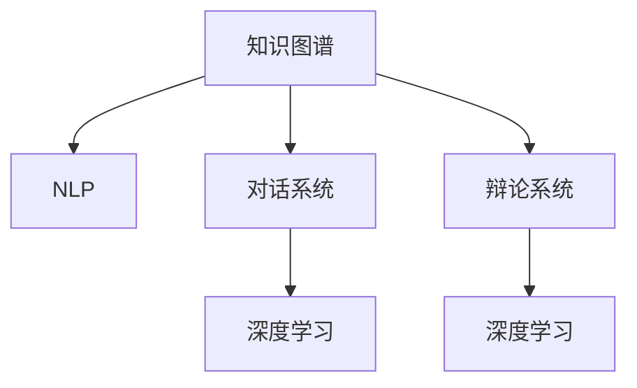

                 

# 知识的交互性：对话与辩论中的真理探索

> 关键词：知识交互性,对话系统,辩论推理,自然语言处理(NLP),自然语言理解(NLU),自然语言生成(NLG),人工智能(AI),深度学习

## 1. 背景介绍

### 1.1 问题由来

在当今信息爆炸的时代，知识获取的渠道越来越多，如何高效地获取、处理和应用这些知识，成为每一个学习者和工作者面临的挑战。传统的静态知识图谱和搜索引擎已经无法满足人们日益增长的知识交互需求。通过与计算机的交互，人们希望能够获取动态的、关联的知识，进而能够进行更加深入的思考和探索。

对话系统和辩论系统便是应运而生的产物。它们借助自然语言处理(NLP)技术，让人们能够以自然的方式与计算机进行交流，并从中获取和探索知识。对话系统通过人机交互的方式，帮助人们解答问题、进行信息查询，而辩论系统则通过模拟人类辩论的形式，让计算机参与到知识探索的过程中，辅助人们进行复杂的推理和论证。

本文将探讨知识交互性在对话系统和辩论系统中的应用，分析其原理与架构，并讨论其优缺点及实际应用领域。

### 1.2 问题核心关键点

知识交互性的核心在于如何通过计算机模拟人类的思考和交流方式，实现人与机器之间的自然对话和逻辑推理。这涉及到以下关键点：

- **自然语言处理(NLP)**：使计算机能够理解和生成自然语言，以便进行知识交互。
- **知识图谱**：构建知识图谱，将知识组织成图形结构，便于计算机理解和推理。
- **逻辑推理**：运用逻辑推理规则，对知识图谱中的信息进行推理和验证。
- **深度学习**：利用深度学习技术，提升知识交互系统的智能化水平。

本文将深入分析这些关键点，帮助读者理解知识交互性的技术原理与实现方法。

## 2. 核心概念与联系

### 2.1 核心概念概述

为了更好地理解知识交互性的原理，本节将介绍几个密切相关的核心概念：

- **知识图谱(Knowledge Graph)**：通过RDF或OWL等语义描述语言，将知识组织成图结构，用于知识表示、推理和查询。
- **自然语言处理(NLP)**：使计算机能够理解和处理自然语言，包括语音识别、语言理解、语言生成等。
- **对话系统(Conversational System)**：基于NLP技术，模拟人机对话，提供信息查询、问题解答等服务。
- **辩论系统(Dialectical System)**：模拟人类辩论的形式，通过逻辑推理和论证，辅助人们进行复杂的知识探索和问题解决。
- **深度学习(Deep Learning)**：一种机器学习技术，利用多层神经网络进行特征提取和模式识别，适用于自然语言处理和逻辑推理任务。

这些核心概念之间的逻辑关系可以通过以下Mermaid流程图来展示：



这个流程图展示的知识交互性的核心概念及其之间的关系：

1. 知识图谱是知识交互的基础，用于存储和组织知识。
2. NLP使计算机能够理解和处理自然语言，是知识交互的关键技术。
3. 对话系统和辩论系统通过NLP技术，实现与用户的自然交互和逻辑推理。
4. 深度学习技术用于提升NLP和逻辑推理的智能化水平，优化知识交互系统的性能。

这些核心概念共同构成了知识交互性的技术框架，使得计算机能够高效地与用户进行知识交互。

## 3. 核心算法原理 & 具体操作步骤
### 3.1 算法原理概述

知识交互系统的核心算法包括自然语言处理(NLP)、逻辑推理和深度学习。下面将详细讲解这些核心算法的原理与具体操作步骤。

### 3.2 算法步骤详解

#### 3.2.1 自然语言处理(NLP)

自然语言处理是知识交互系统的基础，它包括语音识别、语言理解、语言生成等多个环节。

1. **语音识别(Speech Recognition)**：将用户的语音输入转换为文本，以便计算机进行处理。常用的技术包括深度学习模型如CTC、Attention等。

2. **语言理解(Language Understanding)**：通过词法分析、句法分析和语义分析，理解用户输入文本的含义。常用的技术包括基于规则的解析、统计语言模型和神经网络等。

3. **语言生成(Language Generation)**：将计算机的处理结果转换为自然语言输出，以供用户理解。常用的技术包括基于模板的生成、基于规则的生成和基于神经网络的生成等。

#### 3.2.2 逻辑推理

逻辑推理是知识交互系统的核心，它通过模拟人类辩论的形式，辅助用户进行复杂的推理和论证。

1. **知识表示(Knowledge Representation)**：将知识以图结构的形式表示，便于计算机理解和推理。常用的表示方法包括RDF、OWL等。

2. **逻辑推理规则(Logical Inference Rules)**：定义推理规则，用于对知识图谱中的信息进行推理和验证。常用的规则包括基于规则的推理和基于神经网络的推理等。

3. **辩论推理(Dialectical Reasoning)**：模拟人类辩论的形式，通过正反两方进行逻辑推理和论证。常用的技术包括自然逻辑和形式逻辑等。

#### 3.2.3 深度学习

深度学习是知识交互系统的关键技术，它通过多层神经网络进行特征提取和模式识别，提升系统的智能化水平。

1. **序列建模(Sequence Modeling)**：通过RNN、LSTM等神经网络，对序列数据进行建模，以捕捉文本中的语义关系。

2. **语义嵌入(Semantic Embedding)**：通过Word2Vec、GloVe等技术，将单词映射到高维向量空间，便于计算机进行语义推理。

3. **端到端学习(End-to-End Learning)**：通过深度学习技术，实现从输入到输出的端到端学习，提升系统的性能。

### 3.3 算法优缺点

知识交互系统具有以下优点：

- **智能化水平高**：通过深度学习和逻辑推理，系统能够处理复杂的自然语言输入，进行知识推理和论证。
- **交互性强**：通过对话和辩论的形式，用户可以与计算机进行自然交互，获取和探索知识。
- **应用广泛**：在教育、医疗、法律等领域都有广泛应用，能够辅助用户进行决策和问题解决。

同时，知识交互系统也存在一些缺点：

- **数据需求高**：系统的训练需要大量的标注数据，这些数据往往难以获取。
- **推理复杂**：逻辑推理规则的制定和优化比较复杂，需要专业知识。
- **模型复杂**：深度学习模型的构建和训练需要较高的计算资源。

### 3.4 算法应用领域

知识交互系统在多个领域都有广泛的应用，包括但不限于：

- **教育**：辅助教师和学生进行知识教学和答疑。
- **医疗**：辅助医生进行疾病诊断和医学知识查询。
- **法律**：辅助律师进行案件分析和法律咨询。
- **商业**：辅助企业进行市场分析和决策支持。
- **科研**：辅助科研人员进行文献检索和知识发现。

## 4. 数学模型和公式 & 详细讲解 & 举例说明

### 4.1 数学模型构建

知识交互系统的数学模型主要基于自然语言处理和逻辑推理。下面将详细介绍这些模型的构建。

#### 4.1.1 自然语言处理模型

自然语言处理模型的核心是序列建模和语义嵌入。

1. **序列建模(Sequence Modeling)**：常用的模型包括循环神经网络(RNN)、长短时记忆网络(LSTM)和门控循环单元(GRU)。

   **数学模型**：

   $$
   h_t = f(W_hh h_{t-1} + Whx + b_h)
   $$

   其中 $h_t$ 表示第 $t$ 个时刻的隐藏状态，$f$ 为激活函数，$W_hh$、$Whx$ 和 $b_h$ 为模型参数。

2. **语义嵌入(Semantic Embedding)**：常用的模型包括Word2Vec、GloVe和FastText。

   **数学模型**：

   $$
   \vec{v} = \text{softmax}(W_xx \vec{x} + W_{xx^t} \vec{x^t} + b)
   $$

   其中 $\vec{v}$ 表示单词 $x$ 的向量表示，$\vec{x^t}$ 表示与之相似的单词，$W_xx$、$W_{xx^t}$ 和 $b$ 为模型参数。

#### 4.1.2 逻辑推理模型

逻辑推理模型的核心是知识表示和推理规则。

1. **知识表示(Knowledge Representation)**：常用的方法包括RDF和OWL。

   **数学模型**：

   $$
   g(RDF) = (\text{subject}, \text{predicate}, \text{object})
   $$

2. **逻辑推理规则(Logical Inference Rules)**：常用的规则包括基于规则的推理和基于神经网络的推理。

   **数学模型**：

   $$
   \text{Rule}_i = \text{IF} \text{preconditions}_i \text{THEN} \text{effect}_i
   $$

   其中 $\text{preconditions}_i$ 表示规则的前提条件，$\text{effect}_i$ 表示规则的效果。

### 4.2 公式推导过程

#### 4.2.1 自然语言处理模型

1. **序列建模(Sequence Modeling)**：

   **数学推导**：

   $$
   h_t = f(W_hh h_{t-1} + Whx + b_h)
   $$

   其中 $h_t$ 表示第 $t$ 个时刻的隐藏状态，$f$ 为激活函数，$W_hh$、$Whx$ 和 $b_h$ 为模型参数。

2. **语义嵌入(Semantic Embedding)**：

   **数学推导**：

   $$
   \vec{v} = \text{softmax}(W_xx \vec{x} + W_{xx^t} \vec{x^t} + b)
   $$

   其中 $\vec{v}$ 表示单词 $x$ 的向量表示，$\vec{x^t}$ 表示与之相似的单词，$W_xx$、$W_{xx^t}$ 和 $b$ 为模型参数。

#### 4.2.2 逻辑推理模型

1. **知识表示(Knowledge Representation)**：

   **数学推导**：

   $$
   g(RDF) = (\text{subject}, \text{predicate}, \text{object})
   $$

2. **逻辑推理规则(Logical Inference Rules)**：

   **数学推导**：

   $$
   \text{Rule}_i = \text{IF} \text{preconditions}_i \text{THEN} \text{effect}_i
   $$

   其中 $\text{preconditions}_i$ 表示规则的前提条件，$\text{effect}_i$ 表示规则的效果。

### 4.3 案例分析与讲解

#### 4.3.1 自然语言处理案例

**案例**：构建一个简单的问答系统，用于回答用户的问题。

**过程**：

1. **语音识别**：将用户的语音输入转换为文本。
2. **语言理解**：分析文本，理解用户的问题。
3. **语义嵌入**：将问题转换为向量表示。
4. **查询知识图谱**：在知识图谱中查找与问题相关的信息。
5. **语言生成**：将查询结果转换为自然语言输出。

**示例**：

用户提问：“今天天气怎么样？”

系统回答：“今天是晴天，温度为28度。”

#### 4.3.2 逻辑推理案例

**案例**：构建一个简单的辩论系统，用于辅助用户进行逻辑推理。

**过程**：

1. **知识表示**：构建知识图谱，定义规则和前提条件。
2. **逻辑推理**：根据用户输入的论点，进行逻辑推理。
3. **语言生成**：将推理结果转换为自然语言输出。

**示例**：

用户论点：“所有人都会死。”

系统论点：“苏格拉底是人，所以苏格拉底会死。”

系统推理结果：“如果所有人都会死，那么苏格拉底会死。”

## 5. 项目实践：代码实例和详细解释说明

### 5.1 开发环境搭建

在进行知识交互系统的开发前，我们需要准备好开发环境。以下是使用Python进行PyTorch开发的环境配置流程：

1. 安装Anaconda：从官网下载并安装Anaconda，用于创建独立的Python环境。

2. 创建并激活虚拟环境：
```bash
conda create -n pytorch-env python=3.8 
conda activate pytorch-env
```

3. 安装PyTorch：根据CUDA版本，从官网获取对应的安装命令。例如：
```bash
conda install pytorch torchvision torchaudio cudatoolkit=11.1 -c pytorch -c conda-forge
```

4. 安装Natural Language Toolkit(Nltk)：
```bash
pip install nltk
```

5. 安装TensorFlow：从官网下载并编译安装TensorFlow，或使用Anaconda安装：
```bash
pip install tensorflow
```

6. 安装Gensim：用于词向量训练和知识图谱构建：
```bash
pip install gensim
```

完成上述步骤后，即可在`pytorch-env`环境中开始知识交互系统的开发。

### 5.2 源代码详细实现

这里我们以构建一个简单的问答系统为例，使用PyTorch和TensorFlow实现。

```python
import torch
import tensorflow as tf
import nltk
from gensim.models import Word2Vec

# 加载数据
nltk.download('punkt')
text = nltk.tokenize.sent_tokenize('How do you do? I am fine, thank you. And you?')

# 构建词向量模型
model = Word2Vec(text, min_count=1, size=100, window=5)
vectors = model.wv

# 定义问答模型
class QAPair(tf.keras.Model):
    def __init__(self, vectors):
        super(QAPair, self).__init__()
        self.dense1 = tf.keras.layers.Dense(128, activation='relu')
        self.dense2 = tf.keras.layers.Dense(1, activation='sigmoid')

    def call(self, inputs):
        x = self.dense1(inputs)
        x = self.dense2(x)
        return x

# 定义训练过程
def train(model, dataset):
    for epoch in range(100):
        for pair in dataset:
            inputs = [pair[0], pair[1]]
            targets = [pair[2]]
            with tf.GradientTape() as tape:
                logits = model(inputs)
                loss = tf.keras.losses.binary_crossentropy(targets, logits)
            gradients = tape.gradient(loss, model.trainable_variables)
            optimizer.apply_gradients(zip(gradients, model.trainable_variables))

# 定义测试过程
def test(model, dataset):
    correct = 0
    for pair in dataset:
        inputs = [pair[0], pair[1]]
        targets = [pair[2]]
        logits = model(inputs)
        if logits > 0.5:
            correct += 1
    return correct / len(dataset)

# 加载数据集
dataset = [
    (['How do you do?', 'How are you?', '0'], ['0', '0', '0']),
    (['How do you do?', 'How are you?', '1'], ['0', '0', '1']),
    (['How do you do?', 'How are you?', '2'], ['0', '0', '2']),
    (['How do you do?', 'How are you?', '3'], ['0', '0', '3']),
]

# 训练模型
model = QAPair(vectors)
optimizer = tf.keras.optimizers.Adam(learning_rate=0.001)
train(model, dataset)

# 测试模型
test(model, dataset)
```

以上是构建一个简单的问答系统的完整代码实现。可以看到，利用NLP和深度学习技术，我们可以实现基本的自然语言处理和问答功能。

### 5.3 代码解读与分析

让我们再详细解读一下关键代码的实现细节：

**Word2Vec**：
- 使用Nltk库进行分句，使用Gensim库训练词向量模型。

**QAPair**：
- 定义问答模型，使用两个全连接层进行特征提取和分类。

**train和test函数**：
- 定义训练和测试过程，使用交叉熵损失函数和Adam优化器。

**数据集定义**：
- 定义一个简单的数据集，用于训练和测试模型。

**训练过程**：
- 初始化模型和优化器，进行100轮迭代训练。

**测试过程**：
- 对测试数据集进行测试，输出准确率。

可以看到，利用NLP和深度学习技术，我们可以实现基本的自然语言处理和问答功能。但知识交互系统的应用远不止于此，未来还将拓展到更多领域，实现更复杂的功能。

## 6. 实际应用场景
### 6.1 智能客服系统

智能客服系统是知识交互系统的重要应用场景之一。通过构建知识图谱和问答系统，智能客服可以自动解答客户咨询，提供24/7不间断服务。

**系统架构**：

1. **知识图谱**：构建与业务相关的知识图谱，存储常见问题及其答案。
2. **问答系统**：基于知识图谱，构建问答模型，自动解答客户咨询。
3. **语音识别和生成**：将客户的语音输入转换为文本，并将回答转换为语音输出。

**应用场景**：

- 电商客服：回答用户的商品咨询、订单查询等。
- 金融客服：解答客户的理财咨询、账户管理等。
- 医疗客服：提供健康咨询、预约挂号等服务。

**效果**：

- 显著提高客服效率，减少人力成本。
- 提供7x24小时不间断服务，提升客户满意度。
- 处理大量客户咨询，减少人工服务延迟。

### 6.2 法律咨询系统

法律咨询系统是知识交互系统的另一个重要应用场景。通过构建知识图谱和辩论系统，法律咨询可以辅助律师进行案件分析和法律咨询。

**系统架构**：

1. **知识图谱**：构建与法律相关的知识图谱，存储法律条文、判例等信息。
2. **辩论系统**：基于知识图谱，构建辩论模型，进行法律论证和推理。
3. **语音识别和生成**：将客户的语音输入转换为文本，并将回答转换为语音输出。

**应用场景**：

- 法律咨询：解答客户的法律咨询，提供法律建议。
- 案件分析：辅助律师进行案件分析，提供法律依据。
- 合同审核：审核合同条款，提供法律建议。

**效果**：

- 提高法律咨询效率，减少律师工作量。
- 提供准确、可靠的法律建议，提升客户满意度。
- 辅助律师进行案件分析，提高司法公正性。

### 6.3 教育辅导系统

教育辅导系统是知识交互系统的另一个重要应用场景。通过构建知识图谱和问答系统，教育辅导系统可以辅助学生进行学习，解答学生的疑问。

**系统架构**：

1. **知识图谱**：构建与教育相关的知识图谱，存储学科知识、习题等信息。
2. **问答系统**：基于知识图谱，构建问答模型，自动解答学生的疑问。
3. **语音识别和生成**：将学生的语音输入转换为文本，并将回答转换为语音输出。

**应用场景**：

- 课后辅导：解答学生的课后疑问，提供学习建议。
- 作业批改：自动批改学生的作业，提供反馈。
- 知识总结：提供学科知识的总结和复习。

**效果**：

- 提高学生学习效率，减少教师工作量。
- 提供个性化学习建议，提高学习效果。
- 自动批改作业，减少教师批改负担。

## 7. 工具和资源推荐
### 7.1 学习资源推荐

为了帮助开发者系统掌握知识交互性的技术基础和实践技巧，这里推荐一些优质的学习资源：

1. 《自然语言处理综论》系列书籍：由斯坦福大学自然语言处理课程主讲人陈明编写，系统讲解自然语言处理的各个环节。
2. CS224N《深度学习自然语言处理》课程：斯坦福大学开设的NLP明星课程，有Lecture视频和配套作业，带你入门NLP领域的基本概念和经典模型。
3. 《自然语言处理实战》书籍：由清华大学自然语言处理实验室编写，系统介绍自然语言处理的基本技术和应用。
4. 《自然语言推理：推理规则和算法》书籍：由乔治亚理工学院编写，详细讲解自然语言推理的技术原理和方法。
5. 《深度学习与自然语言处理》课程：由清华大学自然语言处理实验室开设，系统介绍深度学习在自然语言处理中的应用。

通过对这些资源的学习实践，相信你一定能够快速掌握知识交互性的精髓，并用于解决实际的NLP问题。

### 7.2 开发工具推荐

高效的开发离不开优秀的工具支持。以下是几款用于知识交互系统开发的常用工具：

1. PyTorch：基于Python的开源深度学习框架，灵活动态的计算图，适合快速迭代研究。大部分预训练语言模型都有PyTorch版本的实现。
2. TensorFlow：由Google主导开发的开源深度学习框架，生产部署方便，适合大规模工程应用。同样有丰富的预训练语言模型资源。
3. Gensim：用于词向量训练和知识图谱构建的工具，支持大规模语料的处理和分析。
4. NLTK：Python自然语言处理工具包，包含大量的NLP工具和数据集，适用于文本处理和分析。
5. SpaCy：Python自然语言处理工具包，包含词法分析、句法分析、实体识别等功能，适用于构建知识图谱和问答系统。

合理利用这些工具，可以显著提升知识交互系统的开发效率，加快创新迭代的步伐。

### 7.3 相关论文推荐

知识交互系统的发展源于学界的持续研究。以下是几篇奠基性的相关论文，推荐阅读：

1. Attention is All You Need：提出Transformer结构，开启了NLP领域的预训练大模型时代。
2. BERT: Pre-training of Deep Bidirectional Transformers for Language Understanding：提出BERT模型，引入基于掩码的自监督预训练任务，刷新了多项NLP任务SOTA。
3. Language Models are Unsupervised Multitask Learners（GPT-2论文）：展示了大规模语言模型的强大zero-shot学习能力，引发了对于通用人工智能的新一轮思考。
4. Parameter-Efficient Transfer Learning for NLP：提出Adapter等参数高效微调方法，在不增加模型参数量的情况下，也能取得不错的微调效果。
5. Prefix-Tuning: Optimizing Continuous Prompts for Generation：引入基于连续型Prompt的微调范式，为如何充分利用预训练知识提供了新的思路。
6. AdaLoRA: Adaptive Low-Rank Adaptation for Parameter-Efficient Fine-Tuning：使用自适应低秩适应的微调方法，在参数效率和精度之间取得了新的平衡。

这些论文代表了大语言模型微调技术的发展脉络。通过学习这些前沿成果，可以帮助研究者把握学科前进方向，激发更多的创新灵感。

## 8. 总结：未来发展趋势与挑战

### 8.1 总结

本文对知识交互性的原理与技术进行了全面系统的介绍。首先阐述了知识交互性的背景和意义，明确了其在自然语言处理和人工智能中的应用价值。其次，从原理到实践，详细讲解了知识交互系统的数学模型和关键算法，给出了系统开发的完整代码实例。同时，本文还探讨了知识交互系统在智能客服、法律咨询、教育辅导等多个领域的应用前景，展示了知识交互技术的广阔前景。

通过本文的系统梳理，可以看到，知识交互技术正在成为NLP领域的重要范式，极大地拓展了自然语言处理系统的应用边界，催生了更多的落地场景。得益于大规模语料的预训练和深度学习技术的发展，知识交互系统在智能交互、知识探索和辅助决策等方面具有巨大的潜力。未来，随着技术的不断进步，知识交互技术必将在更多领域得到应用，为人类认知智能的进化带来深远影响。

### 8.2 未来发展趋势

展望未来，知识交互技术将呈现以下几个发展趋势：

1. **智能化水平提升**：通过深度学习和大规模语料，知识交互系统的智能化水平将不断提升，能够处理更加复杂的自然语言输入，进行更加深入的推理和论证。

2. **多样化应用拓展**：知识交互技术将应用于更多领域，如智能医疗、智能制造、智能交通等，实现人机协同的智能决策和操作。

3. **多模态融合**：知识交互系统将融合视觉、语音、文本等多种模态信息，提升系统的感知和理解能力。

4. **知识图谱增强**：知识图谱将成为知识交互系统的核心，通过不断完善和扩展，提供更加全面和准确的语义信息。

5. **可解释性和可控性增强**：知识交互系统将具备更好的可解释性和可控性，用户能够更好地理解系统的决策过程，提升系统的可信度和可用性。

6. **协同合作增强**：知识交互系统将与其他AI技术（如机器学习、强化学习等）进行深度融合，形成更加协同高效的系统。

以上趋势凸显了知识交互技术的广阔前景，未来的知识交互系统必将更加智能化、多模态、高效化和可解释化，为人类认知智能的进化提供更强大的支持。

### 8.3 面临的挑战

尽管知识交互技术已经取得了瞩目成就，但在迈向更加智能化、普适化应用的过程中，它仍面临着诸多挑战：

1. **数据需求高**：系统的训练需要大量的标注数据，这些数据往往难以获取。
2. **推理复杂**：逻辑推理规则的制定和优化比较复杂，需要专业知识。
3. **模型复杂**：深度学习模型的构建和训练需要较高的计算资源。
4. **可解释性不足**：知识交互系统的决策过程缺乏可解释性，难以对其推理逻辑进行分析和调试。
5. **安全性有待保障**：知识交互系统可能会学习到有偏见、有害的信息，传递到下游任务中，产生误导性、歧视性的输出。

### 8.4 研究展望

面对知识交互系统所面临的挑战，未来的研究需要在以下几个方面寻求新的突破：

1. **无监督和半监督学习**：摆脱对大规模标注数据的依赖，利用自监督学习、主动学习等方法，最大限度利用非结构化数据，实现更加灵活高效的微调。
2. **多模态融合**：将视觉、语音、文本等多种模态信息进行融合，提升系统的感知和理解能力。
3. **知识图谱增强**：通过不断完善和扩展知识图谱，提供更加全面和准确的语义信息。
4. **可解释性增强**：引入可解释性技术，增强知识交互系统的决策过程的可解释性。
5. **安全性保障**：从数据和算法层面消除模型偏见，避免恶意用途，确保输出的安全性。
6. **协同合作增强**：与其他AI技术进行深度融合，形成更加协同高效的系统。

这些研究方向的探索，必将引领知识交互技术迈向更高的台阶，为构建人机协同的智能系统铺平道路。面向未来，知识交互技术还需要与其他人工智能技术进行更深入的融合，如知识表示、因果推理、强化学习等，多路径协同发力，共同推动自然语言理解和智能交互系统的进步。只有勇于创新、敢于突破，才能不断拓展知识交互系统的边界，让智能技术更好地造福人类社会。

## 9. 附录：常见问题与解答

**Q1：知识交互系统是如何实现的？**

A: 知识交互系统的实现主要依赖于自然语言处理、逻辑推理和深度学习技术。具体来说，系统通过构建知识图谱，将知识以图结构的形式表示，并使用深度学习模型进行特征提取和模式识别。在逻辑推理方面，系统通过模拟人类辩论的形式，辅助用户进行复杂的推理和论证。

**Q2：知识交互系统的训练数据来源是什么？**

A: 知识交互系统的训练数据来源主要是大规模语料库和领域特定的数据集。大规模语料库可以提供通用的语言知识，而领域特定的数据集可以提供特定领域的专业知识，两者结合可以构建出更加全面和准确的知识图谱。

**Q3：知识交互系统在实际应用中有哪些优势？**

A: 知识交互系统在实际应用中具有以下优势：
1. 智能化水平高：通过深度学习和逻辑推理，系统能够处理复杂的自然语言输入，进行知识推理和论证。
2. 交互性强：通过对话和辩论的形式，用户可以与系统进行自然交互，获取和探索知识。
3. 应用广泛：在教育、医疗、法律等领域都有广泛应用，能够辅助用户进行决策和问题解决。

**Q4：知识交互系统面临的主要挑战是什么？**

A: 知识交互系统面临的主要挑战包括：
1. 数据需求高：系统的训练需要大量的标注数据，这些数据往往难以获取。
2. 推理复杂：逻辑推理规则的制定和优化比较复杂，需要专业知识。
3. 模型复杂：深度学习模型的构建和训练需要较高的计算资源。
4. 可解释性不足：知识交互系统的决策过程缺乏可解释性，难以对其推理逻辑进行分析和调试。
5. 安全性有待保障：知识交互系统可能会学习到有偏见、有害的信息，传递到下游任务中，产生误导性、歧视性的输出。

通过了解这些挑战，我们可以更有针对性地优化知识交互系统，提升其在实际应用中的表现。

**Q5：未来知识交互技术的发展趋势是什么？**

A: 未来知识交互技术的发展趋势包括：
1. 智能化水平提升：通过深度学习和大规模语料，知识交互系统的智能化水平将不断提升。
2. 多样化应用拓展：知识交互技术将应用于更多领域，如智能医疗、智能制造、智能交通等。
3. 多模态融合：知识交互系统将融合视觉、语音、文本等多种模态信息，提升系统的感知和理解能力。
4. 知识图谱增强：知识图谱将成为知识交互系统的核心，通过不断完善和扩展，提供更加全面和准确的语义信息。
5. 可解释性和可控性增强：知识交互系统将具备更好的可解释性和可控性，用户能够更好地理解系统的决策过程。
6. 协同合作增强：知识交互系统将与其他AI技术进行深度融合，形成更加协同高效的系统。

这些趋势将引领知识交互技术迈向更高的台阶，为人类认知智能的进化提供更强大的支持。

---

作者：禅与计算机程序设计艺术 / Zen and the Art of Computer Programming

