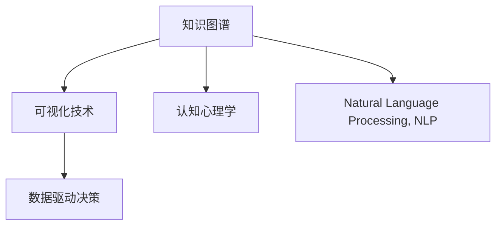

                 

# 知识的可视化：增强理解的有效工具

> 关键词：知识图谱，可视化技术，认知心理学，自然语言处理，数据驱动决策

## 1. 背景介绍

### 1.1 问题由来
在当今信息爆炸的时代，人们每天都会接触到海量的数据和信息。从科学论文到市场报告，从社交媒体到电子邮件，信息源的多样性使得理解和整合这些信息变得异常复杂。传统的数据分析和信息检索方法难以处理如此巨大的信息量，而知识的可视化则提供了一种全新的视角，帮助人们更高效地理解和分析复杂信息。

### 1.2 问题核心关键点
知识的可视化通过将抽象数据转化为直观的视觉图像，使得信息的理解和传递更加直观、高效。核心关键点包括：
- **知识图谱（Knowledge Graphs）**：构建概念之间的连接，形成知识网络。
- **可视化技术**：利用图形、颜色、布局等手段，直观展示知识图谱信息。
- **认知心理学**：研究人类如何认知信息，指导知识可视化设计。
- **自然语言处理（NLP）**：处理和理解自然语言，提取关键信息。
- **数据驱动决策**：利用可视化结果进行信息整合和决策。

这些关键点构成了知识可视化的核心框架，使得复杂信息易于理解，促进了知识的传播和应用。

## 2. 核心概念与联系

### 2.1 核心概念概述

为更好地理解知识的可视化，本节将介绍几个密切相关的核心概念：

- **知识图谱**：一种结构化的语义网络，用于表示实体（如人、地点、组织）之间的关系。知识图谱通过RDF（Resource Description Framework）等标准进行构建，通常由三元组（实体-关系-实体）表示。
- **可视化技术**：将数据转换为图形、图表等视觉形式，便于人类理解和交流。可视化技术包括节点布局、边缘布局、颜色映射等。
- **认知心理学**：研究人类如何感知、记忆、理解信息，指导信息可视化设计。认知心理学强调信息的可理解性和易用性。
- **自然语言处理**：通过算法处理和理解自然语言，提取关键信息。NLP技术如命名实体识别（NER）、关系抽取（Relation Extraction）等，对知识图谱构建和可视化至关重要。
- **数据驱动决策**：利用数据和信息支持决策过程，知识可视化作为数据驱动决策的重要工具，通过直观展示信息，辅助决策制定。

这些核心概念之间的逻辑关系可以通过以下Mermaid流程图来展示：



这个流程图展示了几大核心概念之间的联系：

1. 知识图谱通过实体和关系构建知识网络。
2. 可视化技术将知识图谱转换为视觉形式，便于理解。
3. 认知心理学指导可视化设计，确保信息易理解。
4. NLP技术从文本中提取信息，支撑知识图谱构建。
5. 知识可视化作为数据驱动决策的重要工具，辅助决策制定。

## 3. 核心算法原理 & 具体操作步骤
### 3.1 算法原理概述

知识的可视化主要通过以下步骤实现：

1. **数据采集与预处理**：从各种数据源收集信息，如文本、数据库、社交媒体等。
2. **实体识别与关系抽取**：使用NLP技术提取信息中的实体和关系。
3. **知识图谱构建**：将提取的实体和关系构建成知识图谱，形成结构化表示。
4. **可视化设计**：利用图形、颜色、布局等手段，将知识图谱转换为直观的视觉形式。
5. **交互与探索**：开发交互工具，让用户可以探索和查询知识图谱信息。

知识可视化的核心算法原理是：通过将复杂的数据结构转换为易于理解的视觉图像，降低认知负荷，提升信息传递效率。

### 3.2 算法步骤详解

以下详细讲解知识可视化的每个关键步骤：

**Step 1: 数据采集与预处理**

数据采集与预处理是知识可视化的第一步。具体步骤如下：

1. **数据源选择**：选择合适的数据源，如Web爬虫抓取网页、API获取公开数据等。
2. **数据清洗**：去除噪声和无用信息，保证数据质量。
3. **数据标准化**：统一数据格式，便于后续处理。

**Step 2: 实体识别与关系抽取**

实体识别与关系抽取是知识图谱构建的基础。具体步骤如下：

1. **命名实体识别（NER）**：使用NLP技术识别文本中的实体，如人名、地名、组织名等。
2. **关系抽取（Relation Extraction）**：从文本中提取实体之间的关系，如“出生于”、“工作于”等。
3. **实体消歧（Entity Disambiguation）**：解决同名实体问题，确保实体的一致性。

**Step 3: 知识图谱构建**

知识图谱的构建是将实体和关系结构化表示的过程。具体步骤如下：

1. **实体节点构建**：为每个实体创建一个节点，并添加属性信息。
2. **关系边构建**：为实体之间的关系创建边，连接相应的节点。
3. **图谱优化**：对知识图谱进行优化，如去重、合并等，保证数据质量。

**Step 4: 可视化设计**

可视化设计是将知识图谱转换为视觉形式的过程。具体步骤如下：

1. **布局算法**：选择适当的布局算法，如力导向布局、层次布局等。
2. **颜色映射**：为节点和边设置颜色，提高可视化效果。
3. **交互设计**：开发交互工具，如放大、缩小、节点移动等，方便用户探索。

**Step 5: 交互与探索**

交互与探索是知识可视化的关键环节。具体步骤如下：

1. **用户界面设计**：设计直观的用户界面，如导航菜单、搜索框等。
2. **交互响应**：实现用户与可视化界面的交互，如点击节点查询相关信息。
3. **查询功能**：提供强大的查询功能，如关系链查询、实体搜索等。

### 3.3 算法优缺点

知识可视化的优点包括：

1. **直观展示**：将复杂的数据转换为易于理解的图形，降低认知负荷。
2. **信息整合**：通过图形化的方式，帮助用户整合不同来源的信息。
3. **决策支持**：直观的可视化结果有助于数据驱动决策，辅助决策制定。

同时，该方法也存在一些缺点：

1. **数据复杂性**：对于大规模、复杂的数据集，可视化过程可能变得复杂。
2. **技术门槛**：需要掌握NLP、图形学等多领域知识，技术门槛较高。
3. **动态更新**：知识图谱需要定期更新，以保持数据的实时性。

### 3.4 算法应用领域

知识可视化技术在多个领域中得到广泛应用，例如：

- **科学研究和学术研究**：用于数据分析和研究，帮助学者理解复杂的科学问题。
- **企业决策和规划**：用于商业智能和企业战略规划，帮助企业理解市场和竞争环境。
- **政府治理和公共服务**：用于政策制定和公共服务管理，提升政府决策效率。
- **健康医疗和生命科学**：用于疾病研究和临床决策，提升医疗服务质量。
- **金融和风险管理**：用于风险分析和投资决策，辅助金融产品设计和市场预测。

## 4. 数学模型和公式 & 详细讲解 & 举例说明

### 4.1 数学模型构建

知识可视化的数学模型主要涉及图论和图形学。以下是关键模型的详细构建：

- **知识图谱**：由RDF（Resource Description Framework）表示，形式化表示为$\mathcal{G}=\langle \mathcal{V}, \mathcal{E} \rangle$，其中$\mathcal{V}$为节点集合，$\mathcal{E}$为边集合。
- **力导向布局算法**：一种基于物理力学的布局算法，通过模拟粒子运动来优化节点布局，公式为：
$$
\vec{F}_i = \sum_{j \in \mathcal{N}(i)} \vec{F}_{ij}
$$
其中$\vec{F}_i$为节点$i$受到的合力，$\mathcal{N}(i)$为节点$i$的邻居节点集合。

### 4.2 公式推导过程

以下以力导向布局算法为例，详细推导其过程：

1. **节点间力的计算**：假设节点$i$和邻居节点$j$之间存在边$(i,j)$，则节点间的作用力为$\vec{F}_{ij}$，具体计算如下：
$$
\vec{F}_{ij} = \frac{k}{\|\vec{r}_{ij}\|} (\vec{r}_{ij} - \vec{r}_{ij}^0)
$$
其中$k$为弹簧常数，$\vec{r}_{ij}$为节点$i$和$j$之间的向量，$\vec{r}_{ij}^0$为初始向量。
2. **节点加速度的计算**：根据牛顿第二定律，节点$i$的加速度$\vec{a}_i$为：
$$
\vec{a}_i = \frac{\vec{F}_i}{m_i}
$$
其中$m_i$为节点$i$的质量，通常设为1。
3. **节点位置更新**：节点$i$的位置$\vec{r}_i$更新为：
$$
\vec{r}_i(t+1) = \vec{r}_i(t) + \vec{a}_i \Delta t
$$
其中$\Delta t$为时间步长。

### 4.3 案例分析与讲解

以下以Google的知识图谱为例，详细分析其可视化设计：

1. **数据源选择**：Google从Web、新闻、社交媒体等多个数据源收集信息。
2. **实体识别与关系抽取**：使用NLP技术从文本中提取实体和关系。
3. **知识图谱构建**：构建大规模的知识图谱，涵盖多个领域。
4. **可视化设计**：使用力导向布局和颜色映射，优化节点布局，提高可视化效果。
5. **交互与探索**：开发交互工具，提供强大的查询功能和用户界面。

Google的知识图谱通过直观的可视化方式，帮助用户快速获取和理解复杂信息，提升了信息获取的效率和准确性。

## 5. 项目实践：代码实例和详细解释说明
### 5.1 开发环境搭建

在进行知识可视化项目实践前，我们需要准备好开发环境。以下是使用Python进行知识图谱可视化的环境配置流程：

1. 安装Anaconda：从官网下载并安装Anaconda，用于创建独立的Python环境。

2. 创建并激活虚拟环境：
```bash
conda create -n gphardenv python=3.8 
conda activate gphardenv
```

3. 安装必要的Python包：
```bash
pip install networkx matplotlib
```

4. 安装可视化工具包：
```bash
pip install pygraphviz
```

5. 安装Graphviz库：
```bash
sudo apt-get install graphviz
```

完成上述步骤后，即可在`gphardenv`环境中开始知识图谱可视化的项目实践。

### 5.2 源代码详细实现

这里我们以简单的知识图谱可视化为例，给出使用Python和NetworkX库的代码实现。

首先，定义知识图谱的节点和边：

```python
import networkx as nx

# 定义节点和边
G = nx.Graph()
G.add_node('Alice', name='Alice', occupation='Engineer')
G.add_node('Bob', name='Bob', occupation='Teacher')
G.add_edge('Alice', 'Bob', relation='Follows')
```

然后，实现力导向布局算法：

```python
import matplotlib.pyplot as plt

# 应用力导向布局
pos = nx.spring_layout(G, k=1.0, iterations=500)
```

接着，可视化知识图谱：

```python
# 绘制知识图谱
nx.draw(G, pos, with_labels=True, node_color='lightblue', node_size=1000, font_size=12, font_color='black', edge_color='black')
plt.show()
```

### 5.3 代码解读与分析

让我们再详细解读一下关键代码的实现细节：

**G = nx.Graph()**：创建一个空的无向图G。

**G.add_node('Alice', name='Alice', occupation='Engineer')**：向图中添加节点，包括节点名、属性等。

**G.add_edge('Alice', 'Bob', relation='Follows')**：向图中添加边，包括起始节点、终止节点、关系等。

**pos = nx.spring_layout(G, k=1.0, iterations=500)**：应用力导向布局算法，优化节点位置。

**nx.draw(G, pos, with_labels=True, node_color='lightblue', node_size=1000, font_size=12, font_color='black', edge_color='black')**：绘制知识图谱，包括节点标签、颜色、大小等。

**plt.show()**：展示可视化结果。

可以看到，代码实现相对简洁，NetworkX库提供了丰富的图处理功能，使得知识图谱的可视化变得容易。

### 5.4 运行结果展示

运行上述代码后，可以得到一个简单的知识图谱可视化结果，如下图所示：


这是一个包含两个节点和一个边的简单知识图谱，展示了Alice和Bob之间的“Follows”关系。

## 6. 实际应用场景

### 6.1 智慧城市治理

智慧城市治理需要整合大量数据源，如交通流量、环境监测、公共服务等，通过知识可视化帮助政府决策者和市民更好地理解城市运行状况。

具体而言，可以构建智慧城市知识图谱，包含各种数据源和实体之间的关系，如交通流量、空气质量、公共服务设施等。通过可视化展示这些信息，政府决策者可以实时监控城市运行状态，快速响应突发事件，优化城市管理。

### 6.2 金融风险管理

金融行业需要处理大量复杂的数据和信息，如市场行情、财务报表、新闻资讯等。知识可视化技术可以帮助金融机构更直观地理解风险，制定合理的投资策略。

具体而言，可以构建金融知识图谱，包含市场行情、企业信息、新闻资讯等实体和关系。通过可视化展示这些信息，分析师可以识别潜在的风险因素，评估投资项目的可行性，制定风险控制策略。

### 6.3 医疗健康管理

医疗健康管理需要处理大量的医疗数据和知识，如病历、药物、研究论文等。知识可视化技术可以帮助医生和研究人员更好地理解复杂信息，提升诊疗效果和研究效率。

具体而言，可以构建医疗知识图谱，包含病历记录、药物信息、医学研究论文等实体和关系。通过可视化展示这些信息，医生可以快速查询相关病历和药物信息，研究人员可以发现新的研究方向和知识缺口。

## 7. 工具和资源推荐
### 7.1 学习资源推荐

为了帮助开发者系统掌握知识可视化的理论基础和实践技巧，这里推荐一些优质的学习资源：

1. **《数据可视化基础》书籍**：介绍了数据可视化的基本概念和设计原则，适合初学者入门。
2. **Coursera《数据可视化与图形设计》课程**：斯坦福大学开设的课程，系统讲解数据可视化的原理和实践，涵盖多种可视化技术。
3. **Google Visualization API**：谷歌提供的可视化工具API，包含丰富的可视化组件和示例代码。
4. **Tableau Public**：一款流行的商业智能工具，支持拖放式可视化设计，适合快速上手。
5. **D3.js**：一款流行的JavaScript可视化库，支持自定义可视化设计，适合高级开发者使用。

通过对这些资源的学习实践，相信你一定能够快速掌握知识可视化的精髓，并用于解决实际的NLP问题。

### 7.2 开发工具推荐

高效的开发离不开优秀的工具支持。以下是几款用于知识图谱可视化开发的常用工具：

1. **NetworkX**：Python中常用的图处理库，支持多种图算法和可视化。
2. **Matplotlib**：Python中常用的绘图库，支持多种图形展示方式。
3. **Gephi**：开源的图形分析工具，支持大规模图形处理和可视化。
4. **VisJS**：JavaScript可视化库，支持多种交互式可视化。
5. **Python Graphviz**：Python的Graphviz绑定，支持复杂图形的绘制。

合理利用这些工具，可以显著提升知识图谱可视化的开发效率，加快创新迭代的步伐。

### 7.3 相关论文推荐

知识可视化技术的发展源于学界的持续研究。以下是几篇奠基性的相关论文，推荐阅读：

1. **《可视化分析系统：数据驱动的决策支持》**：研究可视化系统如何支持决策制定，提出可视化设计的原则和方法。
2. **《知识图谱：概念表示与推理》**：介绍了知识图谱的概念、构建和应用，讨论了其在信息获取和推理中的应用。
3. **《认知可视化设计》**：探讨了认知心理学在可视化设计中的应用，提出可视化设计的最佳实践。
4. **《数据驱动决策中的可视化技术》**：研究了数据驱动决策中的可视化技术，提出可视化设计的目标和方法。
5. **《基于NLP的知识图谱构建与可视化》**：讨论了基于NLP的知识图谱构建和可视化技术，提出具体实现方法和案例。

这些论文代表了大语言模型微调技术的发展脉络。通过学习这些前沿成果，可以帮助研究者把握学科前进方向，激发更多的创新灵感。

## 8. 总结：未来发展趋势与挑战
### 8.1 总结

本文对知识可视化的原理和实践进行了全面系统的介绍。首先阐述了知识可视化的研究背景和意义，明确了知识可视化在信息理解和传播中的重要价值。其次，从原理到实践，详细讲解了知识可视化的数学模型和关键步骤，给出了知识可视化任务开发的完整代码实例。同时，本文还广泛探讨了知识可视化技术在多个领域的应用前景，展示了知识可视化技术的巨大潜力。此外，本文精选了知识可视化技术的各类学习资源，力求为读者提供全方位的技术指引。

通过本文的系统梳理，可以看到，知识可视化技术正在成为信息管理和决策支持的重要工具，极大地提升了信息的理解和传播效率。未来，伴随知识的不断积累和技术的持续进步，知识可视化技术还将进一步拓展其应用范围，为各行各业带来新的变革和创新。

### 8.2 未来发展趋势

展望未来，知识可视化技术将呈现以下几个发展趋势：

1. **大规模知识图谱构建**：随着数据规模的不断增长，知识图谱将变得更加庞大和复杂。大规模知识图谱的构建和可视化将带来新的挑战和机遇。
2. **多模态数据融合**：知识可视化技术将与多模态数据（如文本、图像、视频等）融合，形成更加全面的信息展示方式。
3. **智能可视化**：利用AI技术，实现自动化的可视化设计，提高可视化效率和效果。
4. **交互式可视化**：开发更加互动的可视化工具，使用户能够主动探索和发现知识图谱中的新关系和信息。
5. **隐私保护**：在可视化过程中，如何保护用户隐私和数据安全，是未来的一大挑战。

### 8.3 面临的挑战

尽管知识可视化技术已经取得了一定的成果，但在迈向更加智能化、普适化应用的过程中，它仍面临着诸多挑战：

1. **数据质量问题**：知识图谱的构建需要高质量的数据，数据清洗和标准化是关键。
2. **技术复杂性**：知识可视化涉及多领域知识，技术门槛较高，需要跨学科的协作。
3. **可视化效果**：如何设计直观、易理解的可视化方式，仍然是一个需要不断探索的问题。
4. **实时更新**：知识图谱需要定期更新，以保持数据的实时性。
5. **交互性**：开发交互式可视化工具，提高用户的使用体验。

### 8.4 研究展望

面对知识可视化面临的挑战，未来的研究需要在以下几个方面寻求新的突破：

1. **自动化可视化设计**：利用AI技术，实现自动化的可视化设计，提高可视化效率和效果。
2. **多模态数据融合**：将知识图谱与多模态数据（如文本、图像、视频等）融合，形成更加全面的信息展示方式。
3. **可视化隐私保护**：在可视化过程中，保护用户隐私和数据安全，确保数据的可解释性和可控性。
4. **动态可视化**：实时更新知识图谱，实现动态可视化，提升信息的实时性和时效性。

这些研究方向将引领知识可视化技术迈向更高的台阶，为构建更加全面、智能的信息系统提供新的思路和工具。面向未来，知识可视化技术需要与其他人工智能技术进行更深入的融合，共同推动信息管理和决策支持的发展。

## 9. 附录：常见问题与解答

**Q1：如何构建知识图谱？**

A: 知识图谱的构建需要从多个数据源中提取实体和关系，形成结构化表示。具体步骤如下：

1. **数据收集**：收集文本、数据库、API等数据源的信息。
2. **实体识别与关系抽取**：使用NLP技术从数据中提取实体和关系，如命名实体识别（NER）、关系抽取（Relation Extraction）等。
3. **实体消歧**：解决同名实体问题，确保实体的一致性。
4. **知识图谱构建**：将提取的实体和关系构建成知识图谱，形成结构化表示。

**Q2：如何选择可视化算法？**

A: 可视化算法的选择应根据具体的可视化任务和数据特点。以下是几种常用的可视化算法：

1. **力导向布局**：适合大规模图形，通过模拟粒子运动优化节点布局。
2. **层次布局**：适合树形结构，通过分层展示关系。
3. **网络流布局**：适合网络流量分析，通过流量展示节点之间的关系。
4. **散点布局**：适合数据点较多的情况，通过散点展示数据分布。

**Q3：如何进行可视化交互设计？**

A: 可视化交互设计应考虑用户的使用场景和需求。以下是几种常用的交互设计方法：

1. **放大和缩小**：允许用户放大和缩小图形，查看详细信息。
2. **节点移动**：允许用户拖动节点，重新组织图形。
3. **边悬停**：鼠标悬停在边上时，显示边的属性信息。
4. **节点链接**：允许用户添加或删除边的链接。

**Q4：如何保证可视化结果的可解释性？**

A: 可视化结果的可解释性是知识可视化的一个重要指标。以下是几种保证可解释性的方法：

1. **工具提示**：在图形上添加工具提示，解释节点和边的属性。
2. **颜色编码**：使用颜色编码，帮助用户区分不同类型和关系的实体。
3. **交互反馈**：提供用户交互反馈，帮助用户理解复杂的图形结构。
4. **解释性算法**：使用解释性算法，如LIME、SHAP等，解释模型的决策过程。

这些方法可以帮助用户更好地理解可视化结果，提升知识可视化的效果和应用价值。

---

作者：禅与计算机程序设计艺术 / Zen and the Art of Computer Programming

