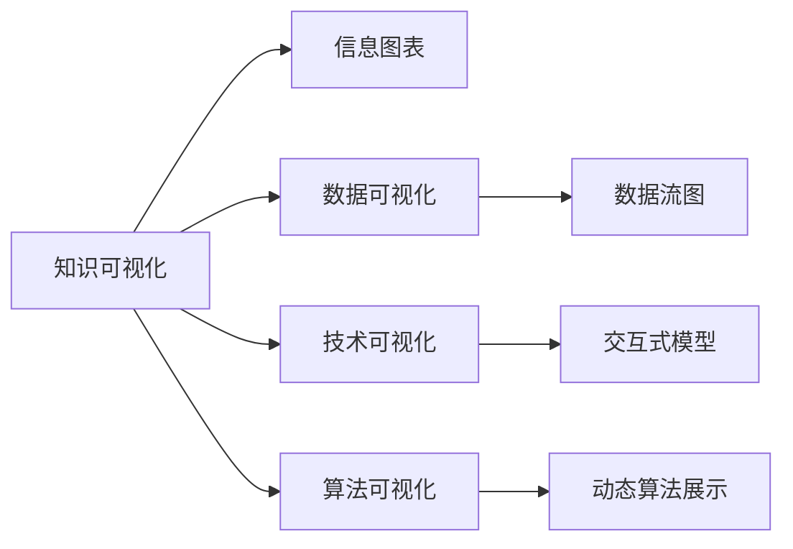

                 

# 知识的可视化：复杂概念的图形表达

## 1. 背景介绍

在人工智能（AI）和数据科学领域，可视化是探索、理解和表达复杂概念的重要工具。然而，将复杂的技术概念、算法模型或科学原理准确、高效地传达给非专业观众，仍然是一个巨大的挑战。本文将深入探讨知识的可视化，特别是复杂概念的图形表达，包括其原理、方法及应用。我们将介绍几种常见的可视化技术，并结合具体案例进行讲解，希望通过系统的梳理和深入的分析，为读者提供一个全面的视角。

## 2. 核心概念与联系

### 2.1 核心概念概述

在讨论知识可视化之前，我们先简要介绍几个核心概念：

- **知识可视化（Knowledge Visualization）**：将复杂的信息、数据、理论或概念，以图形的形式呈现出来，便于理解和交流。
- **信息图表（Infographic）**：一种视觉上吸引人且信息丰富的图表，旨在通过简洁的视觉元素传达信息。
- **数据可视化（Data Visualization）**：利用图形和图表来呈现数据，目的是使数据更容易被理解和分析。
- **技术可视化（Technical Visualization）**：通过图形和动画展示技术细节和内部机制，帮助非技术观众理解复杂的系统或模型。
- **算法可视化（Algorithm Visualization）**：展示算法的工作原理和运行过程，以可视化方式揭示算法运作的内在逻辑。

这些概念密切相关，共同构成了知识可视化的基础。通过理解这些核心概念，我们可以更好地设计和实现复杂概念的图形表达。

### 2.2 核心概念原理和架构的 Mermaid 流程图



以上流程图展示了知识可视化与相关概念之间的联系。信息图表、数据可视化、技术可视化和算法可视化，都是在知识可视化的框架下，针对特定领域应用的技术和方法。

## 3. 核心算法原理 & 具体操作步骤

### 3.1 算法原理概述

知识的可视化，核心在于将抽象的、复杂的概念转化为具体的、易理解的图形表达。其算法原理可以简要概括为：

1. **抽象概念映射**：将抽象概念映射为具体的视觉元素，如形状、颜色、线条等。
2. **逻辑结构展示**：通过图表、树状图、拓扑图等方式，展现概念之间的逻辑关系。
3. **动态演示**：利用动画和交互技术，动态展示概念的演化过程或算法执行流程。
4. **交互式解释**：通过悬停提示、点击互动等方式，增强用户对概念的理解和探索。

### 3.2 算法步骤详解

知识可视化的操作步骤主要包括以下几个环节：

1. **需求分析**：明确可视化目标和受众，确定需要传达的核心概念和信息。
2. **数据准备**：收集、整理和清洗所需数据，以便于后续的可视化操作。
3. **设计原型**：设计初始的可视化原型，包括布局、颜色、动画等元素。
4. **实现开发**：利用可视化工具或编程语言，将原型转化为可交互的可视化作品。
5. **测试优化**：对可视化效果进行测试和评估，根据反馈进行优化和调整。
6. **发布分享**：将最终完成的可视化作品发布和分享，与目标受众进行交流和互动。

### 3.3 算法优缺点

知识可视化具有以下优点：

- **增强理解**：通过图形化的展示，能够更直观、更快速地理解复杂概念。
- **激发兴趣**：吸引人的视觉效果和互动性，可以激发受众对知识的兴趣和探索欲。
- **促进交流**：可视化作品通常简洁明了，便于在不同群体之间进行交流和讨论。

同时，知识可视化也存在一些局限：

- **信息损失**：将复杂信息压缩为视觉元素时，可能丢失部分细节或上下文信息。
- **制作复杂**：复杂概念的可视化设计需要较高的专业技能和创意。
- **过度简化**：为了适应视觉效果，可能对概念进行简化，但这种简化可能与实际不符。

### 3.4 算法应用领域

知识可视化广泛应用于多个领域，包括但不限于：

- **教育培训**：在教学和培训中，使用图表和动画展示复杂概念，帮助学生更好地理解和记忆。
- **企业报告**：在商业和项目管理中，通过可视化展示数据和分析结果，支持决策制定。
- **技术文档**：在软件开发和技术支持中，用图形展示技术细节和内部结构，帮助开发者和用户理解技术原理。
- **科学研究**：在科学研究和数据分析中，通过可视化揭示数据模式和趋势，促进跨学科交流。
- **公共政策**：在政策制定和执行中，利用图表和地图展示政策效果和影响，增强透明度和公信力。

## 4. 数学模型和公式 & 详细讲解 & 举例说明

### 4.1 数学模型构建

在知识可视化中，数学模型通常用于描述概念之间的量化关系。例如，可以使用统计图表、热力图等展示数据的分布和趋势。

以简单的线性回归模型为例，其数学模型为：

$$y = mx + b$$

其中，$y$ 表示预测值，$x$ 表示自变量，$m$ 表示斜率，$b$ 表示截距。

### 4.2 公式推导过程

在统计图表中，通常将数据点散布在坐标系中，并通过最小二乘法拟合一条直线，以代表数据趋势。以散点图为例，推导过程如下：

1. 计算每个数据点的残差，即实际值与预测值之差。
2. 最小化残差平方和，求解斜率和截距。
3. 将求解得到的斜率和截距代入模型公式，生成回归线。

### 4.3 案例分析与讲解

一个经典的案例是使用散点图展示气温与疾病发病率的关系。通过采集大量历史数据，将气温值作为横轴，疾病发病率作为纵轴，绘制散点图。然后，使用最小二乘法拟合一条直线，展示两者之间的关系。通过这种可视化方法，可以直观地观察到气温变化对疾病发病率的影响，从而为公共卫生决策提供科学依据。

## 5. 项目实践：代码实例和详细解释说明

### 5.1 开发环境搭建

为了进行知识可视化实践，我们需要准备以下开发环境：

1. Python 3.x：安装Anaconda，创建虚拟环境，并确保环境中有必要的科学计算库，如NumPy、Matplotlib等。
2. 可视化工具：安装Matplotlib、Seaborn、Plotly等，用于绘制图表和生成互动界面。
3. 数据集：获取所需的数据集，确保数据格式和质量符合要求。

### 5.2 源代码详细实现

下面以一个简单的散点图为例，展示如何使用Matplotlib进行知识可视化：

```python
import matplotlib.pyplot as plt
import numpy as np

# 创建数据
x = np.array([1, 2, 3, 4, 5])
y = np.array([2, 4, 6, 8, 10])

# 创建散点图
plt.scatter(x, y, color='blue', marker='o')

# 添加标题和标签
plt.title('Temperature and Disease Incidence')
plt.xlabel('Temperature')
plt.ylabel('Disease Incidence')

# 显示图表
plt.show()
```

### 5.3 代码解读与分析

上述代码中，首先导入了必要的库，然后创建了两个数组`x`和`y`作为数据集。接着，使用`scatter`函数绘制散点图，设置颜色和标记样式。最后，使用`title`、`xlabel`和`ylabel`函数添加图表标题和轴标签，并使用`show`函数显示图表。

### 5.4 运行结果展示

运行上述代码，将会得到一个简单的散点图，直观地展示了气温和疾病发病率之间的关系。

## 6. 实际应用场景

### 6.1 教育培训

在教育培训中，可视化技术可以用于展示复杂的数学概念、化学公式、生物学结构等。例如，使用三维动画展示分子结构，或通过图表展示统计数据，帮助学生更好地理解和记忆知识。

### 6.2 企业报告

在企业报告中，可视化可以用于展示财务报表、销售数据、市场分析等。例如，使用折线图展示销售额趋势，或通过热力图展示市场份额分布，帮助管理层做出更有信息的决策。

### 6.3 技术文档

在技术文档和开发工具中，可视化可以用于展示数据流图、类图、方法调用图等。例如，使用UML类图展示类之间的关系，或通过流程图展示程序流程，帮助开发者更好地理解和设计代码。

### 6.4 科学研究

在科学研究中，可视化可以用于展示实验数据、实验结果、模拟模型等。例如，使用热力图展示实验结果的分布，或通过动画展示模拟模型的运行过程，促进跨学科交流和合作。

## 7. 工具和资源推荐

### 7.1 学习资源推荐

为了帮助读者深入学习和掌握知识可视化的原理和方法，我们推荐以下资源：

1. **《数据可视化之美》（美）Tufte：** 这本书系统地介绍了数据可视化的理论和实践，是可视化领域的经典之作。
2. **《Python数据可视化实战》：** 这本书详细介绍了如何使用Python进行数据可视化，涵盖多种可视化工具和库。
3. **《数据可视化权威指南》：** 这本书提供了丰富的案例和实践经验，适合初学者和进阶者。
4. **在线课程：** 如Coursera上的数据可视化课程，提供了系统化的学习路径和实践机会。
5. **开源工具：** 如Plotly、Tableau、D3.js等，提供了丰富的可视化功能和互动效果。

### 7.2 开发工具推荐

以下是几款常用的知识可视化开发工具：

1. **Matplotlib：** 一个强大的Python可视化库，支持多种图表类型，适合科研和学术应用。
2. **Seaborn：** 基于Matplotlib的高级接口，支持更复杂的统计图表和数据探索。
3. **Plotly：** 一个交互式可视化库，支持生成动态图表和互动界面。
4. **Tableau：** 一个商业级可视化工具，支持丰富的数据集成和分析功能。
5. **D3.js：** 一个JavaScript可视化库，支持动态和交互式图表的开发。

### 7.3 相关论文推荐

为了深入了解知识可视化的研究进展和前沿技术，我们推荐以下论文：

1. **《知识可视化：回顾与展望》（美）M.D.M. Sicotte：** 这篇综述文章系统回顾了知识可视化的理论和应用，提供了丰富的案例和分析。
2. **《可视化的科学：理论和实践》（美）Tufte：** 这本书详细介绍了科学可视化的理论和实践，是科学可视化领域的经典之作。
3. **《交互式数据可视化》（美）Bostock、Cox等：** 这篇论文介绍了D3.js库的交互式可视化技术，是Web可视化领域的里程碑之作。
4. **《数据可视化中的交互设计》（美）P.H. Winkelmann：** 这篇论文探讨了数据可视化中的交互设计原则，提供了实用的设计建议。
5. **《大规模数据可视化的挑战与解决方案》（美）Zhu、Wang等：** 这篇论文讨论了大规模数据可视化的挑战和优化策略，适合大数据应用场景。

## 8. 总结：未来发展趋势与挑战

### 8.1 研究成果总结

知识可视化在多个领域已经取得了显著的成果，特别是教育培训和企业报告等方面，可视化技术的应用已经相当成熟。然而，随着数据规模的增长和应用场景的复杂化，现有的知识可视化技术仍面临一些挑战：

1. **数据量和维度增加**：随着数据集的大小和维度不断增加，如何高效展示数据变得尤为重要。
2. **交互性和动态性**：为了提供更好的用户体验，可视化需要更多的交互性和动态性，以支持用户探索和分析。
3. **数据质量和准确性**：可视化效果往往依赖于数据的质量和准确性，如何保证数据的可靠性和一致性，是一个重要的问题。
4. **跨平台兼容性**：不同设备和平台上的可视化效果需要一致性，如何实现跨平台的兼容性和响应性，是一个技术挑战。

### 8.2 未来发展趋势

未来，知识可视化技术将继续朝着以下几个方向发展：

1. **增强现实和虚拟现实（AR/VR）**：通过AR/VR技术，将可视化内容与实际环境相结合，提供沉浸式的学习和体验。
2. **实时可视化**：利用流数据处理技术，实现实时数据的可视化展示，支持动态和交互式分析。
3. **大规模数据可视化**：针对大规模数据集，采用分布式计算和可视化技术，提供高效的展示和分析工具。
4. **跨领域融合**：将知识可视化技术与自然语言处理、计算机视觉等技术相结合，提供更加全面的信息展示。
5. **自动化和智能化**：利用机器学习算法，自动优化可视化效果，提供个性化的展示和推荐。

### 8.3 面临的挑战

尽管知识可视化技术在不断进步，但在以下几个方面仍面临挑战：

1. **数据预处理和清洗**：大规模数据集的预处理和清洗需要耗费大量时间和资源，如何自动化处理是一个重要问题。
2. **交互性和用户体验**：如何设计更加智能和响应式的交互界面，提升用户体验，是一个持续的挑战。
3. **数据安全和隐私保护**：可视化技术可能会涉及敏感数据的展示和分析，如何保障数据安全和隐私保护，是一个重要问题。
4. **跨学科协作**：可视化技术涉及多个学科和领域，如何促进跨学科的协作和知识共享，是一个复杂的问题。

### 8.4 研究展望

面对这些挑战，未来的研究需要在以下几个方面进行探索：

1. **自动化可视化**：利用机器学习和自动化技术，优化可视化设计，实现自动化的数据展示和分析。
2. **交互式可视化**：结合交互式技术和人机交互设计，提升可视化工具的响应性和可探索性。
3. **跨平台可视化**：开发跨平台兼容的可视化工具，支持不同设备和平台上的数据展示和分析。
4. **智能可视化**：利用人工智能技术，实现智能化的数据展示和推荐，提供更加个性化的用户体验。
5. **数据安全与隐私保护**：研究和开发数据安全和隐私保护的技术和算法，确保可视化工具的安全和可靠。

总之，知识可视化技术在多个领域已经取得了显著的成果，未来还有广阔的发展空间和应用前景。通过不断探索和创新，相信知识可视化将为人类认知智能的发展带来深远影响。

## 9. 附录：常见问题与解答

**Q1：如何选择合适的可视化工具？**

A: 选择合适的可视化工具需要考虑以下几个因素：

1. **数据类型和需求**：根据数据的类型和展示需求，选择合适的工具。例如，使用Tableau展示大规模数据集，使用D3.js实现交互式图表。
2. **技术水平和经验**：根据自己的技术水平和经验，选择易用和高效的工具。例如，使用Matplotlib和Seaborn进行科研可视化，使用Plotly实现交互式展示。
3. **成本和资源**：考虑成本和资源因素，选择商业级或开源工具。例如，使用Tableau提供商业级支持和丰富的功能，使用Plotly提供免费的开源解决方案。

**Q2：数据可视化中需要注意哪些问题？**

A: 数据可视化中需要注意以下几个问题：

1. **数据清洗和预处理**：确保数据的质量和一致性，去除异常值和噪音数据。
2. **数据规模和维度**：选择适当的可视化方法和工具，避免数据过载和信息丢失。
3. **颜色和字体设计**：合理使用颜色和字体，提升视觉效果和可读性。
4. **交互性和动态性**：设计交互式和动态的可视化效果，增强用户体验和分析能力。
5. **信息量和清晰度**：确保信息量适中，避免过度复杂和混乱。

**Q3：如何提高可视化效果的用户体验？**

A: 提高可视化效果的用户体验需要考虑以下几个方面：

1. **交互设计**：设计响应式和自适应的交互界面，支持用户探索和操作。
2. **数据展示**：展示数据的趋势、分布和关系，支持用户分析和决策。
3. **反馈机制**：提供及时和有效的反馈，帮助用户理解和修正数据。
4. **个性化展示**：根据用户需求和背景，提供个性化的展示和推荐。

**Q4：可视化技术在实际应用中如何优化？**

A: 优化可视化技术需要在以下几个方面进行改进：

1. **性能优化**：优化数据的加载和处理速度，提升可视化工具的响应性。
2. **数据压缩**：采用数据压缩技术，减少数据传输和存储的资源消耗。
3. **可视化工具的集成**：将可视化技术与其他技术进行集成，提供更全面的解决方案。

总之，知识可视化技术在多个领域已经取得了显著的成果，未来还有广阔的发展空间和应用前景。通过不断探索和创新，相信知识可视化将为人类认知智能的发展带来深远影响。

---

作者：禅与计算机程序设计艺术 / Zen and the Art of Computer Programming

