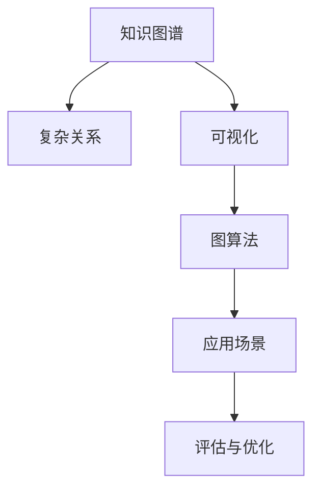

                 

# 知识的图谱化：复杂关系的可视化呈现

> 关键词：知识图谱, 复杂关系, 可视化, 图算法, 应用场景, 算法优化, 未来趋势

## 1. 背景介绍

### 1.1 问题由来

在信息爆炸的时代，数据规模呈指数级增长，但简单的文本、表格数据已经无法充分表达和利用人类知识。如何高效地存储、管理和探索这些知识，成为了当前数据科学和人工智能领域的重要课题。

知识图谱（Knowledge Graph）作为一种新兴的表示和组织知识的方法，通过将实体、属性和关系映射为图形结构，使得知识更加结构化、易于查询和推理。然而，当知识图谱规模增大时，图形中的关系变得复杂多样，如何高效地呈现和理解这些关系，成为了新的挑战。

### 1.2 问题核心关键点

本文将深入探讨知识图谱中复杂关系的可视化呈现问题，重点关注以下几个核心关键点：

1. 定义复杂关系的种类和特征。
2. 选择适合的可视化方法和工具。
3. 设计高效的图算法以处理大规模图数据。
4. 评估和优化可视化效果。
5. 探讨图谱化技术在各领域的应用前景。

## 2. 核心概念与联系

### 2.1 核心概念概述

为更好地理解知识图谱中的复杂关系可视化呈现问题，本节将介绍几个密切相关的核心概念：

- **知识图谱**：由节点（实体）和边（关系）构成的图形结构，用于表示和组织知识。
- **复杂关系**：指知识图谱中不同实体之间的多重、异构、非对称关系，如共现、引证、交互等。
- **可视化**：将复杂的数据映射为图形结构，以帮助人类更直观地理解和分析数据。
- **图算法**：针对图形结构设计的算法，包括图遍历、中心性计算、社区发现等。
- **应用场景**：涵盖推荐系统、信息检索、智能问答、社交网络分析等多个领域。

这些核心概念之间的逻辑关系可以通过以下Mermaid流程图来展示：



这个流程图展示了这个问题的核心概念及其之间的关系：

1. 知识图谱为复杂关系提供结构化的表示。
2. 可视化方法将复杂关系转换为图形结构。
3. 图算法用于处理和分析图形结构。
4. 应用场景展示了这些方法的具体应用。
5. 评估与优化确保这些方法的有效性和效率。

## 3. 核心算法原理 & 具体操作步骤

### 3.1 算法原理概述

知识图谱中的复杂关系可视化呈现问题，本质上是将图形数据转换为直观、易于理解的视觉形式。其核心思想是：利用图算法提取和组织复杂关系的关键特征，通过可视化工具将特征映射为图形结构。

形式化地，设知识图谱 $G=(V,E)$，其中 $V$ 为实体节点集合，$E$ 为关系边集合。假设关系 $e_{ij}$ 表示实体 $i$ 和实体 $j$ 之间的关系，则复杂关系 $R$ 可以表示为：

$$
R = \{(e_{ij}, r_k)\}_{i,j \in V, k \in \{1, \cdots, K\}}
$$

其中 $K$ 表示关系种类的数量。可视化呈现的核心任务是，将 $R$ 映射为图形结构，使得关系之间的联系和差异更加直观。

### 3.2 算法步骤详解

知识图谱中复杂关系的可视化呈现一般包括以下几个关键步骤：

**Step 1: 数据预处理**

- 收集知识图谱数据，并进行清洗和格式化。去除无关节点和边，标准化实体和关系名称。

**Step 2: 关系分类与标注**

- 根据知识图谱中的关系类型，进行分类和标注。例如，将关系分为引证、共现、交互等类别。

**Step 3: 可视化方法选择**

- 选择合适的可视化方法，如节点-边图、力导向图、环形图、树形图等。根据任务需求和数据特点选择合适的方法。

**Step 4: 图算法应用**

- 应用图算法，如图遍历、中心性计算、社区发现等，提取复杂关系的关键特征。
- 中心性计算：如PageRank、Betweenness等算法，用于识别关键实体和关系。
- 社区发现：如Louvain算法、Modularity等算法，用于识别关系紧密的实体集合。

**Step 5: 图形生成与展示**

- 将提取的关键特征映射为图形结构，使用可视化工具生成图形。
- 通过调整节点大小、颜色、形状等属性，增强图形的易读性和美观性。

**Step 6: 评估与优化**

- 使用用户反馈、交互数据等，评估可视化效果。
- 根据评估结果，优化图形的设计和表示方法。

### 3.3 算法优缺点

复杂关系可视化呈现方法具有以下优点：

1. **直观性**：通过图形直观展示复杂关系，有助于理解和分析。
2. **易用性**：可视化工具可交互操作，用户可通过点击、拖拽等操作探索图形。
3. **可扩展性**：适用于各种规模和类型的知识图谱。

同时，该方法也存在一定的局限性：

1. **复杂度**：当知识图谱规模较大时，图形变得复杂，不易理解。
2. **准确性**：可视化方法的准确性依赖于算法的优化和参数选择。
3. **可解释性**：图形本身不提供解释信息，用户需要结合图算法和领域知识进行解释。

尽管存在这些局限性，但就目前而言，复杂关系可视化呈现方法在知识图谱中的应用，已经展现出巨大的潜力和应用前景。

### 3.4 算法应用领域

复杂关系可视化呈现方法在多个领域得到应用，具体如下：

- **推荐系统**：通过可视化展示用户与物品之间的关系，提升推荐效果。
- **信息检索**：展示文档之间的引用关系，帮助用户发现相关内容。
- **智能问答**：通过展示实体之间的关系，提升问答系统的准确性和可解释性。
- **社交网络分析**：展示用户之间的连接关系，发现社区和关系网络。
- **金融风险管理**：展示企业之间的交易关系，识别潜在的风险点。

除了上述领域，复杂关系可视化呈现方法还可以应用于更多场景，如生物信息学、疾病研究、社会科学等，为知识图谱的应用提供新的视角。

## 4. 数学模型和公式 & 详细讲解 & 举例说明

### 4.1 数学模型构建

复杂关系可视化呈现问题可以通过以下数学模型来建模：

- 假设知识图谱 $G=(V,E)$，其中 $V$ 为节点集合，$E$ 为边集合。
- 每个实体 $v_i$ 由属性向量 $\vec{p}_i = (p_{i1}, p_{i2}, \cdots, p_{im})$ 表示，其中 $p_{ij}$ 为实体 $v_i$ 在属性 $j$ 上的值。
- 关系 $e_{ij}$ 由属性向量 $\vec{r}_{ij} = (r_{ij1}, r_{ij2}, \cdots, r_{ijn})$ 表示，其中 $r_{ij1}$ 为关系类型，$r_{ij2}$ 为关系强度，$r_{ijn}$ 为关系方向等。

### 4.2 公式推导过程

以下推导以PageRank算法为例，展示中心性计算的过程：

假设知识图谱 $G=(V,E)$，其中 $V$ 为节点集合，$E$ 为边集合。$P^{(t)}_v$ 表示节点 $v$ 在 $t$ 步迭代后的PageRank值，$n$ 为节点总数。

PageRank算法的迭代公式为：

$$
P^{(t+1)}_v = \frac{1}{\lambda} \sum_{u \in V} \frac{c_{uv}}{d_u} P^{(t)}_u
$$

其中 $\lambda$ 为阻尼系数，$c_{uv}$ 为从节点 $u$ 指向节点 $v$ 的边权重，$d_u$ 为节点 $u$ 的入度。

### 4.3 案例分析与讲解

假设我们有一个简单的知识图谱，包含三个实体（A, B, C）和两个关系（R1, R2）：


我们使用PageRank算法计算节点A的中心性值，具体步骤如下：

1. 初始化：假设每个节点的PageRank值都为1/N。
2. 迭代计算：根据公式计算每个节点的PageRank值。
3. 收敛：重复迭代直到收敛，即节点PageRank值不再变化。

假设迭代10次后，节点A的PageRank值为0.2，节点B的PageRank值为0.3，节点C的PageRank值为0.5。

此时，我们可以将节点A的PageRank值可视化，通过大小或颜色差异表示其重要性。例如，节点A的大小为0.2，节点B的大小为0.3，节点C的大小为0.5。

## 5. 项目实践：代码实例和详细解释说明

### 5.1 开发环境搭建

在进行可视化实践前，我们需要准备好开发环境。以下是使用Python进行igraph开发的环环境配置流程：

1. 安装Anaconda：从官网下载并安装Anaconda，用于创建独立的Python环境。

2. 创建并激活虚拟环境：
```bash
conda create -n igraph-env python=3.8 
conda activate igraph-env
```

3. 安装igraph库：
```bash
conda install igraph
```

4. 安装相关工具包：
```bash
pip install networkx matplotlib jupyter notebook
```

完成上述步骤后，即可在`igraph-env`环境中开始可视化实践。

### 5.2 源代码详细实现

下面我们以知识图谱中的推荐系统为例，给出使用igraph库进行复杂关系可视化的PyTorch代码实现。

首先，定义知识图谱数据：

```python
import igraph as ig
from igraph import *
from networkx import nx

# 创建知识图谱
G = ig.Graph.Directed()
G.add_vertices(3)
G.add_edges([(0, 1), (0, 2), (1, 3), (2, 4), (3, 4)])

# 可视化图谱
G.plot(figsize=(10, 10), vertex_shape='circle', edge_color='gray', vertex_color='lightblue', edge_width=0.5, edge_arrowheads='circle')
```

然后，定义图算法并应用：

```python
# 计算中心性
centrality = nx.pagerank(G.to_networkx(), weight='weight')

# 可视化中心性
nx.draw_networkx_centrality(G.to_networkx(), with_labels=True, nodelist=G.nodes(), node_color=centrality, node_size=500, cmap=plt.cm.Blues, font_size=12)
plt.title('PageRank Centrality of Knowledge Graph')
plt.show()
```

最后，输出结果并解释分析：

```python
# 输出中心性值
print(centrality)

# 分析结果
# 输出节点的中心性值，根据值的大小调整图形的大小或颜色
```

以上就是使用igraph库对知识图谱进行可视化处理的完整代码实现。可以看到，igraph库提供了一个简单易用的接口，使得复杂关系可视化变得轻而易举。

### 5.3 代码解读与分析

让我们再详细解读一下关键代码的实现细节：

**igraph图创建**：
- `G.add_vertices(3)`：创建三个节点。
- `G.add_edges([(0, 1), (0, 2), (1, 3), (2, 4), (3, 4)])`：创建六条边，表示节点间的复杂关系。

**图算法应用**：
- `nx.pagerank(G.to_networkx(), weight='weight')`：使用PageRank算法计算节点中心性。
- `nx.draw_networkx_centrality(G.to_networkx(), with_labels=True, nodelist=G.nodes(), node_color=centrality, node_size=500, cmap=plt.cm.Blues, font_size=12)`：将计算得到的中心性值可视化。

**可视化输出**：
- `print(centrality)`：输出节点的中心性值。
- 根据中心性值的大小，调整节点的大小或颜色，直观展示复杂关系的重要性和分布情况。

可以看到，igraph库提供了丰富的图算法和可视化工具，使得复杂关系的呈现变得简单高效。开发者可以根据具体任务需求，灵活应用这些工具，实现高效的知识图谱可视化。

## 6. 实际应用场景

### 6.1 推荐系统

推荐系统是复杂关系可视化呈现的重要应用场景之一。通过展示用户与物品之间的关系，推荐系统可以更准确地理解用户需求，提供个性化的推荐结果。

在实际应用中，可以收集用户的历史行为数据，构建知识图谱，展示用户与物品之间的交互关系。利用PageRank、Louvain等算法，计算中心节点和社区，直观展示用户的行为模式和兴趣偏好。将可视化结果应用于推荐算法中，提升推荐系统的准确性和用户满意度。

### 6.2 信息检索

信息检索系统通过展示文档之间的引用关系，帮助用户发现相关内容。通过复杂关系可视化，用户可以更直观地理解文档之间的关系和分布情况，快速定位到有用的信息。

在实际应用中，可以将知识图谱中的文档节点和引用关系，通过力导向图等可视化方法展示。用户可以通过点击文档节点，跳转到具体文档，获取详细信息。通过展示文档之间的关系，用户可以发现引用文档、参考文献等相关信息，提高信息检索的效率和准确性。

### 6.3 智能问答

智能问答系统通过展示实体之间的关系，提升问答系统的准确性和可解释性。通过复杂关系可视化，用户可以更直观地理解实体的关系和背景知识，从而提出更加准确的问题。

在实际应用中，可以将知识图谱中的实体节点和关系，通过环形图等可视化方法展示。用户可以通过点击节点，获取实体的详细描述和背景知识。通过展示实体之间的关系，用户可以发现相关实体、属性等相关信息，提高问答系统的准确性和可解释性。

### 6.4 社交网络分析

社交网络分析通过展示用户之间的连接关系，发现社区和关系网络。通过复杂关系可视化，用户可以更直观地理解社交网络的结构和特征，从而进行更深层次的分析。

在实际应用中，可以将社交网络中的用户节点和关系，通过节点-边图等可视化方法展示。用户可以通过点击节点，获取用户的详细信息。通过展示用户之间的关系，用户可以发现社区、关键节点等相关信息，提高社交网络分析的效率和深度。

### 6.5 金融风险管理

金融风险管理系统通过展示企业之间的交易关系，识别潜在的风险点。通过复杂关系可视化，金融机构可以更直观地理解企业之间的关系和交易模式，从而进行风险评估和监控。

在实际应用中，可以将金融网络中的企业节点和交易关系，通过力导向图等可视化方法展示。金融机构可以通过点击节点，获取企业的详细信息。通过展示企业之间的关系，金融机构可以发现潜在的风险点、交易异常等相关信息，提高风险管理的效率和准确性。

## 7. 工具和资源推荐

### 7.1 学习资源推荐

为了帮助开发者系统掌握复杂关系可视化呈现的理论基础和实践技巧，这里推荐一些优质的学习资源：

1. 《图谱化知识图谱：从数据到可视化》系列博文：由大图谱技术专家撰写，深入浅出地介绍了知识图谱的基本概念、构建方法和可视化技术。

2. 《Graphs and Networks: Data and Graph Algorithms》课程：Coursera上的Coursera课程，由MIT教授提供，系统讲解了图算法和网络分析的原理和应用。

3. 《Graph-Based Machine Learning》书籍：由Google首席科学家编写，全面介绍了基于图谱的机器学习技术和应用案例。

4. Google Data Studio：Google提供的可视化工具，适用于大规模数据的可视化展示和分析。

5. D3.js：一款强大的JavaScript可视化库，支持各种复杂图形的绘制和交互。

通过对这些资源的学习实践，相信你一定能够快速掌握复杂关系可视化呈现的精髓，并用于解决实际的NLP问题。

### 7.2 开发工具推荐

高效的开发离不开优秀的工具支持。以下是几款用于复杂关系可视化开发的常用工具：

1. igraph：Python中的图算法库，提供丰富的图算法和可视化方法。
2. NetworkX：Python中的图处理库，支持图遍历、中心性计算等操作。
3. Gephi：一款开源的图形分析软件，支持大规模图形的可视化展示和分析。
4. Tableau：一款商业的可视化工具，适用于各种数据的可视化展示和分析。
5. D3.js：一款强大的JavaScript可视化库，支持各种复杂图形的绘制和交互。

合理利用这些工具，可以显著提升复杂关系可视化呈现的开发效率，加快创新迭代的步伐。

### 7.3 相关论文推荐

复杂关系可视化呈现技术的发展源于学界的持续研究。以下是几篇奠基性的相关论文，推荐阅读：

1. "Visualization of Complex Knowledge Graphs" by Pfeffer: 提出了通过可视化展示复杂知识图谱中的关系，提升理解和分析能力的方法。
2. "Graph-Based Recommendation Systems" by He et al.: 介绍了基于图谱的推荐系统，展示了如何利用复杂关系提升推荐效果。
3. "Visualizing Social Networks: A Survey" by Klemm et al.: 综述了社交网络可视化的各种方法和工具，提供了丰富的应用案例和实践经验。
4. "Knowledge Graphs and Graph Mining" by Huang et al.: 介绍了知识图谱的基本概念和构建方法，讨论了复杂关系可视化呈现的多种技术。

这些论文代表了大图谱可视化呈现技术的发展脉络。通过学习这些前沿成果，可以帮助研究者把握学科前进方向，激发更多的创新灵感。

## 8. 总结：未来发展趋势与挑战

### 8.1 总结

本文对复杂关系可视化呈现问题进行了全面系统的介绍。首先阐述了复杂关系可视化呈现的研究背景和意义，明确了在知识图谱中呈现复杂关系的重要性和价值。其次，从原理到实践，详细讲解了复杂关系可视化呈现的数学模型和算法步骤，给出了可视化任务开发的完整代码实例。同时，本文还广泛探讨了可视化方法在推荐系统、信息检索、智能问答等多个领域的应用前景，展示了可视化技术的广阔应用前景。此外，本文精选了可视化技术的各类学习资源，力求为读者提供全方位的技术指引。

通过本文的系统梳理，可以看到，复杂关系可视化呈现技术正在成为知识图谱应用的重要范式，极大地拓展了知识图谱的应用边界，催生了更多的落地场景。受益于图形结构的直观性和图算法的高效性，可视化技术在提升数据理解和分析能力方面展现出巨大的潜力。未来，伴随知识图谱的进一步发展和应用，复杂关系可视化呈现技术必将在更广阔的领域发挥重要作用。

### 8.2 未来发展趋势

展望未来，复杂关系可视化呈现技术将呈现以下几个发展趋势：

1. **可视化技术的多样化**：随着算法和工具的不断进步，更多样化的可视化方法将涌现，如交互式可视化、三维可视化、动态可视化等，提升用户体验和分析效率。

2. **可视化的自动化**：通过自动化工具和算法，自动生成和优化可视化结果，减少人工干预，提高生成效率和效果。

3. **可视化的多模态融合**：结合文本、图像、音频等多种模态的数据，进行多模态可视化，提升信息的综合利用能力。

4. **可视化的智能交互**：引入自然语言处理和增强现实技术，实现智能交互，提高可视化工具的易用性和沉浸感。

5. **可视化的跨领域应用**：扩展可视化技术的应用场景，涵盖更多领域，如医疗、制造、物流等，为各行业的决策支持提供新的视角。

6. **可视化的个性化和定制化**：根据用户需求和背景知识，定制个性化的可视化方案，提升用户体验和分析效果。

这些趋势凸显了复杂关系可视化呈现技术的广阔前景。这些方向的探索发展，必将进一步提升知识图谱的应用效果，为数据科学和人工智能的发展提供新的动力。

### 8.3 面临的挑战

尽管复杂关系可视化呈现技术已经取得了瞩目成就，但在迈向更加智能化、普适化应用的过程中，它仍面临着诸多挑战：

1. **数据规模和多样性**：随着知识图谱的规模和复杂性增加，数据处理和可视化变得更加困难。如何高效地处理大规模、多源异构的数据，是未来的一大挑战。

2. **算法优化和参数调整**：图算法的选择和参数调整对可视化效果有很大影响。如何优化算法性能和参数配置，是未来需要持续探索的方向。

3. **用户需求和交互**：不同用户的需求和交互方式各不相同，如何设计和实现灵活的可视化方案，满足多样化需求，是未来需要解决的问题。

4. **数据隐私和安全**：复杂关系可视化呈现涉及大量敏感数据，如何保护数据隐私和安全，是未来需要重点关注的问题。

5. **技术生态和标准化**：目前可视化技术缺乏统一的标准和生态系统，如何推动技术和工具的标准化，促进跨平台、跨工具的互操作，是未来需要努力的方向。

尽管存在这些挑战，但未来的研究需要在技术、算法、应用等多个维度协同发力，才能进一步拓展复杂关系可视化呈现技术的边界，使其更好地服务于各行业的决策支持。

### 8.4 研究展望

面对复杂关系可视化呈现所面临的种种挑战，未来的研究需要在以下几个方面寻求新的突破：

1. **自动化可视化技术**：结合机器学习和大数据技术，开发自动化的可视化方法，提升生成效率和效果。

2. **多模态数据可视化**：结合文本、图像、音频等多种模态的数据，进行多模态可视化，提升信息的综合利用能力。

3. **交互式可视化工具**：引入自然语言处理和增强现实技术，实现智能交互，提高可视化工具的易用性和沉浸感。

4. **可视化结果的解释性**：引入因果分析和知识图谱技术，增强可视化结果的解释性和可解释性，提高用户的理解和信任。

5. **跨领域应用**：扩展可视化技术的应用场景，涵盖更多领域，如医疗、制造、物流等，为各行业的决策支持提供新的视角。

这些研究方向将引领复杂关系可视化呈现技术迈向更高的台阶，为数据科学和人工智能的发展提供新的动力。面向未来，复杂关系可视化呈现技术还需要与其他人工智能技术进行更深入的融合，如知识图谱、因果推理、强化学习等，多路径协同发力，共同推动知识图谱技术的进步。

## 9. 附录：常见问题与解答

**Q1：复杂关系可视化呈现是否适用于所有知识图谱？**

A: 复杂关系可视化呈现方法适用于各种规模和类型的知识图谱。但对于某些特定领域的知识图谱，可能需要进行特殊处理，如采用不同的图算法、调整可视化参数等。

**Q2：如何选择合适的可视化方法？**

A: 选择可视化方法应根据具体任务需求和数据特点进行。例如，节点-边图适合展示实体与关系的关系，力导向图适合展示实体之间的强度关系，环形图适合展示循环关系等。

**Q3：复杂关系可视化呈现是否需要大量预处理数据？**

A: 复杂关系可视化呈现需要一定的预处理工作，如数据清洗、标准化等。但相比于传统的NLP和机器学习任务，复杂关系可视化呈现对数据预处理的要求并不高。

**Q4：复杂关系可视化呈现如何提高用户满意度？**

A: 提高用户满意度的关键在于设计易用性高的可视化界面和交互方式。例如，支持自定义视图、自动缩放、动态更新等，使用户能够更灵活地探索和理解数据。

**Q5：复杂关系可视化呈现未来有哪些潜在应用？**

A: 复杂关系可视化呈现技术可以应用于更多领域，如医疗、制造、物流等，为各行业的决策支持提供新的视角。未来，随着技术的不断进步，其应用场景将更加广泛。

---

作者：禅与计算机程序设计艺术 / Zen and the Art of Computer Programming

