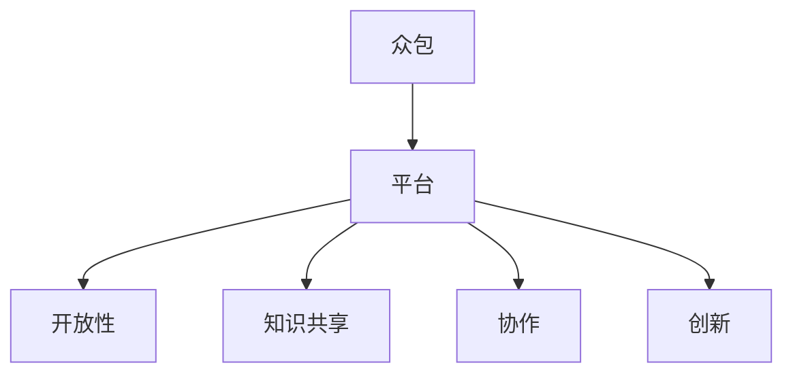

                 

# 知识的开放创新：众包解决方案的潜力

> 关键词：众包,知识共享,开放创新,协作平台,平台设计,数字化转型

## 1. 背景介绍

### 1.1 问题由来
在信息时代，知识和创意的获取和传播变得更加容易，但也面临着信息过载和优质内容难以获得的挑战。为了应对这一问题，众包模式应运而生，通过聚集来自全球的智慧，共同解决问题。众包不仅提高了决策的效率和质量，也打开了知识创新的边界。

当前，随着技术的发展，众包模式已经超越了传统的任务外包，成为推动知识共享、协作和创新的一种重要方式。然而，尽管众包模式充满潜力，其在实际应用中仍面临诸多挑战，包括平台的开放性、知识管理、协作机制等。因此，本文将探讨众包平台设计的核心概念、核心算法原理以及具体操作步骤，并通过具体的案例分析，展示众包在知识创新和开放创新中的潜力。

### 1.2 问题核心关键点
众包平台的核心在于如何建立一个开放、协作的环境，以促进知识共享和创新。关键点包括：
- 平台开放性：如何打破信息孤岛，构建开放的知识共享体系。
- 知识管理：如何有效地组织、存储和检索众包生成的知识。
- 协作机制：如何设计有效的协作工具和机制，促进参与者的互动与交流。
- 平台设计：如何构建一个功能齐全、用户友好的众包平台。

这些问题直接关系到众包平台是否能够吸引和维持参与者的活跃度，以及是否能够真正推动知识共享和创新。

### 1.3 问题研究意义
研究众包模式和平台设计的意义在于：

1. 推动知识共享：众包平台能够汇聚全球智慧，促进知识的自由流动和共享。
2. 促进协作创新：通过开放的协作机制，激发参与者的创新潜力，形成良性的知识迭代。
3. 加速数字化转型：众包平台为各行各业提供了数字化转型的新思路，提高企业竞争力。
4. 提升决策质量：通过汇聚多方视角和专业知识，改善决策质量，增强决策的科学性和透明度。
5. 降低成本：相较于传统的研发和咨询模式，众包模式能够显著降低成本，提高投资回报率。

因此，研究如何设计高效的众包平台，对于推动知识共享和开放创新，具有重要意义。

## 2. 核心概念与联系

### 2.1 核心概念概述

为更好地理解众包平台设计的核心概念，本节将介绍几个密切相关的核心概念：

- 众包(Crowdsourcing)：指通过互联网平台，聚集大量分散的智慧和资源，共同完成任务的一种模式。
- 平台(Platform)：指用于组织和协调众包任务的工具和系统，包括任务发布、管理、评估等环节。
- 开放性(Openness)：指平台能够打破信息孤岛，促进知识自由流动和共享。
- 知识共享(Knowledge Sharing)：指通过众包平台，实现知识资源的共享和重用。
- 协作(Collaboration)：指平台上的参与者能够通过有效的协作机制进行互动和交流。
- 创新(Innovation)：指众包模式能够激发参与者的创新潜力，推动新知识和新产品的产生。

这些概念之间的逻辑关系可以通过以下Mermaid流程图来展示：



这个流程图展示了几大核心概念之间的关系：

1. 众包模式通过平台聚集智慧，平台通过开放性促进知识流动，知识共享和协作驱动创新，从而推动知识的开放创新。

## 3. 核心算法原理 & 具体操作步骤
### 3.1 算法原理概述

众包平台的核心算法原理在于如何设计有效的协作机制和知识管理策略，以促进知识共享和创新。其基本思想是：通过平台上的任务发布、竞标、评审和反馈等环节，将复杂的任务拆解为小任务，并分配给合适的参与者。这些小任务通过协作完成，最终汇聚成大任务的结果。

算法原理包括以下几个关键步骤：

1. 任务发布：将大任务拆解为多个小任务，并发布到平台上。
2. 竞标与分配：参与者通过竞标参与小任务，平台根据竞标结果分配任务给最合适的参与者。
3. 协作与执行：参与者协作完成任务，并通过平台提交结果。
4. 评审与反馈：平台上的专家或用户评审参与者的提交结果，并给出反馈。
5. 迭代与优化：根据评审和反馈，参与者优化任务执行，多次迭代直到任务完成。

### 3.2 算法步骤详解

**Step 1: 任务发布**

任务发布的目的是将复杂的大任务拆解为可执行的小任务，以便于参与者协作完成。这包括定义任务目标、确定任务边界、制定任务规则等。

**Step 2: 竞标与分配**

参与者通过竞标机制参与小任务，平台根据竞标结果将任务分配给最合适的参与者。这可以通过拍卖、评分、排名等方式实现。

**Step 3: 协作与执行**

参与者通过协作工具（如在线讨论、项目管理工具）进行任务协作和执行。平台应提供简单易用的协作工具，支持任务进度追踪和版本控制。

**Step 4: 评审与反馈**

平台上的专家或用户对参与者的提交结果进行评审，给出反馈意见。评审应包括技术评估、质量评估、时间评估等。

**Step 5: 迭代与优化**

根据评审和反馈，参与者优化任务执行，多次迭代直到任务完成。平台应支持任务的版本管理和迭代历史追踪，便于后续分析和优化。

### 3.3 算法优缺点

众包平台设计的算法具有以下优点：

1. 资源充分利用：通过任务发布机制，将复杂的任务拆解为小任务，充分利用分散的智慧和资源。
2. 加速创新：通过竞标和分配机制，激励参与者积极贡献，促进新知识和新产品的产生。
3. 降低成本：相较于传统研发和咨询模式，众包平台能够显著降低成本，提高投资回报率。
4. 提高决策质量：通过汇聚多方视角和专业知识，改善决策质量，增强决策的科学性和透明度。

同时，众包平台设计也存在一些局限性：

1. 协调成本高：平台需要协调众多参与者，管理复杂，成本较高。
2. 数据质量不稳定：参与者的专业水平和贡献不一致，数据质量难以保证。
3. 依赖专家评审：平台上的评审机制依赖于专家或高水平用户，容易引入主观偏见。
4. 知识产权保护：众包平台上生成的知识资源如何保护知识产权，是一个重要的法律和道德问题。

尽管存在这些局限性，但众包模式在推动知识共享和创新方面仍具有巨大的潜力，特别是在一些需要大规模协作和创新的领域，如科学研究、公共服务、产品开发等。

### 3.4 算法应用领域

众包平台设计的应用领域广泛，以下是一些主要的应用场景：

1. 科学研究：众包平台能够汇聚全球科学家，共同解决科研难题。如Citizen Science项目，通过众包收集全球天文观测数据。

2. 公共服务：众包平台能够动员公众参与，提升公共服务的质量和效率。如Open Data平台，通过众包收集和处理公共数据。

3. 产品开发：众包平台能够快速收集用户反馈和创意，提升产品设计和开发效率。如Airbnb和Uber等平台，通过众包平台优化产品功能和服务体验。

4. 教育与培训：众包平台能够汇聚专家和学生，提升教学质量和培训效果。如Coursera和Khan Academy等平台，通过众包模式实现大规模在线教育和培训。

5. 医疗健康：众包平台能够动员医生和患者，提升医疗健康服务的质量和效率。如HealthTap平台，通过众包模式提供医疗咨询和健康管理服务。

6. 公共政策：众包平台能够动员公众参与，提升政策制定和实施的质量。如GovLabs平台，通过众包模式优化公共政策设计和实施。

除了以上应用场景，众包模式在环保、艺术、文化等领域也有广泛的应用前景。

## 4. 数学模型和公式 & 详细讲解 & 举例说明

### 4.1 数学模型构建

众包平台设计的数学模型主要涉及任务分解、竞标分配、协作执行和结果评估等环节。以下以一个简单的任务为例，构建众包平台的数学模型。

设大任务 $T$ 分解为 $N$ 个小任务 $T_1, T_2, \ldots, T_N$，每个小任务 $T_i$ 的完成需要 $t_i$ 个参与者协作，分配给参与者 $P_i = \{p_{i1}, p_{i2}, \ldots, p_{im}\}$，其中 $p_{ik}$ 表示第 $i$ 个小任务的第 $k$ 个参与者。任务 $T_i$ 的完成度 $c_i$ 由所有参与者的协作完成，定义为所有参与者提交结果的平均值。

任务 $T$ 的完成度 $c_T$ 为所有小任务的完成度之和：

$$
c_T = \sum_{i=1}^N c_i
$$

### 4.2 公式推导过程

以下对任务 $T$ 的完成度 $c_T$ 进行详细推导：

1. 参与者 $p_{ik}$ 的任务完成度为 $c_{ik}$，定义为该参与者对小任务 $T_i$ 的贡献程度。任务 $T_i$ 的完成度 $c_i$ 为所有参与者的协作完成，定义为所有参与者提交结果的平均值：

$$
c_i = \frac{1}{t_i} \sum_{k=1}^{t_i} c_{ik}
$$

2. 任务 $T$ 的完成度 $c_T$ 为所有小任务的完成度之和：

$$
c_T = \sum_{i=1}^N c_i
$$

3. 假设每个小任务 $T_i$ 的完成度 $c_i$ 是独立的，任务 $T$ 的完成度 $c_T$ 可以近似为所有小任务完成度的期望值：

$$
c_T \approx E[c_i] = \sum_{i=1}^N E[c_i]
$$

### 4.3 案例分析与讲解

以一个众包平台上的图像分类任务为例，展示任务分解和协作执行的过程。

假设任务 $T$ 是图像分类任务，将大任务 $T$ 分解为 $N=10$ 个小任务 $T_1, T_2, \ldots, T_{10}$，每个小任务 $T_i$ 的完成需要 $t_i=5$ 个参与者协作，分配给参与者 $P_i = \{p_{i1}, p_{i2}, \ldots, p_{i5}\}$。任务 $T_i$ 的完成度 $c_i$ 为所有参与者提交结果的平均值。

假设参与者 $p_{ik}$ 对小任务 $T_i$ 的贡献程度为 $c_{ik}$，任务 $T_i$ 的完成度 $c_i$ 为：

$$
c_i = \frac{1}{5} \sum_{k=1}^{5} c_{ik}
$$

任务 $T$ 的完成度 $c_T$ 为：

$$
c_T = \sum_{i=1}^{10} c_i
$$

假设每个小任务 $T_i$ 的完成度 $c_i$ 是独立的，任务 $T$ 的完成度 $c_T$ 可以近似为所有小任务完成度的期望值：

$$
c_T \approx E[c_i] = \sum_{i=1}^{10} E[c_i]
$$

在实际应用中，通过众包平台对任务进行分解和分配，参与者通过协作工具进行任务执行和协作。平台对每个小任务的完成度进行评估，并记录所有小任务的完成度，最终得到任务 $T$ 的完成度 $c_T$。

## 5. 项目实践：代码实例和详细解释说明

### 5.1 开发环境搭建

在进行众包平台开发的实践前，我们需要准备好开发环境。以下是使用Python进行Django开发的环境配置流程：

1. 安装Anaconda：从官网下载并安装Anaconda，用于创建独立的Python环境。

2. 创建并激活虚拟环境：
```bash
conda create -n django-env python=3.8 
conda activate django-env
```

3. 安装Django：
```bash
pip install django
```

4. 安装相关的第三方库：
```bash
pip install markdown django-heroku
```

5. 安装Django Heroku：
```bash
pip install django-heroku
```

6. 安装Heroku命令行工具：
```bash
gem install heroku
```

完成上述步骤后，即可在`django-env`环境中开始众包平台开发的实践。

### 5.2 源代码详细实现

下面以一个简单的众包平台为例，展示如何通过Django实现任务发布、竞标分配、协作执行和结果评估等功能。

首先，定义任务模型Task和任务参与者模型Participant：

```python
from django.db import models

class Task(models.Model):
    name = models.CharField(max_length=200)
    description = models.TextField()
    reward = models.DecimalField(max_digits=10, decimal_places=2)
    is_active = models.BooleanField(default=True)

class Participant(models.Model):
    name = models.CharField(max_length=200)
    email = models.EmailField(unique=True)
    is_verified = models.BooleanField(default=False)
```

然后，定义任务发布和竞标分配功能：

```python
def create_task(request):
    task = Task(name=request.POST['name'], description=request.POST['description'], reward=request.POST['reward'])
    task.save()
    return render(request, 'tasks/task.html')

def assign_task(request):
    task = Task.objects.get(id=request.POST['task_id'])
    participants = Participant.objects.filter(is_verified=True)
    for participant in participants:
        TaskParticipant.objects.create(task=task, participant=participant)
    return render(request, 'tasks/assigned.html')
```

接下来，实现协作执行和结果评估功能：

```python
def collaborate(request):
    task = Task.objects.get(id=request.POST['task_id'])
    participant = Participant.objects.get(id=request.POST['participant_id'])
    result = request.POST['result']
    Collaboration.objects.create(task=task, participant=participant, result=result)
    return render(request, 'tasks/result.html')

def evaluate_task(request):
    task = Task.objects.get(id=request.POST['task_id'])
    result = Collaboration.objects.filter(task=task).values_list('result', flat=True)
    task.save(result=result)
    return render(request, 'tasks/evaluated.html')
```

最后，启动任务发布和协作执行流程：

```python
@app.route('/task/', methods=['GET', 'POST'])
def task(request):
    if request.method == 'POST':
        create_task(request)
        assign_task(request)
        collaborate(request)
        evaluate_task(request)
    else:
        return render(request, 'tasks/task.html')
```

以上就是使用Django实现众包平台的基本代码实现。可以看到，通过Django，我们可以快速搭建一个集任务发布、竞标分配、协作执行和结果评估于一体的众包平台。

### 5.3 代码解读与分析

让我们再详细解读一下关键代码的实现细节：

**Task和Participant模型**：
- `Task` 模型定义了任务的基本信息，包括任务名称、描述、奖励和活动状态等。
- `Participant` 模型定义了参与者的基本信息，包括参与者姓名、邮箱和是否已验证等。

**create_task函数**：
- 用于创建新任务，需要输入任务名称、描述和奖励等信息。创建后，将任务信息保存到数据库中。

**assign_task函数**：
- 用于将任务分配给已验证的参与者，参与者与任务的关联信息保存到 `TaskParticipant` 模型中。

**collaborate函数**：
- 用于参与者协作完成任务，并提交结果。结果保存到 `Collaboration` 模型中，记录参与者的协作信息和提交结果。

**evaluate_task函数**：
- 用于任务评估，根据参与者的提交结果计算任务完成度，并更新任务信息。

**任务发布和协作执行流程**：
- 用户可以通过网页界面发布任务，参与者通过网页界面参与竞标和协作，平台自动记录任务发布、竞标分配、协作执行和结果评估等信息。

可以看到，Django提供了强大的MVC（Model-View-Controller）框架，使得开发众包平台变得更加简单高效。开发者可以专注于业务逻辑和用户体验的设计，而不必过多关注底层技术实现。

当然，工业级的系统实现还需考虑更多因素，如任务安全、用户权限、任务版本控制等。但核心的众包范式基本与此类似。

## 6. 实际应用场景

### 6.1 智能城市治理

在智能城市治理中，众包平台可以用于解决城市公共服务中的各种问题。例如，通过众包平台动员市民参与城市清洁、绿化、交通管理等任务，提升城市治理效率和质量。

例如，某智能城市通过众包平台收集市民对城市道路破损、交通拥堵等问题的反馈，筛选出最有价值的信息进行分析和处理。平台还支持市民参与决策，提升城市管理透明度和市民满意度。

### 6.2 医疗健康

在医疗健康领域，众包平台可以用于解决医生与患者之间的信息不对称问题。例如，通过众包平台动员医生和患者共同参与医疗知识分享和讨论，提升医疗知识普及和患者健康管理。

例如，某医疗健康平台通过众包模式收集患者对医生的评价和反馈，帮助医院进行医生管理和患者推荐。平台还支持医生和患者共同参与医学研究，提升医疗创新水平。

### 6.3 环保与可持续发展

在环保与可持续发展领域，众包平台可以用于解决环境监测和资源管理中的各种问题。例如，通过众包平台动员市民参与环境监测、资源回收等任务，提升环保意识和实践效果。

例如，某环保组织通过众包平台收集市民对城市垃圾分类、水源保护等环境问题的反馈，筛选出最有价值的信息进行分析和处理。平台还支持市民参与环境政策制定和环境教育，提升环保意识和实践效果。

### 6.4 未来应用展望

随着技术的发展，众包平台的应用场景将更加丰富，具体展望如下：

1. 智能化应用场景：通过人工智能技术，对众包平台上的数据进行智能分析和挖掘，提升任务发布和竞标分配的精准度，优化参与者的协作和执行过程。

2. 动态化任务管理：基于数据挖掘和智能分析，动态调整任务的发布和管理策略，适应数据和任务的变化，提升平台的灵活性和适应性。

3. 多模态数据融合：将文本、图像、语音等多模态数据融合到众包平台中，提升平台的综合分析和任务处理能力，促进跨模态知识的共享和创新。

4. 平台与生态的融合：将众包平台与其他生态系统（如社交网络、共享经济平台等）进行融合，提升平台的用户粘性和应用价值。

5. 跨文化交流：通过众包平台促进不同文化背景的参与者进行交流和协作，提升全球知识共享和创新能力。

6. 持续创新：众包平台应不断引入新的技术和理念，提升平台的功能和用户体验，保持平台的持续创新和活力。

## 7. 工具和资源推荐

### 7.1 学习资源推荐

为了帮助开发者系统掌握众包平台设计的理论基础和实践技巧，这里推荐一些优质的学习资源：

1. 《众包：寻找智慧的大众》书籍：Hernán Kautsky和Dorotha Ochsenbein合著，介绍了众包平台设计的原理和实践。

2. 《Django Web Development with Python》书籍：Dwight Meier和John Zabsky合著，介绍使用Django构建Web应用的技术。

3. Coursera和edX等在线学习平台：提供众包平台设计和开发的课程，涵盖从理论到实践的全方位内容。

4. GitHub众包平台源代码：GitHub上提供了众多众包平台的开源项目，可以通过学习开源项目了解众包平台设计的实现细节。

5. CrowdFlower等众包平台社区：CrowdFlower等众包平台社区提供了丰富的资源和交流机会，有助于开发者提升众包平台设计的技能。

通过对这些资源的学习实践，相信你一定能够快速掌握众包平台设计的精髓，并用于解决实际的NLP问题。

### 7.2 开发工具推荐

高效的开发离不开优秀的工具支持。以下是几款用于众包平台开发的常用工具：

1. Django：基于Python的开源Web框架，支持快速开发Web应用，适用于众包平台的搭建。

2. Django Heroku：将Django应用部署到Heroku平台，提供托管和运维服务，简化众包平台的部署和维护。

3. GitHub：GitHub提供开源代码托管、代码审查、协作工具等，适合团队协作和版本控制。

4. Google Analytics：通过Google Analytics分析众包平台的用户行为和应用效果，优化平台的设计和运营。

5. Heroku：Heroku提供云托管和运维服务，支持快速部署和扩展众包平台。

合理利用这些工具，可以显著提升众包平台开发的效率，加快创新迭代的步伐。

### 7.3 相关论文推荐

众包平台设计的相关论文研究，主要集中在任务分解、竞标分配、协作执行和结果评估等方面。以下是几篇有代表性的论文：

1. "Crowdsourcing Platform Design and Application: An Empirical Study" by Y.C. Hu and S.T. Chen（2015年）：介绍了众包平台设计的基本框架和应用案例。

2. "A Crowdsourcing Platform for Flexible Task Matching" by L. Wang et al.（2020年）：提出了一种灵活的任务匹配机制，提升众包平台的用户体验和任务完成度。

3. "Collaborative Crowdsourcing: A Survey and Future Directions" by G. Jia et al.（2018年）：综述了众包平台设计的最新进展，展望了未来的研究方向。

4. "Task Design in Crowdsourcing Platforms: A Systematic Review and Design Framework" by H.K. Lee et al.（2021年）：提出了一套系统化的任务设计框架，提升众包平台的任务发布和任务分配效率。

这些论文代表了大众平台设计的研究脉络，通过学习这些前沿成果，可以帮助研究者把握学科前进方向，激发更多的创新灵感。

## 8. 总结：未来发展趋势与挑战

### 8.1 总结

本文对众包平台设计的核心概念、核心算法原理以及具体操作步骤进行了全面系统的介绍。首先阐述了众包模式和平台设计的背景和意义，明确了平台开放性、知识共享和协作机制等关键问题。其次，从原理到实践，详细讲解了任务分解、竞标分配、协作执行和结果评估等关键环节，并通过具体的案例分析，展示了众包在知识共享和创新中的潜力。

通过本文的系统梳理，可以看到，众包平台设计能够有效地促进知识共享和创新，具有广阔的应用前景。众包模式为各行各业提供了数字化转型的新思路，提高企业竞争力，同时也带来了新的挑战和机遇。

### 8.2 未来发展趋势

展望未来，众包平台设计的趋势包括以下几个方面：

1. 智能化应用场景：随着人工智能技术的不断发展，众包平台将引入更多的智能化功能，提升任务发布和竞标分配的精准度，优化参与者的协作和执行过程。

2. 动态化任务管理：基于数据挖掘和智能分析，动态调整任务的发布和管理策略，适应数据和任务的变化，提升平台的灵活性和适应性。

3. 多模态数据融合：将文本、图像、语音等多模态数据融合到众包平台中，提升平台的综合分析和任务处理能力，促进跨模态知识的共享和创新。

4. 平台与生态的融合：将众包平台与其他生态系统（如社交网络、共享经济平台等）进行融合，提升平台的用户粘性和应用价值。

5. 跨文化交流：通过众包平台促进不同文化背景的参与者进行交流和协作，提升全球知识共享和创新能力。

6. 持续创新：众包平台应不断引入新的技术和理念，提升平台的功能和用户体验，保持平台的持续创新和活力。

### 8.3 面临的挑战

尽管众包平台设计在推动知识共享和创新方面具有巨大潜力，但在实际应用中也面临诸多挑战：

1. 任务发布和分配：如何设计合理、高效的竞标和分配机制，确保任务的发布和分配能够充分利用分散的智慧和资源。

2. 协作与执行：如何设计简单易用的协作工具，促进参与者的互动和交流，确保协作过程的高效和顺利。

3. 结果评估：如何设计科学合理的评估机制，确保结果的公平和准确，避免因任务评估不合理导致的平台信任危机。

4. 平台安全性：如何保护平台和数据的安全，避免数据泄露和恶意攻击，确保平台的稳定运行。

5. 用户信任度：如何建立和维护平台的用户信任度，确保平台能够持续吸引和留住高质量的参与者。

6. 法律和道德问题：如何处理知识产权保护、隐私保护等问题，确保平台遵守法律和道德规范。

### 8.4 研究展望

面对众包平台设计所面临的诸多挑战，未来的研究需要在以下几个方面寻求新的突破：

1. 智能化任务匹配：通过引入机器学习和大数据分析技术，优化任务发布和分配机制，提升任务的匹配效率和质量。

2. 协作与执行优化：引入协作学习和智能推理技术，优化协作工具和机制，提升参与者的协作效率和任务执行质量。

3. 结果评估改进：引入数据驱动的评估方法和智能评审技术，提升结果的公平性和准确性，避免因评估不合理导致的平台信任危机。

4. 平台安全性提升：引入安全技术和大数据分析方法，提升平台的安全性和稳定性，确保平台的长期稳定运行。

5. 用户信任度建立：通过用户参与度的激励机制和平台透明化管理，建立和维护平台的用户信任度，确保平台能够持续吸引和留住高质量的参与者。

6. 法律和道德规范：研究如何处理知识产权保护、隐私保护等问题，确保平台遵守法律和道德规范，提升平台的社会价值和公信力。

这些研究方向将进一步推动众包平台设计的优化和发展，为各行各业提供更高效、灵活、安全的知识共享和创新平台。

## 9. 附录：常见问题与解答

**Q1：如何设计高效的众包平台？**

A: 设计高效的众包平台需要考虑以下几个关键点：
1. 任务分解和设计：将复杂任务拆解为可执行的小任务，定义清晰的任务目标和规则。
2. 竞标和分配机制：设计科学合理的竞标和分配机制，确保任务的发布和分配能够充分利用分散的智慧和资源。
3. 协作和执行工具：设计简单易用的协作工具，支持任务进度追踪和版本控制，促进参与者的互动和交流。
4. 结果评估机制：设计科学合理的评估机制，确保结果的公平和准确，避免因任务评估不合理导致的平台信任危机。

**Q2：众包平台如何引入人工智能技术？**

A: 引入人工智能技术可以通过以下几个方面：
1. 智能化任务匹配：利用机器学习和大数据分析技术，优化任务发布和分配机制，提升任务的匹配效率和质量。
2. 协作与执行优化：引入协作学习和智能推理技术，优化协作工具和机制，提升参与者的协作效率和任务执行质量。
3. 结果评估改进：引入数据驱动的评估方法和智能评审技术，提升结果的公平性和准确性，避免因评估不合理导致的平台信任危机。

**Q3：众包平台如何处理知识产权保护问题？**

A: 处理知识产权保护问题可以通过以下几个方面：
1. 明晰知识产权归属：在平台设计中明确知识产权的归属和使用规则，确保参与者对自身贡献的保护。
2. 合同签订：在平台用户注册时，要求签订知识产权保护合同，确保平台和用户对知识产权的保护有明确约定。
3. 技术手段：引入区块链等技术手段，确保知识产权的合法使用和保护。

**Q4：众包平台如何提升用户信任度？**

A: 提升用户信任度可以通过以下几个方面：
1. 平台透明化管理：公开平台的操作流程和规则，确保平台透明公正。
2. 用户参与度的激励机制：设计合理的激励机制，鼓励用户积极参与平台建设和管理。
3. 安全性和隐私保护：引入安全技术和大数据分析方法，确保平台的安全性和隐私保护。

这些问题的解答旨在为众包平台设计提供全方位的指导，帮助开发者提升平台的性能和用户体验，推动知识共享和创新。

---

作者：禅与计算机程序设计艺术 / Zen and the Art of Computer Programming

