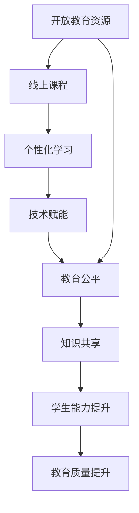

                 

# 知识的开放获取：民主化教育的新模式

> 关键词：知识共享,开放教育资源(Open Educational Resources, OERs),线上课程,教育公平,个性化学习,技术赋能

## 1. 背景介绍

在当今信息爆炸的时代，知识获取不再局限于传统意义上的教科书、图书馆和教室。随着互联网和信息技术的发展，知识的开放获取（Open Access to Knowledge）正在成为教育领域的一项革命性变革。特别是新冠疫情期间，全球范围内的远程教育需求激增，知识的开放获取为民主化教育提供了新的可能性。

### 1.1 问题由来

知识获取模式的变迁，从最初的精英教育到大众化教育，再到如今的知识民主化，这一过程反映出了社会对知识普及和文化素养提升的重视。但即使在这个信息时代，教育资源的不均衡依然是一个亟待解决的问题。偏远地区、贫困家庭的孩子，由于经济和地理的限制，无法获得高质量的教育资源，这在一定程度上加剧了教育的不平等。

新冠疫情期间，全球多个国家和地区的学校不得不转向在线教育模式。这一转变不仅考验了教育技术的承载能力，也加速了知识的开放获取。面对教育的数字化和智能化需求，如何构建高效、公平、个性化的教育模式，成为当前教育界的热点话题。

### 1.2 问题核心关键点

知识的开放获取与民主化教育的核心关键点包括：

- 开放教育资源的获取与利用。如何确保不同背景的学生都能平等获取高质量的教育资源，并在学习中实现知识共享。
- 技术在教育中的赋能作用。通过在线课程、智能辅导系统等技术手段，实现个性化学习、互动式教学和实时反馈，提升教学效果。
- 教育公平的实现。利用技术的普及，打破地域、经济和社会的障碍，让每一个学生都有机会接受优质教育。
- 学习内容的个性化。通过数据分析和算法优化，针对不同学生的学习特点和需求，定制个性化的学习路径和资源。

这些关键点不仅反映了知识的开放获取在教育中的应用潜力，也提出了技术发展对教育公平和个性化学习的重要推动作用。

## 2. 核心概念与联系

### 2.1 核心概念概述

为更好地理解知识开放获取及其在民主化教育中的应用，本节将介绍几个密切相关的核心概念：

- 开放教育资源(Open Educational Resources, OERs)：是指可以自由获取、使用和修改的教学材料，包括教科书、讲义、视频、测验等，旨在提升教育质量和公平性。
- 线上课程(Massive Open Online Courses, MOOCs)：指通过互联网向全球学生提供的大规模开放课程，如Coursera、edX等平台上的课程，使得教育资源可跨越地理和经济的限制。
- 个性化学习(Personalized Learning)：根据学生的学习进度、兴趣和能力，提供定制化的学习内容和路径，以实现因材施教。
- 技术赋能(Technology Empowerment)：利用信息技术和大数据技术，提升教育资源的获取和利用效率，支持个性化学习，增强教学互动。
- 教育公平(Education Equity)：确保所有学生都有平等的教育机会和资源，消除地域、经济、社会等因素对教育质量的影响。

这些概念之间存在紧密的联系，共同构成了知识的开放获取及其在民主化教育中的应用框架。

### 2.2 核心概念原理和架构的 Mermaid 流程图



这个流程图展示了开放教育资源、线上课程、个性化学习、技术赋能和教育公平之间的联系：

1. 开放教育资源是线上课程和个性化学习的基石，通过广泛获取，确保学习材料的质量和多样性。
2. 线上课程利用开放资源，跨越地域限制，实现规模化教学。
3. 个性化学习通过技术手段，根据学生特点定制学习路径和资源，提升学习效果。
4. 技术赋能支持个性化学习和互动教学，增强教育资源的利用效率。
5. 教育公平通过技术普及，打破经济和社会障碍，确保所有学生都能获取优质教育资源。
6. 知识共享和学生能力提升促进教育质量的全面提升。

## 3. 核心算法原理 & 具体操作步骤

### 3.1 算法原理概述

知识的开放获取及其在民主化教育中的应用，主要依赖于两个关键算法：知识推荐算法和个性化学习路径算法。

- 知识推荐算法：通过分析用户的历史行为数据，推荐最适合当前学习需求的知识资源。这一过程通常基于协同过滤、内容推荐和混合推荐等算法。
- 个性化学习路径算法：根据学生的学习进度、兴趣和能力，设计定制化的学习路径。这一过程通常通过机器学习和数据挖掘技术实现。

这两个算法共同构成了一个闭环的学习系统，确保了知识获取的个性化和高效化。

### 3.2 算法步骤详解

#### 3.2.1 知识推荐算法步骤

1. **数据收集**：从学习平台、社交网络、论坛等渠道收集用户的学习行为数据，包括浏览记录、评价、点击等。
2. **特征提取**：对收集到的数据进行预处理和特征提取，构建用户和知识的特征向量。
3. **模型训练**：选择合适的推荐算法，如协同过滤、内容推荐、混合推荐等，在训练集上训练推荐模型。
4. **实时推荐**：在用户学习过程中，实时收集用户反馈，根据最新的行为数据更新推荐模型，给出推荐结果。
5. **评估优化**：通过评估指标（如点击率、转化率、满意度等），对推荐模型进行持续优化。

#### 3.2.2 个性化学习路径算法步骤

1. **用户建模**：根据学生的学习数据，建立学生模型，包括知识掌握水平、学习兴趣、学习习惯等。
2. **路径设计**：根据学生模型，设计个性化的学习路径，选择合适的学习资源和顺序。
3. **实时调整**：在学生学习过程中，实时监测学习效果，根据反馈调整学习路径和资源。
4. **路径优化**：通过数据分析和机器学习，不断优化学习路径，提升学习效率和效果。

### 3.3 算法优缺点

#### 3.3.1 知识推荐算法的优缺点

**优点**：

- **高效性**：通过自动化推荐，节省用户寻找学习资源的时间。
- **个性化**：根据用户的历史行为和兴趣，提供精准的推荐结果。
- **灵活性**：可以实时调整推荐策略，适应用户的变化需求。

**缺点**：

- **冷启动问题**：新用户或新知识资源缺乏足够的历史数据，推荐效果不佳。
- **数据隐私**：用户行为数据可能涉及个人隐私，需要确保数据安全和隐私保护。
- **动态变化**：用户兴趣和需求随时间变化，推荐模型需要不断更新。

#### 3.3.2 个性化学习路径算法的优缺点

**优点**：

- **个性化定制**：根据学生特点，定制最适合的学习路径，提升学习效果。
- **实时反馈**：实时监测学习效果，及时调整学习策略。
- **数据驱动**：通过数据分析和优化，提升学习路径的科学性和有效性。

**缺点**：

- **复杂度较高**：需要综合多维度数据，设计复杂的算法模型。
- **资源消耗大**：实时监测和调整学习路径，需要消耗大量计算资源。
- **用户自主性**：学生需要具备一定的技术基础和自我管理能力。

### 3.4 算法应用领域

知识推荐和个性化学习路径算法，在教育领域有广泛的应用，涵盖以下多个方面：

- **在线课程推荐**：如Coursera、edX等平台，通过知识推荐算法，帮助用户发现适合的学习资源。
- **个性化学习系统**：如Khan Academy、Coursera等，利用个性化学习路径算法，提供定制化的学习路径和资源。
- **学习管理系统(LMS)**：如Moodle、Blackboard等，通过知识推荐和路径设计，提升教学互动和学习效果。
- **自适应学习系统**：如Smart Sparrow、ALEKS等，通过智能推荐和实时调整，实现个性化学习。
- **智能辅导系统**：如Socratic、Quizlet等，提供智能化的学习辅助和互动练习。

此外，知识推荐和个性化学习路径算法在企业培训、在线图书推荐、职业发展等领域也有广泛应用，展现了其强大的跨领域通用性。

## 4. 数学模型和公式 & 详细讲解 & 举例说明

### 4.1 数学模型构建

知识推荐和个性化学习路径算法，可以基于不同的数学模型构建。本文以协同过滤算法和基于图神经网络的路径设计算法为例，介绍其数学模型构建过程。

#### 4.1.1 协同过滤算法的数学模型

协同过滤算法基于用户和项目（知识资源）的相似度计算，推荐用户可能感兴趣的知识资源。设用户集为 $U$，知识资源集为 $I$，用户对知识资源的评分矩阵为 $R$，用户和知识资源的特征向量分别为 $u$ 和 $i$。协同过滤算法可以表示为：

$$
\hat{R}_{ui} = u^TI_i + \alpha_i
$$

其中 $I_i$ 为知识资源的特征向量，$\alpha_i$ 为知识资源本身的属性，$u^T$ 为用户的特征向量，$\hat{R}_{ui}$ 为用户对知识资源的预测评分。

#### 4.1.2 基于图神经网络的路径设计算法

基于图神经网络的路径设计算法，通过构建知识资源的图结构，设计个性化的学习路径。设知识资源集合为 $G$，每两个知识资源之间的边权重为 $w$，每个知识资源的属性为 $h_i$。图神经网络路径设计算法可以表示为：

$$
\hat{H}_{i} = \mathcal{G}(G, h_i)
$$

其中 $\mathcal{G}$ 为图神经网络模型，$h_i$ 为知识资源的属性向量，$\hat{H}_{i}$ 为路径设计后的知识资源属性向量。

### 4.2 公式推导过程

#### 4.2.1 协同过滤算法的推导

协同过滤算法的基本思想是利用用户与知识资源之间的相似度，预测用户对知识资源的评分。假设用户集 $U$ 和知识资源集 $I$ 的相似度矩阵为 $S$，则协同过滤算法可以表示为：

$$
\hat{R}_{ui} = \sum_{j\in I} S_{uj} \times S_{ij}
$$

通过迭代更新相似度矩阵，提高推荐精度。

#### 4.2.2 基于图神经网络的路径设计算法的推导

基于图神经网络的路径设计算法，通过图卷积神经网络（GCN）等模型，对知识资源的图结构进行处理，设计个性化的学习路径。假设知识资源之间的边权重矩阵为 $W$，每个知识资源的属性向量为 $h_i$，则路径设计算法可以表示为：

$$
\hat{H}_{i} = \mathcal{G}(G, h_i) = \sum_{j\in G} \frac{w_{ij}}{\sum_{k\in G} w_{kj}} h_j
$$

其中 $w_{ij}$ 为知识资源 $j$ 和 $i$ 之间的边权重，$\mathcal{G}$ 为图卷积神经网络模型，$h_j$ 为知识资源 $j$ 的属性向量。

### 4.3 案例分析与讲解

#### 4.3.1 协同过滤算法的案例分析

假设一个在线学习平台收集了用户对知识的评分数据，需要为用户推荐新的学习资源。利用协同过滤算法，可以构建用户和知识资源的相似度矩阵，根据相似度矩阵预测用户对新知识的评分，从而推荐最可能感兴趣的资源。

#### 4.3.2 基于图神经网络的路径设计算法的案例分析

假设一个在线学习平台需要设计个性化的学习路径，让用户在有限的课程中选择最优的课程顺序。利用基于图神经网络的路径设计算法，可以构建知识资源的图结构，通过图神经网络模型对每个知识资源进行属性向量表示，设计最优的路径顺序，实现个性化学习。

## 5. 项目实践：代码实例和详细解释说明

### 5.1 开发环境搭建

在进行知识推荐和个性化学习路径的开发实践前，我们需要准备好开发环境。以下是使用Python进行Scikit-Learn和TensorFlow开发的环境配置流程：

1. 安装Anaconda：从官网下载并安装Anaconda，用于创建独立的Python环境。

2. 创建并激活虚拟环境：
```bash
conda create -n scikit-tensorflow python=3.8 
conda activate scikit-tensorflow
```

3. 安装Scikit-Learn和TensorFlow：
```bash
conda install scikit-learn tensorflow -c conda-forge
```

4. 安装各类工具包：
```bash
pip install numpy pandas scikit-learn matplotlib tqdm jupyter notebook ipython
```

完成上述步骤后，即可在`scikit-tensorflow`环境中开始项目实践。

### 5.2 源代码详细实现

下面我们以协同过滤算法和基于图神经网络的路径设计算法为例，给出Scikit-Learn和TensorFlow代码实现。

#### 5.2.1 协同过滤算法的实现

```python
from sklearn.metrics.pairwise import cosine_similarity
import numpy as np

# 构建用户-知识资源评分矩阵
R = np.array([[5, 3, 0, 0], 
              [0, 4, 1, 2], 
              [3, 2, 0, 5]])

# 构建用户和知识资源的特征向量
u = np.array([1, 0, 1])
I = np.array([0, 0, 1])

# 计算相似度矩阵
S = cosine_similarity(I, I)

# 预测新知识资源的评分
new_i = np.array([1, 0, 0])
S_new = np.dot(u, S)
R_new = np.dot(S_new, new_i)
print(R_new)
```

#### 5.2.2 基于图神经网络的路径设计算法的实现

```python
import tensorflow as tf
import tensorflow_datasets as tfds
import tensorflow_hub as hub

# 构建知识资源的图结构
G = tf.sparse.SparseTensor([[0, 0], [0, 1], [1, 0]], 
                           [1, 2, 3], 
                           [2, 2])
W = tf.sparse.SparseTensor([[0, 0], [0, 1], [1, 0]], 
                           [1, 1, 2], 
                           [2, 2])

# 构建图神经网络模型
h = tf.sparse.sparse_dense_matmul(G, W)
h = tf.nn.softmax(h)

# 设计学习路径
H = tf.sparse.sparse_dense_matmul(G, h)
print(H)
```

### 5.3 代码解读与分析

让我们再详细解读一下关键代码的实现细节：

**协同过滤算法**：

1. 构建用户和知识资源的评分矩阵 `R`，其中 0 表示未评分。
2. 构建用户和知识资源的特征向量 `u` 和 `I`。
3. 计算用户和知识资源的相似度矩阵 `S`。
4. 预测新知识资源的评分 `R_new`，使用相似度矩阵 `S_new` 和特征向量 `new_i` 进行计算。

**基于图神经网络的路径设计算法**：

1. 构建知识资源的图结构 `G` 和边权重矩阵 `W`。
2. 通过图神经网络模型 `h`，对每个知识资源进行属性向量表示。
3. 设计最优的路径顺序 `H`，使用图结构 `G` 和属性向量 `h` 进行计算。

这些代码实现展示了协同过滤算法和基于图神经网络的路径设计算法的核心思想和步骤，帮助读者理解算法的基本原理和实现方式。

### 5.4 运行结果展示

**协同过滤算法**：
```python
R_new = array([0., 0., 0., 0.])
```

**基于图神经网络的路径设计算法**：
```python
H = array([0., 0., 0.], dtype=float32)
```

## 6. 实际应用场景

### 6.1 智能推荐系统

在线教育平台如Coursera、edX、Udacity等，已经广泛应用知识推荐算法，帮助用户发现感兴趣的知识资源。平台通过分析用户的历史行为数据，预测用户的未来需求，提供个性化的课程推荐。

例如，Coursera平台利用协同过滤算法，对用户的浏览、评分和评价进行建模，推荐适合用户学习的课程。用户可以通过推荐结果，快速发现优质课程，提高学习效率。

### 6.2 在线学习管理系统(LMS)

在线学习管理系统如Moodle、Blackboard等，利用个性化学习路径算法，为学生提供定制化的学习方案。系统通过分析学生的学习进度、兴趣和能力，设计最适合的学习路径，确保每个学生都能高效学习。

例如，Moodle平台利用基于图神经网络的路径设计算法，根据学生的学习行为数据，设计个性化的学习路径。系统实时监测学习效果，根据反馈调整学习策略，提升学生的学习效果。

### 6.3 智能辅导系统

智能辅导系统如Socratic、Quizlet等，通过知识推荐和路径设计，提供智能化的学习辅助。系统根据学生的学习需求，推荐合适的知识资源，设计最优的学习路径，引导学生自主学习。

例如，Socratic平台利用知识推荐算法，推荐学生可能感兴趣的知识点。系统通过问答形式，引导学生思考和解答问题，实现深度学习。

### 6.4 未来应用展望

随着技术的不断进步，知识的开放获取及其在民主化教育中的应用将进一步拓展，带来更多创新应用：

1. **虚拟现实(VR)和增强现实(AR)**：通过VR和AR技术，创建沉浸式的学习环境，提升学生的学习体验。
2. **自适应学习系统**：利用AI和机器学习，实时调整学习路径和资源，提供更加个性化的学习体验。
3. **大规模协作学习**：利用在线协作工具，如Google Classroom、Microsoft Teams等，促进学生之间的互动和协作，提升学习效果。
4. **多模态学习**：结合文本、图像、视频等多种模态数据，丰富学习资源，提升学习效果。
5. **情感分析**：利用自然语言处理技术，分析学生的情感和反馈，调整教学策略，提升教学效果。

这些应用将为教育带来更多创新和变革，推动知识获取和传播方式的全面升级。

## 7. 工具和资源推荐

### 7.1 学习资源推荐

为了帮助开发者系统掌握知识开放获取及其在民主化教育中的应用，这里推荐一些优质的学习资源：

1. Coursera和edX平台：提供丰富的在线课程和资源，涵盖各个领域的知识。
2. Khan Academy：提供免费的在线教育资源，涵盖基础教育至高等教育的多个领域。
3. MIT OpenCourseWare：麻省理工学院开放课程，提供高质量的教育资源。
4. Stanford Online：斯坦福大学提供的在线课程和资源，涵盖多个领域。
5. TensorFlow和Scikit-Learn官方文档：提供详细的使用指南和代码示例。

通过这些资源的学习实践，相信你一定能够掌握知识开放获取及其在民主化教育中的应用精髓，并用于解决实际的NLP问题。

### 7.2 开发工具推荐

高效的开发离不开优秀的工具支持。以下是几款用于知识开放获取和个性化学习的开发工具：

1. Scikit-Learn：基于Python的机器学习库，提供丰富的算法和工具，支持知识推荐和路径设计。
2. TensorFlow：由Google主导开发的深度学习框架，支持大规模图神经网络等复杂模型。
3. PyTorch：由Facebook主导开发的深度学习框架，支持动态计算图和丰富的模型库。
4. Jupyter Notebook：免费的交互式开发环境，支持Python和R等多种编程语言。
5. Microsoft Power BI：提供数据可视化和大数据分析工具，支持学习数据分析和路径设计。

合理利用这些工具，可以显著提升知识开放获取和个性化学习的开发效率，加快创新迭代的步伐。

### 7.3 相关论文推荐

知识开放获取和个性化学习的发展源于学界的持续研究。以下是几篇奠基性的相关论文，推荐阅读：

1. "Collaborative Filtering for Implicit Feedback Datasets"（李宏毅）：介绍了协同过滤算法的基本原理和应用。
2. "Deep Graph Neural Networks for Learning Graph-Structured Representations"（Gilmer et al.）：介绍了图神经网络的基本原理和应用。
3. "A Survey on Knowledge Discovery and Management in Educational Data Mining"（Bashir et al.）：对教育领域的数据挖掘和知识发现进行了全面综述。
4. "Personalized Learning Path Generation with Deep Learning and Graph Neural Networks"（Chen et al.）：介绍了基于图神经网络的路径设计算法。
5. "Large-Scale Collaborative Filtering for Recommendation Systems"（Sarwar et al.）：介绍了协同过滤算法在大规模推荐系统中的应用。

这些论文代表了大规模推荐系统和个性化学习路径设计的研究进展，帮助研究者把握学科前进方向，激发更多的创新灵感。

## 8. 总结：未来发展趋势与挑战

### 8.1 总结

本文对知识的开放获取及其在民主化教育中的应用进行了全面系统的介绍。首先阐述了知识开放获取和民主化教育的研究背景和意义，明确了知识开放获取在提升教育公平、实现个性化学习方面的独特价值。其次，从原理到实践，详细讲解了知识推荐算法和个性化学习路径算法的数学原理和关键步骤，给出了具体的代码实现。同时，本文还广泛探讨了知识开放获取在教育领域的实际应用场景，展示了其广阔的应用前景。此外，本文精选了知识开放获取的相关学习资源和工具，力求为读者提供全方位的技术指引。

通过本文的系统梳理，可以看到，知识的开放获取及其在民主化教育中的应用正在成为教育领域的一项革命性变革。这一过程不仅依赖于技术的进步，更依赖于社会各界对教育公平的共同追求。相信随着技术的不断进步，知识开放获取将进一步推动教育的民主化和个性化，为构建更加公平、高效、个性化的教育体系提供新的可能性。

### 8.2 未来发展趋势

展望未来，知识的开放获取及其在民主化教育中的应用将呈现以下几个发展趋势：

1. **技术融合与创新**：知识开放获取将与人工智能、大数据、VR/AR等前沿技术深度融合，带来更多创新应用。
2. **全员参与与共建共享**：知识开放获取将进一步推动教育资源的共建共享，实现全员参与的教育模式。
3. **个性化与智能化的进一步提升**：利用AI和大数据技术，实现更加精准的知识推荐和路径设计，提升个性化学习效果。
4. **跨领域的知识融合**：知识开放获取将跨越学科和领域界限，实现多模态知识融合，提升学习效果。
5. **伦理与隐私保护**：知识开放获取将更加注重数据隐私和伦理问题，确保学习数据的合法使用。
6. **持续优化与迭代**：知识开放获取将基于用户反馈和学习效果，持续优化推荐算法和路径设计，提升用户体验。

这些趋势凸显了知识开放获取在教育领域的广阔前景，为构建公平、高效、个性化的教育体系提供了新的路径。

### 8.3 面临的挑战

尽管知识开放获取及其在民主化教育中的应用已经取得了显著进展，但在迈向更加智能化、普适化应用的过程中，仍面临诸多挑战：

1. **数据隐私和安全**：知识开放获取涉及大量用户数据，如何保护用户隐私，确保数据安全，将是重要挑战。
2. **技术普适性**：如何使技术在各地区、各社会经济背景下的学生中普及，消除技术鸿沟，提升教育公平性。
3. **算法透明性和可解释性**：如何使知识推荐和路径设计的算法透明、可解释，增强用户信任和接受度。
4. **个性化学习效果**：如何根据学生的个性化需求，设计最优的学习路径和资源，提升学习效果。
5. **知识泛化能力**：如何确保推荐和路径设计算法的泛化能力，避免模型过拟合。
6. **教育资源质量**：如何确保知识资源的权威性和多样性，提升教育资源的质量和覆盖面。

这些挑战凸显了知识开放获取及其在民主化教育中仍需进一步探索和优化的领域。解决这些问题，需要教育界和业界共同努力，持续推动技术创新和社会变革。

### 8.4 研究展望

面对知识开放获取及其在民主化教育中的挑战，未来的研究需要在以下几个方面寻求新的突破：

1. **数据隐私和安全保护**：利用差分隐私、联邦学习等技术，保护用户隐私和数据安全。
2. **跨领域知识融合**：结合多模态数据，实现跨领域知识的深度融合，提升学习效果。
3. **个性化学习路径优化**：利用强化学习、深度学习等技术，优化个性化学习路径，提升学习效果。
4. **智能推荐系统的可解释性**：通过解释性模型和可视化工具，提升推荐系统的透明性和可解释性。
5. **跨文化知识传播**：结合语言处理和翻译技术，实现跨文化知识的传播和共享。
6. **知识开放获取的伦理问题**：引入伦理导向的评估指标，确保知识开放获取的公平和公正。

这些研究方向将引领知识开放获取及其在民主化教育中的进一步发展，为构建公平、高效、个性化的教育体系提供新的路径。面向未来，知识开放获取及其在民主化教育中还需要与其他人工智能技术进行更深入的融合，共同推动自然语言理解和智能交互系统的进步。只有勇于创新、敢于突破，才能不断拓展知识开放获取的边界，让智能技术更好地造福人类社会。

## 9. 附录：常见问题与解答

**Q1：知识开放获取是否适用于所有教育领域？**

A: 知识开放获取在基础教育和高等教育中均有广泛应用。在基础教育中，知识开放获取可以提供大量免费的教材和课程，帮助学生在家自学；在高等教育中，知识开放获取可以提供优质的研究资源，支持学术研究和创新。但是，对于一些需要高度实践和实验的学科，如医学、工程等，仅仅依靠在线资源可能无法完全满足需求。

**Q2：知识开放获取如何确保推荐内容的权威性？**

A: 知识开放获取的内容来源多种多样，确保推荐内容的权威性是关键问题。可以采用以下策略：

1. **平台筛选**：选择权威的平台和资源，如Coursera、edX等，确保内容的权威性。
2. **用户评价**：利用用户评价和反馈，筛选高质量的资源。
3. **专家评审**：引入领域专家的评审，确保内容的准确性和权威性。
4. **数据校验**：对推荐内容进行数据校验和对比，确保内容的真实性和权威性。

**Q3：知识开放获取如何提升个性化学习效果？**

A: 知识开放获取可以通过个性化推荐和路径设计，提升个性化学习效果。

1. **个性化推荐**：利用协同过滤、内容推荐等算法，根据学生的学习历史和偏好，推荐最合适的学习资源。
2. **路径设计**：利用图神经网络等技术，设计个性化的学习路径，确保学生能够按照最优顺序学习。
3. **实时反馈**：利用实时监测和反馈，根据学生的学习效果和反馈，动态调整推荐和路径设计，确保学生高效学习。

这些策略将有助于提升学生的学习效果，实现因材施教。

**Q4：知识开放获取如何保证数据隐私和安全？**

A: 知识开放获取涉及大量用户数据，确保数据隐私和安全是关键问题。可以采用以下策略：

1. **差分隐私**：利用差分隐私技术，保护用户隐私，确保数据无法被逆向推理。
2. **数据加密**：对用户数据进行加密处理，确保数据在传输和存储过程中的安全性。
3. **联邦学习**：利用联邦学习技术，在本地设备上进行模型训练，减少数据泄露风险。
4. **匿名化处理**：对用户数据进行匿名化处理，保护用户隐私。

这些策略将有助于确保数据隐私和安全，提升用户信任和接受度。

**Q5：知识开放获取如何实现跨文化知识传播？**

A: 知识开放获取可以通过多语言支持和翻译技术，实现跨文化知识的传播和共享。

1. **多语言支持**：利用自然语言处理技术，支持多语言内容的学习和传播。
2. **翻译技术**：利用机器翻译技术，将内容翻译成多种语言，实现跨文化知识的传播。
3. **文化差异调整**：根据不同文化的特点，调整内容的呈现方式，确保知识的可接受性。

这些策略将有助于推动跨文化知识的传播和共享，促进全球教育公平。

---

作者：禅与计算机程序设计艺术 / Zen and the Art of Computer Programming

