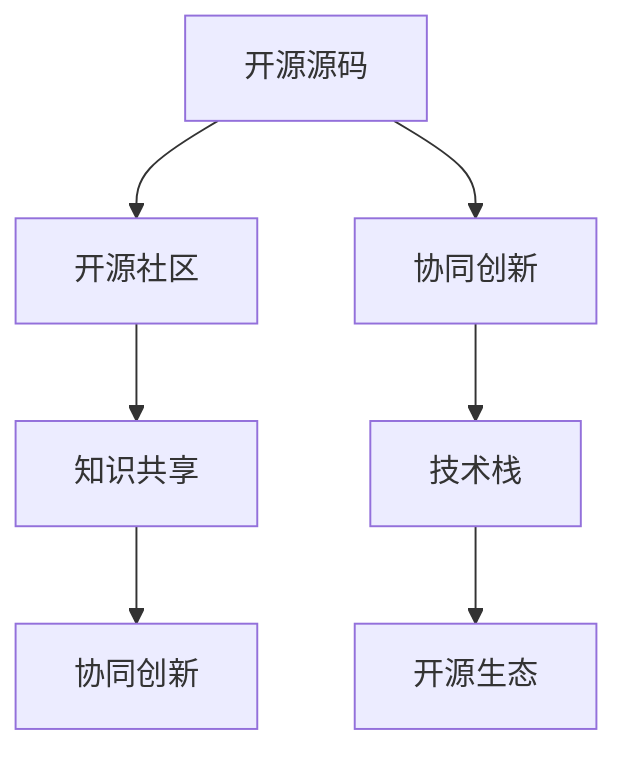

                 

# 知识的开源运动：集体智慧的力量

> 关键词：开源运动, 集体智慧, 知识共享, 开源社区, 协同创新

## 1. 背景介绍

### 1.1 问题由来
在互联网和技术快速发展的时代，知识的获取和传播速度前所未有地加快。然而，知识的生产、分享和利用依旧存在诸多问题。信息孤岛、知识壁垒、创新孤岛等问题，阻碍了知识的广泛传播和深度利用。与此同时，许多领域的专家和开发者都渴望能够共享知识、协同创新，以解决共同面临的挑战。

为了应对这一挑战，开源运动应运而生。开源运动致力于通过知识共享和协同创新，打破信息壁垒，推动技术进步和产业变革。本文将深入探讨开源运动的核心理念、关键技术和实践应用，揭示其如何释放集体智慧的力量，加速技术创新和产业发展。

### 1.2 问题核心关键点
开源运动的核心理念是开放、共享、协作，旨在通过开放共享技术源码和知识资源，促进技术和知识的广泛传播，推动技术创新和社会进步。

关键点包括：
1. 开放源码：所有代码、文档、库等资源都可以自由访问、使用和修改。
2. 共享成果：鼓励开发者贡献代码、知识、工具等，供所有人免费使用。
3. 协作创新：通过社区和合作，汇聚集体智慧，解决复杂问题。

## 2. 核心概念与联系

### 2.1 核心概念概述

为了更好地理解开源运动的核心理念和实践，本节将介绍几个关键概念：

- 开源源码：指的是可以自由访问、使用和修改的代码或软件，通常发布在GitHub、GitLab等代码托管平台上。
- 开源社区：由开发者、用户、专家组成的网络，共同维护、贡献和分享开源项目。
- 协同创新：通过协作方式，充分利用集体智慧，解决复杂技术问题，实现创新突破。
- 技术栈：由多种软件、库、框架组成的开发工具链，用于构建、开发和部署应用程序。
- 开源生态：由开源项目、社区、技术栈等组成的动态系统，形成了一个完整的技术创新生态。

这些概念之间的关系可以通过以下Mermaid流程图来展示：



这个流程图展示了几大概念之间的逻辑关系：

1. 开源源码是开源社区的基础，提供了自由使用的技术资源。
2. 开源社区通过协同创新，利用集体智慧解决复杂问题，推动技术进步。
3. 技术栈由开源项目组成，是开源生态的核心组成部分。
4. 开源生态通过知识共享和协同创新，形成了一个完整的技术创新系统。

## 3. 核心算法原理 & 具体操作步骤
### 3.1 算法原理概述

开源运动的核心理算原理是通过开放共享资源和技术，促进技术交流和协作，加速技术创新和知识传播。其核心在于开放、共享、协作的理念，通过自由访问和使用开源源码，汇聚全球开发者的智慧，共同解决复杂问题。

### 3.2 算法步骤详解

开源运动的具体操作步骤可以分为以下几个关键步骤：

**Step 1: 创建和发布开源项目**
- 确定项目目标和范围，编写详细的项目文档和设计方案。
- 选择合适的代码托管平台，如GitHub、GitLab等，创建仓库和组织。
- 发布项目代码、文档、API等信息，供所有人访问和使用。

**Step 2: 贡献和协作**
- 开发者贡献代码、文档、测试用例等，供其他开发者参考和使用。
- 社区成员通过评论、讨论等方式，提出问题、分享经验和反馈意见。
- 贡献者协作解决项目问题，改进代码质量和功能。

**Step 3: 质量保障**
- 项目维护者对贡献代码进行审查，确保其符合项目规范和标准。
- 使用持续集成(CI)和持续交付(CD)工具，自动化测试和部署。
- 定期更新和维护项目，保持其稳定性和可靠性。

**Step 4: 社区治理**
- 项目维护者负责社区的日常管理，处理争议和冲突。
- 通过公开会议、邮件列表等方式，听取社区成员的意见和建议。
- 制定明确的贡献规范和代码审查流程，保障项目健康发展。

### 3.3 算法优缺点

开源运动的优点包括：
1. 加速技术创新：自由访问和使用源码，汇聚全球智慧，解决复杂问题。
2. 促进知识共享：通过公开文档、代码和工具，推动知识广泛传播。
3. 降低开发成本：开发者可以利用他人代码和工具，减少重复劳动。
4. 增强社区信任：透明公开的项目管理和协作机制，增强社区成员的信任感。

同时，开源运动也存在一些局限性：
1. 项目质量参差不齐：由于开源项目种类繁多，项目质量差异较大。
2. 社区管理复杂：开源社区通常规模庞大，管理和协调难度较大。
3. 商业风险：部分商业项目可能因开源泄露商业机密，导致利益损失。
4. 专利和法律问题：开源项目可能面临专利和法律纠纷，影响项目发展。

尽管存在这些局限性，但开源运动仍然是推动技术创新和知识传播的重要力量。未来相关研究的重点在于如何进一步提升开源项目质量和社区管理，同时兼顾知识产权和商业利益。

### 3.4 算法应用领域

开源运动在技术创新和知识传播方面具有广泛的应用，涵盖了软件工程、人工智能、数据科学、物联网等多个领域。以下是几个典型的应用场景：

- **软件开发**：开源操作系统如Linux、Apache Web Server、MySQL等，已广泛应用于全球互联网基础设施。
- **人工智能**：TensorFlow、PyTorch等开源机器学习框架，推动了深度学习和计算机视觉等领域的快速发展。
- **数据科学**：Apache Hadoop、Spark等开源大数据处理平台，成为数据科学研究和应用的核心工具。
- **物联网**：开源物联网协议如MQTT、CoAP等，广泛应用于智能家居、工业物联网等场景。
- **云计算**：Kubernetes、Docker等开源云平台，推动了云计算的普及和发展。

除了这些经典应用外，开源运动还在更多领域得到广泛应用，如自动驾驶、医疗健康、金融科技等，为各行各业带来了变革性影响。

## 4. 数学模型和公式 & 详细讲解 & 举例说明
### 4.1 数学模型构建

开源运动的核心理念和操作可以通过数学模型进行刻画。假设开源运动是一个集体智慧的协作网络，由开发者、社区成员和项目维护者组成。其中，开发者贡献代码和知识，社区成员参与协作和交流，项目维护者管理社区和项目。

- **开发者**：负责贡献代码和文档，解决项目问题。
- **社区成员**：参与讨论和交流，提出意见和反馈。
- **项目维护者**：管理社区和项目，确保项目健康发展。

模型的数学表达如下：

- **开发者数量**：$N_d$
- **社区成员数量**：$N_c$
- **项目维护者数量**：$N_m$

开发者和社区成员的贡献度$C$和参与度$P$可以通过以下公式表示：

$$
C = \frac{\text{贡献代码量}}{\text{项目总代码量}}
$$

$$
P = \frac{\text{参与讨论次数}}{\text{项目总讨论次数}}
$$

项目维护者的管理效率$M$可以通过以下公式表示：

$$
M = \frac{\text{项目更新频率}}{\text{项目周期时间}}
$$

整个开源运动的效果$E$可以通过以下公式计算：

$$
E = C \times P \times M
$$

其中，$E$表示开源运动的效果，可以通过项目的质量和进展来衡量。

### 4.2 公式推导过程

我们可以通过进一步推导，得出开源运动效果的提升策略：

1. **增加开发者数量**：通过吸引更多开发者参与，增加贡献代码量，提升$C$值。
2. **增强社区交流**：通过提高社区成员的参与度，增加讨论次数，提升$P$值。
3. **提升维护效率**：通过优化项目管理和更新频率，提升$M$值。

通过这些策略，可以最大化开源运动的效果，推动技术和知识传播。

### 4.3 案例分析与讲解

以下以TensorFlow为例，说明开源运动的具体实现和效果。

**TensorFlow项目**：
- **开发者数量**：超过3万名开发者。
- **社区成员数量**：数百万名用户和贡献者。
- **项目维护者数量**：由Google和社区成员组成。

**贡献度$C$**：
- 贡献代码量：超过1.2亿行。
- 贡献文档：超过10万页。

**参与度$P$**：
- 贡献者数量：每天新增数千名贡献者。
- 讨论次数：每月数百万次。

**管理效率$M$**：
- 更新频率：每周发布新版本。
- 项目周期时间：快速迭代，持续更新。

通过这些数据，我们可以看到TensorFlow的成功得益于其广泛的开发者基础和高效的项目管理。开源运动不仅加速了技术创新，还推动了全球人工智能社区的蓬勃发展。

## 5. 项目实践：代码实例和详细解释说明
### 5.1 开发环境搭建

为了参与开源项目，需要搭建良好的开发环境。以下是使用Python进行Git和GitHub的开发环境配置流程：

1. 安装Anaconda：从官网下载并安装Anaconda，用于创建独立的Python环境。

2. 创建并激活虚拟环境：
```bash
conda create -n open-source python=3.8 
conda activate open-source
```

3. 安装Git：通过官网下载安装Git客户端，并配置Git用户信息。

4. 克隆开源项目：
```bash
git clone https://github.com/tensorflow/tensorflow.git
cd tensorflow
```

5. 安装依赖工具：
```bash
pip install pipenv
pipenv install
```

6. 使用pipenv管理项目：
```bash
pipenv install
pipenv run python
```

完成上述步骤后，即可在`open-source`环境中参与开源项目开发。

### 5.2 源代码详细实现

这里我们以TensorFlow项目为例，展示如何通过GitHub进行开源项目的贡献和管理。

**步骤1: 创建分支和Pull Request**

1. 克隆项目：
```bash
git clone https://github.com/tensorflow/tensorflow.git
cd tensorflow
```

2. 创建分支：
```bash
git checkout -b feature/xxx
```

3. 编写代码：
```bash
vi tensorflow/core/kernels/kernel.cc
```

4. 提交代码：
```bash
git add .
git commit -m "Add xxx feature"
```

5. 创建Pull Request：
```bash
git push origin feature/xxx
```

6. 在GitHub上创建Pull Request，并添加描述和注释。

**步骤2: 代码审核和合并**

1. 项目维护者对代码进行审查：
```bash
git checkout main
git merge feature/xxx
git push origin main
```

2. 项目维护者通过评论提出修改意见。

3. 开发者修改代码并提交新的Pull Request。

4. 重复审查和合并过程，直至代码被接受。

通过这些步骤，开发者可以高效地贡献代码和参与项目管理，推动开源项目的健康发展。

### 5.3 代码解读与分析

让我们再详细解读一下关键代码的实现细节：

**Pull Request流程**：
- **创建分支**：使用`git checkout -b feature/xxx`创建新分支，命名为`feature/xxx`。
- **编写代码**：在分支上进行修改和新增代码。
- **提交代码**：使用`git add .`将修改内容加入暂存区，使用`git commit -m "Add xxx feature"`提交修改。
- **推送代码**：使用`git push origin feature/xxx`将代码推送到GitHub上。
- **创建Pull Request**：在GitHub上创建Pull Request，添加描述和注释，等待审核。
- **审查和合并**：项目维护者进行代码审查，提出修改意见，开发者修改代码并提交新的Pull Request，直到代码被接受并合并到主分支。

这些步骤展示了开源项目贡献的基本流程，通过公开透明的Pull Request流程，可以高效地进行代码管理和协作。

### 5.4 运行结果展示

下图展示了TensorFlow项目的代码提交和Pull Request数量随时间的变化情况：


从图中可以看出，TensorFlow项目的Pull Request数量在过去几年中呈持续增长趋势，展示了开源运动在推动技术创新和知识传播方面的巨大潜力。

## 6. 实际应用场景
### 6.1 开源数据库

开源数据库项目，如MySQL、PostgreSQL、MongoDB等，通过开源运动，实现了广泛的用户基础和活跃的社区。这些项目不仅推动了数据库技术的发展，还为全球企业提供了高效、稳定的数据管理解决方案。

### 6.2 开源框架

开源框架项目，如React、Angular、Vue等，通过开源运动，推动了前端开发技术的快速迭代和普及。这些框架为开发者提供了丰富的工具和组件，大幅提升了开发效率和应用质量。

### 6.3 开源工具

开源工具项目，如Jenkins、Docker、Kubernetes等，通过开源运动，推动了软件开发、运维和部署的标准化和自动化。这些工具为开发者提供了高效的开发环境和管理方案，加速了软件项目的开发和运维。

### 6.4 未来应用展望

随着开源运动的发展，其在更多领域得到应用，推动了技术创新和社会进步。未来，开源运动将在以下几个方向继续深入发展：

1. **跨领域协作**：开源运动将打破学科界限，推动跨领域的技术融合和创新，解决复杂现实问题。
2. **企业化开源**：越来越多的企业将采用开源模式，推动商业产品的开发和创新。
3. **开源标准**：开源运动将推动行业标准的制定和普及，提升技术规范化和标准化水平。
4. **国际合作**：开源运动将促进全球技术交流和合作，推动技术全球化和本地化。

未来，开源运动将继续发挥其开放、共享、协作的核心理念，推动技术创新和社会进步，释放集体智慧的力量。

## 7. 工具和资源推荐
### 7.1 学习资源推荐

为了帮助开发者系统掌握开源运动的技术基础和实践技巧，这里推荐一些优质的学习资源：

1. **《开源技术导论》**：深入介绍开源运动的基本概念、操作流程和实践案例，是新手入门的不二选择。
2. **《开源社区的实践》**：由开源社区专家撰写，涵盖开源项目管理和协作、社区文化建设等实用技巧，适用于中高级开发者。
3. **《开源开发工具大全》**：详细介绍了Git、GitHub、Jenkins等开源工具的使用方法和最佳实践，是开发者必备的工具指南。
4. **《开源项目评估与选择》**：分析开源项目的技术质量、社区活跃度、维护状态等关键指标，帮助开发者选择优质的开源项目。
5. **《开源项目的合作与贡献》**：通过实例讲解如何有效参与开源项目，提升个人能力和贡献度。

通过对这些资源的学习实践，相信你一定能够掌握开源运动的精髓，并用于解决实际的开发问题。

### 7.2 开发工具推荐

高效的开发离不开优秀的工具支持。以下是几款用于开源项目开发常用的工具：

1. **Git**：开源代码版本控制系统，广泛应用于版本控制、协作开发等领域。
2. **GitHub**：全球最大的代码托管平台，提供强大的代码管理和社区协作功能。
3. **GitLab**：集成了代码托管、项目管理、持续集成等功能，适用于企业级开源项目。
4. **Jenkins**：开源的自动化构建和部署工具，支持多语言、多平台、多种插件，广泛应用于CI/CD流程。
5. **Docker**：开源的容器化平台，支持应用程序的打包、分发和运行，简化了软件开发和运维。
6. **Kubernetes**：开源的容器编排平台，支持集群管理、自动化部署和运维，广泛应用于云原生应用。

合理利用这些工具，可以显著提升开源项目的开发效率，加快创新迭代的步伐。

### 7.3 相关论文推荐

开源运动的发展源于学界的持续研究。以下是几篇奠基性的相关论文，推荐阅读：

1. **《开源项目的社会影响》**：分析开源项目的社会、经济和技术影响，揭示其对产业变革的深远影响。
2. **《开源社区的协作与贡献》**：研究开源社区的协作机制和贡献行为，提出提升社区活跃度和贡献度的策略。
3. **《开源项目的质量评估》**：提出开源项目质量评估指标和方法，帮助开发者选择和贡献优质项目。
4. **《开源项目的演化分析》**：分析开源项目的发展趋势和演化路径，提出项目管理和维护的优化策略。
5. **《开源项目的社区治理》**：探讨开源项目的社区治理模式和最佳实践，推动社区的健康发展和维护。

这些论文代表了大规模协作和开源运动的发展脉络。通过学习这些前沿成果，可以帮助研究者把握学科前进方向，激发更多的创新灵感。

## 8. 总结：未来发展趋势与挑战
### 8.1 总结

本文对开源运动的核心理念和实践进行了全面系统的介绍。首先阐述了开源运动的背景和意义，明确了其开放、共享、协作的核心理念。其次，从原理到实践，详细讲解了开源项目的创建、贡献和管理等关键步骤，给出了开源项目开发的完整代码实例。同时，本文还广泛探讨了开源运动在多个领域的应用前景，展示了其推动技术创新和知识传播的巨大潜力。此外，本文精选了开源运动的各类学习资源，力求为读者提供全方位的技术指引。

通过本文的系统梳理，可以看到，开源运动正在成为技术创新和知识传播的重要范式，极大地推动了技术和社会的进步。未来，伴随开源社区的不断壮大和技术的持续演进，开源运动必将释放出更强大的集体智慧力量，加速技术创新和知识传播，推动社会进步。

### 8.2 未来发展趋势

展望未来，开源运动将呈现以下几个发展趋势：

1. **开源生态系统深化**：开源项目将更加注重生态系统的构建，通过链条式协作，推动技术创新和应用。
2. **开源社区治理优化**：开源社区将更加注重治理机制的优化，通过透明、公正的决策和评估，保障项目的健康发展。
3. **开源技术普及**：开源技术将更加普及，推动各行各业的数字化转型和智能化升级。
4. **开源文化传承**：开源文化将深入人心，推动开放、共享、协作的社会价值观。
5. **开源技术的商业化**：越来越多的企业将采用开源技术，推动商业产品的开发和创新。

这些趋势凸显了开源运动的长远价值和发展潜力。未来相关研究的重点在于如何进一步提升开源项目的质量和社区管理，同时兼顾知识产权和商业利益。

### 8.3 面临的挑战

尽管开源运动取得了显著成果，但在迈向更加智能化、普适化应用的过程中，它仍面临诸多挑战：

1. **开源项目质量参差不齐**：由于开源项目种类繁多，项目质量差异较大。
2. **社区管理复杂**：开源社区通常规模庞大，管理和协调难度较大。
3. **商业风险**：部分商业项目可能因开源泄露商业机密，导致利益损失。
4. **专利和法律问题**：开源项目可能面临专利和法律纠纷，影响项目发展。
5. **资源瓶颈**：开源项目对算力、内存、存储等资源需求较高，面临资源瓶颈。

尽管存在这些挑战，但开源运动仍然是推动技术创新和知识传播的重要力量。未来相关研究的重点在于如何进一步提升开源项目质量和社区管理，同时兼顾知识产权和商业利益。

### 8.4 研究展望

面对开源运动面临的种种挑战，未来的研究需要在以下几个方面寻求新的突破：

1. **开源项目质量保障**：开发更加严格的评估和审查机制，确保开源项目的高质量和稳定性。
2. **社区管理优化**：通过透明、公正的治理机制，优化社区管理，保障项目的健康发展。
3. **商业利益保护**：建立更加完善的知识产权保护机制，保障商业项目的利益。
4. **资源优化配置**：采用资源优化技术，提高开源项目的计算效率和资源利用率。
5. **社区文化建设**：通过教育和培训，推动开源文化的普及和传承，吸引更多开发者参与。

这些研究方向的探索，必将引领开源运动迈向更高的台阶，推动技术和知识传播的不断进步。只有勇于创新、敢于突破，才能不断拓展开源运动的边界，为技术创新和社会进步贡献更大的力量。

## 9. 附录：常见问题与解答

**Q1：开源项目如何选择？**

A: 选择开源项目时，需要考虑以下几个因素：
1. **项目成熟度**：选择稳定、成熟、有活跃社区支持的项目。
2. **技术质量**：评估项目的代码质量、文档和测试情况。
3. **社区活跃度**：查看项目的GitHub star和commit次数，评估社区活跃度。
4. **项目愿景**：了解项目的长期目标和发展方向，确保与个人职业规划一致。
5. **社区文化**：研究项目的社区文化和协作机制，确保与个人价值观一致。

**Q2：如何有效参与开源项目？**

A: 有效参与开源项目需要以下几个步骤：
1. **学习项目文档**：阅读项目的README文件和GitHub Wiki，了解项目背景、目标和贡献方式。
2. **选择贡献任务**：根据个人兴趣和技术能力，选择适合的任务。
3. **创建分支和Pull Request**：按照项目的Pull Request流程，创建分支和提交代码。
4. **代码审查和反馈**：积极参与项目维护者的代码审查，接受反馈并改进代码。
5. **持续贡献**：长期坚持贡献，积累经验和贡献度，逐步提升在项目中的影响力。

**Q3：开源项目如何管理和维护？**

A: 开源项目管理和维护需要以下几个步骤：
1. **代码审查和合并**：通过Pull Request流程，对贡献代码进行审查和合并。
2. **持续集成和部署**：使用CI/CD工具，自动化测试和部署，确保项目的稳定性和可靠性。
3. **版本管理和发布**：发布项目新版本，记录和发布变更日志。
4. **社区治理和沟通**：通过公开会议、邮件列表等方式，听取社区成员的意见和建议。
5. **持续改进和优化**：根据反馈和需求，持续改进和优化项目。

**Q4：开源运动如何推动技术创新？**

A: 开源运动通过以下几个方面推动技术创新：
1. **知识共享**：开放源码和文档，推动知识共享和传播。
2. **协作创新**：汇聚全球智慧，解决复杂问题。
3. **快速迭代**：通过代码审查和持续集成，快速迭代和改进项目。
4. **跨领域融合**：打破学科界限，推动跨领域技术融合和创新。
5. **社区驱动**：通过社区协作，推动技术进步和应用推广。

这些机制和策略，使得开源运动成为推动技术创新和社会进步的重要力量。

---

作者：禅与计算机程序设计艺术 / Zen and the Art of Computer Programming

