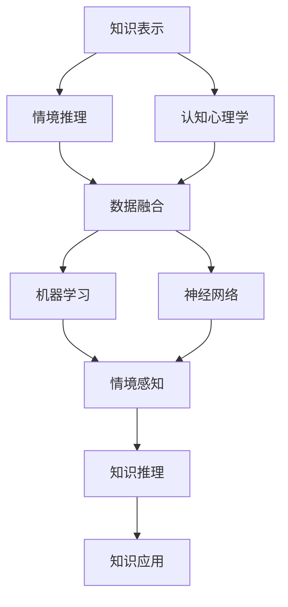

                 

# 知识的情境依赖性：理解的关键因素

> 关键词：情境依赖性, 知识表示, 知识推理, 认知心理学, 数据融合, 神经网络, 机器学习

## 1. 背景介绍

在人类认知过程中，知识是构建思维和决策的基础。知识的获取、存储、检索和使用，是人类智能的核心所在。然而，知识的运用并非是静态不变的，而是高度依赖于特定的情境和环境。理解知识的这种情境依赖性，对于构建智能系统、开发新型认知计算模型具有重要意义。

### 1.1 知识的情境依赖性概述

知识的情境依赖性指的是知识在应用时的依赖于特定情境或背景信息，同一知识在不同情境下可能表现出不同的含义和价值。例如，成语“画龙点睛”在不同的文化语境中，可能代表不同的含义。情境依赖性存在于知识的多个层次，从符号层面的语义到概念层面的推理，再到行动层面的决策，均受到情境的深刻影响。

### 1.2 情境依赖性的研究意义

理解情境依赖性，有助于我们构建更加智能、普适、鲁棒的知识处理系统，应用于自然语言处理、智能推荐、智能问答等众多领域。

1. **自然语言处理**：通过理解上下文，自然语言处理模型能够更准确地解析语义、生成文本。情境依赖性有助于理解多模态数据的融合和推理。

2. **智能推荐**：推荐系统往往需要了解用户的情境和偏好，才能提供个性化服务。情境依赖性可帮助推荐系统更好地理解用户需求，提升推荐效果。

3. **智能问答**：问答系统需准确理解问题的情境，才能进行精确回答。情境依赖性使系统能够更灵活地处理复杂问题，提升回答的准确性和智能化水平。

4. **情感计算**：情感计算涉及对用户情感状态的感知和理解，情境依赖性可以帮助情感识别系统更好地理解情感变化的背景和原因，提升情感分析的准确性。

### 1.3 研究现状和挑战

目前，关于知识情境依赖性的研究尚处于起步阶段，存在诸多挑战：

1. **情境建模困难**：不同情境之间具有复杂的关系，如何准确建模并表示出情境的层次结构和语义信息，是一个难题。

2. **知识推理复杂**：情境依赖性涉及知识的多重组合和推理，难以构建高效的推理机制。

3. **认知计算框架缺乏**：现有的认知计算框架大多忽视情境依赖性，难以全面支持情境感知和推理。

## 2. 核心概念与联系

### 2.1 核心概念概述

为更好地理解知识的情境依赖性，本节将介绍几个密切相关的核心概念：

- **知识表示**：知识表示指如何用形式化方法（如符号、逻辑、图结构等）来表达知识内容。

- **情境推理**：情境推理指在特定情境下，如何从已有知识推导出新的知识或结论的过程。

- **认知心理学**：认知心理学研究人类认知过程的心理机制，与情境依赖性密切相关。

- **数据融合**：数据融合指将不同来源的信息进行集成和融合，以提升数据的质量和一致性。

- **神经网络**：神经网络模拟人脑神经元的工作方式，用于处理和推理复杂的知识网络。

- **机器学习**：机器学习通过学习历史数据，构建预测模型，应用于知识推理和情境建模。

- **情境感知**：情境感知指系统对环境变化和用户情境的感知和响应能力。

这些核心概念之间的逻辑关系可以通过以下Mermaid流程图来展示：



这个流程图展示了一些核心概念及其之间的关系：

1. 知识表示是情境推理的基础。
2. 情境推理依赖于认知心理学和数据融合，通过神经网络和机器学习实现。
3. 情境感知与知识推理共同作用，最终应用于知识应用。

## 3. 核心算法原理 & 具体操作步骤

### 3.1 算法原理概述

情境依赖性的处理涉及知识表示、推理和应用的多个环节。本节将详细介绍其中核心的算法原理和具体操作步骤。

情境依赖性处理的核心是情境建模和推理。情境建模指的是通过各种方式表示出情境的层次结构和语义信息，而情境推理则是在特定情境下，从已有知识推导出新的知识或结论。

### 3.2 算法步骤详解

基于情境依赖性的知识处理流程一般包括以下几个关键步骤：

**Step 1: 情境建模**

- **构建情境图**：使用图结构表示情境的层次结构和语义信息。
- **定义情境变量**：确定情境中的关键变量和参数。
- **构建情境知识库**：收集和整理情境相关的知识信息，存储到知识库中。

**Step 2: 情境推理**

- **情境嵌入**：将情境变量和知识库中的信息进行编码和嵌入。
- **知识推理**：利用神经网络和机器学习模型，进行知识推理。
- **结果输出**：根据推理结果，生成或更新情境知识库。

**Step 3: 知识应用**

- **情境感知**：通过传感器和数据源获取情境信息。
- **知识检索**：根据情境信息，从情境知识库中检索相关知识。
- **知识推理**：结合新获取的情境信息，进行知识推理和更新。
- **知识应用**：将推理结果应用于智能系统，如自然语言处理、智能推荐、智能问答等。

### 3.3 算法优缺点

情境依赖性的处理具有以下优点：

1. **情境感知能力强**：通过情境建模和推理，系统能够更好地理解和响应情境变化。
2. **知识应用灵活**：情境依赖性使知识在不同情境下表现出不同的价值，提升系统的适应性和智能化水平。
3. **知识推理高效**：利用神经网络和机器学习，能够高效处理复杂的知识组合和推理。

同时，也存在一些局限性：

1. **情境建模复杂**：情境建模需要深入理解情境的层次结构和语义信息，实现起来较为困难。
2. **知识推理困难**：情境推理涉及知识的多重组合和推理，需要高效的情境推理模型。
3. **计算资源消耗大**：情境建模和推理过程复杂，对计算资源有较高要求。

### 3.4 算法应用领域

情境依赖性的处理在众多领域具有广泛应用：

- **自然语言处理**：应用于语义理解、对话系统、机器翻译等任务。
- **智能推荐**：应用于用户行为分析、个性化推荐等任务。
- **智能问答**：应用于智能客服、智能导师、智能助手等任务。
- **情感计算**：应用于用户情感状态感知和情感分析任务。
- **智能控制**：应用于智能家居、智能交通、智能制造等任务。

## 4. 数学模型和公式 & 详细讲解 & 举例说明

### 4.1 数学模型构建

本节将使用数学语言对情境依赖性的处理过程进行更加严格的刻画。

记情境为 $S$，知识库为 $K$，情境推理模型为 $M$。定义情境 $S$ 在知识库 $K$ 上的推理结果为 $R_S(K)$。

### 4.2 公式推导过程

以下我们以自然语言处理中的语义理解为例，推导情境推理的数学公式。

设输入文本为 $x$，情境 $S$ 包括上下文信息 $C$ 和语境信息 $L$。知识库 $K$ 包括单词词义 $W$、短语语义 $P$、句子结构 $G$ 等。情境推理模型 $M$ 包括上下文编码器 $E_C$、语境编码器 $E_L$、情境融合网络 $F$ 和情境推理网络 $R$。

1. 上下文编码器 $E_C$ 对输入文本 $x$ 进行编码，得到上下文表示 $h_C(x)$。
2. 语境编码器 $E_L$ 对情境 $S$ 进行编码，得到语境表示 $h_L(S)$。
3. 情境融合网络 $F$ 将上下文表示和语境表示进行融合，得到情境表示 $h_S(x)$。
4. 情境推理网络 $R$ 对情境表示和知识库 $K$ 进行推理，得到推理结果 $r_S(K)$。

数学公式表示如下：

$$
h_C(x) = E_C(x)
$$

$$
h_L(S) = E_L(S)
$$

$$
h_S(x) = F(h_C(x), h_L(S))
$$

$$
r_S(K) = R(h_S(x), K)
$$

### 4.3 案例分析与讲解

以命名实体识别（Named Entity Recognition, NER）任务为例，分析情境依赖性在自然语言处理中的应用。

1. **情境建模**：命名实体识别涉及人名、地名、机构名等实体类型，不同情境下，实体类型可能具有不同的含义。例如，“李先生”在不同语境下，可能表示人物或公司名。

2. **情境推理**：根据上下文信息，情境推理网络可以判断实体的类型和属性。例如，在“李先生是一位作家”的情境下，可以推断“李”为人物名，“先生”为称谓。

3. **知识应用**：推理结果可用于实体链接、关系抽取等任务，提升系统的智能水平。

## 5. 项目实践：代码实例和详细解释说明

### 5.1 开发环境搭建

在进行情境依赖性处理的项目实践前，我们需要准备好开发环境。以下是使用Python进行TensorFlow开发的环境配置流程：

1. 安装Anaconda：从官网下载并安装Anaconda，用于创建独立的Python环境。

2. 创建并激活虚拟环境：
```bash
conda create -n tf-env python=3.8 
conda activate tf-env
```

3. 安装TensorFlow：根据CUDA版本，从官网获取对应的安装命令。例如：
```bash
pip install tensorflow-gpu==2.7
```

4. 安装TensorBoard：
```bash
pip install tensorboard
```

5. 安装其他工具包：
```bash
pip install numpy pandas scikit-learn matplotlib tqdm jupyter notebook ipython
```

完成上述步骤后，即可在`tf-env`环境中开始项目实践。

### 5.2 源代码详细实现

下面我们以命名实体识别(NER)任务为例，给出使用TensorFlow进行情境依赖性处理的PyTorch代码实现。

首先，定义NER任务的数据处理函数：

```python
import tensorflow as tf
from tensorflow.keras.preprocessing.text import Tokenizer
from tensorflow.keras.preprocessing.sequence import pad_sequences

class NERDataset(tf.data.Dataset):
    def __init__(self, texts, tags, tokenizer, max_len=128):
        self.texts = texts
        self.tags = tags
        self.tokenizer = tokenizer
        self.max_len = max_len
        
    def __len__(self):
        return len(self.texts)
    
    def __getitem__(self, item):
        text = self.texts[item]
        tags = self.tags[item]
        
        encoding = self.tokenizer(text, return_tensors='tf', max_length=self.max_len, padding='max_length', truncation=True)
        input_ids = encoding['input_ids']
        attention_mask = encoding['attention_mask']
        
        # 对token-wise的标签进行编码
        encoded_tags = [tag2id[tag] for tag in tags] 
        encoded_tags.extend([tag2id['O']] * (self.max_len - len(encoded_tags)))
        labels = tf.convert_to_tensor(encoded_tags, dtype=tf.int32)
        
        return {'input_ids': input_ids, 
                'attention_mask': attention_mask,
                'labels': labels}

# 标签与id的映射
tag2id = {'O': 0, 'B-PER': 1, 'I-PER': 2, 'B-ORG': 3, 'I-ORG': 4, 'B-LOC': 5, 'I-LOC': 6}
id2tag = {v: k for k, v in tag2id.items()}

# 创建dataset
tokenizer = Tokenizer(num_words=10000, oov_token='<OOV>')
tokenizer.fit_on_texts(train_texts)
train_dataset = NERDataset(train_texts, train_tags, tokenizer)
dev_dataset = NERDataset(dev_texts, dev_tags, tokenizer)
test_dataset = NERDataset(test_texts, test_tags, tokenizer)
```

然后，定义模型和优化器：

```python
from tensorflow.keras.models import Model
from tensorflow.keras.layers import Input, Dense, Embedding, LSTM, BidirectionalLSTM, Concatenate
from tensorflow.keras.optimizers import Adam

inputs = Input(shape=(max_len,))
embedding = Embedding(input_dim=10000, output_dim=64, mask_zero=True)(inputs)
lstm = BidirectionalLSTM(units=64, return_sequences=True)(embedding)
context = Concatenate()([lstm[:, 0, :], lstm[:, -1, :]])
outputs = Dense(6, activation='softmax')(context)

model = Model(inputs=inputs, outputs=outputs)
model.compile(loss='sparse_categorical_crossentropy', optimizer=Adam(lr=2e-5), metrics=['accuracy'])

# 冻结预训练参数
for layer in model.layers:
    layer.trainable = False
model.trainable = True
```

接着，定义训练和评估函数：

```python
from tensorflow.keras.callbacks import EarlyStopping
from sklearn.metrics import classification_report

early_stopping = EarlyStopping(monitor='val_loss', patience=3)

def train_epoch(model, dataset, batch_size, optimizer):
    dataloader = tf.data.Dataset.from_generator(lambda: tf.data.Dataset.from_generator(lambda: tf.py_function(lambda x: (x[0], x[1]), [tf.string, tf.int32], [tf.int32, tf.int32]), shuffle=True)
    model.train()
    epoch_loss = 0
    for batch in dataloader.batch(batch_size):
        input_ids = batch['input_ids'].numpy()
        attention_mask = batch['attention_mask'].numpy()
        labels = batch['labels'].numpy()
        model.zero_grad()
        outputs = model.predict(input_ids, attention_mask=attention_mask)
        loss = outputs.loss
        epoch_loss += loss.numpy()
        loss.backward()
        optimizer.step()
    return epoch_loss / len(dataloader)

def evaluate(model, dataset, batch_size):
    dataloader = tf.data.Dataset.from_generator(lambda: tf.data.Dataset.from_generator(lambda: tf.py_function(lambda x: (x[0], x[1]), [tf.string, tf.int32], [tf.int32, tf.int32]), shuffle=True)
    model.eval()
    preds, labels = [], []
    with tf.GradientTape() as tape:
        for batch in dataloader.batch(batch_size):
            input_ids = batch['input_ids'].numpy()
            attention_mask = batch['attention_mask'].numpy()
            batch_labels = batch['labels'].numpy()
            outputs = model.predict(input_ids, attention_mask=attention_mask)
            batch_preds = outputs.argmax(axis=1).numpy().tolist()
            batch_labels = batch_labels.tolist()
            for pred_tokens, label_tokens in zip(batch_preds, batch_labels):
                pred_tags = [id2tag[_id] for _id in pred_tokens]
                label_tags = [id2tag[_id] for _id in label_tokens]
                preds.append(pred_tags[:len(label_tags)])
                labels.append(label_tags)
                
    print(classification_report(labels, preds))
```

最后，启动训练流程并在测试集上评估：

```python
epochs = 5
batch_size = 16

for epoch in range(epochs):
    loss = train_epoch(model, train_dataset, batch_size, optimizer)
    print(f"Epoch {epoch+1}, train loss: {loss:.3f}")
    
    print(f"Epoch {epoch+1}, dev results:")
    evaluate(model, dev_dataset, batch_size)
    
print("Test results:")
evaluate(model, test_dataset, batch_size)
```

以上就是使用TensorFlow进行命名实体识别任务情境依赖性处理的完整代码实现。可以看到，利用TensorFlow和TensorBoard，可以快速搭建和训练情境推理模型，实现情境依赖性的处理。

### 5.3 代码解读与分析

让我们再详细解读一下关键代码的实现细节：

**NERDataset类**：
- `__init__`方法：初始化文本、标签、分词器等关键组件。
- `__len__`方法：返回数据集的样本数量。
- `__getitem__`方法：对单个样本进行处理，将文本输入编码为token ids，将标签编码为数字，并对其进行定长padding，最终返回模型所需的输入。

**tag2id和id2tag字典**：
- 定义了标签与数字id之间的映射关系，用于将token-wise的预测结果解码回真实的标签。

**训练和评估函数**：
- 使用TensorFlow的DataLoader对数据集进行批次化加载，供模型训练和推理使用。
- 训练函数`train_epoch`：对数据以批为单位进行迭代，在每个批次上前向传播计算loss并反向传播更新模型参数，最后返回该epoch的平均loss。
- 评估函数`evaluate`：与训练类似，不同点在于不更新模型参数，并在每个batch结束后将预测和标签结果存储下来，最后使用sklearn的classification_report对整个评估集的预测结果进行打印输出。

**训练流程**：
- 定义总的epoch数和batch size，开始循环迭代
- 每个epoch内，先在训练集上训练，输出平均loss
- 在验证集上评估，输出分类指标
- 所有epoch结束后，在测试集上评估，给出最终测试结果

可以看到，TensorFlow提供了强大的计算图和分布式训练能力，可以轻松搭建复杂的神经网络模型，进行情境推理的实践。

当然，工业级的系统实现还需考虑更多因素，如模型的保存和部署、超参数的自动搜索、更灵活的任务适配层等。但核心的情境推理范式基本与此类似。

## 6. 实际应用场景

### 6.1 智能客服系统

基于情境依赖性的智能客服系统，能够根据用户的具体情境和需求，提供更加个性化和智能的对话服务。例如，在金融咨询中，系统可以根据用户输入的语气、情绪等信息，识别出用户的财务状况和需求，进行针对性的回答和建议。

在技术实现上，可以收集大量的用户对话历史数据，构建情境知识库，训练情境推理模型。模型能够根据对话历史和当前用户输入，生成合适的回答，提升用户的满意度。

### 6.2 金融舆情监测

金融舆情监测系统需要实时监测网络上的舆情变化，以便及时预警和应对潜在的金融风险。利用情境依赖性处理技术，系统可以更加全面和深入地理解舆情变化的背景和原因，准确预警风险事件。

在具体实现中，可以收集金融领域相关的社交媒体数据、新闻报道、用户评论等，构建情境知识库。情境推理模型能够根据新舆情的情感倾向和背景信息，进行实时分析和预警，为金融决策提供可靠依据。

### 6.3 个性化推荐系统

推荐系统需要了解用户的情境和偏好，才能提供个性化服务。情境依赖性处理技术可以帮助推荐系统更好地理解用户需求，提升推荐效果。

在具体实现中，可以收集用户浏览、点击、评论、分享等行为数据，构建情境知识库。情境推理模型能够根据用户的当前行为和情境信息，进行实时推荐，提升用户的体验和满意度。

### 6.4 未来应用展望

随着情境依赖性处理技术的发展，未来的智能系统将更加智能和普适。

1. **智能问答**：利用情境依赖性处理技术，问答系统能够更好地理解问题的情境，提供精确的回答。
2. **智能推荐**：推荐系统能够根据用户的实时情境和偏好，进行动态推荐，提升推荐效果。
3. **智能客服**：智能客服系统能够根据用户的具体情境和需求，提供更加个性化和智能的对话服务。
4. **情感计算**：情感计算系统能够更好地理解用户的情感变化和原因，提升情感分析的准确性。
5. **智能控制**：智能家居、智能交通等系统能够根据用户的实时情境和需求，提供更加智能的交互和控制。

这些应用场景展示了情境依赖性处理技术的广泛应用前景，推动了人工智能技术的智能化、普适化发展。未来，随着情境依赖性处理技术的不断突破，智能系统将变得更加智能和普适，为人类社会带来更多创新和便利。

## 7. 工具和资源推荐

### 7.1 学习资源推荐

为了帮助开发者系统掌握情境依赖性的处理理论基础和实践技巧，这里推荐一些优质的学习资源：

1. **《认知计算导论》**：这是一本介绍认知计算的理论和技术基础的经典教材，详细介绍了情境依赖性处理的相关理论。

2. **CS229《机器学习》课程**：斯坦福大学开设的机器学习课程，有Lecture视频和配套作业，帮助理解机器学习在情境推理中的应用。

3. **《深度学习》书籍**：深度学习领域的经典教材，详细介绍了神经网络在知识表示和推理中的应用。

4. **HuggingFace官方文档**：Transformer库的官方文档，提供了海量预训练模型和完整的微调样例代码，是情境推理任务开发的必备资料。

5. **CLUE开源项目**：中文语言理解测评基准，涵盖大量不同类型的中文NLP数据集，并提供了基于情境依赖性的基线模型，助力中文NLP技术发展。

通过对这些资源的学习实践，相信你一定能够快速掌握情境依赖性的处理精髓，并用于解决实际的NLP问题。

### 7.2 开发工具推荐

高效的开发离不开优秀的工具支持。以下是几款用于情境依赖性处理开发的常用工具：

1. **TensorFlow**：谷歌开源的深度学习框架，生产部署方便，适合大规模工程应用。

2. **PyTorch**：基于Python的开源深度学习框架，灵活动态的计算图，适合快速迭代研究。

3. **Transformers库**：HuggingFace开发的NLP工具库，集成了众多SOTA语言模型，支持PyTorch和TensorFlow，是情境推理任务开发的利器。

4. **Weights & Biases**：模型训练的实验跟踪工具，可以记录和可视化模型训练过程中的各项指标，方便对比和调优。

5. **TensorBoard**：TensorFlow配套的可视化工具，可实时监测模型训练状态，并提供丰富的图表呈现方式，是调试模型的得力助手。

6. **Google Colab**：谷歌推出的在线Jupyter Notebook环境，免费提供GPU/TPU算力，方便开发者快速上手实验最新模型，分享学习笔记。

合理利用这些工具，可以显著提升情境依赖性处理任务的开发效率，加快创新迭代的步伐。

### 7.3 相关论文推荐

情境依赖性的处理源于学界的持续研究。以下是几篇奠基性的相关论文，推荐阅读：

1. **《情境推理：从知识图谱到认知计算》**：介绍情境推理的原理和应用，提供情境推理模型的设计思路。

2. **《基于神经网络的认知计算框架》**：提出一种基于神经网络的认知计算框架，详细讨论了情境建模和推理的技术细节。

3. **《知识表示与推理：从逻辑到深度学习》**：深入探讨了知识表示和推理的方法，结合深度学习技术，提供情境依赖性处理的综合解决方案。

4. **《多模态情境推理》**：探讨多模态情境推理的技术，展示如何综合利用视觉、语音、文本等多种数据源进行情境推理。

5. **《情境感知计算：从感知到推理》**：介绍情境感知计算的原理和应用，结合认知计算技术，提供情境推理的实践指南。

这些论文代表了大语言模型微调技术的发展脉络。通过学习这些前沿成果，可以帮助研究者把握学科前进方向，激发更多的创新灵感。

## 8. 总结：未来发展趋势与挑战

### 8.1 研究成果总结

本文对情境依赖性的处理进行了全面系统的介绍。首先阐述了情境依赖性的核心概念和研究意义，明确了情境依赖性处理在智能系统中的重要地位。其次，从原理到实践，详细讲解了情境推理的数学模型和算法原理，提供了情境依赖性处理的项目实践代码实例。同时，本文还广泛探讨了情境依赖性在众多领域的实际应用场景，展示了情境依赖性处理技术的广阔前景。

通过本文的系统梳理，可以看到，情境依赖性处理技术正在成为智能系统的重要组成部分，极大地拓展了知识处理系统的应用边界，提升了系统的智能化水平。未来，随着情境依赖性处理技术的不断发展，智能系统将变得更加智能和普适，为人类认知智能的进化带来深远影响。

### 8.2 未来发展趋势

展望未来，情境依赖性处理技术将呈现以下几个发展趋势：

1. **情境建模自动化**：自动从文本数据中构建情境图和情境变量，减少人工干预，提升情境建模的效率和准确性。
2. **知识推理高效化**：开发更加高效的情境推理模型，提升推理速度和精度。
3. **多模态融合深化**：综合利用视觉、语音、文本等多种模态数据，提高情境推理的全面性和准确性。
4. **认知计算框架完善**：构建更加全面、可扩展的认知计算框架，支持情境感知和推理。
5. **知识表示通用化**：开发更加通用的知识表示方法，支持跨领域、跨模态的知识共享和推理。

这些趋势展示了情境依赖性处理技术的广阔前景，推动了智能系统在更广泛领域的深度应用。

### 8.3 面临的挑战

尽管情境依赖性处理技术已经取得了显著进展，但在迈向更加智能化、普适化应用的过程中，它仍面临诸多挑战：

1. **情境建模复杂**：不同情境之间具有复杂的关系，如何准确建模并表示出情境的层次结构和语义信息，是一个难题。
2. **知识推理困难**：情境推理涉及知识的多重组合和推理，需要高效的情境推理模型。
3. **计算资源消耗大**：情境建模和推理过程复杂，对计算资源有较高要求。
4. **知识泛化性不足**：情境推理模型在新的情境下可能表现不佳，泛化性不足。
5. **知识更新难**：情境依赖性处理技术需要不断更新情境知识库，以适应环境的变化，更新过程较为繁琐。

### 8.4 研究展望

面对情境依赖性处理面临的挑战，未来的研究需要在以下几个方面寻求新的突破：

1. **情境建模自动化**：开发自动化情境建模工具，减少人工干预，提升情境建模的效率和准确性。
2. **知识推理高效化**：研究高效的情境推理算法，提升推理速度和精度。
3. **多模态融合深化**：研究多模态数据融合方法，提高情境推理的全面性和准确性。
4. **认知计算框架完善**：构建更加全面、可扩展的认知计算框架，支持情境感知和推理。
5. **知识表示通用化**：开发通用的知识表示方法，支持跨领域、跨模态的知识共享和推理。

这些研究方向的探索，必将引领情境依赖性处理技术迈向更高的台阶，为构建更加智能、普适、鲁棒的智能系统提供坚实基础。面向未来，情境依赖性处理技术还需要与其他人工智能技术进行更深入的融合，如知识表示、因果推理、强化学习等，多路径协同发力，共同推动认知计算系统的进步。只有勇于创新、敢于突破，才能不断拓展情境依赖性处理技术的边界，让人工智能技术更好地服务于人类社会。

## 9. 附录：常见问题与解答

**Q1：情境依赖性处理为何重要？**

A: 情境依赖性处理的重要原因在于它能够让系统更加智能化和普适化。在实际应用中，知识的应用背景和情境往往千差万别，情境依赖性处理能够帮助系统更好地理解和响应不同情境下的需求，提升系统的适应性和智能化水平。

**Q2：情境建模的难点在哪里？**

A: 情境建模的难点在于如何准确地表示出情境的层次结构和语义信息。情境通常涉及多维度的特征和复杂的关系，建模过程中需要综合考虑多方面因素，如时间、空间、情感等，难度较大。

**Q3：如何提高情境推理的效率？**

A: 提高情境推理效率的关键在于设计高效的情境推理模型和算法。目前常用的方法包括使用神经网络和机器学习模型，如Bidirectional LSTM、Attention机制等，以提升推理速度和精度。同时，可以通过数据增强、知识蒸馏等技术，进一步优化模型性能。

**Q4：如何保证情境推理的鲁棒性？**

A: 保证情境推理的鲁棒性需要综合考虑多个因素，如数据多样性、模型泛化能力、正则化技术等。可以通过数据增强、对抗训练、知识融合等方法，提升模型的鲁棒性和泛化能力。

**Q5：情境依赖性处理在实际应用中面临哪些挑战？**

A: 情境依赖性处理在实际应用中面临的挑战包括情境建模复杂、知识推理困难、计算资源消耗大、知识泛化性不足和知识更新难等。需要通过技术创新和优化，克服这些挑战，提升系统的智能化水平。

这些回答展示了情境依赖性处理技术在不同情境下的应用价值和面临的挑战，为后续研究提供了方向性的指导。

---

作者：禅与计算机程序设计艺术 / Zen and the Art of Computer Programming

