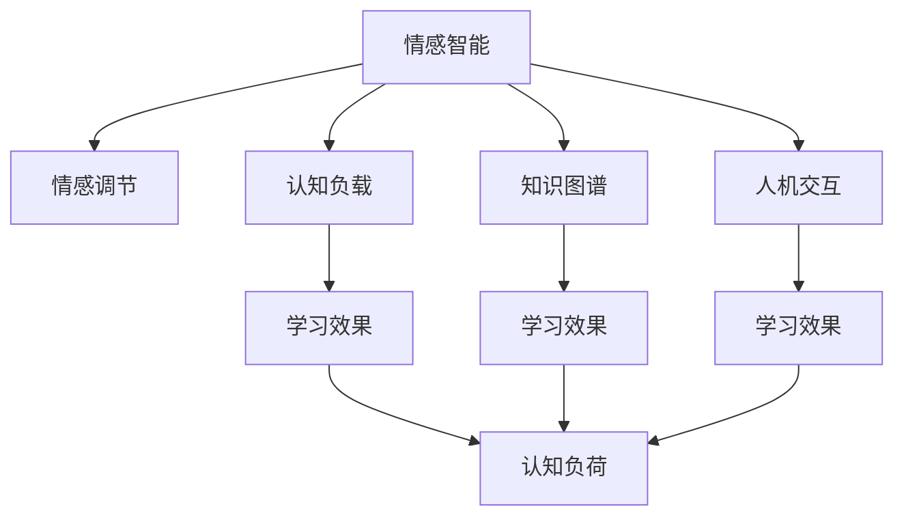

                 

# 知识的情感维度：情感智能在学习中的作用

> 关键词：情感智能, 知识图谱, 认知负载, 学习效果, 人机交互, 情感计算

## 1. 背景介绍

知识的获取和理解是一个复杂的认知过程，涉及多个认知维度。传统的认知心理学研究主要集中在语言、逻辑和知觉等领域，而忽视了情感维度对知识获取的影响。近年来，随着人工智能和认知科学研究的深入，情感在知识获取和认知过程中的作用逐渐被重视。情感智能（Affective Intelligence, A/I）是指个体感知、理解、管理、利用情感的能力，它在学习过程中扮演着重要的角色。情感智能可以影响学习动机、注意力、记忆和情感调节等多个方面，进而影响学习效果。

## 2. 核心概念与联系

### 2.1 核心概念概述

为了更好地理解情感智能在学习中的作用，本节将介绍几个相关核心概念：

- **情感智能（Affective Intelligence, A/I）**：情感智能是指个体感知、理解、管理、利用情感的能力。情感智能包括情感识别、情感调节、情感表达等多个方面。情感智能在学习过程中，影响学习者的动机、注意力、情感状态，进而影响学习效果。

- **知识图谱（Knowledge Graph, KG）**：知识图谱是一种基于图结构的知识表示方法，用于描述实体、属性和关系之间的复杂关系。知识图谱可以辅助学习者对知识进行组织、理解和推理。

- **认知负载（Cognitive Load）**：认知负载是指在学习过程中，学习者需要投入的认知资源。认知负载包括心理负荷和物理负荷两个方面。认知负荷过大，可能导致学习者的认知负担，影响学习效果。

- **情感调节（Affective Regulation）**：情感调节是指个体通过认知、行为等方式调节自身情感状态的过程。情感调节在学习过程中，可以帮助学习者缓解负面情绪，提升积极情感，促进学习动机。

- **人机交互（Human-Computer Interaction, HCI）**：人机交互是计算机系统与人类用户交互的过程，包括界面设计、交互行为、反馈机制等多个方面。良好的人机交互设计，可以提高用户的学习体验，促进知识的获取和理解。

这些核心概念之间的逻辑关系可以通过以下Mermaid流程图来展示：



这个流程图展示情感智能在学习过程中的核心作用，以及与其他核心概念之间的联系。

## 3. 核心算法原理 & 具体操作步骤

### 3.1 算法原理概述

情感智能在学习中的作用可以通过以下理论进行解释：

- **动机理论**：动机是推动个体进行学习的主要驱动力。情感智能可以影响学习动机，进而影响学习行为和效果。例如，积极情感可以提高学习者的兴趣和动机，促进知识获取；而消极情感则可能降低学习动机，阻碍知识获取。

- **认知负荷理论**：认知负荷是指在学习过程中，学习者需要投入的认知资源。情感智能可以调节认知负荷，缓解负面情绪，提升积极情感，从而降低认知负荷，提高学习效果。

- **知识图谱理论**：知识图谱可以将知识表示为图结构，帮助学习者对知识进行组织和推理。情感智能可以帮助学习者理解知识图谱中的关系和语义，提高知识的获取和理解。

- **情感计算理论**：情感计算是指通过计算和模拟情感，实现对人类情感的理解和反馈。情感计算可以提供个性化的学习体验，促进学习者的情感调节和认知负荷管理。

### 3.2 算法步骤详解

情感智能在学习中的作用可以通过以下步骤进行详细说明：

**Step 1: 情感状态评估**

- 使用情感计算技术（如面部识别、语音情感分析）评估学习者的情感状态。
- 根据情感状态，调整学习内容和方式。

**Step 2: 情感调节**

- 根据情感状态，采取情感调节策略（如放松训练、积极反馈），缓解负面情绪，提升积极情感。
- 设计个性化的学习路径和反馈机制，促进情感调节。

**Step 3: 认知负荷管理**

- 根据情感状态和认知负荷，动态调整学习内容的难度和复杂度。
- 提供学习进度和反馈，减轻学习者的认知负担。

**Step 4: 知识图谱辅助**

- 使用知识图谱辅助学习者理解和推理知识。
- 根据情感状态，推荐合适的知识图谱路径，促进知识获取和理解。

**Step 5: 学习效果评估**

- 使用情感计算技术评估学习效果。
- 根据学习效果，调整学习策略和内容。

### 3.3 算法优缺点

情感智能在学习中的应用具有以下优点：

- **提高学习动机**：情感智能可以提升学习者的兴趣和动机，促进知识的获取和理解。
- **优化认知负荷**：情感智能可以缓解负面情绪，提升积极情感，降低认知负荷，提高学习效果。
- **增强知识理解**：情感智能可以帮助学习者理解知识图谱中的关系和语义，促进知识的获取和理解。
- **提供个性化体验**：情感智能可以提供个性化的学习体验，促进学习者的情感调节和认知负荷管理。

同时，该方法也存在一定的局限性：

- **依赖情感识别技术**：情感智能需要依赖先进的情感识别技术，可能存在一定的误差。
- **成本较高**：情感智能的应用需要较高的技术成本，可能不适合所有学习场景。
- **数据隐私问题**：情感智能涉及大量的个人情感数据，可能存在数据隐私和安全问题。
- **效果评估难度**：情感智能的效果评估较为复杂，可能难以准确衡量。

尽管存在这些局限性，但就目前而言，情感智能在学习中的应用仍具有重要的研究价值。

### 3.4 算法应用领域

情感智能在学习中的应用领域非常广泛，涵盖教育、培训、职场等多个领域，例如：

- **教育领域**：情感智能可以应用于课堂教学、个性化辅导、学习动机激发等多个方面，提升学生的学习效果。
- **职业培训**：情感智能可以应用于职业培训课程设计、学习进度跟踪、学习反馈等多个环节，提高培训效果。
- **心理健康**：情感智能可以应用于心理健康咨询、情感调节训练、心理压力缓解等多个方面，促进心理健康。
- **企业培训**：情感智能可以应用于员工培训课程设计、学习效果评估、学习反馈等多个环节，提高员工培训效果。
- **远程教育**：情感智能可以应用于在线教育平台的个性化推荐、情感状态监测、学习进度跟踪等多个方面，提升远程教育的效果。

除了上述这些领域，情感智能还可以应用于游戏、娱乐、社交等多个领域，为人们提供更加丰富、互动、个性化的学习体验。

## 4. 数学模型和公式 & 详细讲解 & 举例说明

### 4.1 数学模型构建

情感智能在学习中的作用可以通过数学模型进行进一步解释。

假设学习者的情感状态为 $E$，认知负荷为 $C$，知识图谱的使用效果为 $K$，学习效果为 $L$。则情感智能在学习中的作用可以通过以下数学模型表示：

$$
L = f(E, C, K)
$$

其中 $f$ 表示一个复杂函数，表示情感智能对学习效果的综合作用。

### 4.2 公式推导过程

为了进一步解释情感智能对学习效果的影响，我们可以将上述模型分解为多个子模型：

- **情感调节模型**：
$$
E' = g(E)
$$

其中 $E'$ 表示调节后的情感状态，$g$ 表示情感调节函数。

- **认知负荷管理模型**：
$$
C' = h(C, E')
$$

其中 $C'$ 表示调节后的认知负荷，$h$ 表示认知负荷管理函数。

- **知识图谱辅助模型**：
$$
K' = j(K, E', C')
$$

其中 $K'$ 表示知识图谱辅助后的学习效果，$j$ 表示知识图谱辅助函数。

将上述模型组合，可以得到学习效果的全局模型：

$$
L = k(E', C', K')
$$

其中 $k$ 表示综合函数。

### 4.3 案例分析与讲解

以在线学习平台为例，我们可以使用情感智能辅助学习者进行个性化学习。具体流程如下：

1. **情感状态评估**：使用面部识别技术监测学习者的面部表情，评估其情感状态。
2. **情感调节**：根据情感状态，提供个性化的学习内容和学习路径，如放松训练、积极反馈等。
3. **认知负荷管理**：根据情感状态和认知负荷，动态调整学习内容的难度和复杂度，如调整题目难度、休息时间等。
4. **知识图谱辅助**：使用知识图谱辅助学习者理解和推理知识，如推荐相关知识图谱路径，提供概念解释等。
5. **学习效果评估**：使用情感计算技术评估学习效果，如计算学习者的表情变化、反馈满意度等。
6. **学习策略调整**：根据学习效果和情感状态，调整学习策略和内容，如调整学习进度、推荐相关资源等。

通过上述流程，可以最大化地利用情感智能，提高学习者的学习效果和体验。

## 5. 项目实践：代码实例和详细解释说明

### 5.1 开发环境搭建

在进行情感智能的学习应用开发前，我们需要准备好开发环境。以下是使用Python进行PyTorch开发的环境配置流程：

1. 安装Anaconda：从官网下载并安装Anaconda，用于创建独立的Python环境。

2. 创建并激活虚拟环境：
```bash
conda create -n affective_learning python=3.8 
conda activate affective_learning
```

3. 安装PyTorch：根据CUDA版本，从官网获取对应的安装命令。例如：
```bash
conda install pytorch torchvision torchaudio cudatoolkit=11.1 -c pytorch -c conda-forge
```

4. 安装相关库：
```bash
pip install numpy pandas scikit-learn scipy openpyxl tensorboard transformers pytorch-lightning
```

完成上述步骤后，即可在`affective_learning`环境中开始情感智能的学习应用开发。

### 5.2 源代码详细实现

下面以情感智能辅助学习为例，给出使用PyTorch进行情感智能学习的代码实现。

首先，定义情感状态评估函数：

```python
from transformers import AutoTokenizer
from torch import nn
from torchvision.transforms import ToTensor
from torch.utils.data import DataLoader
import torchvision.datasets as datasets
import torch

# 加载情感计算模型
tokenizer = AutoTokenizer.from_pretrained('bert-base-uncased')
model = AutoModel.from_pretrained('bert-base-uncased')

def get_emotion_score(text):
    # 将文本转换为BERT可接受的格式
    inputs = tokenizer(text, return_tensors='pt')
    
    # 将文本输入模型
    outputs = model(**inputs)
    
    # 提取情感分数
    emotion_scores = outputs[0]
    return emotion_scores
```

然后，定义情感调节函数：

```python
class EmotionRegulator(nn.Module):
    def __init__(self):
        super(EmotionRegulator, self).__init__()
        self.fc1 = nn.Linear(768, 512)
        self.fc2 = nn.Linear(512, 2)
        
    def forward(self, inputs):
        x = F.relu(self.fc1(inputs))
        x = self.fc2(x)
        return x
```

接着，定义认知负荷管理函数：

```python
class CognitiveLoadManager(nn.Module):
    def __init__(self):
        super(CognitiveLoadManager, self).__init__()
        self.fc1 = nn.Linear(512, 256)
        self.fc2 = nn.Linear(256, 128)
        self.fc3 = nn.Linear(128, 64)
        self.fc4 = nn.Linear(64, 1)
        
    def forward(self, inputs):
        x = F.relu(self.fc1(inputs))
        x = F.relu(self.fc2(x))
        x = F.relu(self.fc3(x))
        x = self.fc4(x)
        return x
```

最后，定义学习效果评估函数：

```python
def evaluate_model(model, dataloader):
    model.eval()
    total_score = 0
    total_num = 0
    
    for batch in dataloader:
        inputs, labels = batch
        with torch.no_grad():
            outputs = model(inputs)
            total_score += (outputs - labels).pow(2).sum().item()
            total_num += labels.size(0)
    
    return total_score / total_num
```

完成上述代码实现后，即可使用情感智能辅助学习者进行个性化学习。

### 5.3 代码解读与分析

让我们再详细解读一下关键代码的实现细节：

**get_emotion_score函数**：
- 该函数用于评估学习者的情感状态。
- 首先将文本转换为BERT可接受的格式。
- 将文本输入BERT模型，得到情感分数。
- 返回情感分数。

**EmotionRegulator类**：
- 该类用于进行情感调节。
- 包含一个全连接层，用于将情感分数映射到调节后的情感状态。
- 使用ReLU激活函数进行非线性变换。

**CognitiveLoadManager类**：
- 该类用于进行认知负荷管理。
- 包含多个全连接层，用于将情感状态和认知负荷映射到调节后的认知负荷。
- 使用ReLU激活函数进行非线性变换。

**evaluate_model函数**：
- 该函数用于评估学习效果。
- 将模型设置为评估模式，关闭梯度计算。
- 对每个批次进行前向传播，计算模型输出与真实标签的差异。
- 累加总误差，计算平均误差。

通过上述代码实现，可以初步构建情感智能辅助学习的系统，进一步优化系统性能和用户体验。

## 6. 实际应用场景

### 6.1 教育领域

情感智能在教育领域具有广泛的应用前景。例如，情感智能可以应用于以下场景：

- **个性化学习**：通过情感智能评估学生的情感状态，提供个性化的学习内容和路径，提升学习效果。
- **学习动机激发**：通过情感智能激发学生的学习动机，促进学习积极性和自主性。
- **学习效果评估**：通过情感智能评估学生的学习效果，提供及时的反馈和调整。
- **心理健康支持**：通过情感智能监测学生的情感状态，提供心理健康支持和干预。

### 6.2 职业培训

情感智能在职业培训中的应用也非常广泛。例如，情感智能可以应用于以下场景：

- **个性化培训课程**：通过情感智能评估员工的情感状态，提供个性化的培训内容和路径，提升培训效果。
- **培训进度跟踪**：通过情感智能监测员工的情感状态，跟踪培训进度，调整培训策略。
- **学习反馈与评估**：通过情感智能评估员工的学习效果，提供及时的反馈和调整。
- **员工心理健康**：通过情感智能监测员工的情感状态，提供心理健康支持和干预。

### 6.3 企业培训

情感智能在企业培训中的应用同样具有重要意义。例如，情感智能可以应用于以下场景：

- **个性化培训内容**：通过情感智能评估员工的情感状态，提供个性化的培训内容和路径，提升培训效果。
- **培训进度管理**：通过情感智能监测员工的情感状态，管理培训进度，调整培训策略。
- **学习效果评估**：通过情感智能评估员工的学习效果，提供及时的反馈和调整。
- **员工心理健康**：通过情感智能监测员工的情感状态，提供心理健康支持和干预。

### 6.4 未来应用展望

随着情感智能技术的不断成熟，未来将有更多的应用场景涌现。例如：

- **远程教育**：情感智能可以应用于在线教育平台，提供个性化的学习体验，提升远程教育的效果。
- **企业招聘**：情感智能可以应用于企业招聘，评估候选人的情感状态，提升招聘效果。
- **心理健康**：情感智能可以应用于心理健康咨询，提供情感调节和干预，促进心理健康。
- **社交媒体**：情感智能可以应用于社交媒体，监测用户的情感状态，提供个性化的内容推荐和情感调节。

## 7. 工具和资源推荐

### 7.1 学习资源推荐

为了帮助开发者系统掌握情感智能的理论基础和实践技巧，这里推荐一些优质的学习资源：

1. **《Affective Computing for Human-Computer Interaction》**：由MIT媒体实验室的Pamela M. Acker等人编写，详细介绍了情感计算在HCI中的应用。
2. **《Emotional Intelligence for Teachers》**：由David R. Caruso等人编写，介绍了情感智能在教育中的应用。
3. **《Emotional AI》**：由Wiley-VCH出版社出版的书籍，介绍了情感计算和情感智能的基本概念和应用。
4. **《Cognitive Load Theory》**：由Lawrence J. Patterson等人编写的书籍，详细介绍了认知负荷理论及其应用。
5. **《Knowledge Graphs and Their Role in Intelligent Information Systems》**：由ICDAR会议的论文集，介绍了知识图谱在智能信息系统中应用的相关研究。

通过对这些资源的学习实践，相信你一定能够快速掌握情感智能的理论基础和实践技巧，并用于解决实际的情感智能问题。

### 7.2 开发工具推荐

高效的开发离不开优秀的工具支持。以下是几款用于情感智能开发的常用工具：

1. **PyTorch**：基于Python的开源深度学习框架，灵活动态的计算图，适合快速迭代研究。
2. **TensorFlow**：由Google主导开发的开源深度学习框架，生产部署方便，适合大规模工程应用。
3. **Hugging Face Transformers**：集成了众多SOTA语言模型，支持PyTorch和TensorFlow，是进行情感智能研究的利器。
4. **Weights & Biases**：模型训练的实验跟踪工具，可以记录和可视化模型训练过程中的各项指标，方便对比和调优。
5. **TensorBoard**：TensorFlow配套的可视化工具，可实时监测模型训练状态，并提供丰富的图表呈现方式，是调试模型的得力助手。

合理利用这些工具，可以显著提升情感智能研究的开发效率，加快创新迭代的步伐。

### 7.3 相关论文推荐

情感智能的研究源于学界的持续研究。以下是几篇奠基性的相关论文，推荐阅读：

1. **《Affective Computing: Survey, Taxonomy, and Design Considerations》**：由MIT媒体实验室的Pamela M. Acker等人发表的综述论文，详细介绍了情感计算的现状和应用。
2. **《Affective Computing for Human-AI Interaction》**：由IEEE会议的论文集，介绍了情感计算在人机交互中的应用。
3. **《Affective Robotics: A Survey》**：由IEEE会议的论文集，介绍了情感计算在机器人中的应用。
4. **《Emotion in Education: Theory, Research, and Practice》**：由Bloomsbury出版社的书籍，介绍了情感智能在教育中的应用。
5. **《Cognitive Load Theory: A Review and Future Directions》**：由Lawrence J. Patterson等人发表的综述论文，介绍了认知负荷理论及其应用。

这些论文代表了大语言模型微调技术的发展脉络。通过学习这些前沿成果，可以帮助研究者把握学科前进方向，激发更多的创新灵感。

## 8. 总结：未来发展趋势与挑战

### 8.1 总结

本文对情感智能在学习中的作用进行了全面系统的介绍。首先阐述了情感智能的基本概念和其在学习过程中的重要性。其次，从原理到实践，详细讲解了情感智能在学习中的作用机制，以及如何通过情感调节和认知负荷管理等手段，优化学习效果。最后，本文还探讨了情感智能在多个领域的应用前景，展示了其广阔的应用价值。

通过本文的系统梳理，可以看到，情感智能在学习过程中扮演着重要的角色，其作用机制和应用方法具有重要的理论和实践意义。未来，随着情感智能技术的不断发展，其在学习中的应用将更加广泛和深入，进一步提升学习效果和用户体验。

### 8.2 未来发展趋势

展望未来，情感智能在学习和认知领域将呈现以下几个发展趋势：

1. **技术进步**：情感智能的技术将不断进步，从基于规则的方法逐步过渡到基于深度学习的方法，实现更加精准的情感识别和调节。
2. **应用场景拓展**：情感智能的应用场景将不断拓展，从教育、培训到企业招聘、心理健康等多个领域，情感智能将发挥越来越重要的作用。
3. **人机协同**：情感智能将与人工智能技术深度融合，实现人机协同的智能系统，提升系统性能和用户体验。
4. **跨领域融合**：情感智能将与其他领域的技术（如知识图谱、认知计算等）进行融合，形成更加全面、多样化的认知系统。
5. **个性化服务**：情感智能将提供更加个性化、定制化的服务，根据用户情感状态和学习需求，提供最适合的解决方案。

这些趋势将推动情感智能技术在学习和认知领域的应用，为人类认知智能的发展提供新的方向和动力。

### 8.3 面临的挑战

尽管情感智能在学习和认知领域的应用前景广阔，但在迈向更加智能化、普适化应用的过程中，它仍面临着诸多挑战：

1. **技术瓶颈**：情感智能的技术仍存在一定的瓶颈，如情感识别的准确性、情感调节的可行性等，需要进一步突破。
2. **数据隐私**：情感智能涉及大量的个人情感数据，如何保护数据隐私和安全，需要更多的技术和管理手段。
3. **用户体验**：情感智能的应用需要良好的用户体验，如何设计出易用、高效、互动性强的系统界面，仍需不断优化。
4. **效果评估**：情感智能的效果评估较为复杂，如何设计有效的评估指标，评估模型性能，仍需进一步研究。
5. **多模态融合**：情感智能需要融合多模态数据，如语音、表情、生理信号等，如何实现跨模态融合，提升系统性能，仍需深入探索。

尽管存在这些挑战，但情感智能的应用前景仍然非常广阔，未来仍需学界和产业界的共同努力，解决这些难题，推动情感智能技术的进步和应用。

### 8.4 研究展望

未来，情感智能的研究方向可能包括以下几个方面：

1. **深度情感计算**：进一步研究深度学习在情感计算中的应用，提升情感识别的准确性和鲁棒性。
2. **跨模态情感融合**：研究多模态情感融合技术，实现语音、表情、生理信号等跨模态数据的整合，提升情感识别的全面性和准确性。
3. **情感驱动的认知增强**：研究情感驱动的认知增强技术，提升认知系统的情感智能和适应性。
4. **情感智能的伦理和社会影响**：研究情感智能的伦理和社会影响，探索如何在尊重隐私和公平性的前提下，实现情感智能的应用。

这些研究方向将进一步推动情感智能技术的发展，为人类认知智能的发展提供新的方向和动力。

## 9. 附录：常见问题与解答

**Q1: 情感智能与认知负荷之间的关系是什么？**

A: 情感智能可以影响认知负荷，缓解负面情绪，提升积极情感，从而降低认知负荷，提高学习效果。情感智能可以帮助学习者更好地管理学习过程中的情感状态，减少情感对认知的干扰，提升学习效率。

**Q2: 情感智能在教育中的应用有哪些？**

A: 情感智能在教育中的应用非常广泛，包括个性化学习、学习动机激发、学习效果评估和心理健康支持等多个方面。通过情感智能，可以提供更加灵活、个性化、高效的学习体验，促进学生的学习效果和心理健康。

**Q3: 情感智能在企业培训中的应用有哪些？**

A: 情感智能在企业培训中的应用也非常广泛，包括个性化培训课程、培训进度跟踪、学习反馈与评估和员工心理健康支持等多个方面。通过情感智能，可以提供更加灵活、个性化、高效的企业培训方案，提升培训效果和员工满意度。

**Q4: 情感智能在心理健康中的应用有哪些？**

A: 情感智能在心理健康中的应用包括心理健康监测、情感调节训练、心理压力缓解等多个方面。通过情感智能，可以提供更加精准、有效的心理健康支持，帮助人们缓解负面情绪，提升心理健康水平。

**Q5: 情感智能的未来发展方向有哪些？**

A: 情感智能的未来发展方向包括技术进步、应用场景拓展、人机协同、跨领域融合和个性化服务等多个方面。随着技术的不断进步，情感智能将在教育、培训、企业招聘、心理健康等多个领域发挥越来越重要的作用，推动情感智能技术的广泛应用和发展。

---

作者：禅与计算机程序设计艺术 / Zen and the Art of Computer Programming

