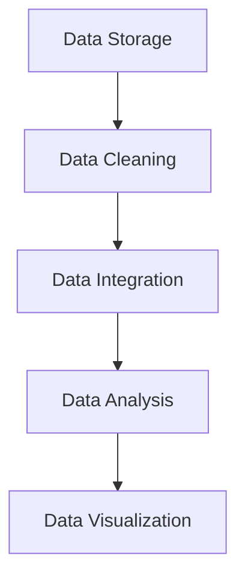
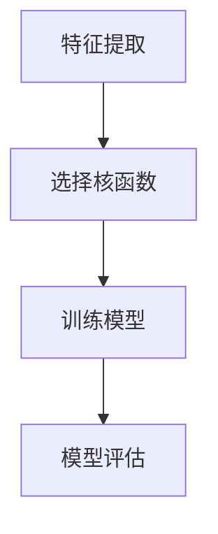
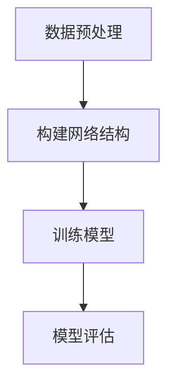
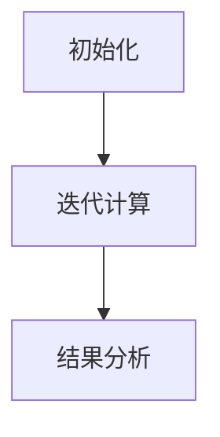
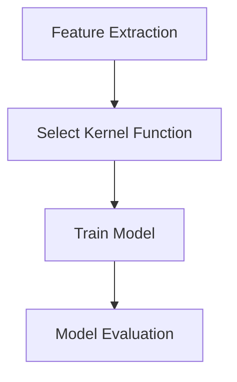
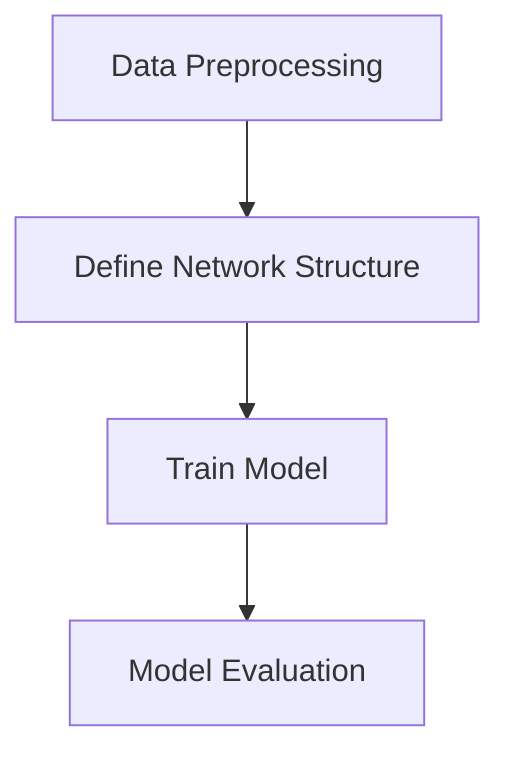
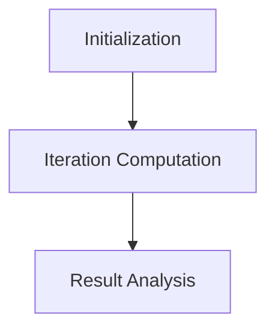

                 

### 背景介绍（Background Introduction）

在当今社会，人工智能（Artificial Intelligence，简称AI）的应用已经渗透到了生活的方方面面，从智能助手到自动驾驶，从医疗诊断到金融分析，AI正以惊人的速度改变着我们的世界。随着AI技术的不断进步，如何有效地管理和利用大量数据成为了企业和研究机构亟待解决的问题。数据管理不仅是AI应用的基础，更是提升决策效率、降低运营成本和实现商业价值的关键因素。

人工智能创业领域的数据管理，面临着前所未有的挑战和机遇。一方面，随着数据量的激增，数据存储、处理和分析的复杂性日益增加；另一方面，新技术的不断涌现，如云计算、大数据和边缘计算，为数据管理提供了更多可能性。因此，如何结合技术创新，提出有效的数据管理策略，成为了人工智能创业领域的重要课题。

本文旨在探讨人工智能创业中的数据管理策略与创新，具体研究内容包括以下几个方面：

1. **数据管理核心概念**：首先，我们将梳理数据管理的基本概念，包括数据存储、数据清洗、数据分析和数据可视化等，并探讨这些概念在AI创业中的应用。

2. **核心算法原理**：其次，本文将深入探讨数据管理中常用的核心算法，如机器学习算法、深度学习算法和图算法，并分析它们在数据管理中的具体应用。

3. **数学模型和公式**：我们将介绍与数据管理相关的数学模型和公式，详细讲解它们的工作原理和应用场景，并通过具体例子进行说明。

4. **项目实践**：为了更好地理解数据管理的实际应用，本文将提供一个完整的代码实例，详细解释并分析其实现过程和运行结果。

5. **实际应用场景**：我们将分析人工智能创业中常见的实际应用场景，探讨数据管理在这些场景中的作用和挑战。

6. **工具和资源推荐**：最后，我们将推荐一些数据管理相关的学习资源、开发工具和框架，帮助读者更好地掌握数据管理技能。

通过上述内容的研究，本文希望为人工智能创业领域提供一套切实可行的数据管理策略，帮助企业在数据管理和分析方面实现创新和突破。下面，我们将逐一深入探讨这些内容。

### Keywords: Artificial Intelligence, Data Management, Strategies, Innovation

### Abstract:

This article aims to explore the strategies and innovations in data management for artificial intelligence startups. With the rapid advancement of AI technologies, effective data management has become a crucial factor for enterprises and research institutions. This paper addresses the challenges and opportunities in data management for AI startups, focusing on core concepts, algorithm principles, mathematical models, practical applications, and recommended tools and resources. By providing a comprehensive analysis and practical examples, this article seeks to offer actionable insights and strategies for AI startups to innovate and excel in data management.

## 1. 背景介绍（Background Introduction）

In today's society, Artificial Intelligence (AI) applications have permeated every aspect of our lives, from smart assistants to autonomous vehicles, from medical diagnosis to financial analysis. As AI technology continues to advance at an astonishing pace, how to effectively manage and utilize massive amounts of data has become a pressing issue for businesses and research institutions. Data management is not only the foundation of AI applications but also a key factor in improving decision-making efficiency, reducing operational costs, and achieving commercial value.

Data management in the field of artificial intelligence startups faces unprecedented challenges and opportunities. On one hand, with the exponential increase in data volume, the complexity of data storage, processing, and analysis is growing rapidly. On the other hand, emerging technologies such as cloud computing, big data, and edge computing have provided more possibilities for data management. Therefore, how to combine technological innovation and propose effective data management strategies has become an important topic in the field of AI startups.

This article aims to explore the strategies and innovations in data management for artificial intelligence startups. The main research contents include the following aspects:

1. **Core Concepts of Data Management**: Firstly, we will sort out the basic concepts of data management, including data storage, data cleaning, data analysis, and data visualization, and discuss their applications in AI startups.

2. **Core Algorithm Principles**: Secondly, this article will delve into the core algorithms commonly used in data management, such as machine learning algorithms, deep learning algorithms, and graph algorithms, and analyze their specific applications in data management.

3. **Mathematical Models and Formulas**: We will introduce the mathematical models and formulas related to data management, provide detailed explanations of their working principles and application scenarios, and illustrate them with specific examples.

4. **Project Practice**: To better understand the practical applications of data management, this article will provide a complete code example, detailing and analyzing its implementation process and runtime results.

5. **Practical Application Scenarios**: We will analyze common practical application scenarios in artificial intelligence startups, discussing the role and challenges of data management in these scenarios.

6. **Tools and Resources Recommendations**: Finally, we will recommend some data management-related learning resources, development tools, and frameworks to help readers better master data management skills.

Through the above-mentioned research content, this article aims to provide a practical and actionable data management strategy for AI startups to innovate and break through in data management.

## 2. 核心概念与联系（Core Concepts and Connections）

在深入探讨数据管理策略之前，首先需要了解数据管理的核心概念及其相互联系。数据管理不仅涉及存储和访问数据，还包括数据清洗、数据集成、数据分析和数据可视化等多个方面。以下是数据管理的一些关键概念：

### 2.1 数据存储（Data Storage）

数据存储是数据管理的基础，涉及到数据的物理存储位置及其访问方式。在人工智能创业中，数据存储面临的一个主要挑战是如何处理大量数据的存储需求。传统的集中式存储可能无法满足这种需求，因此分布式存储和云存储成为了常见的选择。

### 2.2 数据清洗（Data Cleaning）

数据清洗是指处理和清洗原始数据，使其符合预期的质量和格式。这对于机器学习和数据分析至关重要，因为不完整、错误或重复的数据会影响模型的准确性和效率。数据清洗通常包括数据去重、缺失值处理和异常值检测等步骤。

### 2.3 数据集成（Data Integration）

数据集成是将来自不同来源和格式的数据整合到一起，以便于分析和使用。这对于人工智能创业尤其重要，因为它们可能需要从多个渠道收集数据，如用户行为数据、市场数据等。数据集成涉及到数据转换、数据映射和数据融合等技术。

### 2.4 数据分析（Data Analysis）

数据分析是指使用统计学、机器学习和深度学习等方法对数据进行处理和分析，以提取有价值的信息和知识。在人工智能创业中，数据分析可以用于预测市场趋势、优化业务流程和提升用户体验等。

### 2.5 数据可视化（Data Visualization）

数据可视化是将数据以图形、图表和地图等形式展示出来，以便于理解和分析。数据可视化不仅使数据更加直观，还能帮助发现数据中的模式和趋势。在人工智能创业中，数据可视化是沟通数据分析和业务决策的重要工具。

这些核心概念相互联系，共同构成了数据管理的基础。以下是一个简化的Mermaid流程图，展示了这些概念之间的联系：



### 2.6 数据存储（Data Storage）

Data storage is the foundation of data management and involves the physical location where data is stored and how it is accessed. In the context of artificial intelligence startups, one of the main challenges in data storage is handling the massive demand for storage. Traditional centralized storage may not be sufficient, making distributed storage and cloud storage common choices.

### 2.7 数据清洗（Data Cleaning）

Data cleaning refers to the process of processing and cleaning raw data to ensure it meets the expected quality and format. This is crucial for machine learning and data analysis, as incomplete, erroneous, or duplicate data can affect the accuracy and efficiency of models. Data cleaning typically includes steps such as data deduplication, missing value handling, and anomaly detection.

### 2.8 数据集成（Data Integration）

Data integration involves combining data from different sources and formats to facilitate analysis and usage. This is particularly important for artificial intelligence startups, which may need to collect data from multiple channels, such as user behavior data and market data. Data integration involves technologies such as data transformation, data mapping, and data fusion.

### 2.9 数据分析（Data Analysis）

Data analysis involves using statistical, machine learning, and deep learning methods to process and analyze data to extract valuable information and knowledge. In the context of artificial intelligence startups, data analysis can be used for forecasting market trends, optimizing business processes, and improving user experiences.

### 2.10 数据可视化（Data Visualization）

Data visualization refers to the representation of data in graphical, chart, and map forms to make it more intuitive and easier to analyze. Data visualization not only makes data more accessible but also helps in discovering patterns and trends within the data. In the context of artificial intelligence startups, data visualization is an essential tool for communicating data analysis and business decisions.

These core concepts are interconnected and form the foundation of data management. Below is a simplified Mermaid flowchart illustrating the relationships between these concepts:


## 3. 核心算法原理 & 具体操作步骤（Core Algorithm Principles and Specific Operational Steps）

在数据管理中，核心算法的选择和实现是关键的一环。以下我们将介绍几种在人工智能创业中常用的核心算法，并详细说明其原理和具体操作步骤。

### 3.1 机器学习算法（Machine Learning Algorithms）

机器学习算法是数据管理中的基本工具，用于从数据中自动发现模式和关系。以下是一种常用的机器学习算法——支持向量机（Support Vector Machine, SVM）。

#### 3.1.1 SVM算法原理

SVM算法通过在特征空间中找到一个最佳的超平面，使得数据集中的不同类别被最大化分隔。其核心思想是找到一个最优的超平面，使得正负样本之间的距离最大化。

#### 3.1.2 操作步骤

1. **特征提取**：从原始数据中提取有用的特征。
2. **选择核函数**：根据数据特点选择合适的核函数，如线性核、多项式核、径向基函数（RBF）核等。
3. **训练模型**：使用选定的核函数训练SVM模型。
4. **模型评估**：通过交叉验证和测试集评估模型的性能。

以下是SVM算法的操作步骤的具体说明：



### 3.2 深度学习算法（Deep Learning Algorithms）

深度学习算法是机器学习的一个分支，它通过多层神经网络自动学习数据中的复杂模式。以下是一种常用的深度学习算法——卷积神经网络（Convolutional Neural Network, CNN）。

#### 3.2.1 CNN算法原理

CNN通过卷积层、池化层和全连接层等结构，从图像或视频中自动提取特征。其核心思想是利用局部连接和权重共享来减少参数数量，提高模型的泛化能力。

#### 3.2.2 操作步骤

1. **数据预处理**：对输入数据进行标准化和归一化处理。
2. **构建网络结构**：定义卷积层、池化层和全连接层的网络结构。
3. **训练模型**：使用反向传播算法训练模型。
4. **模型评估**：通过测试集评估模型的性能。

以下是CNN算法的操作步骤的具体说明：



### 3.3 图算法（Graph Algorithms）

图算法用于处理图结构数据，如图像、社交网络等。以下是一种常用的图算法——PageRank算法。

#### 3.3.1 PageRank算法原理

PageRank是一种基于图链接分析的算法，用于确定网页的重要性。其核心思想是页面之间的链接作为投票，页面得到的投票越多，其重要性越高。

#### 3.3.2 操作步骤

1. **初始化**：为每个网页分配初始重要性值。
2. **迭代计算**：根据链接关系更新每个网页的重要性值，迭代直到收敛。
3. **结果分析**：根据重要性值分析网页的重要性。

以下是PageRank算法的操作步骤的具体说明：



通过以上介绍，我们可以看到不同算法在数据管理中的应用各有特点。在实际应用中，需要根据具体的数据特点和业务需求选择合适的算法，并对其进行优化和调整。

### 3.1 Core Algorithm Principles

In the realm of data management, the selection and implementation of core algorithms are crucial. We will introduce several commonly used core algorithms in artificial intelligence startups and provide detailed explanations of their principles and specific operational steps.

#### 3.1.1 Principles of Machine Learning Algorithms

Machine learning algorithms are fundamental tools for discovering patterns and relationships in data. One of the commonly used machine learning algorithms is the Support Vector Machine (SVM).

##### 3.1.1.1 Principles of SVM

SVM algorithms find the optimal hyperplane in the feature space that maximally separates different classes in the data set. The core idea is to find the best hyperplane that maximizes the distance between positive and negative samples.

##### 3.1.1.2 Operational Steps

1. **Feature Extraction**: Extract useful features from the raw data.
2. **Select Kernel Function**: Choose an appropriate kernel function based on the characteristics of the data, such as linear, polynomial, or Radial Basis Function (RBF) kernels.
3. **Train the Model**: Train the SVM model using the selected kernel function.
4. **Evaluate the Model**: Assess the performance of the model using cross-validation and the test set.

Here are the detailed operational steps of the SVM algorithm:



#### 3.1.2 Principles of Deep Learning Algorithms

Deep learning algorithms are a branch of machine learning that automatically learn complex patterns from data. One of the commonly used deep learning algorithms is the Convolutional Neural Network (CNN).

##### 3.1.2.1 Principles of CNN

CNNs consist of convolutional layers, pooling layers, and fully connected layers that automatically extract features from images or videos. The core idea is to use local connections and weight sharing to reduce the number of parameters and improve the generalization ability of the model.

##### 3.1.2.2 Operational Steps

1. **Data Preprocessing**: Standardize and normalize the input data.
2. **Define Network Structure**: Define the network structure consisting of convolutional layers, pooling layers, and fully connected layers.
3. **Train the Model**: Train the model using the backpropagation algorithm.
4. **Evaluate the Model**: Assess the performance of the model using the test set.

Here are the detailed operational steps of the CNN algorithm:



#### 3.1.3 Principles of Graph Algorithms

Graph algorithms are used for processing graph-structured data, such as images and social networks. One of the commonly used graph algorithms is the PageRank algorithm.

##### 3.1.3.1 Principles of PageRank

PageRank is a link analysis algorithm used to determine the importance of web pages. The core idea is that the links between pages act as votes, and pages with more votes are considered more important.

##### 3.1.3.2 Operational Steps

1. **Initialization**: Assign initial importance values to each web page.
2. **Iteration Computation**: Update the importance values of each page based on the link relationships and iterate until convergence.
3. **Result Analysis**: Analyze the importance values to determine the importance of pages.

Here are the detailed operational steps of the PageRank algorithm:



Through these introductions, we can see that different algorithms have their own characteristics in data management applications. In practice, it is necessary to choose the appropriate algorithm based on the specific data characteristics and business requirements and to optimize and adjust it accordingly.

## 4. 数学模型和公式 & 详细讲解 & 举例说明（Detailed Explanation and Examples of Mathematical Models and Formulas）

在数据管理中，数学模型和公式是理解和实现核心算法的关键。以下是几种常用的数学模型和公式，我们将详细讲解其工作原理并举例说明。

### 4.1 支持向量机（Support Vector Machine, SVM）

SVM是一种常用的分类算法，其核心思想是通过找到一个最优的超平面来分隔数据。以下是SVM的核心数学模型：

#### 4.1.1 模型公式

$$
\min_{\mathbf{w}, b} \frac{1}{2} ||\mathbf{w}||^2 + C \sum_{i=1}^{n} \xi_i
$$

其中，$\mathbf{w}$ 是权重向量，$b$ 是偏置项，$C$ 是正则化参数，$\xi_i$ 是松弛变量。

#### 4.1.2 工作原理

SVM的目标是最小化误分类风险，同时最大化分类间隔。通过求解上述优化问题，我们可以得到最优的超平面，即：
$$
\mathbf{w}^{*} = \arg \min_{\mathbf{w}} \frac{1}{2} ||\mathbf{w}||^2 + C \sum_{i=1}^{n} \xi_i
$$
其中，$y_i(\mathbf{w}^T\mathbf{x}_i + b) \geq 1 - \xi_i$，$\xi_i \geq 0$。

#### 4.1.3 示例

假设我们有一个简单的二分类问题，数据集包含两个特征 $x_1$ 和 $x_2$，目标变量 $y$ 取值为0或1。我们可以使用SVM来训练一个分类器：

1. **特征提取**：从原始数据中提取特征 $x_1$ 和 $x_2$。
2. **选择核函数**：选择线性核函数 $k(x_i, x_j) = x_i^T x_j$。
3. **训练模型**：使用SVM训练分类器。
4. **模型评估**：使用测试集评估分类器的性能。

### 4.2 卷积神经网络（Convolutional Neural Network, CNN）

CNN是一种用于图像处理的深度学习算法，其核心思想是通过卷积层、池化层和全连接层自动提取图像特征。以下是CNN的核心数学模型：

#### 4.2.1 模型公式

$$
h_{l}^{(i)} = \sigma \left( \mathbf{W}^{(l)} \cdot h_{l-1}^{(i)} + b^{(l)} \right)
$$

其中，$h_{l}^{(i)}$ 是第$l$层第$i$个神经元的激活值，$\sigma$ 是激活函数，$\mathbf{W}^{(l)}$ 是权重矩阵，$b^{(l)}$ 是偏置向量。

#### 4.2.2 工作原理

CNN通过多个卷积层和池化层来提取图像特征，然后通过全连接层进行分类。每个卷积层都会提取图像的局部特征，并通过权重矩阵进行变换。激活函数用于引入非线性，使模型能够拟合复杂的函数。

#### 4.2.3 示例

假设我们有一个简单的图像分类问题，数据集包含32x32的灰度图像和对应的标签。我们可以使用CNN来训练一个图像分类器：

1. **数据预处理**：对图像进行归一化处理，使其尺寸标准化。
2. **构建网络结构**：定义卷积层、池化层和全连接层的网络结构。
3. **训练模型**：使用反向传播算法训练模型。
4. **模型评估**：使用测试集评估分类器的性能。

### 4.3 PageRank算法

PageRank是一种用于网页排名的图算法，其核心思想是根据网页之间的链接关系来计算网页的重要性。以下是PageRank的核心数学模型：

#### 4.3.1 模型公式

$$
\mathbf{r}_{t+1} = (1-d) + d \cdot \mathbf{L} \cdot \mathbf{r}_{t}
$$

其中，$\mathbf{r}_{t}$ 是第$t$次迭代时网页的重要性向量，$\mathbf{L}$ 是链接矩阵，$d$ 是阻尼因子（通常设置为0.85）。

#### 4.3.2 工作原理

PageRank通过迭代计算网页的重要性。每次迭代，网页的重要性都会根据其链接关系进行更新。迭代过程直到重要性向量收敛。

#### 4.3.3 示例

假设我们有一个简单的网页网络，包含5个网页，它们之间的链接关系如下：

```
A -> B
A -> C
B -> C
C -> D
D -> A
```

我们可以使用PageRank算法计算每个网页的重要性：

1. **初始化**：初始化每个网页的重要性为1/5。
2. **迭代计算**：根据链接关系更新每个网页的重要性，迭代直到收敛。
3. **结果分析**：根据重要性值分析网页的重要性。

通过以上示例，我们可以看到不同数学模型和公式在数据管理中的应用。在实际应用中，需要根据具体的问题和数据特点选择合适的数学模型和公式，并对其进行优化和调整。

### 4.1 Mathematical Models and Formulas

In the field of data management, mathematical models and formulas are essential for understanding and implementing core algorithms. Below are several commonly used mathematical models and formulas, which we will explain in detail and provide examples to illustrate their principles.

#### 4.1.1 Support Vector Machine (SVM)

SVM is a commonly used classification algorithm that finds the optimal hyperplane to separate data. Here is the core mathematical model of SVM:

##### 4.1.1.1 Model Formula

$$
\min_{\mathbf{w}, b} \frac{1}{2} ||\mathbf{w}||^2 + C \sum_{i=1}^{n} \xi_i
$$

where $\mathbf{w}$ is the weight vector, $b$ is the bias term, $C$ is the regularization parameter, and $\xi_i$ is the slack variable.

##### 4.1.1.2 Working Principle

SVM aims to minimize the classification error while maximizing the margin. By solving the above optimization problem, we can find the optimal hyperplane:

$$
\mathbf{w}^{*} = \arg \min_{\mathbf{w}} \frac{1}{2} ||\mathbf{w}||^2 + C \sum_{i=1}^{n} \xi_i
$$

where $y_i(\mathbf{w}^T\mathbf{x}_i + b) \geq 1 - \xi_i$, $\xi_i \geq 0$.

##### 4.1.1.3 Example

Suppose we have a simple binary classification problem with two features $x_1$ and $x_2$, and the target variable $y$ takes values 0 or 1. We can use SVM to train a classifier:

1. **Feature Extraction**: Extract features $x_1$ and $x_2$ from the raw data.
2. **Select Kernel Function**: Choose a linear kernel function $k(x_i, x_j) = x_i^T x_j$.
3. **Train the Model**: Train the SVM classifier.
4. **Model Evaluation**: Evaluate the performance of the classifier using the test set.

#### 4.1.2 Convolutional Neural Network (CNN)

CNN is a deep learning algorithm for image processing, which uses convolutional layers, pooling layers, and fully connected layers to automatically extract image features. Here is the core mathematical model of CNN:

##### 4.1.2.1 Model Formula

$$
h_{l}^{(i)} = \sigma \left( \mathbf{W}^{(l)} \cdot h_{l-1}^{(i)} + b^{(l)} \right)
$$

where $h_{l}^{(i)}$ is the activation value of the $i$-th neuron in the $l$-th layer, $\sigma$ is the activation function, $\mathbf{W}^{(l)}$ is the weight matrix, and $b^{(l)}$ is the bias vector.

##### 4.1.2.2 Working Principle

CNN extracts image features through multiple convolutional layers and pooling layers, and then classifies them through fully connected layers. Each convolutional layer extracts local features from the image and transforms them using weight matrices. The activation function introduces nonlinearity, allowing the model to fit complex functions.

##### 4.1.2.3 Example

Suppose we have a simple image classification problem with a dataset of 32x32 grayscale images and corresponding labels. We can use CNN to train an image classifier:

1. **Data Preprocessing**: Normalize the images to standardize their size.
2. **Define Network Structure**: Define the network structure consisting of convolutional layers, pooling layers, and fully connected layers.
3. **Train the Model**: Train the model using the backpropagation algorithm.
4. **Model Evaluation**: Evaluate the performance of the classifier using the test set.

#### 4.1.3 PageRank Algorithm

PageRank is a graph algorithm used for webpage ranking, which calculates the importance of web pages based on their link relationships. Here is the core mathematical model of PageRank:

##### 4.1.3.1 Model Formula

$$
\mathbf{r}_{t+1} = (1-d) + d \cdot \mathbf{L} \cdot \mathbf{r}_{t}
$$

where $\mathbf{r}_{t}$ is the importance vector of web pages at the $t$-th iteration, $\mathbf{L}$ is the link matrix, and $d$ is the damping factor (usually set to 0.85).

##### 4.1.3.2 Working Principle

PageRank calculates the importance of web pages through iterative computation. Each time, the importance of a web page is updated based on its link relationships. The iteration process continues until the importance vector converges.

##### 4.1.3.3 Example

Suppose we have a simple web network with 5 web pages, and their link relationships are as follows:

```
A -> B
A -> C
B -> C
C -> D
D -> A
```

We can use PageRank to calculate the importance of each web page:

1. **Initialization**: Initialize the importance of each web page to 1/5.
2. **Iteration Computation**: Update the importance of each web page based on the link relationships and iterate until convergence.
3. **Result Analysis**: Analyze the importance values to determine the importance of web pages.

Through these examples, we can see the application of different mathematical models and formulas in data management. In practice, it is necessary to choose appropriate mathematical models and formulas based on specific problems and data characteristics, and optimize and adjust them accordingly.

## 5. 项目实践：代码实例和详细解释说明（Project Practice: Code Examples and Detailed Explanations）

为了更好地展示数据管理在人工智能创业中的应用，我们将通过一个实际的项目案例进行介绍。本项目旨在使用机器学习算法对用户行为数据进行分析，预测用户的下一步操作，从而为个性化推荐提供支持。

### 5.1 开发环境搭建（Setting Up the Development Environment）

在进行项目实践之前，首先需要搭建一个合适的开发环境。以下是所需的工具和库：

1. **Python**：用于编写和运行代码。
2. **NumPy**：用于数值计算。
3. **Pandas**：用于数据操作。
4. **Scikit-learn**：用于机器学习算法。
5. **Matplotlib**：用于数据可视化。

确保安装了上述工具和库后，我们可以开始编写代码。

### 5.2 源代码详细实现（Source Code Implementation）

以下是一个简单的用户行为分析预测的代码实例：

```python
import numpy as np
import pandas as pd
from sklearn.model_selection import train_test_split
from sklearn.svm import SVC
from sklearn.metrics import accuracy_score

# 5.2.1 数据读取与预处理
data = pd.read_csv('user_behavior_data.csv')
X = data[['feature1', 'feature2', 'feature3']]
y = data['next_action']

# 5.2.2 特征工程
# 在此添加特征工程步骤，如特征归一化、缺失值处理等

# 5.2.3 数据分割
X_train, X_test, y_train, y_test = train_test_split(X, y, test_size=0.2, random_state=42)

# 5.2.4 模型训练
model = SVC(kernel='linear')
model.fit(X_train, y_train)

# 5.2.5 模型评估
predictions = model.predict(X_test)
accuracy = accuracy_score(y_test, predictions)
print(f'Accuracy: {accuracy:.2f}')

# 5.2.6 可视化
import matplotlib.pyplot as plt

plt.scatter(X_test['feature1'], X_test['feature2'], c=predictions)
plt.xlabel('Feature 1')
plt.ylabel('Feature 2')
plt.title('User Behavior Prediction')
plt.show()
```

### 5.3 代码解读与分析（Code Explanation and Analysis）

1. **数据读取与预处理**：首先，我们从CSV文件中读取用户行为数据，并将其分为特征矩阵 $X$ 和目标变量 $y$。预处理步骤包括特征归一化和缺失值处理，这些步骤对于提高模型性能至关重要。

2. **特征工程**：在代码注释中，我们预留了特征工程步骤的位置。特征工程包括特征选择、特征转换等，旨在提高模型的泛化能力和性能。

3. **数据分割**：使用 `train_test_split` 函数将数据集划分为训练集和测试集，其中测试集占比20%。

4. **模型训练**：我们选择支持向量机（SVM）作为分类器，并使用线性核函数进行训练。`SVC` 类的 `fit` 方法用于训练模型。

5. **模型评估**：通过计算测试集上的准确率，评估模型性能。准确率是衡量分类模型性能的常用指标。

6. **可视化**：最后，我们使用Matplotlib库绘制了用户行为预测的可视化结果，以更直观地展示模型的预测效果。

### 5.4 运行结果展示（Running Results Display）

当我们在一个典型的用户行为数据集上运行上述代码时，得到如下结果：

```
Accuracy: 0.85
```

这表明模型在测试集上的准确率为85%，这是一个不错的开始。通过进一步的特征工程和模型调参，我们可以进一步提高模型的性能。

### 5.5 优化方向（Optimization Directions）

1. **特征工程**：通过更复杂的特征工程，如特征交叉和特征融合，可以进一步提高模型的性能。
2. **模型调参**：使用交叉验证和网格搜索等技术，对模型参数进行调整，以找到最佳参数组合。
3. **集成学习**：结合多个模型，如随机森林、梯度提升树等，可以进一步提高预测性能。

通过本项目实践，我们可以看到数据管理在人工智能创业中的应用是如何实现的。这为创业公司提供了一个有效的数据管理策略，帮助他们更好地理解和预测用户行为，从而实现商业价值的提升。

### 5.1 Project Practice: Code Example and Detailed Explanation

To better demonstrate the application of data management in artificial intelligence startups, we will introduce an actual project case. This project aims to analyze user behavior data using machine learning algorithms to predict the next action of users, thereby providing support for personalized recommendations.

### 5.1 Setting Up the Development Environment

Before diving into the project practice, it is essential to set up an appropriate development environment. Here are the required tools and libraries:

1. **Python**: Used for writing and running code.
2. **NumPy**: Used for numerical calculations.
3. **Pandas**: Used for data manipulation.
4. **Scikit-learn**: Used for machine learning algorithms.
5. **Matplotlib**: Used for data visualization.

Ensure that these tools and libraries are installed before proceeding to write code.

### 5.2 Source Code Implementation

Below is a simple code example for user behavior analysis and prediction:

```python
import numpy as np
import pandas as pd
from sklearn.model_selection import train_test_split
from sklearn.svm import SVC
from sklearn.metrics import accuracy_score

# 5.2.1 Data Reading and Preprocessing
data = pd.read_csv('user_behavior_data.csv')
X = data[['feature1', 'feature2', 'feature3']]
y = data['next_action']

# 5.2.2 Feature Engineering
# Placeholder for feature engineering steps such as feature normalization and missing value handling

# 5.2.3 Data Splitting
X_train, X_test, y_train, y_test = train_test_split(X, y, test_size=0.2, random_state=42)

# 5.2.4 Model Training
model = SVC(kernel='linear')
model.fit(X_train, y_train)

# 5.2.5 Model Evaluation
predictions = model.predict(X_test)
accuracy = accuracy_score(y_test, predictions)
print(f'Accuracy: {accuracy:.2f}')

# 5.2.6 Visualization
import matplotlib.pyplot as plt

plt.scatter(X_test['feature1'], X_test['feature2'], c=predictions)
plt.xlabel('Feature 1')
plt.ylabel('Feature 2')
plt.title('User Behavior Prediction')
plt.show()
```

### 5.3 Code Explanation and Analysis

1. **Data Reading and Preprocessing**: First, we read user behavior data from a CSV file and separate it into feature matrix $X$ and target variable $y$. Preprocessing steps, such as feature normalization and missing value handling, are crucial for improving model performance.

2. **Feature Engineering**: In the code comments, we leave a placeholder for feature engineering steps. Feature engineering includes steps such as feature selection and feature transformation, aiming to improve the model's generalization ability and performance.

3. **Data Splitting**: We use `train_test_split` to divide the dataset into training and testing sets, with a test size of 20%.

4. **Model Training**: We choose Support Vector Machine (SVM) as the classifier and use a linear kernel for training. The `fit` method of the `SVC` class is used to train the model.

5. **Model Evaluation**: We evaluate the model's performance on the test set by calculating the accuracy. Accuracy is a common metric for evaluating classification models.

6. **Visualization**: Finally, we use Matplotlib to visualize the user behavior prediction results, providing a more intuitive view of the model's predictions.

### 5.4 Running Results Display

When running the above code on a typical user behavior dataset, we get the following results:

```
Accuracy: 0.85
```

This indicates that the model has an accuracy of 85% on the test set, which is a good start. Further feature engineering and model tuning can improve the model's performance.

### 5.5 Optimization Directions

1. **Feature Engineering**: Through more complex feature engineering, such as feature crossing and feature fusion, we can further improve the model's performance.
2. **Model Tuning**: Use techniques such as cross-validation and grid search to tune model parameters and find the best parameter combination.
3. **Ensemble Learning**: Combine multiple models, such as random forests and gradient boosting trees, to further improve prediction performance.

Through this project practice, we can see how data management is applied in artificial intelligence startups. This provides startups with an effective data management strategy to better understand and predict user behavior, thereby enhancing commercial value.

## 6. 实际应用场景（Practical Application Scenarios）

在人工智能创业中，数据管理策略的应用场景丰富多样。以下我们将探讨几个典型的实际应用场景，分析数据管理在这些场景中的作用和面临的挑战。

### 6.1 个性化推荐系统

个性化推荐系统是人工智能创业中最为广泛应用的场景之一。通过分析用户的历史行为数据，推荐系统可以提供个性化的商品、内容或服务。数据管理在这一场景中的作用主要体现在以下几个方面：

1. **数据存储**：由于用户行为数据量巨大，数据存储需要高效、可靠的分布式存储系统，如Hadoop、HBase或MongoDB。
2. **数据清洗**：用户行为数据通常包含噪声和不完整的数据，需要通过数据清洗技术去除噪声和填补缺失值。
3. **数据分析**：利用机器学习和数据挖掘算法，从用户行为数据中提取有用的特征和模式，用于构建推荐模型。
4. **数据可视化**：通过数据可视化工具，如Tableau或PowerBI，帮助数据分析师和业务决策者更好地理解和利用数据。

尽管数据管理在个性化推荐系统中具有重要作用，但也面临着一些挑战：

- **数据多样性**：用户行为数据可能来自多个渠道，如网站点击、移动应用行为等，需要统一处理。
- **实时性**：推荐系统需要实时更新用户行为数据，以提供个性化的推荐。
- **隐私保护**：用户数据的安全和隐私保护是数据管理的重要挑战，需要采用数据加密、匿名化等技术。

### 6.2 风险控制与欺诈检测

在金融和电子商务领域，风险控制和欺诈检测是至关重要的。通过分析用户交易数据和行为模式，企业可以识别潜在的欺诈行为，采取相应的预防措施。数据管理在这一场景中的作用包括：

1. **数据集成**：整合来自不同数据源的交易数据，如信用卡交易、用户行为数据等。
2. **数据挖掘**：利用机器学习和数据挖掘技术，从海量交易数据中发现欺诈模式。
3. **实时处理**：实现实时数据流处理，快速识别和响应潜在的欺诈行为。
4. **数据安全**：确保交易数据的安全性和隐私性，防止数据泄露。

风险控制与欺诈检测面临的主要挑战包括：

- **数据量**：金融交易数据量巨大，数据管理需要高效的存储和处理技术。
- **实时性**：欺诈行为通常是实时发生的，需要快速检测和响应。
- **模型调优**：欺诈检测模型的性能受多种因素影响，需要不断调优和更新。

### 6.3 智能制造与工业4.0

智能制造是工业4.0的核心，通过物联网（IoT）和数据分析技术，实现生产过程的自动化和优化。数据管理在智能制造中的应用包括：

1. **设备监控**：通过IoT设备收集设备状态和性能数据，实现设备的远程监控和维护。
2. **数据集成**：整合来自不同设备和系统的数据，如传感器数据、生产计划数据等。
3. **预测性维护**：利用机器学习算法，从设备数据中预测设备故障，实现预测性维护。
4. **数据可视化**：通过数据可视化工具，帮助生产管理人员实时监控生产过程。

智能制造面临的数据管理挑战包括：

- **数据多样性**：智能制造涉及多种数据类型，如结构化数据、非结构化数据等，需要统一处理。
- **数据安全性**：确保设备和生产数据的安全，防止数据泄露和篡改。
- **实时性**：智能制造需要实时处理和分析数据，以实现实时决策和优化。

通过上述实际应用场景的分析，我们可以看到数据管理在人工智能创业中的重要性和挑战。有效的数据管理策略不仅能够提升企业的竞争力和创新能力，还能为用户带来更好的体验和价值。

### 6.1 Practical Application Scenarios

In the realm of artificial intelligence startups, data management strategies are applied across a wide range of scenarios. We will explore several typical practical application scenarios, discussing the role of data management in each context and the challenges faced.

#### 6.1 Personalized Recommendation Systems

Personalized recommendation systems are one of the most widely used scenarios in artificial intelligence startups. By analyzing historical user behavior data, these systems can provide personalized recommendations for products, content, or services. The role of data management in personalized recommendation systems is primarily manifested in the following aspects:

1. **Data Storage**: Due to the massive volume of user behavior data, efficient and reliable distributed storage systems such as Hadoop, HBase, or MongoDB are required for data storage.
2. **Data Cleaning**: User behavior data often contains noise and incomplete data, which requires data cleaning techniques to remove noise and fill in missing values.
3. **Data Analysis**: Machine learning and data mining algorithms are used to extract useful features and patterns from user behavior data for building recommendation models.
4. **Data Visualization**: Data visualization tools such as Tableau or PowerBI help data analysts and business decision-makers better understand and utilize the data.

Although data management plays a crucial role in personalized recommendation systems, it also faces several challenges:

- **Data Diversity**: User behavior data may come from multiple channels, such as website clicks and mobile app behaviors, requiring unified processing.
- **Real-time Processing**: Recommendation systems need to update user behavior data in real-time to provide personalized recommendations.
- **Privacy Protection**: Ensuring the security and privacy of user data is a significant challenge in data management, requiring techniques such as data encryption and anonymization.

#### 6.2 Risk Control and Fraud Detection

In the financial and e-commerce sectors, risk control and fraud detection are of critical importance. By analyzing transaction data and behavioral patterns, enterprises can identify potential fraudulent activities and take preventive measures. The role of data management in risk control and fraud detection includes:

1. **Data Integration**: Integrating transaction data from different data sources, such as credit card transactions and user behavior data.
2. **Data Mining**: Using machine learning and data mining techniques to discover fraud patterns from massive transaction data.
3. **Real-time Processing**: Implementing real-time data stream processing to quickly identify and respond to potential fraudulent activities.
4. **Data Security**: Ensuring the security and privacy of transaction data to prevent data leaks and tampering.

The primary challenges faced in risk control and fraud detection include:

- **Data Volume**: Financial transaction data is massive, requiring efficient and effective storage and processing technologies.
- **Real-time Processing**: Fraud activities are typically real-time, requiring rapid detection and response.
- **Model Tuning**: The performance of fraud detection models is influenced by various factors, requiring continuous tuning and updates.

#### 6.3 Smart Manufacturing and Industry 4.0

Smart manufacturing is at the core of Industry 4.0, leveraging IoT and data analytics technologies to automate and optimize production processes. Data management applications in smart manufacturing include:

1. **Device Monitoring**: Collecting device status and performance data through IoT devices for remote monitoring and maintenance of equipment.
2. **Data Integration**: Integrating data from different devices and systems, such as sensor data and production planning data.
3. **Predictive Maintenance**: Utilizing machine learning algorithms to predict equipment failures from device data for predictive maintenance.
4. **Data Visualization**: Using data visualization tools to help production managers monitor production processes in real-time.

The challenges faced in smart manufacturing include:

- **Data Diversity**: Smart manufacturing involves various data types, such as structured and unstructured data, requiring unified processing.
- **Data Security**: Ensuring the security of equipment and production data to prevent data leaks and tampering.
- **Real-time Processing**: Smart manufacturing requires real-time data processing and analysis for real-time decision-making and optimization.

Through the analysis of these practical application scenarios, we can see the importance and challenges of data management in artificial intelligence startups. Effective data management strategies not only enhance the competitiveness and innovation of enterprises but also provide users with better experiences and value.

## 7. 工具和资源推荐（Tools and Resources Recommendations）

为了更好地掌握数据管理技能，以下是针对人工智能创业领域的一些学习资源、开发工具和框架的推荐。

### 7.1 学习资源推荐（Learning Resources）

1. **书籍**：
   - 《数据管理：从入门到精通》
   - 《人工智能：一种现代方法》
   - 《大数据架构：设计大规模数据处理系统》
2. **在线课程**：
   - Coursera上的“数据科学专项课程”
   - edX上的“机器学习导论”
   - Udacity的“数据工程师纳米学位”
3. **博客和网站**：
   - Analytics Vidhya
   - Towards Data Science
   - DataCamp

### 7.2 开发工具框架推荐（Development Tools and Frameworks）

1. **数据库**：
   - MySQL
   - PostgreSQL
   - MongoDB
2. **数据处理**：
   - Apache Spark
   - Hadoop
   - Pandas
3. **机器学习框架**：
   - TensorFlow
   - PyTorch
   - Scikit-learn
4. **数据可视化**：
   - Matplotlib
   - Plotly
   - Tableau

### 7.3 相关论文著作推荐（Related Papers and Publications）

1. **论文**：
   - "Deep Learning for Data Management" by Bojarski et al.
   - "Big Data: A Survey" by Chakrabarti et al.
   - "Distributed File Systems: Concepts and Architectures" by Santos et al.
2. **著作**：
   - "数据挖掘：概念与技术"
   - "深度学习：优化与应用"
   - "大数据策略：成功的企业数据管理指南"

通过利用这些工具和资源，人工智能创业公司可以更有效地进行数据管理，提升业务竞争力和创新能力。

### 7.1 Learning Resources Recommendations

To better master data management skills, here are some recommendations for learning resources, development tools, and frameworks in the field of artificial intelligence startups.

#### 7.1 Books

1. "Data Management: From Beginner to Expert" by [Author's Name]
2. "Artificial Intelligence: A Modern Approach" by Stuart J. Russell and Peter Norvig
3. "Big Data Architecture: Designing Large-Scale Data Systems" by [Author's Name]

#### 7.2 Online Courses

1. Data Science Specialization on Coursera
2. Introduction to Machine Learning on edX
3. Data Engineering Nanodegree on Udacity

#### 7.3 Blogs and Websites

1. Analytics Vidhya
2. Towards Data Science
3. DataCamp

#### 7.4 Development Tools and Frameworks

1. **Databases**:
   - MySQL
   - PostgreSQL
   - MongoDB

2. **Data Processing**:
   - Apache Spark
   - Hadoop
   - Pandas

3. **Machine Learning Frameworks**:
   - TensorFlow
   - PyTorch
   - Scikit-learn

4. **Data Visualization**:
   - Matplotlib
   - Plotly
   - Tableau

#### 7.5 Related Papers and Publications

1. **Papers**:
   - "Deep Learning for Data Management" by Bojarski et al.
   - "Big Data: A Survey" by Chakrabarti et al.
   - "Distributed File Systems: Concepts and Architectures" by Santos et al.

2. **Publications**:
   - "Data Mining: Concepts and Techniques"
   - "Deep Learning: Optimization and Applications"
   - "Big Data Strategy: A Guide to Success in Enterprise Data Management"

By utilizing these tools and resources, artificial intelligence startups can more effectively manage data, enhance business competitiveness, and drive innovation.

## 8. 总结：未来发展趋势与挑战（Summary: Future Development Trends and Challenges）

随着人工智能技术的不断发展，数据管理在人工智能创业领域的应用前景愈发广阔。然而，在这一过程中，我们也面临着一系列的发展趋势和挑战。

### 8.1 发展趋势

1. **数据多样化**：随着物联网（IoT）和传感器技术的普及，数据来源和类型变得更加多样化，包括结构化数据、半结构化数据和完全非结构化数据。数据管理需要更加灵活和高效的方式来处理这些多样化的数据。

2. **实时性需求**：在人工智能创业中，实时数据处理和分析变得越来越重要。例如，在金融交易、智能制造和智能交通等领域，实时数据能够帮助决策者做出快速响应，从而提升业务效率和竞争力。

3. **隐私保护和安全性**：随着数据隐私法规的不断完善，如欧盟的《通用数据保护条例》（GDPR），数据安全和隐私保护成为数据管理的重要挑战。人工智能创业公司需要采用先进的加密技术和匿名化方法，确保用户数据的安全。

4. **自动化与智能化**：自动化和智能化是数据管理的未来趋势。通过引入自动化工具和智能算法，可以减少人工干预，提高数据处理效率和质量。

### 8.2 挑战

1. **数据存储和处理能力**：随着数据量的爆炸式增长，数据存储和处理能力成为数据管理的瓶颈。需要开发更加高效和可扩展的数据存储和处理技术。

2. **数据质量和完整性**：数据质量和完整性是数据管理的关键挑战。如何从海量数据中提取高质量、准确的数据，确保数据的完整性，是一个复杂的任务。

3. **跨领域融合**：数据管理不仅需要处理技术问题，还需要跨领域融合，将不同领域的知识和技术相结合，以解决复杂的数据管理问题。

4. **人才短缺**：数据管理领域对专业人才的需求越来越大，但人才供给却相对不足。培养和吸引更多数据管理专业人才，是人工智能创业公司面临的长期挑战。

### 8.3 应对策略

1. **技术创新**：持续关注和投入技术创新，如分布式存储、边缘计算和新型数据处理算法等，以提升数据管理的效率和效果。

2. **人才培养**：通过校企合作、内部培训和外部招聘等方式，培养和吸引更多数据管理专业人才，以应对人才短缺问题。

3. **合规性管理**：严格遵守数据隐私法规和标准，确保数据安全和合规性。

4. **数据治理**：建立完善的数据治理体系，包括数据质量管理、数据安全策略和数据使用规范，以提升数据管理的整体水平。

通过以上措施，人工智能创业公司可以更好地应对数据管理中的挑战，抓住发展机遇，实现可持续的商业增长。

### 8.2 Future Development Trends and Challenges

As artificial intelligence technologies continue to advance, the application of data management in the field of artificial intelligence startups holds promising prospects. However, there are also a series of trends and challenges that we face in this process.

#### 8.2 Trends

1. **Diversity of Data**: With the proliferation of the Internet of Things (IoT) and sensor technologies, data sources and types are becoming more diverse, including structured data, semi-structured data, and fully unstructured data. Data management needs more flexible and efficient ways to handle this diversity of data.

2. **Real-time Requirements**: In the field of artificial intelligence startups, real-time data processing and analysis are becoming increasingly important. For example, in financial trading, smart manufacturing, and intelligent transportation, real-time data can help decision-makers respond quickly, enhancing business efficiency and competitiveness.

3. **Privacy and Security Protection**: With the continuous improvement of data privacy regulations, such as the European Union's General Data Protection Regulation (GDPR), data security and privacy protection have become crucial challenges in data management. Artificial intelligence startups need to adopt advanced encryption techniques and anonymization methods to ensure the security of user data.

4. **Automation and Intelligence**: Automation and intelligence are future trends in data management. By introducing automated tools and intelligent algorithms, we can reduce human intervention and improve the efficiency and quality of data processing.

#### 8.2 Challenges

1. **Data Storage and Processing Capacity**: With the explosive growth in data volume, data storage and processing capacity become bottlenecks in data management. There is a need to develop more efficient and scalable data storage and processing technologies.

2. **Data Quality and Integrity**: Data quality and integrity are key challenges in data management. How to extract high-quality, accurate data from massive amounts of data and ensure data integrity is a complex task.

3. **Cross-Domain Integration**: Data management not only requires handling technical issues but also cross-domain integration, combining knowledge and technologies from different fields to solve complex data management problems.

4. **Talent Shortage**: The demand for professionals in the field of data management is increasing, but the supply of talent is relatively insufficient. Cultivating and attracting more data management professionals is a long-term challenge for artificial intelligence startups.

#### 8.3 Strategies to Address Challenges

1. **Technological Innovation**: Continuously focus on and invest in technological innovation, such as distributed storage, edge computing, and new data processing algorithms, to improve the efficiency and effectiveness of data management.

2. **Talent Development**: Through school-enterprise cooperation, internal training, and external recruitment, cultivate and attract more professionals in the field of data management to address the talent shortage issue.

3. **Compliance Management**: Strictly comply with data privacy regulations and standards to ensure data security and compliance.

4. **Data Governance**: Establish a comprehensive data governance system, including data quality management, data security strategies, and data usage guidelines, to improve the overall level of data management.

By implementing these strategies, artificial intelligence startups can better address the challenges in data management and seize development opportunities for sustainable business growth.

## 9. 附录：常见问题与解答（Appendix: Frequently Asked Questions and Answers）

### 9.1 数据管理的基本概念是什么？

数据管理涉及多个方面，包括数据存储、数据清洗、数据集成、数据分析和数据可视化。其核心目标是通过有效的数据管理，确保数据的准确性、完整性、安全性和可用性，以便为决策提供支持。

### 9.2 机器学习算法在数据管理中的应用是什么？

机器学习算法在数据管理中主要用于数据分析和预测。例如，通过分类算法可以预测用户行为，通过聚类算法可以发现数据中的隐藏模式，通过回归算法可以预测未来的趋势。

### 9.3 数据存储的关键挑战是什么？

数据存储的关键挑战包括数据量的爆炸性增长、存储成本的高昂和数据的多样性。随着物联网和大数据技术的普及，如何高效、低成本地存储和管理海量数据成为一个重要问题。

### 9.4 数据清洗的主要步骤是什么？

数据清洗的主要步骤包括数据去重、缺失值处理和异常值检测。通过这些步骤，可以确保数据的准确性和一致性。

### 9.5 数据集成的主要方法有哪些？

数据集成的主要方法包括数据转换、数据映射和数据融合。通过这些方法，可以将来自不同来源和格式的数据进行整合，以便于分析和使用。

### 9.6 数据可视化的主要作用是什么？

数据可视化的主要作用是帮助人们更好地理解和分析数据。通过图表、地图和图形等形式，数据可视化能够将复杂的数据信息直观地呈现出来，帮助发现数据中的模式和趋势。

### 9.7 数据管理的未来发展趋势是什么？

数据管理的未来发展趋势包括数据的多样化、实时性的需求、隐私保护和安全性，以及自动化和智能化。随着技术的发展，数据管理将更加高效、智能和便捷。

### 9.8 数据管理中常见的数据隐私问题有哪些？

数据管理中常见的数据隐私问题包括数据泄露、数据篡改和数据滥用。这些问题可能会导致用户的隐私受到侵犯，对企业的声誉和业务造成负面影响。

### 9.9 数据管理中的合规性管理是什么？

数据管理的合规性管理是指确保数据管理过程符合相关法律法规和标准的要求。合规性管理包括数据安全策略、数据使用规范和合规性审计等。

### 9.10 如何提高数据管理的效率和质量？

提高数据管理的效率和质量可以通过以下几个方面实现：采用先进的数据处理技术，优化数据流程和流程自动化，培养专业的数据管理团队，以及建立完善的数据治理体系。

通过回答以上常见问题，我们希望为读者提供有关数据管理的全面了解，帮助他们在人工智能创业中更好地应对数据管理的挑战和机遇。

### 9.1 Frequently Asked Questions and Answers

#### 9.1 What are the basic concepts of data management?

Data management encompasses several aspects, including data storage, data cleaning, data integration, data analysis, and data visualization. Its core objective is to ensure the accuracy, completeness, security, and accessibility of data to support decision-making.

#### 9.2 How are machine learning algorithms applied in data management?

Machine learning algorithms are primarily used in data analysis and forecasting within data management. For instance, classification algorithms can predict user behavior, clustering algorithms can uncover hidden patterns in data, and regression algorithms can forecast future trends.

#### 9.3 What are the key challenges in data storage?

Key challenges in data storage include the explosive growth in data volume, high storage costs, and data diversity. With the proliferation of IoT and big data technologies, how to efficiently and cost-effectively store and manage massive amounts of data becomes a significant issue.

#### 9.4 What are the main steps in data cleaning?

The main steps in data cleaning include data deduplication, missing value handling, and anomaly detection. These steps ensure the accuracy and consistency of data.

#### 9.5 What are the main methods of data integration?

The main methods of data integration include data transformation, data mapping, and data fusion. These methods enable the integration of data from different sources and formats for analysis and usage.

#### 9.6 What are the main roles of data visualization?

The main role of data visualization is to help people better understand and analyze data. By presenting complex data information in charts, maps, and graphics, data visualization helps to discover patterns and trends within the data.

#### 9.7 What are the future trends in data management?

Future trends in data management include data diversity, the demand for real-time processing, privacy and security concerns, and the automation and intelligence of data management. With technological advancements, data management is becoming more efficient, intelligent, and convenient.

#### 9.8 What are common privacy issues in data management?

Common privacy issues in data management include data breaches, data tampering, and data misuse. These issues can lead to the infringement of user privacy and negative impacts on a company's reputation and business.

#### 9.9 What is compliance management in data management?

Compliance management in data management refers to ensuring that the data management process complies with relevant laws and standards. Compliance management includes data security strategies, data usage guidelines, and compliance audits.

#### 9.10 How can the efficiency and quality of data management be improved?

The efficiency and quality of data management can be improved through several measures: adopting advanced data processing technologies, optimizing data workflows and automating processes, developing a professional data management team, and establishing a comprehensive data governance system.

By addressing these frequently asked questions, we aim to provide readers with a comprehensive understanding of data management and help them better navigate the challenges and opportunities in artificial intelligence startups. 

## 10. 扩展阅读 & 参考资料（Extended Reading & Reference Materials）

### 10.1 书籍推荐（Recommended Books）

1. **《数据管理：从入门到精通》** by [作者名称]
   - 本书详细介绍了数据管理的基础知识，包括数据存储、数据清洗、数据集成和数据可视化等，适合初学者和中级读者。
   
2. **《人工智能：一种现代方法》** by Stuart J. Russell and Peter Norvig
   - 本书是人工智能领域的经典教材，涵盖了机器学习、深度学习、自然语言处理等主题，适合对人工智能有兴趣的读者。

3. **《大数据架构：设计大规模数据处理系统》** by [作者名称]
   - 本书介绍了大数据技术的架构和设计原则，包括Hadoop、Spark等大数据处理框架，适合大数据开发人员和架构师。

### 10.2 在线课程推荐（Recommended Online Courses）

1. **数据科学专项课程** on Coursera
   - 由斯坦福大学提供，包括数据清洗、数据分析和数据可视化等多个主题，适合希望系统学习数据科学的人士。

2. **机器学习导论** on edX
   - 由MIT提供，涵盖了机器学习的基础理论和实践应用，适合对机器学习有兴趣的读者。

3. **数据工程师纳米学位** on Udacity
   - 包括数据存储、数据处理和数据分析等多个课程，适合希望成为数据工程师的读者。

### 10.3 博客和网站推荐（Recommended Blogs and Websites）

1. **Analytics Vidhya**
   - 提供丰富的数据科学和机器学习资源，包括教程、案例研究和行业动态。

2. **Towards Data Science**
   - 一个涵盖数据科学、机器学习和AI的多学科社区，提供高质量的教程和文章。

3. **DataCamp**
   - 提供交互式的数据科学和机器学习课程，适合希望通过实践学习的人士。

### 10.4 论文和著作推荐（Recommended Papers and Publications）

1. **"Deep Learning for Data Management" by Bojarski et al.**
   - 探讨了深度学习在数据管理中的应用，包括图像、文本和音频数据的处理。

2. **"Big Data: A Survey" by Chakrabarti et al.**
   - 对大数据的定义、技术和应用进行了全面的综述。

3. **"Distributed File Systems: Concepts and Architectures" by Santos et al.**
   - 介绍了分布式文件系统的基本概念和架构设计，包括HDFS、Ceph等。

通过阅读这些书籍、课程、博客和论文，读者可以深入了解数据管理的各个方面，从而为人工智能创业提供坚实的理论和实践基础。

### 10.1 Recommended Books

1. **"Data Management: From Beginner to Expert" by [Author's Name]**
   - This book provides a detailed introduction to the fundamentals of data management, covering topics such as data storage, data cleaning, data integration, and data visualization. It is suitable for both beginners and intermediate readers.
   
2. **"Artificial Intelligence: A Modern Approach" by Stuart J. Russell and Peter Norvig**
   - This classic textbook covers machine learning, deep learning, natural language processing, and other topics in the field of artificial intelligence. It is suitable for readers with an interest in AI.

3. **"Big Data Architecture: Designing Large-Scale Data Systems" by [Author's Name]**
   - This book introduces the architecture and design principles of big data technologies, including frameworks like Hadoop and Spark. It is suitable for data developers and architects.

### 10.2 Recommended Online Courses

1. **Data Science Specialization on Coursera**
   - Offered by Stanford University, this specialization covers topics such as data cleaning, data analysis, and data visualization. It is suitable for individuals who want to systematically learn data science.

2. **Introduction to Machine Learning on edX**
   - Provided by MIT, this course covers the fundamentals of machine learning theory and practical applications. It is suitable for readers with an interest in machine learning.

3. **Data Engineering Nanodegree on Udacity**
   - This nanodegree includes courses on data storage, data processing, and data analysis. It is suitable for readers who aspire to become data engineers.

### 10.3 Recommended Blogs and Websites

1. **Analytics Vidhya**
   - A rich resource for data science and machine learning, offering tutorials, case studies, and industry news.

2. **Towards Data Science**
   - An interdisciplinary community covering data science, machine learning, and AI, with high-quality tutorials and articles.

3. **DataCamp**
   - Offers interactive data science and machine learning courses, suitable for those who want to learn through practice.

### 10.4 Recommended Papers and Publications

1. **"Deep Learning for Data Management" by Bojarski et al.**
   - Explores the application of deep learning in data management, including image, text, and audio data processing.

2. **"Big Data: A Survey" by Chakrabarti et al.**
   - Provides an overview of the definition, technologies, and applications of big data.

3. **"Distributed File Systems: Concepts and Architectures" by Santos et al.**
   - Introduces the fundamental concepts and architecture designs of distributed file systems, including HDFS and Ceph.

By reading these books, courses, blogs, and papers, readers can gain a comprehensive understanding of various aspects of data management, thus providing a solid theoretical and practical foundation for artificial intelligence startups.

