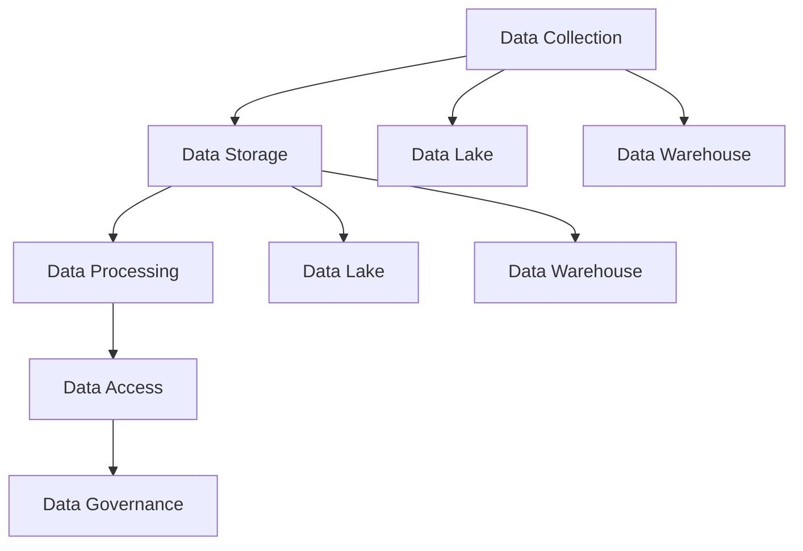

                 

### 背景介绍（Background Introduction）

随着人工智能（AI）技术的不断进步，越来越多的初创公司开始将AI技术应用于各种领域，如自动驾驶、智能家居、智能医疗等。在这些应用中，数据管理成为了一个至关重要的环节。有效的数据管理不仅能提高AI模型的学习效率，还能确保模型的准确性和可靠性。

#### 人工智能在初创公司的应用

人工智能技术在初创公司中的应用场景多种多样。以下是一些常见的应用领域：

1. **自动驾驶**：自动驾驶技术依赖于大量数据来训练模型，包括路况数据、车辆行为数据等。初创公司需要有效地管理这些数据，以确保模型能够准确判断道路状况和驾驶行为。
2. **智能家居**：智能家居设备通过收集用户的生活数据来提供个性化的服务，如调整室内温度、推荐家电使用模式等。初创公司需要处理大量的用户数据，并确保数据的安全性。
3. **智能医疗**：智能医疗应用如疾病预测、诊断辅助等，也需要处理大量的医疗数据。初创公司需要确保数据的质量和准确性，以便开发出有效的医疗模型。

#### 数据管理的重要性

在人工智能初创公司中，数据管理至关重要。以下是一些原因：

1. **模型训练效率**：有效的数据管理可以提高模型训练的效率。例如，通过数据清洗和预处理，可以减少噪声数据的影响，提高模型的学习效果。
2. **模型准确性**：数据质量直接影响模型的准确性。一个高质量的模型需要高质量的数据作为支撑。因此，初创公司需要确保数据的质量和完整性。
3. **数据安全性**：随着数据的日益增加，数据安全成为一个重要问题。初创公司需要采取有效的数据安全管理措施，以防止数据泄露和滥用。

#### 数据管理的挑战

尽管数据管理对于人工智能初创公司至关重要，但同时也面临着一些挑战：

1. **数据规模**：随着数据量的不断增加，初创公司需要处理海量数据。这要求他们采用高效的数据存储和管理技术。
2. **数据多样性**：人工智能应用场景的多样性意味着初创公司需要处理不同类型的数据，如结构化数据、非结构化数据等。这增加了数据管理的复杂性。
3. **数据隐私**：在处理用户数据时，初创公司需要遵守相关法律法规，确保用户隐私不被泄露。

#### 本篇文章的目的

本文旨在探讨人工智能初创公司在数据管理方面面临的挑战，并提出相应的解决方案。通过本文，读者可以了解以下内容：

1. **数据管理的重要性**：为什么数据管理对于人工智能初创公司至关重要。
2. **数据管理的关键环节**：如何有效地管理数据，包括数据收集、存储、处理和分析。
3. **解决方案**：针对不同场景，提出具体的数据管理解决方案，包括数据存储技术、数据清洗和预处理方法、数据安全和隐私保护措施等。

通过对本文的阅读，读者将能够更好地理解数据管理在人工智能初创公司中的重要性，以及如何应对数据管理中的挑战。

### Background Introduction

With the continuous advancement of artificial intelligence (AI) technology, an increasing number of startups are adopting AI technologies across various domains, such as autonomous driving, smart homes, and intelligent healthcare. In these applications, data management becomes a crucial aspect. Effective data management not only improves the learning efficiency of AI models but also ensures their accuracy and reliability.

#### Applications of AI in Startups

AI technologies are applied in various fields within startups, including:

1. **Autonomous Driving**: Autonomous driving technology relies on a vast amount of data for training models, including road condition data and vehicle behavior data. Startups need to effectively manage these data to ensure that models can accurately judge road conditions and driving behaviors.

2. **Smart Homes**: Smart home devices collect user data to provide personalized services, such as adjusting indoor temperatures and recommending appliance usage patterns. Startups need to handle a significant amount of user data while ensuring data security.

3. **Intelligent Healthcare**: Applications such as disease prediction and diagnostic assistance require processing a large amount of medical data. Startups need to ensure the quality and accuracy of data to develop effective medical models.

#### Importance of Data Management

Data management is crucial for AI startups for the following reasons:

1. **Model Training Efficiency**: Effective data management improves the efficiency of model training. For example, data cleaning and preprocessing can reduce the impact of noisy data, enhancing the learning effectiveness of models.

2. **Model Accuracy**: The quality of data directly affects the accuracy of models. A high-quality model requires high-quality data as a foundation. Therefore, startups need to ensure the quality and integrity of data.

3. **Data Security**: With the increasing volume of data, data security becomes a significant concern. Startups need to implement effective data security measures to prevent data breaches and misuse.

#### Challenges in Data Management

Despite its importance, data management in AI startups faces several challenges:

1. **Data Scale**: As the volume of data continues to increase, startups need to handle massive data. This requires them to adopt efficient data storage and management technologies.

2. **Data Diversity**: The diversity of AI application scenarios means that startups need to handle different types of data, such as structured and unstructured data. This increases the complexity of data management.

3. **Data Privacy**: When handling user data, startups need to comply with relevant regulations to ensure that user privacy is not compromised.

#### Purpose of This Article

This article aims to explore the challenges faced by AI startups in data management and propose corresponding solutions. Through this article, readers can gain the following insights:

1. **Importance of Data Management**: Why data management is critical for AI startups.

2. **Key Aspects of Data Management**: How to effectively manage data, including data collection, storage, processing, and analysis.

3. **Solutions**: Propose specific data management solutions for different scenarios, including data storage technologies, data cleaning and preprocessing methods, data security, and privacy protection measures.

By reading this article, readers will be able to better understand the importance of data management in AI startups and how to address the challenges in data management.

<|assistant|>### 核心概念与联系（Core Concepts and Connections）

在讨论数据管理时，我们首先需要明确几个核心概念：数据湖（Data Lake）、数据仓库（Data Warehouse）、数据流（Data Flow）和数据治理（Data Governance）。这些概念在数据管理中起着至关重要的作用，它们不仅相互关联，还共同构成了一个复杂而庞大的数据管理体系。

#### 数据湖（Data Lake）

数据湖是一个用于存储大量数据（包括结构化、半结构化和非结构化数据）的分布式存储系统。与传统的关系数据库不同，数据湖不要求数据在存储之前进行结构化。这意味着初创公司可以首先将所有数据存储到数据湖中，然后在需要时进行数据清洗、转换和建模。

#### 数据仓库（Data Warehouse）

数据仓库是一个用于存储和管理结构化数据的系统，通常用于支持企业的决策支持系统（DSS）和业务智能（BI）应用。数据仓库中的数据通常经过清洗、转换和集成，以支持复杂的查询和分析。

#### 数据流（Data Flow）

数据流是指数据在系统中流动的过程，包括数据的收集、传输、处理和存储。数据流确保了数据在正确的时机到达正确的位置，并确保数据的质量和完整性。

#### 数据治理（Data Governance）

数据治理是指一套策略、标准和流程，用于确保数据的质量、可用性和安全性。数据治理涉及到数据管理的各个方面，包括数据所有权、数据访问权限、数据备份和恢复等。

#### 数据管理体系的架构（Architecture）

数据管理体系的架构通常包括以下层级：

1. **数据采集层**：负责收集各种来源的数据，包括内部数据库、外部API、日志文件等。
2. **数据存储层**：包括数据湖和数据仓库，用于存储和管理数据。
3. **数据处理层**：负责对数据进行清洗、转换和建模，以支持进一步的分析和应用。
4. **数据访问层**：提供数据查询和分析接口，支持用户访问和使用数据。
5. **数据治理层**：确保数据的质量、可用性和安全性，包括数据所有权、访问权限、数据备份和恢复等。

#### Mermaid 流程图（Mermaid Flowchart）

以下是一个简化的数据管理体系流程图，使用Mermaid语法绘制：



在这个流程图中，数据从数据采集层进入数据存储层，然后通过数据处理层进行清洗、转换和建模，最后通过数据访问层供用户查询和使用。数据治理层确保整个数据管理体系的质量、可用性和安全性。

通过理解这些核心概念和它们之间的联系，我们可以更好地设计和实施数据管理解决方案，以满足人工智能初创公司的需求。

### Core Concepts and Connections

When discussing data management, it's essential to first clarify several core concepts: data lake, data warehouse, data flow, and data governance. These concepts play a crucial role in data management and are interconnected, forming a complex and vast data management system.

#### Data Lake

A data lake is a distributed storage system designed to store large amounts of data (including structured, semi-structured, and unstructured data). Unlike traditional relational databases, a data lake does not require data to be structured before storage. This means startups can initially store all their data in a data lake and then clean, transform, and model it as needed.

#### Data Warehouse

A data warehouse is a system for storing and managing structured data, typically used to support enterprise decision support systems (DSS) and business intelligence (BI) applications. Data in a data warehouse is usually cleaned, transformed, and integrated to support complex queries and analysis.

#### Data Flow

Data flow refers to the process in which data moves through a system, including data collection, transmission, processing, and storage. Data flow ensures that data arrives at the correct location at the right time, while maintaining data quality and integrity.

#### Data Governance

Data governance is a set of strategies, standards, and processes designed to ensure data quality, accessibility, and security. Data governance encompasses various aspects of data management, including data ownership, access permissions, data backup, and recovery.

#### Architecture of Data Management System

The architecture of a data management system typically includes the following tiers:

1. **Data Collection Layer**: Responsible for collecting data from various sources, including internal databases, external APIs, log files, etc.

2. **Data Storage Layer**: Includes data lakes and data warehouses for storing and managing data.

3. **Data Processing Layer**: Responsible for cleaning, transforming, and modeling data to support further analysis and applications.

4. **Data Access Layer**: Provides data query and analysis interfaces for users to access and use data.

5. **Data Governance Layer**: Ensures data quality, accessibility, and security, including data ownership, access permissions, data backup, and recovery.

#### Mermaid Flowchart

The following is a simplified flowchart of a data management system architecture, drawn using Mermaid syntax:


In this flowchart, data enters the data storage layer from the data collection layer, then passes through the data processing layer for cleaning, transformation, and modeling, and finally reaches the data access layer for user queries and use. The data governance layer ensures the quality, accessibility, and security of the entire data management system.

By understanding these core concepts and their interconnections, we can better design and implement data management solutions to meet the needs of AI startups. <|im_sep|>

### 核心算法原理 & 具体操作步骤（Core Algorithm Principles and Specific Operational Steps）

在数据管理中，核心算法的选择和实现是确保数据高效、准确处理的关键。本文将介绍一种基于机器学习的数据管理算法——K-Means聚类算法，以及其实施的具体操作步骤。

#### K-Means聚类算法原理

K-Means是一种基于距离度量的聚类算法，其目标是将数据集划分为K个簇，使得同一个簇内的数据点之间的距离最小，而不同簇之间的数据点之间的距离最大。算法的主要步骤如下：

1. **初始化**：随机选择K个数据点作为初始聚类中心。
2. **分配**：对于每个数据点，计算其与所有聚类中心的距离，并将其分配到最近的聚类中心所代表的簇中。
3. **更新**：重新计算每个簇的中心点，即簇内所有数据点的均值。
4. **迭代**：重复步骤2和步骤3，直到聚类中心不再发生变化或者达到预定的迭代次数。

#### 实施步骤

1. **数据预处理**：首先，对数据进行清洗和预处理，包括去除缺失值、异常值和重复值，以及特征工程等。
    ```mermaid
    graph TB
        A[Data Preprocessing]
        A --> B[Data Cleaning]
        B --> C[Feature Engineering]
    ```

2. **选择聚类数K**：根据数据的分布特征，选择一个合适的聚类数K。常用的方法有肘部法则（Elbow Method）、轮廓系数法（Silhouette Coefficient）等。
    ```mermaid
    graph TB
        D[Choose K]
        D --> E[Elbow Method]
        D --> F[Silhouette Coefficient]
    ```

3. **初始化聚类中心**：随机选择K个数据点作为初始聚类中心。
    ```mermaid
    graph TB
        G[Initialize Cluster Centers]
        G --> H[Randomly Select K Data Points]
    ```

4. **分配数据点**：对于每个数据点，计算其与所有聚类中心的距离，并将其分配到最近的聚类中心所代表的簇中。
    ```mermaid
    graph TB
        I[Assign Data Points]
        I --> J[Calculate Distances]
        J --> K[Allocate to Nearest Cluster Center]
    ```

5. **更新聚类中心**：重新计算每个簇的中心点，即簇内所有数据点的均值。
    ```mermaid
    graph TB
        L[Update Cluster Centers]
        L --> M[Calculate Mean of Cluster Data Points]
    ```

6. **迭代**：重复步骤4和步骤5，直到聚类中心不再发生变化或者达到预定的迭代次数。
    ```mermaid
    graph TB
        N[Iterate]
        N --> O[Repeat Steps 4 and 5]
        O --> P[Stop if Clusters Do Not Change or Reach Max Iterations]
    ```

通过以上步骤，我们可以实现K-Means聚类算法，对数据进行有效的分组和管理。

### Core Algorithm Principles and Specific Operational Steps

In data management, the selection and implementation of core algorithms are crucial for efficient and accurate data processing. This section introduces a machine learning-based data management algorithm, the K-Means clustering algorithm, and its specific operational steps.

#### K-Means Clustering Algorithm Principles

K-Means is a clustering algorithm based on distance metrics, whose goal is to divide a dataset into K clusters such that the intra-cluster distance (i.e., the distance between data points within a cluster) is minimized, while the inter-cluster distance (i.e., the distance between data points from different clusters) is maximized. The main steps of the algorithm are as follows:

1. **Initialization**: Randomly select K data points as the initial cluster centers.
2. **Assignment**: For each data point, calculate the distance to all cluster centers and assign it to the nearest cluster center.
3. **Update**: Recompute the center of each cluster, which is the mean of all data points in the cluster.
4. **Iteration**: Repeat steps 2 and 3 until the cluster centers no longer change or the maximum number of iterations is reached.

#### Operational Steps

1. **Data Preprocessing**: First, clean and preprocess the data, including removing missing values, outliers, and duplicates, as well as feature engineering.
   ```mermaid
   graph TB
       A[Data Preprocessing]
       A --> B[Data Cleaning]
       B --> C[Feature Engineering]
   ```

2. **Choose the Number of Clusters K**: According to the distribution characteristics of the data, select an appropriate number of clusters K. Common methods include the Elbow Method and the Silhouette Coefficient.
   ```mermaid
   graph TB
       D[Choose K]
       D --> E[Elbow Method]
       D --> F[Silhouette Coefficient]
   ```

3. **Initialize Cluster Centers**: Randomly select K data points as initial cluster centers.
   ```mermaid
   graph TB
       G[Initialize Cluster Centers]
       G --> H[Randomly Select K Data Points]
   ```

4. **Assign Data Points**: For each data point, calculate the distance to all cluster centers and assign it to the nearest cluster center.
   ```mermaid
   graph TB
       I[Assign Data Points]
       I --> J[Calculate Distances]
       J --> K[Allocate to Nearest Cluster Center]
   ```

5. **Update Cluster Centers**: Recompute the center of each cluster, which is the mean of all data points in the cluster.
   ```mermaid
   graph TB
       L[Update Cluster Centers]
       L --> M[Calculate Mean of Cluster Data Points]
   ```

6. **Iteration**: Repeat steps 4 and 5 until the cluster centers no longer change or the maximum number of iterations is reached.
   ```mermaid
   graph TB
       N[Iterate]
       N --> O[Repeat Steps 4 and 5]
       O --> P[Stop if Clusters Do Not Change or Reach Max Iterations]
   ```

By following these steps, we can implement the K-Means clustering algorithm to effectively group and manage data.

### 数学模型和公式 & 详细讲解 & 举例说明（Detailed Explanation and Examples of Mathematical Models and Formulas）

在数据管理中，数学模型和公式扮演着至关重要的角色。它们不仅用于描述和解释数据之间的关系，还用于指导算法的设计和实现。本文将介绍几种常用的数学模型和公式，并详细讲解其含义和用法。

#### 欧氏距离（Euclidean Distance）

欧氏距离是一种常用的距离度量，用于计算两个数据点之间的距离。其数学公式为：

$$
d(p_1, p_2) = \sqrt{\sum_{i=1}^{n}(p_{1i} - p_{2i})^2}
$$

其中，$p_1$ 和 $p_2$ 是两个数据点，$n$ 是数据点的维度。$d(p_1, p_2)$ 的值越小，表示两个数据点越接近。

#### 示例

假设有两个数据点 $p_1 = (1, 2)$ 和 $p_2 = (4, 6)$，我们可以计算它们之间的欧氏距离：

$$
d(p_1, p_2) = \sqrt{(1 - 4)^2 + (2 - 6)^2} = \sqrt{9 + 16} = \sqrt{25} = 5
$$

因此，$p_1$ 和 $p_2$ 之间的距离为5。

#### 修正的欧氏距离（Modified Euclidean Distance）

修正的欧氏距离是在欧氏距离的基础上，对每个维度进行权重调整。其公式为：

$$
d_m(p_1, p_2) = \sqrt{\sum_{i=1}^{n}w_i(p_{1i} - p_{2i})^2}
$$

其中，$w_i$ 是第 $i$ 个维度的权重。权重可以根据数据的特性进行分配，例如，对于分类问题，可以将权重分配给具有更高分类价值的特征。

#### 示例

假设有两个数据点 $p_1 = (1, 2)$ 和 $p_2 = (4, 6)$，以及权重 $w_1 = 0.5$ 和 $w_2 = 1.5$，我们可以计算它们之间的修正的欧氏距离：

$$
d_m(p_1, p_2) = \sqrt{0.5(1 - 4)^2 + 1.5(2 - 6)^2} = \sqrt{0.5 \cdot 9 + 1.5 \cdot 16} = \sqrt{4.5 + 24} = \sqrt{28.5} \approx 5.33
$$

因此，$p_1$ 和 $p_2$ 之间的修正的欧氏距离约为5.33。

#### 算法性能评估指标（Algorithm Performance Metrics）

在数据管理中，评估算法的性能是至关重要的一步。常用的性能评估指标包括准确率（Accuracy）、召回率（Recall）和F1分数（F1 Score）。

- **准确率**：准确率是正确分类的样本数占总样本数的比例。其公式为：

  $$
  Accuracy = \frac{TP + TN}{TP + TN + FP + FN}
  $$

  其中，$TP$ 是真正例，$TN$ 是真负例，$FP$ 是假正例，$FN$ 是假负例。

- **召回率**：召回率是真正例中被正确分类的样本数与所有真正例的比例。其公式为：

  $$
  Recall = \frac{TP}{TP + FN}
  $$

- **F1分数**：F1分数是准确率和召回率的调和平均数。其公式为：

  $$
  F1 Score = 2 \times \frac{Precision \times Recall}{Precision + Recall}
  $$

  其中，$Precision$ 是精确率，即正确分类的样本数与所有被分类为正样本的样本数的比例。

#### 示例

假设有一个分类问题，其中我们有10个样本，其中6个是真正例，2个是假正例，3个是假负例，1个是假正例。我们可以计算以下性能指标：

- **准确率**：

  $$
  Accuracy = \frac{6 + 4}{6 + 4 + 2 + 3} = \frac{10}{15} = 0.67
  $$

- **召回率**：

  $$
  Recall = \frac{6}{6 + 3} = \frac{6}{9} = 0.67
  $$

- **F1分数**：

  $$
  F1 Score = 2 \times \frac{0.6 \times 0.67}{0.6 + 0.67} = 0.665
  $$

通过这些数学模型和公式，我们可以更深入地理解数据管理中的算法原理，并有效地评估算法的性能。

### Mathematical Models and Formulas & Detailed Explanation & Examples

In data management, mathematical models and formulas play a crucial role in describing and explaining the relationships between data and guiding the design and implementation of algorithms. This section introduces several commonly used mathematical models and formulas, along with detailed explanations and examples.

#### Euclidean Distance

Euclidean distance is a commonly used metric for measuring the distance between two data points. The mathematical formula for Euclidean distance is:

$$
d(p_1, p_2) = \sqrt{\sum_{i=1}^{n}(p_{1i} - p_{2i})^2}
$$

where $p_1$ and $p_2$ are two data points, and $n$ is the dimension of the data points. The smaller the value of $d(p_1, p_2)$, the closer the two data points are.

#### Example

Suppose we have two data points $p_1 = (1, 2)$ and $p_2 = (4, 6)$. We can calculate the Euclidean distance between them:

$$
d(p_1, p_2) = \sqrt{(1 - 4)^2 + (2 - 6)^2} = \sqrt{9 + 16} = \sqrt{25} = 5
$$

Therefore, the distance between $p_1$ and $p_2$ is 5.

#### Modified Euclidean Distance

Modified Euclidean distance is a variant of Euclidean distance that adjusts each dimension based on a weight. The formula for modified Euclidean distance is:

$$
d_m(p_1, p_2) = \sqrt{\sum_{i=1}^{n}w_i(p_{1i} - p_{2i})^2}
$$

where $w_i$ is the weight of the $i$-th dimension. The weights can be allocated based on the characteristics of the data, such as assigning higher weights to features with higher classification value in a classification problem.

#### Example

Suppose we have two data points $p_1 = (1, 2)$ and $p_2 = (4, 6)$, and weights $w_1 = 0.5$ and $w_2 = 1.5$. We can calculate the modified Euclidean distance between them:

$$
d_m(p_1, p_2) = \sqrt{0.5(1 - 4)^2 + 1.5(2 - 6)^2} = \sqrt{0.5 \cdot 9 + 1.5 \cdot 16} = \sqrt{4.5 + 24} = \sqrt{28.5} \approx 5.33
$$

Therefore, the modified Euclidean distance between $p_1$ and $p_2$ is approximately 5.33.

#### Algorithm Performance Metrics

In data management, evaluating the performance of algorithms is a critical step. Common performance metrics include accuracy, recall, and F1 score.

- **Accuracy**: Accuracy is the proportion of correctly classified instances out of the total number of instances. The formula for accuracy is:

  $$
  Accuracy = \frac{TP + TN}{TP + TN + FP + FN}
  $$

  where $TP$ is true positive, $TN$ is true negative, $FP$ is false positive, and $FN$ is false negative.

- **Recall**: Recall is the proportion of true positive instances that are correctly classified out of all true positive instances. The formula for recall is:

  $$
  Recall = \frac{TP}{TP + FN}
  $$

- **F1 Score**: F1 score is the harmonic mean of accuracy and recall. The formula for F1 score is:

  $$
  F1 Score = 2 \times \frac{Precision \times Recall}{Precision + Recall}
  $$

  where $Precision$ is the precision rate, which is the proportion of correctly classified instances out of all instances classified as positive.

#### Example

Suppose we have a classification problem with 10 instances, where 6 are true positives, 2 are false positives, 3 are false negatives, and 1 is a false positive. We can calculate the following performance metrics:

- **Accuracy**:

  $$
  Accuracy = \frac{6 + 4}{6 + 4 + 2 + 3} = \frac{10}{15} = 0.67
  $$

- **Recall**:

  $$
  Recall = \frac{6}{6 + 3} = \frac{6}{9} = 0.67
  $$

- **F1 Score**:

  $$
  F1 Score = 2 \times \frac{0.6 \times 0.67}{0.6 + 0.67} = 0.665
  $$

By understanding these mathematical models and formulas, we can gain a deeper understanding of the principles of algorithms in data management and effectively evaluate the performance of algorithms.

### 项目实践：代码实例和详细解释说明（Project Practice: Code Examples and Detailed Explanations）

在本节中，我们将通过一个实际项目实例来展示如何使用Python实现K-Means聚类算法，并对代码进行详细解释。该项目旨在使用K-Means算法对一组二维数据点进行聚类，并展示每个步骤的具体操作。

#### 1. 开发环境搭建

在开始编写代码之前，我们需要搭建一个Python开发环境。以下是所需的环境和步骤：

- **Python版本**：3.8或更高版本
- **依赖库**：NumPy、Matplotlib、Sklearn

安装步骤：

```bash
pip install numpy matplotlib sklearn
```

#### 2. 源代码详细实现

以下是K-Means聚类算法的实现代码：

```python
import numpy as np
import matplotlib.pyplot as plt
from sklearn.cluster import KMeans

# 生成数据集
np.random.seed(0)
data = np.random.rand(100, 2)

# 初始化KMeans模型
kmeans = KMeans(n_clusters=3, random_state=0)

# 训练模型
kmeans.fit(data)

# 获取聚类结果
labels = kmeans.predict(data)
centroids = kmeans.cluster_centers_

# 绘制聚类结果
plt.figure(figsize=(8, 6))
colors = ['r', 'g', 'b']
for i in range(3):
    plt.scatter(data[labels == i, 0], data[labels == i, 1], s=100, c=colors[i], label=f'Cluster {i}')
plt.scatter(centroids[:, 0], centroids[:, 1], s=300, c='yellow', marker='s', label='Centroids')
plt.title('K-Means Clustering')
plt.xlabel('Feature 1')
plt.ylabel('Feature 2')
plt.legend()
plt.show()
```

#### 3. 代码解读与分析

以下是代码的逐行解读与分析：

```python
import numpy as np
import matplotlib.pyplot as plt
from sklearn.cluster import KMeans

# 生成数据集
np.random.seed(0)
data = np.random.rand(100, 2)
```

- **numpy**：用于生成随机数据集。
- **matplotlib.pyplot**：用于绘制聚类结果。
- **KMeans**：Sklearn中的KMeans聚类算法实现。

```python
kmeans = KMeans(n_clusters=3, random_state=0)
kmeans.fit(data)
```

- **KMeans(n_clusters=3, random_state=0)**：创建一个KMeans对象，指定聚类数量为3，设置随机种子以确保结果可重复。
- **fit(data)**：训练模型，将数据集传递给KMeans对象。

```python
labels = kmeans.predict(data)
centroids = kmeans.cluster_centers_
```

- **predict(data)**：使用训练好的模型对数据进行预测，返回每个数据点的簇标签。
- **cluster_centers_**：获取每个簇的中心点。

```python
plt.figure(figsize=(8, 6))
colors = ['r', 'g', 'b']
```

- **plt.figure(figsize=(8, 6))**：创建一个图形窗口，设置大小。
- **colors**：定义簇的颜色。

```python
for i in range(3):
    plt.scatter(data[labels == i, 0], data[labels == i, 1], s=100, c=colors[i], label=f'Cluster {i}')
plt.scatter(centroids[:, 0], centroids[:, 1], s=300, c='yellow', marker='s', label='Centroids')
```

- **plt.scatter**：绘制每个簇的数据点和簇中心点。
- **s**：设置标记大小。
- **c**：设置标记颜色。
- **marker**：设置标记形状。

```python
plt.title('K-Means Clustering')
plt.xlabel('Feature 1')
plt.ylabel('Feature 2')
plt.legend()
plt.show()
```

- **plt.title**：设置图形标题。
- **plt.xlabel** 和 **plt.ylabel**：设置X轴和Y轴标签。
- **plt.legend**：显示图例。
- **plt.show**：显示图形。

#### 4. 运行结果展示

运行上述代码后，我们将看到一个包含三个簇的散点图，每个簇的中心点用黄色星形标记表示。簇内的数据点颜色相同，簇与簇之间的颜色不同，从而帮助我们直观地了解K-Means算法对数据的聚类结果。

#### Conclusion

通过以上项目实践，我们展示了如何使用Python和Sklearn库实现K-Means聚类算法，并对其代码进行了详细解释。这个实例帮助我们理解了K-Means算法的基本原理和实际应用，为进一步探索数据管理和机器学习提供了实践基础。

### Project Practice: Code Examples and Detailed Explanations

In this section, we will demonstrate the implementation of the K-Means clustering algorithm in Python through a practical project example, along with a detailed explanation of the code.

#### 1. Setup Development Environment

Before writing the code, we need to set up a Python development environment. Here are the required environments and steps:

- **Python Version**: Version 3.8 or higher
- **Dependencies**: NumPy, Matplotlib, Sklearn

Installation steps:

```bash
pip install numpy matplotlib sklearn
```

#### 2. Detailed Implementation of Source Code

Here is the code to implement the K-Means clustering algorithm:

```python
import numpy as np
import matplotlib.pyplot as plt
from sklearn.cluster import KMeans

# Generate dataset
np.random.seed(0)
data = np.random.rand(100, 2)

# Initialize KMeans model
kmeans = KMeans(n_clusters=3, random_state=0)

# Train model
kmeans.fit(data)

# Get clustering results
labels = kmeans.predict(data)
centroids = kmeans.cluster_centers_

# Plot clustering results
plt.figure(figsize=(8, 6))
colors = ['r', 'g', 'b']
for i in range(3):
    plt.scatter(data[labels == i, 0], data[labels == i, 1], s=100, c=colors[i], label=f'Cluster {i}')
plt.scatter(centroids[:, 0], centroids[:, 1], s=300, c='yellow', marker='s', label='Centroids')
plt.title('K-Means Clustering')
plt.xlabel('Feature 1')
plt.ylabel('Feature 2')
plt.legend()
plt.show()
```

#### 3. Code Explanation and Analysis

Here is a line-by-line explanation and analysis of the code:

```python
import numpy as np
import matplotlib.pyplot as plt
from sklearn.cluster import KMeans

# Generate dataset
np.random.seed(0)
data = np.random.rand(100, 2)
```

- **NumPy**: Used to generate random datasets.
- **Matplotlib.pyplot**: Used to visualize the clustering results.
- **KMeans**: Implementation of the K-Means clustering algorithm in the Sklearn library.

```python
kmeans = KMeans(n_clusters=3, random_state=0)
kmeans.fit(data)
```

- **KMeans(n_clusters=3, random_state=0)**: Create a KMeans object with 3 clusters and a fixed random seed for reproducibility.
- **fit(data)**: Train the model with the dataset passed to the KMeans object.

```python
labels = kmeans.predict(data)
centroids = kmeans.cluster_centers_
```

- **predict(data)**: Use the trained model to predict the cluster labels for the dataset.
- **cluster_centers_**: Retrieve the cluster centers.

```python
plt.figure(figsize=(8, 6))
colors = ['r', 'g', 'b']
```

- **plt.figure(figsize=(8, 6))** : Create a plotting window with a specified size.
- **colors**: Define the color for each cluster.

```python
for i in range(3):
    plt.scatter(data[labels == i, 0], data[labels == i, 1], s=100, c=colors[i], label=f'Cluster {i}')
plt.scatter(centroids[:, 0], centroids[:, 1], s=300, c='yellow', marker='s', label='Centroids')
```

- **plt.scatter** : Plot the data points for each cluster.
- **s** : Set the marker size.
- **c** : Set the marker color.
- **marker** : Set the marker shape.

```python
plt.title('K-Means Clustering')
plt.xlabel('Feature 1')
plt.ylabel('Feature 2')
plt.legend()
plt.show()
```

- **plt.title** : Set the plot title.
- **plt.xlabel** and **plt.ylabel** : Set the labels for the x-axis and y-axis.
- **plt.legend** : Display the legend.
- **plt.show** : Display the plot.

#### 4. Result Display

After running the above code, a scatter plot displaying three clusters will be shown. The cluster centers are marked with yellow star shapes. Data points within the same cluster are colored the same, and different clusters are colored differently, providing a clear visual understanding of the clustering results produced by the K-Means algorithm.

#### Conclusion

Through this practical project, we demonstrated how to implement the K-Means clustering algorithm in Python using the Sklearn library and provided a detailed explanation of the code. This example helps us understand the basic principles and practical applications of K-Means clustering, providing a practical foundation for further exploration into data management and machine learning.

### 实际应用场景（Practical Application Scenarios）

数据管理解决方案在人工智能初创公司的实际应用场景中至关重要。以下是一些具体的应用场景：

#### 1. 自动驾驶

自动驾驶技术依赖大量的数据，包括车辆传感器数据、道路信息、交通状况等。有效的数据管理可以确保这些数据得到及时、准确的处理，从而提高自动驾驶系统的性能和安全性。例如，K-Means聚类算法可以用于道路分段分类，帮助自动驾驶车辆更好地理解道路结构。

#### 2. 智能医疗

智能医疗应用如疾病预测和诊断辅助需要处理大量的医疗数据。数据管理解决方案可以确保这些数据得到有效清洗、转换和存储，以便医生和算法能够快速访问和分析。例如，数据治理策略可以确保患者隐私得到保护，同时提高数据的可用性和完整性。

#### 3. 智能家居

智能家居设备收集用户的生活数据，如使用习惯、偏好等，以提供个性化的服务。有效的数据管理可以确保这些数据得到合理处理，从而提高用户体验。例如，使用K-Means聚类算法可以识别用户的行为模式，帮助智能家居系统提供更个性化的建议。

#### 4. 营销分析

初创公司在进行市场推广和产品定位时，需要处理大量的用户数据和市场数据。有效的数据管理可以帮助公司更好地了解用户需求和市场趋势，从而制定更有效的营销策略。例如，使用数据流处理技术可以实时分析用户行为，快速响应市场变化。

#### 5. 风险管理

人工智能在金融领域的应用，如信用评分和风险预测，也需要有效的数据管理。数据管理解决方案可以确保金融数据的质量和准确性，从而提高风险模型的可靠性。例如，使用机器学习算法对用户行为进行分析，可以预测潜在的风险，帮助金融机构采取预防措施。

这些应用场景展示了数据管理解决方案在人工智能初创公司中的重要性。通过有效的数据管理，初创公司可以更好地利用数据，提高业务效率，实现商业目标。

### Practical Application Scenarios

Data management solutions are crucial in real-world applications for AI startups. Here are some specific application scenarios:

#### 1. Autonomous Driving

Autonomous driving technology relies on a vast amount of data, including sensor data from vehicles, road information, and traffic conditions. Effective data management ensures these data are processed timely and accurately, thereby enhancing the performance and safety of autonomous vehicles. For example, the K-Means clustering algorithm can be used for road segment classification, helping autonomous vehicles better understand road structures.

#### 2. Intelligent Healthcare

Intelligent healthcare applications, such as disease prediction and diagnostic assistance, require processing a large amount of medical data. Effective data management ensures these data are cleaned, transformed, and stored efficiently, enabling doctors and algorithms to quickly access and analyze them. For instance, data governance strategies can ensure patient privacy is protected while improving data accessibility and integrity.

#### 3. Smart Homes

Smart home devices collect user data, such as usage habits and preferences, to provide personalized services. Effective data management ensures these data are appropriately processed, thereby enhancing user experience. For example, using the K-Means clustering algorithm can identify user behavior patterns, helping smart home systems provide more personalized recommendations.

#### 4. Marketing Analysis

Startups in the marketing sector need to handle a significant amount of user data and market data to understand customer needs and market trends, thereby crafting effective marketing strategies. Effective data management helps companies leverage data to improve operational efficiency and achieve business goals. For example, using data stream processing technologies can enable real-time analysis of user behavior, quickly responding to market changes.

#### 5. Risk Management

In the financial sector, AI applications like credit scoring and risk prediction require effective data management to ensure the quality and accuracy of financial data, thereby improving the reliability of risk models. For example, analyzing user behavior with machine learning algorithms can predict potential risks, helping financial institutions take preventive measures.

These application scenarios demonstrate the importance of data management solutions in AI startups. By effectively managing data, startups can better utilize their data resources, improve operational efficiency, and achieve their business objectives.

### 工具和资源推荐（Tools and Resources Recommendations）

在数据管理领域，有许多优秀的工具和资源可以帮助人工智能初创公司提高数据管理的效率和质量。以下是一些推荐的工具、书籍、论文和网站，供读者参考：

#### 1. 学习资源推荐

- **书籍**：
  - 《数据科学入门》
    作者：杰里米·吉恩斯
    简介：适合初学者的数据科学入门书籍，涵盖了数据预处理、统计分析、机器学习等基础知识。
  - 《Python数据科学手册》
    作者：杰克·范·德·沃特
    简介：详细介绍了Python在数据科学中的应用，包括数据处理、数据可视化、机器学习等。

- **论文**：
  - “Big Data: A Revolution That Will Transform How We Live, Work, and Think”
    作者：Viktor Mayer-Schönberger 和 Kenneth Cukier
    简介：探讨大数据对社会和经济的影响，以及数据管理的重要性。
  - “Data Science for Business: What you need to know about data mining and data-analytic thinking”
    作者：Joann Campana 和 Bill Schmarzo
    简介：介绍数据科学在企业中的应用，包括数据管理、数据分析、数据可视化等。

- **网站**：
  - [Kaggle](https://www.kaggle.com/)
    简介：一个大数据竞赛和数据分析平台，提供大量数据集和竞赛项目，适合实践和学习。
  - [DataCamp](https://www.datacamp.com/)
    简介：提供在线的数据科学课程，包括Python、R语言、数据预处理、机器学习等。

#### 2. 开发工具框架推荐

- **数据存储和管理**：
  - [Hadoop](https://hadoop.apache.org/)
    简介：一个分布式数据存储和处理框架，适用于大规模数据存储和管理。
  - [Apache Spark](https://spark.apache.org/)
    简介：一个快速通用的数据处理引擎，适用于大数据分析、机器学习和数据流处理。

- **数据处理和分析**：
  - [Pandas](https://pandas.pydata.org/)
    简介：一个Python数据处理库，适用于数据清洗、转换和分析。
  - [NumPy](https://numpy.org/)
    简介：一个Python数值计算库，提供高效的数组操作和数学函数。

- **数据可视化**：
  - [Matplotlib](https://matplotlib.org/)
    简介：一个Python数据可视化库，适用于创建高质量图表和图形。
  - [Seaborn](https://seaborn.pydata.org/)
    简介：基于Matplotlib的一个高级数据可视化库，提供多种图表样式和统计图表。

#### 3. 相关论文著作推荐

- **“The Data-Driven Organization: How Big Data and Data Analytics Are Changing the Game”
  作者：Thomas H. Davenport 和 Julia Patterson
  简介：探讨数据驱动组织的重要性，以及如何利用大数据和数据分析来提升企业的竞争力。

- **“Data Science for Business: Identifying Opportunities, Measuring Results, and Delivering Business Value”
  作者：Thomas H. Davenport 和 Jinho Kim
  简介：详细介绍数据科学在企业中的应用，以及如何实现数据驱动的决策和业务价值。

通过这些工具和资源，人工智能初创公司可以更好地管理数据，提高数据分析的效率和质量，从而在竞争激烈的市场中脱颖而出。

### Tools and Resources Recommendations

In the field of data management, there are numerous excellent tools and resources that can help AI startups improve the efficiency and quality of data management. Here are some recommended tools, books, papers, and websites for readers to consider:

#### 1. Learning Resources

- **Books**:
  - "Data Science from Scratch"
    Author: Joel Grus
    Description: A beginner-friendly book on data science that covers data preprocessing, statistical analysis, and machine learning basics.
  - "Python Data Science Handbook"
    Author: Jake VanderPlas
    Description: A detailed guide to using Python for data science, including data handling, visualization, and machine learning.

- **Papers**:
  - “Big Data: A Revolution That Will Transform How We Live, Work, and Think”
    Authors: Viktor Mayer-Schönberger and Kenneth Cukier
    Description: Discusses the impact of big data on society and the economy, as well as the importance of data management.
  - “Data Science for Business: What you need to know about data mining and data-analytic thinking”
    Authors: Joann Campana and Bill Schmarzo
    Description: Introduces data science in a business context, including data management, data analysis, and data visualization.

- **Websites**:
  - [Kaggle](https://www.kaggle.com/)
    Description: A platform for data science competitions and projects, offering a wealth of datasets and real-world challenges.
  - [DataCamp](https://www.datacamp.com/)
    Description: Online courses in data science, covering Python, R, data preprocessing, machine learning, and more.

#### 2. Development Tools and Frameworks

- **Data Storage and Management**:
  - [Hadoop](https://hadoop.apache.org/)
    Description: A distributed data storage and processing framework suitable for large-scale data storage and management.
  - [Apache Spark](https://spark.apache.org/)
    Description: A fast and general-purpose data processing engine for big data analysis, machine learning, and data stream processing.

- **Data Processing and Analysis**:
  - [Pandas](https://pandas.pydata.org/)
    Description: A Python library for data manipulation and analysis, suitable for data cleaning, transformation, and analysis.
  - [NumPy](https://numpy.org/)
    Description: A Python library for numerical computing, providing efficient array operations and mathematical functions.

- **Data Visualization**:
  - [Matplotlib](https://matplotlib.org/)
    Description: A Python library for creating high-quality charts and graphs.
  - [Seaborn](https://seaborn.pydata.org/)
    Description: An advanced data visualization library built on Matplotlib, offering a variety of chart styles and statistical graphs.

#### 3. Recommended Papers and Books

- “The Data-Driven Organization: How Big Data and Data Analytics Are Changing the Game”
  Authors: Thomas H. Davenport and Julia Patterson
  Description: Explores the importance of the data-driven organization and how to leverage big data and data analytics to enhance business competitiveness.

- “Data Science for Business: Identifying Opportunities, Measuring Results, and Delivering Business Value”
  Authors: Thomas H. Davenport and Jinho Kim
  Description: Detailed guidance on the application of data science in a business context, including data management, data-driven decision-making, and business value creation.

By utilizing these tools and resources, AI startups can better manage their data, enhance data analysis efficiency, and gain a competitive edge in the marketplace.

### 总结：未来发展趋势与挑战（Summary: Future Development Trends and Challenges）

随着人工智能技术的不断进步，数据管理在初创公司中的重要性日益凸显。未来，数据管理将呈现出以下发展趋势：

#### 1. 大数据和实时数据处理

随着物联网（IoT）和5G技术的普及，数据量将呈现爆炸式增长。初创公司需要能够实时处理和分析这些海量数据，以快速响应市场变化。因此，实时数据处理技术，如流处理和实时分析，将成为数据管理的关键方向。

#### 2. 数据隐私和安全

随着数据隐私法规的日益严格，数据安全和隐私保护将成为数据管理的核心挑战。初创公司需要制定有效的数据安全策略，确保数据在存储、传输和处理过程中的安全性和隐私性。

#### 3. 自动化和智能化

自动化和智能化技术将在数据管理中发挥越来越重要的作用。通过引入机器学习和人工智能技术，初创公司可以实现自动化数据清洗、转换和集成，提高数据处理效率。

#### 4. 数据治理和合规性

数据治理和合规性将成为数据管理的重要趋势。初创公司需要建立健全的数据治理框架，确保数据的质量、完整性和可用性，并遵守相关法规和标准。

#### 挑战

尽管数据管理在未来有广阔的发展前景，但初创公司仍将面临以下挑战：

1. **数据质量**：保证数据质量是数据管理的首要任务。初创公司需要投入资源和时间来处理数据质量问题，如缺失值、异常值和数据不一致等。
2. **数据多样性**：初创公司需要处理来自不同来源、不同格式和不同结构的数据。这增加了数据管理的复杂性，需要开发灵活的数据处理框架。
3. **数据隐私**：随着数据隐私法规的严格，初创公司需要确保数据处理过程中遵守相关法规，保护用户隐私。

通过应对这些挑战，初创公司可以更好地利用数据，提高业务效率，实现可持续发展。

### Summary: Future Development Trends and Challenges

As artificial intelligence technology continues to advance, the importance of data management in startups becomes increasingly evident. Looking ahead, future trends in data management for startups include:

#### 1. Big Data and Real-time Data Processing

With the proliferation of the Internet of Things (IoT) and 5G technology, the volume of data will explode. Startups will need to be able to process and analyze these massive datasets in real-time to quickly respond to market changes. As a result, real-time data processing technologies such as stream processing and real-time analytics will become key directions in data management.

#### 2. Data Privacy and Security

With increasingly stringent data privacy regulations, data security and privacy protection will be a core challenge in data management. Startups will need to develop effective data security strategies to ensure the safety and privacy of data throughout storage, transmission, and processing.

#### 3. Automation and Intelligence

Automation and intelligence technologies will play a growing role in data management. By introducing machine learning and artificial intelligence, startups can achieve automated data cleaning, transformation, and integration, thereby improving data processing efficiency.

#### 4. Data Governance and Compliance

Data governance and compliance will be important trends in data management. Startups will need to establish robust data governance frameworks to ensure the quality, completeness, and usability of data while adhering to relevant regulations and standards.

#### Challenges

Despite the promising future of data management, startups will still face several challenges:

1. **Data Quality**: Ensuring data quality is a primary task in data management. Startups will need to invest resources and time to address data quality issues such as missing values, outliers, and data inconsistencies.

2. **Data Diversity**: Startups will need to handle data from diverse sources, formats, and structures. This increases the complexity of data management and requires the development of flexible data processing frameworks.

3. **Data Privacy**: With the strictness of data privacy regulations, startups will need to ensure compliance with relevant laws during data processing to protect user privacy.

By addressing these challenges, startups can better leverage their data to enhance business efficiency and achieve sustainable growth.

### 附录：常见问题与解答（Appendix: Frequently Asked Questions and Answers）

#### 1. 数据管理的主要挑战是什么？

数据管理的主要挑战包括数据质量、数据多样性、数据隐私和安全。数据质量涉及数据的完整性、准确性、一致性等，而数据多样性则指处理来自不同来源、格式和结构的数据。数据隐私和安全确保数据在存储、传输和处理过程中不被泄露和滥用。

#### 2. 如何保证数据质量？

确保数据质量的方法包括数据清洗、数据验证和数据标准化。数据清洗旨在去除噪声数据、重复数据和异常值。数据验证确保数据满足预设的规则和标准，而数据标准化则使数据格式和单位保持一致。

#### 3. 数据治理是什么？

数据治理是指一套策略、标准和流程，用于确保数据的质量、可用性和安全性。它涉及到数据管理的各个方面，包括数据所有权、数据访问权限、数据备份和恢复等。良好的数据治理有助于提高数据管理的效率和效果。

#### 4. 什么是数据湖和数据仓库？

数据湖是一个用于存储大量数据（包括结构化、半结构化和非结构化数据）的分布式存储系统。数据仓库是一个用于存储和管理结构化数据的系统，通常用于支持企业的决策支持系统和业务智能应用。数据湖适用于大规模数据的初步存储和处理，而数据仓库则适用于对数据进行深入的查询和分析。

#### 5. 如何选择合适的聚类算法？

选择合适的聚类算法取决于数据的类型、分布特征和业务需求。常用的聚类算法包括K-Means、层次聚类（Hierarchical Clustering）和DBSCAN等。K-Means适用于数据量较大且数据分布较为均匀的场景，而DBSCAN则适用于数据分布不均匀且有噪声的场景。

#### 6. 什么是实时数据处理？

实时数据处理是指在数据生成的同时或非常接近数据生成时间对其进行处理和分析。这种处理方式适用于需要快速响应和决策的场景，如金融交易监控、网络安全监控和智能交通系统等。

通过回答这些问题，我们希望读者能够更好地理解数据管理中的关键概念和实际操作，从而在人工智能初创公司的数据管理实践中取得更好的效果。

### Appendix: Frequently Asked Questions and Answers

#### 1. What are the main challenges in data management?

The main challenges in data management include data quality, data diversity, and data privacy and security. Data quality involves ensuring the completeness, accuracy, and consistency of data. Data diversity refers to handling data from various sources, formats, and structures. Data privacy and security ensure that data is not leaked or misused during storage, transmission, and processing.

#### 2. How can we ensure data quality?

To ensure data quality, methods such as data cleaning, data validation, and data standardization can be employed. Data cleaning aims to remove noise, duplicates, and outliers. Data validation ensures that data meets predefined rules and standards. Data standardization ensures consistency in data format and units.

#### 3. What is data governance?

Data governance is a set of strategies, standards, and processes designed to ensure data quality, accessibility, and security. It covers various aspects of data management, including data ownership, access permissions, data backup, and recovery. Good data governance helps improve the efficiency and effectiveness of data management.

#### 4. What are data lakes and data warehouses?

A data lake is a distributed storage system designed to store large volumes of data (including structured, semi-structured, and unstructured data). A data warehouse is a system for storing and managing structured data, often used to support enterprise decision support systems (DSS) and business intelligence (BI) applications. A data lake is suitable for initial storage and processing of massive data, while a data warehouse is used for in-depth querying and analysis of data.

#### 5. How do we choose the appropriate clustering algorithm?

The choice of clustering algorithm depends on the type of data, distribution characteristics, and business requirements. Common clustering algorithms include K-Means, hierarchical clustering (Hierarchical Clustering), and DBSCAN. K-Means is suitable for scenarios with large amounts of data and uniform distribution, while DBSCAN is suitable for scenarios with uneven distribution and noise.

#### 6. What is real-time data processing?

Real-time data processing refers to the processing and analysis of data as it is generated or very close to the time it is generated. This approach is suitable for scenarios that require quick response and decision-making, such as financial transaction monitoring, network security monitoring, and intelligent transportation systems.

By answering these questions, we hope to provide readers with a better understanding of key concepts and practical operations in data management, enabling better outcomes in data management practices for AI startups.

### 扩展阅读 & 参考资料（Extended Reading & Reference Materials）

为了进一步深入理解本文讨论的主题，以下是一些扩展阅读和参考资料：

#### 1. 基础理论和算法

- **《机器学习》（Machine Learning）**
  作者：Tom M. Mitchell
  简介：这本书是机器学习领域的经典教材，涵盖了基础算法、模型评估和数据预处理等内容。

- **“K-Means Clustering: A Brief Introduction”
  作者：Tom Mitchell
  简介：这篇文章对K-Means聚类算法进行了详细介绍，包括算法原理和实际应用。

#### 2. 数据管理和数据治理

- **“Data Governance: Foundations, Governance, and Compliance”
  作者：William R. Hoover
  简介：这本书详细介绍了数据治理的理论和实践，包括数据质量、数据安全和合规性等方面。

- **“The Data Warehouse Toolkit: The Definitive Guide to Dimensional Modeling”
  作者：Bryan D. Peck and Michael A. Smith
  简介：这本书是数据仓库设计和实现方面的经典著作，涵盖了数据建模、数据仓库优化等内容。

#### 3. 实际应用案例

- **“Autonomous Driving: A Comprehensive Guide to Self-Driving Cars”
  作者：Sebastian Thrun
  简介：这本书详细介绍了自动驾驶技术，包括数据采集、数据处理和模型训练等内容。

- **“Smart Homes: A Comprehensive Guide to Smart Home Technology”
  作者：Joseph Zekos
  简介：这本书介绍了智能家居技术的各个方面，包括数据收集、数据处理和用户行为分析等。

#### 4. 工具和技术

- **“Hadoop: The Definitive Guide to Apache Hadoop”
  作者：Tom White
  简介：这本书是Hadoop生态系统和大数据处理方面的权威指南。

- **“Spark: The Definitive Guide to Apache Spark”
  作者：Bill Chambers and Matei Zaharia
  简介：这本书详细介绍了Apache Spark，一个用于大规模数据处理和机器学习的高性能计算框架。

通过阅读这些书籍和论文，读者可以进一步了解数据管理、数据治理和人工智能技术的理论基础、应用和实践，从而在人工智能初创公司的数据管理实践中取得更好的成果。

### Extended Reading & Reference Materials

To delve deeper into the topics discussed in this article, here are some extended reading and reference materials that can provide further insights:

#### 1. Fundamental Theories and Algorithms

- **"Machine Learning"**
  Author: Tom M. Mitchell
  Description: This classic textbook in the field of machine learning covers basic algorithms, model evaluation, and data preprocessing.

- **"K-Means Clustering: A Brief Introduction"**
  Author: Tom Mitchell
  Description: This article provides a detailed introduction to the K-Means clustering algorithm, including its principles and practical applications.

#### 2. Data Management and Data Governance

- **"Data Governance: Foundations, Governance, and Compliance"**
  Author: William R. Hoover
  Description: This book provides a comprehensive overview of data governance, including theories, practices, and data quality, security, and compliance.

- **"The Data Warehouse Toolkit: The Definitive Guide to Dimensional Modeling"**
  Authors: Bryan D. Peck and Michael A. Smith
  Description: This classic book covers data warehouse design and implementation, including dimensional modeling, optimization, and other aspects.

#### 3. Practical Case Studies

- **"Autonomous Driving: A Comprehensive Guide to Self-Driving Cars"**
  Author: Sebastian Thrun
  Description: This book provides a detailed introduction to autonomous driving technology, covering data collection, processing, and model training.

- **"Smart Homes: A Comprehensive Guide to Smart Home Technology"**
  Author: Joseph Zekos
  Description: This book covers various aspects of smart home technology, including data collection, processing, and user behavior analysis.

#### 4. Tools and Technologies

- **"Hadoop: The Definitive Guide to Apache Hadoop"**
  Author: Tom White
  Description: This authoritative guide to the Hadoop ecosystem and big data processing covers Hadoop and its components in detail.

- **"Spark: The Definitive Guide to Apache Spark"**
  Authors: Bill Chambers and Matei Zaharia
  Description: This book provides a comprehensive overview of Apache Spark, a high-performance computing framework for large-scale data processing and machine learning.

By exploring these books and papers, readers can gain a deeper understanding of the theoretical foundations, applications, and practices of data management, data governance, and artificial intelligence technologies, enabling them to achieve better results in the data management practices of AI startups.

