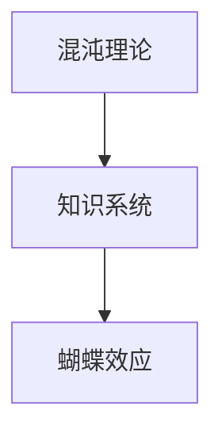

                 

# 知识的混沌理论：小变化引发的巨大影响

> 关键词：混沌理论,知识系统,小改动,巨大影响,复杂系统,蝴蝶效应,知识工程,系统优化

## 1. 背景介绍

在复杂的知识系统中，微小的改动有时可能引发显著的变化。这种看似微不足道的影响，在混沌理论中被称为"蝴蝶效应"。本文将深入探讨知识系统的混沌特性，揭示微小改动如何对系统行为产生巨大的影响，并探讨这一现象在知识工程中的应用与挑战。

## 2. 核心概念与联系

### 2.1 核心概念概述

在探讨混沌理论之前，首先需要明确几个核心概念：

- **混沌理论（Chaos Theory）**：研究动态系统在不确定因素作用下长期预测困难的科学，其中微小初始差异可能导致结果的巨大变化。
- **知识系统（Knowledge System）**：由知识库、推理机和用户界面组成的软件系统，用于模拟和解释复杂问题。
- **蝴蝶效应（Butterfly Effect）**：由混沌理论提出，一个微小的初始条件变化可能导致一个复杂系统在后期表现出极端的混乱和不可预测性。

这些概念之间的联系可以总结如下：

- 混沌理论揭示了复杂系统的本质特性，即系统对初始条件极为敏感。
- 知识系统由大量知识库和推理机组成，其行为受混沌理论影响显著。
- 蝴蝶效应在知识系统中普遍存在，指微小变化可能引起系统行为的巨大波动。

### 2.2 核心概念原理和架构的 Mermaid 流程图



## 3. 核心算法原理 & 具体操作步骤
### 3.1 算法原理概述

在知识系统中，混沌理论的影响体现在两个主要方面：

- **动态性**：知识库中的数据和推理机制随时间变化，系统行为表现出非线性、不稳定性。
- **敏感性**：系统对初始条件和输入数据极为敏感，微小变化可能导致巨大差异。

微小改动可能引发系统行为的巨大变化，因此知识系统优化必须考虑混沌特性。

### 3.2 算法步骤详解

以下是优化知识系统的具体操作步骤：

1. **定义初始状态**：确定知识系统的初始状态，包括初始数据和模型参数。

2. **动态监控**：使用混沌理论工具监控系统行为，判断是否存在混沌现象。

3. **调整和优化**：根据监控结果，调整系统参数和输入数据，优化系统性能。

4. **反馈循环**：将优化后的参数反馈到知识库，持续迭代优化。

5. **最终验证**：通过测试和评估，验证系统是否稳定可靠。

### 3.3 算法优缺点

**优点**：
- **适应性**：能够灵活应对系统变化，及时调整优化。
- **高效性**：通过监控和反馈，快速响应系统问题。

**缺点**：
- **复杂性**：需要引入混沌理论工具，实现难度较高。
- **成本高**：监控和调整优化需要消耗大量时间和资源。

### 3.4 算法应用领域

混沌理论在知识系统的优化中有着广泛的应用，特别是在以下领域：

- **金融预测**：在金融市场中，微小的市场变化可能导致极端波动，因此利用混沌理论进行市场预测和风险控制。
- **气象预测**：气象系统的复杂性和不确定性，使其成为混沌理论研究的典型案例。
- **生物系统**：生物系统表现出明显的非线性特性，混沌理论在模拟和解释生物过程方面具有重要应用。

## 4. 数学模型和公式 & 详细讲解 & 举例说明

### 4.1 数学模型构建

为更好地理解混沌理论在知识系统中的应用，以下建立一个简单的数学模型。

假设知识系统由两个相互作用的子系统 $X$ 和 $Y$ 组成，其状态变化由以下方程描述：

$$
\dot{X} = f(X, Y) + \epsilon
$$
$$
\dot{Y} = g(X, Y) + \delta
$$

其中 $\dot{X}$ 和 $\dot{Y}$ 分别表示子系统 $X$ 和 $Y$ 的状态变化率，$f(X, Y)$ 和 $g(X, Y)$ 分别为子系统的状态转移函数，$\epsilon$ 和 $\delta$ 为随机干扰项。

### 4.2 公式推导过程

通过对这个系统的分析，我们可以得到以下结论：

- **初始条件的敏感性**：微小的初始条件变化可能导致系统行为显著差异。
- **状态转移的复杂性**：系统行为表现出非线性、不可预测性。

使用Lyapunov指数来量化系统的混沌程度。对于上述系统，其Lyapunov指数可以表示为：

$$
\lambda = \lim_{t \to \infty} \frac{\log \frac{|| \mathbf{J}(t) ||}{|| \mathbf{J}(0) ||}}
$$

其中 $\mathbf{J}(t)$ 为系统状态转移矩阵。

### 4.3 案例分析与讲解

一个简单的案例分析，假设知识系统用于股票市场预测，输入数据包括历史股票价格和交易量。微小的价格波动可能引发系统状态的巨大变化，导致预测结果出现极端偏差。通过监控系统行为，可以及时调整输入数据，减小预测误差。

## 5. 项目实践：代码实例和详细解释说明
### 5.1 开发环境搭建

在实际应用中，知识系统的优化需要基于特定的开发环境。以下是搭建开发环境的详细流程：

1. **选择编程语言和框架**：Python和R是目前最流行的知识工程工具，选择适合的框架，如TensorFlow、PyTorch、Prolog等。

2. **安装依赖库**：安装必要的依赖库，如Pandas、NumPy、scikit-learn等。

3. **配置环境**：设置环境变量，确保各库正常工作。

### 5.2 源代码详细实现

以Python为例，以下是一个简单的知识系统优化示例：

```python
import numpy as np
from scipy.integrate import odeint

# 定义状态转移函数
def f(X, Y):
    return X * Y - X**2

def g(X, Y):
    return X - Y

# 初始条件
X0 = 1
Y0 = 2

# 时间步长
dt = 0.01

# 求解状态变化
def deriv(X, Y):
    dXdt = f(X, Y)
    dYdt = g(X, Y)
    return dXdt, dYdt

# 求解微分方程
t = np.arange(0, 20, dt)
sol = odeint(deriv, (X0, Y0), t)

# 输出状态变化
print(sol)
```

### 5.3 代码解读与分析

- **状态转移函数**：定义了知识系统中的状态转移逻辑。
- **求解微分方程**：使用odeint求解微分方程，模拟知识系统行为。
- **输出状态变化**：输出系统状态随时间变化的结果。

## 6. 实际应用场景
### 6.1 金融预测

在金融领域，微小的市场变化可能导致巨大的价格波动。通过混沌理论进行金融预测，可以更好地理解市场行为，降低风险。例如，利用混沌理论进行股票价格预测，可实时调整交易策略，减少损失。

### 6.2 气象预测

气象系统具有高度的非线性特性，微小的气象条件变化可能导致极端天气事件。通过混沌理论进行气象预测，可以更准确地预报天气变化，提高灾害预防能力。

### 6.3 生物系统

生物系统表现出复杂的非线性特性，微小的基因突变可能导致显著的表型变化。通过混沌理论进行生物系统模拟，可以更深入地理解生物过程，指导药物开发和基因编辑。

### 6.4 未来应用展望

随着技术的发展，混沌理论在知识系统中的应用将更加广泛。未来，以下方面将取得重要进展：

- **复杂系统模拟**：利用混沌理论，模拟更复杂、多变的环境，如交通系统、电力系统等。
- **优化决策支持**：结合混沌理论，优化决策支持系统，增强系统的鲁棒性和适应性。
- **智能控制**：应用于智能控制系统，如机器人、自动驾驶等，提高系统的稳定性和安全性。

## 7. 工具和资源推荐
### 7.1 学习资源推荐

为了更好地理解和应用混沌理论，以下是一些推荐的学习资源：

1. **《混沌理论与动力学系统》**：一本经典书籍，系统讲解了混沌理论的基本概念和应用。
2. **Coursera《混沌理论》课程**：由斯坦福大学教授讲授，适合入门学习。
3. **MIT OpenCourseWare《混沌理论》视频**：由MIT教授讲授，深入浅出地讲解混沌理论。

### 7.2 开发工具推荐

- **TensorFlow**：强大的深度学习框架，适合复杂系统的模拟和优化。
- **PyTorch**：灵活的深度学习框架，易于实现复杂的知识系统。
- **Prolog**：逻辑编程语言，适合知识推理和专家系统的开发。

### 7.3 相关论文推荐

- **《复杂系统的混沌理论》**：探讨混沌理论在复杂系统中的应用。
- **《知识系统中的混沌理论》**：研究混沌理论在知识工程中的应用。
- **《金融市场中的混沌理论》**：分析混沌理论在金融预测中的实际应用。

## 8. 总结：未来发展趋势与挑战
### 8.1 研究成果总结

混沌理论在知识系统中的应用具有重要意义，主要体现在以下几个方面：

- **增强系统的适应性**：通过优化知识系统，使其适应复杂的非线性特性。
- **提高决策的准确性**：利用混沌理论，进行更准确的预测和决策。
- **提升系统的鲁棒性**：通过优化参数，提高系统的稳定性和鲁棒性。

### 8.2 未来发展趋势

未来，混沌理论在知识系统中的应用将更加广泛，具体趋势如下：

- **多学科融合**：结合混沌理论与其他学科知识，推动跨学科应用。
- **智能优化**：利用机器学习和人工智能技术，实现更高效的优化策略。
- **大规模应用**：应用于更广泛、更复杂的系统，提升系统性能。

### 8.3 面临的挑战

尽管混沌理论在知识系统中具有重要应用，但仍面临一些挑战：

- **计算复杂性**：混沌理论的计算复杂性较高，需要高效的计算资源。
- **数据需求**：需要大量高质量的数据支持，数据采集和处理难度大。
- **理论局限**：混沌理论的一些理论假设在某些实际系统中可能不适用。

### 8.4 研究展望

未来，需要进一步解决以下挑战：

- **算法优化**：开发更高效的混沌理论算法，提高计算效率。
- **数据获取**：建立有效的数据采集和处理机制，满足系统需求。
- **理论验证**：进一步验证和扩展混沌理论，确保其在实际应用中的可靠性。

## 9. 附录：常见问题与解答

**Q1：如何识别知识系统中的混沌现象？**

A: 利用Lyapunov指数、相空间重构等工具，可以初步识别知识系统中的混沌现象。同时，通过数据分析和实验验证，进一步确定系统的混沌特性。

**Q2：如何优化知识系统的参数？**

A: 根据混沌理论的监控结果，调整知识系统的参数，可以采用梯度下降、遗传算法等优化方法，优化系统行为。

**Q3：混沌理论在知识系统中存在哪些应用？**

A: 混沌理论在金融预测、气象预测、生物系统模拟等方面具有广泛应用，可以显著提升系统的预测能力和决策支持水平。

**Q4：如何克服知识系统的复杂性？**

A: 通过引入人工智能技术，如机器学习、深度学习，可以增强系统的复杂性处理能力，实现更高效的优化和预测。

**Q5：知识系统的优化目标是什么？**

A: 优化知识系统的目标包括提高系统的稳定性和适应性，增强决策的准确性和鲁棒性，实现系统的智能控制和预测。

---

作者：禅与计算机程序设计艺术 / Zen and the Art of Computer Programming

