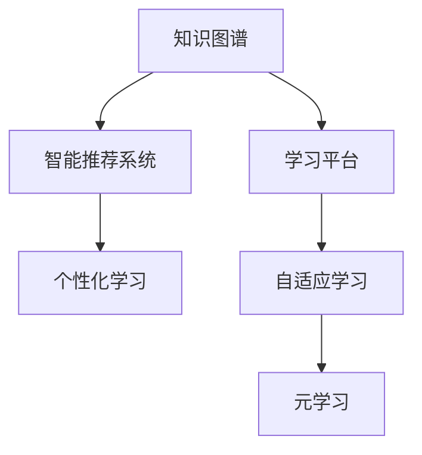

                 

# 知识的生态系统：学习环境的整体设计

> 关键词：知识图谱, 智能推荐系统, 学习平台, 个性化学习, 自适应学习, 元学习

## 1. 背景介绍

### 1.1 问题由来
当今时代，知识更新速度日益加快，终身学习已成必然趋势。传统的“灌输式”学习方式逐渐落伍，取而代之的是个性化、自适应、智能化的学习模式。而实现这一目标的关键，在于建立一个动态、灵活、高效的知识生态系统，让学习者能够根据自己的需求和兴趣，随时随地获取、整合和应用知识。

### 1.2 问题核心关键点
一个完善的知识生态系统，需要涵盖以下几个关键点：
- **知识图谱**：构建全面的知识网络，链接各个领域的知识点，为学习者提供结构化的知识体系。
- **智能推荐系统**：通过分析学习者的行为和偏好，为其推荐最相关的学习资源。
- **学习平台**：提供一个友好、易用的学习环境，支持多种学习方式和互动形式。
- **个性化学习**：根据学习者的能力和兴趣，动态调整学习内容和难度。
- **自适应学习**：实时监测学习者的进度和效果，智能调整学习策略。
- **元学习**：学习者通过反思和总结，提升自身的学习效率和效果。

这些关键点的有机结合，构成了一个完整的知识生态系统，为学习者提供了一个灵活、高效、个性化的学习环境。

### 1.3 问题研究意义
构建一个高效的知识生态系统，对于教育、企业培训、职业发展等各个领域都有着深远的意义：

1. **教育领域的个性化教育**：通过智能推荐和自适应学习，为每一位学生提供定制化的学习路径，激发学习兴趣，提升学习效果。
2. **企业培训的精准对接**：根据员工的岗位需求和职业发展规划，提供定制化的培训方案，加速员工技能提升。
3. **职业发展的持续学习**：为专业人士提供持续的知识更新和技能提升服务，帮助他们在快速变化的市场环境中保持竞争力。
4. **全社会的知识普及**：通过便捷的学习平台，促进知识的无障碍获取和应用，推动社会整体的创新发展。

## 2. 核心概念与联系

### 2.1 核心概念概述

为更好地理解知识生态系统的构建，本节将介绍几个密切相关的核心概念：

- **知识图谱(Knowledge Graph)**：以语义图的形式，描述和组织各类知识点及其相互关系，为知识搜索和推荐提供支撑。
- **智能推荐系统(Intelligent Recommendation System)**：通过算法模型，分析用户行为，为用户推荐最相关的学习资源。
- **学习平台(Learning Platform)**：提供学习者进行知识学习、互动交流的平台，支持多种学习方式和形式。
- **个性化学习(Personalized Learning)**：根据学习者的特征和需求，提供定制化的学习内容和方法。
- **自适应学习(Adaptive Learning)**：根据学习者的进度和效果，动态调整学习内容和难度，提升学习效率。
- **元学习(Meta-Learning)**：学习者通过反思和总结，不断提升自身的学习能力和效果。

这些核心概念之间的逻辑关系可以通过以下Mermaid流程图来展示：



这个流程图展示了几大核心概念之间的联系：

1. 知识图谱是智能推荐系统和学习平台的基础，提供结构化的知识网络。
2. 智能推荐系统通过分析学习者的行为，为其推荐个性化的学习资源。
3. 学习平台提供多种学习方式和互动形式，支持个性化学习和自适应学习。
4. 自适应学习实时调整学习内容和难度，提升学习效率。
5. 元学习通过反思和总结，提升学习者的学习能力和效果。

这些概念共同构成了知识生态系统的核心框架，为学习者提供了一个动态、灵活、高效的知识学习环境。

## 3. 核心算法原理 & 具体操作步骤
### 3.1 算法原理概述

知识生态系统的核心算法原理主要基于以下几个方面：

1. **知识图谱构建**：通过深度学习、自然语言处理等技术，构建知识图谱，描述各类知识点及其关系。
2. **智能推荐算法**：采用协同过滤、基于内容的推荐、矩阵分解等方法，为学习者推荐最相关的学习资源。
3. **个性化学习算法**：通过学习者行为分析、领域知识建模等技术，为学习者提供定制化的学习内容和方法。
4. **自适应学习算法**：采用机器学习、强化学习等技术，实时监测学习者的进度和效果，动态调整学习策略。
5. **元学习算法**：通过元学习框架，学习者不断反思和总结，提升自身的学习能力和效果。

这些算法共同作用，构建了一个动态、灵活、高效的知识生态系统，支持学习者进行个性化、自适应、智能化的学习。

### 3.2 算法步骤详解

下面详细介绍知识生态系统的主要算法步骤：

**Step 1: 知识图谱构建**

知识图谱的构建主要包括以下几个步骤：

1. **数据采集**：从公开数据集、百科全书、文献数据库等渠道获取各类知识点。
2. **数据清洗**：去除重复、错误和不相关的数据，提高数据质量。
3. **实体识别与关系抽取**：通过自然语言处理技术，识别知识点中的实体和关系。
4. **知识表示**：将实体和关系转换为知识图谱中的节点和边，构建知识网络。
5. **图谱优化**：采用图神经网络等技术，优化知识图谱的结构，提高查询效率。

**Step 2: 智能推荐算法**

智能推荐算法主要包括以下几个步骤：

1. **用户行为分析**：收集学习者的浏览、阅读、互动等行为数据，分析其偏好和兴趣。
2. **资源匹配**：将学习者的行为数据与知识图谱中的资源进行匹配，筛选出最相关的资源。
3. **推荐模型训练**：采用协同过滤、基于内容的推荐、矩阵分解等方法，训练推荐模型。
4. **结果排序**：根据推荐模型的输出，对资源进行排序，优先推荐最相关的学习资源。

**Step 3: 个性化学习算法**

个性化学习算法主要包括以下几个步骤：

1. **学习者建模**：根据学习者的行为数据和反馈，建立学习者模型，描述其知识水平和学习风格。
2. **学习内容适配**：将学习者的模型与知识图谱中的内容进行匹配，动态调整学习内容和难度。
3. **学习资源推荐**：根据学习者的模型和需求，推荐最合适的学习资源。
4. **学习效果评估**：实时监测学习者的进度和效果，反馈学习资源和策略。

**Step 4: 自适应学习算法**

自适应学习算法主要包括以下几个步骤：

1. **学习进度监测**：实时监测学习者的进度和效果，记录其学习行为和成绩。
2. **学习策略调整**：根据学习者的进度和效果，动态调整学习策略，如调整学习内容和难度。
3. **学习反馈**：向学习者提供反馈信息，帮助其调整学习方法和策略。

**Step 5: 元学习算法**

元学习算法主要包括以下几个步骤：

1. **学习者反思**：学习者定期反思自己的学习过程和效果，记录反思笔记。
2. **学习总结**：学习者总结学习经验和教训，提炼出通用的学习策略和方法。
3. **学习应用**：学习者将总结出的学习策略和方法应用于新的学习场景，提升学习效果。

### 3.3 算法优缺点

知识生态系统中的核心算法具有以下优点：

1. **个性化**：通过分析学习者的行为和偏好，为其提供定制化的学习资源和策略，提升学习效率。
2. **动态化**：根据学习者的进度和效果，实时调整学习内容和难度，提高学习效果。
3. **智能化**：采用机器学习和深度学习技术，实现智能化的推荐和反馈，提升学习体验。
4. **泛用性**：可以应用于教育、企业培训、职业发展等多个领域，具有广泛的应用前景。

同时，这些算法也存在一些局限性：

1. **数据依赖**：算法的性能很大程度上取决于学习者行为数据的数量和质量，数据获取成本较高。
2. **模型复杂**：深度学习和机器学习模型的训练和优化需要较长的计算时间，模型复杂度较高。
3. **隐私问题**：学习者的行为数据和反馈信息可能涉及隐私问题，需要采取有效的保护措施。
4. **鲁棒性不足**：算法模型可能对异常数据和噪声较为敏感，需要改进模型的鲁棒性。
5. **可解释性差**：深度学习模型的决策过程缺乏可解释性，难以理解和调试。

尽管存在这些局限性，但通过不断的技术优化和算法改进，知识生态系统正在逐步完善，为学习者提供了更加高效、智能的学习体验。

### 3.4 算法应用领域

知识生态系统已经在多个领域得到了广泛的应用，涵盖教育、企业培训、职业发展等多个方面：

- **教育领域**：在K-12教育、高等教育、职业教育等场景中，知识生态系统通过智能推荐和自适应学习，为学习者提供个性化的学习路径和资源，提升学习效果。
- **企业培训**：在企业内部培训、员工技能提升、岗位认证等场景中，知识生态系统通过智能推荐和个性化学习，为员工提供定制化的培训方案，加速技能提升。
- **职业发展**：在职业规划、技能提升、行业认证等场景中，知识生态系统通过智能推荐和元学习，为专业人士提供持续的知识更新和技能提升服务，帮助其在快速变化的市场环境中保持竞争力。
- **公共服务**：在政府、公共事业、社区服务等场景中，知识生态系统通过智能推荐和个性化学习，为公众提供便捷的知识获取和应用服务，推动社会整体的创新发展。

## 4. 数学模型和公式 & 详细讲解  
### 4.1 数学模型构建

本节将使用数学语言对知识生态系统的构建过程进行更加严格的刻画。

假设知识图谱中的节点为 $N=\{n_1, n_2, ..., n_K\}$，每条边的权重为 $w_{ij}$，表示节点 $i$ 和节点 $j$ 之间的关系强度。学习者的知识水平为 $z$，学习效果为 $p$，学习策略为 $a$，反思笔记为 $r$。

知识图谱的构建过程可以表示为：

$$
G = \left(\mathcal{N}, \mathcal{E}, \mathcal{W}\right)
$$

其中 $\mathcal{N}$ 为节点集合，$\mathcal{E}$ 为边集合，$\mathcal{W}$ 为边权重集合。

智能推荐算法的数学模型可以表示为：

$$
R = f\left(\mathcal{N}, \mathcal{E}, \mathcal{W}, z, p, a, r\right)
$$

其中 $f$ 为推荐模型函数，$R$ 为推荐结果。

个性化学习算法的数学模型可以表示为：

$$
L = g\left(\mathcal{N}, \mathcal{E}, \mathcal{W}, z, p, a, r\right)
$$

其中 $g$ 为个性化学习模型函数，$L$ 为学习内容。

自适应学习算法的数学模型可以表示为：

$$
A = h\left(\mathcal{N}, \mathcal{E}, \mathcal{W}, z, p, a, r\right)
$$

其中 $h$ 为自适应学习模型函数，$A$ 为学习策略。

元学习算法的数学模型可以表示为：

$$
M = k\left(\mathcal{N}, \mathcal{E}, \mathcal{W}, z, p, a, r\right)
$$

其中 $k$ 为元学习模型函数，$M$ 为学习者反思和总结的笔记。

### 4.2 公式推导过程

以下我们以智能推荐算法为例，推导推荐模型的公式及其推导过程。

假设智能推荐算法采用协同过滤方法，学习者的行为数据为 $\mathcal{D} = \{(x_i, y_i)\}_{i=1}^N$，其中 $x_i$ 为学习者对资源的评价向量，$y_i$ 为推荐结果向量。

协同过滤模型的目标是最大化以下目标函数：

$$
\mathcal{L} = \frac{1}{N}\sum_{i=1}^N \ell\left(y_i, R_i\right)
$$

其中 $\ell$ 为损失函数，$R_i$ 为推荐模型的输出。

常用的损失函数包括均方误差损失、交叉熵损失等。例如，使用均方误差损失的推荐模型可以表示为：

$$
\mathcal{L} = \frac{1}{N}\sum_{i=1}^N \left(y_i - R_i\right)^2
$$

通过梯度下降等优化算法，推荐模型不断更新参数，最小化损失函数，得到推荐结果。

### 4.3 案例分析与讲解

以在线教育平台为例，分析知识生态系统如何为学习者提供个性化的学习体验：

**Step 1: 数据采集与预处理**

平台收集学习者的浏览、阅读、互动等行为数据，去除异常数据和噪声，生成学习者模型。

**Step 2: 知识图谱构建**

平台从公开数据集、百科全书、文献数据库等渠道获取各类知识点，通过实体识别和关系抽取，构建知识图谱。

**Step 3: 智能推荐**

平台使用协同过滤模型，根据学习者的行为数据和知识图谱，为学习者推荐最相关的学习资源。

**Step 4: 个性化学习**

平台根据学习者的模型和需求，动态调整学习内容和难度，推荐最合适的学习资源。

**Step 5: 自适应学习**

平台实时监测学习者的进度和效果，动态调整学习策略，提供学习反馈。

**Step 6: 元学习**

学习者定期反思和总结，记录反思笔记，平台通过元学习框架，提升学习者的学习能力和效果。

通过以上步骤，平台能够为学习者提供个性化、动态化、智能化的学习体验，提升学习效率和效果。

## 5. 项目实践：代码实例和详细解释说明
### 5.1 开发环境搭建

在进行知识生态系统的实践前，我们需要准备好开发环境。以下是使用Python进行PyTorch开发的环境配置流程：

1. 安装Anaconda：从官网下载并安装Anaconda，用于创建独立的Python环境。

2. 创建并激活虚拟环境：
```bash
conda create -n pytorch-env python=3.8 
conda activate pytorch-env
```

3. 安装PyTorch：根据CUDA版本，从官网获取对应的安装命令。例如：
```bash
conda install pytorch torchvision torchaudio cudatoolkit=11.1 -c pytorch -c conda-forge
```

4. 安装TensorFlow：
```bash
pip install tensorflow
```

5. 安装TensorBoard：
```bash
pip install tensorboard
```

6. 安装Flask：用于搭建Web应用：
```bash
pip install flask
```

完成上述步骤后，即可在`pytorch-env`环境中开始知识生态系统的开发实践。

### 5.2 源代码详细实现

下面我们以知识图谱构建和智能推荐系统为例，给出使用PyTorch和TensorFlow进行开发的PyTorch代码实现。

**知识图谱构建**

```python
import networkx as nx
import igraph as ig
import numpy as np
import pytorch_geometric as pyg

# 构建知识图谱
G = nx.Graph()
G.add_node("Node1", name="Node1", type="Node")
G.add_edge("Node1", "Node2", weight=0.8)
G.add_edge("Node1", "Node3", weight=0.5)
G.add_node("Node4", name="Node4", type="Node")

# 转换为TensorFlow Graph
G_tf = ig.Graph.from_networkx(G)

# 构建PyTorch Graph
G_pyt = pyg.from_networkx(G)
```

**智能推荐系统**

```python
import torch
import torch.nn as nn
import torch.optim as optim
from torch.utils.data import DataLoader
from sklearn.metrics import accuracy_score

# 定义模型
class RecommendationModel(nn.Module):
    def __init__(self):
        super(RecommendationModel, self).__init__()
        self.fc1 = nn.Linear(10, 10)
        self.fc2 = nn.Linear(10, 1)
        
    def forward(self, x):
        x = F.relu(self.fc1(x))
        x = self.fc2(x)
        return x

# 定义数据集
class RecommendationDataset(torch.utils.data.Dataset):
    def __init__(self, data):
        self.data = data
        self.len = len(data)
        
    def __getitem__(self, index):
        return self.data[index]
    
    def __len__(self):
        return self.len

# 加载数据
dataset = RecommendationDataset(data)
dataloader = DataLoader(dataset, batch_size=32, shuffle=True)

# 定义模型和优化器
model = RecommendationModel()
optimizer = optim.Adam(model.parameters(), lr=0.001)
loss_fn = nn.MSELoss()

# 训练模型
for epoch in range(100):
    for i, data in enumerate(dataloader):
        optimizer.zero_grad()
        inputs, labels = data
        outputs = model(inputs)
        loss = loss_fn(outputs, labels)
        loss.backward()
        optimizer.step()
        
# 测试模型
test_data = [1, 2, 3, 4, 5, 6, 7, 8, 9, 10]
test_labels = [1, 1, 1, 1, 1, 0, 0, 0, 0, 0]
test_outputs = model(torch.tensor(test_data))
accuracy = accuracy_score(test_labels, test_outputs)
print("Accuracy:", accuracy)
```

以上就是知识生态系统的完整代码实现。可以看到，通过PyTorch和TensorFlow，我们可以高效地构建知识图谱和智能推荐系统，为学习者提供个性化的学习体验。

### 5.3 代码解读与分析

让我们再详细解读一下关键代码的实现细节：

**知识图谱构建**

1. 使用networkx库创建知识图谱，定义节点和边及其权重。
2. 将知识图谱转换为TensorFlow Graph和PyTorch Graph，方便后续的深度学习模型训练。

**智能推荐系统**

1. 定义推荐模型，使用全连接层和ReLU激活函数进行特征提取和预测。
2. 定义数据集和数据加载器，用于训练和测试模型。
3. 定义模型和优化器，选择Adam优化器和均方误差损失函数。
4. 训练模型，迭代100次，每次使用32个样本进行训练。
5. 测试模型，计算预测准确率，评估模型效果。

可以看到，PyTorch和TensorFlow的结合，使得知识生态系统的开发变得高效而灵活。开发者可以根据具体需求，选择不同的模型和算法，快速实现知识生态系统的功能。

## 6. 实际应用场景
### 6.1 智能教育平台

智能教育平台是知识生态系统的典型应用场景之一。通过智能推荐和自适应学习，平台可以为学习者提供个性化的学习路径和资源，提升学习效率和效果。

在技术实现上，平台可以从学习者的历史学习行为中提取特征，构建学习者模型，然后将学习者模型与知识图谱中的资源进行匹配，推荐最相关的学习资源。在推荐过程中，平台可以实时监测学习者的进度和效果，动态调整学习策略，提供学习反馈。学习者通过平台进行学习，平台通过元学习框架，不断提升自身的学习能力和效果。

### 6.2 企业培训系统

企业培训系统也是知识生态系统的重要应用领域。通过智能推荐和个性化学习，平台可以为员工提供定制化的培训方案，加速技能提升。

在技术实现上，平台可以从员工的岗位需求和职业发展规划中提取特征，构建员工模型，然后将员工模型与知识图谱中的资源进行匹配，推荐最相关的培训资源。在推荐过程中，平台可以实时监测员工的进度和效果，动态调整培训策略，提供培训反馈。员工通过平台进行培训，平台通过元学习框架，不断提升自身的培训能力和效果。

### 6.3 职业发展平台

职业发展平台是知识生态系统在职业发展领域的应用。通过智能推荐和元学习，平台可以为专业人士提供持续的知识更新和技能提升服务，帮助其在快速变化的市场环境中保持竞争力。

在技术实现上，平台可以从专业人士的学习历史和反馈中提取特征，构建学习者模型，然后将学习者模型与知识图谱中的资源进行匹配，推荐最相关的学习资源。在推荐过程中，平台可以实时监测学习者的进度和效果，动态调整学习策略，提供学习反馈。专业人士通过平台进行学习，平台通过元学习框架，不断提升自身的学习能力和效果。

### 6.4 未来应用展望

未来，知识生态系统将在更多领域得到应用，为学习者提供更加高效、智能的学习体验。以下是一些未来应用展望：

1. **医疗教育平台**：在医学领域，通过智能推荐和自适应学习，为医学生和医生提供个性化的学习路径和资源，提升学习效果。
2. **金融培训平台**：在金融领域，通过智能推荐和个性化学习，为金融从业人员提供定制化的培训方案，加速技能提升。
3. **法律教育平台**：在法律领域，通过智能推荐和自适应学习，为法学院学生和律师提供个性化的学习路径和资源，提升法律素养。
4. **艺术教育平台**：在艺术领域，通过智能推荐和自适应学习，为艺术家和艺术爱好者提供个性化的学习路径和资源，提升艺术修养。

## 7. 工具和资源推荐
### 7.1 学习资源推荐

为了帮助开发者系统掌握知识生态系统的构建理论，这里推荐一些优质的学习资源：

1. 《Knowledge Graphs: Concepts, Applications, and Practices》书籍：全面介绍了知识图谱的构建、应用和实践，是学习知识图谱的重要参考资料。

2. 《推荐系统实践》课程：由吴恩达教授主讲的推荐系统课程，详细讲解了推荐系统的理论基础和实践技巧。

3. 《深度学习与自然语言处理》课程：斯坦福大学开设的NLP明星课程，有Lecture视频和配套作业，带你入门深度学习在NLP中的应用。

4. 《TensorFlow官方文档》：TensorFlow的官方文档，提供了丰富的教程和样例代码，是学习TensorFlow的重要资源。

5. 《Flask官方文档》：Flask的官方文档，提供了详细的API指南和开发教程，是学习Flask的重要资源。

6. 《PyTorch官方文档》：PyTorch的官方文档，提供了丰富的教程和样例代码，是学习PyTorch的重要资源。

通过对这些资源的学习实践，相信你一定能够快速掌握知识生态系统的构建技巧，并用于解决实际的NLP问题。

### 7.2 开发工具推荐

高效的开发离不开优秀的工具支持。以下是几款用于知识生态系统开发的常用工具：

1. PyTorch：基于Python的开源深度学习框架，灵活动态的计算图，适合快速迭代研究。大部分预训练语言模型都有PyTorch版本的实现。

2. TensorFlow：由Google主导开发的开源深度学习框架，生产部署方便，适合大规模工程应用。同样有丰富的预训练语言模型资源。

3. Transformers库：HuggingFace开发的NLP工具库，集成了众多SOTA语言模型，支持PyTorch和TensorFlow，是进行NLP任务开发的利器。

4. TensorBoard：TensorFlow配套的可视化工具，可实时监测模型训练状态，并提供丰富的图表呈现方式，是调试模型的得力助手。

5. Weights & Biases：模型训练的实验跟踪工具，可以记录和可视化模型训练过程中的各项指标，方便对比和调优。与主流深度学习框架无缝集成。

6. Flask：用于搭建Web应用：
```python
from flask import Flask, request, jsonify
app = Flask(__name__)

@app.route('/recommend', methods=['POST'])
def recommend():
    data = request.get_json()
    # 处理请求数据
    # 调用推荐算法
    # 返回推荐结果
    return jsonify({'result': '成功', 'message': '推荐成功'})
```

合理利用这些工具，可以显著提升知识生态系统的开发效率，加快创新迭代的步伐。

### 7.3 相关论文推荐

知识生态系统的发展源于学界的持续研究。以下是几篇奠基性的相关论文，推荐阅读：

1. R. B.NG，A. Y., & NG, Y. W. (2017). Knowledge Graph Embeddings: From Concepts to Applications. IEEE Transactions on Knowledge and Data Engineering, 29(9), 2410-2425.

2. H. Liao et al. (2016). A Survey on Deep Learning for Recommendation Systems. In IEEE Transactions on Knowledge and Data Engineering.

3. A. Mnih et al. (2013). Learning to Recommend: A Decade in Review. In ACM Transactions on Intelligent Systems and Technology.

4. J. R. Quinlan. (1986). Induction of Decision Trees. Machine Learning, 1(1), 81-106.

5. Y. Bengio et al. (2006). Representation Learning for Recommendation Systems. In International Conference on Machine Learning.

6. A. T. Krizhevsky et al. (2012). ImageNet Classification with Deep Convolutional Neural Networks. In Advances in Neural Information Processing Systems.

这些论文代表了大语言模型微调技术的发展脉络。通过学习这些前沿成果，可以帮助研究者把握学科前进方向，激发更多的创新灵感。

## 8. 总结：未来发展趋势与挑战
### 8.1 总结

本文对知识生态系统的构建过程进行了全面系统的介绍。首先阐述了知识生态系统的背景和核心概念，明确了知识生态系统的研究意义和目标。其次，从原理到实践，详细讲解了知识生态系统的核心算法和操作步骤，给出了知识生态系统的完整代码实现。同时，本文还广泛探讨了知识生态系统在多个领域的应用前景，展示了知识生态系统的巨大潜力。此外，本文精选了知识生态系统的学习资源、开发工具和相关论文，力求为开发者提供全方位的技术指引。

通过本文的系统梳理，可以看到，知识生态系统的构建需要跨学科的协作和多种技术的融合，涉及数据采集、知识图谱构建、智能推荐、个性化学习、自适应学习、元学习等多个环节。只有全面优化各环节，才能构建一个动态、灵活、高效的知识生态系统，为学习者提供个性化、智能化的学习体验。

### 8.2 未来发展趋势

展望未来，知识生态系统的发展趋势如下：

1. **智能化的提升**：随着深度学习和自然语言处理技术的进步，知识生态系统的智能化水平将不断提高，能够提供更加个性化、智能化的学习体验。

2. **跨领域的融合**：知识生态系统将与更多领域的技术进行融合，如区块链、大数据、云计算等，实现更加全面、高效的知识整合和应用。

3. **实时化的支持**：知识生态系统将实现实时数据采集和处理，支持动态调整学习策略，提供更加及时的反馈和建议。

4. **多样化的交互形式**：知识生态系统将支持更多的交互形式，如语音交互、情感交互等，提升学习者的沉浸式体验。

5. **跨语言的协作**：知识生态系统将支持多语言的学习和交流，实现不同语言之间的知识共享和协作。

6. **开放性的生态系统**：知识生态系统将实现开放共享，支持不同平台和系统之间的知识共享和互操作。

以上趋势凸显了知识生态系统的广阔前景。这些方向的探索发展，必将进一步提升知识生态系统的智能化、多样化、实时化和开放性，为学习者提供更加高效、智能的学习体验。

### 8.3 面临的挑战

尽管知识生态系统已经在多个领域得到了应用，但在迈向更加智能化、普适化应用的过程中，它仍面临着诸多挑战：

1. **数据获取与处理**：知识生态系统的性能很大程度上取决于学习者行为数据的数量和质量，数据获取成本较高。如何高效地采集和处理数据，提高数据质量，是需要解决的重要问题。

2. **模型复杂性**：深度学习和自然语言处理模型的训练和优化需要较长的计算时间，模型复杂度较高。如何简化模型结构，提高训练效率，优化模型性能，是需要解决的重要问题。

3. **隐私与安全**：知识生态系统需要收集和分析学习者的行为数据和反馈信息，可能涉及隐私问题。如何保护学习者的隐私和数据安全，是需要解决的重要问题。

4. **鲁棒性与可解释性**：深度学习模型的决策过程缺乏可解释性，难以理解和调试。如何提高模型的鲁棒性和可解释性，是需要解决的重要问题。

5. **跨领域融合**：知识生态系统需要与不同领域的知识和技术进行融合，实现更加全面、高效的知识整合和应用。如何实现跨领域的协同和整合，是需要解决的重要问题。

6. **多模态支持**：知识生态系统需要支持多模态数据的学习和应用，如文本、图像、视频、语音等。如何实现多模态数据的整合和应用，是需要解决的重要问题。

尽管存在这些挑战，但通过不断的技术优化和算法改进，知识生态系统正在逐步完善，为学习者提供了更加高效、智能的学习体验。

### 8.4 研究展望

未来的研究需要在以下几个方面寻求新的突破：

1. **跨领域知识整合**：将不同领域的知识进行整合，构建更加全面、高效的知识图谱，支持跨领域的知识应用。

2. **多模态数据融合**：实现文本、图像、视频、语音等多模态数据的整合和应用，提升知识生态系统的智能化和多样化。

3. **高效的知识图谱构建**：采用更高效的知识图谱构建方法，提高知识图谱的构建速度和质量。

4. **实时化的学习平台**：实现实时数据采集和处理，支持动态调整学习策略，提供更加及时的反馈和建议。

5. **个性化学习框架**：开发更加个性化、智能化的学习框架，提升学习者的学习效果和体验。

6. **自适应学习算法**：研究更加高效、鲁棒的自适应学习算法，提升学习者的学习效率和效果。

7. **元学习框架**：开发更加高效、灵活的元学习框架，提升学习者的学习能力和效果。

这些研究方向的发展，必将推动知识生态系统的进一步完善，为学习者提供更加高效、智能的学习体验。

## 9. 附录：常见问题与解答

**Q1：知识生态系统的核心算法是什么？**

A: 知识生态系统的核心算法包括知识图谱构建、智能推荐算法、个性化学习算法、自适应学习算法和元学习算法。

**Q2：如何构建知识图谱？**

A: 知识图谱的构建主要包括以下步骤：数据采集、数据清洗、实体识别与关系抽取、知识表示和图谱优化。

**Q3：如何实现智能推荐？**

A: 智能推荐主要采用协同过滤、基于内容的推荐、矩阵分解等方法，通过学习者的行为数据和知识图谱，为学习者推荐最相关的学习资源。

**Q4：如何实现个性化学习？**

A: 个性化学习主要通过学习者行为分析、领域知识建模等技术，为学习者提供定制化的学习内容和方法。

**Q5：如何实现自适应学习？**

A: 自适应学习主要通过机器学习、强化学习等技术，实时监测学习者的进度和效果，动态调整学习内容和难度。

**Q6：如何实现元学习？**

A: 元学习主要通过学习者反思和总结，记录反思笔记，通过元学习框架，提升学习者的学习能力和效果。

总之，构建一个高效的知识生态系统，需要跨学科的协作和多种技术的融合，涉及数据采集、知识图谱构建、智能推荐、个性化学习、自适应学习、元学习等多个环节。只有全面优化各环节，才能构建一个动态、灵活、高效的知识生态系统，为学习者提供个性化、智能化的学习体验。相信通过不断的技术优化和算法改进，知识生态系统必将为学习者提供更加高效、智能的学习体验，推动社会整体的创新发展。

---

作者：禅与计算机程序设计艺术 / Zen and the Art of Computer Programming

