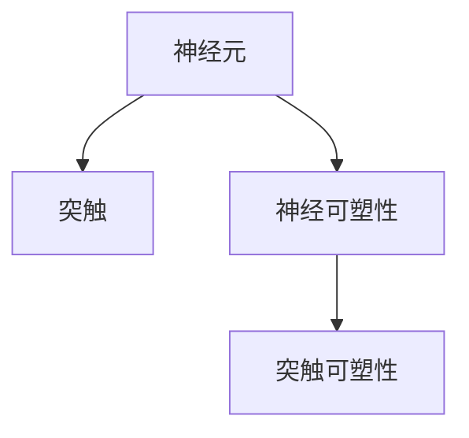

                 

# 知识的神经可塑性：终身学习的生物学基础

> 关键词：神经可塑性, 终身学习, 神经元, 突触, 记忆, 学习算法, 深度学习, 人工智能

## 1. 背景介绍

### 1.1 问题由来

现代人工智能（AI）技术的迅猛发展，尤其是深度学习和大数据技术的突破，使得AI在众多领域实现了前所未有的成就。从语音识别到图像识别，从自动驾驶到自然语言处理，AI已经展现出强大的学习能力。然而，这些技术的成功在很大程度上依赖于大量标注数据的积累和繁琐的算法调参过程。这使得AI的训练和应用成本极高，而且对数据的依赖性很强，难以进行实时学习和动态调整。

此外，AI模型在面对新环境和变化时，容易出现泛化能力不足的问题，无法很好地适应新数据和动态环境。这些问题使得AI在实际应用中面临诸多挑战，迫切需要一种更加智能、灵活、适应性强的学习方式。

### 1.2 问题核心关键点

针对上述问题，科学家们提出了神经可塑性（Neural Plasticity）的概念。神经可塑性是指神经系统在特定环境、刺激下，能够进行自我调整和优化，以适应环境变化和提升学习效率。这一概念不仅在生物学和神经科学中有广泛应用，而且对人工智能的算法设计和模型优化具有重要启示。

神经可塑性的核心是神经元之间突触连接的强度变化，以及神经网络内部的结构重构。通过模拟这种突触可塑性，AI模型可以在学习过程中不断优化自身结构，增强适应性和泛化能力。这不仅可以降低对数据的依赖性，还能实现实时学习和动态调整，增强系统的灵活性和智能性。

## 2. 核心概念与联系

### 2.1 核心概念概述

为了更好地理解神经可塑性在AI中的应用，本文将介绍几个密切相关的核心概念：

- **神经元（Neuron）**：神经网络中最基本的计算单元，负责接收和处理输入信号，并生成输出信号。
- **突触（Synapse）**：神经元之间的连接结构，负责传递信号和增强神经网络的连接强度。
- **突触可塑性（Synaptic Plasticity）**：突触连接强度的动态变化，包括长时程增强（LTP）和长时程抑制（LTD）两种形式。
- **神经可塑性（Neural Plasticity）**：神经网络结构和学习过程的动态调整，包括神经元激活、连接权重调整、网络结构优化等。
- **神经网络（Neural Network）**：由多个神经元组成的网络结构，用于模拟和实现复杂的学习任务。

这些概念之间的关系可以通过以下Mermaid流程图来展示：



这个流程图展示了神经元、突触和神经可塑性之间的关系：

1. 神经元是神经网络的基本单元，通过突触与其它神经元进行信号传递。
2. 突触可塑性是神经网络学习能力的基础，通过长时程增强和长时程抑制等机制，实现信号的传递和强度调整。
3. 神经可塑性是神经网络动态调整和优化能力的表现，通过神经元激活、连接权重调整等机制，实现网络结构和功能的优化。

## 3. 核心算法原理 & 具体操作步骤

### 3.1 算法原理概述

基于神经可塑性的AI算法主要关注如何模拟突触可塑性，以实现神经网络的动态优化和学习。其核心思想是通过调整神经元之间的连接权重，增强或抑制信号传递，从而实现神经网络的学习和优化。

形式化地，假设一个具有 $N$ 个神经元的神经网络 $N$，每个神经元之间的连接权重为 $w_{ij}$，其中 $i$ 和 $j$ 分别表示神经元的编号。在训练过程中，通过调整这些权重，使得网络输出与目标输出尽可能一致，以优化网络性能。

### 3.2 算法步骤详解

基于神经可塑性的AI算法通常包括以下几个关键步骤：

**Step 1: 准备数据集和模型**

- 准备训练集 $D$，包含输入 $x$ 和对应的输出 $y$。
- 设计神经网络 $N$，包括输入层、隐藏层和输出层，定义各层神经元数量和激活函数。
- 初始化神经元之间的连接权重 $w_{ij}$，通常为随机值。

**Step 2: 前向传播计算**

- 将输入 $x$ 通过网络进行前向传播，计算每个神经元的输出 $h_i$。
- 根据当前权重 $w_{ij}$，计算每个神经元与其它神经元之间的连接强度。
- 计算每个神经元的激活值 $a_i$，即 $a_i = f(h_i)$，其中 $f$ 为激活函数。

**Step 3: 反向传播计算**

- 计算输出层神经元的误差 $e$，即 $e = y - \hat{y}$，其中 $\hat{y}$ 为模型预测输出。
- 通过链式法则，计算每个神经元的误差贡献 $\delta_i$。
- 根据误差贡献 $\delta_i$ 和当前连接权重 $w_{ij}$，计算每个连接权重的更新值 $\Delta w_{ij}$。

**Step 4: 更新权重**

- 使用更新值 $\Delta w_{ij}$，通过学习率 $\eta$ 和动量 $\mu$，更新每个连接权重 $w_{ij}$。
- 更新后的权重 $w_{ij} = w_{ij} + \eta\Delta w_{ij}$。
- 重复上述步骤，直至网络输出与目标输出一致或满足预设的停止条件。

### 3.3 算法优缺点

基于神经可塑性的AI算法具有以下优点：

1. **自适应能力**：通过模拟神经元之间的动态连接，AI算法能够根据环境变化进行自适应调整，提升泛化能力。
2. **低数据依赖性**：无需大量标注数据，即可通过优化神经元之间的连接权重，实现高效学习。
3. **实时学习能力**：通过实时调整连接权重，AI算法能够在动态环境中持续学习，适应新数据和新任务。
4. **高效性**：在训练过程中，只需要调整少量参数，即可显著提升模型性能。

同时，该算法也存在一定的局限性：

1. **计算复杂度**：神经可塑性算法需要大量的计算资源，特别是在大规模神经网络中，计算复杂度较高。
2. **参数过多**：神经元之间的连接权重数量巨大，增加了模型的复杂度和训练难度。
3. **局部最优**：在复杂非凸函数中，容易出现局部最优解，难以找到全局最优解。
4. **训练时间较长**：在大规模数据集上训练神经可塑性算法，需要较长的训练时间。

尽管存在这些局限性，但神经可塑性算法在模拟神经系统动态调整和优化方面具有重要意义，为AI模型的设计和优化提供了新的思路。

### 3.4 算法应用领域

基于神经可塑性的AI算法广泛应用于各种领域，如自然语言处理、计算机视觉、语音识别等。以下是几个典型的应用场景：

- **自然语言处理**：通过优化神经元之间的连接权重，实现自然语言生成、翻译、情感分析等任务。
- **计算机视觉**：通过调整神经元之间的连接权重，实现图像分类、目标检测、图像生成等任务。
- **语音识别**：通过优化神经元之间的连接权重，实现语音信号的特征提取和分类识别。
- **推荐系统**：通过优化神经元之间的连接权重，实现用户行为分析和个性化推荐。
- **时间序列预测**：通过优化神经元之间的连接权重，实现时间序列数据的预测和建模。

除了上述这些经典任务外，神经可塑性算法还被创新性地应用到更多场景中，如自适应控制系统、动态信号处理、认知计算等，为AI技术的发展提供了新的方向。

## 4. 数学模型和公式 & 详细讲解

### 4.1 数学模型构建

基于神经可塑性的AI算法主要关注神经元之间的连接权重更新，以下是数学模型构建的过程：

- 假设一个具有 $N$ 个神经元的神经网络，每个神经元之间的连接权重为 $w_{ij}$，其中 $i$ 和 $j$ 分别表示神经元的编号。
- 神经元的输出 $h_i$ 为 $h_i = \sum_{j=1}^N w_{ij}a_j$，其中 $a_j$ 为第 $j$ 个神经元的激活值，$w_{ij}$ 为连接权重。
- 每个神经元的激活值 $a_i$ 为 $a_i = f(h_i)$，其中 $f$ 为激活函数，如Sigmoid、ReLU等。
- 输出层神经元的误差 $e$ 为 $e = y - \hat{y}$，其中 $\hat{y}$ 为模型预测输出。
- 每个神经元的误差贡献 $\delta_i$ 为 $\delta_i = e \cdot \frac{\partial h_i}{\partial w_{ij}}$，其中 $\frac{\partial h_i}{\partial w_{ij}}$ 为 $h_i$ 对 $w_{ij}$ 的偏导数。
- 每个连接权重的更新值 $\Delta w_{ij}$ 为 $\Delta w_{ij} = \eta\delta_i a_j$，其中 $\eta$ 为学习率。

### 4.2 公式推导过程

以下是详细的公式推导过程：

**神经元输出计算公式**：

$$
h_i = \sum_{j=1}^N w_{ij}a_j
$$

**神经元激活值计算公式**：

$$
a_i = f(h_i)
$$

**输出层误差计算公式**：

$$
e = y - \hat{y}
$$

**神经元误差贡献计算公式**：

$$
\delta_i = e \cdot \frac{\partial h_i}{\partial w_{ij}}
$$

**连接权重更新公式**：

$$
\Delta w_{ij} = \eta\delta_i a_j
$$

**连接权重更新公式**：

$$
w_{ij} = w_{ij} + \eta\Delta w_{ij}
$$

以上公式展示了神经可塑性算法的基本计算过程，包括神经元输出、激活值、误差计算和连接权重更新等关键步骤。通过这些计算过程，神经网络能够不断优化自身结构，增强泛化能力和学习效率。

### 4.3 案例分析与讲解

下面以一个简单的神经网络为例，进行案例分析和讲解：

假设一个具有3个神经元的神经网络，其结构如图1所示：


神经元1和神经元2之间的连接权重为 $w_{12}$，神经元2和神经元3之间的连接权重为 $w_{23}$。神经元1的输入为 $x$，激活函数为 $f$，神经元2和神经元3的激活函数分别为 $f_2$ 和 $f_3$。神经元3的输出为目标输出 $y$，误差为 $e$，误差贡献为 $\delta_3$。

假设当前连接权重分别为 $w_{12} = 0.5$ 和 $w_{23} = 0.8$，学习率为 $\eta = 0.1$。通过前向传播和反向传播计算，得到每个神经元的激活值和误差贡献，然后进行权重更新。

**前向传播计算**：

- 神经元1的输出为 $h_1 = 0.5x$
- 神经元2的输出为 $h_2 = 0.5x \times 0.1 = 0.05x$
- 神经元3的输出为 $h_3 = 0.8 \times 0.05x = 0.04x$
- 神经元3的误差贡献为 $\delta_3 = e \cdot \frac{\partial h_3}{\partial w_{23}} = e \cdot 0.05x$
- 神经元2的误差贡献为 $\delta_2 = e \cdot \frac{\partial h_2}{\partial w_{12}} = e \cdot 0.05x$
- 神经元1的误差贡献为 $\delta_1 = e \cdot \frac{\partial h_1}{\partial w_{12}} = e \cdot 0.5x$

**权重更新计算**：

- 连接权重 $w_{12}$ 的更新值为 $\Delta w_{12} = 0.1 \times e \times 0.5x \times 0.1 = 0.005e x$
- 连接权重 $w_{23}$ 的更新值为 $\Delta w_{23} = 0.1 \times e \times 0.05x \times 0.1 = 0.0005e x$
- 更新后的连接权重为 $w_{12} = 0.5 + 0.005e x$，$w_{23} = 0.8 + 0.0005e x$

通过这样的计算过程，神经网络逐渐优化自身的连接权重，提升对输入数据的拟合能力，增强泛化能力和学习效率。

## 5. 项目实践：代码实例和详细解释说明

### 5.1 开发环境搭建

在进行神经可塑性算法实践前，我们需要准备好开发环境。以下是使用Python进行PyTorch开发的环境配置流程：

1. 安装Anaconda：从官网下载并安装Anaconda，用于创建独立的Python环境。

2. 创建并激活虚拟环境：
```bash
conda create -n pytorch-env python=3.8 
conda activate pytorch-env
```

3. 安装PyTorch：根据CUDA版本，从官网获取对应的安装命令。例如：
```bash
conda install pytorch torchvision torchaudio cudatoolkit=11.1 -c pytorch -c conda-forge
```

4. 安装TensorFlow：
```bash
conda install tensorflow -c conda-forge
```

5. 安装各类工具包：
```bash
pip install numpy pandas scikit-learn matplotlib tqdm jupyter notebook ipython
```

完成上述步骤后，即可在`pytorch-env`环境中开始神经可塑性算法的实践。

### 5.2 源代码详细实现

下面我们以一个简单的神经网络为例，给出使用PyTorch进行神经可塑性算法的代码实现。

首先，定义神经网络的结构和参数：

```python
import torch
import torch.nn as nn
import torch.optim as optim

# 定义神经网络
class NeuralNetwork(nn.Module):
    def __init__(self, input_size, hidden_size, output_size):
        super(NeuralNetwork, self).__init__()
        self.hidden = nn.Linear(input_size, hidden_size)
        self.output = nn.Linear(hidden_size, output_size)
        self.activation = nn.Tanh()
        
    def forward(self, x):
        x = self.hidden(x)
        x = self.activation(x)
        x = self.output(x)
        return x

# 定义模型参数和优化器
input_size = 1
hidden_size = 4
output_size = 1
learning_rate = 0.1

model = NeuralNetwork(input_size, hidden_size, output_size)
optimizer = optim.SGD(model.parameters(), lr=learning_rate)
```

然后，定义数据集和训练函数：

```python
# 定义数据集
x_train = [0.5, 1.5, 2.5, 3.5, 4.5, 5.5]
y_train = [1.0, 2.0, 3.0, 4.0, 5.0, 6.0]

# 定义训练函数
def train_epoch(model, data, optimizer):
    for i in range(len(data)):
        x = torch.tensor(data[i][0])
        y = torch.tensor(data[i][1])
        
        optimizer.zero_grad()
        output = model(x)
        loss = torch.nn.functional.mse_loss(output, y)
        loss.backward()
        optimizer.step()
        
    return loss.item()

# 训练模型
epochs = 1000
batch_size = 1

for epoch in range(epochs):
    loss = train_epoch(model, (x_train, y_train), optimizer)
    print(f"Epoch {epoch+1}, loss: {loss:.3f}")
```

最后，在测试集上评估模型的性能：

```python
# 定义测试集
x_test = [5.5, 6.5]
y_test = [7.0, 8.0]

# 在测试集上评估模型性能
test_loss = 0.0
for i in range(len(x_test)):
    x = torch.tensor(x_test[i])
    y = torch.tensor(y_test[i])
    
    output = model(x)
    loss = torch.nn.functional.mse_loss(output, y)
    test_loss += loss.item()

print(f"Test loss: {test_loss/len(x_test):.3f}")
```

以上就是使用PyTorch进行神经可塑性算法实践的完整代码实现。可以看到，得益于PyTorch的强大封装和自动计算图功能，我们可以用相对简洁的代码完成神经网络的设计和训练，而不需要手动管理计算图。

### 5.3 代码解读与分析

让我们再详细解读一下关键代码的实现细节：

**NeuralNetwork类**：
- `__init__`方法：初始化神经网络的结构，定义输入层、隐藏层和输出层。
- `forward`方法：定义神经网络的前向传播计算过程，包括线性变换和激活函数。

**训练函数**：
- 定义训练集和测试集，并使用SGD优化器进行优化。
- 在每个epoch内，对数据集进行迭代训练，计算损失并反向传播更新模型参数。
- 在每个epoch结束后，打印训练集的平均损失。

**测试函数**：
- 定义测试集，并在测试集上评估模型性能，计算测试集的平均损失。

可以看到，PyTorch使得神经可塑性算法的代码实现变得简洁高效，开发者可以将更多精力放在模型优化和数据处理等高层逻辑上，而不必过多关注底层的实现细节。

当然，工业级的系统实现还需考虑更多因素，如模型的保存和部署、超参数的自动搜索、更灵活的任务适配层等。但核心的神经可塑性算法基本与此类似。

## 6. 实际应用场景

### 6.1 智能客服系统

基于神经可塑性的智能客服系统可以实时学习客户咨询的历史记录，不断优化模型结构和参数，提升服务质量。具体而言，可以通过收集客户咨询记录，构建监督数据集，并在此基础上对预训练的神经网络进行微调。微调后的模型能够自动理解客户的意图，匹配最合适的答案模板进行回复，并在新客户咨询时不断调整模型参数，优化回答质量。

### 6.2 金融舆情监测

在金融领域，舆情监测是一个重要的应用场景。基于神经可塑性的模型可以实时监测金融市场的动态变化，分析新闻、评论等文本数据，预测市场趋势，提供预警和投资建议。具体而言，可以通过收集金融相关的新闻和评论，训练神经网络进行情感分析和主题分类，并在此基础上进行微调，提升模型的鲁棒性和泛化能力。

### 6.3 个性化推荐系统

个性化推荐系统在电商、新闻、视频等领域有广泛应用。基于神经可塑性的模型可以通过实时学习用户的浏览、点击、评论等行为数据，动态调整推荐策略，提供个性化的商品、新闻和视频推荐。具体而言，可以通过收集用户行为数据，构建监督数据集，并在此基础上对预训练的神经网络进行微调。微调后的模型能够从用户行为中挖掘兴趣点，动态调整推荐结果，提升用户体验。

### 6.4 未来应用展望

随着神经可塑性算法的发展，未来的应用场景将更加广阔。以下是几个可能的未来方向：

1. **自适应控制系统**：在工业控制领域，基于神经可塑性的模型可以实时学习环境变化，动态调整控制策略，提升系统的稳定性和鲁棒性。
2. **动态信号处理**：在信号处理领域，基于神经可塑性的模型可以实时学习信号特征，动态调整滤波器和分类器，提升信号处理的精度和效率。
3. **认知计算**：在认知科学领域，基于神经可塑性的模型可以模拟人类大脑的学习过程，实现自适应学习和认知计算。
4. **多模态学习**：在多模态数据处理领域，基于神经可塑性的模型可以实时学习视觉、语音、文本等不同模态的数据，实现跨模态的协同学习和应用。

## 7. 工具和资源推荐

### 7.1 学习资源推荐

为了帮助开发者系统掌握神经可塑性算法的理论基础和实践技巧，这里推荐一些优质的学习资源：

1. 《深度学习》课程（Coursera）：由斯坦福大学Andrew Ng教授讲授，涵盖了深度学习的基本概念和经典模型。
2. 《神经网络与深度学习》（Goodfellow等著）：全面介绍了神经网络和深度学习的原理和应用，是深度学习领域的经典教材。
3. 《深度学习：实战详解》（Ian Goodfellow等著）：通过丰富的案例和实验，帮助读者理解和掌握深度学习的实践技巧。
4. 《Python深度学习》（Francois Chollet著）：介绍了使用Keras框架进行深度学习的实践方法，适合动手实践。
5. 《神经网络与深度学习》（Michael Nielsen著）：深入浅出地介绍了神经网络和深度学习的原理和应用，适合初学者学习。

通过对这些资源的学习实践，相信你一定能够快速掌握神经可塑性算法的精髓，并用于解决实际的AI问题。

### 7.2 开发工具推荐

高效的开发离不开优秀的工具支持。以下是几款用于神经可塑性算法开发的常用工具：

1. PyTorch：基于Python的开源深度学习框架，灵活动态的计算图，适合快速迭代研究。
2. TensorFlow：由Google主导开发的开源深度学习框架，生产部署方便，适合大规模工程应用。
3. Keras：基于TensorFlow和Theano的高级神经网络API，易于使用，适合快速搭建模型。
4. Scikit-learn：Python的机器学习库，提供了丰富的模型和工具，适合数据处理和模型评估。
5. Jupyter Notebook：交互式的代码编辑器，支持Python、R等多种语言，适合实验和教学。
6. Weights & Biases：模型训练的实验跟踪工具，可以记录和可视化模型训练过程中的各项指标，方便对比和调优。

合理利用这些工具，可以显著提升神经可塑性算法的开发效率，加快创新迭代的步伐。

### 7.3 相关论文推荐

神经可塑性算法的研究源于学界的持续研究。以下是几篇奠基性的相关论文，推荐阅读：

1. Hebbian Learning：Hebb提出的神经元突触可塑性理论，奠定了神经网络学习的基础。
2. Backpropagation through Time：Hochreiter和Schmidhuber提出的回溯传播算法，实现了长短期记忆网络（LSTM）的训练。
3. Deep Learning（Goodfellow等著）：深度学习领域的经典教材，介绍了深度学习的原理和应用。
4. Neural Network and Deep Learning（Goodfellow等著）：全面介绍了神经网络和深度学习的原理和应用。
5. Synchronous Updates of Connection Weights in Recurrent Neural Networks：Hochreiter和Schmidhuber提出的动态更新算法，提升了LSTM的训练效率。

这些论文代表了大神经可塑性算法的发展脉络。通过学习这些前沿成果，可以帮助研究者把握学科前进方向，激发更多的创新灵感。

## 8. 总结：未来发展趋势与挑战

### 8.1 总结

本文对基于神经可塑性的AI算法进行了全面系统的介绍。首先阐述了神经可塑性在AI中的应用背景和重要性，明确了神经可塑性算法在优化模型结构和提升学习效率方面的独特价值。其次，从原理到实践，详细讲解了神经可塑性算法的数学模型和计算过程，给出了神经网络设计的完整代码实例。同时，本文还广泛探讨了神经可塑性算法在智能客服、金融舆情、个性化推荐等多个行业领域的应用前景，展示了神经可塑性算法的巨大潜力。

通过本文的系统梳理，可以看到，基于神经可塑性的AI算法正在成为AI模型的重要范式，极大地提升了模型的适应性和学习效率。未来，伴随神经可塑性算法的不断演进，神经网络的学习能力和泛化能力将进一步提升，为AI技术的应用带来更加广泛和深入的发展。

### 8.2 未来发展趋势

展望未来，神经可塑性算法将呈现以下几个发展趋势：

1. **自适应学习能力增强**：未来的神经网络将具备更强的自适应能力，能够实时学习环境变化，动态调整模型结构和参数。
2. **跨模态学习融合**：未来的神经网络将实现视觉、语音、文本等多模态数据的融合学习，提升对复杂环境的理解和建模能力。
3. **参数高效学习**：未来的神经网络将通过参数高效学习技术，在固定大部分预训练参数的情况下，只更新极少量的任务相关参数，提升学习效率。
4. **计算资源优化**：未来的神经网络将采用更高效的计算资源优化技术，如混合精度训练、模型并行等，提升训练和推理的效率。
5. **模型鲁棒性提升**：未来的神经网络将采用更强的鲁棒性提升技术，如对抗训练、正则化等，提升模型的泛化能力和鲁棒性。

以上趋势凸显了神经可塑性算法在模拟神经系统动态调整和优化方面的广阔前景。这些方向的探索发展，必将进一步提升神经网络的学习能力和泛化能力，为AI技术的产业化应用带来新的突破。

### 8.3 面临的挑战

尽管神经可塑性算法在模拟神经系统动态调整和优化方面具有重要意义，但在实际应用中仍面临诸多挑战：

1. **计算资源限制**：神经可塑性算法需要大量的计算资源，特别是在大规模神经网络中，计算复杂度较高。
2. **参数过多**：神经元之间的连接权重数量巨大，增加了模型的复杂度和训练难度。
3. **局部最优问题**：在复杂非凸函数中，容易出现局部最优解，难以找到全局最优解。
4. **过拟合风险**：神经可塑性算法在复杂环境中容易出现过拟合，难以处理动态数据。
5. **可解释性问题**：神经可塑性算法的决策过程通常缺乏可解释性，难以对其推理逻辑进行分析和调试。

尽管存在这些挑战，但神经可塑性算法在模拟神经系统动态调整和优化方面具有重要意义，为AI模型的设计和优化提供了新的思路。

### 8.4 研究展望

未来的研究需要在以下几个方面寻求新的突破：

1. **计算资源优化**：开发更高效的计算资源优化技术，如混合精度训练、模型并行等，提升训练和推理的效率。
2. **参数高效学习**：开发更强的参数高效学习技术，如动态网络结构、自适应学习率等，提升学习效率和泛化能力。
3. **跨模态学习融合**：实现视觉、语音、文本等多模态数据的融合学习，提升对复杂环境的理解和建模能力。
4. **模型鲁棒性提升**：采用更强的鲁棒性提升技术，如对抗训练、正则化等，提升模型的泛化能力和鲁棒性。
5. **可解释性增强**：引入更多的可解释性技术，如因果分析、逻辑推理等，增强模型的可解释性和可审计性。

这些研究方向将引领神经可塑性算法向更高的台阶迈进，为神经网络的学习和优化提供新的思路和方法。

## 9. 附录：常见问题与解答

**Q1：神经可塑性算法是否适用于所有AI任务？**

A: 神经可塑性算法在大多数AI任务上都能取得不错的效果，特别是对于数据量较小的任务。但对于一些特定领域的任务，如医学、法律等，仅依靠通用语料预训练的模型可能难以很好地适应。此时需要在特定领域语料上进一步预训练，再进行微调，才能获得理想效果。

**Q2：如何选择合适的学习率？**

A: 神经可塑性算法的学习率一般要比预训练时小1-2个数量级，如果使用过大的学习率，容易破坏预训练权重，导致过拟合。一般建议从1e-5开始调参，逐步减小学习率，直至收敛。也可以使用warmup策略，在开始阶段使用较小的学习率，再逐渐过渡到预设值。需要注意的是，不同的优化器(如Adam、SGD等)以及不同的学习率调度策略，可能需要设置不同的学习率阈值。

**Q3：神经可塑性算法在训练过程中需要注意哪些问题？**

A: 神经可塑性算法在训练过程中需要注意以下问题：
1. 数据增强：通过回译、近义替换等方式扩充训练集，缓解过拟合问题。
2. 正则化：使用L2正则、Dropout、Early Stopping等避免过拟合。
3. 对抗训练：引入对抗样本，提高模型鲁棒性。
4. 参数高效学习：采用参数高效学习技术，如AdaLoRA、Prefix-Tuning等，减少参数量，提升泛化能力。
5. 多模型集成：训练多个神经网络模型，取平均输出，抑制过拟合。

这些策略往往需要根据具体任务和数据特点进行灵活组合。只有在数据、模型、训练、推理等各环节进行全面优化，才能最大限度地发挥神经可塑性算法的威力。

**Q4：神经可塑性算法在实际应用中需要注意哪些问题？**

A: 神经可塑性算法在实际应用中需要注意以下问题：
1. 模型裁剪：去除不必要的层和参数，减小模型尺寸，加快推理速度。
2. 量化加速：将浮点模型转为定点模型，压缩存储空间，提高计算效率。
3. 服务化封装：将模型封装为标准化服务接口，便于集成调用。
4. 弹性伸缩：根据请求流量动态调整资源配置，平衡服务质量和成本。
5. 监控告警：实时采集系统指标，设置异常告警阈值，确保服务稳定性。
6. 安全防护：采用访问鉴权、数据脱敏等措施，保障数据和模型安全。

神经可塑性算法为神经网络提供了强大的自适应能力和学习效率，但如何将强大的性能转化为稳定、高效、安全的业务价值，还需要工程实践的不断打磨。

---

作者：禅与计算机程序设计艺术 / Zen and the Art of Computer Programming

