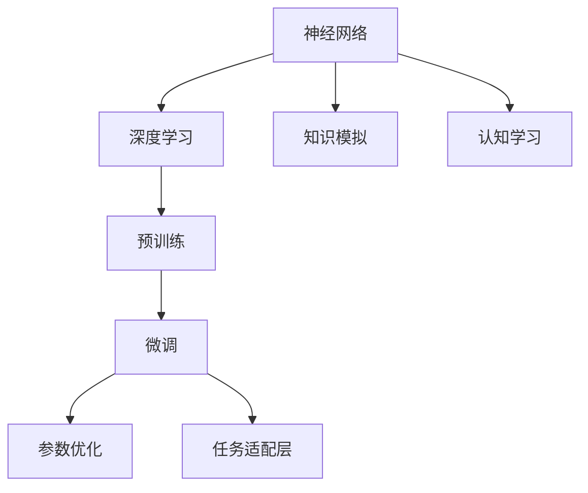

                 

# 知识的神经网络模型：模拟大脑学习的AI

> 关键词：神经网络,深度学习,大脑模型,知识模拟,认知学习

## 1. 背景介绍

### 1.1 问题由来

在当今信息爆炸的时代，如何高效地存储、处理和利用海量的知识，成为了一个亟待解决的问题。人工智能（AI）领域通过深度学习技术，提出了一种全新的解决方案：通过构建模拟人脑神经网络结构的知识模型，实现对复杂知识的自动学习、处理和应用。

神经网络模型不仅在计算机视觉、语音识别等领域取得了显著成果，还在自然语言处理（NLP）和知识表示等领域展现了巨大的潜力。近年来，随着大规模预训练语言模型的崛起，神经网络模型在知识学习和应用方面取得了革命性的进展。

### 1.2 问题核心关键点

为了更好地理解神经网络模型在知识模拟和应用中的原理与技术，本文将详细介绍其核心概念和应用流程。

1. **神经网络**：神经网络是一种通过模拟人脑神经元及其互连方式来处理数据的学习模型。
2. **深度学习**：深度学习是神经网络的一种特例，通过多层非线性变换来提取和表示数据的高级特征。
3. **知识模拟**：通过神经网络模拟大脑的学习机制，实现对复杂知识结构的自动发现和表示。
4. **认知学习**：深度学习模型通过模式识别和泛化，模拟人类认知过程，实现对知识的学习和应用。
5. **预训练**：在大规模无标签数据上预先训练神经网络，学习通用特征表示，提升模型性能。
6. **微调**：在特定任务上对预训练模型进行有监督训练，使其适应具体任务需求。

这些关键点共同构成了神经网络模型在知识表示和应用中的研究基础，本文将从这些核心概念出发，深入探讨其原理、算法和实践。

## 2. 核心概念与联系

### 2.1 核心概念概述

为了更好地理解神经网络模型在知识模拟和应用中的原理与技术，本文将详细介绍其核心概念和应用流程。

- **神经网络**：神经网络是一种通过模拟人脑神经元及其互连方式来处理数据的学习模型。
- **深度学习**：深度学习是神经网络的一种特例，通过多层非线性变换来提取和表示数据的高级特征。
- **知识模拟**：通过神经网络模拟大脑的学习机制，实现对复杂知识结构的自动发现和表示。
- **认知学习**：深度学习模型通过模式识别和泛化，模拟人类认知过程，实现对知识的学习和应用。
- **预训练**：在大规模无标签数据上预先训练神经网络，学习通用特征表示，提升模型性能。
- **微调**：在特定任务上对预训练模型进行有监督训练，使其适应具体任务需求。

这些核心概念之间的逻辑关系可以通过以下Mermaid流程图来展示：



这个流程图展示了大规模知识模拟中的核心概念及其之间的关系：

1. 神经网络通过深度学习模型提取和表示数据的高级特征。
2. 深度学习模型通过知识模拟，自动发现和表示复杂知识结构。
3. 知识模拟和深度学习模型通过认知学习，实现对知识的自动化学习与应用。
4. 预训练和微调技术在模型训练过程中发挥关键作用，提升了模型的性能和泛化能力。

这些概念共同构成了神经网络模型在知识表示和应用中的研究基础，理解这些概念有助于把握神经网络模型的核心原理和应用流程。

## 3. 核心算法原理 & 具体操作步骤

### 3.1 算法原理概述

神经网络模型通过多层非线性变换，实现对数据特征的自动提取和表示。深度学习模型通过堆叠多个非线性层，进一步提升了特征表示的复杂度和泛化能力。

在知识模拟和应用中，神经网络模型通过预训练和微调技术，自动发现和表示复杂知识结构，实现对知识的自动学习和应用。预训练和微调技术通过在大规模无标签和有标签数据上训练模型，提升了模型在特定任务上的性能和泛化能力。

### 3.2 算法步骤详解

神经网络模型的知识模拟和应用过程主要包括以下几个关键步骤：

**Step 1: 准备数据集**

- 收集大规模无标签数据集，用于神经网络模型的预训练。
- 收集特定任务的标注数据集，用于模型微调。

**Step 2: 设计网络结构**

- 选择合适的神经网络结构，如卷积神经网络（CNN）、循环神经网络（RNN）、变分自编码器（VAE）等。
- 设计网络的结构层次，包括输入层、隐藏层、输出层等。
- 确定每层的激活函数、损失函数、优化器等超参数。

**Step 3: 预训练**

- 在大规模无标签数据集上，使用无监督学习方法（如自编码、对抗训练等）预训练神经网络模型。
- 学习通用特征表示，提升模型的泛化能力。
- 优化模型参数，使得模型能够更好地表示数据特征。

**Step 4: 微调**

- 在特定任务的标注数据集上，使用有监督学习方法（如监督分类、回归等）微调神经网络模型。
- 适应特定任务需求，优化模型在特定任务上的性能。
- 通过任务适配层，调整模型输出，使其符合任务要求。

**Step 5: 测试与评估**

- 在测试集上评估模型性能，如准确率、召回率、F1-score等指标。
- 分析模型在特定任务上的表现，识别模型的优势和不足。
- 根据评估结果，调整模型参数和结构，进一步提升模型性能。

**Step 6: 应用**

- 将训练好的模型应用于实际任务中，实现知识模拟和应用。
- 持续收集新数据，定期微调模型，保持模型的时效性和适应性。

### 3.3 算法优缺点

神经网络模型在知识模拟和应用中具有以下优点：

1. **自适应能力**：神经网络模型能够自动发现和表示复杂知识结构，无需手动设计规则。
2. **泛化能力**：通过预训练和微调技术，神经网络模型能够在大规模数据上学习通用特征表示，提升泛化能力。
3. **高效性**：深度学习模型通过堆叠多个非线性层，实现对数据的高效表示和处理。
4. **可扩展性**：神经网络模型可以通过增加隐藏层、调整参数等手段，实现模型的可扩展和优化。

同时，神经网络模型也存在以下缺点：

1. **数据需求高**：神经网络模型需要大量标注数据进行微调，获取高质量标注数据的成本较高。
2. **计算复杂**：神经网络模型需要大量的计算资源进行训练和推理，对硬件设备要求较高。
3. **可解释性不足**：神经网络模型通常被视为"黑盒"系统，难以解释其内部工作机制和决策逻辑。
4. **对抗攻击敏感**：神经网络模型容易受到对抗样本的攻击，导致输出结果发生偏差。
5. **数据依赖性强**：神经网络模型对数据质量和分布的依赖性强，难以适应非结构化数据和噪声数据。

尽管存在这些缺点，神经网络模型在知识模拟和应用中仍具有显著的优势和应用前景。

### 3.4 算法应用领域

神经网络模型在知识模拟和应用中已经广泛应用于多个领域，如：

- **计算机视觉**：实现图像识别、目标检测、图像生成等任务。
- **自然语言处理**：实现文本分类、情感分析、机器翻译等任务。
- **语音识别**：实现语音转文本、文本转语音等任务。
- **推荐系统**：实现商品推荐、内容推荐等任务。
- **智能控制**：实现机器人控制、自动驾驶等任务。
- **生物信息学**：实现基因序列分析、蛋白质结构预测等任务。
- **医疗健康**：实现疾病诊断、药物研发等任务。

这些领域的应用展示了神经网络模型在知识模拟和应用中的广泛潜力和强大能力。

## 4. 数学模型和公式 & 详细讲解 & 举例说明

### 4.1 数学模型构建

神经网络模型的数学模型可以表示为：

$$
f(x) = W_1 \cdot g(W_2 \cdot g(...W_n \cdot x...))
$$

其中，$x$ 为输入向量，$W_i$ 为第$i$层权重矩阵，$g$ 为激活函数。

在知识模拟和应用中，深度学习模型通过多层非线性变换，实现对数据的高级特征提取和表示。例如，在图像识别任务中，卷积神经网络通过卷积层和池化层提取图像的局部特征，并通过全连接层进行分类。

### 4.2 公式推导过程

以卷积神经网络（CNN）为例，推导其卷积层和池化层的数学公式。

卷积层通过卷积核在输入数据上滑动，提取局部特征。假设输入数据为 $X$，卷积核为 $K$，步长为 $s$，则卷积层的输出 $Y$ 可以表示为：

$$
Y(i, j) = \sum_{m=0}^{h-1} \sum_{n=0}^{w-1} X(i+m, j+n) \cdot K(m, n)
$$

其中，$h$ 为卷积核高度，$w$ 为卷积核宽度。

池化层通过对卷积层输出进行下采样，降低特征维度。常用的池化操作包括最大池化和平均池化。假设池化窗口大小为 $w$，步长为 $s$，则最大池化操作的输出 $Y$ 可以表示为：

$$
Y(i, j) = \max\limits_{m=0}^{w-1} X(i, j+m)
$$

### 4.3 案例分析与讲解

以下以图像分类任务为例，介绍如何使用卷积神经网络进行知识模拟和应用。

1. **数据准备**

   - 收集大规模图像数据集，如ImageNet。
   - 将数据集划分为训练集、验证集和测试集。

2. **模型设计**

   - 选择卷积神经网络结构，如LeNet、AlexNet、VGG等。
   - 设计网络的结构层次，包括卷积层、池化层、全连接层等。
   - 确定每层的激活函数、损失函数、优化器等超参数。

3. **预训练**

   - 在ImageNet数据集上进行预训练，学习通用特征表示。
   - 使用无监督学习方法（如自编码、对抗训练等）优化模型参数。

4. **微调**

   - 在特定任务的标注数据集上，使用有监督学习方法进行微调。
   - 设计任务适配层，调整模型输出，使其符合任务要求。
   - 通过反向传播算法优化模型参数。

5. **测试与评估**

   - 在测试集上评估模型性能，如准确率、召回率、F1-score等指标。
   - 分析模型在特定任务上的表现，识别模型的优势和不足。
   - 根据评估结果，调整模型参数和结构，进一步提升模型性能。

6. **应用**

   - 将训练好的模型应用于实际任务中，实现图像分类。
   - 持续收集新数据，定期微调模型，保持模型的时效性和适应性。

## 5. 项目实践：代码实例和详细解释说明

### 5.1 开发环境搭建

在进行神经网络模型的知识模拟和应用实践前，我们需要准备好开发环境。以下是使用Python进行TensorFlow开发的环境配置流程：

1. 安装Anaconda：从官网下载并安装Anaconda，用于创建独立的Python环境。

2. 创建并激活虚拟环境：
```bash
conda create -n tf-env python=3.8 
conda activate tf-env
```

3. 安装TensorFlow：根据CUDA版本，从官网获取对应的安装命令。例如：
```bash
conda install tensorflow -c tensorflow -c conda-forge
```

4. 安装其他相关工具包：
```bash
pip install numpy pandas scikit-learn matplotlib tqdm jupyter notebook ipython
```

完成上述步骤后，即可在`tf-env`环境中开始神经网络模型的知识模拟和应用实践。

### 5.2 源代码详细实现

以下是使用TensorFlow实现卷积神经网络进行图像分类的代码示例：

```python
import tensorflow as tf
from tensorflow.keras import datasets, layers, models

# 加载数据集
(train_images, train_labels), (test_images, test_labels) = datasets.cifar10.load_data()

# 数据预处理
train_images, test_images = train_images / 255.0, test_images / 255.0

# 定义模型
model = models.Sequential([
    layers.Conv2D(32, (3, 3), activation='relu', input_shape=(32, 32, 3)),
    layers.MaxPooling2D((2, 2)),
    layers.Conv2D(64, (3, 3), activation='relu'),
    layers.MaxPooling2D((2, 2)),
    layers.Conv2D(64, (3, 3), activation='relu'),
    layers.Flatten(),
    layers.Dense(64, activation='relu'),
    layers.Dense(10)
])

# 编译模型
model.compile(optimizer='adam',
              loss=tf.keras.losses.SparseCategoricalCrossentropy(from_logits=True),
              metrics=['accuracy'])

# 训练模型
model.fit(train_images, train_labels, epochs=10, 
          validation_data=(test_images, test_labels))

# 评估模型
test_loss, test_acc = model.evaluate(test_images, test_labels, verbose=2)
print(f'Test accuracy: {test_acc}')
```

以上代码实现了一个简单的卷积神经网络模型，用于图像分类任务。

### 5.3 代码解读与分析

让我们再详细解读一下关键代码的实现细节：

**数据加载与预处理**：
- 使用TensorFlow内置的CIFAR-10数据集，加载训练集和测试集。
- 将像素值归一化到0-1之间，加速模型训练。

**模型定义**：
- 使用Sequential模型定义卷积神经网络结构，包括卷积层、池化层、全连接层等。
- 每层激活函数和损失函数的选择，影响模型性能和泛化能力。

**模型编译与训练**：
- 使用Adam优化器，交叉熵损失函数进行模型编译。
- 在训练集上进行模型训练，验证集用于评估模型性能。
- 重复多次训练，直到模型收敛。

**模型评估**：
- 在测试集上评估模型性能，输出准确率等指标。
- 分析模型在测试集上的表现，识别模型的优势和不足。

**模型应用**：
- 将训练好的模型应用于实际图像分类任务中。
- 持续收集新数据，定期微调模型，保持模型的时效性和适应性。

## 6. 实际应用场景

### 6.1 计算机视觉

卷积神经网络（CNN）在计算机视觉领域已经取得了巨大的成功。以下是几个实际应用场景：

1. **图像识别**：实现手写数字识别、物体识别等任务。
2. **目标检测**：实现人脸识别、车辆检测等任务。
3. **图像生成**：实现图像超分辨率、图像修复等任务。
4. **视频分析**：实现视频分类、行为识别等任务。

### 6.2 自然语言处理

循环神经网络（RNN）和长短期记忆网络（LSTM）在自然语言处理领域也有广泛应用。以下是几个实际应用场景：

1. **文本分类**：实现新闻分类、情感分析等任务。
2. **机器翻译**：实现中英文翻译、多语种翻译等任务。
3. **语言模型**：实现自动文本生成、对话系统等任务。
4. **知识图谱**：实现知识抽取、知识推理等任务。

### 6.3 推荐系统

神经网络模型在推荐系统中的应用也非常广泛。以下是几个实际应用场景：

1. **商品推荐**：实现电商平台的商品推荐、个性化广告等任务。
2. **内容推荐**：实现视频网站的内容推荐、新闻推荐等任务。
3. **用户画像**：实现用户兴趣画像、行为分析等任务。

### 6.4 未来应用展望

随着神经网络模型的不断发展和应用，未来的知识模拟和应用将呈现以下几个趋势：

1. **多模态学习**：结合视觉、语音、文本等多模态数据，提升模型的表达能力和泛化能力。
2. **自适应学习**：根据数据分布的变化，动态调整模型结构和参数，提高模型的适应性和鲁棒性。
3. **零样本学习**：通过预训练模型和任务描述，实现零样本学习，提升模型的泛化能力。
4. **迁移学习**：利用预训练模型的知识，进行领域迁移，提升模型在新领域的性能。
5. **可解释性**：提升模型的可解释性和可解释性，增强用户信任和模型应用范围。
6. **隐私保护**：在模型训练和应用过程中，保护用户隐私和数据安全。

## 7. 工具和资源推荐

### 7.1 学习资源推荐

为了帮助开发者系统掌握神经网络模型的知识模拟和应用技术，这里推荐一些优质的学习资源：

1. **深度学习入门**：《深度学习》（Ian Goodfellow），全面介绍深度学习的基本概念和经典模型。
2. **TensorFlow官方文档**：TensorFlow官方文档，提供丰富的教程和代码示例，帮助开发者快速上手。
3. **PyTorch官方文档**：PyTorch官方文档，提供完整的库文档和代码示例，支持深度学习模型的构建和应用。
4. **自然语言处理课程**：斯坦福大学的CS224N课程，提供自然语言处理的基础知识和最新技术。
5. **计算机视觉课程**：斯坦福大学的CS231n课程，提供计算机视觉的最新研究成果和实践经验。

通过对这些资源的学习实践，相信你一定能够快速掌握神经网络模型的核心原理和应用技巧，并用于解决实际的NLP问题。

### 7.2 开发工具推荐

高效的开发离不开优秀的工具支持。以下是几款用于神经网络模型知识模拟和应用的常用工具：

1. **TensorFlow**：由Google主导开发的开源深度学习框架，支持GPU/TPU等高性能设备，生产部署方便。
2. **PyTorch**：Facebook开源的深度学习框架，灵活动态计算图，支持Python和C++，适合研究性开发。
3. **Keras**：谷歌开发的深度学习框架，简单易用，支持多种后端（如TensorFlow、Theano等），适合快速原型开发。
4. **MXNet**：亚马逊开发的深度学习框架，支持多种语言（如Python、R、Scala等），适合分布式训练和生产部署。
5. **TensorBoard**：TensorFlow配套的可视化工具，实时监测模型训练状态，提供丰富的图表呈现方式。
6. **Weights & Biases**：模型训练的实验跟踪工具，记录和可视化模型训练过程中的各项指标，方便对比和调优。

合理利用这些工具，可以显著提升神经网络模型知识模拟和应用任务的开发效率，加快创新迭代的步伐。

### 7.3 相关论文推荐

神经网络模型在知识模拟和应用中不断发展，以下是几篇奠基性的相关论文，推荐阅读：

1. **AlexNet**：2012年ImageNet图像识别比赛冠军，提出卷积神经网络结构。
2. **Inception**：2014年ImageNet图像识别比赛冠军，提出Inception模块，提升特征表示能力。
3. **ResNet**：2015年ImageNet图像识别比赛冠军，提出残差连接，解决深层网络退化问题。
4. **LSTM**：2012年ICML论文，提出长短期记忆网络，提升序列数据建模能力。
5. **Transformer**：2017年NIPS论文，提出自注意力机制，提升序列数据建模能力。
6. **BERT**：2018年ACL论文，提出预训练语言模型，提升NLP任务的性能。
7. **GPT-2**：2019年NIPS论文，提出大规模语言模型，提升自然语言生成能力。

这些论文代表了大规模神经网络模型的发展脉络，通过学习这些前沿成果，可以帮助研究者把握神经网络模型的核心原理和应用方法。

## 8. 总结：未来发展趋势与挑战

### 8.1 总结

本文对神经网络模型的知识模拟和应用进行了全面系统的介绍。首先阐述了神经网络模型的研究背景和意义，明确了其在知识模拟和应用中的独特价值。其次，从原理到实践，详细讲解了神经网络模型的数学模型和算法步骤，给出了神经网络模型知识模拟和应用的完整代码示例。同时，本文还广泛探讨了神经网络模型在计算机视觉、自然语言处理、推荐系统等多个领域的应用前景，展示了神经网络模型在知识模拟和应用中的广泛潜力和强大能力。此外，本文精选了神经网络模型的各类学习资源，力求为读者提供全方位的技术指引。

通过本文的系统梳理，可以看到，神经网络模型在知识模拟和应用中具有显著的优势和应用前景。其通过深度学习技术，实现对复杂知识结构的自动发现和表示，在多个领域展示了强大的应用能力。未来，伴随深度学习技术的发展和应用，神经网络模型将在知识模拟和应用中发挥更大的作用，推动人工智能技术的进一步发展。

### 8.2 未来发展趋势

展望未来，神经网络模型的知识模拟和应用将呈现以下几个发展趋势：

1. **多模态学习**：结合视觉、语音、文本等多模态数据，提升模型的表达能力和泛化能力。
2. **自适应学习**：根据数据分布的变化，动态调整模型结构和参数，提高模型的适应性和鲁棒性。
3. **零样本学习**：通过预训练模型和任务描述，实现零样本学习，提升模型的泛化能力。
4. **迁移学习**：利用预训练模型的知识，进行领域迁移，提升模型在新领域的性能。
5. **可解释性**：提升模型的可解释性和可解释性，增强用户信任和模型应用范围。
6. **隐私保护**：在模型训练和应用过程中，保护用户隐私和数据安全。

以上趋势凸显了神经网络模型在知识模拟和应用中的广阔前景。这些方向的探索发展，必将进一步提升神经网络模型的性能和应用范围，为人工智能技术的进一步发展提供新的动力。

### 8.3 面临的挑战

尽管神经网络模型在知识模拟和应用中已经取得了显著成就，但在迈向更加智能化、普适化应用的过程中，仍然面临诸多挑战：

1. **数据依赖性强**：神经网络模型对数据质量和分布的依赖性强，难以适应非结构化数据和噪声数据。
2. **计算资源消耗高**：神经网络模型需要大量的计算资源进行训练和推理，对硬件设备要求较高。
3. **可解释性不足**：神经网络模型通常被视为"黑盒"系统，难以解释其内部工作机制和决策逻辑。
4. **对抗攻击敏感**：神经网络模型容易受到对抗样本的攻击，导致输出结果发生偏差。
5. **隐私保护不足**：在模型训练和应用过程中，数据隐私和安全问题亟需解决。

尽管存在这些挑战，神经网络模型在知识模拟和应用中仍具有显著的优势和应用前景。未来的研究需要在以下几个方面寻求新的突破：

1. **数据增强**：通过数据增强技术，提升模型的泛化能力和鲁棒性。
2. **模型压缩**：通过模型压缩和量化技术，降低计算资源消耗，提高模型效率。
3. **可解释性**：通过可解释性技术，增强模型的可解释性和可解释性，增强用户信任和模型应用范围。
4. **隐私保护**：通过差分隐私、联邦学习等技术，保护用户隐私和数据安全。

这些研究方向将帮助神经网络模型更好地应用于实际问题，推动其进一步发展和应用。

### 8.4 研究展望

面对神经网络模型知识模拟和应用所面临的挑战，未来的研究需要在以下几个方面寻求新的突破：

1. **多模态学习**：结合视觉、语音、文本等多模态数据，提升模型的表达能力和泛化能力。
2. **自适应学习**：根据数据分布的变化，动态调整模型结构和参数，提高模型的适应性和鲁棒性。
3. **零样本学习**：通过预训练模型和任务描述，实现零样本学习，提升模型的泛化能力。
4. **迁移学习**：利用预训练模型的知识，进行领域迁移，提升模型在新领域的性能。
5. **可解释性**：提升模型的可解释性和可解释性，增强用户信任和模型应用范围。
6. **隐私保护**：在模型训练和应用过程中，保护用户隐私和数据安全。

这些研究方向将帮助神经网络模型更好地应用于实际问题，推动其进一步发展和应用。相信随着研究的深入和技术的进步，神经网络模型将在知识模拟和应用中发挥更大的作用，为人工智能技术的进一步发展提供新的动力。

## 9. 附录：常见问题与解答

**Q1: 神经网络模型在知识模拟和应用中具有哪些优势？**

A: 神经网络模型在知识模拟和应用中具有以下优势：

1. **自适应能力**：能够自动发现和表示复杂知识结构，无需手动设计规则。
2. **泛化能力**：通过预训练和微调技术，学习通用特征表示，提升泛化能力。
3. **高效性**：通过堆叠多个非线性层，实现对数据的高效表示和处理。
4. **可扩展性**：通过增加隐藏层、调整参数等手段，实现模型的可扩展和优化。

**Q2: 神经网络模型在实际应用中面临哪些挑战？**

A: 神经网络模型在实际应用中面临以下挑战：

1. **数据依赖性强**：对数据质量和分布的依赖性强，难以适应非结构化数据和噪声数据。
2. **计算资源消耗高**：需要大量的计算资源进行训练和推理，对硬件设备要求较高。
3. **可解释性不足**：通常被视为"黑盒"系统，难以解释其内部工作机制和决策逻辑。
4. **对抗攻击敏感**：容易受到对抗样本的攻击，导致输出结果发生偏差。
5. **隐私保护不足**：在模型训练和应用过程中，数据隐私和安全问题亟需解决。

**Q3: 如何提升神经网络模型的可解释性？**

A: 提升神经网络模型的可解释性，可以采用以下方法：

1. **可视化技术**：使用可视化工具，如TensorBoard，展示模型训练和推理过程，帮助理解模型行为。
2. **可解释性算法**：采用可解释性算法，如LIME、SHAP等，分析模型特征重要性和决策过程。
3. **模型简化**：使用模型简化技术，如知识蒸馏、模型压缩等，降低模型复杂度，增强可解释性。

**Q4: 如何在实际应用中保护用户隐私？**

A: 在实际应用中，保护用户隐私可以采用以下方法：

1. **差分隐私**：在模型训练过程中，加入噪声干扰，保护用户数据隐私。
2. **联邦学习**：在多设备分布式训练过程中，保护用户数据隐私，避免数据泄露。
3. **匿名化技术**：对用户数据进行匿名化处理，避免直接暴露用户个人信息。

**Q5: 如何优化神经网络模型的计算效率？**

A: 优化神经网络模型的计算效率，可以采用以下方法：

1. **模型压缩**：通过剪枝、量化等技术，降低模型参数量和计算复杂度。
2. **并行计算**：使用分布式计算和并行计算技术，提高模型训练和推理效率。
3. **硬件加速**：使用GPU、TPU等高性能设备，加速模型训练和推理过程。

---

作者：禅与计算机程序设计艺术 / Zen and the Art of Computer Programming

