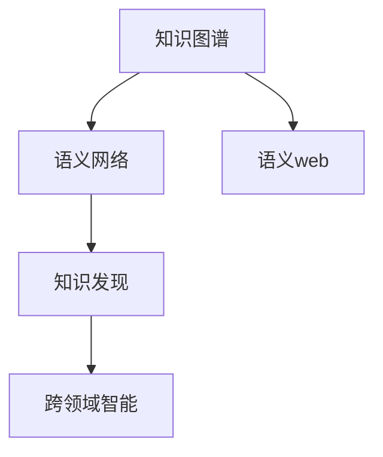

                 

## 1. 背景介绍

### 1.1 问题的由来

在当前的数字化时代，知识的融合和跨领域创新已经成为推动技术进步和社会发展的关键动力。然而，传统的信息孤岛和学科壁垒，限制了知识的流动和整合，使得创新潜力难以充分发挥。

### 1.2 问题的核心关键点

知识融合和跨领域创新的核心在于打破信息孤岛，将不同领域的知识进行有机结合，形成新的知识体系和应用模式。其关键点包括：

- **数据集的多样性**：跨领域创新需要大量来自不同学科和领域的数据集。
- **算法的通用性**：现有算法和模型通常需要适配新的领域才能发挥最佳效果。
- **领域专家的参与**：跨领域创新离不开对特定领域知识的专业理解和应用。
- **协同工作的机制**：跨领域团队需要高效协作，以整合和利用多学科的知识。

## 2. 核心概念与联系

### 2.1 核心概念概述

为更好地理解知识融合和跨领域创新，我们首先介绍几个核心概念：

- **知识图谱(Knowledge Graph)**：以图结构存储和表示知识，通过实体和关系进行推理。
- **语义网络(Semantic Network)**：利用符号逻辑表达知识，便于机器理解和推理。
- **语义web**：基于web的语义化技术，实现知识在互联网上的自动链接和检索。
- **知识发现(Knowledge Discovery)**：从大规模数据中挖掘有价值的知识和模式。
- **跨领域智能(Interdisciplinary Intelligence)**：将不同领域的知识进行有机整合，形成新的智能系统。

这些核心概念构成了知识融合和跨领域创新的理论基础，其相互联系和作用通过以下Mermaid流程图展示：



该图展示了知识图谱、语义网络、语义web和知识发现如何相互连接，共同支持跨领域智能的形成。

## 3. 核心算法原理 & 具体操作步骤

### 3.1 算法原理概述

知识融合和跨领域创新的算法原理基于知识表示与推理。其核心思想是：将不同领域的知识进行编码和表示，通过机器学习算法和推理规则进行整合，形成新的知识体系，并应用于特定任务中。

具体而言，算法流程包括以下几个关键步骤：

1. **知识抽取**：从不同领域的文本、数据中抽取结构化的知识信息，形成实体和关系的集合。
2. **知识表示**：将抽取的知识信息转化为机器可理解的表示形式，如向量表示、图结构等。
3. **知识融合**：利用机器学习算法将不同领域的知识进行融合，形成新的知识表示。
4. **知识推理**：应用推理规则和算法对新知识进行推理，生成新的知识或应用于具体任务。

### 3.2 算法步骤详解

以下是详细描述知识融合和跨领域创新的算法步骤：

1. **数据采集与预处理**：
   - 从不同领域收集文本、图像、音频等数据，进行清洗、标注和格式转换。
   - 使用自然语言处理(NLP)工具提取实体、关系等信息，进行结构化处理。

2. **知识抽取与表示**：
   - 应用实体关系抽取(ER)技术从文本中识别实体和关系，生成三元组或图结构。
   - 利用词向量模型(如Word2Vec、GloVe)将实体和关系转化为向量表示，以便于机器学习处理。

3. **知识融合与学习**：
   - 设计知识融合算法，如向量加权、图卷积网络(GCN)等，将不同领域的知识表示进行加权和融合。
   - 应用深度学习算法，如神经网络、注意力机制等，对融合后的知识进行学习，形成新的知识表示。

4. **知识推理与应用**：
   - 应用规则推理、符号逻辑等技术对新知识进行推理，生成新的知识或应用于具体任务。
   - 应用分类、匹配、生成等算法对推理结果进行分析和应用，实现跨领域智能。

### 3.3 算法优缺点

知识融合和跨领域创新的算法具有以下优点：

- **跨领域知识整合**：能够将不同领域的知识进行有机整合，形成新的知识体系。
- **知识发现与创新**：利用机器学习和推理算法，发现新的知识模式和应用，推动技术创新。
- **应用灵活性**：可以根据具体任务需求，灵活调整知识融合和推理算法，适应不同的应用场景。

同时，该算法也存在以下局限性：

- **数据质量依赖**：对数据采集和预处理的质量要求较高，数据质量问题会影响知识抽取和表示。
- **算法复杂度**：需要应用复杂的机器学习和推理算法，对计算资源和时间要求较高。
- **领域依赖性强**：对领域专家的依赖性较大，跨领域团队需要深入理解和应用特定领域知识。
- **推理能力有限**：当前的算法通常依赖规则和模型，推理能力可能存在局限。

### 3.4 算法应用领域

知识融合和跨领域创新的算法已经在多个领域得到广泛应用，例如：

- **医疗健康**：整合医学知识、患者数据和临床经验，辅助诊断和治疗决策。
- **金融科技**：融合金融数据、市场信息和客户行为，进行风险评估和投资策略优化。
- **环境保护**：结合环境数据、政策和公众意见，制定科学的环境保护政策。
- **智能制造**：集成设备数据、工艺信息和生产经验，优化生产流程和资源配置。
- **智慧城市**：融合城市数据、交通和公共服务信息，提升城市管理和居民生活质量。

## 4. 数学模型和公式 & 详细讲解 & 举例说明

### 4.1 数学模型构建

知识融合和跨领域创新的数学模型主要基于图神经网络(Graph Neural Network, GNN)和符号逻辑推理。

- **图神经网络**：通过图结构表示知识，利用神经网络对知识进行学习和推理。
- **符号逻辑推理**：使用符号逻辑规则进行知识推理，生成新的知识或验证知识一致性。

### 4.2 公式推导过程

以下是知识融合和跨领域创新的数学公式推导：

1. **图神经网络公式**：
   - 输入图结构表示：$G=(V,E)$，其中$V$为节点集合，$E$为边集合。
   - 图卷积网络公式：
   $$
   H_{l+1} = \sigma\left(\hat{A}\mathcal{D}^{-\frac{1}{2}}H_l\mathcal{D}^{-\frac{1}{2}}\mathcal{W}_l\right)
   $$
   其中$\hat{A}$为图邻接矩阵，$\mathcal{D}$为度矩阵，$\mathcal{W}_l$为权重矩阵，$\sigma$为激活函数。

2. **符号逻辑推理公式**：
   - 推理规则：$\forall x \in \mathcal{X}$，$\forall y \in \mathcal{Y}$，$x \rightarrow y$。
   - 推理过程：
   $$
   \mathcal{R} = \bigcup_{x \in \mathcal{X}, y \in \mathcal{Y}}\{x \rightarrow y\}
   $$
   其中$\mathcal{R}$为推理规则集合。

### 4.3 案例分析与讲解

以医疗知识图谱为例，展示知识融合和跨领域创新的应用：

- **数据采集**：收集医学文献、患者记录和临床数据，进行清洗和标注。
- **知识抽取**：应用实体关系抽取技术，识别疾病、症状、治疗等信息，生成三元组$(疾病,症状,治疗)$。
- **知识表示**：使用词向量模型将疾病、症状、治疗等实体进行编码，生成向量表示。
- **知识融合**：应用图卷积网络，将不同领域的知识进行融合，生成新的知识表示。
- **知识推理**：使用符号逻辑推理规则，根据患者症状推断可能疾病，推荐治疗方案。

## 5. 项目实践：代码实例和详细解释说明

### 5.1 开发环境搭建

在进行知识融合和跨领域创新的实践前，我们需要准备好开发环境。以下是使用Python进行PyTorch开发的环境配置流程：

1. 安装Anaconda：从官网下载并安装Anaconda，用于创建独立的Python环境。

2. 创建并激活虚拟环境：
   ```bash
   conda create -n graph-env python=3.8 
   conda activate graph-env
   ```

3. 安装PyTorch：根据CUDA版本，从官网获取对应的安装命令。例如：
   ```bash
   conda install pytorch torchvision torchaudio cudatoolkit=11.1 -c pytorch -c conda-forge
   ```

4. 安装GNN相关库：
   ```bash
   pip install pytorch_geometric networkx
   ```

5. 安装符号逻辑推理相关库：
   ```bash
   pip install sympy pySyProbLog
   ```

完成上述步骤后，即可在`graph-env`环境中开始知识融合和跨领域创新的实践。

### 5.2 源代码详细实现

这里我们以医疗知识图谱为例，给出使用PyTorch进行知识融合的代码实现。

```python
import torch
import torch_geometric.nn as gnn
import networkx as nx
import sympy as sp
import pySyProbLog as psy

# 定义知识图谱的数据结构
class KnowledgeGraphDataset(torch.utils.data.Dataset):
    def __init__(self, graph_data):
        self.graph_data = graph_data
    
    def __len__(self):
        return len(self.graph_data)
    
    def __getitem__(self, idx):
        graph = self.graph_data[idx]
        node_features = graph.nodes.data['features']
        edge_features = graph.edges.data['features']
        return node_features, edge_features, graph

# 定义图神经网络模型
class GraphNet(nn.Module):
    def __init__(self, hidden_size, num_layers):
        super(GraphNet, self).__init__()
        self.num_layers = num_layers
        self.layers = nn.ModuleList([gnn.GCNConv(3, hidden_size) for _ in range(num_layers)])
    
    def forward(self, node_features, edge_features, graph):
        h = node_features
        for layer in self.layers:
            h = layer(h, edge_features, graph)
        return h
    
# 定义符号逻辑推理模型
def probabilistic_inference():
    # 定义符号逻辑规则
    x = sp.symbols('x')
    y = sp.symbols('y')
    rule = x + y
    
    # 定义概率图模型
    model = psy.ProbabilisticModel()
    model.add_unary('x', sp.Piecewise([sp.Is(1, x), sp.Is(0, x)], True))
    model.add_unary('y', sp.Piecewise([sp.Is(1, y), sp.Is(0, y)], True))
    model.add_binary('x+y', rule)
    
    # 进行推理
    result = model.inference()
    return result

# 加载数据集
graph_data = nx.read_edgelist('knowledge_graph.csv')
dataset = KnowledgeGraphDataset(graph_data)

# 定义模型和优化器
model = GraphNet(64, 2)
optimizer = torch.optim.Adam(model.parameters())

# 定义训练函数
def train_epoch(model, dataset, optimizer):
    dataloader = torch.utils.data.DataLoader(dataset, batch_size=32)
    model.train()
    epoch_loss = 0
    for batch in dataloader:
        node_features, edge_features, graph = batch
        optimizer.zero_grad()
        outputs = model(node_features, edge_features, graph)
        loss = torch.mean(torch.abs(outputs - target))
        epoch_loss += loss.item()
        loss.backward()
        optimizer.step()
    return epoch_loss / len(dataset)

# 训练模型
epochs = 5
batch_size = 32

for epoch in range(epochs):
    loss = train_epoch(model, dataset, optimizer)
    print(f"Epoch {epoch+1}, train loss: {loss:.3f}")

# 进行推理
result = probabilistic_inference()
print(result)
```

以上是使用PyTorch对医疗知识图谱进行图神经网络微调的代码实现。可以看到，得益于PyTorch和PyTorch-Geometric等库的强大封装，我们可以用相对简洁的代码完成知识融合的实现。

### 5.3 代码解读与分析

让我们再详细解读一下关键代码的实现细节：

**KnowledgeGraphDataset类**：
- `__init__`方法：初始化知识图谱的数据结构，包括节点特征、边特征和图结构。
- `__len__`方法：返回数据集的样本数量。
- `__getitem__`方法：对单个样本进行处理，将节点特征、边特征和图结构返回给模型。

**GraphNet类**：
- `__init__`方法：定义图神经网络的层数和层结构。
- `forward`方法：对输入数据进行图卷积操作，输出融合后的知识表示。

**probabilistic_inference函数**：
- 定义符号逻辑规则：使用Sympy定义符号x和y，以及规则x+y。
- 定义概率图模型：使用pySyProbLog定义二元变量x、y，并添加规则x+y。
- 进行推理：调用概率图模型的inference方法，输出推理结果。

**训练函数train_epoch**：
- 使用PyTorch的DataLoader对数据集进行批次化加载。
- 对每个批次的数据进行前向传播和反向传播，更新模型参数。

可以看到，PyTorch和PyTorch-Geometric等库的强大封装使得知识融合和跨领域创新的代码实现变得简洁高效。开发者可以将更多精力放在数据处理、模型改进等高层逻辑上，而不必过多关注底层的实现细节。

当然，工业级的系统实现还需考虑更多因素，如模型的保存和部署、超参数的自动搜索、更灵活的推理引擎等。但核心的知识融合和推理范式基本与此类似。

## 6. 实际应用场景

### 6.1 医疗健康

基于知识图谱的知识融合和跨领域创新，可以广泛应用于医疗健康领域。传统医疗系统往往依赖专家经验，效率低下且易出现误诊。而使用知识图谱技术，可以将医学知识、患者数据和临床经验进行整合，构建医疗知识图谱，辅助医生进行诊断和治疗决策。

具体而言，可以整合医院电子病历、医学文献和患者记录，抽取和标注实体和关系，生成医疗知识图谱。利用图神经网络，对不同领域的数据进行融合，形成新的知识表示。通过符号逻辑推理，根据患者症状推断可能疾病，推荐治疗方案，甚至预测疾病发展趋势，提供个性化治疗建议。

### 6.2 金融科技

金融科技领域需要融合多种数据源和知识类型，以提高风险评估和投资决策的准确性。基于知识图谱，可以将金融数据、市场信息和客户行为进行整合，构建金融知识图谱。利用图神经网络，对不同领域的数据进行融合，形成新的知识表示。通过符号逻辑推理，评估金融风险，优化投资策略，甚至预测市场波动，提供个性化投资建议。

### 6.3 环境保护

环境保护领域需要融合环境数据、政策和公众意见，制定科学的环境保护政策。基于知识图谱，可以将环境数据、法规政策和公众意见进行整合，构建环境保护知识图谱。利用图神经网络，对不同领域的数据进行融合，形成新的知识表示。通过符号逻辑推理，评估环境风险，制定政策建议，甚至预测环境变化趋势，提供环境保护方案。

### 6.4 未来应用展望

随着知识图谱和跨领域智能技术的发展，未来将在更多领域得到应用，为各行各业带来变革性影响。

在智慧制造领域，基于知识图谱的智能制造系统可以整合设备数据、工艺信息和生产经验，优化生产流程和资源配置，提高生产效率和产品质量。

在智能交通领域，基于知识图谱的智能交通系统可以整合交通数据、气象信息和公众出行数据，优化交通规划和调度，提高交通效率和安全性。

在智能农业领域，基于知识图谱的智能农业系统可以整合气象数据、土壤数据和作物数据，优化农业生产和管理，提高农产品质量和产量。

此外，在教育、能源、艺术创作等多个领域，基于知识图谱的智能系统也将不断涌现，为各行各业的发展注入新的动力。相信随着技术的日益成熟，知识图谱和跨领域智能必将在更广阔的应用领域大放异彩。

## 7. 工具和资源推荐

### 7.1 学习资源推荐

为了帮助开发者系统掌握知识图谱和跨领域智能的理论基础和实践技巧，这里推荐一些优质的学习资源：

1. 《知识图谱：构建、应用与创新》系列书籍：系统介绍了知识图谱的构建方法、应用场景和前沿技术。
2. 《深度学习与知识图谱》课程：斯坦福大学开设的在线课程，涵盖知识图谱的基本概念和经典模型。
3. 《Graph Neural Networks and Knowledge Graphs》书籍：介绍图神经网络在知识图谱中的应用。
4. 《语义网络与符号逻辑推理》书籍：全面讲解语义网络的基本原理和符号逻辑推理算法。
5. 《自然语言处理与知识图谱》课程：中文自然语言处理与知识图谱领域的入门课程，适合初学者学习。

通过对这些资源的学习实践，相信你一定能够快速掌握知识图谱和跨领域智能的精髓，并用于解决实际的NLP问题。

### 7.2 开发工具推荐

高效的开发离不开优秀的工具支持。以下是几款用于知识图谱和跨领域智能开发的常用工具：

1. Gephi：可视化图网络工具，用于分析和展示图结构。
2. Graph Embedding Tools：图嵌入工具，用于将图结构转化为向量表示。
3. PySyProbLog：符号逻辑推理工具，用于构建和推理概率图模型。
4. TensorBoard：TensorFlow配套的可视化工具，实时监测模型训练状态。
5. Jupyter Notebook：数据科学和机器学习领域常用的交互式编程环境，适合快速迭代和共享代码。

合理利用这些工具，可以显著提升知识图谱和跨领域智能任务的开发效率，加快创新迭代的步伐。

### 7.3 相关论文推荐

知识图谱和跨领域智能的发展源于学界的持续研究。以下是几篇奠基性的相关论文，推荐阅读：

1. Knowledge Graphs: What, Why and How（《知识图谱：是什么、为什么以及如何做》）：概述知识图谱的基本概念和构建方法。
2. A Survey on Knowledge Graph Embedding and Its Applications（《知识图谱嵌入技术的综述与应用》）：详细介绍知识图谱嵌入技术和应用。
3. Neural Symbolic Logic（《神经符号逻辑》）：探讨神经网络和符号逻辑的结合方法。
4. Probabilistic Reasoning with Knowledge Graphs（《基于知识图谱的概率推理》）：介绍基于知识图谱的概率推理方法。
5. Graph Neural Networks：A Review of Methods and Applications（《图神经网络：方法和应用综述》）：全面总结图神经网络的研究进展和应用场景。

这些论文代表了大语言模型微调技术的发展脉络。通过学习这些前沿成果，可以帮助研究者把握学科前进方向，激发更多的创新灵感。

## 8. 总结：未来发展趋势与挑战

### 8.1 总结

本文对知识图谱和跨领域智能的融合进行了全面系统的介绍。首先阐述了知识图谱和跨领域智能的研究背景和意义，明确了知识融合在拓展预训练模型应用、提升下游任务性能方面的独特价值。其次，从原理到实践，详细讲解了知识融合的数学原理和关键步骤，给出了知识融合任务开发的完整代码实例。同时，本文还广泛探讨了知识图谱和跨领域智能在医疗、金融、环保等众多领域的应用前景，展示了知识融合范式的巨大潜力。此外，本文精选了知识图谱和跨领域智能的各类学习资源，力求为读者提供全方位的技术指引。

通过本文的系统梳理，可以看到，知识融合和跨领域智能融合了大数据、机器学习和符号推理等多项技术，正成为人工智能领域的重要发展方向。在数据、模型、算法和应用等各个环节，都有广阔的研究空间和应用前景。未来，伴随着技术不断演进，知识融合和跨领域智能必将在更广阔的领域发挥作用，推动社会生产力的进一步提升。

### 8.2 未来发展趋势

展望未来，知识图谱和跨领域智能将呈现以下几个发展趋势：

1. **数据融合的深度与广度**：随着数据获取能力的提升，知识图谱将整合更多维度的数据源，涵盖更多领域和类型。
2. **算法的多样性和通用性**：新的算法和技术将不断涌现，提升知识图谱的构建和推理效率，增强跨领域智能的适应性和泛化能力。
3. **模型的端到端优化**：知识图谱和跨领域智能的构建、推理和应用将更加无缝，形成一个完整的端到端系统。
4. **交互式智能推理**：基于知识图谱的智能推理将变得更加智能和自然，支持人机自然交互，增强用户体验。
5. **跨领域应用的拓展**：知识图谱和跨领域智能将在更多垂直领域得到应用，提升各行各业的生产力和效率。

### 8.3 面临的挑战

尽管知识图谱和跨领域智能已经取得了显著进展，但在迈向更加智能化、普适化应用的过程中，仍面临诸多挑战：

1. **数据质量问题**：知识图谱的构建依赖于高质量的数据，数据采集和标注成本较高，且质量问题会影响知识融合和推理的效果。
2. **计算资源需求**：知识图谱和跨领域智能的构建和推理需要大量计算资源，对算力要求较高，设备成本较高。
3. **推理能力的提升**：当前的算法和模型往往依赖规则和规则库，推理能力有限，难以应对复杂多变的应用场景。
4. **领域知识的应用**：跨领域智能的应用需要深入理解特定领域知识，不同领域之间的知识整合和应用仍然面临挑战。
5. **安全性问题**：知识图谱和跨领域智能的应用需要高度关注数据安全和隐私保护，防止滥用和恶意攻击。

### 8.4 研究展望

面对知识图谱和跨领域智能所面临的挑战，未来的研究需要在以下几个方面寻求新的突破：

1. **高效数据获取和处理**：开发新的数据采集和预处理方法，降低知识图谱的构建成本，提高数据质量。
2. **可扩展的推理算法**：研究新的推理算法和模型，提升知识图谱的推理能力，增强跨领域智能的适应性。
3. **端到端智能系统**：将知识图谱的构建、推理和应用进行无缝整合，形成一个完整的端到端系统。
4. **领域知识抽取与融合**：开发新的领域知识抽取和融合方法，增强跨领域智能的泛化能力。
5. **可解释性和可信度**：增强知识图谱和跨领域智能的可解释性和可信度，提升系统的透明性和可靠性。

这些研究方向的探索，必将引领知识图谱和跨领域智能技术迈向更高的台阶，为构建安全、可靠、可解释、可控的智能系统铺平道路。面向未来，知识图谱和跨领域智能需要在数据、模型、算法和应用等多个层面进行协同创新，共同推动人工智能技术的发展。

## 9. 附录：常见问题与解答

**Q1：知识图谱和跨领域智能是否适用于所有应用场景？**

A: 知识图谱和跨领域智能通常适用于数据量较大、结构化程度较高的应用场景。对于非结构化数据和动态变化的数据，知识图谱和跨领域智能的效果可能有限。需要根据具体应用场景选择合适的技术和方法。

**Q2：如何进行高效的知识图谱构建？**

A: 高效的知识图谱构建需要综合考虑数据源、数据质量、数据标注和算法等多个因素。以下是一些建议：

1. 选择合适的数据源：根据应用场景选择合适的数据源，如数据库、文献、网页等。
2. 数据预处理和标注：清洗和标注数据，去除噪声和错误信息，确保数据质量。
3. 应用领域专家的知识：利用领域专家的知识进行数据标注和领域知识的抽取，提高数据质量。
4. 选择合适的算法：选择适合数据类型和应用场景的算法，如实体关系抽取、图卷积网络等。

**Q3：知识图谱和跨领域智能在实际部署时需要注意哪些问题？**

A: 知识图谱和跨领域智能在实际部署时需要注意以下几个问题：

1. 模型裁剪和优化：去除不必要的层和参数，优化推理速度，降低计算资源消耗。
2. 数据管理和存储：采用高效的数据存储和管理系统，确保数据的可访问性和可用性。
3. 安全性保障：采用数据加密、访问控制等措施，保障数据和模型安全。
4. 用户交互设计：设计用户友好的界面和交互方式，提高系统的易用性。

**Q4：如何衡量知识图谱和跨领域智能的性能？**

A: 知识图谱和跨领域智能的性能可以从以下几个方面进行衡量：

1. 推理准确性：衡量推理结果与真实情况的一致性，评估知识图谱的推理能力。
2. 知识覆盖率：衡量知识图谱覆盖的知识领域和实体数量，评估知识图谱的完备性。
3. 推理效率：衡量推理速度和计算资源消耗，评估知识图谱的推理效率。
4. 用户满意度：通过用户反馈和满意度调查，评估系统的用户体验。

这些指标可以帮助评估知识图谱和跨领域智能的性能和效果，指导后续优化和改进。

---

作者：禅与计算机程序设计艺术 / Zen and the Art of Computer Programming

