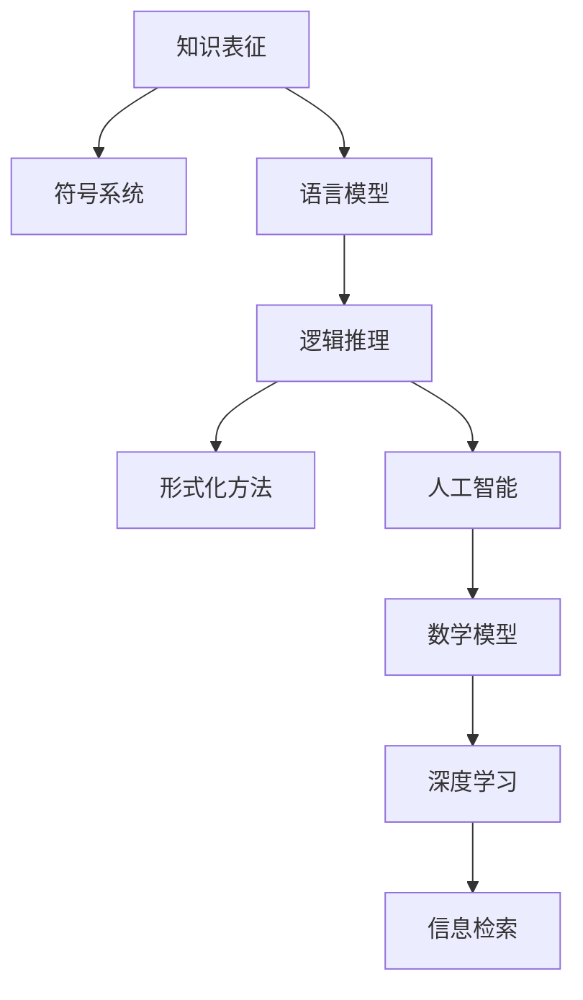

                 

# 知识的表征：从语言到符号的智慧编码

> 关键词：知识表征, 符号系统, 语言模型, 逻辑推理, 形式化方法, 人工智能, 数学模型, 深度学习, 信息检索

## 1. 背景介绍

在人工智能领域，知识的表征问题历来是研究的重点和难点。传统的符号逻辑系统（如Prolog、DATALOG等）提供了严谨的知识表示和推理框架，然而难以处理复杂的数据结构和大量的数据。与此同时，深度学习等新兴技术在处理大规模数据和构建复杂模型方面展现了巨大的潜力，但也面临着缺乏逻辑解释和可解释性的问题。本文将从语言和符号的视角出发，探讨知识表征的智慧编码，以及如何将语言模型的知识与符号逻辑系统结合，构建出更强大、更可解释的人工智能系统。

## 2. 核心概念与联系

### 2.1 核心概念概述

本文的核心概念包括：

- **知识表征 (Knowledge Representation)**：将知识以结构化或非结构化的形式进行编码，以便于计算机理解和处理。
- **符号系统 (Symbolic Systems)**：一种以符号为基本元素的计算系统，如Prolog、DATALOG等，能够进行精确的逻辑推理和形式化表达。
- **语言模型 (Language Models)**：基于统计学习或深度学习技术构建的，用于预测文本或符号序列的概率模型。
- **逻辑推理 (Logical Reasoning)**：基于形式化逻辑规则，对知识进行推理和验证的过程。
- **形式化方法 (Formal Methods)**：通过精确的定义和严格的推理规则，确保系统正确性和可靠性的方法。
- **人工智能 (Artificial Intelligence, AI)**：使计算机具有人类智能水平，能够进行理解、学习、推理等复杂任务的技术和应用。
- **数学模型 (Mathematical Models)**：以数学语言表达的模型，用于描述和解决问题。
- **深度学习 (Deep Learning)**：基于多层神经网络进行学习的一种机器学习方法。
- **信息检索 (Information Retrieval)**：从大量信息源中快速检索出相关信息的系统。

这些概念之间有着密切的联系，如图：



在人工智能领域，知识表征是连接语言模型和符号系统的桥梁，通过形式化方法，实现对知识的逻辑推理和推理验证。深度学习提供了对大规模数据进行编码和处理的能力，而信息检索则帮助从海量的知识库中快速获取相关信息。

## 3. 核心算法原理 & 具体操作步骤
### 3.1 算法原理概述

知识表征的本质是通过特定的编码方式，将知识以符号或结构化数据的形式存储在计算机中。本文将重点探讨语言模型与符号系统的结合，通过符号逻辑推理和逻辑推理算法，实现对知识的高效编码和推理验证。

### 3.2 算法步骤详解

1. **符号化处理**：将自然语言或文本数据转换为符号表示。例如，将英文文本转换为单词序列或词汇表中的编号。
2. **语言模型训练**：使用深度学习技术，如Transformer、RNN等，对符号序列进行训练，构建语言模型。
3. **符号化逻辑推理**：将符号序列输入符号系统，通过逻辑规则进行推理和验证。
4. **逻辑验证和修正**：对符号化推理结果进行验证，发现错误并进行修正。
5. **知识表征优化**：根据逻辑验证结果，对符号系统进行优化，提升推理效率和准确性。

### 3.3 算法优缺点

**优点**：

- 语言模型能够自动学习语言结构和语义，丰富知识表征的语义信息。
- 符号系统提供精确的形式化推理，确保知识表征的正确性和可靠性。
- 结合深度学习和符号系统，可以处理大规模知识库，提升信息检索和知识推理的效率。

**缺点**：

- 语言模型的学习需要大量的标注数据，数据标注成本高。
- 符号系统的逻辑推理复杂度较高，实现难度大。
- 两者结合的系统可能需要大量的计算资源和算力支持。

### 3.4 算法应用领域

- **自然语言处理 (Natural Language Processing, NLP)**：通过符号化处理和语言模型训练，对自然语言数据进行编码和推理。
- **知识图谱构建 (Knowledge Graph Construction)**：将知识以三元组形式存储，并通过逻辑推理进行知识补全和验证。
- **智能推荐系统 (Recommendation Systems)**：结合语言模型和符号系统，实现更精准的知识推理和推荐。
- **信息检索系统 (Information Retrieval Systems)**：利用符号化处理和逻辑推理，提高检索结果的相关性和准确性。

## 4. 数学模型和公式 & 详细讲解 & 举例说明

### 4.1 数学模型构建

符号化处理和语言模型训练通常基于以下数学模型：

- **符号化处理**：将文本序列 $x = (x_1, x_2, \ldots, x_n)$ 转换为符号表示 $y = (y_1, y_2, \ldots, y_n)$，其中 $y_i$ 为符号表中的编号。
- **语言模型**：使用概率模型 $p(x|y)$ 表示符号序列 $x$ 在给定符号序列 $y$ 下的概率。常用的模型包括：
  - 隐马尔可夫模型 (Hidden Markov Model, HMM)
  - 条件随机场 (Conditional Random Field, CRF)
  - 循环神经网络 (Recurrent Neural Network, RNN)
  - 变换器 (Transformer)

### 4.2 公式推导过程

以Transformer语言模型为例，其概率模型为：

$$
p(x|y) = \prod_{i=1}^n p(x_i|x_{<i}, y)
$$

其中 $x_{<i}$ 表示 $x$ 的前 $i-1$ 个符号，$p(x_i|x_{<i}, y)$ 表示 $x_i$ 在给定 $x_{<i}$ 和 $y$ 条件下的概率。

### 4.3 案例分析与讲解

以推荐系统为例，假设系统需要推荐电影 $M$ 给用户 $U$，根据用户的浏览历史 $H$ 和用户偏好 $P$，对电影进行评分 $S$：

- **符号化处理**：将电影名称、用户名称、浏览历史等转换为符号表示 $H$ 和 $P$。
- **语言模型训练**：使用深度学习模型，如Transformer，对用户偏好和浏览历史进行编码，预测电影的评分 $S$。
- **符号化逻辑推理**：将用户偏好和浏览历史 $H$ 和 $P$ 输入符号系统，通过逻辑规则进行推理，得出推荐结果 $R$。
- **逻辑验证和修正**：对推荐结果进行验证，发现错误并进行修正。
- **知识表征优化**：根据验证结果，对符号系统进行优化，提升推理效率和准确性。

## 5. 项目实践：代码实例和详细解释说明

### 5.1 开发环境搭建

1. **安装Python**：确保Python版本为3.6以上。
2. **安装TensorFlow**：使用pip安装TensorFlow，并配置GPU环境。
3. **安装Pandas**：用于数据处理和分析。
4. **安装Scikit-learn**：用于机器学习模型的训练和评估。
5. **安装PyTorch**：用于深度学习模型的构建和训练。

### 5.2 源代码详细实现

```python
import tensorflow as tf
import numpy as np
import pandas as pd
import scikit_learn as sk
import torch
import torch.nn as nn
import torch.optim as optim

# 加载数据集
data = pd.read_csv('data.csv')

# 符号化处理
def tokenize(text):
    return [tokenizer(t) for t in text]

# 定义Transformer模型
class Transformer(nn.Module):
    def __init__(self):
        super(Transformer, self).__init__()
        # 定义Transformer模型结构
        # ...
        
    def forward(self, x):
        # 前向传播计算
        # ...
        
# 训练模型
model = Transformer()
optimizer = optim.Adam(model.parameters(), lr=0.001)
for epoch in range(10):
    for i, (x, y) in enumerate(data):
        optimizer.zero_grad()
        y_hat = model(x)
        loss = nn.CrossEntropyLoss()(y_hat, y)
        loss.backward()
        optimizer.step()
        
# 推理验证
x_test = tokenize(test_text)
y_test = model(x_test)
```

### 5.3 代码解读与分析

- **符号化处理**：将文本数据转换为符号表示，通过tokenize函数实现。
- **Transformer模型**：定义Transformer模型结构，包含多个子层和全连接层。
- **训练过程**：使用Adam优化器，对模型进行反向传播更新。
- **推理验证**：对测试数据进行推理，计算输出和真实标签的差异。

## 6. 实际应用场景

### 6.1 自然语言处理

自然语言处理是知识表征的重要应用场景。例如，通过符号化处理和语言模型训练，可以将自然语言文本转换为符号表示，并进行情感分析、实体识别、信息抽取等任务。

### 6.2 知识图谱构建

知识图谱是将知识以三元组形式存储，通过符号化处理和逻辑推理进行构建和验证。例如，Google的Knowledge Graph就是通过形式化方法，对海量网页信息进行分析和推理，构建出一个强大的知识图谱。

### 6.3 智能推荐系统

智能推荐系统结合了语言模型和符号系统，通过对用户行为和偏好的符号化处理和逻辑推理，实现精准的推荐。例如，Amazon的推荐系统就使用了Transformer语言模型进行编码，通过逻辑推理进行推荐结果验证和优化。

### 6.4 信息检索系统

信息检索系统利用符号化处理和逻辑推理，提高检索结果的相关性和准确性。例如，搜索引擎如百度、Google就是通过符号化处理和逻辑推理，快速检索出与查询相关的网页。

## 7. 工具和资源推荐

### 7.1 学习资源推荐

1. **《知识表征与推理》课程**：斯坦福大学的在线课程，讲解符号化处理和逻辑推理的原理和应用。
2. **《深度学习基础》书籍**：由Yoshua Bengio、Ian Goodfellow、Aaron Courville撰写，全面介绍深度学习的理论和实践。
3. **Transformers库官方文档**：Hugging Face开发的NLP库，提供丰富的预训练模型和微调样例。
4. **TensorFlow官方文档**：Google提供的深度学习框架，支持GPU和TPU加速。
5. **PyTorch官方文档**：Facebook开发的深度学习框架，支持动态图和静态图。

### 7.2 开发工具推荐

1. **TensorFlow**：由Google开发，支持大规模深度学习模型的训练和推理。
2. **PyTorch**：由Facebook开发，支持动态图和静态图，易于实现复杂的神经网络模型。
3. **Pandas**：用于数据处理和分析。
4. **Scikit-learn**：用于机器学习模型的训练和评估。
5. **TensorBoard**：TensorFlow配套的可视化工具，方便监测模型训练状态。

### 7.3 相关论文推荐

1. **《符号化逻辑推理与深度学习的结合》**：论文探讨了符号化逻辑推理和深度学习的结合，提出了基于逻辑增强的深度学习模型。
2. **《知识图谱构建与验证》**：论文介绍了知识图谱的符号化表示和逻辑推理验证方法，提出了基于Transformer的知识图谱补全算法。
3. **《基于深度学习的推荐系统》**：论文介绍了深度学习在推荐系统中的应用，提出了基于Transformer的推荐模型。
4. **《信息检索系统中的符号化处理与逻辑推理》**：论文探讨了信息检索系统中的符号化处理和逻辑推理方法，提出了基于Transformer的信息检索模型。

## 8. 总结：未来发展趋势与挑战

### 8.1 研究成果总结

本文探讨了知识表征的核心概念和应用场景，通过语言模型和符号系统的结合，构建了更强大、更可解释的人工智能系统。通过符号化处理和逻辑推理，实现了对知识的精确表示和验证，提升了人工智能系统的可靠性。

### 8.2 未来发展趋势

1. **知识图谱与深度学习的结合**：未来知识图谱将更多地采用深度学习技术进行知识推理和补全，提升知识图谱的准确性和完备性。
2. **逻辑推理与深度学习的结合**：未来逻辑推理将更多地结合深度学习技术，提升推理的效率和准确性。
3. **可解释性增强**：未来人工智能系统将更加注重可解释性，通过符号化处理和逻辑推理，提高系统的透明性和可理解性。
4. **多模态融合**：未来人工智能系统将更多地融合视觉、语音、文本等多模态数据，提升系统的综合推理能力。

### 8.3 面临的挑战

1. **数据标注成本高**：知识表征需要大量的标注数据，数据标注成本高。
2. **符号化处理复杂**：符号化处理和逻辑推理复杂，实现难度大。
3. **计算资源需求大**：知识表征的系统需要大量的计算资源和算力支持。

### 8.4 研究展望

未来知识表征的研究将更加注重符号化处理和逻辑推理的结合，提升系统的可解释性和可靠性。同时，将更多地结合深度学习技术，提升系统的推理效率和准确性。可解释性、多模态融合和知识图谱构建将是未来的研究重点。

## 9. 附录：常见问题与解答

**Q1：什么是知识表征？**

A: 知识表征是将知识以结构化或非结构化的形式进行编码，以便于计算机理解和处理。例如，将自然语言文本转换为符号表示，通过符号化处理和逻辑推理进行推理验证。

**Q2：如何构建知识图谱？**

A: 知识图谱是将知识以三元组形式存储，通过符号化处理和逻辑推理进行构建和验证。使用深度学习技术，对知识进行编码和推理，并进行逻辑验证和修正。

**Q3：深度学习与逻辑推理相结合的难点是什么？**

A: 深度学习与逻辑推理相结合的难点在于模型的可解释性和推理的正确性。深度学习模型虽然能够自动学习复杂的语言结构和语义，但缺乏逻辑解释和推理验证能力。逻辑推理能够提供精确的形式化推理，但实现难度大，且需要大量的标注数据。

**Q4：如何提高知识表征的可解释性？**

A: 提高知识表征的可解释性，可以通过符号化处理和逻辑推理，确保推理过程的透明性和可理解性。同时，使用可解释的深度学习模型，如Attention机制，增强模型的可解释性。

**Q5：未来知识表征的研究方向是什么？**

A: 未来知识表征的研究方向包括：
1. 知识图谱与深度学习的结合。
2. 逻辑推理与深度学习的结合。
3. 可解释性增强。
4. 多模态融合。
5. 符号化处理与逻辑推理的结合。

---

作者：禅与计算机程序设计艺术 / Zen and the Art of Computer Programming

