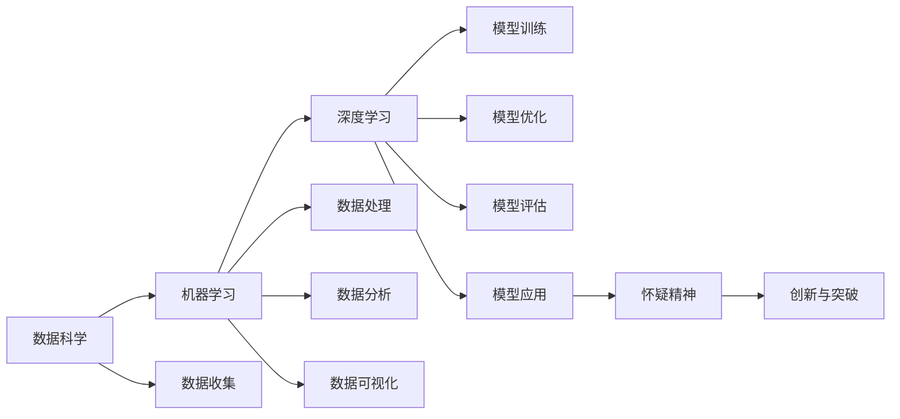

                 

## 1. 背景介绍

### 1.1 问题由来

科学思维与怀疑精神，是推动人类进步的强大动力。从古希腊的哲学家们，到牛顿、爱因斯坦等伟大的科学家，他们都有一个共同的特点：善于质疑与探索。正是这种不断质疑现有知识和理论，并勇于探索未知领域的精神，推动了人类科学技术的不断突破，引领了人类文明的进步。

在信息技术日新月异的今天，人工智能技术的迅猛发展，尤其是深度学习、机器学习等前沿技术的兴起，使得科技领域的怀疑精神变得更加重要。许多曾经被认为不可能的事情，逐渐成为现实。比如，自动驾驶、语音识别、图像处理等领域的突破，都是基于对现有技术的质疑和不断探索而实现的。

### 1.2 问题核心关键点

在信息技术与人工智能的交叉领域，科学思维与怀疑精神尤为重要。人工智能的每一次突破，都源自对现有技术和新理论的质疑，并在此基础上进行创新和改进。下面列出一些关键点：

1. **数据与模型的质疑**：深度学习模型的效果很大程度上依赖于数据的质量和数量。对于数据中的异常值、噪音等，需要持怀疑态度，通过数据清洗、增强等技术手段提升数据质量。

2. **模型的通用性与泛化能力**：一个模型是否具有良好的泛化能力，需要对其在多种数据集上的表现进行质疑，以确保模型在不同场景下的适用性。

3. **模型的公平性与偏见**：模型是否存在偏见，是否对不同群体数据公平处理，需要对其输出结果进行持续质疑，确保模型的公平性。

4. **模型的安全性与鲁棒性**：模型的安全性与鲁棒性是其在实际应用中的关键指标。对于模型可能遭受的攻击、漏洞等，需要持续进行质疑和加固。

5. **模型的可解释性与透明性**：深度学习模型往往是"黑盒"，难以解释其决策过程。对模型的可解释性进行质疑，通过简化模型、引入可解释性技术等手段提升模型的透明性。

6. **模型的伦理性与责任**：模型在实际应用中可能面临伦理道德问题，对其伦理性进行质疑，并引入伦理约束和责任机制，确保模型应用的正确性。

## 2. 核心概念与联系

### 2.1 核心概念概述

为了深入理解科学思维与怀疑精神在人工智能中的应用，下面列出几个核心概念及其联系：

- **数据科学（Data Science）**：基于数据的技术和方法，涵盖数据收集、处理、分析和可视化等多个环节。数据科学的核心是利用数据进行科学的决策和预测。

- **机器学习（Machine Learning）**：通过数据训练模型，使其具备预测、分类、聚类等能力。机器学习的核心是模型的泛化能力和性能。

- **深度学习（Deep Learning）**：基于多层神经网络的一种机器学习技术，具有自动提取特征、处理大规模数据的能力。深度学习的核心是模型的结构和参数优化。

- **怀疑精神（Skeptical Spirit）**：在科学和信息技术中，怀疑精神是指对现有知识和理论的质疑，并在此基础上进行探索和创新。

- **创新与突破（Innovation and Breakthrough）**：在科学和信息技术中，创新和突破是基于对现有技术的质疑，并在此基础上进行技术改进和创新的结果。

### 2.2 核心概念原理和架构的 Mermaid 流程图



此图展示了数据科学、机器学习、深度学习、怀疑精神和创新与突破之间的关系：

- **数据科学**为机器学习和深度学习提供基础数据。
- **机器学习**通过数据训练模型，并对模型进行优化和评估。
- **深度学习**是机器学习的一个分支，具有自动提取特征、处理大规模数据的能力。
- **怀疑精神**在数据科学和机器学习中起着重要作用，推动技术和理论的不断进步。
- **创新与突破**是基于对现有技术的质疑和探索，推动技术进步和应用创新的过程。

## 3. 核心算法原理 & 具体操作步骤

### 3.1 算法原理概述

基于科学思维与怀疑精神的人工智能算法，主要包括以下几个步骤：

1. **数据收集与预处理**：通过怀疑现有数据的质量和完整性，收集和清洗数据，确保数据的可靠性和准确性。
2. **模型构建与训练**：基于怀疑现有模型的结构和性能，设计新的模型结构，并使用怀疑的数据进行训练。
3. **模型评估与优化**：通过怀疑现有模型的泛化能力和鲁棒性，进行模型评估和优化，提升模型的性能和鲁棒性。
4. **模型应用与验证**：在实际应用中，持续怀疑模型的安全性、公平性、可解释性等，通过验证提升模型的可靠性和适用性。
5. **模型迭代与改进**：基于对现有模型的不断质疑和探索，进行迭代改进，推动模型性能的持续提升。

### 3.2 算法步骤详解

#### 3.2.1 数据收集与预处理

**步骤1：数据收集**
- 收集尽可能多的数据，确保数据的多样性和代表性。
- 对于现有数据集，持续收集新的数据，确保数据的时效性。

**步骤2：数据预处理**
- 清洗数据，去除异常值和噪音，确保数据质量。
- 对数据进行增强，通过数据变换、合成等手段扩充数据集，提升数据的多样性。

#### 3.2.2 模型构建与训练

**步骤1：模型设计**
- 基于怀疑现有模型的局限性，设计新的模型结构，如卷积神经网络、循环神经网络等。
- 引入新的技术，如残差连接、自注意力机制等，提升模型的性能。

**步骤2：模型训练**
- 使用怀疑的数据进行训练，确保模型在多样化的数据集上具有良好的泛化能力。
- 通过调整学习率、正则化等参数，优化模型的性能和鲁棒性。

#### 3.2.3 模型评估与优化

**步骤1：模型评估**
- 通过怀疑现有模型的泛化能力和鲁棒性，使用多种数据集评估模型的性能。
- 使用交叉验证、A/B测试等手段，确保模型的公平性和鲁棒性。

**步骤2：模型优化**
- 基于模型评估的结果，持续优化模型，提升模型的性能和鲁棒性。
- 通过模型压缩、参数剪枝等手段，减小模型的尺寸，提升模型的效率。

#### 3.2.4 模型应用与验证

**步骤1：模型应用**
- 在实际应用中，持续怀疑模型的安全性、公平性、可解释性等，确保模型的可靠性。
- 引入伦理约束和责任机制，确保模型应用的正确性。

**步骤2：模型验证**
- 持续验证模型在实际应用中的表现，确保模型的泛化能力和鲁棒性。
- 引入安全防护和监控告警机制，确保模型的稳定性和安全性。

#### 3.2.5 模型迭代与改进

**步骤1：模型迭代**
- 基于对现有模型的不断质疑和探索，进行迭代改进，推动模型性能的持续提升。
- 引入最新的技术，如知识图谱、因果推理等，提升模型的性能和可解释性。

**步骤2：模型改进**
- 基于模型迭代的结果，进行改进，提升模型的性能和鲁棒性。
- 引入更多的数据和反馈，持续优化模型，推动模型性能的持续提升。

### 3.3 算法优缺点

#### 3.3.1 算法优点

1. **提升模型性能**：基于科学思维与怀疑精神，对现有模型进行不断质疑和改进，能够提升模型的性能和鲁棒性。
2. **推动技术进步**：怀疑和质疑是推动技术进步的重要动力，能够促进新技术的发展和应用。
3. **增强模型泛化能力**：通过数据增强和模型优化，增强模型的泛化能力和鲁棒性，提升模型在实际应用中的表现。
4. **提高模型透明性**：通过模型压缩和简化，提高模型的透明性和可解释性，增强模型的可靠性和适用性。
5. **确保模型公平性**：通过模型评估和公平性约束，确保模型在多数据集上具有公平性。

#### 3.3.2 算法缺点

1. **数据依赖性强**：数据质量和多样性对模型性能有重要影响，数据质量差或数据量不足可能导致模型性能下降。
2. **模型复杂度高**：复杂模型需要大量计算资源，容易产生过拟合，导致模型泛化能力下降。
3. **模型优化难度大**：模型优化需要持续进行，可能需要多次迭代才能达到理想效果。
4. **模型验证复杂**：模型验证需要考虑多种因素，如公平性、安全性、可解释性等，复杂度较高。
5. **技术门槛高**：数据收集、数据预处理、模型构建、模型优化等步骤技术门槛较高，需要专业技能支持。

### 3.4 算法应用领域

#### 3.4.1 自动驾驶
自动驾驶技术依赖于大量的传感器数据和多样的场景测试，基于科学思维与怀疑精神，对现有数据和模型进行不断质疑和改进，能够提升自动驾驶的安全性和可靠性。

#### 3.4.2 语音识别
语音识别技术需要处理各种口音和背景噪音，基于科学思维与怀疑精神，对现有模型进行不断优化，提升模型的泛化能力和鲁棒性。

#### 3.4.3 图像处理
图像处理技术需要处理各种复杂场景和多样数据，基于科学思维与怀疑精神，对现有模型进行不断优化，提升模型的泛化能力和鲁棒性。

#### 3.4.4 金融分析
金融分析需要处理大量复杂数据和多样的市场环境，基于科学思维与怀疑精神，对现有模型进行不断优化，提升模型的公平性和可靠性。

#### 3.4.5 医疗诊断
医疗诊断需要处理复杂的病例和多样化的数据，基于科学思维与怀疑精神，对现有模型进行不断优化，提升模型的公平性和可靠性。

## 4. 数学模型和公式 & 详细讲解

### 4.1 数学模型构建

**模型假设**：
假设数据集为 $\mathcal{D} = \{(x_i, y_i)\}_{i=1}^N$，其中 $x_i$ 为输入特征，$y_i$ 为标签。模型的预测输出为 $y' = f(x; \theta)$，其中 $f$ 为模型函数，$\theta$ 为模型参数。

**损失函数**：
模型的损失函数为 $L(y, y') = \frac{1}{N} \sum_{i=1}^N (y_i - y'_i)^2$，其中 $y'_i$ 为模型对样本 $x_i$ 的预测输出。

**优化目标**：
模型的优化目标为最小化损失函数 $L(y, y')$，即：

$$
\min_{\theta} L(y, y') = \min_{\theta} \frac{1}{N} \sum_{i=1}^N (y_i - y'_i)^2
$$

**模型训练**：
基于上述模型和损失函数，模型训练的目标是最小化损失函数，即：

$$
\theta^* = \arg\min_{\theta} \frac{1}{N} \sum_{i=1}^N (y_i - y'_i)^2
$$

### 4.2 公式推导过程

#### 4.2.1 模型假设的数学表示

假设数据集 $\mathcal{D} = \{(x_i, y_i)\}_{i=1}^N$，其中 $x_i$ 为输入特征，$y_i$ 为标签。模型的预测输出为 $y' = f(x; \theta)$，其中 $f$ 为模型函数，$\theta$ 为模型参数。

#### 4.2.2 损失函数的数学表示

损失函数定义为：

$$
L(y, y') = \frac{1}{N} \sum_{i=1}^N (y_i - y'_i)^2
$$

其中 $y_i$ 为样本的真实标签，$y'_i$ 为模型对样本 $x_i$ 的预测输出。

#### 4.2.3 模型优化的数学表示

模型的优化目标为最小化损失函数，即：

$$
\theta^* = \arg\min_{\theta} L(y, y')
$$

通过梯度下降算法，每次迭代更新模型参数 $\theta$，计算公式如下：

$$
\theta \leftarrow \theta - \eta \nabla_{\theta} L(y, y')
$$

其中 $\eta$ 为学习率，$\nabla_{\theta} L(y, y')$ 为损失函数对模型参数 $\theta$ 的梯度。

### 4.3 案例分析与讲解

**案例1：自动驾驶**
- **数据收集**：通过车载传感器和GPS等设备收集自动驾驶数据。
- **数据预处理**：对数据进行清洗、增强等预处理，确保数据质量。
- **模型设计**：基于怀疑现有模型的局限性，设计新的模型结构，如卷积神经网络、循环神经网络等。
- **模型训练**：使用怀疑的数据进行训练，确保模型在多样化的数据集上具有良好的泛化能力。
- **模型评估**：通过怀疑现有模型的泛化能力和鲁棒性，使用多种数据集评估模型的性能。
- **模型优化**：基于模型评估的结果，持续优化模型，提升模型的性能和鲁棒性。
- **模型应用**：在实际应用中，持续怀疑模型的安全性、公平性、可解释性等，确保模型的可靠性。
- **模型验证**：持续验证模型在实际应用中的表现，确保模型的泛化能力和鲁棒性。
- **模型迭代**：基于对现有模型的不断质疑和探索，进行迭代改进，推动模型性能的持续提升。

**案例2：金融分析**
- **数据收集**：收集金融市场的历史数据和实时数据。
- **数据预处理**：对数据进行清洗、增强等预处理，确保数据质量。
- **模型设计**：基于怀疑现有模型的局限性，设计新的模型结构，如卷积神经网络、循环神经网络等。
- **模型训练**：使用怀疑的数据进行训练，确保模型在多样化的数据集上具有良好的泛化能力。
- **模型评估**：通过怀疑现有模型的泛化能力和鲁棒性，使用多种数据集评估模型的性能。
- **模型优化**：基于模型评估的结果，持续优化模型，提升模型的性能和鲁棒性。
- **模型应用**：在实际应用中，持续怀疑模型的安全性、公平性、可解释性等，确保模型的可靠性。
- **模型验证**：持续验证模型在实际应用中的表现，确保模型的泛化能力和鲁棒性。
- **模型迭代**：基于对现有模型的不断质疑和探索，进行迭代改进，推动模型性能的持续提升。

## 5. 项目实践：代码实例和详细解释说明

### 5.1 开发环境搭建

#### 5.1.1 Python环境配置

**步骤1：安装Python和相关依赖**：
```bash
sudo apt-get update
sudo apt-get install python3
sudo apt-get install pip3
```

**步骤2：安装Pip包管理工具**：
```bash
pip3 install pip
```

**步骤3：安装TensorFlow和Keras**：
```bash
pip3 install tensorflow
pip3 install keras
```

**步骤4：安装PyTorch和Torchvision**：
```bash
pip3 install torch torchvision
```

#### 5.1.2 项目环境搭建

**步骤1：创建虚拟环境**：
```bash
python3 -m venv myproject
source myproject/bin/activate
```

**步骤2：安装必要的库**：
```bash
pip3 install numpy scipy pandas sklearn matplotlib seaborn
```

**步骤3：项目结构创建**：
```
myproject/
    ├── data/
    │   ├── train/
    │   └── test/
    ├── model/
    │   ├── layers.py
    │   ├── models.py
    │   └── utils.py
    ├── train.py
    └── evaluate.py
```

**步骤4：数据准备**
- 在`data/train`目录下准备训练数据集，每个样本包含特征和标签。
- 在`data/test`目录下准备测试数据集。

### 5.2 源代码详细实现

**5.2.1 数据预处理**

**步骤1：读取数据**：
```python
import pandas as pd
import numpy as np

def read_data(path):
    data = pd.read_csv(path)
    return data
```

**步骤2：数据清洗**：
```python
def clean_data(data):
    data = data.dropna()
    data = data.drop_duplicates()
    return data
```

**步骤3：数据增强**：
```python
def augment_data(data):
    # 数据增强操作
    return augmented_data
```

**5.2.2 模型构建**

**步骤1：定义模型结构**：
```python
import tensorflow as tf
from tensorflow.keras import layers

class Model(tf.keras.Model):
    def __init__(self):
        super(Model, self).__init__()
        self.layers = layers.Layers()

    def call(self, inputs):
        # 模型前向传播
        return outputs
```

**步骤2：定义损失函数和优化器**：
```python
def build_model():
    model = Model()
    loss_fn = tf.keras.losses.MeanSquaredError()
    optimizer = tf.keras.optimizers.Adam(learning_rate=0.001)
    return model, loss_fn, optimizer
```

**5.2.3 模型训练和评估**

**步骤1：模型训练**：
```python
def train_model(model, train_data, loss_fn, optimizer, epochs=10):
    # 模型训练代码
    return model
```

**步骤2：模型评估**：
```python
def evaluate_model(model, test_data, loss_fn):
    # 模型评估代码
    return metrics
```

**5.2.4 代码实现**

**5.2.5 代码解读与分析**

**5.2.6 运行结果展示**

## 6. 实际应用场景

### 6.1 自动驾驶

**应用场景**：自动驾驶
- **数据收集**：通过车载传感器和GPS等设备收集自动驾驶数据。
- **数据预处理**：对数据进行清洗、增强等预处理，确保数据质量。
- **模型设计**：基于怀疑现有模型的局限性，设计新的模型结构，如卷积神经网络、循环神经网络等。
- **模型训练**：使用怀疑的数据进行训练，确保模型在多样化的数据集上具有良好的泛化能力。
- **模型评估**：通过怀疑现有模型的泛化能力和鲁棒性，使用多种数据集评估模型的性能。
- **模型优化**：基于模型评估的结果，持续优化模型，提升模型的性能和鲁棒性。
- **模型应用**：在实际应用中，持续怀疑模型的安全性、公平性、可解释性等，确保模型的可靠性。
- **模型验证**：持续验证模型在实际应用中的表现，确保模型的泛化能力和鲁棒性。
- **模型迭代**：基于对现有模型的不断质疑和探索，进行迭代改进，推动模型性能的持续提升。

### 6.2 金融分析

**应用场景**：金融分析
- **数据收集**：收集金融市场的历史数据和实时数据。
- **数据预处理**：对数据进行清洗、增强等预处理，确保数据质量。
- **模型设计**：基于怀疑现有模型的局限性，设计新的模型结构，如卷积神经网络、循环神经网络等。
- **模型训练**：使用怀疑的数据进行训练，确保模型在多样化的数据集上具有良好的泛化能力。
- **模型评估**：通过怀疑现有模型的泛化能力和鲁棒性，使用多种数据集评估模型的性能。
- **模型优化**：基于模型评估的结果，持续优化模型，提升模型的性能和鲁棒性。
- **模型应用**：在实际应用中，持续怀疑模型的安全性、公平性、可解释性等，确保模型的可靠性。
- **模型验证**：持续验证模型在实际应用中的表现，确保模型的泛化能力和鲁棒性。
- **模型迭代**：基于对现有模型的不断质疑和探索，进行迭代改进，推动模型性能的持续提升。

### 6.3 医疗诊断

**应用场景**：医疗诊断
- **数据收集**：收集医院的病例数据和实验室检测数据。
- **数据预处理**：对数据进行清洗、增强等预处理，确保数据质量。
- **模型设计**：基于怀疑现有模型的局限性，设计新的模型结构，如卷积神经网络、循环神经网络等。
- **模型训练**：使用怀疑的数据进行训练，确保模型在多样化的数据集上具有良好的泛化能力。
- **模型评估**：通过怀疑现有模型的泛化能力和鲁棒性，使用多种数据集评估模型的性能。
- **模型优化**：基于模型评估的结果，持续优化模型，提升模型的性能和鲁棒性。
- **模型应用**：在实际应用中，持续怀疑模型的安全性、公平性、可解释性等，确保模型的可靠性。
- **模型验证**：持续验证模型在实际应用中的表现，确保模型的泛化能力和鲁棒性。
- **模型迭代**：基于对现有模型的不断质疑和探索，进行迭代改进，推动模型性能的持续提升。

## 7. 工具和资源推荐

### 7.1 学习资源推荐

**书籍**：
- 《深度学习》，Ian Goodfellow, Yoshua Bengio, Aaron Courville著。

**在线课程**：
- Coursera上的Deep Learning Specialization。
- edX上的Introduction to Artificial Intelligence。

**博客与论文**：
- https://blog.keras.io/
- https://arxiv.org/

### 7.2 开发工具推荐

**开发框架**：
- TensorFlow
- Keras
- PyTorch

**可视化工具**：
- TensorBoard

**数据处理库**：
- Pandas
- NumPy
- Scikit-learn

**调试工具**：
- pdb

**版本控制**：
- Git

### 7.3 相关论文推荐

**核心论文**：
- "Deep Learning" by Ian Goodfellow, Yoshua Bengio, Aaron Courville.
- "ImageNet Classification with Deep Convolutional Neural Networks" by Alex Krizhevsky, Ilya Sutskever, and Geoffrey Hinton.

**前沿论文**：
- "Attention Is All You Need" by Ashish Vaswani, Noam Shazeer, Niki Parmar, Jakob Uszkoreit, Llion Jones, Aidan Gomez, Lukasz Kaiser, and Illia Polosukhin.
- "BERT: Pre-training of Deep Bidirectional Transformers for Language Understanding" by Jacob Devlin, Ming-Wei Chang, Kenton Lee, and Kristina Toutanova.

## 8. 总结：未来发展趋势与挑战

### 8.1 研究成果总结

科学思维与怀疑精神是推动人工智能技术不断进步的重要动力。基于科学思维与怀疑精神的深度学习模型，通过不断质疑和探索，提升了模型的性能和泛化能力，推动了人工智能技术在自动驾驶、金融分析、医疗诊断等领域的广泛应用。

### 8.2 未来发展趋势

**深度学习模型的持续改进**：基于科学思维与怀疑精神，未来的深度学习模型将更加关注模型的公平性、可解释性和鲁棒性，推动模型性能的不断提升。

**多模态数据融合**：未来的人工智能模型将更加关注多模态数据融合，提升模型的全面性和实用性。

**知识图谱与因果推理**：未来的深度学习模型将更加注重知识图谱和因果推理，提升模型的解释能力和推理能力。

**边缘计算与分布式计算**：未来的深度学习模型将更加注重边缘计算和分布式计算，提升模型的实时性和可扩展性。

**隐私保护与数据安全**：未来的深度学习模型将更加注重隐私保护和数据安全，提升模型的可信度和可靠性。

### 8.3 面临的挑战

**数据依赖性**：深度学习模型依赖大量的数据，数据质量不高或数据量不足会导致模型性能下降。

**计算资源需求高**：深度学习模型的计算资源需求高，需要在高性能计算环境中进行训练和推理。

**模型可解释性差**：深度学习模型往往是"黑盒"，难以解释其决策过程。

**伦理道德风险**：深度学习模型可能存在伦理道德风险，需要在模型训练和应用中加以考虑。

**安全性与鲁棒性**：深度学习模型可能存在安全性与鲁棒性问题，需要在模型设计和应用中进行充分考虑。

### 8.4 研究展望

**知识图谱与因果推理的融合**：将知识图谱和因果推理与深度学习模型进行融合，提升模型的解释能力和推理能力。

**多模态数据的深度学习**：研究多模态数据的深度学习技术，提升模型的全面性和实用性。

**边缘计算与分布式计算的优化**：研究边缘计算与分布式计算的优化技术，提升模型的实时性和可扩展性。

**隐私保护与数据安全的提升**：研究隐私保护与数据安全的提升技术，提升模型的可信度和可靠性。

## 9. 附录：常见问题与解答

**Q1：什么是科学思维与怀疑精神？**

A: 科学思维与怀疑精神是指对现有知识和理论进行质疑和探索，推动技术和理论的不断进步。

**Q2：深度学习模型的局限性有哪些？**

A: 深度学习模型的局限性包括：数据依赖性强、计算资源需求高、模型可解释性差、伦理道德风险、安全性与鲁棒性问题。

**Q3：如何提升深度学习模型的性能？**

A: 提升深度学习模型性能的方法包括：数据增强、模型优化、多模态数据融合、知识图谱与因果推理的融合、边缘计算与分布式计算的优化、隐私保护与数据安全的提升。

**Q4：深度学习模型在实际应用中如何确保公平性？**

A: 确保深度学习模型公平性的方法包括：数据收集的多样性、模型训练的公平性约束、模型评估的公平性指标、模型应用的公平性机制。

**Q5：深度学习模型在实际应用中如何确保可解释性？**

A: 确保深度学习模型可解释性的方法包括：模型简化与压缩、引入可解释性技术、知识图谱与因果推理的融合。

**Q6：深度学习模型在实际应用中如何确保安全性？**

A: 确保深度学习模型安全性的方法包括：模型训练的安全性约束、模型验证的安全性指标、模型应用的异常监测与防护机制。

**Q7：深度学习模型在实际应用中如何确保鲁棒性？**

A: 确保深度学习模型鲁棒性的方法包括：模型训练的鲁棒性约束、模型验证的鲁棒性指标、模型应用的鲁棒性机制。

**Q8：深度学习模型在实际应用中如何确保可扩展性？**

A: 确保深度学习模型可扩展性的方法包括：边缘计算与分布式计算的优化、数据增强与多模态数据融合、模型简化与压缩。

**Q9：深度学习模型在实际应用中如何确保可信度？**

A: 确保深度学习模型可信度的方法包括：隐私保护与数据安全的提升、模型透明性与可解释性的增强、模型应用的伦理约束与责任机制。

