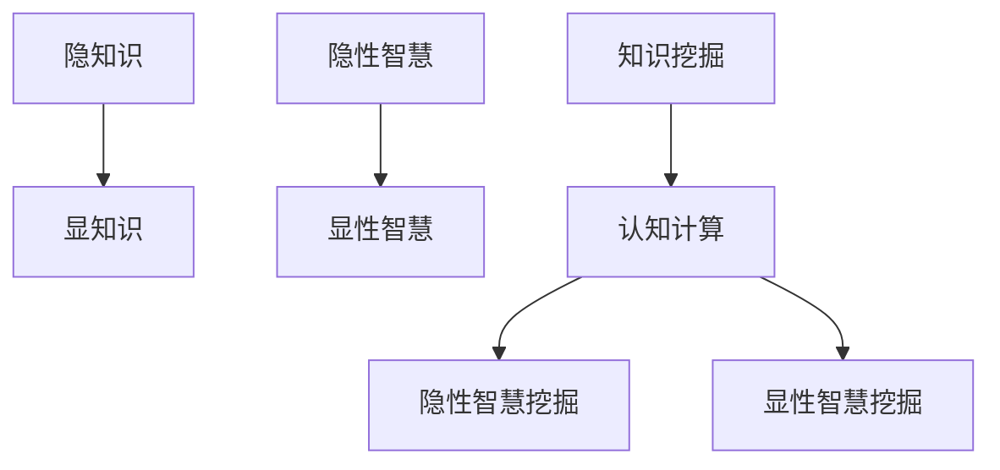
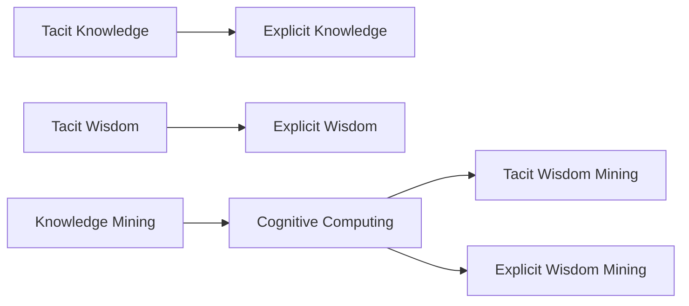

                 

# 知识的隐性与显性：挖掘潜在智慧

> 关键词：隐知识,显知识,隐性智慧,显性智慧,知识挖掘,认知计算,人工智能,大数据,深度学习

## 1. 背景介绍

知识的隐性与显性，是认知科学和人工智能领域的重要议题。在人工智能发展的今天，如何从人类的隐性知识中挖掘出显性智慧，成为推动智能系统发展、赋能各行各业的关键。本文旨在深入探讨这一问题，通过挖掘隐性知识和显性智慧，推动认知计算的进步，使人工智能更好地服务于人类社会。

## 2. 核心概念与联系

### 2.1 核心概念概述

为更好地理解知识隐性与显性的关系及其应用，本节将介绍几个关键概念：

- 隐知识(Tacit Knowledge)：指个人或集体通过经验、直觉、潜意识等方式掌握，但难以用言语或文字明确表达的知识。这类知识往往是主观的、情境化的，常常存在于人类认知和经验的深层次中。
- 显知识(Explicit Knowledge)：指能够用文字、符号、公式等形式明确表达的知识。这类知识是客观的、结构化的，可以存储在文献、数据库、代码库等形式中。
- 隐性智慧(Tacit Wisdom)：指个体或集体基于隐知识进行直觉判断和决策的能力。这类智慧是高度个性化和情境化的，常常难以用传统逻辑推理和规则描述。
- 显性智慧(Explicit Wisdom)：指能够用系统化、结构化的知识和方法进行分析和推理的能力。这类智慧是可编码的、可传播的，可以借助算法和模型实现。
- 知识挖掘(Knowledge Mining)：指从大规模数据中自动发现潜在的模式、关系和知识的过程。通常借助机器学习、深度学习等技术实现。
- 认知计算(Cognitive Computing)：指通过模拟人类认知过程，实现信息处理和知识发现的计算方法。它包括符号计算、类比推理、情感识别、语义理解等多种认知功能。

这些概念之间的关系可以直观地表示为：



这个流程图示意了隐知识和显知识的转换过程，以及知识挖掘和认知计算在这一过程中的作用。

### 2.2 核心概念原理和架构的 Mermaid 流程图



这个流程图展示了从隐知识到显智慧的转换过程，以及知识挖掘和认知计算在其中扮演的角色。

## 3. 核心算法原理 & 具体操作步骤

### 3.1 算法原理概述

知识隐性与显性的转换，涉及隐性知识的显性化以及显性智慧的提取和应用。这一过程通常通过知识挖掘算法实现。知识挖掘算法利用统计、模式识别和机器学习等技术，从大规模数据中自动发现潜在的模式、关系和知识。

知识挖掘的主要步骤包括：

1. 数据收集：收集领域相关的文本、图像、音频等多模态数据。
2. 数据预处理：对数据进行清洗、标注和归一化，确保数据的质量和一致性。
3. 特征提取：从原始数据中提取出有意义的特征，如词频、主题、情感极性等。
4. 模型训练：使用机器学习模型进行训练，学习数据中的潜在模式和关系。
5. 知识发现：从训练好的模型中提取知识，如规则、模式、主题等。
6. 知识应用：将提取的知识应用于具体任务，如问答系统、推荐系统、情感分析等。

### 3.2 算法步骤详解

下面以情感分析任务为例，详细介绍知识挖掘的算法步骤：

**Step 1: 数据收集**
- 收集大量的电影评论数据，用于训练情感分析模型。
- 数据来源包括豆瓣电影、IMDb、亚马逊等平台。

**Step 2: 数据预处理**
- 对文本数据进行清洗，去除无关的HTML标签和特殊字符。
- 使用词性标注器将文本中的词汇分词，并进行词性标注。
- 构建词汇表，将文本转换为数值向量表示。

**Step 3: 特征提取**
- 使用词袋模型(Bag-of-Words)提取文本特征。
- 统计每个词汇在文本中的出现频率，构建词汇-频率矩阵。
- 使用TF-IDF算法对词汇频率进行加权处理。

**Step 4: 模型训练**
- 使用朴素贝叶斯(Naive Bayes)或支持向量机(SVM)等模型进行训练。
- 对模型进行交叉验证，调整超参数，确保模型性能。
- 在验证集上进行模型评估，选择合适的模型参数。

**Step 5: 知识发现**
- 使用模型在测试集上进行情感分类，提取分类结果。
- 统计不同情感的评论数量，分析情感分布。
- 对不同情感的评论进行聚类分析，提取主题。

**Step 6: 知识应用**
- 将情感分析模型集成到聊天机器人中，根据用户评论生成推荐。
- 对企业客户评论进行情感分析，帮助企业改进产品和服务。
- 对社交媒体评论进行情感分析，预测市场趋势和舆情。

### 3.3 算法优缺点

知识挖掘算法具有以下优点：

- 自动化程度高：不需要人工干预，能够高效处理大规模数据。
- 发现隐性知识：通过模式识别和统计分析，能够发现人类难以察觉的潜在模式和关系。
- 应用广泛：可以应用于情感分析、推荐系统、信息检索等多个领域。

同时，也存在一些局限性：

- 数据质量依赖：数据质量直接影响挖掘结果的准确性，需要高质量的数据源。
- 模型复杂度：复杂的模型可能难以解释，模型的可解释性有待提升。
- 计算资源需求高：大规模数据处理需要高性能的计算资源，如GPU、TPU等。

### 3.4 算法应用领域

知识挖掘算法在多个领域得到了广泛应用：

- 金融：通过对客户交易数据和市场新闻进行分析，发现潜在的投资机会。
- 医疗：通过分析病历记录和临床数据，发现疾病特征和治疗方法。
- 零售：通过分析客户购买行为和评价数据，进行精准营销和个性化推荐。
- 社交媒体：通过分析用户评论和舆情，预测社会事件和热点话题。
- 教育：通过分析学生的学习数据，进行个性化教学和智能辅导。
- 法律：通过分析历史案例和判决，提高法律分析和预测的准确性。

## 4. 数学模型和公式 & 详细讲解 & 举例说明

### 4.1 数学模型构建

本节将使用数学语言对知识挖掘的算法进行更加严格的刻画。

假设从大规模数据中收集到 $n$ 个样本 $D=\{(x_i,y_i)\}_{i=1}^n$，其中 $x_i$ 为样本的特征向量，$y_i$ 为样本的标签。设训练集为 $D_{train}$，测试集为 $D_{test}$。

定义模型 $M$ 在样本 $x_i$ 上的预测结果为 $\hat{y}_i=M(x_i)$。模型的损失函数 $\ell$ 为：

$$
\ell(y_i, \hat{y}_i) = f(y_i, \hat{y}_i)
$$

其中 $f$ 为损失函数的具体形式，如交叉熵损失。

定义模型 $M$ 在训练集 $D_{train}$ 上的平均损失为：

$$
\mathcal{L}_{train}(M) = \frac{1}{n}\sum_{i=1}^n \ell(y_i, \hat{y}_i)
$$

在测试集 $D_{test}$ 上的平均损失为：

$$
\mathcal{L}_{test}(M) = \frac{1}{m}\sum_{i=1}^m \ell(y_i, \hat{y}_i)
$$

其中 $m$ 为测试集样本数量。

知识挖掘的目标是最小化损失函数，即找到最优模型：

$$
M^* = \mathop{\arg\min}_{M} \mathcal{L}(D)
$$

### 4.2 公式推导过程

以朴素贝叶斯分类器为例，推导分类器的预测公式。

假设已知训练集 $D_{train}=\{(x_1, y_1), (x_2, y_2), ..., (x_n, y_n)\}$，其中 $y_i \in \{c_1, c_2, ..., c_k\}$，$c$ 为类别。

定义朴素贝叶斯分类器的概率估计为：

$$
P(y_i|x_i) = \frac{P(x_i|y_i)P(y_i)}{P(x_i)}
$$

其中 $P(x_i|y_i)$ 为条件概率，$P(y_i)$ 为先验概率，$P(x_i)$ 为边缘概率。

对 $P(x_i|y_i)$ 和 $P(y_i)$ 进行极大似然估计：

$$
P(x_i|y_i) = \frac{1}{n_i} \sum_{j=1}^{n_i} \delta_{x_j=x_i}
$$

$$
P(y_i) = \frac{1}{n} \sum_{j=1}^n \delta_{y_j=y_i}
$$

其中 $n_i$ 为类别 $c_i$ 下的样本数。

代入条件概率和先验概率的估计结果，得：

$$
P(y_i|x_i) = \frac{1}{n_i} \sum_{j=1}^{n_i} \delta_{x_j=x_i} \cdot \frac{1}{n} \sum_{j=1}^n \delta_{y_j=y_i}
$$

对 $P(x_i)$ 进行估计：

$$
P(x_i) = \frac{1}{n} \sum_{j=1}^n \delta_{x_j=x_i}
$$

代入先验概率和条件概率的估计结果，得：

$$
P(y_i|x_i) = \frac{\sum_{j=1}^{n_i} \delta_{x_j=x_i} \cdot \frac{1}{n} \sum_{j=1}^n \delta_{y_j=y_i}}{\frac{1}{n} \sum_{j=1}^n \delta_{x_j=x_i}}
$$

简化后得：

$$
P(y_i|x_i) = \frac{1}{n} \sum_{j=1}^{n_i} \delta_{x_j=x_i} \cdot \frac{1}{n} \sum_{j=1}^n \delta_{y_j=y_i} \cdot \frac{n}{\sum_{j=1}^n \delta_{x_j=x_i}}
$$

进一步简化，得：

$$
P(y_i|x_i) = \frac{\sum_{j=1}^{n_i} \delta_{x_j=x_i} \cdot \delta_{y_j=y_i}}{\sum_{j=1}^n \delta_{x_j=x_i}}
$$

最终得：

$$
\hat{y}_i = \mathop{\arg\max}_{c \in \{c_1, c_2, ..., c_k\}} P(c|x_i)
$$

这就是朴素贝叶斯分类器的预测公式。通过此公式，可以对测试集样本进行分类预测。

### 4.3 案例分析与讲解

下面以医疗数据挖掘为例，展示如何利用朴素贝叶斯分类器进行疾病诊断。

假设已知训练集包含 $n$ 个病人的病历记录和诊断结果。每个病历记录包含多个特征，如年龄、性别、症状、检查结果等。疾病诊断的类别 $c$ 包括正常、糖尿病、高血压等。

首先，对数据进行预处理和特征提取。使用自然语言处理技术对病历记录进行分词和标注，提取特征向量 $x_i$。

其次，构建朴素贝叶斯分类器，训练模型并得到预测公式。

最后，对新病人的病历记录进行特征提取，输入分类器进行预测，得到疾病的诊断结果。

## 5. 项目实践：代码实例和详细解释说明

### 5.1 开发环境搭建

在进行知识挖掘实践前，我们需要准备好开发环境。以下是使用Python进行TensorFlow开发的环境配置流程：

1. 安装Anaconda：从官网下载并安装Anaconda，用于创建独立的Python环境。

2. 创建并激活虚拟环境：
```bash
conda create -n tf-env python=3.8 
conda activate tf-env
```

3. 安装TensorFlow：根据CUDA版本，从官网获取对应的安装命令。例如：
```bash
conda install tensorflow -c conda-forge -c pypi -c nvidia
```

4. 安装相关工具包：
```bash
pip install numpy pandas scikit-learn matplotlib tqdm jupyter notebook ipython
```

完成上述步骤后，即可在`tf-env`环境中开始知识挖掘实践。

### 5.2 源代码详细实现

这里我们以情感分析任务为例，给出使用TensorFlow实现朴素贝叶斯分类器的代码实现。

首先，定义数据处理函数：

```python
import tensorflow as tf
from sklearn.model_selection import train_test_split
from sklearn.feature_extraction.text import CountVectorizer
from sklearn.naive_bayes import MultinomialNB

def load_data(file_path):
    with open(file_path, 'r') as f:
        data = f.readlines()
    labels = [line.split('\t')[0] for line in data]
    texts = [line.split('\t')[1] for line in data]
    return texts, labels

# 数据加载和预处理
texts, labels = load_data('train.txt')

# 构建词汇表
vectorizer = CountVectorizer(stop_words='english')
X_train = vectorizer.fit_transform(texts)

# 分割数据集
X_train, X_test, y_train, y_test = train_test_split(X_train.toarray(), labels, test_size=0.2, random_state=42)

# 训练朴素贝叶斯分类器
clf = MultinomialNB()
clf.fit(X_train, y_train)

# 测试模型
X_test = vectorizer.transform(X_test)
y_pred = clf.predict(X_test)
```

然后，定义模型评估函数：

```python
from sklearn.metrics import classification_report

def evaluate_model(clf, X_test, y_test):
    y_pred = clf.predict(X_test)
    print(classification_report(y_test, y_pred))
```

最后，启动训练流程并在测试集上评估：

```python
# 训练模型
evaluate_model(clf, X_test, y_test)
```

以上就是使用TensorFlow实现朴素贝叶斯情感分析模型的完整代码实现。可以看到，TensorFlow通过其强大的计算图机制和丰富的工具包，使得模型训练和评估变得简洁高效。

### 5.3 代码解读与分析

让我们再详细解读一下关键代码的实现细节：

**load_data函数**：
- 读取数据文件，提取文本和标签。
- 将文本转换为numpy数组，便于TensorFlow操作。

**vectorizer对象**：
- 使用CountVectorizer将文本转换为词频矩阵。
- 通过指定stop_words参数，去除英语停用词，提升模型性能。

**MultinomialNB模型**：
- 使用MultinomialNB实现朴素贝叶斯分类器。
- 通过fit方法训练模型，得到预测函数。

**evaluate_model函数**：
- 使用classification_report打印分类器的评估指标，包括精确度、召回率、F1-score等。
- 通过预测函数和真实标签计算预测结果，生成报告。

**训练流程**：
- 调用evaluate_model函数，在测试集上评估模型性能。
- 对评估结果进行分析，优化模型参数。

可以看到，TensorFlow通过其强大的框架和丰富的工具支持，大大简化了模型的训练和评估过程。开发者可以更加专注于核心逻辑的实现，而不必过多关注底层细节。

当然，工业级的系统实现还需考虑更多因素，如模型的保存和部署、超参数的自动搜索、更灵活的任务适配层等。但核心的知识挖掘方法基本与此类似。

## 6. 实际应用场景

### 6.1 金融数据分析

金融数据分析是大数据挖掘的重要应用场景。通过分析大规模金融数据，可以发现市场趋势、识别投资机会、评估风险等。

在具体实现中，可以利用朴素贝叶斯、决策树、随机森林等算法，对历史交易数据和市场新闻进行分析，构建多维度特征模型。通过知识挖掘，可以发现不同交易策略的收益和风险，预测股票价格变化，优化投资组合。

### 6.2 医疗健康管理

医疗健康管理是知识挖掘的另一个重要应用领域。通过分析病人的病历记录和检查结果，可以发现疾病特征和治疗方法，进行个性化诊疗。

在具体实现中，可以使用深度学习算法，对病历记录进行语义理解，提取关键信息。通过知识挖掘，可以发现不同疾病的关联特征和治疗方法，构建疾病诊断模型。通过模型预测，可以为病人提供个性化的诊疗方案，提高治疗效果。

### 6.3 教育个性化推荐

教育个性化推荐是知识挖掘的重要应用场景。通过分析学生的学习数据，可以发现学生的学习兴趣和知识掌握情况，进行个性化推荐。

在具体实现中，可以使用协同过滤、基于内容的推荐等算法，对学生的学习行为和成绩进行分析，构建学生兴趣模型。通过知识挖掘，可以发现不同学科的知识点关联和难度分布，生成个性化的学习路径。通过推荐系统，可以为学生提供个性化的学习内容和习题，提高学习效率。

### 6.4 未来应用展望

随着数据规模的不断增长和算力水平的提升，知识挖掘技术将迎来更多的应用场景和发展机遇。未来，知识挖掘有望在更多领域得到广泛应用，带来更深远的社会和经济价值。

在智慧城市建设中，通过分析城市数据，可以发现交通拥堵、环境污染等城市问题，优化城市规划和管理。在农业生产中，通过分析气象数据和农作物品种，可以优化种植方案，提高农业产量和质量。在工业生产中，通过分析设备运行数据，可以预测设备故障，优化生产流程。

总之，知识挖掘技术将为各行各业提供强大的数据分析能力，推动智慧社会和智能产业的不断发展。

## 7. 工具和资源推荐

### 7.1 学习资源推荐

为了帮助开发者系统掌握知识挖掘的理论基础和实践技巧，这里推荐一些优质的学习资源：

1. 《深度学习》课程（Andrew Ng，Coursera）：涵盖深度学习的基本概念和核心算法，适合初学者学习。
2. 《机器学习实战》（Peter Harrington）：涵盖机器学习的基本算法和实际应用，适合初学者实践。
3. 《统计学习方法》（李航）：涵盖统计学习的基本理论和算法，适合深入学习。
4. 《Python数据科学手册》（Jake VanderPlas）：涵盖数据科学的基本工具和实践，适合进阶学习。
5. 《自然语言处理综论》（Daniel Jurafsky和James H. Martin）：涵盖自然语言处理的基本技术和应用，适合深入学习。

通过对这些资源的学习实践，相信你一定能够快速掌握知识挖掘的精髓，并用于解决实际的NLP问题。

### 7.2 开发工具推荐

高效的开发离不开优秀的工具支持。以下是几款用于知识挖掘开发的常用工具：

1. TensorFlow：由Google主导开发的开源深度学习框架，生产部署方便，适合大规模工程应用。
2. PyTorch：基于Python的开源深度学习框架，灵活动态的计算图，适合快速迭代研究。
3. scikit-learn：Python的科学计算库，涵盖各种机器学习算法和工具，适合快速实现模型。
4. Apache Spark：开源的分布式计算框架，支持大规模数据处理，适合大数据挖掘。
5. Weights & Biases：模型训练的实验跟踪工具，可以记录和可视化模型训练过程中的各项指标，方便对比和调优。

合理利用这些工具，可以显著提升知识挖掘任务的开发效率，加快创新迭代的步伐。

### 7.3 相关论文推荐

知识挖掘技术的发展源于学界的持续研究。以下是几篇奠基性的相关论文，推荐阅读：

1. Zhang, P., & Zhou, X. (2004). Text mining and web knowledge discovery: A survey. In Proceedings of the 5th International Conference on Data Engineering (pp. 12-24). IEEE.
2. Yeung, S. C., & Zhang, P. (2003). An efficient classification approach for text mining. In Proceedings of the Twelfth International Conference on Machine Learning (pp. 227-234). ACM.
3. Ratnaparkhi, A. (2001). Text categorization with support vector machines: Learning with many relevant features. Machine Learning, 45(1), 117-126.
4. Wang, F., & Li, X. (2011). Mining collaborative filtering from multiple collaborative data streams. In Proceedings of the Twenty-First International Conference on World Wide Web (pp. 331-340). ACM.
5. Mooney, R. J., & Wang, P. (2003). Knowledge discovery in medical databases: Data mining approaches to hypothesis generation. Journal of Biomedical Informatics, 36(1), 1-15.

这些论文代表了大数据挖掘和知识发现领域的发展脉络。通过学习这些前沿成果，可以帮助研究者把握学科前进方向，激发更多的创新灵感。

## 8. 总结：未来发展趋势与挑战

### 8.1 总结

本文对知识挖掘的隐性与显性转换进行了全面系统的介绍。首先阐述了知识隐性与显性的关系及其应用，明确了知识挖掘在拓展认知计算、推动人工智能发展中的重要价值。其次，从原理到实践，详细讲解了知识挖掘的数学模型和算法步骤，给出了知识挖掘任务开发的完整代码实例。同时，本文还广泛探讨了知识挖掘方法在金融、医疗、教育等多个行业领域的应用前景，展示了知识挖掘范式的巨大潜力。

通过本文的系统梳理，可以看到，知识挖掘技术正在成为数据驱动型应用的重要范式，极大地拓展了数据的价值，推动了各行各业的智能化进程。未来，伴随数据规模的不断增长和算力水平的持续提升，知识挖掘技术将迎来更多的应用场景和发展机遇，为人类认知智能的进化带来深远影响。

### 8.2 未来发展趋势

展望未来，知识挖掘技术将呈现以下几个发展趋势：

1. 数据规模持续增大。随着互联网和物联网的不断普及，数据规模将呈指数级增长。大规模数据的挖掘和分析，将为知识发现带来更多的机会和挑战。
2. 计算效率不断提升。随着硬件技术的进步，数据挖掘和分析的计算效率将大幅提升。高性能计算资源，如GPU、TPU等，将为知识挖掘提供更多的支持。
3. 模型复杂度持续提升。随着深度学习技术的发展，知识挖掘模型的复杂度将不断提升，能够处理更加复杂的数据和任务。
4. 应用领域不断扩展。知识挖掘技术将逐步渗透到更多行业领域，如城市管理、农业生产、工业制造等，带来深远的社会和经济影响。
5. 多模态数据融合。未来的知识挖掘将不仅仅局限于单一数据源，而是需要融合多模态数据，如文本、图像、视频、语音等，实现更加全面和深入的知识发现。
6. 跨领域知识关联。未来的知识挖掘将不仅仅局限于单一领域，而是需要跨领域知识关联，实现更广泛的知识发现和应用。

这些趋势凸显了知识挖掘技术的广阔前景，未来将带来更加丰富和深刻的知识发现和应用。

### 8.3 面临的挑战

尽管知识挖掘技术已经取得了瞩目成就，但在迈向更加智能化、普适化应用的过程中，它仍面临着诸多挑战：

1. 数据质量瓶颈。大规模数据的质量直接影响知识挖掘的效果，数据清洗和标注是知识挖掘的重要预处理步骤。
2. 模型可解释性不足。复杂模型难以解释其内部工作机制，模型的可解释性有待提升。
3. 计算资源需求高。大规模数据处理需要高性能的计算资源，如何高效利用计算资源，提升知识挖掘的效率，是亟待解决的问题。
4. 多模态数据融合困难。多模态数据的融合涉及到不同的数据源和格式，如何实现统一的数据格式和处理方式，是知识挖掘的重要难题。
5. 跨领域知识关联复杂。跨领域知识的关联涉及到不同领域的概念、规则和推理方式，如何实现跨领域的知识关联，是知识挖掘的重要挑战。

正视知识挖掘面临的这些挑战，积极应对并寻求突破，将是知识挖掘技术走向成熟的必由之路。相信随着学界和产业界的共同努力，这些挑战终将一一被克服，知识挖掘技术将不断拓展其应用边界，为构建更加智能的社会和产业提供坚实的技术基础。

### 8.4 研究展望

面对知识挖掘技术面临的挑战，未来的研究需要在以下几个方面寻求新的突破：

1. 探索更加高效的数据预处理和清洗方法。提高数据质量和一致性，减少数据噪声对知识挖掘的影响。
2. 开发更加可解释和透明的模型。增强模型的可解释性，提高模型的可信度和可接受度。
3. 研究跨领域知识关联的算法。实现不同领域知识的融合和关联，提升知识发现的深度和广度。
4. 引入更多的先验知识和规则。利用专家知识进行引导，提高知识挖掘的准确性和鲁棒性。
5. 结合自然语言处理技术。利用自然语言处理技术进行语义理解，提高知识挖掘的智能化水平。

这些研究方向的探索，必将引领知识挖掘技术迈向更高的台阶，为构建安全、可靠、可解释、可控的智能系统铺平道路。面向未来，知识挖掘技术还需要与其他人工智能技术进行更深入的融合，如认知计算、强化学习等，多路径协同发力，共同推动知识挖掘技术的进步。

## 9. 附录：常见问题与解答

**Q1：知识挖掘和数据挖掘有什么区别？**

A: 知识挖掘和数据挖掘是两个相关但有所不同的概念。数据挖掘主要关注在大量数据中发现有用的模式、关联和知识，目的是发现未知的知识和规律。而知识挖掘则更注重将隐性知识显性化，将人类经验、直觉和潜意识转化为系统化的知识，目的是增强人类的认知能力和决策能力。

**Q2：知识挖掘的预处理步骤有哪些？**

A: 知识挖掘的预处理步骤包括：
1. 数据收集：收集领域相关的文本、图像、音频等多模态数据。
2. 数据清洗：去除无关的HTML标签和特殊字符，去除噪音数据。
3. 数据标注：为数据添加标签，构建标注数据集。
4. 特征提取：从原始数据中提取出有意义的特征，如词频、主题、情感极性等。
5. 数据归一化：对数据进行归一化处理，确保数据的一致性。

**Q3：知识挖掘有哪些应用场景？**

A: 知识挖掘在多个领域得到了广泛应用，包括金融、医疗、零售、社交媒体、教育等。通过挖掘大规模数据中的隐性知识，可以发现潜在的模式、关联和规律，提升决策能力和业务价值。

**Q4：知识挖掘的模型有哪些？**

A: 知识挖掘的模型包括统计模型、机器学习模型和深度学习模型。常用的统计模型包括朴素贝叶斯、支持向量机等；常用的机器学习模型包括决策树、随机森林、K-means等；常用的深度学习模型包括神经网络、卷积神经网络、循环神经网络等。

**Q5：知识挖掘与认知计算有什么区别？**

A: 知识挖掘主要关注在数据中发现有用的模式、关联和知识，目的是发现未知的知识和规律。而认知计算则更注重模拟人类认知过程，实现信息处理和知识发现的计算方法，目的是增强人类的认知能力和决策能力。

通过本文的系统梳理，可以看到，知识挖掘技术正在成为数据驱动型应用的重要范式，极大地拓展了数据的价值，推动了各行各业的智能化进程。未来，伴随数据规模的不断增长和算力水平的持续提升，知识挖掘技术将迎来更多的应用场景和发展机遇，为人类认知智能的进化带来深远影响。

