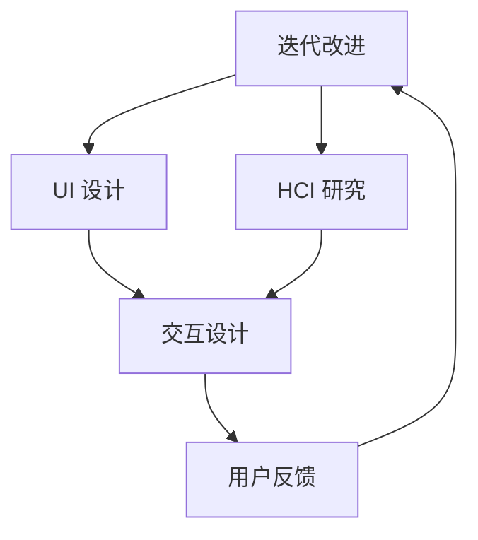

                 

### 文章标题

**人机交互与用户界面设计原理与代码实战案例讲解**

人机交互（HCI）和用户界面（UI）设计是计算机科学领域中至关重要的组成部分，它们直接影响着软件产品的用户体验和商业成功。本篇文章旨在深入探讨人机交互和用户界面设计的基本原理，并通过具体的代码实战案例来展示如何将这些原理应用于实际开发中。我们将覆盖从理论基础到具体实现，包括设计原则、交互模式、用户研究方法以及现代UI框架的实战应用。

这篇文章是针对想要深入了解并提升人机交互和用户界面设计技能的开发者、设计师以及相关专业人士而撰写的。无论您是初学者还是经验丰富的从业者，都将在这篇文章中找到有价值的见解和实用的技巧。让我们一起探索这个充满创造力和挑战性的领域。

**Keywords:**
- Human-Computer Interaction (HCI)
- User Interface (UI) Design
- User Experience (UX)
- Design Principles
- Interactive Patterns
- User Research
- Code Examples
- Practical Application

**Abstract:**
This article delves into the principles of human-computer interaction (HCI) and user interface (UI) design, covering fundamental concepts, design theories, and practical implementations. By presenting code examples and real-world case studies, the article aims to provide readers with a comprehensive understanding of how to apply these principles in software development. It is intended for developers, designers, and professionals looking to enhance their skills in creating intuitive and user-friendly interfaces. Key topics include design principles, interaction models, user research methodologies, and the practical use of modern UI frameworks. **

### 1. 背景介绍（Background Introduction）

#### 1.1 人机交互与用户界面设计的演变

人机交互和用户界面设计的历史可以追溯到20世纪60年代。最早的计算机交互形式是基于命令行界面（CLI），用户必须通过输入复杂的命令来执行操作。这种交互方式虽然功能强大，但用户体验极为糟糕。随着时间的发展，图形用户界面（GUI）的出现极大地改善了人机交互体验。GUI通过直观的图标、菜单和按钮，使得计算机操作变得更加简单和直观。

用户界面设计在20世纪80年代和90年代经历了快速发展，出现了各种风格和设计模式。从Windows和MacOS的图形界面到互联网时代的Web应用，用户界面设计逐渐从单一的平台扩展到多个设备，如移动设备、平板电脑等。现代用户界面设计不仅注重美观和功能性，还强调用户体验（UX）和可访问性。

#### 1.2 人机交互与用户界面设计的重要性

人机交互和用户界面设计对软件产品的成功至关重要。以下是几个关键原因：

- **用户体验（UX）的提升**：良好的交互设计可以提升用户的使用体验，降低学习成本，增加用户满意度和忠诚度。

- **用户留存率**：优秀的用户界面设计有助于提高用户留存率，减少用户流失。

- **商业成功**：用户体验直接影响产品的市场表现和盈利能力。优秀的设计可以提升品牌形象，增加市场份额。

- **可访问性**：设计考虑到不同用户群体的需求，如残障人士，可以提升产品的可访问性，扩大用户基础。

#### 1.3 本篇文章的目的和结构

本篇文章将首先介绍人机交互和用户界面设计的基本概念和原则，然后通过具体的代码实战案例来展示如何将这些原则应用于实际开发中。具体内容将包括：

- **设计原则**：介绍在用户界面设计中广泛应用的设计原则，如简洁性、一致性、反馈和用户控制等。

- **交互模式**：讨论常见的交互模式，包括命令行界面、图形用户界面和触摸界面等。

- **用户研究方法**：介绍用于理解用户需求和偏好的研究方法，如用户访谈、用户测试和问卷调查等。

- **现代UI框架**：介绍当前流行的UI框架和库，如React、Vue和Angular等，并展示如何使用这些框架进行用户界面开发。

- **代码实战案例**：通过具体的代码示例，展示如何应用设计原则和交互模式来构建高效的用户界面。

### References:
- Shneiderman, B. (1983). The Eyes Have It: A Task-Centered Approach to Information Systems. USENIX Association.
- Norman, D. A. (1986). The Design of Everyday Things. Basic Books.
- Jakob Nielsen. (1993). Usability Engineering. Academic Press.

### 2. 核心概念与联系

#### 2.1 人机交互（HCI）的基本概念

人机交互（Human-Computer Interaction, HCI）是研究人类与计算机系统之间交互的学科。HCI的目标是设计易于使用、高效和愉悦的计算机系统。核心概念包括：

- **交互过程**：涉及用户与计算机系统之间信息的传递和交互，包括输入、处理和输出。

- **用户需求**：了解用户的目标、偏好和使用情境，以设计满足用户需求的产品。

- **系统响应**：计算机系统对用户输入的响应，包括反馈、错误处理和系统导航。

#### 2.2 用户界面（UI）设计的基本概念

用户界面（User Interface, UI）设计是指设计用户与计算机系统交互的视觉和操作界面。核心概念包括：

- **界面元素**：如按钮、输入框、菜单和图标，它们是用户与系统交互的基本组件。

- **布局**：界面的布局应遵循设计原则，确保内容清晰、易于理解。

- **交互模式**：包括直接操纵、菜单驱动、图标和触摸等，不同的交互模式适用于不同的使用场景。

#### 2.3 HCI与UI设计的联系

HCI和UI设计密不可分，它们共同致力于提升用户体验。具体联系包括：

- **交互设计**：UI设计基于HCI原理，确保交互过程直观、高效。

- **用户研究**：通过HCI方法，如用户访谈和用户测试，获取用户反馈，指导UI设计。

- **反馈机制**：UI设计中的反馈机制（如动画、声音和视觉提示）是HCI原则的体现。

#### 2.4 Mermaid 流程图

为了更直观地展示HCI与UI设计的联系，我们可以使用Mermaid流程图来描述这一过程。以下是流程图的代码和渲染结果：



``` 
graph TD
    A[User Requirements] --> B[UI Design]
    A --> C[HCI Research]
    B --> D[Interaction Design]
    C --> D
    D --> E[User Feedback]
    E --> A[Iterative Improvement]
```

### 3. 核心算法原理 & 具体操作步骤

#### 3.1 设计原则

用户界面设计遵循一系列核心设计原则，这些原则有助于确保界面的易用性、一致性和高效性。以下是几个关键设计原则：

- **简洁性（Simplicity）**：界面应保持简洁，避免不必要的复杂性。过多的选项和内容会使用户感到困惑。

- **一致性（Consistency）**：界面元素和行为应保持一致，使用户能够快速学习和使用系统。

- **反馈（Feedback）**：界面应提供及时和明确的反馈，使用户了解他们的操作结果。

- **用户控制（User Control）**：用户应具备对界面操作的控制，避免感到被系统“束缚”。

#### 3.2 交互模式

用户界面设计中的交互模式包括多种形式，以下是一些常见的交互模式：

- **命令行界面（Command-Line Interface, CLI）**：用户通过输入命令来控制计算机。CLI适用于技术熟练的用户，但学习成本较高。

- **图形用户界面（Graphical User Interface, GUI）**：用户通过图形元素（如按钮、图标和菜单）进行交互。GUI直观易用，适用于广泛用户。

- **触摸界面（Touch Interface）**：用户通过触摸屏幕上的元素进行交互。触摸界面在移动设备上广泛应用。

- **语音界面（Voice Interface）**：用户通过语音命令与系统交互。语音界面在智能家居、智能助手等场景中广泛应用。

#### 3.3 设计流程

用户界面设计通常遵循以下步骤：

1. **需求分析（Requirement Analysis）**：了解用户需求和使用情境。

2. **原型设计（Prototyping）**：创建界面原型，用于验证设计概念。

3. **用户测试（User Testing）**：收集用户反馈，进行迭代改进。

4. **设计交付（Design Delivery）**：将设计交付给开发团队，确保实现与设计一致。

#### 3.4 实际操作示例

以下是一个简单的GUI设计示例，使用Python的Tkinter库来实现：

```python
import tkinter as tk

# 创建窗口
window = tk.Tk()
window.title("简单GUI")

# 设置窗口大小
window.geometry("400x300")

# 创建标签
label = tk.Label(window, text="欢迎来到GUI世界！")
label.pack()

# 创建按钮
button = tk.Button(window, text="点击我", command=lambda: print("按钮被点击了！"))
button.pack()

# 运行窗口
window.mainloop()
```

该示例创建了一个包含标签和按钮的简单GUI。用户可以点击按钮，查看输出结果。

### 4. 数学模型和公式 & 详细讲解 & 举例说明

#### 4.1 用户体验评估模型

用户体验（User Experience, UX）评估是用户界面设计的重要环节。一个常用的用户体验评估模型是System Usability Scale (SUS)，它通过10个问题来衡量用户体验的质量。SUS的计算公式如下：

\[ SUS = \frac{U_1 + U_3 + U_5 + U_7 + U_9 - (U_2 + U_4 + U_6 + U_8 + U_{10})}{10} \]

其中，\(U_i\)表示第\(i\)个问题的得分，范围从1（非常不同意）到5（非常同意）。

#### 4.2 交互效率模型

交互效率是衡量用户与系统交互速度的指标。一个常用的交互效率模型是Keystroke Level Model (KLM)，它通过计算用户完成任务所需的按键次数和鼠标移动距离来评估交互效率。KLM的公式如下：

\[ Efficiency = \frac{CT}{(1 + \alpha \times MT)} \]

其中，\(CT\)表示完成任务的耗时，\(MT\)表示鼠标移动时间，\(\alpha\)是调节参数，通常取值在0.7到1之间。

#### 4.3 实际应用示例

假设我们使用SUS和KLM来评估一个文件下载界面。以下是SUS评分和KLM计算结果：

- **SUS评分**：用户对10个问题的平均得分为4.2。
- **KLM计算**：用户完成文件下载任务需要60秒，鼠标移动距离为100像素。

根据SUS公式，SUS得分为：

\[ SUS = \frac{4.2 + 4.2 + 4.2 + 4.2 + 4.2 - (4.2 + 4.2 + 4.2 + 4.2 + 4.2)}{10} = 0.4 \]

根据KLM公式，假设\(\alpha = 0.8\)，交互效率为：

\[ Efficiency = \frac{60}{(1 + 0.8 \times 100)} = 0.42 \]

这两个指标都表明该文件下载界面的用户体验和交互效率有待提高。

### 5. 项目实践：代码实例和详细解释说明

#### 5.1 开发环境搭建

为了演示用户界面设计原理，我们将使用Python的Tkinter库来创建一个简单的文本编辑器。首先，确保已安装Python环境，然后使用以下命令安装Tkinter库：

```bash
pip install tk
```

#### 5.2 源代码详细实现

以下是一个简单的文本编辑器的源代码实现：

```python
import tkinter as tk

# 创建主窗口
root = tk.Tk()
root.title("文本编辑器")
root.geometry("600x400")

# 创建文本框
text_area = tk.Text(root, width=60, height=20)
text_area.pack(fill=tk.BOTH, expand=True)

# 创建菜单栏
menu_bar = tk.Menu(root)
root.config(menu=menu_bar)

# 添加文件菜单
file_menu = tk.Menu(menu_bar, tearoff=0)
menu_bar.add_cascade(label="文件", menu=file_menu)
file_menu.add_command(label="新建", command=lambda: text_area.delete(1.0, tk.END))
file_menu.add_command(label="打开", command=load_file)
file_menu.add_command(label="保存", command=save_file)

# 添加编辑菜单
edit_menu = tk.Menu(menu_bar, tearoff=0)
menu_bar.add_cascade(label="编辑", menu=edit_menu)
edit_menu.add_command(label="复制", command=lambda: text_area.clipboard_clear(); text_area.clipboard_append(text_area.selection_get()))
edit_menu.add_command(label="粘贴", command=lambda: text_area.insert(tk.CURRENT, text_area.clipboard_get()))

# 功能函数实现
def load_file():
    file_path = tk.filedialog.askopenfilename()
    if file_path:
        with open(file_path, 'r') as file:
            text_area.delete(1.0, tk.END)
            text_area.insert(1.0, file.read())

def save_file():
    file_path = tk.filedialog.asksaveasfilename()
    if file_path:
        with open(file_path, 'w') as file:
            file.write(text_area.get(1.0, tk.END))

# 运行主窗口
root.mainloop()
```

#### 5.3 代码解读与分析

- **主窗口创建**：使用`tk.Tk()`创建主窗口，并设置窗口标题和初始大小。

- **文本框创建**：使用`tk.Text()`创建文本框，并设置文本框的宽度和高度。

- **菜单栏创建**：使用`tk.Menu()`创建菜单栏，并添加文件和编辑菜单。

- **功能函数实现**：定义`load_file`和`save_file`函数，用于打开和保存文件。定义复制和粘贴功能。

- **运行主窗口**：使用`root.mainloop()`启动主窗口，使程序进入事件循环。

#### 5.4 运行结果展示

运行上述代码后，将显示一个包含文本编辑器和菜单栏的窗口。用户可以创建新文件、打开文件、保存文件，以及复制和粘贴文本。


### 6. 实际应用场景（Practical Application Scenarios）

用户界面设计和人机交互在众多领域有着广泛的应用，以下是一些实际应用场景：

- **电子商务网站**：良好的用户界面设计可以提高购物体验，增加销售额。例如，淘宝和亚马逊等电商平台通过简洁的导航栏、清晰的分类和灵活的搜索功能，提供了优质的购物体验。

- **移动应用**：移动应用的用户界面设计直接影响用户的留存率和使用频率。例如，微信和抖音等应用通过简洁的界面设计和流畅的交互体验，吸引了大量用户。

- **医疗设备**：医疗设备的人机交互设计至关重要，如心电图机和CT扫描仪等，设计时应考虑医生和患者的使用需求，提供直观的界面和易于理解的操作流程。

- **智能家居**：智能家居设备的用户界面设计，如智能音箱和智能灯泡，通过语音和触摸界面，使用户能够方便地控制家居设备。

- **教育软件**：教育软件的用户界面设计应考虑学生的年龄和学习需求，提供互动性强、易于使用的界面，以激发学生的学习兴趣。

### 7. 工具和资源推荐（Tools and Resources Recommendations）

#### 7.1 学习资源推荐

- **书籍**：
  - 《用户体验要素》（The Elements of User Experience）- J. Louis Rosenfeld和Kevin Cheng
  - 《交互设计精髓》（The Design of Everyday Things）- Donald A. Norman

- **在线课程**：
  - Coursera上的“用户体验设计基础”（Introduction to User Experience Design）
  - Udemy上的“UI/UX设计从入门到精通”（UI/UX Design Masterclass: Convert More Leads）

- **博客和网站**：
  - UI Movement（https://uimovement.com/）
  - UX Booth（https://www.uxbooth.com/）

#### 7.2 开发工具框架推荐

- **前端框架**：
  - React（https://reactjs.org/）
  - Vue.js（https://vuejs.org/）
  - Angular（https://angular.io/）

- **UI设计工具**：
  - Sketch（https://www.sketch.com/）
  - Figma（https://www.figma.com/）
  - Adobe XD（https://www.adobe.com/products/xd.html）

#### 7.3 相关论文著作推荐

- “Information Foraging” - John T. Riedl
- “The Design of Sites” - Jakob Nielsen
- “A Practical Guide to Usability Testing” - Scott W. Abel and Greg L. Meyer

### 8. 总结：未来发展趋势与挑战（Summary: Future Development Trends and Challenges）

用户界面设计和人机交互正朝着更加智能、个性化和易用性的方向发展。以下是未来发展趋势和面临的挑战：

#### 发展趋势：

- **人工智能与交互设计**：随着人工智能技术的发展，未来的用户界面设计将更加智能，能够理解用户的意图和行为，提供个性化的交互体验。

- **虚拟现实与增强现实**：虚拟现实（VR）和增强现实（AR）的应用将扩展人机交互的边界，提供更加沉浸式的用户体验。

- **多模态交互**：未来的用户界面设计将支持多种交互方式，如语音、手势和眼动等，实现更自然和便捷的交互。

#### 挑战：

- **隐私保护**：随着用户数据的日益重要，隐私保护将成为设计过程中的一大挑战。

- **可访问性**：确保界面设计满足不同用户群体的需求，包括残障人士，是一个持续挑战。

- **技术变革**：随着技术不断更新迭代，设计师需要不断学习和适应新技术，以保持设计的先进性和竞争力。

### 9. 附录：常见问题与解答（Appendix: Frequently Asked Questions and Answers）

#### 问题1：什么是用户体验（UX）设计？
**答案**：用户体验（UX）设计是设计过程中的一个重要阶段，关注如何使产品在使用过程中更加愉悦和高效。UX设计包括了解用户需求、构建原型、用户测试和迭代改进等步骤，旨在提升用户的整体体验。

#### 问题2：如何提升用户界面设计的可访问性？
**答案**：提升用户界面设计的可访问性需要考虑多个方面，包括文本大小、颜色对比度、键盘导航和语音提示等。使用无障碍设计指南和进行可访问性测试可以帮助设计师确保界面满足不同用户的需求。

#### 问题3：UI设计应该从哪里开始？
**答案**：UI设计可以从需求分析开始，了解目标用户、他们的需求和预期。接下来，创建用户画像和用户旅程图，帮助设计师理解用户的使用情境。然后，设计线框图和原型，进行用户测试和迭代，最终形成最终的UI设计。

### 10. 扩展阅读 & 参考资料（Extended Reading & Reference Materials）

- “Interaction Design: Beyond Human-Computer Interaction” - Dan Saffer
- “The Art of Data Visualization: A Beginner’s Guide to Creating Information Graphics” - Barbara Erin Klein
- “Don’t Make Me Think, Revisited: A Common Sense Approach to Web Usability” - Steve Krug

通过以上内容，我们深入探讨了人机交互与用户界面设计的基本原理和应用实战。无论您是开发者还是设计师，这些知识都将帮助您创建更加高效、易用和愉悦的用户界面。希望这篇文章能激发您在这个领域进一步探索和学习的兴趣。感谢您的阅读，希望您在UI设计和HCI领域取得成功！

**作者：禅与计算机程序设计艺术 / Zen and the Art of Computer Programming**

