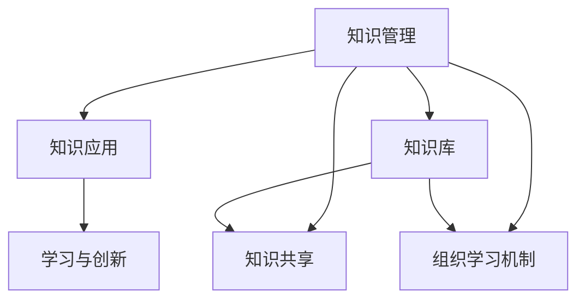

                 

# 知识管理与组织学习的关系

## 1. 背景介绍

知识管理(Knowledge Management, KM)和组织学习(Organizational Learning)是当前企业管理和信息技术领域的热点话题，也是推动企业创新和发展的核心动力。随着信息化技术的不断进步，企业内部的信息系统和知识库建设越来越完善，但如何更好地将知识转化为实际生产力，如何通过学习驱动组织不断进步，已成为企业面对的重大挑战。本文将探讨知识管理与组织学习之间的关系，从理论到实践，深入分析其核心原理和应用策略。

### 1.1 问题由来
在数字化转型的浪潮下，企业对知识管理的重视程度日益提高。知识管理不仅涉及数据的收集和存储，更重要的是通过知识分享和应用，推动企业创新和竞争力提升。与此同时，组织学习也被广泛认可为驱动企业持续进步的关键因素，它不仅涉及个人的学习，更强调整个组织的学习文化和机制建设。

然而，企业如何通过知识管理促进组织学习，如何让知识管理与组织学习紧密结合，这一问题在实践中往往难以系统回答。本文旨在通过深入分析，提供一套完整的知识管理与组织学习的理论框架，并给出具体的实践建议。

### 1.2 问题核心关键点
知识管理与组织学习之间的关系主要体现在以下几个关键点：

- **知识共享**：如何将企业内部的知识高效共享，是知识管理的基础。
- **知识应用**：如何将知识应用于业务场景，是知识管理的目标。
- **组织学习机制**：如何通过知识管理促进组织整体学习，是知识管理的关键。
- **学习与创新**：如何将知识转化为创新成果，是组织学习的核心。
- **知识库建设**：如何构建和维护知识库，是知识管理的核心工作。

### 1.3 问题研究意义
理解知识管理与组织学习之间的关系，对于企业战略决策、业务流程优化、人才培养和企业竞争力提升具有重要意义：

1. **战略决策**：知识管理与组织学习为高层管理者提供数据支持和决策依据，帮助企业制定长期发展战略。
2. **业务流程优化**：知识管理与组织学习能够识别和消除业务瓶颈，提升企业运营效率。
3. **人才培养**：知识管理与组织学习为员工提供持续学习的机会，提升整体素质和技能水平。
4. **竞争力提升**：知识管理与组织学习能够驱动企业创新，形成独特的竞争优势。
5. **可持续发展**：知识管理与组织学习推动企业长期可持续发展，应对市场变化和竞争挑战。

## 2. 核心概念与联系

### 2.1 核心概念概述

为更好地理解知识管理与组织学习之间的关系，本节将介绍几个密切相关的核心概念：

- **知识管理**：指通过信息系统的建设和管理，对企业内部知识进行识别、收集、存储、共享和应用的过程，旨在促进企业创新和效率提升。
- **组织学习**：指通过企业内部的人力资源开发和学习机制建设，促进企业员工知识和经验的共享和应用，提升企业整体的学习能力和竞争力。
- **知识库**：指通过软件系统存储和管理的企业内部知识集合，是知识管理的核心组件。
- **学习型组织**：指具备高度学习能力和持续创新能力的组织，强调通过组织学习机制不断提升自身的竞争力和适应能力。

这些核心概念之间的逻辑关系可以通过以下Mermaid流程图来展示：



这个流程图展示的知识管理与组织学习的基本框架：

1. 知识管理通过知识库的建设，实现知识的收集和存储。
2. 知识共享是知识管理的基础，通过共享机制实现知识在组织内部的传递。
3. 知识应用是知识管理的目标，通过知识在业务场景中的实际应用，推动企业创新和效率提升。
4. 组织学习机制是知识管理的核心，通过建立学习型组织，促进知识的转化和应用。
5. 学习与创新是组织学习的核心，通过知识的共享和应用，驱动企业的持续进步。

## 3. 核心算法原理 & 具体操作步骤

### 3.1 算法原理概述

知识管理与组织学习的核心在于通过知识共享和应用，推动组织学习过程的持续进行。其核心算法原理包括以下几个方面：

- **知识识别与分类**：对企业内部的知识和经验进行识别和分类，建立知识地图。
- **知识存储与检索**：利用知识库系统，对知识进行高效存储和检索，便于后续应用。
- **知识共享机制**：通过知识共享平台，促进企业内部知识的传递和交流。
- **知识应用机制**：将知识应用于业务流程，提升企业运营效率和创新能力。
- **组织学习机制**：通过学习机制的建设，提升组织的学习能力和适应性。

### 3.2 算法步骤详解

知识管理与组织学习的实际操作可以分解为以下几个关键步骤：

**Step 1: 知识识别与分类**
- 识别企业内部各类知识，如文档、案例、经验、技能等。
- 对知识进行分类，建立知识分类体系，便于后续管理。

**Step 2: 知识存储与检索**
- 建立知识库系统，对知识进行结构化存储。
- 提供高效的知识检索机制，方便员工快速获取所需知识。

**Step 3: 知识共享机制**
- 设计知识共享平台，支持文档上传、评论、评分等互动功能。
- 制定知识共享的激励机制，如知识分享奖励、排名等，鼓励员工分享。

**Step 4: 知识应用机制**
- 将知识应用于业务流程，建立知识工作流。
- 利用知识管理工具，监测知识应用效果，进行反馈和优化。

**Step 5: 组织学习机制**
- 制定组织学习计划，定期组织培训和交流。
- 建立学习型组织文化，鼓励员工不断学习和创新。

### 3.3 算法优缺点

知识管理与组织学习的核心算法具有以下优点：

- **高效知识共享**：通过知识共享平台，实现知识在企业内部的高效传递。
- **知识持续积累**：知识库系统使得企业知识持续积累，避免知识流失。
- **促进组织学习**：通过学习机制的建设，提升组织的学习能力和适应性。
- **驱动企业创新**：通过知识应用，推动企业持续创新和进步。

同时，该算法也存在一些局限性：

- **高成本**：知识库建设和管理需要大量投入，包括硬件、软件和人力资源。
- **知识孤岛**：如果知识共享机制不完善，容易出现知识孤岛现象，影响知识传播。
- **缺乏标准化**：知识分类和存储缺乏统一标准，可能影响知识的一致性和可用性。
- **组织文化挑战**：如果组织文化不支持学习，知识管理与组织学习的效果将大打折扣。
- **知识过时**：知识库中的内容需要定期更新，否则容易过时，影响实际应用。

### 3.4 算法应用领域

知识管理与组织学习的方法在多个领域得到广泛应用，如：

- **制造业**：通过知识管理优化生产流程，提升产品质量和生产效率。
- **金融业**：通过知识管理提升风险控制能力，优化投资决策。
- **医疗业**：通过知识管理提高诊断准确性，推动医疗技术创新。
- **教育业**：通过知识管理提升教学质量，促进教育公平。
- **信息技术**：通过知识管理提升软件开发效率，推动技术创新。
- **服务业**：通过知识管理提升服务质量，增强客户满意度。

除了上述这些领域外，知识管理与组织学习还被应用于政府、农业、物流、环保等多个行业，推动各行业的数字化转型和知识驱动发展。

## 4. 数学模型和公式 & 详细讲解  
### 4.1 数学模型构建

知识管理与组织学习的数学模型主要涉及知识共享、知识应用和组织学习三个核心环节。

**知识共享模型**：
- 知识共享网络：利用图论模型描述知识共享关系，表示员工之间的知识传递路径。
- 知识共享度量：定义知识共享度量指标，如知识共享数量、知识共享频率等。

**知识应用模型**：
- 知识应用路径：利用流程模型描述知识应用于业务流程的路径。
- 知识应用效果：定义知识应用效果指标，如项目成功率、创新成果数量等。

**组织学习模型**：
- 学习行为模型：描述员工的学习行为，如学习频率、学习时长等。
- 组织学习效果：定义组织学习效果指标，如员工满意度、组织创新率等。

### 4.2 公式推导过程

以知识共享模型为例，推导知识共享网络的相关公式：

设企业中有 $n$ 个员工，每个员工 $i$ 与 $j$ 之间共享知识的关系表示为 $A_{ij}$。

**知识共享网络图论模型**：
- 邻接矩阵 $A$：$A_{ij} = 1$ 表示员工 $i$ 与 $j$ 之间有知识共享关系，$A_{ij} = 0$ 表示无关系。
- 度数分布 $D$：表示每个员工的知识共享度，$D_i = \sum_{j=1}^n A_{ij}$。

**知识共享度量指标**：
- 知识共享数量 $N$：表示企业内部知识共享的总次数。
- 知识共享频率 $F$：表示每个员工的知识共享频率。

根据知识共享网络图论模型，可以推导出以下公式：

$$
N = \sum_{i=1}^n \sum_{j=1}^n A_{ij}
$$

$$
F_i = \frac{\sum_{j=1}^n A_{ij}}{D_i}
$$

以上公式展示了知识共享度量的计算方法。

### 4.3 案例分析与讲解

**案例：某制造企业知识共享网络分析**

某制造企业有200名员工，通过对知识共享数据的统计分析，建立知识共享网络图，如下图所示：

```
      1   2   3   4   5
1  A   A   B   B   B
2  B   C   C   C   B
3  B   C   C   D   D
4  B   C   D   E   E
5  B   B   D   E   F
```

其中，A表示知识共享，B表示知识获取。根据邻接矩阵和度数分布，计算每个员工的平均知识共享频率：

$$
F_1 = \frac{3+2+1+1+1}{4} = 1.5
$$

$$
F_2 = \frac{2+3+1+2+1}{6} = 1.4
$$

$$
F_3 = \frac{2+3+2+1+2}{9} = 1.3
$$

$$
F_4 = \frac{2+2+1+1+3}{8} = 1.3
$$

$$
F_5 = \frac{2+1+1+2+2}{7} = 1.2
$$

以上案例展示了知识共享网络的基本构建方法和度量指标的计算过程。

## 5. 项目实践：代码实例和详细解释说明
### 5.1 开发环境搭建

在进行知识管理与组织学习的项目实践前，我们需要准备好开发环境。以下是使用Python进行开发的环境配置流程：

1. 安装Anaconda：从官网下载并安装Anaconda，用于创建独立的Python环境。

2. 创建并激活虚拟环境：
```bash
conda create -n km-env python=3.8 
conda activate km-env
```

3. 安装相关Python包：
```bash
pip install pandas numpy scikit-learn matplotlib seaborn
```

4. 安装相关数据库：
```bash
pip install sqlite3
```

完成上述步骤后，即可在`km-env`环境中开始项目实践。

### 5.2 源代码详细实现

这里我们以知识共享网络分析为例，给出使用Python进行知识共享度量分析的代码实现。

首先，定义知识共享数据处理函数：

```python
import pandas as pd
import numpy as np
import sqlite3

def read_data(db_path):
    conn = sqlite3.connect(db_path)
    query = "SELECT employee_id, sharing_count FROM knowledge_sharing"
    df = pd.read_sql_query(query, conn)
    conn.close()
    return df

def calculate_knowledge_sharing(df):
    degree = df.groupby('employee_id')['employee_id'].transform('count')
    sharing_frequency = df.groupby('employee_id')['employee_id'].transform(lambda x: x.sum() / degree)
    return degree, sharing_frequency
```

然后，定义知识共享度量分析函数：

```python
def analyze_knowledge_sharing(df):
    degree, frequency = calculate_knowledge_sharing(df)
    avg_frequency = frequency.mean()
    print("平均知识共享频率:", avg_frequency)
    print("知识共享度量指标:", degree, frequency)
```

最后，启动分析流程并输出结果：

```python
# 读取知识共享数据
df = read_data('knowledge_sharing.db')

# 知识共享度量分析
analyze_knowledge_sharing(df)
```

以上就是使用Python进行知识共享网络分析的完整代码实现。可以看到，代码相对简洁，通过调用Pandas库的数据处理和SQLite库的数据库操作，可以快速完成知识共享度量的计算和分析。

### 5.3 代码解读与分析

让我们再详细解读一下关键代码的实现细节：

**read_data函数**：
- 定义了读取知识共享数据的基本方法，通过SQLite库与数据库进行交互，获取知识共享数据，并转换为Pandas DataFrame格式。

**calculate_knowledge_sharing函数**：
- 定义了计算知识共享度量指标的基本方法，包括计算每个员工的度数和频率。利用Pandas的groupby方法，对员工ID进行分组，计算每个员工的知识共享度数和频率。

**analyze_knowledge_sharing函数**：
- 定义了知识共享度量分析的基本方法，通过调用calculate_knowledge_sharing函数，计算知识共享度量和平均共享频率。

代码实现了知识共享度量的基本计算和分析，为知识共享网络的研究提供了有力的工具支持。

## 6. 实际应用场景
### 6.1 智能制造企业

在智能制造企业中，知识管理与组织学习可以显著提升生产效率和产品质量。通过知识共享平台，制造企业可以快速传播生产经验和技术工艺，提升员工的技能水平。

具体而言，智能制造企业可以建立生产工艺库、设备维护手册、质量检测标准等知识库，通过知识共享平台，将知识分享给全体员工，提升生产过程的标准化和规范化。同时，利用知识应用机制，通过知识工作流将知识应用于生产流程，优化生产计划和工艺流程，提高生产效率和产品质量。

### 6.2 金融服务行业

金融服务行业需要通过知识管理与组织学习，提升风险控制能力和投资决策水平。金融企业可以建立风险评估模型、投资策略库、市场分析报告等知识库，通过知识共享平台，将知识分享给投资和风控团队，提升决策的科学性和精准性。

具体而言，金融企业可以利用知识应用机制，将风险评估模型应用于投资组合分析、信用评估等场景，提高风险控制能力。同时，通过组织学习机制，定期组织培训和交流，提升员工的风险意识和决策能力，增强企业的竞争力。

### 6.3 医疗健康领域

医疗健康领域需要通过知识管理与组织学习，提升诊断和治疗能力。医疗机构可以建立电子病历库、临床指南、病例分析等知识库，通过知识共享平台，将知识分享给医护人员，提升诊断和治疗的准确性和效率。

具体而言，医疗机构可以利用知识应用机制，将临床指南应用于病历分析、诊断治疗等场景，提高诊疗的准确性和效率。同时，通过组织学习机制，定期组织培训和交流，提升医护人员的诊断和治疗能力，增强企业的服务水平。

### 6.4 未来应用展望

随着知识管理与组织学习技术的不断发展，未来在更多领域将得到应用，为各行各业带来变革性影响。

在智慧城市治理中，知识管理与组织学习可以应用于城市事件监测、舆情分析、应急指挥等环节，提高城市管理的自动化和智能化水平，构建更安全、高效的未来城市。

在智慧教育领域，知识管理与组织学习可以应用于知识推荐、学情分析、教育资源共享等环节，提升教育资源的利用效率，促进教育公平和质量提升。

在智慧农业领域，知识管理与组织学习可以应用于农艺技术传播、农业知识共享、农产品质量控制等环节，提升农业生产效率和产品质量，推动农业现代化发展。

此外，在智慧交通、智慧能源、智慧环保等众多领域，知识管理与组织学习也将不断涌现新的应用，为智慧社会的建设提供新的动力。

## 7. 工具和资源推荐
### 7.1 学习资源推荐

为了帮助开发者系统掌握知识管理与组织学习的方法，这里推荐一些优质的学习资源：

1. 《知识管理：应用与实践》系列书籍：由知识管理专家撰写，全面介绍了知识管理的理论基础和实践方法。

2. 《组织学习：理论与实践》系列论文：描述了组织学习的理论基础和实际应用案例。

3. 《学习型组织：构建与运营》课程：哈佛商学院开设的组织学习相关课程，系统介绍了学习型组织的构建和运营方法。

4. 《知识管理软件》推荐文章：推荐了几款主流的知识管理软件，如Confluence、SharePoint、JIRA等，帮助企业实现知识共享和应用。

5. 《组织学习系统设计》讲座：知名专家讲解组织学习系统的设计和实现方法，提供实战案例和经验分享。

通过对这些资源的学习实践，相信你一定能够快速掌握知识管理与组织学习的精髓，并用于解决实际的组织管理问题。

### 7.2 开发工具推荐

高效的开发离不开优秀的工具支持。以下是几款用于知识管理与组织学习开发的常用工具：

1. Confluence：支持文档协作和知识共享的平台，集成了内容管理系统、任务管理、知识库等功能。

2. SharePoint：微软推出的企业级知识管理平台，支持文档共享、知识库、工作流等功能。

3. JIRA：一款项目管理工具，支持任务分配、进度跟踪、知识共享等功能。

4. Google Workspace：谷歌推出的云协作平台，支持文档协作、邮件、日历、知识库等功能。

5. Asana：一款任务管理工具，支持任务分配、进度跟踪、团队协作等功能。

6. Trello：一款看板管理工具，支持任务管理、知识共享、团队协作等功能。

合理利用这些工具，可以显著提升知识管理与组织学习的开发效率，加快创新迭代的步伐。

### 7.3 相关论文推荐

知识管理与组织学习的发展源于学界的持续研究。以下是几篇奠基性的相关论文，推荐阅读：

1. "Knowledge Sharing: A Review and Directions for Future Research"：描述了知识共享的研究现状和未来发展方向。

2. "Organizational Learning: A Review of Theory and Research"：系统综述了组织学习的理论基础和实际应用案例。

3. "Learning and Knowledge Sharing in Software Engineering: A Survey"：总结了软件工程领域中的知识共享和学习方法。

4. "Knowledge Management Systems: Towards Building Next-Generation Knowledge Management Systems"：探讨了下一代知识管理系统的设计与实现方法。

5. "Social Learning Analytics: Concepts and Technologies"：描述了社交学习分析的方法和技术，为知识共享和学习提供了新的视角。

这些论文代表了大规模知识管理与组织学习的发展脉络。通过学习这些前沿成果，可以帮助研究者把握学科前进方向，激发更多的创新灵感。

## 8. 总结：未来发展趋势与挑战

### 8.1 总结

本文对知识管理与组织学习之间的关系进行了全面系统的介绍。首先阐述了知识管理和组织学习的概念和基本原理，明确了知识管理与组织学习在企业创新和效率提升中的重要价值。其次，从理论到实践，详细讲解了知识管理与组织学习的核心算法和操作步骤，给出了知识管理与组织学习的完整代码实例。同时，本文还广泛探讨了知识管理与组织学习在多个行业领域的应用前景，展示了知识管理与组织学习的巨大潜力。此外，本文精选了知识管理与组织学习的各类学习资源，力求为读者提供全方位的技术指引。

通过本文的系统梳理，可以看到，知识管理与组织学习在企业信息化和数字化转型的浪潮中，正发挥着越来越重要的作用。随着信息技术的发展和企业管理水平的提升，知识管理与组织学习必将在更多企业中得到应用，推动企业向智能化、数据驱动的方向发展。

### 8.2 未来发展趋势

展望未来，知识管理与组织学习的技术将呈现以下几个发展趋势：

1. **智能化管理**：知识管理与组织学习将更加智能化，利用人工智能和机器学习技术，实现知识推荐、知识关联等自动化功能。
2. **数据驱动**：知识管理与组织学习将更加依赖数据驱动，通过数据分析和数据挖掘，发现知识之间的关系，提升知识应用效果。
3. **跨领域应用**：知识管理与组织学习将跨越更多行业和领域，通过标准化和集成，实现跨领域的知识共享和学习。
4. **社交化学习**：知识管理与组织学习将更加注重社交化学习，通过知识共享平台和社区，促进员工之间的互动和交流。
5. **实时学习**：知识管理与组织学习将更加注重实时性，通过在线学习平台和移动应用，实现随时随地的知识学习。
6. **自适应学习**：知识管理与组织学习将更加自适应，根据员工的学习能力和学习偏好，自动推荐学习内容，提高学习效果。

以上趋势凸显了知识管理与组织学习技术的广阔前景。这些方向的探索发展，必将进一步提升企业的创新能力和竞争优势，推动企业向智能化、数据驱动的方向发展。

### 8.3 面临的挑战

尽管知识管理与组织学习技术已经取得了瞩目成就，但在迈向更加智能化、普适化应用的过程中，它仍面临着诸多挑战：

1. **数据质量问题**：知识管理与组织学习依赖高质量的数据，但数据收集、整理和存储往往面临困难，影响知识共享和应用效果。
2. **知识标准化**：知识管理与组织学习缺乏统一的标准，可能导致知识孤岛和重复建设。
3. **员工接受度**：知识管理与组织学习需要员工具备较高的信息化素养，但在实际操作中，部分员工可能存在抵触情绪。
4. **技术融合难度**：知识管理与组织学习需要与各类业务系统进行集成，技术融合难度较大。
5. **安全性和隐私保护**：知识管理与组织学习涉及大量敏感信息，数据安全和隐私保护是重要挑战。
6. **知识更新速度**：知识库中的知识需要定期更新，但更新速度和频率难以兼顾。

这些挑战需要企业在实施知识管理与组织学习过程中，制定相应的策略和措施，克服技术和管理上的难点。

### 8.4 研究展望

面对知识管理与组织学习面临的种种挑战，未来的研究需要在以下几个方面寻求新的突破：

1. **数据质量提升**：研究高效的数据收集、整理和存储方法，提升知识管理的质量。
2. **知识标准化**：建立知识管理的统一标准，推动知识共享和集成。
3. **员工培训和激励**：制定培训计划和激励机制，提高员工的知识管理意识和能力。
4. **技术融合策略**：研究知识管理与组织学习与其他业务系统的集成策略，推动技术融合。
5. **安全性和隐私保护**：研究数据安全和技术安全措施，确保知识管理的安全性。
6. **知识更新机制**：建立知识更新的自动化机制，提高知识库的实时性。

这些研究方向将推动知识管理与组织学习技术向更高层次发展，为企业的数字化转型提供强有力的技术支撑。

## 9. 附录：常见问题与解答

**Q1：知识管理与组织学习的主要区别是什么？**

A: 知识管理主要关注知识的收集、存储和共享，强调从信息系统中获取知识。而组织学习主要关注知识的应用和学习机制，强调通过知识共享和学习活动，提升组织整体的学习能力和适应性。两者相辅相成，共同推动企业创新和进步。

**Q2：如何衡量知识管理与组织学习的成效？**

A: 知识管理与组织学习的成效可以通过以下几个指标来衡量：
1. 知识共享数量和频率
2. 知识应用效果，如项目成功率、创新成果数量
3. 组织学习效果，如员工满意度、组织创新率
4. 知识库的完整性和准确性
5. 知识库的使用率和访问率

**Q3：知识管理与组织学习需要哪些技术和工具支持？**

A: 知识管理与组织学习需要以下技术和工具支持：
1. 知识库系统，如Confluence、SharePoint等
2. 知识共享平台，如JIRA、Trello等
3. 数据管理系统，如SQLite、MySQL等
4. 数据分析工具，如Pandas、NumPy等
5. 可视化工具，如Matplotlib、Seaborn等

**Q4：知识管理与组织学习在实际应用中面临哪些挑战？**

A: 知识管理与组织学习在实际应用中面临以下挑战：
1. 数据质量问题
2. 知识标准化
3. 员工接受度
4. 技术融合难度
5. 安全性和隐私保护
6. 知识更新速度

这些挑战需要通过完善的技术和管理措施，逐步克服，才能实现知识管理与组织学习的实际应用价值。

**Q5：如何构建学习型组织？**

A: 构建学习型组织需要以下几个步骤：
1. 制定组织学习战略，明确学习目标和计划
2. 建立学习平台和机制，如知识共享平台、在线学习系统等
3. 制定激励措施，如知识分享奖励、学习积分等
4. 定期组织学习活动，如培训、交流会议等
5. 建立学习型文化，鼓励员工不断学习和创新

通过这些步骤，可以有效推动组织学习文化的建设，提升组织的整体学习能力和适应性。

---

作者：禅与计算机程序设计艺术 / Zen and the Art of Computer Programming

