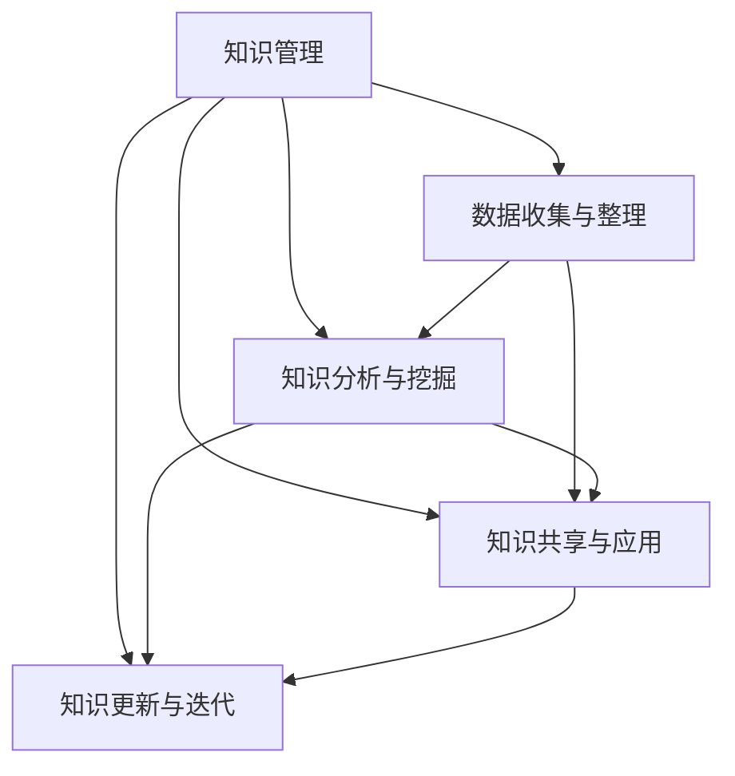

                 

# 知识管理在智慧城市建设中的作用

## 1. 背景介绍

### 1.1 问题由来

智慧城市（Smart City）是现代城市发展的重要趋势，旨在通过信息通信技术（ICT）的融合应用，提高城市治理、公共服务和市民生活等方面的智能化水平，构建安全、高效、绿色、宜居的城市环境。智慧城市建设涉及众多领域，包括智能交通、公共安全、能源管理、环境保护、教育卫生等，其核心支撑是各类智慧应用系统的高效协同。

随着智慧城市建设的不断推进，各类数据生成量和类型日益复杂，海量的数据如何在城市管理决策、资源配置、应急响应等环节有效应用，成为城市管理者必须面对的挑战。知识管理（Knowledge Management, KM）作为智慧城市建设的重要组成部分，通过系统化、规范化的知识管理和应用，能够更好地支持智慧应用系统的构建和运营，提升城市治理能力。

### 1.2 问题核心关键点

知识管理在智慧城市建设中的核心作用在于通过收集、整理、分析和共享各类知识，支撑城市管理决策、资源优化配置和应急响应等任务。其核心关键点包括：

- **知识收集与整理**：智慧城市建设中涉及大量的数据，如交通流量、环境监测数据、公共服务数据等。通过知识管理平台，可以实现对这些数据的系统化整理和存储。
- **知识分析与挖掘**：利用数据挖掘、机器学习等技术手段，对知识库中的数据进行深入分析和挖掘，发现规律和趋势，辅助决策。
- **知识共享与应用**：通过知识共享平台，将分析结果、专家意见、研究成果等知识资源高效共享，使各类智慧应用系统能够利用丰富的知识资源提升功能和服务水平。
- **知识更新与迭代**：智慧城市建设是一个动态变化的过程，需要不断更新知识库和应用系统，确保知识的时效性和适用性。

## 2. 核心概念与联系

### 2.1 核心概念概述

为更好地理解知识管理在智慧城市建设中的作用，本节将介绍几个密切相关的核心概念：

- **知识管理（Knowledge Management, KM）**：通过系统化的方法，管理、存储、共享、应用知识资源的过程。包括知识收集、整理、分析、共享等多个环节。
- **智慧城市（Smart City）**：基于ICT技术融合，全面提升城市治理、公共服务和生活质量的城市形态。智慧城市涉及各类智慧应用系统的协同运作。
- **数据挖掘（Data Mining）**：从数据集中发现潜在的知识、规律和趋势的过程，常用于数据驱动的决策支持。
- **机器学习（Machine Learning, ML）**：使计算机通过算法和数据自动提升性能的科学。在知识管理中，常用于知识挖掘、智能推荐等任务。
- **知识图谱（Knowledge Graph）**：一种语义化的知识表示方式，通过图形化的节点和边，表示实体之间的关系。在智慧城市中，常用于知识整合、推理和应用。

这些核心概念之间的逻辑关系可以通过以下Mermaid流程图来展示：



这个流程图展示了一系列知识管理的核心活动，以及它们在智慧城市建设中的重要作用。

## 3. 核心算法原理 & 具体操作步骤

### 3.1 算法原理概述

智慧城市建设中的知识管理，主要涉及数据收集、整理、分析和应用等多个环节。其核心算法原理可以概括为：

1. **数据收集与整理**：利用各类传感器、监测设备等手段，采集城市环境、交通、公共服务等方面的数据，通过知识管理平台进行系统化整理和存储。
2. **知识分析与挖掘**：对收集到的数据进行数据清洗、预处理，然后利用数据挖掘、机器学习等技术手段，进行深入分析和挖掘，发现知识、规律和趋势。
3. **知识共享与应用**：将分析结果、专家意见、研究成果等知识资源共享至各类智慧应用系统中，辅助决策、优化资源配置和应急响应。
4. **知识更新与迭代**：根据智慧城市建设的动态变化，定期更新知识库和应用系统，确保知识的时效性和适用性。

### 3.2 算法步骤详解

#### 3.2.1 数据收集与整理

1. **数据采集**：通过城市基础设施的传感器、监测设备等，采集各类环境、交通、公共服务等方面的数据。例如，交通流量、空气质量、公共安全事件等。
2. **数据清洗与预处理**：对采集到的数据进行清洗，去除噪声、异常值等，并进行格式统一、归一化等预处理操作。
3. **数据存储与管理**：将预处理后的数据存储至知识管理平台，进行分类、索引和元数据管理，便于后续的查询和应用。

#### 3.2.2 知识分析与挖掘

1. **数据挖掘**：利用数据挖掘算法，从历史数据中发现模式、规律和趋势。例如，通过聚类分析识别交通拥堵区域，通过关联规则挖掘发现能源消耗与天气变化的关系等。
2. **机器学习**：利用机器学习模型，对数据进行建模和预测。例如，利用时间序列分析预测未来天气变化，利用异常检测算法识别公共安全事件等。
3. **知识表示**：将分析结果转换为语义化的知识表示，如知识图谱、概念图等。例如，将交通流量数据转换为交通网络图，将能源消耗数据转换为能源消耗模式图等。

#### 3.2.3 知识共享与应用

1. **知识共享**：通过知识共享平台，将分析结果、专家意见、研究成果等知识资源共享至各类智慧应用系统中。例如，将交通拥堵分析结果共享至智慧交通系统，将能源消耗模式共享至智慧能源管理系统等。
2. **知识应用**：各类智慧应用系统利用知识库中的知识资源，提升服务水平和决策能力。例如，智慧交通系统利用交通拥堵分析结果，调整信号灯和交通流量控制策略，智慧能源管理系统利用能源消耗模式，优化能源配置和节能策略等。

#### 3.2.4 知识更新与迭代

1. **知识更新**：定期收集新数据，对知识库进行更新，确保知识的时效性。例如，每月收集一次交通流量数据，更新交通拥堵分析结果。
2. **知识迭代**：根据智慧城市建设的动态变化，不断优化知识管理平台和应用系统，确保知识应用的准确性和可靠性。例如，根据智慧交通系统反馈的拥堵情况，调整数据分析模型，提高预测精度。

### 3.3 算法优缺点

智慧城市建设中的知识管理算法具有以下优点：

1. **数据驱动决策**：通过数据挖掘和机器学习，使城市管理决策更加科学、精准。
2. **提高资源利用率**：利用知识共享和应用，优化资源配置和运营效率。
3. **应急响应能力提升**：通过知识分析和预测，提升城市应急响应能力。

同时，也存在一些局限性：

1. **数据质量要求高**：数据采集和清洗的准确性直接影响知识分析的结果。
2. **知识更新频率高**：智慧城市建设是一个动态变化的过程，需要频繁更新知识库和应用系统。
3. **技术复杂度高**：数据挖掘、机器学习等技术手段复杂，需要专业的技术支持。
4. **知识共享和保护**：在知识共享过程中，需要注意数据安全和隐私保护，避免泄露敏感信息。

### 3.4 算法应用领域

知识管理在智慧城市建设中具有广泛的应用领域，主要包括以下几个方面：

1. **智慧交通**：通过交通流量、交通事件等数据的收集、分析和应用，优化交通信号灯控制，减少交通拥堵。
2. **公共安全**：利用视频监控、环境监测等数据，进行异常检测和事件预警，提高公共安全防范能力。
3. **智慧能源**：通过能源消耗、环境监测等数据的分析，优化能源配置和节能策略，提升能源利用效率。
4. **智慧医疗**：利用医疗数据和研究成果，优化医疗资源配置，提升医疗服务质量。
5. **智慧教育**：通过教育数据和研究成果，优化教学资源配置，提升教育服务质量。

## 4. 数学模型和公式 & 详细讲解 & 举例说明

### 4.1 数学模型构建

智慧城市建设中的知识管理主要涉及数据收集、整理、分析、共享等多个环节。其数学模型可以概括为：

1. **数据模型**：用于描述数据采集、清洗、预处理等过程。
2. **知识表示模型**：用于描述知识挖掘、知识图谱等过程。
3. **应用模型**：用于描述知识在智慧应用系统中的应用。

以智慧交通系统的知识管理为例，其数学模型可以表示为：

- **数据模型**：
  - 数据采集模型：描述交通流量数据的采集过程，包括传感器、监测设备等。
  - 数据清洗模型：描述交通流量数据的清洗过程，包括去噪、异常值检测等。
- **知识表示模型**：
  - 交通网络图模型：描述交通网络中各个节点和边的关系，包括路段、交叉口、信号灯等。
- **应用模型**：
  - 交通流量预测模型：描述交通流量的预测过程，包括时间序列分析、聚类分析等。

### 4.2 公式推导过程

#### 4.2.1 数据模型推导

1. **数据采集模型**：
  - 数据采集函数：$D_t = F_S(t, \theta_S)$，其中 $D_t$ 为时间 $t$ 的交通流量数据，$F_S$ 为传感器采集函数，$\theta_S$ 为传感器参数。
  - 数据采集方程：$D_t = \sum_{i=1}^N S_i(t) \cdot P_i(t)$，其中 $S_i$ 为传感器 $i$ 的采集数据，$P_i$ 为传感器 $i$ 的采集概率。

2. **数据清洗模型**：
  - 数据清洗函数：$D'_t = G_C(D_t, \theta_C)$，其中 $D'_t$ 为时间 $t$ 的清洗后交通流量数据，$G_C$ 为数据清洗函数，$\theta_C$ 为清洗参数。
  - 数据清洗方程：$D'_t = \sum_{i=1}^N S_i(t) \cdot P'_i(t)$，其中 $P'_i$ 为清洗后的采集概率。

#### 4.2.2 知识表示模型推导

1. **交通网络图模型**：
  - 节点表示：$N = \{n_1, n_2, ..., n_M\}$，其中 $n_i$ 为交通网络中的节点，$M$ 为节点数量。
  - 边表示：$E = \{e_1, e_2, ..., e_L\}$，其中 $e_i$ 为交通网络中的边，$L$ 为边数量。
  - 边权重：$w_{ij} = \omega(d_i, d_j)$，其中 $d_i$ 和 $d_j$ 为节点 $i$ 和节点 $j$ 的交通流量，$\omega$ 为权重计算函数。

2. **交通网络图方程**：
  - 节点关系方程：$n_i = \sum_{j=1}^M w_{ij} \cdot n_j$。
  - 边关系方程：$e_{ij} = d_i - d_j$。

#### 4.2.3 应用模型推导

1. **交通流量预测模型**：
  - 时间序列模型：$D_{t+1} = F_{TS}(D_t, \theta_{TS})$，其中 $F_{TS}$ 为时间序列模型，$\theta_{TS}$ 为模型参数。
  - 聚类模型：$D_{t+1} = F_{CL}(D_t, \theta_{CL})$，其中 $F_{CL}$ 为聚类模型，$\theta_{CL}$ 为模型参数。

2. **交通流量预测方程**：
  - 时间序列方程：$D_{t+1} = \sum_{i=1}^N F_{TS}(S_i(t), \theta_{TS})$。
  - 聚类方程：$D_{t+1} = \sum_{i=1}^N \max_{k=1}^K F_{CL}(S_i(t), \theta_{CL})$，其中 $K$ 为聚类数量。

### 4.3 案例分析与讲解

#### 4.3.1 数据收集与整理

以智慧交通系统为例，其数据收集与整理过程如下：

1. **数据采集**：通过城市交通基础设施的传感器，采集交通流量数据。例如，每10分钟采集一次各个路段的流量数据。
2. **数据清洗**：对采集到的数据进行清洗，去除噪声、异常值等，并进行格式统一、归一化等预处理操作。例如，去除因设备故障导致的异常数据点，将流量数据转换为标准单位。
3. **数据存储与管理**：将预处理后的数据存储至知识管理平台，进行分类、索引和元数据管理，便于后续的查询和应用。例如，将交通流量数据存储至数据库，设置节点和边关系，创建交通网络图。

#### 4.3.2 知识分析与挖掘

以交通流量预测为例，其知识分析与挖掘过程如下：

1. **数据挖掘**：利用数据挖掘算法，从历史交通流量数据中发现模式、规律和趋势。例如，通过聚类分析识别交通拥堵区域。
2. **机器学习**：利用时间序列分析模型，对未来交通流量进行预测。例如，利用ARIMA模型预测未来一周的交通流量变化。
3. **知识表示**：将预测结果转换为语义化的知识表示，如交通网络图。例如，将预测的交通流量数据转换为节点和边权重，更新交通网络图。

#### 4.3.3 知识共享与应用

以交通流量预测为例，其知识共享与应用过程如下：

1. **知识共享**：将交通流量预测结果共享至智慧交通系统。例如，将预测的交通流量数据共享至交通信号灯控制系统中。
2. **知识应用**：智慧交通系统利用预测结果，优化交通信号灯控制策略，减少交通拥堵。例如，根据预测结果，调整信号灯时长，减少拥堵路段的交通压力。

## 5. 项目实践：代码实例和详细解释说明

### 5.1 开发环境搭建

在进行知识管理实践前，我们需要准备好开发环境。以下是使用Python进行知识管理平台开发的典型环境配置流程：

1. 安装Anaconda：从官网下载并安装Anaconda，用于创建独立的Python环境。
2. 创建并激活虚拟环境：
  ```bash
  conda create -n km-env python=3.8 
  conda activate km-env
  ```
3. 安装Python相关工具包：
  ```bash
  pip install numpy pandas scikit-learn matplotlib tqdm jupyter notebook ipython
  ```
4. 安装PyTorch：用于数据挖掘和机器学习部分的模型开发。

完成上述步骤后，即可在`km-env`环境中开始知识管理平台的开发。

### 5.2 源代码详细实现

下面以智慧交通系统的知识管理平台为例，给出使用Python进行数据清洗、知识挖掘和知识应用的代码实现。

```python
import numpy as np
from sklearn.cluster import KMeans
from sklearn.metrics import mean_squared_error
import pandas as pd

# 假设数据集为pandas DataFrame，包含交通流量数据
data = pd.read_csv('traffic_flow_data.csv')

# 数据清洗
def clean_data(data):
    # 去噪处理
    data = data.dropna()
    # 异常值检测
    data = data[data < 100]
    return data

# 数据预处理
def preprocess_data(data):
    # 数据归一化
    data = (data - np.mean(data)) / np.std(data)
    return data

# 数据挖掘
def data_mining(data):
    # 聚类分析
    kmeans = KMeans(n_clusters=3)
    kmeans.fit(data)
    labels = kmeans.labels_
    return labels

# 知识表示
def knowledge_representation(data, labels):
    # 知识图谱构建
    graph = {}
    for i in range(len(data)):
        node = data[i]
        edge = data[i] * 0.5
        if i in labels:
            node += 'cluster_'
            node += str(labels[i])
        graph[node] = edge
    return graph

# 数据应用
def data_application(graph, new_data):
    # 预测交通流量
    new_data = preprocess_data(new_data)
    predictions = []
    for i in range(len(new_data)):
        if 'cluster_1' in graph:
            cluster = graph['cluster_1']
        else:
            cluster = 0
        predictions.append((new_data[i], cluster))
    return predictions

# 应用实例
data = pd.read_csv('traffic_flow_data.csv')
cleaned_data = clean_data(data)
preprocessed_data = preprocess_data(cleaned_data)
labels = data_mining(preprocessed_data)
graph = knowledge_representation(preprocessed_data, labels)
new_data = pd.read_csv('new_traffic_flow_data.csv')
predictions = data_application(graph, new_data)
```

以上就是使用Python进行智慧交通系统知识管理平台开发的基本代码实现。可以看到，通过这些函数，我们可以完成数据清洗、知识挖掘和知识应用等关键步骤。

### 5.3 代码解读与分析

让我们再详细解读一下关键代码的实现细节：

**clean_data函数**：
- 该函数实现数据清洗，去除噪声和异常值，保证数据的准确性。

**preprocess_data函数**：
- 该函数实现数据预处理，包括数据归一化，使数据在不同时间尺度的比较中更加公平。

**data_mining函数**：
- 该函数实现数据挖掘，通过聚类分析，识别交通流量数据中的模式和趋势。

**knowledge_representation函数**：
- 该函数实现知识表示，将分析结果转换为语义化的知识图谱，便于后续应用。

**data_application函数**：
- 该函数实现知识应用，利用知识图谱进行交通流量预测，生成预测结果。

通过这些函数的组合，我们可以构建起一个简单的智慧交通系统知识管理平台。实际开发中，还需要考虑数据采集、存储、管理等多个环节，实现更全面、灵活的知识管理功能。

## 6. 实际应用场景

### 6.1 智能交通管理

在智慧城市建设中，智能交通管理是核心应用之一。通过知识管理平台，可以实现对交通流量数据的系统化整理和存储，利用数据分析结果优化交通信号灯控制策略，提升交通运营效率。

具体而言，知识管理平台可以收集各个路段的交通流量数据，进行数据清洗和预处理，然后利用聚类分析和时间序列模型，预测未来交通流量变化。根据预测结果，调整信号灯时长和方向，实现交通流量的动态控制，减少交通拥堵，提升行车效率。

### 6.2 公共安全监测

公共安全是智慧城市建设的重要组成部分。通过知识管理平台，可以收集各类公共安全数据，如视频监控、环境监测数据等，进行异常检测和事件预警，提高公共安全防范能力。

例如，知识管理平台可以采集城市范围内的视频监控数据，进行异常检测，及时发现可疑行为或事件。同时，利用环境监测数据，如空气质量、温度等，进行异常预警，提前采取应对措施，保障市民安全。

### 6.3 智慧能源管理

智慧能源管理是智慧城市建设的重要方向之一。通过知识管理平台，可以实现对能源消耗数据的系统化整理和存储，利用数据分析结果优化能源配置和节能策略，提升能源利用效率。

具体而言，知识管理平台可以收集各类能源消耗数据，如电网用电、交通油耗、建筑能耗等，进行数据清洗和预处理，然后利用聚类分析和时间序列模型，预测未来能源消耗趋势。根据预测结果，优化能源配置和节能策略，提升能源利用效率，降低能耗和成本。

### 6.4 未来应用展望

未来，随着智慧城市建设的不断推进，知识管理在城市治理、公共服务和市民生活等领域将发挥更加重要的作用。

1. **数据融合与共享**：智慧城市建设需要融合多种数据源，知识管理平台可以实现数据的系统化整理和共享，提升数据融合能力。
2. **智能决策支持**：知识管理平台通过数据挖掘和机器学习，提供智能决策支持，辅助城市管理决策。
3. **智慧应急响应**：通过知识管理平台，实现对各类突发事件的及时预警和应急响应，保障市民安全。
4. **智慧服务提升**：知识管理平台可以提升智慧应用系统的服务水平，如智慧医疗、智慧教育等，优化资源配置和运营效率。

## 7. 工具和资源推荐

### 7.1 学习资源推荐

为了帮助开发者系统掌握知识管理在智慧城市建设中的应用，这里推荐一些优质的学习资源：

1. 《智能城市建设与知识管理》系列博文：由智慧城市专家撰写，深入浅出地介绍了智慧城市建设中的知识管理技术。
2. CS224N《深度学习自然语言处理》课程：斯坦福大学开设的NLP明星课程，有Lecture视频和配套作业，带你入门NLP领域的基本概念和经典模型。
3. 《Knowledge Management in Smart Cities》书籍：全面介绍了知识管理在智慧城市建设中的应用，包括数据收集、整理、分析、共享等多个环节。
4. IBM Watson知识管理平台：全球领先的智慧城市知识管理平台，提供丰富的知识管理工具和应用案例。
5. Microsoft Azure认知服务：微软推出的智慧城市知识管理服务，提供强大的数据处理和分析能力。

通过对这些资源的学习实践，相信你一定能够系统掌握知识管理在智慧城市建设中的应用，并用于解决实际的智慧城市问题。

### 7.2 开发工具推荐

高效的开发离不开优秀的工具支持。以下是几款用于知识管理平台开发的常用工具：

1. Python：广泛应用的数据处理和分析工具，灵活高效，适合知识管理平台的开发。
2. SQL和NoSQL数据库：用于数据存储和管理，支持复杂查询和数据分析。
3. Elasticsearch：全文搜索引擎，支持自然语言处理和知识检索。
4. PyTorch和TensorFlow：深度学习框架，用于数据挖掘和机器学习部分的模型开发。
5. Jupyter Notebook：交互式编程环境，支持数据处理、分析、可视化等多个环节。

合理利用这些工具，可以显著提升知识管理平台的开发效率，加快创新迭代的步伐。

### 7.3 相关论文推荐

知识管理在智慧城市建设中的应用源于学界的持续研究。以下是几篇奠基性的相关论文，推荐阅读：

1. "Knowledge Management in Smart Cities: A Survey"：综述了智慧城市建设中的知识管理技术，包括数据收集、整理、分析、共享等多个环节。
2. "Smart City Data Management: Challenges and Solutions"：探讨了智慧城市建设中的数据管理技术，包括数据融合、质量控制、安全性等多个方面。
3. "Knowledge Mining and Analysis in Smart City"：介绍了智慧城市建设中的知识挖掘和分析技术，利用数据挖掘和机器学习手段，提升城市治理能力。
4. "Intelligent Decision Support Systems in Smart Cities"：探讨了智慧城市建设中的智能决策支持系统，利用知识管理平台，辅助城市管理决策。
5. "AI and Machine Learning in Smart Cities: A Survey"：综述了智慧城市建设中的AI和机器学习技术，包括数据挖掘、模型训练、应用等多个方面。

这些论文代表了大数据、人工智能等前沿技术在智慧城市建设中的应用趋势。通过学习这些前沿成果，可以帮助研究者把握学科前进方向，激发更多的创新灵感。

## 8. 总结：未来发展趋势与挑战

### 8.1 总结

本文对知识管理在智慧城市建设中的作用进行了全面系统的介绍。首先阐述了智慧城市建设中数据管理和知识应用的重要意义，明确了知识管理在提升城市治理能力、优化资源配置和应急响应等方面的核心作用。其次，从原理到实践，详细讲解了知识管理平台的构建和应用，给出了知识管理平台开发的完整代码实例。同时，本文还广泛探讨了知识管理平台在智能交通、公共安全、智慧能源等多个领域的应用前景，展示了知识管理在智慧城市建设中的广阔前景。此外，本文精选了知识管理的各类学习资源，力求为读者提供全方位的技术指引。

通过本文的系统梳理，可以看到，知识管理平台作为智慧城市建设的重要支撑，通过系统化、规范化的知识管理和应用，显著提升了城市治理能力，优化了资源配置和应急响应，显著提升了智慧应用系统的服务水平。未来，随着智慧城市建设的不断推进，知识管理平台将发挥更加重要的作用。

### 8.2 未来发展趋势

智慧城市建设中的知识管理将呈现以下几个发展趋势：

1. **数据融合与共享**：智慧城市建设需要融合多种数据源，知识管理平台可以实现数据的系统化整理和共享，提升数据融合能力。
2. **智能决策支持**：知识管理平台通过数据挖掘和机器学习，提供智能决策支持，辅助城市管理决策。
3. **智慧应急响应**：通过知识管理平台，实现对各类突发事件的及时预警和应急响应，保障市民安全。
4. **智慧服务提升**：知识管理平台可以提升智慧应用系统的服务水平，如智慧医疗、智慧教育等，优化资源配置和运营效率。

### 8.3 面临的挑战

尽管知识管理在智慧城市建设中已经取得了初步成效，但在迈向更加智能化、普适化应用的过程中，仍面临诸多挑战：

1. **数据质量与完整性**：数据采集和清洗的准确性直接影响知识分析的结果。数据缺失或噪声较多时，知识管理效果大打折扣。
2. **数据安全与隐私**：在知识共享过程中，需要注意数据安全和隐私保护，避免泄露敏感信息。
3. **技术复杂性**：数据挖掘、机器学习等技术手段复杂，需要专业的技术支持。
4. **知识更新频率**：智慧城市建设是一个动态变化的过程，需要频繁更新知识库和应用系统。
5. **知识应用效率**：知识管理平台需要高效地将分析结果应用于各类智慧应用系统，提升服务水平。

### 8.4 研究展望

面对知识管理在智慧城市建设中面临的挑战，未来的研究需要在以下几个方面寻求新的突破：

1. **多源数据融合**：利用先进的数据融合技术，将各类数据源有机整合，提升数据融合能力。
2. **智能决策模型**：开发更加智能的决策模型，利用知识图谱、因果推理等手段，提升决策的准确性和可靠性。
3. **知识共享平台**：构建高效的知识共享平台，实现知识资源的有效管理和应用，提升智慧应用系统的服务水平。
4. **智慧应急管理**：开发智能应急管理平台，利用知识管理技术，实现对各类突发事件的及时预警和应急响应，保障市民安全。

这些研究方向的探索，必将引领知识管理在智慧城市建设中迈向更高的台阶，为智慧城市建设提供更强大、更可靠的知识支撑。

## 9. 附录：常见问题与解答

**Q1：知识管理平台如何提升智慧城市治理能力？**

A: 知识管理平台通过系统化、规范化的知识管理和应用，显著提升了智慧城市治理能力。具体而言，知识管理平台可以收集、整理和分析各类城市数据，提供数据驱动的决策支持，辅助城市管理决策。通过知识共享与应用，知识管理平台还可以提升各类智慧应用系统的服务水平，优化资源配置和运营效率，提升城市治理能力。

**Q2：知识管理平台如何处理数据缺失和噪声问题？**

A: 数据缺失和噪声是知识管理平台面临的主要问题之一。处理数据缺失和噪声的方法包括：
1. 数据补全：利用插值法、均值填补等手段，填补缺失数据。
2. 异常值检测：利用统计方法、机器学习算法等手段，检测和处理噪声数据。
3. 数据清洗：对数据进行预处理，去除噪声、异常值等，保证数据的准确性。

**Q3：知识管理平台如何保护数据安全和隐私？**

A: 数据安全和隐私保护是知识管理平台的重要考虑因素。处理数据安全和隐私问题的方法包括：
1. 数据加密：对数据进行加密处理，防止数据泄露。
2. 访问控制：设置严格的访问权限，确保只有授权人员能够访问敏感数据。
3. 数据匿名化：对数据进行匿名化处理，去除个人隐私信息。
4. 安全审计：定期进行安全审计，及时发现和修复安全漏洞。

**Q4：知识管理平台如何提高数据应用效率？**

A: 知识管理平台需要高效地将分析结果应用于各类智慧应用系统，提升服务水平。提高数据应用效率的方法包括：
1. 数据标准化：对数据进行标准化处理，提高数据一致性。
2. 数据缓存：利用缓存技术，减少数据读取和处理的时间。
3. 数据压缩：对数据进行压缩处理，减少存储空间和传输带宽。
4. 数据并行处理：利用并行计算技术，提高数据处理速度。

**Q5：知识管理平台如何提升应急响应能力？**

A: 知识管理平台通过数据挖掘和机器学习，提供智能决策支持，辅助城市管理决策。提升应急响应能力的方法包括：
1. 数据预处理：对历史应急事件数据进行预处理，提取关键特征。
2. 异常检测：利用异常检测算法，及时发现潜在风险。
3. 预测分析：利用时间序列、聚类等模型，预测应急事件的发展趋势。
4. 应急预案：根据预测结果，制定应急预案，提前采取应对措施。

通过这些问题的解答，可以看到，知识管理平台在智慧城市建设中具有重要作用，通过系统化、规范化的知识管理和应用，可以显著提升城市治理能力，优化资源配置和应急响应，提升智慧应用系统的服务水平。未来，随着知识管理技术的不断进步，知识管理平台将在智慧城市建设中发挥更加重要的作用。

