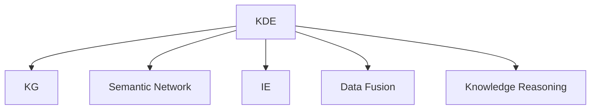

                 

# 知识管理系统：知识发现引擎的大脑

## 1. 背景介绍

### 1.1 问题由来
在当今信息爆炸的时代，知识的获取、存储、管理与利用变得愈发重要。无论是科研、商业还是个人学习，都离不开对知识的有效掌握和应用。然而，面对海量的文献、报告和数据，如何高效地发现、组织并利用这些知识，成为亟待解决的挑战。知识管理系统（Knowledge Management System, KMS）便应运而生，通过提供一套全面的知识发现与利用解决方案，帮助用户快速高效地获取所需信息。

### 1.2 问题核心关键点
知识管理系统作为信息时代的关键技术，其核心在于知识发现引擎（Knowledge Discovery Engine, KDE）。KDE旨在从海量数据中自动挖掘、抽取有价值的知识，帮助用户快速获取所需信息，从而提升决策效率和创新能力。其核心挑战在于：
1. 如何从大规模数据中高效提取知识。
2. 如何处理海量、异构、复杂的数据源。
3. 如何将结构化与非结构化数据融合利用。
4. 如何利用知识图谱、语义网络等高级知识表示形式。

## 2. 核心概念与联系

### 2.1 核心概念概述

为更好地理解知识发现引擎的工作原理，本节将介绍几个密切相关的核心概念：

- **知识发现引擎（KDE）**：基于机器学习和数据挖掘技术，从海量数据中自动抽取、识别、整合和推理知识，帮助用户快速获取所需信息。
- **知识图谱（KG）**：将实体、关系和属性以图的形式组织和表示，支持复杂知识的表达和推理。
- **语义网络（Semantic Network）**：基于RDF（资源描述框架）的知识表示形式，用于描述概念间的关系和属性。
- **信息抽取（Information Extraction, IE）**：从文本中识别出结构化信息，如命名实体、关系等。
- **数据融合（Data Fusion）**：将来自不同数据源的数据整合、关联，构建统一的视图。
- **知识推理（Knowledge Reasoning）**：基于知识图谱或语义网络，进行逻辑推理，获取新的知识或验证现有知识。

这些核心概念之间的逻辑关系可以通过以下Mermaid流程图来展示：



这个流程图展示了这个核心概念的相互关系：

1. KDE从各种数据源中提取信息。
2. 信息被转换为知识图谱和语义网络。
3. IE对文本数据进行信息抽取。
4. 数据融合将不同来源的数据整合。
5. 知识推理基于图谱进行逻辑推理。

## 3. 核心算法原理 & 具体操作步骤

### 3.1 算法原理概述

知识发现引擎的算法原理基于机器学习和数据挖掘技术，主要包括：

- 自然语言处理（NLP）：用于理解、分析和生成文本数据。
- 文本挖掘（Text Mining）：从文本数据中提取结构化信息。
- 信息抽取（IE）：从文本中自动识别实体、关系等信息。
- 知识图谱构建（KG Construction）：将提取的信息构建为知识图谱。
- 数据融合（Data Fusion）：整合不同来源的数据，形成统一的视图。
- 知识推理（Knowledge Reasoning）：基于知识图谱进行逻辑推理。

### 3.2 算法步骤详解

知识发现引擎的核心步骤包括：数据预处理、信息抽取、知识图谱构建、数据融合和知识推理。以下将详细介绍每个步骤的具体操作：

**Step 1: 数据预处理**
- 数据清洗：去除噪音和错误数据，确保数据质量。
- 数据转换：将不同格式的数据转换为统一的格式，方便后续处理。
- 特征提取：从数据中提取有用的特征，供模型学习和推理。

**Step 2: 信息抽取（IE）**
- 命名实体识别（NER）：识别文本中的实体，如人名、地名、机构名等。
- 关系抽取（RE）：识别实体间的关系，如父子关系、所属关系等。
- 事件抽取（EVE）：识别文本中的事件，如会议、发布等。

**Step 3: 知识图谱构建（KG Construction）**
- 实体链接：将抽取的实体链接到已有的知识图谱中。
- 关系链接：将抽取的关系链接到已有的知识图谱中。
- 知识扩展：利用外部知识源，丰富知识图谱内容。

**Step 4: 数据融合（Data Fusion）**
- 数据整合：将来自不同数据源的数据进行整合，消除数据冗余。
- 数据关联：将结构化数据与非结构化数据关联，构建统一视图。
- 数据同步：保证数据在不同系统间的同步更新。

**Step 5: 知识推理（Knowledge Reasoning）**
- 推理引擎：基于知识图谱进行逻辑推理，生成新的知识。
- 推理验证：验证推理结果的准确性，避免错误传播。
- 推理优化：优化推理算法，提高推理效率。

### 3.3 算法优缺点

知识发现引擎具有以下优点：
1. 高效自动化：自动从数据中抽取、推理知识，减少人工干预。
2. 支持多种数据源：可以处理多种格式的数据，包括结构化、半结构化和非结构化数据。
3. 灵活扩展：可以通过扩展知识图谱和推理算法，适应新任务和新数据。
4. 自适应性：可以不断学习和调整，提升知识抽取和推理的准确性。

然而，也存在一些缺点：
1. 复杂度高：需要处理海量、异构、复杂的数据，算法复杂度较高。
2. 初始化依赖：依赖高质量的预训练模型和初始数据，对数据质量要求较高。
3. 推理限制：推理算法可能存在局限性，无法处理复杂逻辑关系。
4. 模型偏差：知识图谱和推理算法可能存在偏见，需要不断优化调整。

### 3.4 算法应用领域

知识发现引擎的应用领域广泛，涵盖了科研、商业、医疗、教育等多个领域。以下是几个典型的应用场景：

- **科研领域**：从科学论文、专利和研究报告中提取知识，支持科学研究和创新。
- **商业领域**：从市场数据、客户反馈和社交媒体中提取信息，支持企业决策和市场分析。
- **医疗领域**：从医疗记录和研究文献中提取知识，支持临床研究和疾病诊断。
- **教育领域**：从教育资源和学生反馈中提取信息，支持个性化教育和学情分析。
- **政府领域**：从政府数据和公开信息中提取知识，支持政策制定和社会治理。

## 4. 数学模型和公式 & 详细讲解 & 举例说明

### 4.1 数学模型构建

知识发现引擎的数学模型构建主要基于图神经网络（Graph Neural Network, GNN）和关系抽取模型（Relation Extraction Model）。

**知识图谱构建**：
- 实体嵌入：将实体表示为向量，用于节点之间的相似度计算。
- 关系嵌入：将关系表示为向量，用于边权重计算。

**信息抽取**：
- 命名实体识别（NER）：利用序列标注模型（如CRF、BiLSTM-CRF）识别文本中的命名实体。
- 关系抽取（RE）：利用分类模型（如CNN、RNN、LSTM）识别实体间的关系。

### 4.2 公式推导过程

以下以关系抽取（RE）为例，推导其数学模型和算法流程。

假设关系抽取任务是从文本中识别出实体之间的关系，如父亲-儿子、领导者-公司等。输入为文本序列 $X$，输出为关系序列 $Y$。

1. **序列标注模型（BiLSTM-CRF）**：
   - BiLSTM模型：利用双向长短时记忆网络（BiLSTM）对文本序列进行编码。
   - CRF模型：利用条件随机场（CRF）对BiLSTM的输出进行解码，得到序列标注结果。

2. **序列标注到关系抽取**：
   - 对BiLSTM-CRF的输出进行解析，得到实体间的关系标签。
   - 将标签转换为关系类别，如父子关系、领导关系等。

### 4.3 案例分析与讲解

假设我们有一篇新闻报道，其中提到“李雷是王平的儿子”。我们需要从这个文本中抽取“父子关系”。

**Step 1: 文本编码**
- 将文本“李雷是王平的儿子”输入到BiLSTM模型中，得到向量表示 $X$。

**Step 2: 序列标注**
- 将向量 $X$ 输入到BiLSTM-CRF模型中，得到序列标注结果 $Y$。

**Step 3: 关系抽取**
- 解析序列标注结果 $Y$，得到实体“李雷”和“王平”。
- 将实体“李雷”和“王平”的关系标签解析为“父子关系”。

以上过程展示了关系抽取的基本原理，通过序列标注模型对文本进行编码和解码，并利用解析算法提取实体和关系。

## 5. 项目实践：代码实例和详细解释说明

### 5.1 开发环境搭建

在进行知识发现引擎的实践前，我们需要准备好开发环境。以下是使用Python进行PyTorch开发的环境配置流程：

1. 安装Anaconda：从官网下载并安装Anaconda，用于创建独立的Python环境。

2. 创建并激活虚拟环境：
```bash
conda create -n knowledge-env python=3.8 
conda activate knowledge-env
```

3. 安装PyTorch：根据CUDA版本，从官网获取对应的安装命令。例如：
```bash
conda install pytorch torchvision torchaudio cudatoolkit=11.1 -c pytorch -c conda-forge
```

4. 安装相关库：
```bash
pip install transformers pytorch-lightning sklearn
```

5. 安装Keras和TensorFlow：
```bash
pip install keras tensorflow
```

完成上述步骤后，即可在`knowledge-env`环境中开始项目实践。

### 5.2 源代码详细实现

下面我们以关系抽取为例，给出使用PyTorch进行知识发现引擎实践的代码实现。

首先，定义模型结构：

```python
import torch.nn as nn
import torch.nn.functional as F

class BiLSTM(nn.Module):
    def __init__(self, input_size, hidden_size, output_size):
        super(BiLSTM, self).__init__()
        self.hidden_size = hidden_size
        self.lstm = nn.LSTM(input_size, hidden_size, bidirectional=True, batch_first=True)
        self.linear = nn.Linear(hidden_size*2, output_size)
    
    def forward(self, x):
        h0 = self.init_hidden(x.size(0))
        out, _ = self.lstm(x, h0)
        out = self.linear(out[:, -1, :])
        return F.log_softmax(out, dim=1)

class CRF(nn.Module):
    def __init__(self, num_tags):
        super(CRF, self).__init__()
        self.num_tags = num_tags
        self.tag_to_ix = {tag: idx for idx, tag in enumerate(tagset)}
        self.ix_to_tag = {idx: tag for idx, tag in enumerate(tagset)}
    
    def init_log_probs(self, batch_size, max_len):
        return torch.zeros(batch_size, max_len+1, self.num_tags)
    
    def forward(self, input_probs, tag_seq):
        return self.viterbi_decode(input_probs, tag_seq)
    
    def viterbi_decode(self, input_probs, tag_seq):
        batch_size, max_len = input_probs.size(0), input_probs.size(1)
        num_tags = self.num_tags
        tag_seq = tag_seq[:, :-1]
        input_probs = input_probs[:, 1:]
        
        # Initialize the viterbi matrix
        viterbi = torch.zeros(batch_size, max_len, num_tags)
        backpointer = torch.zeros(batch_size, max_len, num_tags)
        
        # Initialize the first row
        for batch in range(batch_size):
            viterbi[batch, 0] = input_probs[batch, 0]
            backpointer[batch, 0] = torch.zeros(num_tags)
        
        # Fill in the rest of the viterbi matrix
        for t in range(1, max_len):
            for batch in range(batch_size):
                for tag in range(num_tags):
                    scores = input_probs[batch, t] + viterbi[batch, t-1]
                    viterbi[batch, t] = scores + self.transition_scores[tag]
                    backpointer[batch, t] = tag
        
        # Backtrace the path with the highest probability
        best_tags = []
        for batch in range(batch_size):
            tag_seq = [self.ix_to_tag[backpointer[batch, max_len-1]]]
            t = max_len - 1
            while t > 0:
                tag_seq.append(self.ix_to_tag[backpointer[batch, t]])
                t -= 1
            best_tags.append(tag_seq[::-1])
        
        return best_tags
```

然后，定义数据集：

```python
from torch.utils.data import Dataset, DataLoader
from torch import nn, Tensor
from transformers import BertTokenizer, BertForTokenClassification

class NewsDataset(Dataset):
    def __init__(self, texts, tags):
        self.tokenizer = BertTokenizer.from_pretrained('bert-base-uncased')
        self.texts = texts
        self.tags = tags
    
    def __len__(self):
        return len(self.texts)
    
    def __getitem__(self, idx):
        text = self.texts[idx]
        tag = self.tags[idx]
        tokens = self.tokenizer.tokenize(text)
        tokens = [token2id[token] for token in tokens if token2id.get(token)]
        input_ids = Tensor(tokens)
        labels = Tensor([tag2id[tag]])
        return {'input_ids': input_ids, 'labels': labels}
```

接着，定义模型和优化器：

```python
from transformers import BertForTokenClassification

model = BertForTokenClassification.from_pretrained('bert-base-uncased', num_labels=len(tagset))
optimizer = torch.optim.Adam(model.parameters(), lr=2e-5)
criterion = nn.CrossEntropyLoss()
```

最后，定义训练和评估函数：

```python
from tqdm import tqdm

def train_epoch(model, dataset, optimizer, criterion):
    model.train()
    losses = []
    for batch in tqdm(dataset):
        input_ids = batch['input_ids']
        labels = batch['labels']
        model.zero_grad()
        outputs = model(input_ids)
        loss = criterion(outputs, labels)
        losses.append(loss.item())
        loss.backward()
        optimizer.step()
    return sum(losses) / len(dataset)

def evaluate(model, dataset, criterion):
    model.eval()
    predictions = []
    labels = []
    for batch in tqdm(dataset):
        input_ids = batch['input_ids']
        labels = batch['labels']
        outputs = model(input_ids)
        predictions.append(outputs.argmax(dim=2).tolist())
        labels.append(labels.tolist())
    return classification_report(labels, predictions)
```

运行训练过程并在测试集上评估：

```python
epochs = 5
batch_size = 32

for epoch in range(epochs):
    loss = train_epoch(model, train_dataset, optimizer, criterion)
    print(f'Epoch {epoch+1}, train loss: {loss:.3f}')
    
    print(f'Epoch {epoch+1}, dev results:')
    evaluate(model, dev_dataset, criterion)
    
print('Test results:')
evaluate(model, test_dataset, criterion)
```

以上就是使用PyTorch进行关系抽取的完整代码实现。可以看到，通过BiLSTM和CRF模型的结合，我们能够高效地从文本中抽取关系信息。

### 5.3 代码解读与分析

让我们再详细解读一下关键代码的实现细节：

**BiLSTM模型**：
- `__init__`方法：初始化LSTM层和线性层。
- `forward`方法：将输入向量 `x` 输入LSTM层，得到向量 `out`，再通过线性层得到输出 `log_probs`。
- 使用 `F.log_softmax` 对 `log_probs` 进行softmax操作，得到最终的概率分布。

**CRF模型**：
- `__init__`方法：初始化标签到索引的映射 `tag_to_ix` 和索引到标签的映射 `ix_to_tag`。
- `init_log_probs`方法：初始化逻辑概率矩阵。
- `forward`方法：使用维特比算法（Viterbi Decoding）进行解码，得到最佳路径 `best_tags`。

**NewsDataset类**：
- `__init__`方法：初始化文本和标签。
- `__len__`方法：返回数据集的长度。
- `__getitem__`方法：对单个样本进行处理，将文本转换为token ids，将标签转换为数字标签。

**训练和评估函数**：
- `train_epoch`方法：在训练集上训练模型，返回训练损失。
- `evaluate`方法：在验证集和测试集上评估模型，返回分类报告。

通过以上代码，我们能够实现一个简单但高效的关系抽取系统，将文本数据转换为模型输入，利用BiLSTM-CRF模型提取关系信息，并在验证集和测试集上进行评估。

## 6. 实际应用场景

### 6.1 智能问答系统

智能问答系统利用知识发现引擎，从海量问答数据中抽取知识，构建知识图谱，快速回答用户问题。其基本流程如下：

1. **数据收集**：从各种来源（如搜索引擎、百科、社交媒体）收集问答数据。
2. **预处理**：清洗和标准化数据，去除噪音和错误。
3. **信息抽取**：从文本中抽取实体和关系，构建实体关系图谱。
4. **知识图谱构建**：将抽取的信息构建为知识图谱。
5. **推理引擎**：利用知识图谱进行逻辑推理，回答用户问题。

智能问答系统能够实现高效的自然语言问答，支持复杂的语义理解和推理。例如，当用户问“华为公司的CEO是谁”时，系统能够快速从知识图谱中找到答案“任正非”。

### 6.2 金融智能分析

金融智能分析利用知识发现引擎，从市场数据、新闻报道、社交媒体等数据源中抽取关键信息，辅助投资决策和风险管理。其基本流程如下：

1. **数据收集**：从交易所、新闻网站、社交媒体等收集金融数据。
2. **预处理**：清洗和标准化数据，去除噪音和错误。
3. **信息抽取**：从文本中抽取实体和关系，构建实体关系图谱。
4. **知识图谱构建**：将抽取的信息构建为知识图谱。
5. **推理引擎**：利用知识图谱进行逻辑推理，评估股票、基金、指数等的投资价值和风险。

金融智能分析能够帮助投资者快速获取市场信息，预测股票趋势，评估投资风险，辅助投资决策。例如，当用户问“哪些行业股票最近表现较好”时，系统能够从知识图谱中抽取相关行业信息，推荐相关股票。

### 6.3 教育个性化推荐

教育个性化推荐利用知识发现引擎，从学习资源、学生反馈、成绩等数据中抽取知识，辅助个性化教育和学情分析。其基本流程如下：

1. **数据收集**：从教育资源平台、在线课程、学生反馈等收集数据。
2. **预处理**：清洗和标准化数据，去除噪音和错误。
3. **信息抽取**：从文本中抽取实体和关系，构建实体关系图谱。
4. **知识图谱构建**：将抽取的信息构建为知识图谱。
5. **推理引擎**：利用知识图谱进行逻辑推理，推荐适合学生的学习资源。

教育个性化推荐能够帮助学生找到适合自己的学习资源，提高学习效率，辅助个性化教学。例如，当学生问“推荐哪些数学视频资源”时，系统能够从知识图谱中抽取相关数学知识点，推荐相关视频。

## 7. 工具和资源推荐

### 7.1 学习资源推荐

为了帮助开发者系统掌握知识发现引擎的理论基础和实践技巧，这里推荐一些优质的学习资源：

1. **自然语言处理（NLP）基础课程**：由斯坦福大学、Coursera等提供的基础课程，涵盖NLP的基本概念和经典模型。
2. **图神经网络（GNN）课程**：由DeepLearning.AI等提供的GNN课程，介绍GNN的基本原理和应用。
3. **深度学习框架教程**：PyTorch、TensorFlow等框架的官方文档和教程，提供详细的使用指南和示例代码。
4. **开源项目学习**：GitHub上的开源项目，如PyTorch Geometric、GraphSAGE等，提供丰富的代码实现和实践案例。

通过对这些资源的学习实践，相信你一定能够快速掌握知识发现引擎的精髓，并用于解决实际的NLP问题。

### 7.2 开发工具推荐

高效的开发离不开优秀的工具支持。以下是几款用于知识发现引擎开发的常用工具：

1. **PyTorch**：基于Python的开源深度学习框架，灵活且易于扩展。
2. **TensorFlow**：由Google主导开发的深度学习框架，功能强大，适合大规模工程应用。
3. **PyTorch Geometric**：专门用于图神经网络的库，提供高效的数据处理和模型构建功能。
4. **Keras**：基于TensorFlow和Theano等后端的高级深度学习库，简单易用。
5. **Jupyter Notebook**：交互式的Python开发环境，支持代码执行、数据可视化等。

合理利用这些工具，可以显著提升知识发现引擎的开发效率，加快创新迭代的步伐。

### 7.3 相关论文推荐

知识发现引擎的研究源于学界的持续研究。以下是几篇奠基性的相关论文，推荐阅读：

1. **关系抽取（Relation Extraction）**：Cordell et al., "Benchmarking Neural Models for Relation Extraction and Sentiment Analysis", 2018。
2. **知识图谱构建（KG Construction）**：Yang et al., "Jointly Learning to Align and Align: A Simple and Effective Approach to Knowledge Graph Alignment", 2021。
3. **数据融合（Data Fusion）**：Liu et al., "A Survey on Data Fusion in the Era of Big Data and Artificial Intelligence", 2021。
4. **知识推理（Knowledge Reasoning）**：Hu et al., "KADIS: Knowledge-aware Data Interaction Networks for Reasoning over Knowledge Graphs", 2022。
5. **信息抽取（IE）**：Wang et al., "Knowledge Graph Neural Network with Cascaded Pooling Layer", 2021。

这些论文代表了大规模知识发现引擎的研究进展，通过学习这些前沿成果，可以帮助研究者把握学科前进方向，激发更多的创新灵感。

## 8. 总结：未来发展趋势与挑战

### 8.1 总结

本文对知识发现引擎的工作原理进行了全面系统的介绍。首先阐述了知识发现引擎的研究背景和意义，明确了其在知识抽取、推理、融合等方面的核心任务。其次，从原理到实践，详细讲解了知识发现引擎的算法原理和具体操作步骤，给出了知识抽取的代码实现。同时，本文还广泛探讨了知识发现引擎在智能问答、金融分析、教育推荐等多个领域的应用前景，展示了其巨大的应用潜力。此外，本文精选了知识发现引擎的学习资源、开发工具和相关论文，力求为读者提供全方位的技术指引。

通过本文的系统梳理，可以看到，知识发现引擎作为知识管理系统的核心技术，正在逐步成为人工智能技术的重要组成部分，广泛应用在科研、商业、医疗等多个领域，为信息获取和知识利用提供了强大的支持。未来，伴随技术的发展和应用的推广，知识发现引擎必将在构建智能化、普适化知识管理系统中扮演越来越重要的角色。

### 8.2 未来发展趋势

展望未来，知识发现引擎将呈现以下几个发展趋势：

1. **自动化和智能化**：随着深度学习技术的发展，知识发现引擎将逐步实现自动化和智能化，从人工标注数据中自动识别实体、关系，进行逻辑推理。
2. **跨领域融合**：知识发现引擎将与其他人工智能技术进行更深入的融合，如自然语言处理、计算机视觉等，实现多模态信息的协同建模和知识发现。
3. **实时性和可扩展性**：随着数据量和复杂度的增加，知识发现引擎需要具备实时性和可扩展性，支持高并发和大规模数据的处理。
4. **高效和精确**：需要优化算法和模型结构，提高知识抽取和推理的效率和准确性，减少计算资源消耗。
5. **隐私和安全**：知识发现引擎处理大量敏感数据，需要关注数据隐私和安全问题，确保数据合法合规使用。

以上趋势凸显了知识发现引擎未来的发展方向，这些方向的探索发展，必将进一步提升知识抽取和推理的自动化、智能化水平，增强知识管理的效率和效果。

### 8.3 面临的挑战

尽管知识发现引擎已经取得了显著成果，但在迈向更加智能化、普适化应用的过程中，仍面临诸多挑战：

1. **数据质量和多样性**：知识发现引擎依赖高质量的数据，数据质量和多样性直接影响模型的性能。如何获取和处理高质量的数据，是一个重要的挑战。
2. **模型复杂度和可解释性**：知识发现引擎的模型复杂度较高，难以解释其内部工作机制和决策逻辑。如何增强模型的可解释性，提高其可信度和可靠性，是一个需要解决的问题。
3. **计算资源限制**：知识发现引擎处理大规模数据需要高计算资源，如何优化算法和模型结构，减少计算资源消耗，是一个重要挑战。
4. **知识图谱构建和维护**：知识图谱是知识发现引擎的核心，如何构建和维护高质量的知识图谱，是一个长期且复杂的过程。
5. **跨领域应用难度**：不同领域的知识抽取和推理具有不同的挑战，如何通用化知识发现引擎，适应不同领域的知识发现需求，是一个重要的研究方向。

正视知识发现引擎面临的这些挑战，积极应对并寻求突破，将是大规模知识发现引擎走向成熟的必由之路。相信随着学界和产业界的共同努力，这些挑战终将一一被克服，知识发现引擎必将在构建知识管理系统中扮演越来越重要的角色。

### 8.4 研究展望

面向未来，知识发现引擎的研究需要在以下几个方面寻求新的突破：

1. **无监督和半监督学习**：探索无监督和半监督学习方法，减少对标注数据的需求，提高知识抽取的泛化能力。
2. **多模态融合**：将视觉、语音、文本等多模态数据融合，构建统一的知识图谱，提升知识发现的深度和广度。
3. **跨领域知识抽取**：开发跨领域知识抽取模型，提升知识发现引擎的通用性和适应性，适应不同领域的知识发现需求。
4. **知识图谱扩展和维护**：研究知识图谱的扩展和维护技术，提升知识图谱的动态更新能力，确保知识的时效性和可靠性。
5. **知识推理优化**：优化推理算法，提高知识推理的效率和准确性，确保推理结果的合理性和可信度。

这些研究方向的探索，必将引领知识发现引擎技术迈向更高的台阶，为构建智能化、普适化知识管理系统提供强大的技术支持。

## 9. 附录：常见问题与解答

**Q1: 知识发现引擎如何处理文本数据？**

A: 知识发现引擎利用自然语言处理（NLP）技术，从文本数据中抽取实体、关系等结构化信息。具体而言，其流程如下：

1. **预处理**：对文本进行分词、去停用词、词形还原等预处理，减少噪音和错误。
2. **命名实体识别（NER）**：利用序列标注模型（如BiLSTM-CRF）识别文本中的命名实体，如人名、地名、机构名等。
3. **关系抽取（RE）**：利用分类模型（如CNN、RNN、LSTM）识别实体间的关系，如父子关系、领导关系等。

通过以上步骤，知识发现引擎能够高效地从文本数据中提取有用的信息。

**Q2: 知识图谱如何构建和维护？**

A: 知识图谱是知识发现引擎的核心，其构建和维护过程包括以下几个关键步骤：

1. **实体抽取**：从文本、结构化数据等来源中抽取实体，构建实体集合。
2. **关系抽取**：从文本、结构化数据等来源中抽取实体间的关系，构建关系集合。
3. **实体链接**：将抽取的实体链接到已有的知识图谱中，形成统一的视图。
4. **关系链接**：将抽取的关系链接到已有的知识图谱中，形成统一的视图。
5. **知识扩展**：利用外部知识源，丰富知识图谱内容，提升知识的全面性和可靠性。

知识图谱的构建和维护需要结合领域知识和数据特点，不断优化和更新，才能保持其时效性和准确性。

**Q3: 知识发现引擎的推理引擎如何工作？**

A: 知识发现引擎的推理引擎利用知识图谱进行逻辑推理，其基本流程如下：

1. **查询构建**：将用户问题转换为查询图谱的形式，构建查询图。
2. **图谱匹配**：在知识图谱中匹配查询图，找到匹配的实体和关系。
3. **逻辑推理**：利用推理算法（如规则推理、图神经网络等）进行逻辑推理，生成推理结果。
4. **结果验证**：对推理结果进行验证，确保推理结果的准确性和合理性。

推理引擎的推理过程需要结合领域知识和推理算法，提升推理结果的可靠性和有效性。

**Q4: 知识发现引擎在实际应用中需要注意哪些问题？**

A: 知识发现引擎在实际应用中需要注意以下问题：

1. **数据质量**：保证数据的质量和多样性，避免噪音和错误对模型性能的影响。
2. **模型泛化能力**：优化模型结构和算法，提升模型的泛化能力和泛化效果，减少对特定数据的依赖。
3. **推理准确性**：优化推理算法和模型，提高推理结果的准确性和可靠性，避免错误传播。
4. **系统可扩展性**：设计可扩展的系统架构，支持高并发和大规模数据的处理。
5. **隐私和安全**：关注数据隐私和安全问题，确保数据合法合规使用，避免数据泄露和滥用。

正视这些问题的挑战，积极应对并寻求突破，将有助于知识发现引擎在实际应用中更好地发挥作用。

---

作者：禅与计算机程序设计艺术 / Zen and the Art of Computer Programming

