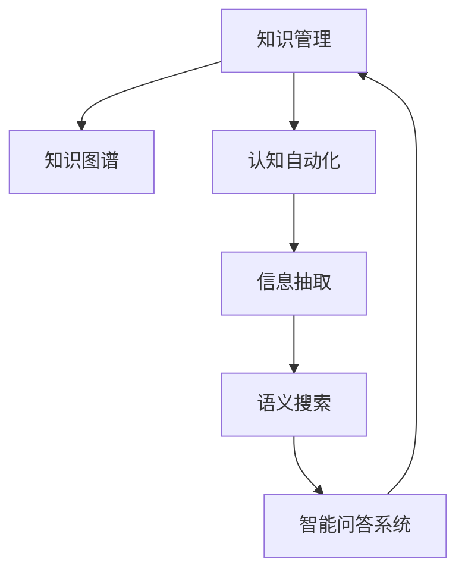

                 

# 知识管理：个人和组织的智力资本

## 1. 背景介绍

### 1.1 问题由来
在数字化、网络化和信息爆炸的时代，知识管理已经成为个人和组织获取、存储、共享和应用知识的关键能力。随着技术的发展，从传统的文档管理到智能知识图谱，再到认知自动化，知识管理的技术手段不断升级，使得知识和智慧的转化与流通变得越来越高效。然而，知识的碎片化、分布式存储和获取难度等问题仍然困扰着知识管理的实践。

### 1.2 问题核心关键点
知识管理的核心在于如何高效地获取、组织、传递和使用知识，提升决策能力和业务价值。主要体现在以下几个方面：

1. **知识获取**：通过搜索引擎、机器学习和自然语言处理等技术，快速从海量数据中获取有价值的信息。
2. **知识组织**：利用数据库、数据仓库、知识图谱等技术手段，将知识结构化存储，便于检索和应用。
3. **知识共享**：通过知识管理平台、协作工具和社交网络，促进知识在组织内外的共享与交流。
4. **知识应用**：将知识转化为具体的决策和行动，提升组织和个人的绩效和竞争力。

## 2. 核心概念与联系

### 2.1 核心概念概述

为更好地理解知识管理及其关键技术，本节将介绍几个密切相关的核心概念：

- **知识管理(Knowledge Management, KM)**：旨在整合组织内外部的知识和信息，使知识转化为组织的核心资产。通过知识获取、存储、共享和应用，提升组织的竞争力和决策能力。

- **知识图谱(Knowledge Graph)**：一种结构化的知识表示方式，用于描述实体、属性和关系之间的复杂网络。知识图谱能够帮助机器更好地理解语义，支持智能问答、推荐系统和搜索引擎等应用。

- **认知自动化(Cognitive Automation)**：利用人工智能技术，自动化地处理复杂任务，减少人工干预，提升工作效率。认知自动化包括自然语言处理、机器学习、推理等技术。

- **信息抽取(Information Extraction, IE)**：从非结构化数据中自动抽取有价值的信息，转化为结构化数据，便于后续分析与利用。信息抽取通常使用命名实体识别、关系抽取等自然语言处理技术。

- **语义搜索(Semantic Search)**：通过理解和匹配用户查询的语义，提供精准的搜索结果，提升搜索效率和用户满意度。语义搜索依赖于自然语言处理和知识图谱等技术。

- **智能问答系统(Intelligent Question Answering, IQA)**：通过理解和回答自然语言问题，提供即时的知识服务。智能问答系统利用问答对作为训练数据，通过机器学习模型构建。

这些核心概念之间的逻辑关系可以通过以下Mermaid流程图来展示：



这个流程图展示了几大核心概念之间的关系：

1. 知识管理是整合和应用各类知识的关键框架。
2. 知识图谱是知识表示和组织的重要工具。
3. 认知自动化和信息抽取为知识获取和组织提供了技术支撑。
4. 语义搜索和智能问答系统基于知识图谱和认知自动化，提升了知识获取和应用效率。

## 3. 核心算法原理 & 具体操作步骤
### 3.1 算法原理概述

知识管理的核心在于利用技术和工具，高效地整合、存储、检索和应用知识。其基本原理可以概括为以下几步：

1. **数据抽取**：从各种数据源中自动抽取实体、属性和关系，构建知识图谱。
2. **语义建模**：对知识图谱进行语义建模，使其能够被机器理解和处理。
3. **知识查询**：利用语义搜索技术，在知识图谱中查询特定知识，获取相关信息。
4. **智能应用**：通过认知自动化和机器学习，将知识应用于具体任务，提升决策和业务价值。

### 3.2 算法步骤详解

基于上述原理，知识管理的算法步骤通常包括：

**Step 1: 数据收集与预处理**
- 收集各类数据源，包括文档、数据库、Web页面等。
- 对数据进行清洗和预处理，如去除噪声、规范化格式、抽取结构化信息等。

**Step 2: 实体和关系抽取**
- 使用自然语言处理(NLP)技术，对文本数据进行命名实体识别和关系抽取。
- 构建实体和关系之间的关联图谱，表示为知识图谱。

**Step 3: 语义建模与表示**
- 对知识图谱进行语义建模，使用RDF、OWL等语义网标准描述实体和关系。
- 应用知识图谱工具，如Neo4j、GraphDB等，将知识图谱存储在数据库中。

**Step 4: 知识查询与检索**
- 利用语义搜索技术，对知识图谱进行查询和检索，提取相关信息。
- 应用搜索引擎优化(SEO)技术，提升搜索效率和效果。

**Step 5: 智能应用与决策**
- 使用认知自动化技术，如推理、规划和优化，将知识应用于具体任务。
- 结合机器学习算法，进行数据挖掘、预测分析和决策支持。

**Step 6: 应用反馈与优化**
- 收集应用效果反馈，评估知识管理系统的表现。
- 根据反馈结果，优化数据抽取、语义建模和智能应用等模块，提升系统性能。

### 3.3 算法优缺点

知识管理技术的优点包括：

1. **高效获取**：自动化的信息抽取和语义建模，可以快速从各类数据源中获取有价值的信息。
2. **精准查询**：基于语义搜索的知识查询，能够理解用户查询的语义，提供精准的搜索结果。
3. **知识重用**：知识图谱和认知自动化技术，使得知识能够在不同场景和任务间高效重用。
4. **智能决策**：结合机器学习和推理技术，提升决策的智能化和自动化水平。

然而，知识管理技术也存在一些缺点：

1. **数据质量依赖**：知识管理的效果很大程度上取决于数据源的质量和准确性。低质量的数据会导致知识抽取和建模的偏差。
2. **计算资源需求高**：构建和维护知识图谱、进行语义建模和智能推理，需要大量计算资源。
3. **技术复杂度**：知识管理的实施涉及多种技术，如自然语言处理、机器学习、数据库等，技术复杂度较高。
4. **用户接受度**：知识管理系统的复杂性可能使用户难以接受和适应，影响其普及和应用。

尽管存在这些缺点，知识管理仍然是大数据时代提升组织竞争力的关键技术手段。未来相关研究的方向在于如何进一步降低技术复杂度，提高系统易用性和效率，同时提升数据质量和模型的精确度。

### 3.4 算法应用领域

知识管理技术在多个领域得到了广泛应用，以下是几个典型的应用场景：

- **企业决策支持**：通过知识图谱和语义搜索，辅助企业决策，提升决策效率和质量。例如，通过知识图谱了解市场趋势、竞争对手信息等。
- **智能客服系统**：利用知识管理技术，构建智能问答系统，提升客户服务体验。例如，通过语义搜索和知识图谱，快速回答客户问题。
- **医疗知识管理**：构建医疗知识图谱，辅助医生诊断和治疗决策。例如，通过语义搜索和推理，提供疾病相关的最新研究成果和治疗方案。
- **法律知识管理**：构建法律知识图谱，辅助律师进行案例检索和法律咨询。例如，通过知识图谱和推理，快速检索相关的法律条文和判例。
- **教育知识管理**：构建教育知识图谱，辅助教师教学和学生学习。例如，通过语义搜索和知识图谱，快速获取教学资源和习题解答。

这些应用场景展示了知识管理技术的强大潜力，未来随着技术的发展和普及，知识管理将进一步融入各行各业，成为推动智能化发展的重要力量。

## 4. 数学模型和公式 & 详细讲解  
### 4.1 数学模型构建

知识管理涉及多个领域的技术，数学模型构建是其核心之一。本节将使用数学语言对知识管理的主要技术进行更加严格的刻画。

记知识图谱为 $\mathcal{G}=(\mathcal{E},\mathcal{R},\mathcal{T})$，其中 $\mathcal{E}$ 表示实体集，$\mathcal{R}$ 表示关系集，$\mathcal{T}$ 表示属性集。知识图谱中的实体 $e$ 和关系 $r$ 构成边 $(e,r)$，实体和属性构成节点 $(e,t)$。

定义知识图谱中实体 $e$ 和关系 $r$ 之间的语义相似度为 $\sim_r(e_1,e_2)$，关系 $r$ 和属性 $t$ 之间的语义相似度为 $\sim_t(r_1,r_2)$。语义相似度可以通过余弦相似度、Jaccard相似度等方法计算。

知识图谱的查询表示为 $Q$，查询结果为 $A$。查询 $Q$ 的语义相似度表示为 $\sim_Q(A_1,A_2)$。查询结果的评价指标为 $M(A)$，包括准确率、召回率、F1值等。

### 4.2 公式推导过程

以下我们以知识图谱的查询为例，推导语义相似度的计算公式。

假设查询 $Q$ 包含实体 $e$ 和关系 $r$，表示为 $Q=(e,r)$。知识图谱中实体 $e_1$ 和关系 $r_1$ 的语义表示为 $\mathbf{e}_1$ 和 $\mathbf{r}_1$，实体 $e_2$ 和关系 $r_2$ 的语义表示为 $\mathbf{e}_2$ 和 $\mathbf{r}_2$。查询结果 $A_1$ 的语义表示为 $\mathbf{a}_1$，查询结果 $A_2$ 的语义表示为 $\mathbf{a}_2$。

查询 $Q$ 的语义相似度计算公式为：

$$
\sim_Q(A_1,A_2) = \frac{\mathbf{e}_1^\top \mathbf{e}_2 + \mathbf{r}_1^\top \mathbf{r}_2 + \sum_{t \in T} \mathbf{e}_1^\top \mathbf{t} + \mathbf{r}_1^\top \mathbf{t}}{\|\mathbf{e}_1\|_2 \cdot \|\mathbf{e}_2\|_2 + \|\mathbf{r}_1\|_2 \cdot \|\mathbf{r}_2\|_2 + \sum_{t \in T} \|\mathbf{e}_1\|_2 \cdot \|\mathbf{t}\|_2 + \|\mathbf{r}_1\|_2 \cdot \|\mathbf{t}\|_2}
$$

其中 $\cdot$ 表示点乘运算，$\top$ 表示转置运算，$\|\cdot\|_2$ 表示向量范数。

### 4.3 案例分析与讲解

以医疗知识图谱为例，其构建过程通常包括以下步骤：

**Step 1: 数据收集**：收集各类医疗数据，包括病历、临床试验、医学文献等。

**Step 2: 数据预处理**：清洗数据，去除噪声和无关信息，提取结构化数据。

**Step 3: 知识抽取**：使用自然语言处理技术，抽取实体、属性和关系。例如，从病历中抽取病人、诊断、症状等实体，以及相关的时间、地点等信息。

**Step 4: 实体和关系建模**：将抽取的知识映射到知识图谱中，构建实体和关系之间的关联。例如，将病人与诊断结果关联，将症状与诊断关联等。

**Step 5: 语义建模**：对知识图谱进行语义建模，使用OWL等语义网标准描述实体和关系。例如，定义病人与症状之间的关系为“被诊断为”，诊断结果与治疗方案之间的关系为“推荐”。

**Step 6: 知识图谱存储**：将构建好的知识图谱存储在数据库中，例如使用Neo4j、ArangoDB等图数据库。

**Step 7: 查询和应用**：利用语义搜索技术，从知识图谱中查询相关信息。例如，查询某个病人可能的诊断和治疗方案，或查找与某种症状相关的治疗药物。

通过以上案例分析，可以看到知识管理技术在医疗领域的具体应用流程。这些技术手段不仅能够提升医疗决策的精准性，还能够促进医学知识的高效共享和传承。

## 5. 项目实践：代码实例和详细解释说明
### 5.1 开发环境搭建

在进行知识管理实践前，我们需要准备好开发环境。以下是使用Python进行SpaCy库开发的环境配置流程：

1. 安装Anaconda：从官网下载并安装Anaconda，用于创建独立的Python环境。

2. 创建并激活虚拟环境：
```bash
conda create -n spaCy-env python=3.8 
conda activate spaCy-env
```

3. 安装SpaCy：
```bash
pip install spacy
python -m spacy download en_core_web_sm
```

4. 安装各类工具包：
```bash
pip install numpy pandas scikit-learn matplotlib tqdm jupyter notebook ipython
```

完成上述步骤后，即可在`spaCy-env`环境中开始知识管理实践。

### 5.2 源代码详细实现

这里我们以医疗知识图谱的构建为例，给出使用SpaCy库对自然语言处理数据进行实体和关系抽取的PyTorch代码实现。

首先，定义知识图谱的实体和关系类：

```python
from spacy.lang.en import English
from spacy.matcher import Matcher
from spacy.tokens import Doc

nlp = English()

# 定义实体和关系的命名规则
entity_regex = {
    'B-PATIENT': r'\b[A-Z][a-z]*\b',  # 病人
    'B-DIAGNOSE': r'\bdiagnosed\b',  # 诊断
    'B-SYMPTOM': r'\bsymptom\b'     # 症状
}

relation_regex = {
    'B-RECOMMEND': r'recommend\b'  # 推荐
}

# 匹配器
matcher = Matcher(nlp.vocab)
matcher.add("PATIENT", None, entity_regex.keys())
matcher.add("DIAGNOSE", None, entity_regex.values())
matcher.add("SYMPTOM", None, entity_regex.values())
matcher.add("RECOMMEND", None, relation_regex.values())

# 知识图谱
knowledge_graph = {
    "PATIENT": {},
    "SYMPTOM": {},
    "RECOMMEND": {}
}

# 加载文本数据
with open('medical_doc.txt', 'r') as f:
    for line in f:
        doc = nlp(line)
        matches = matcher(doc)
        for match_id, start, end in matches:
            entity_type = doc[start].lemma_
            if entity_type in entity_regex:
                entity = doc[start:end].text
                if entity not in knowledge_graph[entity_type]:
                    knowledge_graph[entity_type].append(entity)
```

然后，定义实体和关系抽取函数：

```python
from spacy import displacy
from spacy.scorer import Scorer
from spacy.util import dot_product

def extract_entities_relations(doc):
    doc.ents = []
    for ent in doc.ents:
        if ent.text in entity_regex.values():
            doc.ents.append(ent)
    for rel in doc.relation_getters:
        if rel.dep_ in relation_regex.values():
            ent1, ent2 = rel.head, rel.args[0]
            if ent1.text in entity_regex.values() and ent2.text in entity_regex.values():
                doc.ents.append(ent1)
                doc.ents.append(ent2)
                doc.add_relations(ent1, rel.dep_, ent2)
    return doc

# 测试
text = "Patient A was diagnosed with symptom B. The doctor recommended treatment C."
doc = nlp(text)
extracted_entities_relations = extract_entities_relations(doc)
print(doctags(extracted_entities_relations))
```

最后，定义知识图谱的存储函数：

```python
def save_knowledge_graph(knowledge_graph):
    with open('knowledge_graph.txt', 'w') as f:
        for entity_type, entities in knowledge_graph.items():
            f.write(f"{entity_type}: {', '.join(entities)}\n")
```

完整代码如下：

```python
from spacy.lang.en import English
from spacy.matcher import Matcher
from spacy.tokens import Doc

nlp = English()

# 定义实体和关系的命名规则
entity_regex = {
    'B-PATIENT': r'\b[A-Z][a-z]*\b',  # 病人
    'B-DIAGNOSE': r'\bdiagnosed\b',  # 诊断
    'B-SYMPTOM': r'\bsymptom\b'     # 症状
}

relation_regex = {
    'B-RECOMMEND': r'recommend\b'  # 推荐
}

# 匹配器
matcher = Matcher(nlp.vocab)
matcher.add("PATIENT", None, entity_regex.keys())
matcher.add("DIAGNOSE", None, entity_regex.values())
matcher.add("SYMPTOM", None, entity_regex.values())
matcher.add("RECOMMEND", None, relation_regex.values())

# 知识图谱
knowledge_graph = {
    "PATIENT": {},
    "SYMPTOM": {},
    "RECOMMEND": {}
}

# 加载文本数据
with open('medical_doc.txt', 'r') as f:
    for line in f:
        doc = nlp(line)
        matches = matcher(doc)
        for match_id, start, end in matches:
            entity_type = doc[start].lemma_
            if entity_type in entity_regex:
                entity = doc[start:end].text
                if entity not in knowledge_graph[entity_type]:
                    knowledge_graph[entity_type].append(entity)

def extract_entities_relations(doc):
    doc.ents = []
    for ent in doc.ents:
        if ent.text in entity_regex.values():
            doc.ents.append(ent)
    for rel in doc.relation_getters:
        if rel.dep_ in relation_regex.values():
            ent1, ent2 = rel.head, rel.args[0]
            if ent1.text in entity_regex.values() and ent2.text in entity_regex.values():
                doc.ents.append(ent1)
                doc.ents.append(ent2)
                doc.add_relations(ent1, rel.dep_, ent2)
    return doc

# 测试
text = "Patient A was diagnosed with symptom B. The doctor recommended treatment C."
doc = nlp(text)
extracted_entities_relations = extract_entities_relations(doc)
print(doctags(extracted_entities_relations))

def save_knowledge_graph(knowledge_graph):
    with open('knowledge_graph.txt', 'w') as f:
        for entity_type, entities in knowledge_graph.items():
            f.write(f"{entity_type}: {', '.join(entities)}\n")
```

### 5.3 代码解读与分析

让我们再详细解读一下关键代码的实现细节：

**知识图谱定义**：
- `nlp`：使用SpaCy库加载英文模型，初始化自然语言处理工具。
- `entity_regex`：定义实体和关系的命名规则，用于匹配文本中的实体和关系。
- `relation_regex`：定义关系的命名规则，用于匹配文本中的关系。
- `matcher`：构建匹配器，用于在文本中查找实体和关系。
- `knowledge_graph`：定义知识图谱，用于存储实体和关系。

**实体和关系抽取**：
- `extract_entities_relations`：定义实体和关系抽取函数，使用自然语言处理技术，从文本中抽取实体和关系。
- `doc`：使用SpaCy库加载文本数据，并初始化Doc对象。
- `matches`：使用匹配器查找文本中的实体和关系。
- `entity`：从文本中抽取实体。
- `entity not in knowledge_graph[entity_type]`：判断实体是否已经存在于知识图谱中，如果不存在，则添加到知识图谱中。

**知识图谱存储**：
- `save_knowledge_graph`：定义知识图谱存储函数，将知识图谱保存到文本文件中。

以上代码实现了从文本中抽取实体和关系，构建医疗知识图谱的过程。可以看到，通过SpaCy库的自然语言处理技术，实体和关系的抽取变得非常高效和精确。

## 6. 实际应用场景
### 6.1 智能客服系统

知识管理技术在智能客服系统中得到了广泛应用。传统客服系统依赖大量人工处理客户咨询，响应时间长、成本高且效率低。知识管理技术通过构建知识图谱和智能问答系统，能够快速解答客户问题，提高客户满意度。

在技术实现上，可以收集企业内部和外部的客户咨询记录，利用自然语言处理技术抽取实体和关系，构建知识图谱。然后，结合智能问答系统，客户在咨询时输入问题，系统自动从知识图谱中查找相关信息，给出最合适的回答。此外，系统还可以利用知识图谱进行问题分类和智能路由，提升客户体验。

### 6.2 金融知识图谱

金融知识图谱是金融领域的重要应用之一。通过构建金融知识图谱，金融机构可以更全面地了解市场动态和金融产品的信息，辅助决策和风险控制。

在实践中，可以收集金融领域的新闻、报道、公告等文本数据，使用自然语言处理技术抽取实体和关系，构建金融知识图谱。然后，利用语义搜索技术，从知识图谱中查询最新的市场动向、金融产品信息、投资策略等。金融公司可以通过知识图谱进行市场预测、风险评估、投资推荐等应用，提升决策的准确性和效率。

### 6.3 教育知识图谱

教育知识图谱是教育领域的重要工具，能够帮助教师和学生高效地获取和应用知识。通过构建教育知识图谱，学生可以更系统地学习知识，教师可以更好地组织教学资源和内容。

在实践中，可以收集各类教育资源，如教材、习题、教学视频等，使用自然语言处理技术抽取实体和关系，构建教育知识图谱。然后，利用语义搜索技术，从知识图谱中查询相关的教学资源和习题解答。教育公司可以通过知识图谱进行个性化推荐、智能辅导、学习分析等应用，提升教育效果和用户体验。

### 6.4 未来应用展望

随着知识管理技术的发展，未来其在各个领域的应用将更加广泛和深入。以下是一些未来应用的展望：

1. **智能推荐系统**：结合知识图谱和认知自动化技术，构建智能推荐系统，提升电商、媒体等领域的用户体验和转化率。

2. **医疗智能诊断**：利用医疗知识图谱和智能问答系统，辅助医生进行诊断和治疗决策，提升医疗服务的质量和效率。

3. **法律知识管理**：构建法律知识图谱，辅助律师进行案例检索和法律咨询，提升法律服务的质量和效率。

4. **智慧城市治理**：利用知识图谱和智能搜索技术，构建智慧城市治理系统，提升城市管理和公共服务的智能化水平。

5. **工业互联网**：构建工业知识图谱，辅助制造企业进行生产管理、质量控制和供应链优化，提升工业生产效率和质量。

未来，知识管理技术将在各个领域得到更广泛的应用，为各行各业带来更高效、智能的知识管理解决方案，推动智能化转型升级。

## 7. 工具和资源推荐
### 7.1 学习资源推荐

为了帮助开发者系统掌握知识管理技术的理论基础和实践技巧，这里推荐一些优质的学习资源：

1. **《知识图谱与语义搜索》书籍**：详细介绍了知识图谱和语义搜索的基本概念和构建方法，适合入门学习和深入研究。

2. **CS224N《自然语言处理与深度学习》课程**：斯坦福大学开设的NLP明星课程，涵盖自然语言处理和知识图谱的基本概念和技术。

3. **Kaggle竞赛**：参加Kaggle上的知识图谱和语义搜索竞赛，实践最新的算法和模型，提升技术水平。

4. **ArXiv预印本**：阅读最新的知识图谱和语义搜索相关论文，了解前沿研究进展和应用案例。

5. **Coursera和Udacity课程**：提供知识图谱和语义搜索技术的在线课程，涵盖知识图谱构建、语义搜索技术、应用案例等多个方面。

通过对这些资源的学习实践，相信你一定能够快速掌握知识管理技术的精髓，并用于解决实际的NLP问题。

### 7.2 开发工具推荐

高效的开发离不开优秀的工具支持。以下是几款用于知识管理开发的常用工具：

1. **SpaCy**：一个开源的自然语言处理库，提供实体识别、关系抽取、语义分析等功能，适合构建知识图谱和语义搜索系统。

2. **Neo4j**：一个高性能的图数据库，适合存储和查询大型知识图谱，提供丰富的API和可视化工具。

3. **OWL-Tools**：一个用于构建和查询OWL知识图谱的工具，支持语义网标准，适合构建复杂的知识图谱和推理系统。

4. **GATE**：一个用于文本处理和信息抽取的框架，支持多种自然语言处理技术和知识图谱构建方法。

5. **Python**：一个强大的编程语言，适合进行数据预处理、模型训练和应用开发。

6. **Jupyter Notebook**：一个交互式的编程环境，适合进行代码编写和数据可视化，便于研究学习和团队协作。

合理利用这些工具，可以显著提升知识管理任务的开发效率，加快创新迭代的步伐。

### 7.3 相关论文推荐

知识管理技术的发展源于学界的持续研究。以下是几篇奠基性的相关论文，推荐阅读：

1. **《A Survey of Knowledge Graphs in Information Retrieval》**：综述了知识图谱在信息检索领域的应用和发展，适合了解知识图谱的基本概念和应用场景。

2. **《Knowledge Graph Embedding》**：介绍了一种基于神经网络的知识图谱嵌入方法，利用向量表示学习知识图谱中的实体和关系，提升查询效果。

3. **《Semantic Search: An Overview of Recent Progress》**：综述了语义搜索领域的研究进展，涵盖语义建模、查询优化、应用场景等多个方面。

4. **《Knowledge Graphs and Natural Language Processing》**：探讨了知识图谱和自然语言处理技术结合的潜力，适合了解知识图谱在NLP任务中的应用。

5. **《Cognitive Question Answering》**：介绍了一种基于知识图谱和推理的智能问答系统，利用问答对进行训练，提升系统性能。

这些论文代表了大数据时代知识管理技术的发展脉络。通过学习这些前沿成果，可以帮助研究者把握学科前进方向，激发更多的创新灵感。

## 8. 总结：未来发展趋势与挑战
### 8.1 总结

本文对知识管理技术及其应用进行了全面系统的介绍。首先阐述了知识管理在提升个人和组织决策能力方面的重要意义，明确了知识管理系统的关键组件和核心技术。其次，从原理到实践，详细讲解了知识管理的数学模型和算法步骤，给出了知识图谱构建的代码实例。同时，本文还广泛探讨了知识管理技术在智能客服、金融、教育等多个领域的应用前景，展示了知识管理技术的强大潜力。

通过本文的系统梳理，可以看到，知识管理技术正在成为数字化转型中不可或缺的重要工具，极大地提升了个人和组织的决策能力和知识应用效率。未来，随着技术的进一步发展和普及，知识管理将在更多领域得到应用，成为推动智能化发展的重要力量。

### 8.2 未来发展趋势

展望未来，知识管理技术将呈现以下几个发展趋势：

1. **自动化水平提升**：利用机器学习和自然语言处理技术，自动化地构建和维护知识图谱，提升知识管理系统的智能化水平。

2. **多模态融合**：将知识图谱与图像、视频、音频等多种模态数据结合，构建多模态知识图谱，提升系统的综合表现。

3. **语义理解深化**：利用深度学习和知识图谱，提升知识图谱的语义理解能力，使其能够更好地支持自然语言查询和推理。

4. **跨领域应用拓展**：知识图谱和语义搜索技术将进一步拓展到更多领域，如金融、医疗、法律等，提升各行业的决策能力和服务效率。

5. **知识共享与协作**：构建知识共享平台，促进知识的跨组织、跨领域共享与协作，提升知识图谱的覆盖范围和应用效果。

6. **知识图谱可视化**：通过可视化工具，将知识图谱以图形化的方式展现，便于用户理解和应用，提升系统的易用性。

以上趋势凸显了知识管理技术的广阔前景。这些方向的探索发展，必将进一步提升知识管理系统的性能和应用范围，为各行各业带来更高效、智能的知识管理解决方案。

### 8.3 面临的挑战

尽管知识管理技术已经取得了显著的进展，但在迈向更广泛应用的过程中，仍面临以下挑战：

1. **数据质量与多样性**：知识管理的效果很大程度上取决于数据的质量和多样性。低质量的数据和单一来源的知识图谱会导致系统效果下降。

2. **计算资源需求高**：构建和维护大型知识图谱需要大量的计算资源，对硬件设备提出了较高的要求。

3. **技术复杂度高**：知识管理的实施涉及多种技术，如自然语言处理、机器学习、数据库等，技术复杂度较高，需要系统性设计和管理。

4. **用户接受度低**：知识管理系统的复杂性可能使用户难以接受和适应，影响其普及和应用。

5. **安全性和隐私保护**：知识图谱和语义搜索系统涉及大量敏感信息，需要加强安全性和隐私保护措施。

6. **模型解释性与透明性**：知识管理系统的复杂性使得其决策过程难以解释，需要提升模型的透明性和可解释性。

这些挑战需要在未来的研究中不断攻克，才能推动知识管理技术的进一步发展和普及。

### 8.4 研究展望

未来，知识管理技术需要在以下几个方面进行研究：

1. **知识图谱自动化构建**：开发更高效的自动化构建方法，降低人工干预，提高知识图谱的质量和效率。

2. **知识图谱跨领域融合**：研究跨领域的知识图谱构建方法，提升知识图谱的通用性和应用范围。

3. **知识图谱语义增强**：利用深度学习和知识图谱，提升知识图谱的语义理解和推理能力，增强系统的智能性。

4. **知识图谱隐私保护**：研究知识图谱的隐私保护技术，确保用户数据的安全性和隐私性。

5. **知识图谱可视化**：开发更高效的知识图谱可视化工具，提升系统的易用性和用户体验。

6. **知识图谱机器学习**：研究基于知识图谱的机器学习算法，提升系统的预测能力和应用效果。

这些研究方向的探索，将推动知识管理技术的进一步发展和应用，为各行各业带来更高效、智能的知识管理解决方案，推动智能化转型升级。

## 9. 附录：常见问题与解答

**Q1：知识管理系统的构建需要哪些步骤？**

A: 知识管理系统的构建一般包括以下步骤：
1. 数据收集与预处理：收集各类数据源，并对数据进行清洗和预处理，提取结构化信息。
2. 实体和关系抽取：使用自然语言处理技术，从文本数据中抽取实体和关系，构建知识图谱。
3. 知识图谱建模：对知识图谱进行语义建模，使用OWL等语义网标准描述实体和关系。
4. 知识图谱存储：将构建好的知识图谱存储在数据库中，例如使用Neo4j、ArangoDB等图数据库。
5. 知识图谱查询：利用语义搜索技术，从知识图谱中查询相关信息，提供智能推荐和决策支持。

**Q2：知识管理系统的核心技术有哪些？**

A: 知识管理系统的核心技术包括：
1. 自然语言处理(NLP)：用于从文本数据中提取实体和关系，构建知识图谱。
2. 知识图谱(KG)：用于存储和表示实体、属性和关系之间的复杂网络。
3. 语义搜索(Semantic Search)：用于从知识图谱中查询相关信息，提升搜索效率和效果。
4. 认知自动化(Cognitive Automation)：用于利用人工智能技术，自动化地处理复杂任务，提升工作效率。
5. 信息抽取(Information Extraction)：用于从非结构化数据中自动抽取有价值的信息，转化为结构化数据，便于后续分析与利用。

**Q3：知识管理系统的应用场景有哪些？**

A: 知识管理系统的应用场景包括：
1. 企业决策支持：通过知识图谱和语义搜索，辅助企业决策，提升决策效率和质量。例如，通过知识图谱了解市场趋势、竞争对手信息等。
2. 智能客服系统：利用知识管理技术，构建智能问答系统，提升客户服务体验。例如，通过语义搜索和知识图谱，快速回答客户问题。
3. 医疗知识图谱：构建医疗知识图谱，辅助医生诊断和治疗决策，提升医疗服务的质量和效率。
4. 金融知识图谱：通过构建金融知识图谱，金融机构可以更全面地了解市场动态和金融产品的信息，辅助决策和风险控制。
5. 教育知识图谱：构建教育知识图谱，帮助教师和学生高效地获取和应用知识。例如，通过语义搜索和知识图谱，查询相关的教学资源和习题解答。

这些应用场景展示了知识管理技术的强大潜力，未来随着技术的发展和普及，知识管理将进一步融入各行各业，成为推动智能化发展的重要力量。

---

作者：禅与计算机程序设计艺术 / Zen and the Art of Computer Programming

