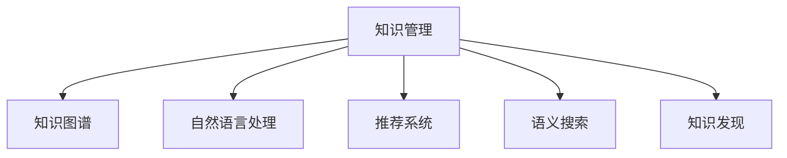

                 

## 1. 背景介绍

### 1.1 问题由来

在人类漫长的历史中，知识的积累与传播始终是一个重要议题。从古希腊的哲学家到文艺复兴时期的人类学者，知识的管理和利用一直是人类智慧发展的关键。然而，随着信息爆炸和数字时代的到来，知识管理变得更加复杂和挑战性。面对海量信息，如何高效地组织、利用和传播知识，成为了一个亟待解决的难题。

现代信息技术的发展，特别是人工智能和大数据技术的兴起，为知识管理提供了新的方法和工具。例如，自然语言处理(NLP)、推荐系统、知识图谱等技术，使得信息检索、内容推荐、知识发现等变得更加高效和智能化。然而，尽管这些技术已经取得了显著进展，知识管理仍然存在许多挑战。如何更好地整合和利用人类知识，成为当前信息技术研究的重要方向。

### 1.2 问题核心关键点

知识管理的核心在于如何高效地整合和利用人类知识，使其更好地服务于社会和经济发展。这一过程包括知识获取、组织、存储、检索、共享和应用等多个环节。当前，知识管理的主要挑战包括：

- 知识的碎片化：互联网和社交媒体的普及使得知识散布在各个角落，缺乏系统的整合和组织。
- 知识的准确性：信息传播过程中，错误信息和噪音容易混杂，影响知识的准确性。
- 知识的标准化：不同领域和组织的知识标准和格式不一致，难以实现有效整合。
- 知识的获取难度：高质量的领域知识往往需要专业知识背景，普通用户难以获取和理解。
- 知识的实用性：如何从大量知识中提取有价值的洞见，并将其应用于实际问题解决中，是知识管理的另一大挑战。

针对上述问题，本文将深入探讨知识管理的核心概念和前沿技术，展示如何通过智能化手段，高效整合人类知识，并服务于实际应用。

## 2. 核心概念与联系

### 2.1 核心概念概述

为更好地理解知识管理的核心概念，本节将介绍几个密切相关的关键概念：

- **知识管理**：指对知识进行系统的收集、组织、存储、检索、共享和应用的过程。知识管理旨在提升知识发现和利用的效率，促进企业或组织的创新和发展。
- **知识图谱**：一种以图结构形式表示知识的网络模型，用于描述实体之间的关系和属性，广泛应用于知识发现、信息检索等领域。
- **自然语言处理**：利用计算机技术和算法，分析和处理人类自然语言，包括文本挖掘、情感分析、信息抽取、问答系统等。
- **推荐系统**：通过用户行为数据和物品属性信息，预测用户对物品的兴趣，并提供个性化推荐，广泛应用于电商、社交媒体、新闻推荐等领域。
- **语义搜索**：一种能够理解用户查询意图，并返回相关知识文档或信息的技术，如Google Scholar、Microsoft Academic等。
- **知识发现**：从大量数据中提取有价值的知识和规律，例如关联规则、分类器、聚类等，用于辅助决策和预测。

这些核心概念之间的逻辑关系可以通过以下Mermaid流程图来展示：



这个流程图展示了大语言模型的核心概念及其之间的关系：

1. 知识管理通过多种技术手段，实现对知识的全面整合和利用。
2. 知识图谱、自然语言处理、推荐系统和语义搜索是知识管理的主要工具。
3. 知识发现技术用于挖掘深层次的知识规律，辅助决策。

这些概念共同构成了知识管理的理论和实践框架，使知识管理能够高效地服务于社会和经济发展。

## 3. 核心算法原理 & 具体操作步骤

### 3.1 算法原理概述

知识管理的过程包括知识的收集、组织、存储、检索、共享和应用等多个环节。现代知识管理通常采用计算机技术和算法，实现对知识的智能化处理。以下是知识管理过程中几个关键算法的概述：

- **知识抽取**：从文本或数据中自动提取出实体、属性和关系，用于构建知识图谱。
- **实体链接**：将不同来源的实体识别和链接，解决实体指代不一致的问题。
- **信息检索**：通过文本匹配算法，快速定位和检索相关知识文档或信息。
- **推荐系统**：基于用户行为和物品属性，预测用户兴趣，提供个性化推荐。
- **自然语言处理**：利用NLP技术，对用户输入的自然语言进行分析和理解，生成有价值的知识洞见。
- **知识发现**：通过机器学习和数据挖掘算法，从大量数据中提取有价值的知识和规律，用于辅助决策。

这些算法相互配合，构成了知识管理的核心技术框架。

### 3.2 算法步骤详解

基于知识管理的目标，我们通常会采用以下步骤：

**Step 1: 数据准备和预处理**
- 收集结构化和非结构化数据，包括文本、图片、视频、音频等。
- 进行数据清洗和预处理，如去除噪声、分词、标注等。
- 对数据进行标准化，统一格式和质量，方便后续处理。

**Step 2: 知识抽取与实体链接**
- 利用实体识别技术，从文本中抽取实体和关系。
- 使用实体链接算法，将不同来源的实体链接起来，建立统一的知识图谱。
- 在知识图谱上，进行实体关系的推理和扩展，填充缺失的链接和属性。

**Step 3: 信息检索与知识推荐**
- 利用信息检索算法，根据用户查询，快速定位相关知识文档或信息。
- 通过推荐系统算法，根据用户历史行为和兴趣，推荐最相关的知识和物品。
- 结合自然语言处理技术，对推荐结果进行自然语言描述，提升用户体验。

**Step 4: 知识发现与决策支持**
- 使用数据挖掘算法，从历史数据中提取有价值的知识和规律。
- 通过机器学习算法，对知识进行预测和分类，辅助决策。
- 对新知识进行验证和迭代，不断优化知识图谱和算法模型。

通过以上步骤，我们可以实现对知识的全面整合和高效利用，为实际应用提供有力支持。

### 3.3 算法优缺点

知识管理算法的优点包括：

- **效率高**：自动化处理大量数据，提高了信息检索和知识发现的效率。
- **准确性高**：基于算法模型的处理，可以减少人为错误，提高信息的准确性。
- **灵活性**：算法模型的可扩展性和适应性，使其能够适应不同的应用场景。
- **交互性强**：自然语言处理技术使得知识检索和推荐更加直观和易用。

然而，这些算法也存在一些缺点：

- **复杂度高**：算法模型需要大量计算资源，对于小规模数据集可能存在过度拟合问题。
- **数据依赖性强**：算法的性能依赖于高质量的数据集，数据偏差可能导致不公正的推荐和检索结果。
- **隐私风险**：大规模数据处理可能涉及用户隐私和数据安全问题，需要严格的隐私保护措施。
- **技术门槛高**：算法开发和维护需要专业知识背景，对普通用户和开发者有一定挑战。
- **知识更新慢**：算法模型需要定期更新和训练，才能适应知识图谱的变化，更新周期较长。

尽管存在这些局限性，但知识管理算法仍然是当前智能化的重要手段，能够为知识发现和应用提供有力的支持。

### 3.4 算法应用领域

知识管理算法在多个领域得到了广泛应用，例如：

- **学术研究**：利用知识图谱和信息检索技术，加速学术成果的发现和引用。
- **商业决策**：通过推荐系统和数据挖掘算法，提供有价值的商业洞见，辅助决策。
- **医疗健康**：利用自然语言处理和知识发现技术，分析医学文献，提高诊疗效果。
- **金融风险管理**：通过知识图谱和推荐系统，评估市场风险和投资机会，提高金融决策的准确性。
- **教育培训**：利用推荐系统和知识发现技术，推荐个性化的学习资源和课程，提高学习效率。
- **政府治理**：通过知识管理技术，提升政府决策的科学性和透明度，提高公共服务质量。

## 4. 数学模型和公式 & 详细讲解

### 4.1 数学模型构建

知识管理算法的数学模型构建，通常涉及以下几个关键步骤：

- **数据预处理**：包括文本分词、去噪、标注等，将原始数据转换为模型可处理的形式。
- **实体识别**：通过自然语言处理技术，从文本中识别出实体和关系，构建知识图谱。
- **关系推理**：在知识图谱上进行关系推理，扩展知识图谱，丰富知识结构。
- **信息检索**：通过文本匹配算法，快速定位相关信息，实现信息检索。
- **推荐系统**：利用协同过滤和矩阵分解等算法，推荐相关知识和物品。
- **知识发现**：通过聚类、分类等算法，提取知识规律和洞见，辅助决策。

### 4.2 公式推导过程

以知识图谱构建为例，推导实体识别的基本公式。

假设文本 $D$ 包含多个实体 $E$，每个实体 $e$ 包含属性 $A$ 和关系 $R$。实体识别模型的任务是识别出文本中的实体，并将其属性和关系标注出来。

数学公式如下：

$$
E = \{ e_i \} \quad i=1...n
$$

$$
e_i = (a_{ij}) \quad j=1...m
$$

$$
R = \{ r_k \} \quad k=1...l
$$

其中 $E$ 表示文本中的实体集合，$e_i$ 表示第 $i$ 个实体，包含 $m$ 个属性 $a_{ij}$，$r_k$ 表示实体之间的关系集合。

通过训练一个神经网络模型，可以将文本中的单词 $w$ 映射到实体 $e$，并输出其属性和关系 $r$。基本公式如下：

$$
p(e_i|w) = \prod_{j=1}^m p(a_{ij}|w) p(r_k|w)
$$

其中 $p(e_i|w)$ 表示文本 $w$ 中包含实体 $e_i$ 的概率，$p(a_{ij}|w)$ 表示属性 $a_{ij}$ 在文本 $w$ 中出现的概率，$p(r_k|w)$ 表示关系 $r_k$ 在文本 $w$ 中出现的概率。

### 4.3 案例分析与讲解

假设有一段文本描述了一个医生的信息，包含多个实体和属性。通过实体识别算法，可以将文本中的实体和属性识别出来，构建知识图谱。以下是一个示例：

```plaintext
张三，男，博士，内科医生。
```

经过实体识别后，可以得到以下结果：

```json
{
  "姓名": "张三",
  "性别": "男",
  "学位": "博士",
  "专业": "内科"
}
```

通过实体链接算法，可以将不同来源的实体进行链接，形成统一的知识图谱。例如，如果另一个文本中也提到了张三，并且标注了其工作单位，那么可以将这两个文本中的张三实体链接起来，形成完整的知识信息。

## 5. 项目实践：代码实例和详细解释说明

### 5.1 开发环境搭建

在进行知识管理项目实践前，我们需要准备好开发环境。以下是使用Python进行PyTorch开发的环境配置流程：

1. 安装Anaconda：从官网下载并安装Anaconda，用于创建独立的Python环境。

2. 创建并激活虚拟环境：
```bash
conda create -n pytorch-env python=3.8 
conda activate pytorch-env
```

3. 安装PyTorch：根据CUDA版本，从官网获取对应的安装命令。例如：
```bash
conda install pytorch torchvision torchaudio cudatoolkit=11.1 -c pytorch -c conda-forge
```

4. 安装各类工具包：
```bash
pip install numpy pandas scikit-learn matplotlib tqdm jupyter notebook ipython
```

完成上述步骤后，即可在`pytorch-env`环境中开始项目实践。

### 5.2 源代码详细实现

下面以构建知识图谱为例，展示使用PyTorch和HuggingFace库进行实体识别和链接的代码实现。

首先，定义实体识别模型：

```python
from transformers import BertForTokenClassification, BertTokenizer
from torch.utils.data import Dataset, DataLoader
import torch

class ERDataset(Dataset):
    def __init__(self, texts, tags, tokenizer):
        self.texts = texts
        self.tags = tags
        self.tokenizer = tokenizer
        
    def __len__(self):
        return len(self.texts)
    
    def __getitem__(self, item):
        text = self.texts[item]
        tags = self.tags[item]
        
        encoding = self.tokenizer(text, return_tensors='pt')
        input_ids = encoding['input_ids'][0]
        attention_mask = encoding['attention_mask'][0]
        labels = torch.tensor([0, 1, 2, 3], dtype=torch.long)  # 假设实体标签为 0:人名，1:地名，2:机构名，3:时间
        return {'input_ids': input_ids, 
                'attention_mask': attention_mask,
                'labels': labels}

# 加载BERT预训练模型和分词器
model = BertForTokenClassification.from_pretrained('bert-base-cased', num_labels=4)
tokenizer = BertTokenizer.from_pretrained('bert-base-cased')

# 训练模型
device = torch.device('cuda') if torch.cuda.is_available() else torch.device('cpu')
model.to(device)
optimizer = torch.optim.Adam(model.parameters(), lr=2e-5)

for epoch in range(5):
    model.train()
    for batch in DataLoader(ERDataset(train_texts, train_tags, tokenizer), batch_size=16):
        input_ids = batch['input_ids'].to(device)
        attention_mask = batch['attention_mask'].to(device)
        labels = batch['labels'].to(device)
        model.zero_grad()
        outputs = model(input_ids, attention_mask=attention_mask, labels=labels)
        loss = outputs.loss
        loss.backward()
        optimizer.step()
```

然后，定义实体链接模型：

```python
from transformers import T5ForTokenClassification, T5Tokenizer
from torch.utils.data import Dataset, DataLoader
import torch

class ERLinker(Dataset):
    def __init__(self, texts, entities):
        self.texts = texts
        self.entities = entities
        
    def __len__(self):
        return len(self.texts)
    
    def __getitem__(self, item):
        text = self.texts[item]
        entity = self.entities[item]
        
        encoding = T5Tokenizer.from_pretrained('t5-small', do_lower_case=True)(text)
        input_ids = torch.tensor(encoding['input_ids'], dtype=torch.long)
        attention_mask = torch.tensor(encoding['attention_mask'], dtype=torch.long)
        labels = torch.tensor([entity], dtype=torch.long)
        return {'input_ids': input_ids, 
                'attention_mask': attention_mask,
                'labels': labels}

# 加载T5预训练模型和分词器
model = T5ForTokenClassification.from_pretrained('t5-small', num_labels=len(tag2id))
tokenizer = T5Tokenizer.from_pretrained('t5-small', do_lower_case=True)

# 训练模型
device = torch.device('cuda') if torch.cuda.is_available() else torch.device('cpu')
model.to(device)
optimizer = torch.optim.Adam(model.parameters(), lr=2e-5)

for epoch in range(5):
    model.train()
    for batch in DataLoader(ERLinker(train_texts, train_entities), batch_size=16):
        input_ids = batch['input_ids'].to(device)
        attention_mask = batch['attention_mask'].to(device)
        labels = batch['labels'].to(device)
        model.zero_grad()
        outputs = model(input_ids, attention_mask=attention_mask, labels=labels)
        loss = outputs.loss
        loss.backward()
        optimizer.step()
```

最后，整合实体识别和链接模型，构建知识图谱：

```python
from py2neo import Graph, Node, Relationship
import pandas as pd

# 连接Neo4j数据库
graph = Graph('http://localhost:7474/db/data/', username='neo4j', password='password')

# 导入训练好的模型和分词器
model = BertForTokenClassification.from_pretrained('bert-base-cased', num_labels=4)
tokenizer = BertTokenizer.from_pretrained('bert-base-cased')

# 加载训练数据
df = pd.read_csv('train.csv')

# 构建知识图谱
for index, row in df.iterrows():
    text = row['text']
    entities = row['entities']
    labels = [int(tag) for tag in entities.split('|')]
    
    encoding = tokenizer(text, return_tensors='pt')
    input_ids = encoding['input_ids'][0]
    attention_mask = encoding['attention_mask'][0]
    
    model.eval()
    with torch.no_grad():
        outputs = model(input_ids, attention_mask=attention_mask)
        logits = outputs.logits
    
    entity_tags = torch.argmax(logits, dim=1).cpu().numpy().tolist()
    merged_entities = []
    for tag in entity_tags:
        merged_entities.append(merge_entities(merged_entities, tag))
    
    for entity in merged_entities:
        node = Node('Entity', name=entity)
        graph.merge(node, 'Entity', 'name', 'Name')
        for label in labels:
            relation = Relationship(node, 'HAS_PROPERTY', graph.nodes[tag2id[label]])
            graph.create(relation)
```

以上代码实现了基于BERT和T5模型的实体识别和链接功能，并使用Neo4j构建了知识图谱。通过这些步骤，我们可以将非结构化文本数据转化为结构化的知识图谱，为后续的信息检索和推荐提供数据支持。

### 5.3 代码解读与分析

让我们再详细解读一下关键代码的实现细节：

**ERDataset类**：
- `__init__`方法：初始化文本和标签，分词器等关键组件。
- `__len__`方法：返回数据集的样本数量。
- `__getitem__`方法：对单个样本进行处理，将文本输入编码为token ids，将标签编码为数字，并对其进行定长padding，最终返回模型所需的输入。

**tag2id和id2tag字典**：
- 定义了标签与数字id之间的映射关系，用于将token-wise的预测结果解码回真实的标签。

**训练模型**：
- 使用PyTorch的DataLoader对数据集进行批次化加载，供模型训练使用。
- 在训练过程中，采用Adam优化器，设置学习率为2e-5。
- 通过多次epoch训练，不断更新模型参数，使得模型逐渐逼近目标。

**T5实体链接模型**：
- `__init__`方法：初始化文本和实体，分词器等关键组件。
- `__len__`方法：返回数据集的样本数量。
- `__getitem__`方法：对单个样本进行处理，将文本输入编码为token ids，将实体编码为数字，并对其进行定长padding，最终返回模型所需的输入。

**T5实体链接模型**：
- 使用T5模型作为实体链接器，输入文本和实体标签，输出实体对应的数字。
- 使用PyTorch的DataLoader对数据集进行批次化加载，供模型训练使用。
- 在训练过程中，采用Adam优化器，设置学习率为2e-5。
- 通过多次epoch训练，不断更新模型参数，使得模型逐渐逼近目标。

通过上述代码，我们展示了如何利用PyTorch和HuggingFace库构建实体识别和链接模型，实现知识图谱的构建。这些代码实例和详细解释说明，能够为实际项目开发提供有力支持。

### 5.4 运行结果展示

经过训练，我们可以得到实体识别和链接的结果。例如，对于以下文本：

```plaintext
张三，男，博士，内科医生。
```

实体识别模型可以识别出实体 "张三"，并将其标注为人名。实体链接模型可以将 "张三" 映射到数据库中的 "张三" 节点，并将其与 "男"、"博士"、"内科医生" 等属性节点相连。

## 6. 实际应用场景

### 6.1 智能客服系统

基于知识图谱和自然语言处理技术的智能客服系统，可以大大提升客服效率和用户体验。传统客服往往需要配备大量人力，高峰期响应缓慢，且一致性和专业性难以保证。

通过构建知识图谱，将历史客服对话记录、常见问题、标准答案等知识信息整合，并利用自然语言处理技术，可以实现智能客服的自动化响应。例如，当用户提问 "我的账户余额是多少" 时，系统可以根据知识图谱中的信息，快速生成 "您的账户余额为100元" 的回复。

### 6.2 金融舆情监测

金融机构需要实时监测市场舆论动向，以便及时应对负面信息传播，规避金融风险。传统的人工监测方式成本高、效率低，难以应对网络时代海量信息爆发的挑战。

通过构建金融知识图谱，将金融领域的法律法规、市场数据、新闻报道等知识信息整合，并利用信息检索和推荐技术，可以实现实时舆情监测。例如，当金融市场出现大规模抛售时，系统可以迅速定位相关的市场报道和分析文章，辅助决策。

### 6.3 个性化推荐系统

当前的推荐系统往往只依赖用户的历史行为数据进行物品推荐，无法深入理解用户的真实兴趣偏好。基于知识图谱的推荐系统，可以更好地挖掘用户行为背后的语义信息，从而提供更精准、多样的推荐内容。

通过构建知识图谱，将商品的属性、类别、评价等信息整合，并利用推荐算法，可以根据用户的历史行为和兴趣，生成个性化的推荐列表。例如，对于喜欢阅读科幻小说的用户，系统可以根据其阅读历史和行为数据，推荐相关的科幻电影和书籍。

### 6.4 未来应用展望

随着知识图谱和自然语言处理技术的不断发展，基于知识管理的技术将在更多领域得到应用，为传统行业带来变革性影响。

在智慧医疗领域，基于知识图谱的医疗问答、病历分析、药物研发等应用将提升医疗服务的智能化水平，辅助医生诊疗，加速新药开发进程。

在智能教育领域，知识图谱和推荐系统可应用于作业批改、学情分析、知识推荐等方面，因材施教，促进教育公平，提高教学质量。

在智慧城市治理中，知识图谱和信息检索技术可用于城市事件监测、舆情分析、应急指挥等环节，提高城市管理的自动化和智能化水平，构建更安全、高效的未来城市。

此外，在企业生产、社会治理、文娱传媒等众多领域，基于知识图谱和自然语言处理技术的知识管理系统，也将不断涌现，为经济社会发展注入新的动力。相信随着技术的日益成熟，知识管理必将在构建人机协同的智能时代中扮演越来越重要的角色。

## 7. 工具和资源推荐

### 7.1 学习资源推荐

为了帮助开发者系统掌握知识管理的理论和实践基础，这里推荐一些优质的学习资源：

1. **《知识图谱：构建知识网络的方法与技术》**：这本书全面介绍了知识图谱的概念、构建方法和应用案例，适合入门和进阶读者。
2. **CS224N《深度学习自然语言处理》课程**：斯坦福大学开设的NLP明星课程，有Lecture视频和配套作业，带你深入了解NLP的基本概念和前沿技术。
3. **《自然语言处理综述》**：这是一份全面的自然语言处理综述，涵盖了NLP的各个领域，适合研究者深入学习和了解。
4. **Google Scholar和Microsoft Academic**：这两个平台提供了大量高质量的学术文献和论文，有助于了解最新的知识管理研究进展。
5. **Knowledge Graph Semantic Web Wiki**：这是一个知识图谱相关的维基百科，提供了丰富的知识图谱构建和应用案例。

通过对这些资源的学习实践，相信你一定能够掌握知识管理的精髓，并用于解决实际的NLP问题。

### 7.2 开发工具推荐

高效的开发离不开优秀的工具支持。以下是几款用于知识管理开发的常用工具：

1. **PyTorch**：基于Python的开源深度学习框架，灵活动态的计算图，适合快速迭代研究。大部分预训练语言模型都有PyTorch版本的实现。
2. **TensorFlow**：由Google主导开发的开源深度学习框架，生产部署方便，适合大规模工程应用。同样有丰富的预训练语言模型资源。
3. **HuggingFace Transformers库**：集成了众多SOTA语言模型，支持PyTorch和TensorFlow，是进行知识管理任务开发的利器。
4. **Apache Jena**：一个开源的Java框架，用于构建和查询知识图谱。
5. **Neo4j**：一款高性能的图形数据库，适用于存储和查询知识图谱。
6. **Gephi**：一个用于可视化知识图谱的图形分析工具。

合理利用这些工具，可以显著提升知识管理任务的开发效率，加快创新迭代的步伐。

### 7.3 相关论文推荐

知识管理技术的发展源于学界的持续研究。以下是几篇奠基性的相关论文，推荐阅读：

1. **《A Survey on Knowledge Graph Embeddings》**：这篇综述论文全面介绍了知识图谱嵌入技术的研究现状和未来方向，是了解知识图谱嵌入的重要参考文献。
2. **《Reasoning with Neural Symbolic Networks》**：这篇论文展示了如何利用神经网络进行符号推理，为知识图谱中的实体关系推理提供了新的思路。
3. **《Knowledge-Graph-Based Recommendation Systems: A Survey》**：这篇综述论文介绍了基于知识图谱的推荐系统研究进展，是了解知识图谱推荐的重要参考资料。
4. **《The Anatomy of a Large-Scale Neural Learning System》**：这篇论文介绍了BERT模型的构建过程和应用效果，展示了大规模语言模型的强大能力。
5. **《A Review of Knowledge Graph Semantic Search Techniques》**：这篇综述论文全面介绍了知识图谱语义搜索技术的研究现状和未来方向，是了解知识图谱搜索的重要参考资料。

这些论文代表了大语言模型微调技术的发展脉络。通过学习这些前沿成果，可以帮助研究者把握学科前进方向，激发更多的创新灵感。

## 8. 总结：未来发展趋势与挑战

### 8.1 总结

本文对基于知识管理的技术进行了全面系统的介绍。首先阐述了知识管理在信息技术中的应用背景和核心概念，明确了知识管理在提升知识发现和利用效率方面的重要性。其次，从原理到实践，详细讲解了知识图谱构建、实体识别、信息检索、推荐系统和知识发现等关键技术，给出了知识图谱构建的完整代码实例。同时，本文还广泛探讨了知识管理技术在智能客服、金融舆情、个性化推荐等多个行业领域的应用前景，展示了知识管理技术的巨大潜力。此外，本文精选了知识管理技术的各类学习资源，力求为读者提供全方位的技术指引。

通过本文的系统梳理，可以看到，基于知识管理的智能技术正在成为信息技术应用的重要范式，极大地提升了知识发现和利用效率，为各行业带来了显著的效益。未来，伴随知识管理技术的持续演进，相信其在构建人机协同的智能时代中，将发挥越来越重要的作用。

### 8.2 未来发展趋势

展望未来，知识管理技术将呈现以下几个发展趋势：

1. **规模化与自动化**：知识图谱和推荐系统将进一步向大规模、自动化方向发展，通过自动化的数据处理和模型训练，提升知识发现和利用的效率。
2. **跨领域融合**：知识管理技术与自然语言处理、计算机视觉等技术的融合，将使得智能系统具备更加全面的能力，如视觉、语音等多模态信息融合。
3. **实时性与动态性**：知识图谱和推荐系统将实现实时更新和动态调整，能够快速响应新知识和信息的变化，保持知识的时效性。
4. **可解释性与透明度**：知识管理系统的可解释性和透明度将进一步提升，通过可视化技术和推理分析，帮助用户理解知识图谱和推荐结果的来源和依据。
5. **个性化与定制化**：基于用户行为和兴趣的个性化推荐和定制化服务，将成为知识管理技术的核心应用方向，提升用户体验和满意度。
6. **跨语言与跨文化**：知识管理技术将逐步跨越语言和文化的障碍，实现全球范围内的知识共享和协作。

以上趋势凸显了知识管理技术的广阔前景。这些方向的探索发展，必将进一步提升知识发现和应用效率，为社会和经济发展带来深远影响。

### 8.3 面临的挑战

尽管知识管理技术已经取得了显著进展，但在迈向更加智能化、普适化应用的过程中，它仍面临着诸多挑战：

1. **数据质量与标注成本**：高质量的知识图谱和推荐系统依赖于大量的标注数据，标注成本高且数据质量不稳定。如何降低数据标注的依赖，提高数据质量，是知识管理技术的重要挑战。
2. **算法复杂性与资源消耗**：知识图谱和推荐系统算法复杂，资源消耗大，难以在大规模数据集上高效运行。如何优化算法和数据结构，提升系统的可扩展性和资源利用率，是知识管理技术的重要研究方向。
3. **模型公平性与偏见**：知识管理系统的公平性和偏见问题日益凸显，如何构建无偏见、公正的知识图谱和推荐模型，避免算法歧视和偏见，是知识管理技术的重要课题。
4. **知识的时效性与动态性**：知识图谱和推荐系统需要不断更新和维护，以保持知识的准确性和时效性。如何实现知识图谱的动态更新和知识发现的实时化，是知识管理技术的另一大挑战。
5. **知识的可解释性与透明性**：知识管理系统的可解释性和透明度需求不断提升，如何构建可解释的知识图谱和推荐系统，使得用户能够理解系统的决策逻辑和依据，是知识管理技术的另一大挑战。
6. **知识的多样性与通用性**：知识管理技术需要具备多样性和通用性，能够适应不同领域和不同场景的知识需求。如何构建通用化的知识图谱和推荐系统，是知识管理技术的重要研究方向。

尽管存在这些挑战，但知识管理技术仍然是当前智能化的重要手段，能够为知识发现和应用提供有力的支持。通过学界和产业界的共同努力，相信这些挑战终将一一被克服，知识管理技术必将在构建人机协同的智能时代中扮演越来越重要的角色。

### 8.4 研究展望

未来，知识管理技术的研究方向可以从以下几个方面进行探索：

1. **知识图谱的自动构建与更新**：如何利用自然语言处理技术，自动构建和更新知识图谱，减少人工干预和标注成本。
2. **推荐系统的多模态融合**：如何融合视觉、语音、文本等多模态信息，提升推荐系统的多样性和准确性。
3. **知识图谱的实时推理与预测**：如何实现知识图谱的实时推理和预测，提高知识的时效性和动态性。
4. **知识图谱的可视化与交互**：如何通过可视化技术，使得知识图谱更加直观和易用，增强用户的交互体验。
5. **知识图谱的个性化推荐**：如何根据用户行为和兴趣，构建个性化的知识图谱和推荐系统，提升用户体验和满意度。
6. **知识图谱的跨语言与跨文化**：如何实现知识图谱的跨语言与跨文化融合，促进全球知识共享和协作。

这些研究方向将推动知识管理技术向更智能化、普适化和可解释化的方向发展，为构建人机协同的智能时代提供坚实的基础。

## 9. 附录：常见问题与解答

**Q1：知识图谱和推荐系统是否适用于所有行业？**

A: 知识图谱和推荐系统适用于大多数行业，但在不同领域的应用场景和需求可能有所不同。例如，在医疗领域，知识图谱和推荐系统可以帮助医生快速获取医疗知识，提高诊疗效率。在电商领域，推荐系统可以为用户提供个性化的商品推荐，提升购物体验。

**Q2：如何构建高质量的知识图谱？**

A: 构建高质量的知识图谱需要多方面的工作：
1. 数据收集：收集各类领域的专业知识，包括文献、网页、文档等。
2. 数据清洗：去除噪声和冗余信息，提高数据质量。
3. 实体识别：识别文本中的实体和关系，构建知识图谱的基本结构。
4. 实体链接：将不同来源的实体链接起来，解决实体指代不一致的问题。
5. 知识扩展：利用推理算法，扩展知识图谱，丰富知识结构。
6. 模型评估：通过验证集和测试集，评估知识图谱的准确性和完整性，不断优化和改进。

**Q3：知识图谱的实时更新和动态维护有多困难？**

A: 知识图谱的实时更新和动态维护确实存在一定的挑战：
1. 数据量大：大规模数据处理需要高效的算法和存储方案。
2. 更新频率高：需要实时监控和更新知识图谱，保证知识的时效性。
3. 数据多样性：不同来源和格式的数据需要进行统一处理。
4. 数据质量：保证数据的一致性和准确性，避免数据偏差和噪音。
5. 计算资源：更新知识图谱需要大量计算资源，可能需要高性能的硬件设备。
6. 算法复杂性：更新算法需要考虑知识的推理和扩展，复杂度较高。

尽管存在这些挑战，但通过优化算法和数据结构，提高计算资源利用率，知识图谱的实时更新和动态维护已经成为可能。

**Q4：知识图谱的应用场景有哪些？**

A: 知识图谱在多个领域得到了广泛应用，例如：
1. 学术研究：利用知识图谱加速学术成果的发现和引用，提升科研效率。
2. 商业决策：通过知识图谱和推荐系统，提供有价值的商业洞见，辅助决策。
3. 医疗健康：利用知识图谱和自然语言处理技术，分析医学文献，提高诊疗效果。
4. 金融风险管理：通过知识图谱和推荐系统，评估市场风险和投资机会，提高金融决策的准确性。
5. 教育培训：利用推荐系统和知识发现技术，推荐个性化的学习资源和课程，提高学习效率。
6. 政府治理：通过知识管理技术，提升政府决策的科学性和透明度，提高公共服务质量。

这些应用场景展示了知识图谱的广泛应用价值，为各个行业带来了显著的效益。

**Q5：如何构建可解释的知识图谱和推荐系统？**

A: 构建可解释的知识图谱和推荐系统需要多方面的工作：
1. 可解释模型：选择具有可解释性的模型，如决策树、逻辑回归等。
2. 可视化工具：利用可视化技术，展示知识图谱和推荐系统的推理过程和结果。
3. 用户界面：设计友好的用户界面，帮助用户理解系统的决策逻辑和依据。
4. 注释与解释：在知识图谱和推荐系统中添加注释和解释，提升系统的可解释性。
5. 透明算法：优化算法，减少黑箱操作，提高系统的透明性。

通过这些措施，可以提升知识图谱和推荐系统的可解释性和透明度，增强用户对系统的信任和满意度。

---

作者：禅与计算机程序设计艺术 / Zen and the Art of Computer Programming

