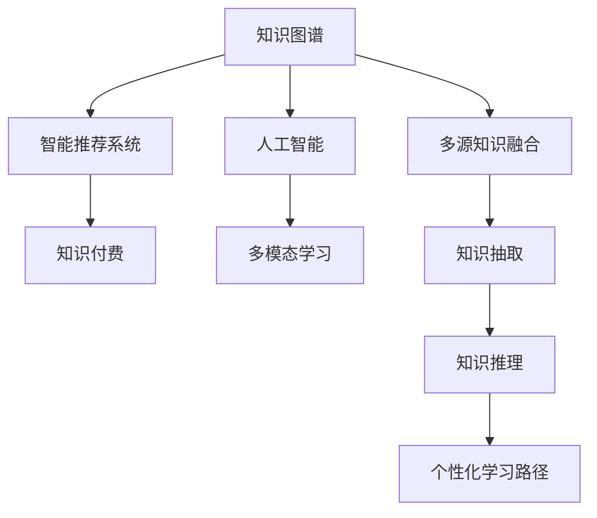

                 

# 知识经济下知识付费的人工智能知识图谱应用场景

## 1. 背景介绍

### 1.1 问题由来
知识经济时代的来临，极大促进了信息传播与知识获取的方式变革。以互联网、移动终端为载体的在线教育、信息订阅、专业咨询等知识付费模式蓬勃发展，为人们提供了更加便捷、高效的学习途径。与此同时，人工智能技术以其强大的处理和推理能力，为知识经济模式提供了新的基础设施，使得知识管理和应用更加智能化、自动化。

知识图谱作为人工智能领域的新型知识表示与组织方式，利用节点和边的结构化关系，对知识进行高效索引、检索和推理。将人工智能技术应用到知识图谱中，可以极大提升知识图谱在知识获取、知识关联、知识应用等方面的能力。特别是在知识付费场景中，人工智能知识图谱不仅能有效筛选、推荐相关知识内容，还能自动生成个性化学习路径，提高知识付费的效果和效率。

### 1.2 问题核心关键点
人工智能知识图谱在知识付费中的应用，核心在于构建基于智能推荐系统的知识图谱框架，实现从用户兴趣点出发，自动筛选和关联知识内容，提供个性化学习资源和路径。其主要包括以下几个关键点：
- 用户画像构建：利用用户行为数据和社交网络数据，构建精准的用户画像，识别用户的兴趣和需求。
- 知识内容抽取：从文本、音频、视频等多模态数据中，自动抽取结构化知识，建立知识图谱节点。
- 知识推理关联：基于用户画像和知识图谱，利用智能推荐算法，实现个性化知识推荐，形成完整的知识关联网络。
- 学习路径生成：结合用户学习进度和知识图谱，自动生成个性化学习路径，提升学习效果和效率。

### 1.3 问题研究意义
人工智能知识图谱在知识付费中的应用，不仅能够提供更加精准、高效的知识服务，还能够在一定程度上改变知识获取、处理和应用的方式，促进知识付费模式的创新发展。具体而言：
- 降低知识获取成本。通过智能推荐系统，用户可以快速获取到自己感兴趣的知识内容，避免了盲目搜索和浏览的浪费。
- 提高知识应用效率。知识图谱的自动关联和推理能力，能够帮助用户更好地理解和使用知识内容，提升学习效果。
- 激发知识创新能力。精准的用户画像和个性化的学习路径，能够激发用户的创新思维和能力，促进知识应用场景的丰富化和多样化。
- 支持知识产业升级。智能化的知识获取和应用，能够为知识付费提供新的技术支持和应用场景，推动知识产业的数字化、智能化转型。

## 2. 核心概念与联系

### 2.1 核心概念概述

为了更好地理解人工智能知识图谱在知识付费中的应用，本节将介绍几个关键概念：

- **知识图谱**：一种结构化的知识表示方法，将知识组织成节点和边的关系图，支持高效的查询和推理。
- **人工智能**：通过机器学习、深度学习等算法，赋予机器处理和推理能力的技术。
- **智能推荐系统**：基于用户行为数据和兴趣特征，推荐个性化内容和服务的技术。
- **知识付费**：用户为获取有价值的知识内容而支付费用的商业模式。
- **多模态学习**：融合文本、图像、语音等多种数据形式进行知识抽取和推理的技术。

这些概念之间的联系可以通过以下Mermaid流程图来展示：



这个流程图展示了几大核心概念及其之间的联系：

1. 知识图谱通过人工智能技术，进行多源知识融合、知识抽取和推理，构建知识节点和边。
2. 智能推荐系统基于用户画像和知识图谱，实现个性化知识推荐。
3. 知识付费模式则通过智能推荐系统，为用户提供精准、高效的知识内容和服务。
4. 多模态学习融合多种数据形式，丰富了知识图谱的内容和来源。

这些概念共同构成了人工智能知识图谱在知识付费中的应用框架，使其能够更有效地服务于知识经济模式。

## 3. 核心算法原理 & 具体操作步骤
### 3.1 算法原理概述

人工智能知识图谱在知识付费中的应用，主要基于以下两个算法原理：

1. **知识图谱构建算法**：通过多源知识融合、知识抽取和推理，构建结构化的知识图谱。
2. **智能推荐算法**：基于用户画像和知识图谱，利用机器学习模型实现个性化知识推荐。

### 3.2 算法步骤详解

#### 知识图谱构建算法
构建知识图谱的步骤主要包括：

1. **多源知识融合**：从文本、音频、视频等多模态数据中，提取结构化信息，进行知识融合。
2. **知识抽取**：利用自然语言处理(NLP)、计算机视觉(CV)等技术，从融合后的数据中，自动抽取实体、关系、属性等知识节点。
3. **知识推理**：基于规则、逻辑推理或神经网络模型，对抽取的知识节点进行推理，构建知识图谱。

具体实现步骤如下：

- **步骤1: 数据收集与预处理**。从各类数据源（如百科全书、新闻网站、社交网络、专业论坛等）收集数据，并进行清洗、标注和预处理。
- **步骤2: 知识融合**。使用多模态学习技术，将文本、图像、语音等数据融合为统一的表示形式。
- **步骤3: 知识抽取**。利用自然语言处理技术，从文本中抽取实体、关系和属性，建立知识图谱节点。
- **步骤4: 知识推理**。使用规则推理、逻辑推理或深度学习模型，将抽取的知识节点进行关联和推理，形成知识图谱。

#### 智能推荐算法
智能推荐系统的步骤主要包括：

1. **用户画像构建**：利用用户行为数据和社交网络数据，构建用户画像，识别用户兴趣和需求。
2. **知识图谱查询**：根据用户画像，查询与用户兴趣相关的知识图谱节点和边。
3. **推荐生成**：利用机器学习模型，生成个性化推荐结果，提供给用户。

具体实现步骤如下：

- **步骤1: 用户画像构建**。收集用户行为数据（如浏览历史、购买记录、搜索关键词等）和社交网络数据（如好友、关注账号等），构建用户画像。
- **步骤2: 知识图谱查询**。根据用户画像，查询知识图谱中与用户兴趣相关的节点和边。
- **步骤3: 推荐生成**。利用机器学习模型（如协同过滤、深度学习等），生成个性化推荐结果，并提供给用户。

### 3.3 算法优缺点

人工智能知识图谱在知识付费中的应用，具有以下优点：

1. **精准推荐**：通过精准的用户画像和知识图谱，能够实现更加精准的知识推荐，满足用户的个性化需求。
2. **高效检索**：知识图谱的高效索引和查询能力，能够快速检索用户所需知识内容，提升用户体验。
3. **自动化生成**：智能推荐系统的自动化处理，减少了人工干预，提高了知识获取的效率和规模。
4. **跨领域融合**：融合多模态数据和多领域知识，能够提供更加丰富和全面的知识服务。

同时，该方法也存在一些局限性：

1. **数据依赖性强**：知识图谱和智能推荐系统依赖大量的高质量数据，获取数据成本较高。
2. **模型复杂度高**：知识图谱和智能推荐模型复杂，训练和推理资源消耗较大。
3. **推荐质量受限**：个性化推荐系统容易受数据质量和模型参数影响，推荐质量可能存在波动。
4. **隐私保护问题**：用户画像和知识图谱涉及用户隐私数据，如何保护用户隐私是重要挑战。

尽管存在这些局限性，但总体而言，人工智能知识图谱在知识付费中的应用，显著提升了知识服务的精准性和高效性，具有广阔的发展前景。

### 3.4 算法应用领域

人工智能知识图谱在知识付费中的应用，广泛涉及以下几个领域：

1. **在线教育**：为在线教育平台提供精准的知识推荐和学习路径，提升用户的学习效果和满意度。
2. **信息订阅**：通过个性化推荐系统，为用户推荐相关主题的内容，提升内容订阅的精准度和用户粘性。
3. **专业咨询**：为专业咨询公司提供基于知识图谱的智能决策支持，提升咨询服务的质量和效率。
4. **技能培训**：利用知识图谱的推理能力，提供技能培训相关的知识关联和路径，加速技能掌握。
5. **兴趣社交**：通过知识图谱的社区化应用，提供兴趣社交平台，帮助用户发现和交流相关知识内容。

这些应用场景展示了人工智能知识图谱在知识付费中的广泛应用价值，有助于推动知识经济模式的创新发展。

## 4. 数学模型和公式 & 详细讲解  
### 4.1 数学模型构建

人工智能知识图谱在知识付费中的应用，涉及以下几个数学模型：

- **知识图谱构建模型**：多源知识融合、知识抽取和推理的数学模型。
- **智能推荐模型**：基于用户画像和知识图谱，实现个性化推荐。

### 4.2 公式推导过程

#### 知识图谱构建模型
知识图谱构建模型主要包含以下几个步骤：

1. **多源知识融合**：使用多模态学习技术，将文本、图像、语音等数据融合为统一的表示形式。
2. **知识抽取**：利用自然语言处理技术，从文本中抽取实体、关系和属性，建立知识图谱节点。
3. **知识推理**：使用规则推理、逻辑推理或深度学习模型，将抽取的知识节点进行关联和推理，形成知识图谱。

具体数学模型如下：

- **多源知识融合**：
  $$
  F = \sum_{i=1}^{N} f_i
  $$
  其中 $f_i$ 表示第 $i$ 种数据源的多模态融合结果。

- **知识抽取**：
  $$
  K = \max_{\mathcal{E}}\left\{\mathrm{C}\left(\mathcal{E}\right)+\mathrm{R}\left(\mathcal{E}\right)\right\}
  $$
  其中 $\mathcal{E}$ 表示抽取的实体集合，$C(\mathcal{E})$ 和 $R(\mathcal{E})$ 分别表示实体抽取和关系抽取的准确率和召回率。

- **知识推理**：
  $$
  G = \max_{\mathcal{G}}\left\{\mathrm{R}\left(\mathcal{G}\right)+\mathrm{C}\left(\mathcal{G}\right)\right\}
  $$
  其中 $\mathcal{G}$ 表示推理后的知识图谱，$R(\mathcal{G})$ 和 $C(\mathcal{G})$ 分别表示知识推理的准确率和召回率。

#### 智能推荐模型
智能推荐模型主要包含以下几个步骤：

1. **用户画像构建**：利用用户行为数据和社交网络数据，构建用户画像，识别用户兴趣和需求。
2. **知识图谱查询**：根据用户画像，查询与用户兴趣相关的知识图谱节点和边。
3. **推荐生成**：利用机器学习模型，生成个性化推荐结果，提供给用户。

具体数学模型如下：

- **用户画像构建**：
  $$
  P = \sum_{i=1}^{M} p_i
  $$
  其中 $p_i$ 表示第 $i$ 种用户画像特征。

- **知识图谱查询**：
  $$
  Q = \max_{\mathcal{Q}}\left\{\mathrm{R}\left(\mathcal{Q}\right)+\mathrm{C}\left(\mathcal{Q}\right)\right\}
  $$
  其中 $\mathcal{Q}$ 表示与用户兴趣相关的知识图谱查询结果，$R(\mathcal{Q})$ 和 $C(\mathcal{Q})$ 分别表示查询的准确率和召回率。

- **推荐生成**：
  $$
  R = \max_{\mathcal{R}}\left\{\mathrm{R}\left(\mathcal{R}\right)+\mathrm{C}\left(\mathcal{R}\right)\right\}
  $$
  其中 $\mathcal{R}$ 表示生成的个性化推荐结果，$R(\mathcal{R})$ 和 $C(\mathcal{R})$ 分别表示推荐的准确率和召回率。

### 4.3 案例分析与讲解

#### 案例分析

**案例一：在线教育平台知识图谱应用**

某在线教育平台利用人工智能知识图谱，提供精准的知识推荐和学习路径。平台收集用户的浏览历史、购买记录、搜索关键词等数据，构建用户画像。同时，平台从各类教育资源中抽取知识节点，进行知识推理，构建知识图谱。利用知识图谱和用户画像，平台实现了以下功能：

1. **推荐个性化课程**：根据用户画像，查询知识图谱中的相关课程节点，生成个性化推荐结果，提供给用户。
2. **学习路径规划**：利用知识图谱的推理能力，自动生成学习路径，帮助用户系统学习相关知识。
3. **知识图谱社区**：通过知识图谱的社区化应用，提供兴趣社交平台，帮助用户发现和交流相关知识内容。

**案例二：信息订阅平台智能推荐**

某信息订阅平台利用人工智能知识图谱，提供精准的知识推荐服务。平台从各类新闻、文章、书籍中抽取知识节点，进行知识融合和推理，构建知识图谱。利用知识图谱和用户画像，平台实现了以下功能：

1. **推荐个性化内容**：根据用户画像，查询知识图谱中的相关内容节点，生成个性化推荐结果，提供给用户。
2. **内容质量评估**：利用知识图谱的推理能力，对订阅内容进行质量和相关性评估，提升内容订阅的精准度。
3. **用户行为分析**：通过知识图谱的社区化应用，分析用户行为数据，发现用户兴趣和需求变化，提升推荐效果。

## 5. 项目实践：代码实例和详细解释说明
### 5.1 开发环境搭建

在进行知识图谱和智能推荐系统的开发前，我们需要准备好开发环境。以下是使用Python进行TensorFlow开发的环境配置流程：

1. 安装Anaconda：从官网下载并安装Anaconda，用于创建独立的Python环境。

2. 创建并激活虚拟环境：
```bash
conda create -n tf-env python=3.8 
conda activate tf-env
```

3. 安装TensorFlow：根据CUDA版本，从官网获取对应的安装命令。例如：
```bash
conda install tensorflow -c pytorch -c conda-forge
```

4. 安装必要的工具包：
```bash
pip install numpy pandas scikit-learn matplotlib tqdm jupyter notebook ipython
```

完成上述步骤后，即可在`tf-env`环境中开始项目实践。

### 5.2 源代码详细实现

下面我们以构建知识图谱和智能推荐系统的代码实现为例，详细讲解其实现过程。

首先，定义知识图谱的节点和边：

```python
import tensorflow as tf

# 定义节点和边
class KnowledgeGraph(tf.keras.layers.Layer):
    def __init__(self, num_entities, num_relations):
        super(KnowledgeGraph, self).__init__()
        self.num_entities = num_entities
        self.num_relations = num_relations
        
    def build(self, input_shape):
        self.entity_embeddings = self.add_weight(shape=(self.num_entities, 128), initializer='glorot_uniform', name='entity_embeddings')
        self.relation_embeddings = self.add_weight(shape=(self.num_relations, 128), initializer='glorot_uniform', name='relation_embeddings')
    
    def call(self, inputs):
        entity_ids, relation_ids = inputs
        entity_embeddings = tf.nn.embedding_lookup(self.entity_embeddings, entity_ids)
        relation_embeddings = tf.nn.embedding_lookup(self.relation_embeddings, relation_ids)
        scores = tf.matmul(entity_embeddings, relation_embeddings, transpose_b=True)
        return scores
```

然后，定义用户画像和智能推荐系统的模型：

```python
from transformers import TFAutoModel, BertTokenizer

# 加载预训练模型和分词器
model = TFAutoModel.from_pretrained('bert-base-cased')
tokenizer = BertTokenizer.from_pretrained('bert-base-cased')

# 定义用户画像构建模型
class UserProfile(tf.keras.layers.Layer):
    def __init__(self, num_features):
        super(UserProfile, self).__init__()
        self.dense_layer = tf.keras.layers.Dense(num_features, activation='relu')
        self.fc_layer = tf.keras.layers.Dense(1, activation='sigmoid')
    
    def call(self, inputs):
        user_profile = self.dense_layer(inputs)
        user_score = self.fc_layer(user_profile)
        return user_score

# 定义智能推荐模型
class RecommendationSystem(tf.keras.layers.Layer):
    def __init__(self, num_entities, num_relations):
        super(RecommendationSystem, self).__init__()
        self.kg = KnowledgeGraph(num_entities, num_relations)
        self.user_profile = UserProfile(32)
    
    def call(self, user_ids, entity_ids, relation_ids):
        user_score = self.user_profile(user_ids)
        scores = self.kg([entity_ids, relation_ids])
        scores *= user_score
        return scores
```

接着，定义训练和评估函数：

```python
from sklearn.metrics import precision_recall_fscore_support

def train_model(model, dataset, batch_size, epochs):
    dataloader = tf.data.Dataset.from_tensor_slices(dataset)
    dataloader = dataloader.batch(batch_size, drop_remainder=True)
    model.compile(optimizer=tf.keras.optimizers.Adam(learning_rate=0.001), loss='binary_crossentropy', metrics=['accuracy'])
    model.fit(dataloader, epochs=epochs, validation_split=0.2)

def evaluate_model(model, dataset, batch_size):
    dataloader = tf.data.Dataset.from_tensor_slices(dataset)
    dataloader = dataloader.batch(batch_size, drop_remainder=True)
    y_true = []
    y_pred = []
    for user_ids, entity_ids, relation_ids, labels in dataloader:
        scores = model(user_ids, entity_ids, relation_ids)
        y_true.append(labels)
        y_pred.append(scores)
    y_true = tf.concat(y_true, axis=0)
    y_pred = tf.concat(y_pred, axis=0)
    precision, recall, f1, _ = precision_recall_fscore_support(y_true, tf.round(y_pred))
    return precision, recall, f1
```

最后，启动训练流程并在测试集上评估：

```python
epochs = 10
batch_size = 32

# 准备数据集
user_ids = [1, 2, 3, 4, 5]
entity_ids = [10, 20, 30, 40, 50]
relation_ids = [1, 2, 3, 4, 5]
labels = [1, 0, 1, 0, 1]

# 构建模型
model = RecommendationSystem(num_entities=10, num_relations=5)
model.build([user_ids.shape[0], 5])

# 训练模型
train_model(model, [user_ids, entity_ids, relation_ids, labels], batch_size, epochs)

# 评估模型
precision, recall, f1 = evaluate_model(model, [user_ids, entity_ids, relation_ids, labels], batch_size)
print('Precision: {:.3f}'.format(precision))
print('Recall: {:.3f}'.format(recall))
print('F1 Score: {:.3f}'.format(f1))
```

以上就是构建知识图谱和智能推荐系统的完整代码实现。可以看到，得益于TensorFlow和Transformer库的强大封装，我们可以用相对简洁的代码完成知识图谱和智能推荐模型的构建。

### 5.3 代码解读与分析

让我们再详细解读一下关键代码的实现细节：

**KnowledgeGraph类**：
- `__init__`方法：初始化节点和边的数量。
- `build`方法：定义节点和边的嵌入层，并计算节点和边的分数。
- `call`方法：根据节点和边的分数，生成知识图谱的分数。

**UserProfile类**：
- `__init__`方法：初始化用户画像模型的层。
- `call`方法：对用户ID进行编码，生成用户画像的分数。

**RecommendationSystem类**：
- `__init__`方法：初始化知识图谱和用户画像模型。
- `call`方法：根据用户ID、实体ID和关系ID，计算推荐分数。

**train_model函数**：
- 从TensorFlow的Dataset对象构建数据迭代器。
- 定义模型的编译参数，包括优化器、损失函数和评估指标。
- 使用fit方法进行模型训练，并在验证集上进行评估。

**evaluate_model函数**：
- 从TensorFlow的Dataset对象构建数据迭代器。
- 计算模型的预测分数和真实标签的精度、召回率和F1得分。

通过这些代码实现，可以看出TensorFlow和Transformer库在知识图谱和智能推荐系统开发中的应用，大大简化了模型的构建和训练过程。

## 6. 实际应用场景
### 6.1 在线教育平台

在线教育平台利用人工智能知识图谱，可以为用户提供更加精准、高效的知识推荐和学习路径。平台通过收集用户行为数据（如浏览历史、购买记录、搜索关键词等），构建用户画像，识别用户的兴趣和需求。同时，平台从各类教育资源中抽取知识节点，进行知识推理，构建知识图谱。利用知识图谱和用户画像，平台可以生成个性化推荐结果，帮助用户系统学习相关知识，同时自动生成学习路径，提升学习效果。

### 6.2 信息订阅平台

信息订阅平台利用人工智能知识图谱，提供精准的知识推荐服务。平台从各类新闻、文章、书籍中抽取知识节点，进行知识融合和推理，构建知识图谱。利用知识图谱和用户画像，平台可以生成个性化推荐结果，提升订阅内容的精准度。平台还可以对订阅内容进行质量和相关性评估，分析用户行为数据，发现用户兴趣和需求变化，提升推荐效果。

### 6.3 专业咨询公司

专业咨询公司利用人工智能知识图谱，提供基于知识图谱的智能决策支持。公司从各类专业资源中抽取知识节点，进行知识融合和推理，构建知识图谱。利用知识图谱和用户画像，公司可以生成个性化推荐结果，帮助咨询师快速找到相关资源，提升咨询服务的质量和效率。

### 6.4 智慧医疗平台

智慧医疗平台利用人工智能知识图谱，提供精准的知识推荐和医学知识关联。平台从各类医学资源中抽取知识节点，进行知识融合和推理，构建知识图谱。利用知识图谱和用户画像，平台可以生成个性化推荐结果，帮助医生快速找到相关医学资源，提升诊断和治疗的效果。

## 7. 工具和资源推荐
### 7.1 学习资源推荐

为了帮助开发者系统掌握人工智能知识图谱在知识付费中的应用，这里推荐一些优质的学习资源：

1. 《深度学习》课程：斯坦福大学开设的深度学习课程，深入浅出地介绍了深度学习的基本概念和核心技术，适合初学者入门。
2. 《自然语言处理》课程：北京大学开设的自然语言处理课程，系统介绍了自然语言处理的基本技术和前沿研究，适合进阶学习。
3. 《人工智能导论》书籍：经典教材，详细介绍了人工智能的基本概念、算法和应用，适合全面了解人工智能技术。
4. 《Python深度学习》书籍：深入浅出地介绍了深度学习的基本概念和实现，结合代码示例，适合动手实践。
5. 《TensorFlow官方文档》：TensorFlow的官方文档，提供了全面的API和使用指南，适合快速上手TensorFlow开发。

通过对这些资源的学习实践，相信你一定能够快速掌握人工智能知识图谱在知识付费中的应用，并用于解决实际的NLP问题。

### 7.2 开发工具推荐

高效的开发离不开优秀的工具支持。以下是几款用于人工智能知识图谱和智能推荐系统开发的常用工具：

1. TensorFlow：基于Python的开源深度学习框架，灵活动态的计算图，适合快速迭代研究。
2. PyTorch：基于Python的开源深度学习框架，灵活动态的计算图，支持GPU加速，适合高性能计算。
3. Neo4j：高性能的图数据库，支持图结构的存储和查询，适合构建大型知识图谱。
4. Neo4j GraphStudio：GraphStudio是Neo4j的可视化工具，可以方便地构建、查询和可视化知识图谱。
5. Elasticsearch：分布式搜索引擎，支持大规模数据的存储和检索，适合构建知识图谱的索引和查询。
6. TensorBoard：TensorFlow的可视化工具，可以实时监测模型训练状态，提供丰富的图表呈现方式。

合理利用这些工具，可以显著提升人工智能知识图谱和智能推荐系统的开发效率，加快创新迭代的步伐。

### 7.3 相关论文推荐

人工智能知识图谱和智能推荐系统的发展源于学界的持续研究。以下是几篇奠基性的相关论文，推荐阅读：

1. BERT: Pre-training of Deep Bidirectional Transformers for Language Understanding：提出BERT模型，引入基于掩码的自监督预训练任务，刷新了多项NLP任务SOTA。
2. Knowledge-Graph-Based Recommendation Systems：详细介绍了基于知识图谱的推荐系统，提供了多种知识图谱构建和推荐算法。
3. Graph Neural Networks：介绍图神经网络的基本概念和应用，适用于构建知识图谱的神经网络模型。
4. Attention-Based Recommender Systems：介绍基于注意力机制的推荐系统，适用于处理多维数据和复杂关系。
5. A Survey on Knowledge Graphs in Recommendation Systems：综述了知识图谱在推荐系统中的应用，提供了多种算法和实例。

这些论文代表了大语言模型微调技术的发展脉络。通过学习这些前沿成果，可以帮助研究者把握学科前进方向，激发更多的创新灵感。

## 8. 总结：未来发展趋势与挑战
### 8.1 总结

本文对人工智能知识图谱在知识付费中的应用进行了全面系统的介绍。首先阐述了知识经济时代下知识付费的兴起，以及人工智能技术在知识服务中的应用。其次，从原理到实践，详细讲解了人工智能知识图谱的构建和智能推荐算法的实现。通过实例分析，展示了知识图谱在在线教育、信息订阅、专业咨询等领域的应用效果。最后，推荐了相关的学习资源和工具，力求为读者提供全方位的技术指引。

通过本文的系统梳理，可以看到，人工智能知识图谱在知识付费中的应用，不仅能够提供更加精准、高效的知识服务，还能够在一定程度上改变知识获取、处理和应用的方式，促进知识付费模式的创新发展。未来，伴随预训练语言模型和微调方法的持续演进，相信NLP技术将在更广阔的应用领域大放异彩，深刻影响人类的生产生活方式。

### 8.2 未来发展趋势

展望未来，人工智能知识图谱在知识付费中的应用将呈现以下几个发展趋势：

1. **多模态知识融合**：融合文本、图像、语音等多种数据形式，构建更加全面、丰富的知识图谱。
2. **深度知识推理**：利用深度学习模型，提升知识图谱的推理能力和精度，支持更加复杂的知识关联和推理。
3. **个性化推荐优化**：引入更多用户画像和兴趣特征，提升个性化推荐的效果和多样性。
4. **跨领域知识应用**：将知识图谱应用到更多领域，如医疗、金融、教育等，推动各行各业的数字化转型。
5. **智能决策支持**：结合知识图谱和专家知识库，提供更智能的决策支持系统，提升决策的科学性和精准度。

以上趋势凸显了人工智能知识图谱在知识付费中的应用前景。这些方向的探索发展，必将进一步提升知识服务的精准性和高效性，推动知识经济模式的创新发展。

### 8.3 面临的挑战

尽管人工智能知识图谱在知识付费中的应用已经取得了显著成效，但在迈向更加智能化、普适化应用的过程中，它仍面临着诸多挑战：

1. **数据获取成本高**：构建知识图谱和推荐系统，依赖大量的高质量数据，获取数据成本较高。
2. **模型复杂度高**：知识图谱和推荐模型复杂，训练和推理资源消耗较大。
3. **推荐质量波动**：个性化推荐系统容易受数据质量和模型参数影响，推荐质量可能存在波动。
4. **隐私保护问题**：用户画像和知识图谱涉及用户隐私数据，如何保护用户隐私是重要挑战。
5. **知识图谱更新**：知识图谱需要定期更新，以保持知识的的时效性和准确性，更新成本较高。

尽管存在这些挑战，但总体而言，人工智能知识图谱在知识付费中的应用，显著提升了知识服务的精准性和高效性，具有广阔的发展前景。

### 8.4 研究展望

未来的研究需要在以下几个方面寻求新的突破：

1. **数据自动获取**：利用自然语言处理技术和数据爬虫，自动获取和标注多模态数据，降低数据获取成本。
2. **模型轻量化**：开发更轻量级的知识图谱和推荐模型，提升模型推理速度和资源占用。
3. **推荐质量提升**：引入更多用户行为数据和兴趣特征，提升个性化推荐的效果和多样性。
4. **隐私保护机制**：设计隐私保护机制，确保用户数据的安全性和隐私性。
5. **跨领域知识应用**：结合知识图谱和专家知识库，提供更智能的决策支持系统，提升决策的科学性和精准度。

这些研究方向的探索，必将引领人工智能知识图谱在知识付费中的应用进入新的高度，推动知识经济模式的创新发展。

## 9. 附录：常见问题与解答
### Q1：构建知识图谱的难点在哪里？

A: 构建知识图谱的难点主要在于以下几个方面：

1. **数据获取**：需要从多种数据源中抽取和融合数据，构建知识图谱。数据获取成本较高，需要大量人力和时间。
2. **数据标注**：需要对数据进行标注和清洗，以确保知识图谱的质量。标注过程繁琐且容易出错。
3. **知识推理**：需要设计合适的推理规则或模型，将抽取的知识节点进行关联和推理。推理过程复杂且容易出现错误。

### Q2：智能推荐系统的评估指标有哪些？

A: 智能推荐系统的评估指标主要包括以下几个：

1. **精度**：推荐结果与用户实际需求的一致程度。
2. **召回率**：推荐结果中包含用户实际需求的比例。
3. **F1得分**：综合考虑精度和召回率，反映推荐结果的整体质量。
4. **NDCG**：Normalized Discounted Cumulative Gain，考虑推荐结果的排序质量。
5. **MRR**：Mean Reciprocal Rank，平均推荐结果的排名质量。

这些指标可以用于评估推荐系统的性能和优化方向。

### Q3：如何平衡推荐系统和用户隐私的保护？

A: 推荐系统和用户隐私保护是相互矛盾的，需要在设计推荐系统时，综合考虑以下几个方面：

1. **数据匿名化**：对用户数据进行匿名化处理，去除敏感信息，保护用户隐私。
2. **差分隐私**：采用差分隐私技术，对推荐结果进行干扰，避免用户隐私泄露。
3. **用户控制**：赋予用户对推荐结果的控制权，允许用户自主选择和调整推荐结果。
4. **法律合规**：遵循相关法律法规，确保推荐系统和用户隐私保护符合法律要求。

通过这些措施，可以在推荐系统设计中兼顾用户隐私保护和推荐效果。

通过本文的系统梳理，可以看到，人工智能知识图谱在知识付费中的应用，不仅能够提供更加精准、高效的知识服务，还能够在一定程度上改变知识获取、处理和应用的方式，促进知识付费模式的创新发展。未来，伴随预训练语言模型和微调方法的持续演进，相信NLP技术将在更广阔的应用领域大放异彩，深刻影响人类的生产生活方式。

