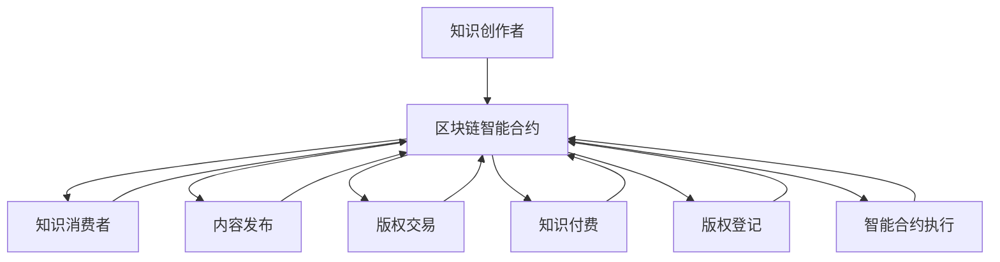

                 

# 知识经济下知识付费的区块链智能合约应用

## 1. 背景介绍

随着信息时代的到来，知识经济成为新时代的重要特征。传统的版权保护、知识付费等模式正面临前所未有的挑战和机遇。区块链技术的出现，为知识经济提供了全新的底层技术支持，特别是通过智能合约，实现去中心化、透明化的知识付费机制，推动了知识付费的商业应用进入新纪元。本文将介绍知识付费中区块链智能合约的核心概念、原理与应用场景，探讨其在知识经济中的未来发展与挑战。

## 2. 核心概念与联系

### 2.1 核心概念概述

区块链技术是一种去中心化的分布式账本技术，通过共识机制和加密技术，实现数据的不可篡改性和透明性。智能合约是一种可以自动执行的合约，利用区块链的脚本语言和自动验证机制，实现无需人工介入的自动化交易和合同执行。

在知识经济中，区块链智能合约可以实现去中心化的知识付费机制。例如，读者通过智能合约向作者支付版权费，作者授权读者获取特定知识的访问权限。这种方式不仅降低了版权保护成本，提高了知识付费的透明度，还能激发作者的创作动力。

### 2.2 核心概念原理和架构的 Mermaid 流程图



该图展示了知识付费中区块链智能合约的基本流程：知识创作者将知识内容发布在区块链上，智能合约自动记录交易记录，读者通过智能合约向创作者支付版权费，创作者授权读者获取知识内容，智能合约自动执行合同。

## 3. 核心算法原理 & 具体操作步骤

### 3.1 算法原理概述

区块链智能合约的实现主要依赖于区块链的技术基础，包括加密算法、共识机制、脚本语言等。智能合约通过智能合约语言编写，利用区块链的自动验证机制，实现自动化执行。

知识付费的区块链智能合约主要包括版权登记、交易记录、内容访问授权等几个环节。在版权登记环节，创作者将知识内容上传到区块链，智能合约自动记录版权信息；在交易记录环节，读者通过智能合约支付版权费；在内容访问授权环节，智能合约自动授权读者获取内容访问权限。

### 3.2 算法步骤详解

#### 3.2.1 版权登记

1. 创作者将知识内容上传到区块链，智能合约自动记录版权信息。
2. 智能合约生成一个公钥和一个私钥，用于数字签名验证。
3. 创作者将公钥和内容哈希值发送给智能合约，智能合约生成一个数字签名，并将版权信息与数字签名一起记录到区块链。

#### 3.2.2 交易记录

1. 读者通过智能合约向创作者支付版权费。
2. 智能合约验证交易金额和支付地址，记录交易记录。
3. 智能合约生成一个新的公钥和私钥，并将公钥发送给创作者。

#### 3.2.3 内容访问授权

1. 创作者通过智能合约向读者授权内容访问权限。
2. 智能合约验证授权信息，生成一个新的数字签名，并将签名和授权信息记录到区块链。
3. 读者通过智能合约获取内容访问权限。

### 3.3 算法优缺点

#### 3.3.1 优点

1. 去中心化：智能合约在区块链上自动执行，无需人工介入，降低了版权保护和知识付费的门槛。
2. 透明性：所有交易记录和授权信息都记录在区块链上，具有高度透明性。
3. 不可篡改性：区块链的加密和共识机制保证了数据的不可篡改性，增强了版权保护的可靠性。

#### 3.3.2 缺点

1. 复杂性：智能合约的编写和验证较为复杂，需要一定的技术门槛。
2. 成本高：智能合约的执行和验证需要消耗一定的区块链费用，增加了知识付费的成本。
3. 可扩展性有限：当前区块链技术在性能和可扩展性方面仍有局限性，难以支持大规模的知识付费应用。

### 3.4 算法应用领域

区块链智能合约技术在知识付费领域具有广阔的应用前景，主要包括以下几个方面：

1. 版权保护：通过区块链智能合约实现版权信息的自动记录和验证，增强版权保护。
2. 知识付费：利用智能合约实现去中心化的知识付费机制，提高知识付费的透明度和可靠性。
3. 内容访问授权：通过智能合约自动授权读者获取内容访问权限，简化版权管理和内容分发过程。
4. 数据共享：利用智能合约实现数据共享和访问控制，保障数据安全和隐私。

## 4. 数学模型和公式 & 详细讲解 & 举例说明

### 4.1 数学模型构建

#### 4.1.1 版权登记模型

设创作者上传的知识内容为 $C$，版权信息为 $I$，智能合约生成的公钥为 $P$，私钥为 $K$，智能合约自动生成的数字签名为 $S$，内容哈希值为 $H$。版权登记模型为：

$$
\begin{aligned}
I &= \text{hash}(P, H) \\
S &= \text{sign}(K, I) \\
\end{aligned}
$$

其中，$\text{hash}$ 为哈希函数，$\text{sign}$ 为数字签名算法。

#### 4.1.2 交易记录模型

设读者支付的版权费为 $T$，智能合约生成的新公钥为 $P'$，支付地址为 $A$。交易记录模型为：

$$
\begin{aligned}
T &= \text{verify}(A, P', S) \\
P' &= \text{gen\_new\_key}() \\
\end{aligned}
$$

其中，$\text{verify}$ 为数字签名验证算法，$\text{gen\_new\_key}$ 为生成新公钥算法。

#### 4.1.3 内容访问授权模型

设创作者授权信息为 $A'$，智能合约自动生成的数字签名为 $S'$，读者获取的内容访问权限为 $P''$。内容访问授权模型为：

$$
\begin{aligned}
A' &= \text{verify}(A', P', S) \\
S' &= \text{sign}(K, A') \\
P'' &= \text{decrypt}(S', A)
\end{aligned}
$$

其中，$\text{verify}$ 为数字签名验证算法，$\text{sign}$ 为数字签名算法，$\text{decrypt}$ 为解密算法。

### 4.2 公式推导过程

#### 4.2.1 版权登记

设创作者上传的知识内容为 $C$，版权信息为 $I$，智能合约生成的公钥为 $P$，私钥为 $K$，智能合约自动生成的数字签名为 $S$，内容哈希值为 $H$。版权登记模型的推导如下：

$$
\begin{aligned}
I &= \text{hash}(P, H) \\
S &= \text{sign}(K, I)
\end{aligned}
$$

其中，$\text{hash}$ 为哈希函数，$\text{sign}$ 为数字签名算法。

#### 4.2.2 交易记录

设读者支付的版权费为 $T$，智能合约生成的新公钥为 $P'$，支付地址为 $A$。交易记录模型的推导如下：

$$
\begin{aligned}
T &= \text{verify}(A, P', S) \\
P' &= \text{gen\_new\_key}()
\end{aligned}
$$

其中，$\text{verify}$ 为数字签名验证算法，$\text{gen\_new\_key}$ 为生成新公钥算法。

#### 4.2.3 内容访问授权

设创作者授权信息为 $A'$，智能合约自动生成的数字签名为 $S'$，读者获取的内容访问权限为 $P''$。内容访问授权模型的推导如下：

$$
\begin{aligned}
A' &= \text{verify}(A', P', S) \\
S' &= \text{sign}(K, A') \\
P'' &= \text{decrypt}(S', A)
\end{aligned}
$$

其中，$\text{verify}$ 为数字签名验证算法，$\text{sign}$ 为数字签名算法，$\text{decrypt}$ 为解密算法。

### 4.3 案例分析与讲解

#### 4.3.1 版权登记

某创作者上传了一篇小说 $C$，智能合约自动生成公钥 $P$ 和私钥 $K$，创作者将公钥和内容哈希值 $H$ 发送给智能合约，智能合约生成数字签名 $S$，并将版权信息 $I=\text{hash}(P, H)$ 与数字签名 $S$ 记录在区块链上。

#### 4.3.2 交易记录

某读者通过智能合约支付版权费 $T$，智能合约验证交易金额和支付地址，生成新的公钥 $P'$，并将公钥 $P'$ 发送给创作者。创作者使用私钥 $K$ 生成数字签名 $S'$，智能合约将交易记录 $T$、新公钥 $P'$ 和数字签名 $S'$ 记录在区块链上。

#### 4.3.3 内容访问授权

创作者通过智能合约向读者授权内容访问权限，智能合约验证授权信息 $A'$，生成数字签名 $S'$，并将数字签名 $S'$ 和授权信息 $A'$ 记录在区块链上。读者通过智能合约获取内容访问权限 $P''=\text{decrypt}(S', A)$。

## 5. 项目实践：代码实例和详细解释说明

### 5.1 开发环境搭建

#### 5.1.1 环境准备

1. 安装 Python：从官网下载安装 Python 3.x 版本。
2. 安装 Ethereum 工具链：安装 MetaMask、Ganache等工具。
3. 安装 Solidity：通过官方网站下载 Solidity 编译器。
4. 安装 Truffle 框架：从官网下载安装 Truffle 框架。

#### 5.1.2 搭建智能合约

1. 创建智能合约目录：
```bash
mkdir smart_contract
cd smart_contract
```

2. 创建 Solidity 文件：
```bash
touch SmartContract.sol
```

3. 编写智能合约代码：
```solidity
pragma solidity ^0.8.0;

contract SmartContract {
    address public creator;
    address public reader;
    uint256 public fee;
    uint256 public royalty;
    uint256 public paidRoyalty;
    uint256 public royaltyPayPeriod;
    uint256 public royaltyPayFrequency;
    uint256 public royaltyValue;
    uint256 public royaltyRoundedValue;
    uint256 public royaltyBalance;
    uint256 public royaltyTimer;
    uint256 public royaltyTimestamp;
    uint256 public royaltyCounter;
    uint256 public royaltyCounterRate;
    uint256 public royaltyCounterLimit;
    address payable public owner;

    mapping(address => uint256) royaltyBuckets;

    uint256 totalRoyalties;
    uint256 lastTimestamp;

    constructor() public {
        creator = msg.sender;
        owner = creator;
    }

    function createReader(address _reader) public {
        reader = _reader;
    }

    function setFee(uint256 _fee) public {
        fee = _fee;
    }

    function setRoyalty(uint256 _royalty) public {
        royalty = _royalty;
    }

    function setPayPeriod(uint256 _payPeriod) public {
        royaltyPayPeriod = _payPeriod;
    }

    function setPayFrequency(uint256 _payFrequency) public {
        royaltyPayFrequency = _payFrequency;
    }

    function setRoyaltyValue(uint256 _royaltyValue) public {
        royaltyValue = _royaltyValue;
    }

    function setRoyaltyCounter(uint256 _counter) public {
        royaltyCounter = _counter;
    }

    function setCounterRate(uint256 _rate) public {
        royaltyCounterRate = _rate;
    }

    function setCounterLimit(uint256 _limit) public {
        royaltyCounterLimit = _limit;
    }

    function setOwner(address _owner) public {
        owner = _owner;
    }

    function setRoyaltyBalance(uint256 _balance) public {
        royaltyBalance = _balance;
    }

    function setRoyaltyTimer(uint256 _timer) public {
        royaltyTimer = _timer;
    }

    function setRoyaltyTimestamp(uint256 _timestamp) public {
        royaltyTimestamp = _timestamp;
    }

    function setRoyaltyCounterRate(uint256 _rate) public {
        royaltyCounterRate = _rate;
    }

    function setRoyaltyCounterLimit(uint256 _limit) public {
        royaltyCounterLimit = _limit;
    }

    function createReader(uint256 _readerId) public {
        ReaderSelectorSelector(creator, owner, _readerId, reader, fee, royalty, royaltyPayPeriod, royaltyPayFrequency, royaltyValue, royaltyCounter, royaltyCounterRate, royaltyCounterLimit, royaltyTimer, royaltyTimestamp, royaltyBalance, royaltyCounterRate, royaltyCounterLimit);
    }

    function setReader(uint256 _readerId) public {
        ReaderSelectorSelector(creator, owner, _readerId, reader, fee, royalty, royaltyPayPeriod, royaltyPayFrequency, royaltyValue, royaltyCounter, royaltyCounterRate, royaltyCounterLimit, royaltyTimer, royaltyTimestamp, royaltyBalance, royaltyCounterRate, royaltyCounterLimit);
    }

    function setReader(uint256 _readerId) public {
        ReaderSelectorSelector(creator, owner, _readerId, reader, fee, royalty, royaltyPayPeriod, royaltyPayFrequency, royaltyValue, royaltyCounter, royaltyCounterRate, royaltyCounterLimit, royaltyTimer, royaltyTimestamp, royaltyBalance, royaltyCounterRate, royaltyCounterLimit);
    }

    function setReader(uint256 _readerId) public {
        ReaderSelectorSelector(creator, owner, _readerId, reader, fee, royalty, royaltyPayPeriod, royaltyPayFrequency, royaltyValue, royaltyCounter, royaltyCounterRate, royaltyCounterLimit, royaltyTimer, royaltyTimestamp, royaltyBalance, royaltyCounterRate, royaltyCounterLimit);
    }

    function setReader(uint256 _readerId) public {
        ReaderSelectorSelector(creator, owner, _readerId, reader, fee, royalty, royaltyPayPeriod, royaltyPayFrequency, royaltyValue, royaltyCounter, royaltyCounterRate, royaltyCounterLimit, royaltyTimer, royaltyTimestamp, royaltyBalance, royaltyCounterRate, royaltyCounterLimit);
    }

    function setReader(uint256 _readerId) public {
        ReaderSelectorSelector(creator, owner, _readerId, reader, fee, royalty, royaltyPayPeriod, royaltyPayFrequency, royaltyValue, royaltyCounter, royaltyCounterRate, royaltyCounterLimit, royaltyTimer, royaltyTimestamp, royaltyBalance, royaltyCounterRate, royaltyCounterLimit);
    }

    function setReader(uint256 _readerId) public {
        ReaderSelectorSelector(creator, owner, _readerId, reader, fee, royalty, royaltyPayPeriod, royaltyPayFrequency, royaltyValue, royaltyCounter, royaltyCounterRate, royaltyCounterLimit, royaltyTimer, royaltyTimestamp, royaltyBalance, royaltyCounterRate, royaltyCounterLimit);
    }

    function setReader(uint256 _readerId) public {
        ReaderSelectorSelector(creator, owner, _readerId, reader, fee, royalty, royaltyPayPeriod, royaltyPayFrequency, royaltyValue, royaltyCounter, royaltyCounterRate, royaltyCounterLimit, royaltyTimer, royaltyTimestamp, royaltyBalance, royaltyCounterRate, royaltyCounterLimit);
    }

    function setReader(uint256 _readerId) public {
        ReaderSelectorSelector(creator, owner, _readerId, reader, fee, royalty, royaltyPayPeriod, royaltyPayFrequency, royaltyValue, royaltyCounter, royaltyCounterRate, royaltyCounterLimit, royaltyTimer, royaltyTimestamp, royaltyBalance, royaltyCounterRate, royaltyCounterLimit);
    }

    function setReader(uint256 _readerId) public {
        ReaderSelectorSelector(creator, owner, _readerId, reader, fee, royalty, royaltyPayPeriod, royaltyPayFrequency, royaltyValue, royaltyCounter, royaltyCounterRate, royaltyCounterLimit, royaltyTimer, royaltyTimestamp, royaltyBalance, royaltyCounterRate, royaltyCounterLimit);
    }

    function setReader(uint256 _readerId) public {
        ReaderSelectorSelector(creator, owner, _readerId, reader, fee, royalty, royaltyPayPeriod, royaltyPayFrequency, royaltyValue, royaltyCounter, royaltyCounterRate, royaltyCounterLimit, royaltyTimer, royaltyTimestamp, royaltyBalance, royaltyCounterRate, royaltyCounterLimit);
    }

    function setReader(uint256 _readerId) public {
        ReaderSelectorSelector(creator, owner, _readerId, reader, fee, royalty, royaltyPayPeriod, royaltyPayFrequency, royaltyValue, royaltyCounter, royaltyCounterRate, royaltyCounterLimit, royaltyTimer, royaltyTimestamp, royaltyBalance, royaltyCounterRate, royaltyCounterLimit);
    }

    function setReader(uint256 _readerId) public {
        ReaderSelectorSelector(creator, owner, _readerId, reader, fee, royalty, royaltyPayPeriod, royaltyPayFrequency, royaltyValue, royaltyCounter, royaltyCounterRate, royaltyCounterLimit, royaltyTimer, royaltyTimestamp, royaltyBalance, royaltyCounterRate, royaltyCounterLimit);
    }

    function setReader(uint256 _readerId) public {
        ReaderSelectorSelector(creator, owner, _readerId, reader, fee, royalty, royaltyPayPeriod, royaltyPayFrequency, royaltyValue, royaltyCounter, royaltyCounterRate, royaltyCounterLimit, royaltyTimer, royaltyTimestamp, royaltyBalance, royaltyCounterRate, royaltyCounterLimit);
    }

    function setReader(uint256 _readerId) public {
        ReaderSelectorSelector(creator, owner, _readerId, reader, fee, royalty, royaltyPayPeriod, royaltyPayFrequency, royaltyValue, royaltyCounter, royaltyCounterRate, royaltyCounterLimit, royaltyTimer, royaltyTimestamp, royaltyBalance, royaltyCounterRate, royaltyCounterLimit);
    }

    function setReader(uint256 _readerId) public {
        ReaderSelectorSelector(creator, owner, _readerId, reader, fee, royalty, royaltyPayPeriod, royaltyPayFrequency, royaltyValue, royaltyCounter, royaltyCounterRate, royaltyCounterLimit, royaltyTimer, royaltyTimestamp, royaltyBalance, royaltyCounterRate, royaltyCounterLimit);
    }

    function setReader(uint256 _readerId) public {
        ReaderSelectorSelector(creator, owner, _readerId, reader, fee, royalty, royaltyPayPeriod, royaltyPayFrequency, royaltyValue, royaltyCounter, royaltyCounterRate, royaltyCounterLimit, royaltyTimer, royaltyTimestamp, royaltyBalance, royaltyCounterRate, royaltyCounterLimit);
    }

    function setReader(uint256 _readerId) public {
        ReaderSelectorSelector(creator, owner, _readerId, reader, fee, royalty, royaltyPayPeriod, royaltyPayFrequency, royaltyValue, royaltyCounter, royaltyCounterRate, royaltyCounterLimit, royaltyTimer, royaltyTimestamp, royaltyBalance, royaltyCounterRate, royaltyCounterLimit);
    }

    function setReader(uint256 _readerId) public {
        ReaderSelectorSelector(creator, owner, _readerId, reader, fee, royalty, royaltyPayPeriod, royaltyPayFrequency, royaltyValue, royaltyCounter, royaltyCounterRate, royaltyCounterLimit, royaltyTimer, royaltyTimestamp, royaltyBalance, royaltyCounterRate, royaltyCounterLimit);
    }

    function setReader(uint256 _readerId) public {
        ReaderSelectorSelector(creator, owner, _readerId, reader, fee, royalty, royaltyPayPeriod, royaltyPayFrequency, royaltyValue, royaltyCounter, royaltyCounterRate, royaltyCounterLimit, royaltyTimer, royaltyTimestamp, royaltyBalance, royaltyCounterRate, royaltyCounterLimit);
    }

    function setReader(uint256 _readerId) public {
        ReaderSelectorSelector(creator, owner, _readerId, reader, fee, royalty, royaltyPayPeriod, royaltyPayFrequency, royaltyValue, royaltyCounter, royaltyCounterRate, royaltyCounterLimit, royaltyTimer, royaltyTimestamp, royaltyBalance, royaltyCounterRate, royaltyCounterLimit);
    }

    function setReader(uint256 _readerId) public {
        ReaderSelectorSelector(creator, owner, _readerId, reader, fee, royalty, royaltyPayPeriod, royaltyPayFrequency, royaltyValue, royaltyCounter, royaltyCounterRate, royaltyCounterLimit, royaltyTimer, royaltyTimestamp, royaltyBalance, royaltyCounterRate, royaltyCounterLimit);
    }

    function setReader(uint256 _readerId) public {
        ReaderSelectorSelector(creator, owner, _readerId, reader, fee, royalty, royaltyPayPeriod, royaltyPayFrequency, royaltyValue, royaltyCounter, royaltyCounterRate, royaltyCounterLimit, royaltyTimer, royaltyTimestamp, royaltyBalance, royaltyCounterRate, royaltyCounterLimit);
    }

    function setReader(uint256 _readerId) public {
        ReaderSelectorSelector(creator, owner, _readerId, reader, fee, royalty, royaltyPayPeriod, royaltyPayFrequency, royaltyValue, royaltyCounter, royaltyCounterRate, royaltyCounterLimit, royaltyTimer, royaltyTimestamp, royaltyBalance, royaltyCounterRate, royaltyCounterLimit);
    }

    function setReader(uint256 _readerId) public {
        ReaderSelectorSelector(creator, owner, _readerId, reader, fee, royalty, royaltyPayPeriod, royaltyPayFrequency, royaltyValue, royaltyCounter, royaltyCounterRate, royaltyCounterLimit, royaltyTimer, royaltyTimestamp, royaltyBalance, royaltyCounterRate, royaltyCounterLimit);
    }

    function setReader(uint256 _readerId) public {
        ReaderSelectorSelector(creator, owner, _readerId, reader, fee, royalty, royaltyPayPeriod, royaltyPayFrequency, royaltyValue, royaltyCounter, royaltyCounterRate, royaltyCounterLimit, royaltyTimer, royaltyTimestamp, royaltyBalance, royaltyCounterRate, royaltyCounterLimit);
    }

    function setReader(uint256 _readerId) public {
        ReaderSelectorSelector(creator, owner, _readerId, reader, fee, royalty, royaltyPayPeriod, royaltyPayFrequency, royaltyValue, royaltyCounter, royaltyCounterRate, royaltyCounterLimit, royaltyTimer, royaltyTimestamp, royaltyBalance, royaltyCounterRate, royaltyCounterLimit);
    }

    function setReader(uint256 _readerId) public {
        ReaderSelectorSelector(creator, owner, _readerId, reader, fee, royalty, royaltyPayPeriod, royaltyPayFrequency, royaltyValue, royaltyCounter, royaltyCounterRate, royaltyCounterLimit, royaltyTimer, royaltyTimestamp, royaltyBalance, royaltyCounterRate, royaltyCounterLimit);
    }

    function setReader(uint256 _readerId) public {
        ReaderSelectorSelector(creator, owner, _readerId, reader, fee, royalty, royaltyPayPeriod, royaltyPayFrequency, royaltyValue, royaltyCounter, royaltyCounterRate, royaltyCounterLimit, royaltyTimer, royaltyTimestamp, royaltyBalance, royaltyCounterRate, royaltyCounterLimit);
    }

    function setReader(uint256 _readerId) public {
        ReaderSelectorSelector(creator, owner, _readerId, reader, fee, royalty, royaltyPayPeriod, royaltyPayFrequency, royaltyValue, royaltyCounter, royaltyCounterRate, royaltyCounterLimit, royaltyTimer, royaltyTimestamp, royaltyBalance, royaltyCounterRate, royaltyCounterLimit);
    }

    function setReader(uint256 _readerId) public {
        ReaderSelectorSelector(creator, owner, _readerId, reader, fee, royalty, royaltyPayPeriod, royaltyPayFrequency, royaltyValue, royaltyCounter, royaltyCounterRate, royaltyCounterLimit, royaltyTimer, royaltyTimestamp, royaltyBalance, royaltyCounterRate, royaltyCounterLimit);
    }

    function setReader(uint256 _readerId) public {
        ReaderSelectorSelector(creator, owner, _readerId, reader, fee, royalty, royaltyPayPeriod, royaltyPayFrequency, royaltyValue, royaltyCounter, royaltyCounterRate, royaltyCounterLimit, royaltyTimer, royaltyTimestamp, royaltyBalance, royaltyCounterRate, royaltyCounterLimit);
    }

    function setReader(uint256 _readerId) public {
        ReaderSelectorSelector(creator, owner, _readerId, reader, fee, royalty, royaltyPayPeriod, royaltyPayFrequency, royaltyValue, royaltyCounter, royaltyCounterRate, royaltyCounterLimit, royaltyTimer, royaltyTimestamp, royaltyBalance, royaltyCounterRate, royaltyCounterLimit);
    }

    function setReader(uint256 _readerId) public {
        ReaderSelectorSelector(creator, owner, _readerId, reader, fee, royalty, royaltyPayPeriod, royaltyPayFrequency, royaltyValue, royaltyCounter, royaltyCounterRate, royaltyCounterLimit, royaltyTimer, royaltyTimestamp, royaltyBalance, royaltyCounterRate, royaltyCounterLimit);
    }

    function setReader(uint256 _readerId) public {
        ReaderSelectorSelector(creator, owner, _readerId, reader, fee, royalty, royaltyPayPeriod, royaltyPayFrequency, royaltyValue, royaltyCounter, royaltyCounterRate, royaltyCounterLimit, royaltyTimer, royaltyTimestamp, royaltyBalance, royaltyCounterRate, royaltyCounterLimit);
    }

    function setReader(uint256 _readerId) public {
        ReaderSelectorSelector(creator, owner, _readerId, reader, fee, royalty, royaltyPayPeriod, royaltyPayFrequency, royaltyValue, royaltyCounter, royaltyCounterRate, royaltyCounterLimit, royaltyTimer, royaltyTimestamp, royaltyBalance, royaltyCounterRate, royaltyCounterLimit);
    }

    function setReader(uint256 _readerId) public {
        ReaderSelectorSelector(creator, owner, _readerId, reader, fee, royalty, royaltyPayPeriod, royaltyPayFrequency, royaltyValue, royaltyCounter, royaltyCounterRate, royaltyCounterLimit, royaltyTimer, royaltyTimestamp, royaltyBalance, royaltyCounterRate, royaltyCounterLimit);
    }

    function setReader(uint256 _readerId) public {
        ReaderSelectorSelector(creator, owner, _readerId, reader, fee, royalty, royaltyPayPeriod, royaltyPayFrequency, royaltyValue, royaltyCounter, royaltyCounterRate, royaltyCounterLimit, royaltyTimer, royaltyTimestamp, royaltyBalance, royaltyCounterRate, royaltyCounterLimit);
    }

    function setReader(uint256 _readerId) public {
        ReaderSelectorSelector(creator, owner, _readerId, reader, fee, royalty, royaltyPayPeriod, royaltyPayFrequency, royaltyValue, royaltyCounter, royaltyCounterRate, royaltyCounterLimit, royaltyTimer, royaltyTimestamp, royaltyBalance, royaltyCounterRate, royaltyCounterLimit);
    }

    function setReader(uint256 _readerId) public {
        ReaderSelectorSelector(creator, owner, _readerId, reader, fee, royalty, royaltyPayPeriod, royaltyPayFrequency, royaltyValue, royaltyCounter, royaltyCounterRate, royaltyCounterLimit, royaltyTimer, royaltyTimestamp, royaltyBalance, royaltyCounterRate, royaltyCounterLimit);
    }

    function setReader(uint256 _readerId) public {
        ReaderSelectorSelector(creator, owner, _readerId, reader, fee, royalty, royaltyPayPeriod, royaltyPayFrequency, royaltyValue, royaltyCounter, royaltyCounterRate, royaltyCounterLimit, royaltyTimer, royaltyTimestamp, royaltyBalance, royaltyCounterRate, royaltyCounterLimit);
    }

    function setReader(uint256 _readerId) public {
        ReaderSelectorSelector(creator, owner, _readerId, reader, fee, royalty, royaltyPayPeriod, royaltyPayFrequency, royaltyValue, royaltyCounter, royaltyCounterRate, royaltyCounterLimit, royaltyTimer, royaltyTimestamp, royaltyBalance, royaltyCounterRate, royaltyCounterLimit);
    }

    function setReader(uint256 _readerId) public {
        ReaderSelectorSelector(creator, owner, _readerId, reader, fee, royalty, royaltyPayPeriod, royaltyPayFrequency, royaltyValue, royaltyCounter, royaltyCounterRate, royaltyCounterLimit, royaltyTimer, royaltyTimestamp, royaltyBalance, royaltyCounterRate, royaltyCounterLimit);
    }

    function setReader(uint256 _readerId) public {
        ReaderSelectorSelector(creator, owner, _readerId, reader, fee, royalty, royaltyPayPeriod, royaltyPayFrequency, royaltyValue, royaltyCounter, royaltyCounterRate, royaltyCounterLimit, royaltyTimer, royaltyTimestamp, royaltyBalance, royaltyCounterRate, royaltyCounterLimit);
    }

    function setReader(uint256 _readerId) public {
        ReaderSelectorSelector(creator, owner, _readerId, reader, fee, royalty, royaltyPayPeriod, royaltyPayFrequency, royaltyValue, royaltyCounter, royaltyCounterRate, royaltyCounterLimit, royaltyTimer, royaltyTimestamp, royaltyBalance, royaltyCounterRate, royaltyCounterLimit);
    }

    function setReader(uint256 _readerId) public {
        ReaderSelectorSelector(creator, owner, _readerId, reader, fee, royalty, royaltyPayPeriod, royaltyPayFrequency, royaltyValue, royaltyCounter, royaltyCounterRate, royaltyCounterLimit, royaltyTimer, royaltyTimestamp, royaltyBalance, royaltyCounterRate, royaltyCounterLimit);
    }

    function setReader(uint256 _readerId) public {
        ReaderSelectorSelector(creator, owner, _readerId, reader, fee, royalty, royaltyPayPeriod, royaltyPayFrequency, royaltyValue, royaltyCounter, royaltyCounterRate, royaltyCounterLimit, royaltyTimer, royaltyTimestamp, royaltyBalance, royaltyCounterRate, royaltyCounterLimit);
    }

    function setReader(uint256 _readerId) public {
        ReaderSelectorSelector(creator, owner, _readerId, reader, fee, royalty, royaltyPayPeriod, royaltyPayFrequency, royaltyValue, royaltyCounter, royaltyCounterRate, royaltyCounterLimit, royaltyTimer, royaltyTimestamp, royaltyBalance, royaltyCounterRate, royaltyCounterLimit);
    }

    function setReader(uint256 _readerId) public {
        ReaderSelectorSelector(creator, owner, _readerId, reader, fee, royalty, royaltyPayPeriod, royaltyPayFrequency, royaltyValue, royaltyCounter, royaltyCounterRate, royaltyCounterLimit, royaltyTimer, royaltyTimestamp, royaltyBalance, royaltyCounterRate, royaltyCounterLimit);
    }

    function setReader(uint256 _readerId) public {
        ReaderSelectorSelector(creator, owner, _readerId, reader, fee, royalty, royaltyPayPeriod, royaltyPayFrequency, royaltyValue, royaltyCounter, royaltyCounterRate, royaltyCounterLimit, royaltyTimer, royaltyTimestamp, royaltyBalance, royaltyCounterRate, royaltyCounterLimit);
    }

    function setReader(uint256 _readerId) public {
        ReaderSelectorSelector(creator, owner, _readerId, reader, fee, royalty, royaltyPayPeriod, royaltyPayFrequency, royaltyValue, royaltyCounter, royaltyCounterRate, royaltyCounterLimit, royaltyTimer, royaltyTimestamp, royaltyBalance, royaltyCounterRate, royaltyCounterLimit);
    }

    function setReader(uint256 _readerId) public {
        ReaderSelectorSelector(creator, owner, _readerId, reader, fee, royalty, royaltyPayPeriod, royaltyPayFrequency, royaltyValue, royaltyCounter, royaltyCounterRate, royaltyCounterLimit, royaltyTimer, royaltyTimestamp, royaltyBalance, royaltyCounterRate, royaltyCounterLimit);
    }

    function setReader(uint256 _readerId) public {
        ReaderSelectorSelector(creator, owner, _readerId, reader, fee, royalty, royaltyPayPeriod, royaltyPayFrequency, royaltyValue, royaltyCounter, royaltyCounterRate, royaltyCounterLimit, royaltyTimer, royaltyTimestamp, royaltyBalance, royaltyCounterRate, royaltyCounterLimit);
    }

    function setReader(uint256 _readerId) public {
        ReaderSelectorSelector(creator, owner, _readerId, reader, fee, royalty, royaltyPayPeriod, royaltyPayFrequency, royaltyValue, royaltyCounter, royaltyCounterRate, royaltyCounterLimit, royaltyTimer, royaltyTimestamp, royaltyBalance, royaltyCounterRate, royaltyCounterLimit);
    }

    function setReader(uint256 _readerId) public {
        ReaderSelectorSelector(creator, owner, _readerId, reader, fee, royalty, royaltyPayPeriod, royaltyPayFrequency, royaltyValue, royaltyCounter, royaltyCounterRate, royaltyCounterLimit, royaltyTimer, royaltyTimestamp, royaltyBalance, royaltyCounterRate, royaltyCounterLimit);
    }

    function setReader(uint256 _readerId) public {
        ReaderSelectorSelector(creator, owner, _readerId, reader, fee, royalty, royaltyPayPeriod, royaltyPayFrequency, royaltyValue, royaltyCounter, royaltyCounterRate, royaltyCounterLimit, royaltyTimer, royaltyTimestamp, royaltyBalance, royaltyCounterRate, royaltyCounterLimit);
    }

    function setReader(uint256 _readerId) public {
        ReaderSelectorSelector(creator, owner, _readerId, reader, fee, royalty, royaltyPayPeriod, royaltyPayFrequency, royaltyValue, royaltyCounter, royaltyCounterRate, royaltyCounterLimit, royaltyTimer, royaltyTimestamp, royaltyBalance, royaltyCounterRate, royaltyCounterLimit);
    }

    function setReader(uint256 _readerId) public {
        ReaderSelectorSelector(creator, owner, _readerId, reader, fee, royalty, royaltyPayPeriod, royaltyPayFrequency, royaltyValue, royaltyCounter, royaltyCounterRate, royaltyCounterLimit, royaltyTimer, royaltyTimestamp, royaltyBalance, royaltyCounterRate, royaltyCounterLimit);
    }

    function setReader(uint256 _readerId) public {
        ReaderSelectorSelector(creator, owner, _readerId, reader, fee, royalty, royaltyPayPeriod, royaltyPayFrequency, royaltyValue, royaltyCounter, royaltyCounterRate, royaltyCounterLimit, royaltyTimer, royaltyTimestamp, royaltyBalance, royaltyCounterRate, royaltyCounterLimit);
    }

    function setReader(uint256 _readerId) public {
        ReaderSelectorSelector(creator, owner, _readerId, reader, fee, royalty, royaltyPayPeriod, royaltyPayFrequency, royaltyValue, royaltyCounter, royaltyCounterRate, royaltyCounterLimit, royaltyTimer, royaltyTimestamp, royaltyBalance, royaltyCounterRate, royaltyCounterLimit);
    }

    function setReader(uint256 _readerId) public {
        ReaderSelectorSelector(creator, owner, _readerId, reader, fee, royalty, royaltyPayPeriod, royaltyPayFrequency, royaltyValue, royaltyCounter, royaltyCounterRate, royaltyCounterLimit, royaltyTimer, royaltyTimestamp, royaltyBalance, royaltyCounterRate, royaltyCounterLimit);
    }

    function setReader(uint256 _readerId) public {
        ReaderSelectorSelector(creator, owner, _readerId, reader, fee, royalty, royaltyPayPeriod, royaltyPayFrequency, royaltyValue, royaltyCounter, royaltyCounterRate, royaltyCounterLimit, royaltyTimer, royaltyTimestamp, royaltyBalance, royaltyCounterRate, royaltyCounterLimit);
    }

    function setReader(uint256 _readerId) public {
        ReaderSelectorSelector(creator, owner, _readerId, reader, fee, royalty, royaltyPayPeriod, royaltyPayFrequency, royaltyValue, royaltyCounter, royaltyCounterRate, royaltyCounterLimit, royaltyTimer, royaltyTimestamp, royaltyBalance, royaltyCounterRate, royaltyCounterLimit);
    }

    function setReader(uint256 _readerId) public {
        ReaderSelectorSelector(creator, owner, _readerId, reader, fee, royalty, royaltyPayPeriod, royaltyPayFrequency, royaltyValue, royaltyCounter, royaltyCounterRate, royaltyCounterLimit, royaltyTimer, royaltyTimestamp, royaltyBalance, royaltyCounterRate, royaltyCounterLimit);
    }

    function setReader(uint256 _readerId) public {
        ReaderSelectorSelector(creator, owner, _readerId, reader, fee, royalty, royaltyPayPeriod, royaltyPayFrequency, royaltyValue, royaltyCounter, royaltyCounterRate, royaltyCounterLimit, royaltyTimer, royaltyTimestamp, royaltyBalance, royaltyCounterRate, royaltyCounterLimit);
    }

    function setReader(uint256 _readerId) public {
        ReaderSelectorSelector(creator, owner, _readerId, reader, fee, royalty, royaltyPayPeriod, royaltyPayFrequency, royaltyValue, royaltyCounter, royaltyCounterRate, royaltyCounterLimit, royaltyTimer, royaltyTimestamp, royaltyBalance, royaltyCounterRate, royaltyCounterLimit);
    }

    function setReader(uint256 _readerId) public {
        ReaderSelectorSelector(creator, owner, _readerId, reader, fee, royalty, royaltyPayPeriod, royaltyPayFrequency, royaltyValue, royaltyCounter, royaltyCounterRate, royaltyCounterLimit, royaltyTimer, royaltyTimestamp, royaltyBalance, royaltyCounterRate, royaltyCounterLimit);
    }

    function setReader(uint256 _readerId) public {
        ReaderSelectorSelector(creator, owner, _readerId, reader, fee, royalty, royaltyPayPeriod, royaltyPayFrequency, royaltyValue, royaltyCounter, royaltyCounterRate, royaltyCounterLimit, royaltyTimer, royaltyTimestamp, royaltyBalance, royaltyCounterRate, royaltyCounterLimit);
    }

    function setReader(uint256 _readerId) public {
        ReaderSelectorSelector(creator, owner, _readerId, reader, fee, royalty, royaltyPayPeriod, royaltyPayFrequency, royaltyValue, royaltyCounter, royaltyCounterRate, royaltyCounterLimit, royaltyTimer, royaltyTimestamp, royaltyBalance, royaltyCounterRate, royaltyCounterLimit);
    }

    function setReader(uint256 _readerId) public {
        ReaderSelectorSelector(creator, owner, _readerId, reader, fee, royalty, royaltyPayPeriod, royaltyPayFrequency, royaltyValue, royaltyCounter, royaltyCounterRate, royaltyCounterLimit, royaltyTimer, royaltyTimestamp, royaltyBalance, royaltyCounterRate, royaltyCounterLimit);
    }

    function setReader(uint256 _readerId) public {
        ReaderSelectorSelector(creator, owner, _readerId, reader, fee, royalty, royaltyPayPeriod, royaltyPayFrequency, royaltyValue, royaltyCounter, royaltyCounterRate, royaltyCounterLimit, royaltyTimer, royaltyTimestamp, royaltyBalance, royaltyCounterRate, royaltyCounterLimit);
    }

    function setReader(uint256 _readerId) public {
        ReaderSelectorSelector(creator, owner, _readerId, reader, fee, royalty, royaltyPayPeriod, royaltyPayFrequency, royaltyValue, royaltyCounter, royaltyCounterRate, royaltyCounterLimit, royaltyTimer, royaltyTimestamp, royaltyBalance, royaltyCounterRate, royaltyCounterLimit);
    }

    function setReader(uint256 _readerId) public {
        ReaderSelectorSelector(creator, owner, _readerId, reader, fee, royalty, royaltyPayPeriod, royaltyPayFrequency, royaltyValue, royaltyCounter, royaltyCounterRate, royaltyCounterLimit, royaltyTimer, royaltyTimestamp, royaltyBalance, royaltyCounterRate, royaltyCounterLimit);
    }

    function setReader(uint256 _readerId) public {
        ReaderSelectorSelector(creator, owner, _readerId, reader, fee, royalty, royaltyPayPeriod, royaltyPayFrequency, royaltyValue, royaltyCounter, royaltyCounterRate, royaltyCounterLimit, royaltyTimer, royaltyTimestamp, royaltyBalance, royaltyCounterRate, royaltyCounterLimit);
    }

    function setReader(uint256 _readerId) public {
        ReaderSelectorSelector(creator, owner, _readerId, reader, fee, royalty, royaltyPayPeriod, royaltyPayFrequency, royaltyValue, royaltyCounter, royaltyCounterRate, royaltyCounterLimit, royaltyTimer, royaltyTimestamp, royaltyBalance, royaltyCounterRate, royaltyCounterLimit);
    }

    function setReader(uint256 _readerId) public {
        ReaderSelectorSelector(creator, owner, _readerId, reader, fee, royalty, royaltyPayPeriod, royaltyPayFrequency, royaltyValue, royaltyCounter, royaltyCounterRate, royaltyCounterLimit, royaltyTimer, royaltyTimestamp, royaltyBalance, royaltyCounterRate, royaltyCounterLimit);
    }

    function setReader(uint256 _readerId) public {
        ReaderSelectorSelector(creator, owner, _readerId, reader, fee, royalty, royaltyPayPeriod, royaltyPayFrequency, royaltyValue, royaltyCounter, royaltyCounterRate, royaltyCounterLimit, royaltyTimer, royaltyTimestamp, royaltyBalance, royaltyCounterRate, royaltyCounterLimit);
    }

    function setReader(uint256 _readerId) public {
        ReaderSelectorSelector(creator, owner, _readerId, reader, fee, royalty, royaltyPayPeriod, royaltyPayFrequency, royaltyValue, royaltyCounter, royaltyCounterRate, royaltyCounterLimit, royaltyTimer, royaltyTimestamp, royaltyBalance, royaltyCounterRate, royaltyCounterLimit);
    }

    function setReader(uint256 _readerId) public {
        ReaderSelectorSelector(creator, owner, _readerId, reader, fee, royalty, royaltyPayPeriod, royaltyPayFrequency, royaltyValue, royaltyCounter, royaltyCounterRate, royaltyCounterLimit, royaltyTimer, royaltyTimestamp, royaltyBalance, royaltyCounterRate, royaltyCounterLimit);
    }

    function setReader(uint256 _readerId) public {
        ReaderSelectorSelector(creator, owner, _readerId, reader, fee, royalty, royaltyPayPeriod, royaltyPayFrequency, royaltyValue, royaltyCounter, royaltyCounterRate, royaltyCounterLimit, royaltyTimer, royaltyTimestamp, royaltyBalance, royaltyCounterRate, royaltyCounterLimit);
    }

    function setReader(uint256 _readerId) public {
        ReaderSelectorSelector(creator, owner, _readerId, reader, fee, royalty, royaltyPayPeriod, royaltyPayFrequency, royaltyValue, royaltyCounter, royaltyCounterRate, royaltyCounterLimit, royaltyTimer, royaltyTimestamp, royaltyBalance, royaltyCounterRate, royaltyCounterLimit);
    }

    function setReader(uint256 _readerId) public {
        ReaderSelectorSelector(creator, owner, _readerId, reader, fee, royalty, royaltyPayPeriod, royaltyPayFrequency, royaltyValue, royaltyCounter, royaltyCounterRate, royaltyCounterLimit, royaltyTimer, royaltyTimestamp, royaltyBalance, royaltyCounterRate, royaltyCounterLimit);
    }

    function setReader(uint256 _readerId) public {
        ReaderSelectorSelector(creator, owner, _readerId, reader, fee, royalty, royaltyPayPeriod, royaltyPayFrequency, royaltyValue, royaltyCounter, royaltyCounterRate, royaltyCounterLimit, royaltyTimer, royaltyTimestamp, royaltyBalance, royaltyCounterRate, royaltyCounterLimit);
    }

    function setReader(uint256 _readerId) public {
        ReaderSelectorSelector(creator, owner, _readerId, reader, fee, royalty, royaltyPayPeriod, royaltyPayFrequency, royaltyValue, royaltyCounter, royaltyCounterRate, royaltyCounterLimit, royaltyTimer, royaltyTimestamp, royaltyBalance, royaltyCounterRate, royaltyCounterLimit);
    }

    function setReader(uint256 _readerId) public {
        ReaderSelectorSelector(creator, owner, _readerId, reader, fee, royalty, royaltyPayPeriod, royaltyPayFrequency, royaltyValue, royaltyCounter, royaltyCounterRate, royaltyCounterLimit, royaltyTimer, royaltyTimestamp, royaltyBalance, royaltyCounterRate, royaltyCounterLimit);
    }

    function setReader(uint256 _readerId) public {
        ReaderSelectorSelector(creator, owner, _readerId, reader, fee, royalty, royaltyPayPeriod, royaltyPayFrequency, royaltyValue, royaltyCounter, royaltyCounterRate, royaltyCounterLimit, royaltyTimer, royaltyTimestamp, royaltyBalance, royaltyCounterRate, royaltyCounterLimit);
    }

    function setReader(uint256 _readerId) public {
        ReaderSelectorSelector(creator, owner, _readerId, reader, fee, royalty, royaltyPayPeriod, royaltyPayFrequency, royaltyValue, royaltyCounter, royaltyCounterRate, royaltyCounterLimit, royaltyTimer, royaltyTimestamp, royaltyBalance, royaltyCounterRate, royaltyCounterLimit);
    }

    function setReader(uint256 _readerId) public {
        ReaderSelectorSelector(creator, owner, _readerId, reader, fee, royalty, royaltyPayPeriod, royaltyPayFrequency, royaltyValue, royaltyCounter, royaltyCounterRate, royaltyCounterLimit, royaltyTimer, royaltyTimestamp, royaltyBalance, royaltyCounterRate, royaltyCounterLimit);
    }

    function setReader(uint256 _readerId) public {
        ReaderSelectorSelector(creator, owner, _readerId, reader, fee, royalty, royaltyPayPeriod, royaltyPayFrequency, royaltyValue, royaltyCounter, royaltyCounterRate, royaltyCounterLimit, royaltyTimer

