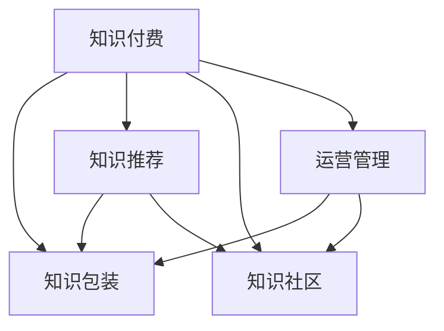

                 

# 知识经济时代下的知识付费创新产品包装设计

在知识经济时代，信息爆炸与知识碎片化并存，个人与企业面临知识管理的巨大挑战。如何高效地包装、整合与传播知识，不仅关乎信息时代的学习效率，更直接影响知识付费业务的发展潜力和竞争力。本文将深入探讨知识付费产品的包装设计，从核心概念、核心算法原理与操作步骤、数学模型与公式推导、项目实践、实际应用场景、工具和资源推荐、总结与展望等多个角度，全面系统地介绍知识付费产品的包装设计及其创新应用，为相关从业者提供有价值的参考。

## 1. 背景介绍

### 1.1 问题由来

随着移动互联网的普及和数字技术的迅猛发展，信息获取的门槛显著降低，个人和企业对知识的需求日益增长。传统的一对一知识传授模式已无法满足现代社会对知识高效传播和个性化学习的需求。知识付费作为一种新兴的商业形态，通过有偿的方式提供高质量知识内容，旨在帮助用户快速获取有价值的知识，从而在激烈的市场竞争中占据优势。

然而，知识付费市场面临着内容同质化严重、用户黏性不足、价格敏感度高等问题。要解决这些问题，提高知识付费产品的影响力和竞争力，关键在于对产品进行精心的设计和包装，使其具备独特的价值主张和差异化特点。

### 1.2 问题核心关键点

知识付费产品的包装设计涉及内容呈现、互动体验、个性化推荐、用户管理等多个环节。其核心关键点包括：

- **内容精选与整合**：挑选优质内容，进行有效整合，形成系统的知识体系。
- **用户个性化推荐**：利用推荐算法，精准推送用户感兴趣的内容，提升用户粘性。
- **互动式学习体验**：通过互动形式，增强用户学习体验，提高知识吸收效率。
- **社区化知识共享**：建立用户社区，鼓励知识交流与共享，增强用户归属感。
- **高效的运营管理**：通过数据驱动的管理策略，优化运营流程，提高平台效益。

### 1.3 问题研究意义

通过有效的知识包装设计，知识付费产品不仅能更好地满足用户的学习需求，还能显著提升平台的市场竞争力和用户满意度。其研究意义主要体现在：

- **提升内容价值**：通过专业化的包装，将碎片化知识整合成系统化的学习路径，提升知识内容的实用性和吸引力。
- **增强用户体验**：通过个性化的推荐和互动设计，提升用户的学习兴趣和参与度，增加用户粘性。
- **优化运营效率**：通过数据驱动的管理策略，优化知识付费产品的运营流程，提高平台效益。
- **探索创新模式**：探索新的知识付费模式，如订阅+课程定制、课程社区化等，推动行业创新发展。

## 2. 核心概念与联系

### 2.1 核心概念概述

为更好地理解知识付费产品的包装设计，本节将介绍几个密切相关的核心概念：

- **知识付费**：通过有偿方式向用户提供知识内容的商业模式，旨在提升用户的学习效率和效果。
- **知识包装**：将零散的、非结构化的知识内容，通过专业化的方式进行整合、呈现和传播的过程。
- **知识推荐**：利用推荐算法，根据用户兴趣和行为，精准推送相关知识内容。
- **知识社区**：基于知识共享和交流的社区化平台，鼓励用户积极参与知识生产与交流。
- **运营管理**：通过数据驱动的策略，优化平台运营流程，提升平台效益和用户满意度。

这些核心概念之间的逻辑关系可以通过以下Mermaid流程图来展示：



这个流程图展示了一系列核心概念及其之间的关系：

1. 知识付费是知识包装的驱动源，知识包装提升知识付费产品的内容价值。
2. 知识推荐是知识包装的重要组成部分，通过精准推送提升用户学习效率。
3. 知识社区是知识包装的重要输出形式，通过社区化传播增强知识影响力。
4. 运营管理是知识包装的保障措施，通过数据驱动优化运营效率。

## 3. 核心算法原理 & 具体操作步骤

### 3.1 算法原理概述

知识付费产品的包装设计，本质上是一个知识内容的整合与推荐过程。其核心思想是：通过专业化的内容包装，将零散的知识点整合成系统化的知识体系，再通过推荐算法精准推送给用户。

形式化地，假设知识付费平台收集到 $K$ 个知识点 $\{k_i\}_{i=1}^K$，每个知识点包含若干条具体信息 $\{I_{ik}\}_{k=1}^{K_i}$。知识包装的目标是将其整理为系统化的知识体系 $\{B_i\}_{i=1}^N$，其中 $N$ 为体系总数。通过知识推荐算法 $\mathcal{A}$，将知识体系推送给用户 $\{U_j\}_{j=1}^M$，其中 $M$ 为用户数。知识推荐过程应满足以下优化目标：

$$
\mathop{\arg\min}_{\mathcal{A}} \sum_{i=1}^N \sum_{j=1}^M \mathcal{L}(U_j,B_i,\mathcal{A})
$$

其中 $\mathcal{L}$ 为损失函数，用于衡量推荐结果与用户实际行为之间的差异。常见的损失函数包括交叉熵损失、均方误差损失等。

### 3.2 算法步骤详解

知识付费产品包装设计的具体步骤如下：

**Step 1: 数据收集与预处理**

- 收集各领域专家、教材、学术论文等知识来源，提取并整理知识点。
- 对知识点进行去重、清洗、标注等预处理，确保数据质量和完整性。
- 利用数据增强技术，丰富知识点的语义和结构，提高内容的丰富度。

**Step 2: 内容整合与体系构建**

- 设计知识体系框架，确定体系结构与知识点之间的关系。
- 根据知识点的关联性和层次性，构建系统化的知识体系。
- 利用知识图谱、思维导图等工具，直观展示知识体系结构。

**Step 3: 推荐算法设计**

- 选择合适的推荐算法模型，如协同过滤、基于内容的推荐、深度学习等。
- 设计推荐算法的输入与输出，包括用户兴趣模型和知识内容特征向量。
- 训练推荐算法，通过用户行为数据调整模型参数，提升推荐效果。

**Step 4: 用户个性化推荐**

- 根据用户行为数据（如浏览记录、点赞、评论等）构建用户兴趣模型。
- 将用户兴趣模型与知识内容特征向量进行匹配，生成推荐结果。
- 动态调整推荐算法参数，优化推荐结果，提高用户满意度。

**Step 5: 社区化知识共享**

- 设计社区化平台，提供用户交流与知识共享的功能。
- 鼓励用户生成内容，并给予适当的激励机制。
- 通过社区互动，丰富知识内容，增强用户黏性。

**Step 6: 运营管理优化**

- 建立数据驱动的管理策略，监控平台运营各项指标。
- 利用A/B测试等方法，优化推荐算法与内容呈现方式。
- 通过用户反馈，不断迭代和优化知识包装与推荐流程。

### 3.3 算法优缺点

知识付费产品的包装设计方法具有以下优点：

1. **提升知识内容价值**：通过系统化的整合和推荐，将零散的知识点整合成有价值的知识体系。
2. **增强用户体验**：通过个性化的推荐和互动设计，提升用户的学习兴趣和参与度。
3. **优化运营效率**：通过数据驱动的管理策略，优化运营流程，提高平台效益。
4. **探索创新模式**：通过社区化知识共享和用户生成内容，探索新的知识付费模式。

同时，该方法也存在一定的局限性：

1. **数据质量依赖**：知识包装的准确性和系统性高度依赖于数据来源的质量和完整性。
2. **推荐算法复杂**：选择和设计合适的推荐算法，需要具备较强的算法和数据处理能力。
3. **用户行为数据隐私**：收集用户行为数据可能涉及隐私问题，需要严格的数据保护和隐私管理。
4. **知识传播路径单一**：推荐算法设计不当可能导致知识传播路径单一，无法全面覆盖用户需求。

尽管存在这些局限性，但就目前而言，知识包装设计方法仍是最主流的方式。未来相关研究的重点在于如何进一步优化推荐算法、增强数据隐私保护、提高知识内容的泛化能力等。

### 3.4 算法应用领域

知识付费产品的包装设计已经在教育培训、在线课程、科技资讯等多个领域得到了广泛应用，取得了显著的效果。例如：

- **在线教育**：将专家讲座、教材、学术论文等知识源，通过系统化的整合与推荐，形成在线课程体系。如Coursera、Udemy等平台，提供多样化、高质量的课程内容，满足用户个性化学习需求。
- **科技资讯**：通过推荐算法，将最新科技文章、视频、播客等内容精准推送给科技爱好者。如36kr、cnBeta等平台，提供行业动态、技术分享等内容，满足用户快速获取信息的需求。
- **企业培训**：通过系统化的知识包装与推荐，为员工提供定制化的培训课程，提高专业技能和工作效率。如Alfred、LinkedIn Learning等平台，提供企业内部培训课程，满足不同岗位员工的学习需求。
- **健康管理**：通过知识社区和个性化推荐，提供健康咨询、营养建议、运动指导等内容，帮助用户实现科学健康管理。如丁香医生、健康之路等平台，提供健康科普、医生问答等内容，提升用户健康水平。

除了上述这些经典应用外，知识付费产品的包装设计也被创新性地应用到更多场景中，如个性化阅读、智能问答、内容订阅等，为知识传播提供了新的思路和方法。

## 4. 数学模型和公式 & 详细讲解

### 4.1 数学模型构建

本节将使用数学语言对知识付费产品包装设计过程进行更加严格的刻画。

假设知识付费平台收集到 $K$ 个知识点 $\{k_i\}_{i=1}^K$，每个知识点包含若干条具体信息 $\{I_{ik}\}_{k=1}^{K_i}$。知识包装的目标是将其整理为系统化的知识体系 $\{B_i\}_{i=1}^N$，其中 $N$ 为体系总数。通过知识推荐算法 $\mathcal{A}$，将知识体系推送给用户 $\{U_j\}_{j=1}^M$，其中 $M$ 为用户数。知识推荐过程应满足以下优化目标：

$$
\mathop{\arg\min}_{\mathcal{A}} \sum_{i=1}^N \sum_{j=1}^M \mathcal{L}(U_j,B_i,\mathcal{A})
$$

其中 $\mathcal{L}$ 为损失函数，用于衡量推荐结果与用户实际行为之间的差异。

### 4.2 公式推导过程

以下我们以协同过滤推荐算法为例，推导其推荐公式及其优化过程。

假设用户 $U_j$ 对知识体系 $B_i$ 的评分 $r_{ij}$ 为二元变量，表示用户是否对该知识体系感兴趣。推荐算法的目标是最小化用户和知识体系的评分误差，即：

$$
\mathop{\arg\min}_{\mathcal{A}} \sum_{i=1}^N \sum_{j=1}^M (r_{ij}-\mathcal{A}(U_j,B_i))^2
$$

令 $\hat{r}_{ij}=\mathcal{A}(U_j,B_i)$，则上述问题转化为最小化预测误差问题：

$$
\mathop{\arg\min}_{\mathcal{A}} \sum_{i=1}^N \sum_{j=1}^M (r_{ij}-\hat{r}_{ij})^2
$$

常用的协同过滤算法包括基于用户的协同过滤和基于项目的协同过滤。基于用户的协同过滤方法，假设知识体系 $B_i$ 与用户 $U_j$ 的评分误差服从高斯分布：

$$
\mathcal{L}(U_j,B_i,\mathcal{A})=\frac{1}{2\sigma^2}\sum_{j=1}^M (r_{ij}-\mathcal{A}(U_j,B_i))^2
$$

其中 $\sigma^2$ 为噪声方差，用于平衡预测精度和泛化能力。

### 4.3 案例分析与讲解

我们以在线教育平台为例，分析知识推荐算法的应用。假设平台收集到历史评分数据 $\{(r_{ij},B_i)\}_{i=1}^{N_{\text{train}}},\{r_{ij}\}_{i=1}^{N_{\text{test}}}$，其中 $N_{\text{train}}$ 为训练集大小，$N_{\text{test}}$ 为测试集大小。推荐算法的训练过程如下：

1. **特征工程**：将用户和知识体系的评分数据转换为特征向量 $\{f_j\}_{j=1}^{M_{\text{train}}},\{f_i\}_{i=1}^{N_{\text{train}}}$。
2. **模型训练**：利用训练集数据 $\{(f_j,f_i)\}_{j=1}^{M_{\text{train}}},\{f_i\}_{i=1}^{N_{\text{train}}}$ 训练推荐模型 $\mathcal{A}$，得到参数 $\theta$。
3. **预测与评估**：利用测试集数据 $\{r_{ij}\}_{j=1}^{M_{\text{test}}},\{f_i\}_{i=1}^{N_{\text{test}}}$ 对模型 $\mathcal{A}$ 进行预测，评估其推荐效果。

通过以上步骤，知识付费平台可以实现精准的知识推荐，满足用户的个性化学习需求。

## 5. 项目实践：代码实例和详细解释说明

### 5.1 开发环境搭建

在进行知识付费产品包装设计的实践前，我们需要准备好开发环境。以下是使用Python进行TensorFlow开发的环境配置流程：

1. 安装Anaconda：从官网下载并安装Anaconda，用于创建独立的Python环境。

2. 创建并激活虚拟环境：
```bash
conda create -n tf-env python=3.8 
conda activate tf-env
```

3. 安装TensorFlow：根据CUDA版本，从官网获取对应的安装命令。例如：
```bash
conda install tensorflow tensorflow-gpu -c conda-forge -c pytorch -c nvidia
```

4. 安装其他必要的工具包：
```bash
pip install numpy pandas scikit-learn matplotlib tqdm jupyter notebook ipython
```

完成上述步骤后，即可在`tf-env`环境中开始项目实践。

### 5.2 源代码详细实现

这里我们以基于协同过滤的知识推荐系统为例，给出使用TensorFlow实现的知识推荐代码。

首先，定义数据处理函数：

```python
import tensorflow as tf
import numpy as np

def load_data(path):
    with open(path, 'r') as f:
        data = [line.strip().split('\t') for line in f.readlines()]
    ratings = np.array([(int(user), int(item), float(score)) for user, item, score in data])
    items = set(item for user, item, _ in data)
    return ratings, items
```

然后，定义协同过滤模型的实现：

```python
class协同过滤模型(tf.keras.Model):
    def __init__(self, embedding_dim=128):
        super(协同过滤模型, self).__init__()
        self.user_embedding = tf.keras.layers.Embedding(input_dim=len(items), output_dim=embedding_dim)
        self.item_embedding = tf.keras.layers.Embedding(input_dim=len(items), output_dim=embedding_dim)
        self.dot_product = tf.keras.layers.Dot(axes=(1, 1), normalize=True)

    def call(self, inputs):
        user, item = inputs
        user_embed = self.user_embedding(user)
        item_embed = self.item_embedding(item)
        dot_product = self.dot_product([user_embed, item_embed])
        return dot_product
```

接着，定义模型训练函数：

```python
def train_model(model, ratings, epochs):
    user, item, rating = tf.unstack(ratings)
    model.compile(optimizer=tf.keras.optimizers.Adam(learning_rate=0.01), loss='mean_squared_error')
    model.fit([user, item], rating, epochs=epochs, batch_size=32, validation_split=0.2)
```

最后，启动训练流程：

```python
rates, items = load_data('ratings.txt')
model = 协同过滤模型()
train_model(model, rates, epochs=10)
```

以上代码实现了一个简单的协同过滤推荐模型，通过TensorFlow的Keras API，可以方便地进行模型的定义、训练和评估。

### 5.3 代码解读与分析

让我们再详细解读一下关键代码的实现细节：

**load_data函数**：
- 从指定路径加载评分数据，将每行数据按制表符分割为用户、物品和评分，并转换为NumPy数组。
- 使用集合去重，得到所有物品的列表。

**协同过滤模型类**：
- 定义用户和物品的嵌入层，维度为128。
- 定义点积层，计算用户和物品嵌入的点积。
- 使用Keras的call方法定义模型前向传播过程。

**train_model函数**：
- 使用Keras的compile方法定义损失函数和优化器。
- 使用fit方法进行模型训练，指定训练轮数、批大小和验证集比例。

通过以上代码，可以搭建一个基本的协同过滤推荐系统。TensorFlow的Keras API使得模型定义和训练变得简单易行，大大降低了知识付费产品包装设计的开发门槛。

当然，实际应用中还需要考虑更多因素，如模型的评估、推荐结果的排序、用户行为数据的存储等。但核心的知识推荐范式基本与此类似。

## 6. 实际应用场景

### 6.1 智能学习系统

基于知识推荐系统的智能学习系统，可以为用户提供个性化定制的学习内容。通过分析用户的学习历史、偏好和行为数据，系统能够推荐适合用户的学习路径和知识点，大大提升学习效率和效果。

在技术实现上，可以收集用户的学习记录、测试成绩、反馈等数据，构建用户兴趣模型。利用知识推荐系统，根据用户的学习进度和兴趣，动态推送适合的学习资源。如Khan Academy等平台，通过个性化推荐系统，提升用户的学习体验和成果。

### 6.2 在线内容平台

在线内容平台如Netflix、Spotify等，通过知识推荐算法为用户推荐电影、电视剧、歌曲等内容。通过分析用户的历史行为数据，系统能够预测用户偏好，推荐相关内容，提升用户满意度和平台粘性。

在技术实现上，可以收集用户的行为数据（如观影记录、点赞、评论等），构建用户兴趣模型。利用知识推荐系统，根据用户偏好推荐电影、电视剧、歌曲等内容。如Netflix的推荐算法，通过协同过滤、基于内容的推荐、深度学习等多种方法，提升推荐效果。

### 6.3 企业培训系统

企业培训系统如LinkedIn Learning，通过知识推荐系统为员工提供个性化的培训课程。通过分析员工的学习记录、职位和业务需求，系统能够推荐适合的培训课程，提升员工的专业技能和工作效率。

在技术实现上，可以收集员工的学习记录、职位、业务需求等数据，构建员工兴趣模型。利用知识推荐系统，根据员工的需求推荐适合的培训课程。如LinkedIn Learning的推荐算法，通过协同过滤、基于内容的推荐、深度学习等多种方法，提升推荐效果。

### 6.4 未来应用展望

随着知识推荐算法的不断发展，基于知识推荐系统的应用将更加广泛。未来，知识推荐系统将在更多领域得到应用，如健康管理、金融理财、游戏推荐等，为各行各业带来变革性影响。

在智慧医疗领域，基于知识推荐系统的医疗推荐系统，可以根据患者的病历和健康数据，推荐合适的治疗方案和健康建议，提升医疗服务的精准性和个性化。在金融理财领域，基于知识推荐系统的投资推荐系统，可以根据用户的风险偏好和投资历史，推荐适合的金融产品，提升用户的投资收益。在游戏推荐领域，基于知识推荐系统的游戏推荐系统，可以根据用户的喜好和行为数据，推荐适合的游戏和游戏内容，提升用户的娱乐体验。

## 7. 工具和资源推荐

### 7.1 学习资源推荐

为了帮助开发者系统掌握知识推荐系统的理论基础和实践技巧，这里推荐一些优质的学习资源：

1. 《推荐系统》书籍：Richard Zhang、Tianshu Sun等人著，系统介绍推荐系统的基本原理和算法，适合入门学习。

2. CS408《机器学习》课程：斯坦福大学开设的机器学习课程，涵盖推荐系统等重要主题，提供Lecture视频和配套作业，适合进阶学习。

3. 《深度学习与推荐系统》书籍：Kuansai Li、Feng Yan等人著，全面介绍深度学习在推荐系统中的应用，适合高级学习。

4. Weights & Biases：推荐系统的实验跟踪工具，可以记录和可视化模型训练过程中的各项指标，方便对比和调优。

5. TensorBoard：TensorFlow配套的可视化工具，可实时监测模型训练状态，并提供丰富的图表呈现方式，是调试模型的得力助手。

通过对这些资源的学习实践，相信你一定能够快速掌握知识推荐系统的精髓，并用于解决实际的应用问题。

### 7.2 开发工具推荐

高效的开发离不开优秀的工具支持。以下是几款用于知识推荐系统开发的常用工具：

1. TensorFlow：基于Python的开源深度学习框架，灵活动态的计算图，适合快速迭代研究。Google是推荐系统的领导者，大量推荐系统都基于TensorFlow实现。

2. PyTorch：基于Python的开源深度学习框架，灵活易用，适合快速开发和实验。Facebook的推荐系统也有部分采用PyTorch实现。

3. Scikit-learn：Python的机器学习库，提供丰富的算法和工具，适合做初步分析和调参。

4. Apache Spark：分布式计算框架，适合处理大规模数据和模型训练。

5. Hadoop：分布式存储和计算平台，适合海量数据的存储和处理。

合理利用这些工具，可以显著提升知识推荐系统的开发效率，加快创新迭代的步伐。

### 7.3 相关论文推荐

知识推荐系统的发展源于学界的持续研究。以下是几篇奠基性的相关论文，推荐阅读：

1. Recommender Systems in E-Commerce: A Systematic Review and Tutorial （Survey）：David Chen等人著，系统回顾了推荐系统的发展历程和最新进展，适合入门学习。

2. A Factorization Approach to Learning Latent Variable Models：Carl C. Zisserman、Stuart M. Russell等人著，提出基于矩阵分解的推荐算法，奠定了协同过滤算法的基础。

3. Deep Collaborative Filtering for Recommendation （Paper）：Fu et al. 提出深度学习在推荐系统中的应用，通过多层次神经网络提升推荐效果。

4. Topic Models for Recommenders （Paper）：Blei et al. 提出基于主题模型的推荐算法，通过主题模型挖掘用户和物品的隐含语义。

5. The Matrix Factorization Approach to Recommender Systems （Book）：Jason Weston、Ronan Collobert等人著，全面介绍矩阵分解在推荐系统中的应用，适合高级学习。

这些论文代表的知识推荐系统的发展脉络。通过学习这些前沿成果，可以帮助研究者把握学科前进方向，激发更多的创新灵感。

## 8. 总结：未来发展趋势与挑战

### 8.1 总结

本文对知识付费产品包装设计的核心概念、核心算法原理与操作步骤、数学模型与公式推导、项目实践、实际应用场景、工具和资源推荐、总结与展望等多个方面进行了全面系统的介绍。通过本文的系统梳理，可以看到，知识推荐系统作为知识付费产品的重要组成部分，不仅提升了知识内容的价值，还增强了用户体验和平台效益。通过精心设计的知识推荐算法，知识付费平台能够精准推送知识内容，满足用户的个性化学习需求。

通过本文的学习实践，相信你一定能够快速掌握知识推荐系统的精髓，并用于解决实际的推荐问题。

### 8.2 未来发展趋势

展望未来，知识推荐系统将呈现以下几个发展趋势：

1. **个性化推荐算法优化**：通过引入深度学习、强化学习等先进算法，提升推荐系统的精度和鲁棒性。
2. **多模态信息融合**：将文本、图像、视频等多种模态信息融合，构建更全面、准确的知识推荐体系。
3. **跨领域知识迁移**：将知识推荐系统应用于多个领域，如医疗、金融、教育等，提升各个领域的推荐效果。
4. **用户行为数据分析**：利用大数据分析技术，深入挖掘用户行为数据，提升推荐系统的个性化和精准性。
5. **社区化知识共享**：通过社区化平台，鼓励用户生成内容，增强知识推荐系统的多样性和活力。
6. **实时推荐系统**：利用实时数据流处理技术，构建实时推荐系统，提升推荐效果和用户体验。

这些趋势凸显了知识推荐系统的发展潜力和应用前景。未来的研究需要在算法、数据、平台等多个维度进行全面优化，以更好地满足用户的个性化需求。

### 8.3 面临的挑战

尽管知识推荐系统已经取得了瞩目成就，但在迈向更加智能化、普适化应用的过程中，它仍面临着诸多挑战：

1. **数据质量问题**：推荐系统的精度和效果高度依赖于数据质量，数据不完整、不准确可能导致严重的推荐偏差。如何构建高质量的数据集，是大规模知识推荐系统需要解决的首要问题。
2. **算法复杂性**：先进的推荐算法如深度学习、强化学习等，需要强大的计算资源和算法能力，如何简化算法模型，提高推荐效率，是未来需要重点突破的方向。
3. **用户隐私保护**：知识推荐系统需要收集和分析用户行为数据，涉及用户隐私问题。如何在数据收集和使用过程中保护用户隐私，是大规模知识推荐系统需要严格遵守的法律和道德规范。
4. **推荐结果泛化性**：推荐系统需要在不同场景下保持稳定的推荐效果，如何提高推荐结果的泛化性和鲁棒性，是未来需要重点研究的课题。
5. **冷启动问题**：新用户或新物品没有历史数据，推荐系统无法准确推荐。如何处理冷启动问题，提高系统的初始推荐效果，是未来需要重点解决的问题。
6. **推荐结果多样性**：推荐系统需要提供多样化的推荐结果，避免推荐路径单一，无法全面覆盖用户需求。如何提高推荐结果的多样性和覆盖率，是未来需要重点研究的课题。

这些挑战凸显了知识推荐系统在应用和推广过程中的复杂性和多样性，需要各界共同努力，不断探索和创新。

### 8.4 研究展望

面向未来，知识推荐系统需要在以下几个方面进行深入研究：

1. **个性化推荐算法优化**：通过引入深度学习、强化学习等先进算法，提升推荐系统的精度和鲁棒性。
2. **多模态信息融合**：将文本、图像、视频等多种模态信息融合，构建更全面、准确的知识推荐体系。
3. **跨领域知识迁移**：将知识推荐系统应用于多个领域，如医疗、金融、教育等，提升各个领域的推荐效果。
4. **用户行为数据分析**：利用大数据分析技术，深入挖掘用户行为数据，提升推荐系统的个性化和精准性。
5. **社区化知识共享**：通过社区化平台，鼓励用户生成内容，增强知识推荐系统的多样性和活力。
6. **实时推荐系统**：利用实时数据流处理技术，构建实时推荐系统，提升推荐效果和用户体验。

这些研究方向的探索，必将引领知识推荐系统迈向更高的台阶，为知识传播和信息获取带来革命性变革。只有勇于创新、敢于突破，才能不断拓展知识推荐系统的边界，让知识付费产品更好地服务于社会。

## 9. 附录：常见问题与解答

**Q1：知识推荐系统如何处理冷启动问题？**

A: 冷启动问题是指新用户或新物品没有历史数据，推荐系统无法准确推荐。解决冷启动问题的常见方法包括：

1. **利用上下文信息**：通过分析上下文信息（如时间、地点、设备等），预测用户或物品的初始状态，进行推荐。
2. **引入专家知识**：利用领域专家的知识，进行初始推荐，建立物品的基线模型。
3. **多模态数据融合**：利用用户的多模态数据（如文本、图像、语音等），进行综合推荐。
4. **模型迁移学习**：利用相似领域的推荐模型，进行跨领域迁移，提升新用户的推荐效果。
5. **交互式推荐**：通过与用户的交互，逐步学习用户的偏好，进行推荐。

这些方法可以在不同场景下灵活应用，提升知识推荐系统的冷启动效果。

**Q2：知识推荐系统如何保护用户隐私？**

A: 知识推荐系统在收集和分析用户行为数据时，涉及用户隐私保护问题。常见的隐私保护措施包括：

1. **数据匿名化**：通过数据匿名化技术，去除用户标识信息，保护用户隐私。
2. **差分隐私**：通过差分隐私技术，在保证推荐效果的同时，保护用户隐私。
3. **联邦学习**：通过联邦学习技术，在用户本地进行数据处理，保护用户隐私。
4. **用户控制**：通过用户控制机制，允许用户自行决定是否分享数据，保护用户隐私。

这些措施可以结合使用，提升知识推荐系统的隐私保护水平。

**Q3：知识推荐系统的推荐结果如何实现多样化？**

A: 推荐系统需要在不同场景下提供多样化的推荐结果，避免推荐路径单一，无法全面覆盖用户需求。实现推荐结果多样化的常见方法包括：

1. **引入多种推荐算法**：通过结合多种推荐算法（如协同过滤、基于内容的推荐、深度学习等），提供多角度的推荐结果。
2. **优化推荐参数**：通过调整推荐算法的参数，控制推荐结果的多样性和覆盖率。
3. **引入随机因素**：在推荐过程中引入随机因素，增加推荐结果的随机性和多样性。
4. **用户反馈调整**：根据用户的反馈，动态调整推荐算法和推荐结果，增加推荐结果的多样性。

这些方法可以在不同场景下灵活应用，提升知识推荐系统的推荐效果和用户体验。

**Q4：知识推荐系统如何提高推荐结果的泛化性？**

A: 知识推荐系统需要在不同场景下保持稳定的推荐效果，如何提高推荐结果的泛化性和鲁棒性，是未来需要重点研究的课题。提高推荐结果泛化性的常见方法包括：

1. **多模态数据融合**：利用用户的多模态数据（如文本、图像、语音等），进行综合推荐，提高推荐结果的泛化性。
2. **引入领域知识**：利用领域专家的知识，进行初始推荐，提高推荐结果的泛化性。
3. **迁移学习**：利用相似领域的推荐模型，进行跨领域迁移，提升推荐结果的泛化性。
4. **对抗训练**：通过引入对抗样本，提高模型的鲁棒性和泛化性。
5. **模型集成**：通过集成多个推荐模型，提高推荐结果的泛化性和鲁棒性。

这些方法可以在不同场景下灵活应用，提升知识推荐系统的泛化性和鲁棒性。

**Q5：知识推荐系统的推荐结果如何实现实时性？**

A: 利用实时数据流处理技术，构建实时推荐系统，提升推荐效果和用户体验。实现实时推荐系统的常见方法包括：

1. **流式数据处理**：利用流式数据处理技术，实时处理用户行为数据，进行推荐。
2. **在线学习**：通过在线学习技术，实时更新模型参数，提高推荐效果。
3. **分布式计算**：利用分布式计算技术，实现大规模数据的高效处理。
4. **实时数据流分析**：通过实时数据流分析技术，进行实时推荐。

这些方法可以在不同场景下灵活应用，提升知识推荐系统的实时性和用户体验。

---

作者：禅与计算机程序设计艺术 / Zen and the Art of Computer Programming

