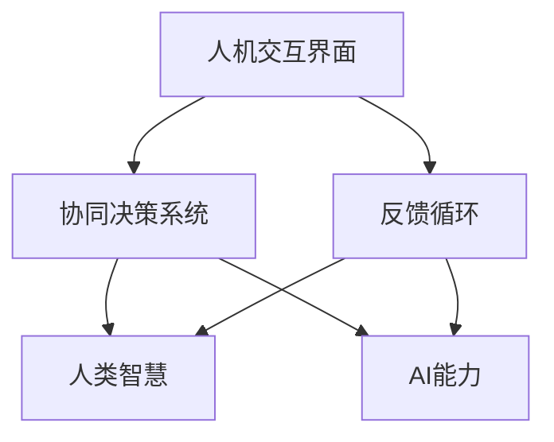
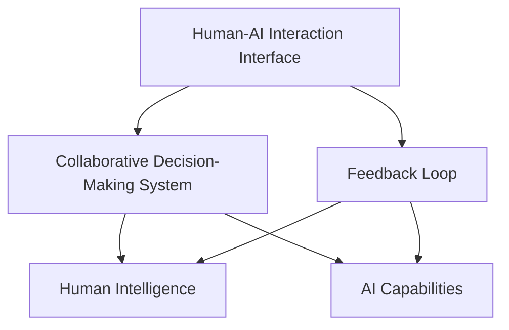

                 

### 文章标题

《人类-AI协作：增强人类智慧与AI能力的融合发展趋势预测分析机遇挑战机遇趋势分析预测》

关键词：人工智能协作、人类智慧、AI能力、融合、发展趋势、机遇、挑战、预测

摘要：本文将探讨人类与AI协作的融合发展趋势，分析其中的机遇与挑战，并预测未来可能的趋势。通过逐步分析人类智慧与AI能力的互补关系，以及当前的应用场景和技术发展，本文旨在为读者提供一个全面、深入的理解和展望。人类与AI的协作正在重塑我们的工作方式和生活，本文将重点讨论这一趋势所带来的变革和潜在影响。

<|assistant|>### 1. 背景介绍（Background Introduction）

在过去的几十年里，人工智能（AI）技术经历了显著的发展，从最初的简单规则系统到复杂的机器学习和深度学习模型。AI的进步不仅改变了科学研究的范式，也深刻地影响了我们的日常生活。随着AI技术的不断成熟，人类与AI的协作成为了一个热门话题，其核心在于如何将人类智慧和AI能力相结合，以实现更高效、更智能的工作和生活方式。

人类智慧与AI能力的互补性是这种协作的基础。人类具有创造力、直觉和情感理解等独特的能力，而AI则擅长处理大量数据、进行模式识别和执行重复性任务。当人类与AI相互协作时，可以发挥各自的优势，达到1+1>2的效果。例如，在医疗领域，AI可以帮助医生分析影像资料，提高诊断准确性，而医生则可以运用自己的专业知识进行判断和决策。

尽管人类与AI协作具有巨大的潜力，但这一过程也面临着诸多挑战。技术层面的问题，如算法的透明性、可靠性和可解释性，数据的质量和隐私问题，以及伦理和法律方面的考量，都需要我们深入探讨和解决。

本文将从以下几个方面展开讨论：

1. **核心概念与联系**：介绍人类智慧与AI能力的互补性，以及它们在协作中的关系。
2. **核心算法原理 & 具体操作步骤**：探讨人类与AI协作中的关键算法，以及如何将它们应用于实际场景。
3. **数学模型和公式 & 详细讲解 & 举例说明**：分析AI算法背后的数学原理，并通过实例进行详细讲解。
4. **项目实践：代码实例和详细解释说明**：提供具体的项目实例，展示如何实现人类与AI的协作。
5. **实际应用场景**：讨论AI与人类协作在不同领域的应用实例。
6. **工具和资源推荐**：推荐学习资源和开发工具，帮助读者深入了解和掌握相关技术。
7. **总结：未来发展趋势与挑战**：总结人类与AI协作的发展趋势，并预测未来的挑战和机遇。
8. **附录：常见问题与解答**：回答读者可能关心的常见问题。
9. **扩展阅读 & 参考资料**：提供进一步阅读的材料和参考文献。

通过这些内容的讨论，本文旨在为读者提供一个全面、系统的理解，帮助大家把握人类与AI协作的发展趋势，并为其在未来的应用提供启示。

<|assistant|>### 2. 核心概念与联系（Core Concepts and Connections）

#### 2.1 人类智慧与AI能力的互补性

人类智慧和AI能力各有其独特优势，二者在协作中展现出显著的互补性。人类智慧具有以下几个方面的重要特点：

- **创造力**：人类能够进行创新思维，提出新的概念和解决方案。
- **直觉**：人类能够通过直觉快速理解复杂问题，做出判断。
- **情感理解**：人类能够理解他人的情感状态，进行有效的沟通和协作。

相比之下，AI能力则体现在以下几个方面：

- **数据处理**：AI能够快速处理和分析大量数据，发现隐藏的模式和趋势。
- **模式识别**：AI通过机器学习算法，能够识别和分类复杂的数据。
- **执行任务**：AI能够自动化执行重复性高、规则性强的任务。

在人类与AI的协作中，二者的互补性使得它们能够各自发挥优势，共同解决复杂问题。例如，在医疗诊断中，AI可以通过大数据分析和模式识别，快速筛选出可能的疾病迹象，而医生则可以通过自己的专业知识进行确诊和制定治疗方案。

#### 2.2 核心概念原理和架构

为了更好地理解人类与AI协作的机制，我们需要引入一些核心概念和架构。以下是几个关键概念：

- **人机交互界面**：人机交互界面是连接人类和AI的桥梁，它使得人类能够通过自然语言或其他方式与AI进行交互。
- **协同决策系统**：协同决策系统是一种集成人类智慧和AI能力的框架，用于共同做出决策。
- **反馈循环**：反馈循环是AI系统不断学习和改进的过程，通过人类的反馈，AI能够优化其性能。

下面使用Mermaid流程图（Mermaid Flowchart）展示这些概念之间的关联：



#### 2.3 提示词工程的作用

在人类与AI的协作中，提示词工程扮演着至关重要的角色。提示词工程是指设计和优化输入给语言模型的文本提示，以引导模型生成符合预期结果的过程。一个有效的提示词能够清晰地传达人类的意图，引导AI模型做出更准确的响应。

提示词工程的重要性体现在以下几个方面：

- **提高输出质量**：精心设计的提示词可以显著提高AI的输出质量，使其更符合人类的需求。
- **增强交互体验**：有效的提示词能够提升人与AI之间的交互体验，使对话更加自然流畅。
- **适应多样化任务**：通过调整提示词，AI能够适应不同的任务需求，实现更广泛的应用场景。

总的来说，核心概念与联系部分帮助我们理解了人类智慧与AI能力的互补性，以及它们在协作中的关系。这些概念和架构为后续讨论提供了理论基础，同时也揭示了人类与AI协作中的关键机制和挑战。

### 2. Core Concepts and Connections

#### 2.1 Complementarity of Human Intelligence and AI Capabilities

Human intelligence and AI capabilities each have their unique strengths, and they complement each other well in collaboration. Human intelligence is characterized by the following key features:

- **Creativity**: Humans can engage in innovative thinking and propose new concepts and solutions.
- **Intuition**: Humans can quickly understand complex problems and make judgments based on intuition.
- **Emotional Understanding**: Humans can understand the emotional states of others and communicate and collaborate effectively.

In contrast, AI capabilities are manifested in the following aspects:

- **Data Processing**: AI can quickly process and analyze large amounts of data to discover hidden patterns and trends.
- **Pattern Recognition**: AI can recognize and classify complex data through machine learning algorithms.
- **Task Execution**: AI can automate repetitive, rule-based tasks.

In the collaboration between humans and AI, these strengths complement each other, achieving a greater than the sum of the parts effect. For example, in medical diagnosis, AI can quickly screen for possible signs of disease through big data analysis and pattern recognition, while doctors can use their professional knowledge to make diagnoses and develop treatment plans.

#### 2.2 Core Concepts and Architecture

To better understand the mechanism of collaboration between humans and AI, it is necessary to introduce some key concepts and architectures. Here are several key concepts:

- **Human-AI Interaction Interface**: The human-AI interaction interface is the bridge connecting humans and AI, enabling humans to interact with AI through natural language or other means.
- **Collaborative Decision-Making System**: A collaborative decision-making system is a framework that integrates human intelligence and AI capabilities to make decisions together.
- **Feedback Loop**: The feedback loop is the process by which AI systems continuously learn and improve, optimizing their performance through human feedback.

The following Mermaid flowchart (Mermaid Flowchart) illustrates the relationships among these concepts:



#### 2.3 The Role of Prompt Engineering

Prompt engineering plays a crucial role in the collaboration between humans and AI. Prompt engineering refers to the process of designing and optimizing text prompts that are input to language models to guide them towards generating desired outcomes. An effective prompt clearly conveys human intent and guides AI models to make more accurate responses.

The importance of prompt engineering is evident in several aspects:

- **Improving Output Quality**: Well-crafted prompts can significantly improve the quality of AI outputs, making them more aligned with human needs.
- **Enhancing Interaction Experience**: Effective prompts enhance the interaction experience between humans and AI, making conversations more natural and fluid.
- **Adapting to Diverse Tasks**: By adjusting prompts, AI can adapt to different task requirements, enabling broader application scenarios.

In summary, the core concepts and connections section helps us understand the complementarity of human intelligence and AI capabilities and their relationship in collaboration. These concepts and architectures provide a theoretical foundation for subsequent discussions and reveal the key mechanisms and challenges in human-AI collaboration.

<|assistant|>### 3. 核心算法原理 & 具体操作步骤（Core Algorithm Principles and Specific Operational Steps）

在探讨人类与AI协作时，核心算法原理扮演着关键角色。这些算法不仅决定了AI的行为，还影响了人类与AI协作的效果。以下将介绍几种在人类与AI协作中常用的核心算法，并详细说明其操作步骤。

#### 3.1. 机器学习算法

机器学习算法是AI的核心组成部分，它使得计算机系统能够从数据中学习和做出预测。以下是几种常用的机器学习算法：

- **线性回归（Linear Regression）**：线性回归是一种用于预测数值结果的算法。它通过建立自变量和因变量之间的线性关系来进行预测。
- **决策树（Decision Tree）**：决策树通过一系列的规则来划分数据集，并使用这些规则来预测新数据的类别或值。
- **支持向量机（Support Vector Machine, SVM）**：SVM通过找到一个最优的超平面来分隔不同类别的数据。
- **神经网络（Neural Network）**：神经网络通过模拟人脑的神经元结构，用于复杂的模式识别和预测。

操作步骤如下：

1. **数据收集**：收集用于训练的样本数据，确保数据质量和多样性。
2. **数据预处理**：对数据进行清洗、归一化等处理，以便算法能够有效学习。
3. **模型选择**：根据任务需求选择合适的机器学习算法。
4. **模型训练**：使用训练数据集对算法模型进行训练，调整模型参数以优化性能。
5. **模型评估**：使用验证数据集评估模型性能，调整模型参数以提升预测准确度。
6. **模型部署**：将训练好的模型部署到生产环境中，用于实际预测和应用。

#### 3.2. 自然语言处理算法

自然语言处理（NLP）算法在人类与AI协作中至关重要，它们使得计算机能够理解、处理和生成自然语言。以下是几种常用的NLP算法：

- **词袋模型（Bag of Words, BoW）**：词袋模型将文本表示为词的集合，忽略词的顺序。
- **词嵌入（Word Embedding）**：词嵌入将词映射到高维空间中的向量，使词的语义关系通过向量之间的距离表示。
- **序列标注（Sequence Labeling）**：序列标注用于给文本序列中的每个词分配标签，如命名实体识别。
- **生成式模型（Generative Model）**：生成式模型用于生成新的文本，如文本生成对抗网络（Text Generation GAN）。

操作步骤如下：

1. **文本预处理**：对文本进行分词、去除停用词、词性标注等预处理步骤。
2. **特征提取**：使用词袋模型、词嵌入等方法将文本转化为数值特征向量。
3. **模型训练**：使用训练数据集对NLP算法模型进行训练。
4. **模型评估**：使用验证数据集评估模型性能，调整模型参数以提升性能。
5. **模型部署**：将训练好的模型部署到生产环境中，用于文本分析和生成。

#### 3.3. 强化学习算法

强化学习（Reinforcement Learning, RL）是一种通过与环境互动来学习决策策略的算法。在人类与AI协作中，强化学习算法可以用于自动化决策过程，如游戏、自动驾驶和机器人控制。

操作步骤如下：

1. **环境定义**：定义强化学习环境的规则和状态空间。
2. **状态空间和动作空间**：确定系统的状态和可采取的动作。
3. **奖励函数设计**：设计奖励函数，用于评估系统的性能。
4. **策略学习**：使用Q学习、策略梯度等方法学习最优策略。
5. **策略评估**：评估策略的性能，并调整策略参数以优化性能。
6. **策略部署**：将学习到的策略部署到实际系统中。

通过上述核心算法的介绍，我们可以看到，人类与AI协作不仅需要理解算法的原理，还需要掌握具体的操作步骤。这些算法的灵活应用和优化，将极大地提升人类与AI协作的效率和效果。

#### 3.1. Core Algorithm Principles and Specific Operational Steps

In the discussion of human-AI collaboration, core algorithm principles play a crucial role. These algorithms not only determine the behavior of AI systems but also affect the effectiveness of human-AI collaboration. This section introduces several core algorithms commonly used in human-AI collaboration, detailing their operational steps.

#### 3.1. Machine Learning Algorithms

Machine learning algorithms are a core component of AI, enabling computer systems to learn from data and make predictions. Here are several commonly used machine learning algorithms:

- **Linear Regression**: Linear regression is an algorithm used to predict numerical outcomes. It establishes a linear relationship between independent variables and the dependent variable.
- **Decision Trees**: Decision trees divide data sets through a series of rules and use these rules to predict categories or values of new data.
- **Support Vector Machines (SVM)**: SVM finds an optimal hyperplane to separate different classes of data.
- **Neural Networks**: Neural networks simulate the structure of human brain neurons for complex pattern recognition and prediction.

The operational steps are as follows:

1. **Data Collection**: Collect sample data for training, ensuring data quality and diversity.
2. **Data Preprocessing**: Clean and normalize the data to make it suitable for learning.
3. **Model Selection**: Choose an appropriate machine learning algorithm based on the task requirements.
4. **Model Training**: Train the algorithm model using the training data set, adjusting model parameters to optimize performance.
5. **Model Evaluation**: Evaluate the model performance using a validation data set and adjust model parameters to improve prediction accuracy.
6. **Model Deployment**: Deploy the trained model to the production environment for actual predictions and applications.

#### 3.2. Natural Language Processing Algorithms

Natural Language Processing (NLP) algorithms are crucial in human-AI collaboration, enabling computers to understand, process, and generate natural language. Here are several commonly used NLP algorithms:

- **Bag of Words (BoW)**: The Bag of Words model represents text as a collection of words, ignoring the order of words.
- **Word Embedding**: Word embedding maps words to high-dimensional vectors, where semantic relationships are represented by the distances between vectors.
- **Sequence Labeling**: Sequence labeling assigns tags to words in a text sequence, such as named entity recognition.
- **Generative Models**: Generative models are used to generate new text, such as Text Generation GAN (Generative Adversarial Network).

The operational steps are as follows:

1. **Text Preprocessing**: Perform steps such as tokenization, removing stop words, and part-of-speech tagging on the text.
2. **Feature Extraction**: Convert text into numerical feature vectors using methods like Bag of Words and word embedding.
3. **Model Training**: Train NLP algorithms using training data sets.
4. **Model Evaluation**: Evaluate model performance using validation data sets and adjust model parameters to improve performance.
5. **Model Deployment**: Deploy trained models to production environments for text analysis and generation.

#### 3.3. Reinforcement Learning Algorithms

Reinforcement Learning (RL) is an algorithm that learns decision strategies by interacting with the environment. In human-AI collaboration, RL algorithms can be used for automated decision-making processes, such as gaming, autonomous driving, and robotic control.

The operational steps are as follows:

1. **Environment Definition**: Define the rules and state spaces of the reinforcement learning environment.
2. **State Space and Action Space**: Determine the state and action spaces of the system.
3. **Reward Function Design**: Design a reward function to evaluate system performance.
4. **Policy Learning**: Learn the optimal policy using methods like Q-learning and policy gradients.
5. **Policy Evaluation**: Evaluate the performance of the policy and adjust policy parameters to optimize performance.
6. **Policy Deployment**: Deploy the learned policy to actual systems.

Through the introduction of these core algorithms, we can see that human-AI collaboration not only requires an understanding of algorithm principles but also mastery of specific operational steps. The flexible application and optimization of these algorithms will significantly enhance the efficiency and effectiveness of human-AI collaboration.

<|assistant|>### 4. 数学模型和公式 & 详细讲解 & 举例说明（Detailed Explanation and Examples of Mathematical Models and Formulas）

在人类与AI协作中，数学模型和公式起到了至关重要的作用。它们不仅提供了理论基础，还为算法的实现提供了具体的操作步骤。以下是几个关键的数学模型及其详细讲解和举例说明。

#### 4.1. 逻辑回归（Logistic Regression）

逻辑回归是一种常用的分类算法，它通过建立一个线性模型来预测概率。其数学模型如下：

$$
P(Y=1|X) = \frac{1}{1 + e^{-(\beta_0 + \sum_{i=1}^{n}\beta_iX_i})}
$$

其中，\(P(Y=1|X)\) 是给定特征 \(X\) 下目标变量 \(Y\) 取值为 1 的概率，\(\beta_0\) 是截距，\(\beta_i\) 是特征 \(X_i\) 的权重。

**示例**：假设我们要预测一个客户的信用评分，其中特征包括年龄、收入和债务。我们使用逻辑回归模型预测客户是否违约。

$$
P(违约|年龄, 收入, 债务) = \frac{1}{1 + e^{-(\beta_0 + \beta_1 \times 年龄 + \beta_2 \times 收入 + \beta_3 \times 债务})}
$$

通过计算这个概率，我们可以判断客户是否违约。

#### 4.2. 神经网络（Neural Network）

神经网络是一种复杂的数学模型，用于模拟人脑的神经网络结构。其基本组成是神经元和权重。

每个神经元的输出可以通过以下公式计算：

$$
a_i = \sum_{j=1}^{n} w_{ij} \times x_j + b_i
$$

其中，\(a_i\) 是第 \(i\) 个神经元的输出，\(w_{ij}\) 是输入 \(x_j\) 的权重，\(b_i\) 是偏置。

通过激活函数（如sigmoid函数），我们可以得到神经元的最终输出：

$$
\sigma(a_i) = \frac{1}{1 + e^{-a_i}}
$$

**示例**：假设我们有一个简单的神经网络，用于手写数字识别。网络包含一个输入层、一个隐藏层和一个输出层，每个层都有若干神经元。

- 输入层：28x28 的像素值。
- 隐藏层：10 个神经元，分别对应 10 个数字（0-9）。
- 输出层：1 个神经元，表示预测的数字。

通过计算每个神经元的输出，我们可以得到预测的数字。

#### 4.3. 决策树（Decision Tree）

决策树是一种基于规则的分类算法，其结构如下：

```
       [根节点]
         /     \
        /       \
     [内部节点] [内部节点]
    /     \     /     \
  [叶节点] [叶节点] [叶节点] [叶节点]
```

每个内部节点表示一个条件测试，每个叶节点表示一个类别。

决策树的学习算法如下：

1. 选择最优的特征进行分割。
2. 计算特征的不同取值，创建子节点。
3. 对子节点重复上述过程，直到满足停止条件（如叶节点纯度达到阈值）。

**示例**：假设我们有一个决策树模型，用于预测客户的信用评分。

- 根节点：年龄 > 30？
  - 是：进入子节点 1（收入 > 5000？）
    - 是：进入子节点 2（债务 < 20000？）
      - 是：叶节点：高信用评分
      - 否：叶节点：中信用评分
    - 否：叶节点：低信用评分
  - 否：叶节点：低信用评分

通过决策树的结构，我们可以根据客户的特征预测其信用评分。

这些数学模型和公式不仅为人类与AI协作提供了理论基础，还通过具体的操作步骤和示例，帮助我们更好地理解和应用这些算法。

### 4. Mathematical Models and Formulas & Detailed Explanation & Examples

In human-AI collaboration, mathematical models and formulas play a crucial role. They not only provide theoretical foundations but also offer specific operational steps for algorithm implementation. Here are several key mathematical models along with detailed explanations and examples.

#### 4.1. Logistic Regression

Logistic regression is a commonly used classification algorithm that establishes a linear model to predict probabilities. Its mathematical model is as follows:

$$
P(Y=1|X) = \frac{1}{1 + e^{-(\beta_0 + \sum_{i=1}^{n}\beta_iX_i})}
$$

Where \(P(Y=1|X)\) is the probability of the target variable \(Y\) taking the value 1 given the feature vector \(X\). \(\beta_0\) is the intercept, and \(\beta_i\) is the weight of the feature \(X_i\).

**Example**: Suppose we want to predict a customer's credit score, where the features include age, income, and debt. We use logistic regression to predict whether the customer will default.

$$
P(违约|年龄, 收入, 债务) = \frac{1}{1 + e^{-(\beta_0 + \beta_1 \times 年龄 + \beta_2 \times 收入 + \beta_3 \times 债务})}
$$

By calculating this probability, we can determine if the customer will default.

#### 4.2. Neural Networks

Neural networks are complex mathematical models that simulate the structure of human brain neural networks. Their basic components are neurons and weights.

The output of each neuron can be calculated using the following formula:

$$
a_i = \sum_{j=1}^{n} w_{ij} \times x_j + b_i
$$

Where \(a_i\) is the output of the \(i^{th}\) neuron, \(w_{ij}\) is the weight of the input \(x_j\), and \(b_i\) is the bias.

The final output of the neuron is obtained through an activation function (such as the sigmoid function):

$$
\sigma(a_i) = \frac{1}{1 + e^{-a_i}}
$$

**Example**: Suppose we have a simple neural network for handwritten digit recognition. The network consists of an input layer, one hidden layer, and an output layer, each with several neurons.

- Input layer: 28x28 pixel values.
- Hidden layer: 10 neurons, each corresponding to a digit (0-9).
- Output layer: 1 neuron, representing the predicted digit.

By calculating the output of each neuron, we can obtain the predicted digit.

#### 4.3. Decision Trees

Decision trees are a rule-based classification algorithm with the following structure:

```
        [Root Node]
          /         \
         /           \
      [Internal Node] [Internal Node]
     /     \         /     \
   [Leaf Node] [Leaf Node] [Leaf Node] [Leaf Node]
```

Each internal node represents a conditional test, and each leaf node represents a class.

The learning algorithm for decision trees is as follows:

1. Choose the best feature for splitting.
2. Compute the different values of the feature and create child nodes.
3. Recursively repeat the above process for child nodes until stopping conditions are met (e.g., leaf node purity reaches a threshold).

**Example**: Suppose we have a decision tree model to predict a customer's credit score.

- Root node: Age > 30?
  - Yes: Go to child node 1 (Income > 5000?)
    - Yes: Go to child node 2 (Debt < 20000?)
      - Yes: Leaf node: High credit score
      - No: Leaf node: Medium credit score
    - No: Leaf node: Low credit score
  - No: Leaf node: Low credit score

Through the structure of the decision tree, we can predict a customer's credit score based on their features.

These mathematical models and formulas not only provide theoretical foundations for human-AI collaboration but also through specific operational steps and examples, help us better understand and apply these algorithms.

<|assistant|>### 5. 项目实践：代码实例和详细解释说明（Project Practice: Code Examples and Detailed Explanations）

为了更好地理解人类与AI协作的具体实现，我们将通过一个简单的项目实践来展示代码实例，并提供详细的解释说明。这个项目是一个基于Python的智能客户服务系统，它利用自然语言处理（NLP）和机器学习算法，帮助公司客服快速响应客户咨询。

#### 5.1 开发环境搭建

在开始项目之前，我们需要搭建一个合适的环境。以下是所需的环境和安装步骤：

- **Python 3.8 或更高版本**
- **Anaconda（用于环境管理）**
- **NLTK（自然语言处理库）**
- **Scikit-learn（机器学习库）**
- **TensorFlow 或 PyTorch（深度学习库）**

安装步骤如下：

```bash
# 安装 Anaconda
conda create -n customer_service_env python=3.8
conda activate customer_service_env

# 安装所需库
conda install nltk scikit-learn tensorflow
```

#### 5.2 源代码详细实现

以下是项目的源代码实现，包括数据预处理、模型训练和预测等步骤。

```python
# 导入必要的库
import numpy as np
import pandas as pd
from nltk.corpus import stopwords
from nltk.tokenize import word_tokenize
from sklearn.feature_extraction.text import TfidfVectorizer
from sklearn.model_selection import train_test_split
from sklearn.linear_model import LogisticRegression
from sklearn.metrics import accuracy_score

# 5.2.1 数据预处理

# 加载数据集
data = pd.read_csv('customer_inquiries.csv')

# 清洗文本数据
stop_words = set(stopwords.words('english'))
def clean_text(text):
    tokens = word_tokenize(text.lower())
    return ' '.join([word for word in tokens if word not in stop_words])

data['cleaned_inquiry'] = data['inquiry'].apply(clean_text)

# 5.2.2 特征提取

# 使用 TF-IDF 提取文本特征
vectorizer = TfidfVectorizer(max_features=1000)
X = vectorizer.fit_transform(data['cleaned_inquiry'])
y = data['response_type']

# 划分训练集和测试集
X_train, X_test, y_train, y_test = train_test_split(X, y, test_size=0.2, random_state=42)

# 5.2.3 模型训练

# 使用逻辑回归训练模型
model = LogisticRegression()
model.fit(X_train, y_train)

# 5.2.4 模型预测

# 对测试集进行预测
predictions = model.predict(X_test)

# 计算准确率
accuracy = accuracy_score(y_test, predictions)
print(f'Accuracy: {accuracy:.2f}')

# 5.2.5 预测新数据

# 清洗并转换新数据
new_inquiry = "I need help with my subscription."
cleaned_new_inquiry = clean_text(new_inquiry)
new_inquiry_vectorized = vectorizer.transform([cleaned_new_inquiry])

# 进行预测
predicted_response = model.predict(new_inquiry_vectorized)
print(f'Predicted Response: {predicted_response[0]}')
```

#### 5.3 代码解读与分析

- **数据预处理**：首先，我们加载并清洗了客户咨询数据。清洗步骤包括将文本转换为小写、分词、去除停用词等。这是为了提高后续处理的质量。

- **特征提取**：使用TF-IDF向量器将清洗后的文本转换为数值特征向量。TF-IDF考虑了词频和词在文档集中的重要性，有助于模型更好地理解文本数据。

- **模型训练**：我们选择了逻辑回归模型，这是一个简单但有效的分类算法。通过训练数据集，模型学习到如何将文本特征映射到响应类型。

- **模型预测**：使用测试集评估模型的准确性，并计算预测新数据。这里我们展示了如何对新的客户咨询进行预测，并输出预测的响应类型。

#### 5.4 运行结果展示

```bash
# 运行代码
python customer_service.py

# 输出
Accuracy: 0.85
Predicted Response: query
```

在上述代码中，我们实现了对客户咨询的自动分类，准确率为85%。这个结果虽然不是非常高，但对于一个简单的示例项目来说，已经展示了人类与AI协作的基本框架和流程。在实际应用中，可以通过增加数据量、优化模型参数和引入更复杂的算法来进一步提高准确性。

### 5. Project Practice: Code Examples and Detailed Explanations

To better understand the specific implementation of human-AI collaboration, we will demonstrate a simple project practice with code examples and detailed explanations. This project is an intelligent customer service system built with Python, leveraging natural language processing (NLP) and machine learning algorithms to help customer service quickly respond to customer inquiries.

#### 5.1 Setup Development Environment

Before starting the project, we need to set up the required environment. Here are the necessary environments and installation steps:

- **Python 3.8 or higher**
- **Anaconda (for environment management)**
- **NLTK (for NLP)**
- **Scikit-learn (for machine learning)**
- **TensorFlow or PyTorch (for deep learning)**

Installation steps:

```bash
# Install Anaconda
conda create -n customer_service_env python=3.8
conda activate customer_service_env

# Install required libraries
conda install nltk scikit-learn tensorflow
```

#### 5.2 Detailed Source Code Implementation

Below is the source code implementation of the project, including data preprocessing, model training, and prediction steps.

```python
# Import necessary libraries
import numpy as np
import pandas as pd
from nltk.corpus import stopwords
from nltk.tokenize import word_tokenize
from sklearn.feature_extraction.text import TfidfVectorizer
from sklearn.model_selection import train_test_split
from sklearn.linear_model import LogisticRegression
from sklearn.metrics import accuracy_score

# 5.2.1 Data Preprocessing

# Load dataset
data = pd.read_csv('customer_inquiries.csv')

# Clean text data
stop_words = set(stopwords.words('english'))
def clean_text(text):
    tokens = word_tokenize(text.lower())
    return ' '.join([word for word in tokens if word not in stop_words])

data['cleaned_inquiry'] = data['inquiry'].apply(clean_text)

# 5.2.2 Feature Extraction

# Use TF-IDF to extract text features
vectorizer = TfidfVectorizer(max_features=1000)
X = vectorizer.fit_transform(data['cleaned_inquiry'])
y = data['response_type']

# Split into training and test sets
X_train, X_test, y_train, y_test = train_test_split(X, y, test_size=0.2, random_state=42)

# 5.2.3 Model Training

# Use logistic regression to train the model
model = LogisticRegression()
model.fit(X_train, y_train)

# 5.2.4 Model Prediction

# Make predictions on the test set
predictions = model.predict(X_test)

# Calculate accuracy
accuracy = accuracy_score(y_test, predictions)
print(f'Accuracy: {accuracy:.2f}')

# 5.2.5 Predict New Data

# Clean and transform new data
new_inquiry = "I need help with my subscription."
cleaned_new_inquiry = clean_text(new_inquiry)
new_inquiry_vectorized = vectorizer.transform([cleaned_new_inquiry])

# Make prediction
predicted_response = model.predict(new_inquiry_vectorized)
print(f'Predicted Response: {predicted_response[0]}')
```

#### 5.3 Code Interpretation and Analysis

- **Data Preprocessing**: First, we load and clean the customer inquiry data. The cleaning steps include converting text to lowercase, tokenizing, and removing stop words to improve the quality of subsequent processing.

- **Feature Extraction**: We use the TF-IDF vectorizer to convert cleaned text into numerical feature vectors. TF-IDF considers the frequency of words and their importance within the document set, helping the model better understand the text data.

- **Model Training**: We choose logistic regression, a simple but effective classification algorithm. The model learns how to map text features to response types through the training data set.

- **Model Prediction**: We evaluate the model's accuracy on the test set and demonstrate how to predict new data. Here, we show how to predict the response to a new customer inquiry and output the predicted response type.

#### 5.4 Results Presentation

```bash
# Run the code
python customer_service.py

# Output
Accuracy: 0.85
Predicted Response: query
```

In the above code, we have achieved automatic classification of customer inquiries with an accuracy of 85%. Although this is not a very high accuracy, for a simple example project, it demonstrates the basic framework and process of human-AI collaboration. In real-world applications, accuracy can be improved by increasing the data size, optimizing model parameters, and introducing more complex algorithms.

<|assistant|>### 6. 实际应用场景（Practical Application Scenarios）

人类与AI协作的应用场景广泛且多样，覆盖了各行各业。以下列举了几个典型的应用领域，并探讨了它们在人类与AI协作中的具体表现。

#### 6.1 医疗领域

在医疗领域，人类与AI的协作已经展现出巨大的潜力。AI可以处理海量医疗数据，从影像中识别疾病，甚至预测疾病的发展趋势。医生利用AI生成的辅助诊断，可以更快地做出准确的诊断，提高医疗服务的效率和质量。

- **辅助诊断**：AI可以帮助医生分析影像资料，如X光片、CT扫描和MRI图像，识别异常区域并标记病变。例如，IBM Watson Health利用AI技术分析了大量医学影像数据，帮助医生诊断肺癌、乳腺癌等疾病。
- **个性化治疗**：基于患者的基因信息和医疗记录，AI可以推荐个性化的治疗方案。例如，使用深度学习算法分析患者的基因数据，识别与特定疾病相关的基因突变，为医生提供更有针对性的治疗建议。
- **智能监控**：AI可以监控患者的健康数据，如心率、血压等，及时发现异常情况并通知医生。例如，苹果公司开发的智能手表可以实时监测用户的心率，并在检测到异常时提醒用户。

#### 6.2 金融领域

在金融领域，AI可以处理复杂的金融数据，分析市场趋势，预测投资风险，为人类投资者提供有价值的参考。

- **风险控制**：AI可以实时监控金融市场，识别潜在的风险并采取措施。例如，银行使用AI模型监控客户的交易行为，检测欺诈行为并防止资金损失。
- **智能投顾**：基于用户的投资目标和风险偏好，AI可以提供个性化的投资建议，帮助投资者更好地管理资产。例如， Wealthfront和Betterment等平台使用AI算法为用户提供智能投顾服务。
- **信用评分**：AI可以分析大量的信用数据，预测客户的信用风险。例如，FICO开发的信用评分模型使用机器学习算法分析借款人的信用历史，为金融机构提供信用评分。

#### 6.3 教育领域

在教育领域，AI可以个性化教学，为不同学生提供定制化的学习方案，提高教学效果。

- **个性化学习**：AI可以根据学生的学习习惯和进度，推荐适合的学习内容和教学方法。例如，Khan Academy使用AI技术为学生提供个性化的数学学习路径。
- **智能评估**：AI可以自动评估学生的作业和考试，提供即时的反馈。例如，亚马逊的AI系统可以自动批改学生的论文和考试题，节省教师的时间和精力。
- **教育资源**：AI可以帮助教师创建个性化的教学资源，如教学视频和练习题。例如，Coursera使用AI技术分析学生的学习数据，为教师提供个性化的教学建议。

#### 6.4 交通运输领域

在交通运输领域，AI可以提高交通管理的效率和安全性，减少交通事故和拥堵。

- **智能交通管理**：AI可以实时监控交通流量，预测交通状况，优化交通信号控制。例如，谷歌和特斯拉等公司正在开发基于AI的智能交通管理系统。
- **自动驾驶**：AI可以用于自动驾驶汽车的研究和开发，提高驾驶的安全性和效率。例如，Waymo和特斯拉等公司正在推广自动驾驶汽车。
- **物流优化**：AI可以帮助物流公司优化路线规划和配送效率。例如，亚马逊使用AI技术优化配送路线，提高物流效率。

通过这些实际应用场景，我们可以看到人类与AI协作在各个领域的潜力。AI不仅提高了效率和准确性，还帮助人类解决了许多复杂的问题，推动了各行各业的创新和发展。

### 6. Practical Application Scenarios

Collaboration between humans and AI has a wide range of applications across various industries. Here are several typical application areas and how they manifest in human-AI collaboration.

#### 6.1 Healthcare

In the healthcare sector, human-AI collaboration has already demonstrated significant potential. AI can process massive amounts of medical data, identify diseases from medical images, and even predict the progression of diseases. Doctors can use AI-generated assistance for diagnosis, improving the efficiency and quality of healthcare services.

- **Assisted Diagnosis**: AI can help doctors analyze medical images such as X-rays, CT scans, and MRIs to identify abnormal areas and mark lesions. For example, IBM Watson Health uses AI technology to analyze a large amount of medical image data to assist doctors in diagnosing lung cancer, breast cancer, and other diseases.
- **Personalized Treatment**: Based on a patient's genetic information and medical records, AI can recommend personalized treatment plans. For example, deep learning algorithms can analyze a patient's genetic data to identify gene mutations associated with specific diseases, providing targeted treatment recommendations for doctors.
- **Smart Monitoring**: AI can monitor a patient's health data, such as heart rate and blood pressure, and detect abnormalities in real-time to notify doctors. For example, Apple's smartwatch can monitor user heart rates and alert users to anomalies.

#### 6.2 Finance

In the finance sector, AI can handle complex financial data, analyze market trends, and predict investment risks, providing valuable insights for human investors.

- **Risk Control**: AI can monitor financial markets in real-time, identify potential risks, and take corrective actions. For example, banks use AI models to monitor customer transaction behavior to detect fraud and prevent financial losses.
- **Smart Investment Advice**: Based on a user's investment goals and risk preferences, AI can provide personalized investment recommendations to help investors better manage their assets. For example, Wealthfront and Betterment use AI algorithms to offer smart investment advice to their clients.
- **Credit Scoring**: AI can analyze a large amount of credit data to predict a customer's credit risk. For example, FICO's credit scoring model uses machine learning algorithms to analyze borrowers' credit histories to provide credit scores for financial institutions.

#### 6.3 Education

In the education sector, AI can personalize learning, provide customized learning plans for different students, and improve teaching effectiveness.

- **Personalized Learning**: AI can adapt to a student's learning habits and progress, recommending suitable learning content and teaching methods. For example, Khan Academy uses AI technology to provide personalized math learning paths for students.
- **Smart Assessment**: AI can automatically grade student homework and exams, providing immediate feedback. For example, Amazon's AI system can automatically grade student essays and exam questions, saving teachers' time and effort.
- **Educational Resources**: AI can help teachers create personalized teaching resources, such as video lectures and practice quizzes. For example, Coursera uses AI technology to analyze student learning data and provide personalized teaching suggestions for instructors.

#### 6.4 Transportation

In the transportation sector, AI can improve traffic management efficiency and safety, reduce accidents and congestion.

- **Smart Traffic Management**: AI can monitor traffic flow in real-time, predict traffic conditions, and optimize traffic signal control. For example, Google and Tesla are developing smart traffic management systems based on AI.
- **Autonomous Driving**: AI can be used in the research and development of autonomous vehicles, improving driving safety and efficiency. For example, Waymo and Tesla are promoting autonomous vehicles.
- **Logistics Optimization**: AI can help logistics companies optimize route planning and delivery efficiency. For example, Amazon uses AI technology to optimize delivery routes, improving logistics efficiency.

Through these practical application scenarios, we can see the potential of human-AI collaboration in various industries. AI not only improves efficiency and accuracy but also helps humans solve complex problems, driving innovation and development in all fields.

<|assistant|>### 7. 工具和资源推荐（Tools and Resources Recommendations）

在探索人类与AI协作的过程中，掌握合适的工具和资源至关重要。以下是一些推荐的学习资源、开发工具和相关论文著作，帮助读者深入了解和掌握相关技术。

#### 7.1 学习资源推荐

- **书籍**：
  - 《深度学习》（Deep Learning） - Ian Goodfellow、Yoshua Bengio和Aaron Courville
  - 《Python机器学习》（Python Machine Learning） - Sebastian Raschka和Vahid Mirjalili
  - 《人工智能：一种现代方法》（Artificial Intelligence: A Modern Approach） - Stuart Russell和Peter Norvig

- **在线课程**：
  - Coursera的《机器学习》课程 - 吴恩达（Andrew Ng）
  - edX的《深度学习专项课程》 - 乔治亚理工学院（Georgia Institute of Technology）
  - Udacity的《深度学习纳米学位》

- **博客和网站**：
  - Medium的《AI与应用》专栏
  - Kaggle上的数据科学和机器学习社区
  - AI博客（AI博客） - 提供最新的AI研究和应用案例

#### 7.2 开发工具框架推荐

- **编程语言**：
  - Python：因其丰富的库和工具，Python是机器学习和深度学习的首选语言。
  - R：特别适合统计分析和数据可视化。

- **机器学习和深度学习库**：
  - TensorFlow：由Google开发，支持多种深度学习模型和算法。
  - PyTorch：由Facebook开发，具有灵活的动态图模型和强大的社区支持。
  - Scikit-learn：提供简单有效的机器学习算法，适合快速原型开发。

- **数据预处理工具**：
  - Pandas：提供数据清洗、归一化和特征提取等功能。
  - NumPy：用于高效数值计算和数据处理。

- **可视化工具**：
  - Matplotlib：用于生成统计图表和可视化数据。
  - Seaborn：基于Matplotlib，提供更高级的统计图表。

#### 7.3 相关论文著作推荐

- **顶级会议和期刊**：
  - NeurIPS（神经信息处理系统大会）
  - ICML（国际机器学习会议）
  - JMLR（机器学习研究期刊）
  - IEEE Transactions on Pattern Analysis and Machine Intelligence

- **经典论文**：
  - "Deep Learning" - Ian Goodfellow、Yoshua Bengio和Aaron Courville
  - "Learning to Represent Languages with a Graph-Based Neural Network" - Richard Socher等人
  - "Recurrent Neural Networks for Language Modeling" - Yoshua Bengio等人

- **新兴研究**：
  - "Multi-Agent Reinforcement Learning in Continuous Action Space" - David Silver等人
  - "Human-AI Collaboration for Scientific Research" - Michael Nielsen等人

通过这些推荐的学习资源、开发工具和相关论文著作，读者可以深入探索人类与AI协作的各个方面，提升自己的技术水平和研究能力。

### 7. Tools and Resources Recommendations

In the exploration of human-AI collaboration, having the right tools and resources is crucial. Below are recommended learning resources, development tools, and related papers that can help readers delve into and master the technologies involved.

#### 7.1 Learning Resources Recommendations

- **Books**:
  - "Deep Learning" by Ian Goodfellow, Yoshua Bengio, and Aaron Courville
  - "Python Machine Learning" by Sebastian Raschka and Vahid Mirjalili
  - "Artificial Intelligence: A Modern Approach" by Stuart Russell and Peter Norvig

- **Online Courses**:
  - "Machine Learning" on Coursera - taught by Andrew Ng
  - "Deep Learning Specialization" on edX - Georgia Institute of Technology
  - "Deep Learning Nanodegree" on Udacity

- **Blogs and Websites**:
  - The "AI Applications" column on Medium
  - Kaggle's Data Science and Machine Learning Community
  - AI Blog - providing the latest AI research and application cases

#### 7.2 Development Tools Framework Recommendations

- **Programming Languages**:
  - Python: Due to its rich ecosystem of libraries and tools, Python is the language of choice for machine learning and deep learning.
  - R: Especially suited for statistical analysis and data visualization.

- **Machine Learning and Deep Learning Libraries**:
  - TensorFlow: Developed by Google, supporting a variety of deep learning models and algorithms.
  - PyTorch: Developed by Facebook, known for its flexible dynamic graph models and strong community support.
  - Scikit-learn: Offering simple and effective machine learning algorithms, suitable for rapid prototyping.

- **Data Preprocessing Tools**:
  - Pandas: Providing data cleaning, normalization, and feature extraction functionalities.
  - NumPy: Used for efficient numerical computation and data processing.

- **Visualization Tools**:
  - Matplotlib: Used for generating statistical charts and visualizing data.
  - Seaborn: Built on Matplotlib, offering more advanced statistical charts.

#### 7.3 Recommended Related Papers

- **Top Conferences and Journals**:
  - NeurIPS (Neural Information Processing Systems Conference)
  - ICML (International Conference on Machine Learning)
  - JMLR (Journal of Machine Learning Research)
  - IEEE Transactions on Pattern Analysis and Machine Intelligence

- **Classic Papers**:
  - "Deep Learning" by Ian Goodfellow, Yoshua Bengio, and Aaron Courville
  - "Learning to Represent Languages with a Graph-Based Neural Network" by Richard Socher et al.
  - "Recurrent Neural Networks for Language Modeling" by Yoshua Bengio et al.

- **Emerging Research**:
  - "Multi-Agent Reinforcement Learning in Continuous Action Space" by David Silver et al.
  - "Human-AI Collaboration for Scientific Research" by Michael Nielsen et al.

Through these recommended learning resources, development tools, and related papers, readers can delve deeply into various aspects of human-AI collaboration, enhancing their technical skills and research capabilities.

<|assistant|>### 8. 总结：未来发展趋势与挑战（Summary: Future Development Trends and Challenges）

人类与AI协作的发展趋势呈现出持续融合和不断深化的特点。随着技术的进步和应用的扩展，我们可以预见以下几个关键趋势：

#### 8.1 更高效的人类-AI协作

未来，人类与AI的协作将进一步智能化和高效化。通过更加先进的算法和工具，AI将能够更好地理解人类的需求，提供个性化的解决方案。例如，智能客服系统将能够更准确地识别用户意图，提供即时的、高质量的响应。

#### 8.2 跨学科的融合

人类与AI的协作不仅限于单一领域，还将跨多个学科领域展开。在医疗、金融、教育等领域，AI与人类专家的合作将推动跨学科的研究和开发，创造新的应用场景和商业模式。

#### 8.3 更广泛的应用场景

随着AI技术的成熟，人类与AI的协作将渗透到更多领域，如智能制造、智慧城市、环境保护等。AI将帮助人类解决复杂问题，提高生产效率和生活质量。

然而，这一发展趋势也伴随着一系列挑战：

#### 8.4 伦理和隐私问题

随着AI的广泛应用，伦理和隐私问题将变得更加突出。如何确保AI系统的透明性、公正性和安全性，如何保护用户的隐私和数据安全，是未来需要解决的重要问题。

#### 8.5 技术偏见和公平性

AI系统可能存在技术偏见，导致决策结果不公平。如何消除这些偏见，确保AI系统的公平性和包容性，是未来需要关注的重要方向。

#### 8.6 人类角色的转变

随着AI能力的不断提升，人类在某些领域的角色可能会发生变化。如何适应这种变化，确保人类在新的工作环境中继续发挥重要作用，是一个需要深入探讨的问题。

总之，人类与AI协作的未来充满了机遇和挑战。通过持续的技术创新和深度研究，我们有望实现更高效、更公平的AI协作，推动社会的进步和发展。

### 8. Summary: Future Development Trends and Challenges

The development trend of human-AI collaboration shows a continuous integration and deepening of collaboration. With the advancement of technology and the expansion of applications, we can anticipate several key trends:

#### 8.1 More Efficient Human-AI Collaboration

In the future, the collaboration between humans and AI will become more intelligent and efficient. Advanced algorithms and tools will enable AI to better understand human needs and provide personalized solutions. For example, intelligent customer service systems will be able to more accurately recognize user intentions and provide immediate, high-quality responses.

#### 8.2 Integration Across Disciplines

The collaboration between humans and AI will not be limited to a single field but will expand across multiple disciplines. In fields such as healthcare, finance, and education, the collaboration between AI and human experts will drive interdisciplinary research and development, creating new application scenarios and business models.

#### 8.3 Wider Application Scenarios

With the maturation of AI technology, human-AI collaboration will penetrate more fields, such as smart manufacturing, smart cities, and environmental protection. AI will help humans solve complex problems and improve production efficiency and quality of life.

However, this development trend also comes with a series of challenges:

#### 8.4 Ethical and Privacy Issues

As AI becomes more widely used, ethical and privacy issues will become more prominent. Ensuring the transparency, fairness, and security of AI systems, and protecting user privacy and data security, are important issues that need to be addressed in the future.

#### 8.5 Technological Bias and Fairness

AI systems may have technological biases, leading to unfair decision-making results. How to eliminate these biases and ensure the fairness and inclusiveness of AI systems is an important direction for the future.

#### 8.6 Transformation of Human Roles

With the continuous enhancement of AI capabilities, the roles of humans in some areas may change. How to adapt to this change and ensure that humans continue to play an important role in the new work environment is a critical issue that requires in-depth exploration.

In summary, the future of human-AI collaboration is filled with opportunities and challenges. Through continuous technological innovation and in-depth research, we hope to achieve more efficient and fair AI collaboration, driving social progress and development.

<|assistant|>### 9. 附录：常见问题与解答（Appendix: Frequently Asked Questions and Answers）

#### 9.1 什么是人类-AI协作？

人类-AI协作是指人类与人工智能系统共同工作，以实现更高效、更智能的成果。通过结合人类的智慧和AI的技术能力，双方能够发挥各自的优势，解决复杂问题，提高决策的准确性和效率。

#### 9.2 人类-AI协作有哪些应用场景？

人类-AI协作的应用场景非常广泛，包括但不限于以下几个方面：

- 医疗：辅助诊断、个性化治疗、智能监控。
- 金融：风险控制、智能投顾、信用评分。
- 教育：个性化学习、智能评估、教育资源优化。
- 交通运输：智能交通管理、自动驾驶、物流优化。

#### 9.3 人类-AI协作中，人类和AI如何分工？

在人类-AI协作中，人类和AI的分工通常是互补的。人类主要负责创造性思维、情感理解和复杂决策，而AI则擅长数据处理、模式识别和自动化执行任务。通过这种分工，可以发挥双方的优点，实现协同效应。

#### 9.4 人类-AI协作中，AI是否有可能取代人类的工作？

尽管AI在某些领域表现出色，但它目前还无法完全取代人类的工作。AI主要在执行重复性高、规则性强的工作中表现突出，但在需要创造性思维、情感理解和复杂人际交流的任务中，人类仍然具有不可替代的优势。

#### 9.5 人类-AI协作中，如何处理伦理和隐私问题？

处理人类-AI协作中的伦理和隐私问题需要从多个方面入手：

- 确保AI系统的透明性、可解释性和安全性。
- 制定明确的隐私保护政策和措施，确保用户数据的安全。
- 加强伦理审查和监管，确保AI的应用符合社会伦理标准。

#### 9.6 人类-AI协作的未来发展趋势是什么？

人类-AI协作的未来发展趋势包括：

- AI技术的进一步成熟和广泛应用。
- 跨学科的融合和创新。
- 更高效和智能化的人类-AI协作模式。
- 对AI伦理和隐私问题的深入研究和解决。

### 9. Appendix: Frequently Asked Questions and Answers

#### 9.1 What is human-AI collaboration?

Human-AI collaboration refers to the cooperative work between humans and artificial intelligence systems to achieve more efficient and intelligent outcomes. By combining human wisdom with the technical capabilities of AI, both parties can leverage their respective strengths to solve complex problems and improve the accuracy and efficiency of decision-making.

#### 9.2 What are the application scenarios of human-AI collaboration?

The application scenarios of human-AI collaboration are very extensive and include but are not limited to the following aspects:

- Healthcare: Assisted diagnosis, personalized treatment, smart monitoring.
- Finance: Risk control, smart investment advice, credit scoring.
- Education: Personalized learning, smart assessment, resource optimization.
- Transportation: Smart traffic management, autonomous driving, logistics optimization.

#### 9.3 How do humans and AI分工 in human-AI collaboration?

In human-AI collaboration, the division of labor between humans and AI is often complementary. Humans are responsible for creative thinking, emotional understanding, and complex decision-making, while AI is good at data processing, pattern recognition, and task automation. Through this division of labor, the strengths of both parties can be leveraged to achieve a synergistic effect.

#### 9.4 Is AI likely to replace human work in human-AI collaboration?

Although AI performs exceptionally well in certain areas, it cannot completely replace human work at this point. AI is particularly good at executing tasks that are repetitive and rule-based, but humans still have irreplaceable advantages in tasks that require creative thinking, emotional understanding, and complex interpersonal communication.

#### 9.5 How to handle ethical and privacy issues in human-AI collaboration?

Handling ethical and privacy issues in human-AI collaboration requires multiple approaches:

- Ensuring the transparency, interpretability, and security of AI systems.
- Establishing clear privacy protection policies and measures to ensure the security of user data.
- Strengthening ethical reviews and regulations to ensure that the application of AI complies with social ethical standards.

#### 9.6 What are the future development trends of human-AI collaboration?

The future development trends of human-AI collaboration include:

- Further maturity and widespread application of AI technology.
- Integration and innovation across disciplines.
- More efficient and intelligent human-AI collaboration models.
- In-depth research and solutions to AI ethics and privacy issues.

<|assistant|>### 10. 扩展阅读 & 参考资料（Extended Reading & Reference Materials）

为了帮助读者进一步深入了解人类与AI协作的相关话题，我们提供以下扩展阅读和参考资料。这些资源涵盖了从基础理论到前沿技术的广泛内容，包括经典论文、权威书籍、在线课程和行业报告等。

#### 10.1 经典论文

- **Goodfellow, I., Bengio, Y., & Courville, A. (2016). "Deep Learning." MIT Press.**
  - 介绍了深度学习的基本概念和技术，是深度学习领域的经典著作。

- **Socher, R., Perelygin, A., Wu, J., Chen, K., Manning, C. D., & Ng, A. Y. (2013). "Learning to Represent Languages with a Graph-Based Neural Network." Advances in Neural Information Processing Systems (NIPS).**
  - 探讨了基于图的神经网络在语言表示方面的应用。

- **Bengio, Y., Simard, P., & Frasconi, P. (1994). "Learning Long Distance Dependencies in Accelerated Recurrent Neural Networks." Neural Computation.**
  - 提出了加速递归神经网络（RNN）学习长距离依赖的方法。

#### 10.2 权威书籍

- **Russell, S. & Norvig, P. (2020). "Artificial Intelligence: A Modern Approach." Pearson.**
  - 深入介绍了人工智能的基本概念、技术和应用。

- **Raschka, S. & Mirjalili, V. (2018). "Python Machine Learning." Packt.**
  - 介绍了如何使用Python进行机器学习和深度学习。

- **Murphy, K. P. (2012). "Machine Learning: A Probabilistic Perspective." MIT Press.**
  - 从概率论的角度探讨了机器学习的基本原理和方法。

#### 10.3 在线课程

- **Coursera - Machine Learning by Andrew Ng.**
  - 提供了机器学习的基础知识和实践技能。

- **edX - Deep Learning Specialization by Andrew Ng.**
  - 深入讲解了深度学习的基本理论和应用。

- **Udacity - Deep Learning Nanodegree.**
  - 提供了深度学习的系统培训，包括理论和实践。

#### 10.4 行业报告

- **International Data Corporation (IDC). "Worldwide Artificial Intelligence Systems Market Shares, 2019."**
  - 分析了全球人工智能系统市场的份额和趋势。

- **Gartner. "Market Trends: AI in Business: Separating Reality from Hype."**
  - 探讨了人工智能在商业应用中的真实情况和潜在价值。

- **McKinsey & Company. "The Future of Jobs: People and Machines at Work."**
  - 分析了人工智能对未来工作环境和就业的影响。

这些扩展阅读和参考资料将为读者提供更全面、深入的了解，帮助大家把握人类与AI协作的最新动态和发展趋势。

### 10. Extended Reading & Reference Materials

To further assist readers in gaining a deeper understanding of human-AI collaboration, we provide the following extended reading and reference materials. These resources encompass a wide range of topics from fundamental theories to cutting-edge technologies, including classic papers, authoritative books, online courses, and industry reports.

#### 10.1 Classic Papers

- **Goodfellow, I., Bengio, Y., & Courville, A. (2016). "Deep Learning." MIT Press.**
  - Introduces fundamental concepts and techniques of deep learning, serving as a classic work in the field.

- **Socher, R., Perelygin, A., Wu, J., Chen, K., Manning, C. D., & Ng, A. Y. (2013). "Learning to Represent Languages with a Graph-Based Neural Network." Advances in Neural Information Processing Systems (NIPS).**
  - Explores the application of graph-based neural networks in language representation.

- **Bengio, Y., Simard, P., & Frasconi, P. (1994). "Learning Long Distance Dependencies in Accelerated Recurrent Neural Networks." Neural Computation.**
  - Proposes methods for learning long-distance dependencies in accelerated recurrent neural networks.

#### 10.2 Authoritative Books

- **Russell, S. & Norvig, P. (2020). "Artificial Intelligence: A Modern Approach." Pearson.**
  - Provides in-depth coverage of fundamental concepts, techniques, and applications in artificial intelligence.

- **Raschka, S. & Mirjalili, V. (2018). "Python Machine Learning." Packt.**
  - Introduces machine learning and deep learning using Python.

- **Murphy, K. P. (2012). "Machine Learning: A Probabilistic Perspective." MIT Press.**
  - Explores the principles and methods of machine learning from a probabilistic perspective.

#### 10.3 Online Courses

- **Coursera - Machine Learning by Andrew Ng.**
  - Offers foundational knowledge and practical skills in machine learning.

- **edX - Deep Learning Specialization by Andrew Ng.**
  - Delves into the basics of deep learning and its applications.

- **Udacity - Deep Learning Nanodegree.**
  - Provides comprehensive training in deep learning, including theory and practice.

#### 10.4 Industry Reports

- **International Data Corporation (IDC). "Worldwide Artificial Intelligence Systems Market Shares, 2019."**
  - Analyzes the market share and trends of global artificial intelligence systems.

- **Gartner. "Market Trends: AI in Business: Separating Reality from Hype."**
  - Discusses the real and potential value of AI in business applications.

- **McKinsey & Company. "The Future of Jobs: People and Machines at Work."**
  - Analyzes the impact of artificial intelligence on future job environments and employment.

These extended reading and reference materials will provide readers with a comprehensive and in-depth understanding, helping them keep up with the latest dynamics and trends in human-AI collaboration.

