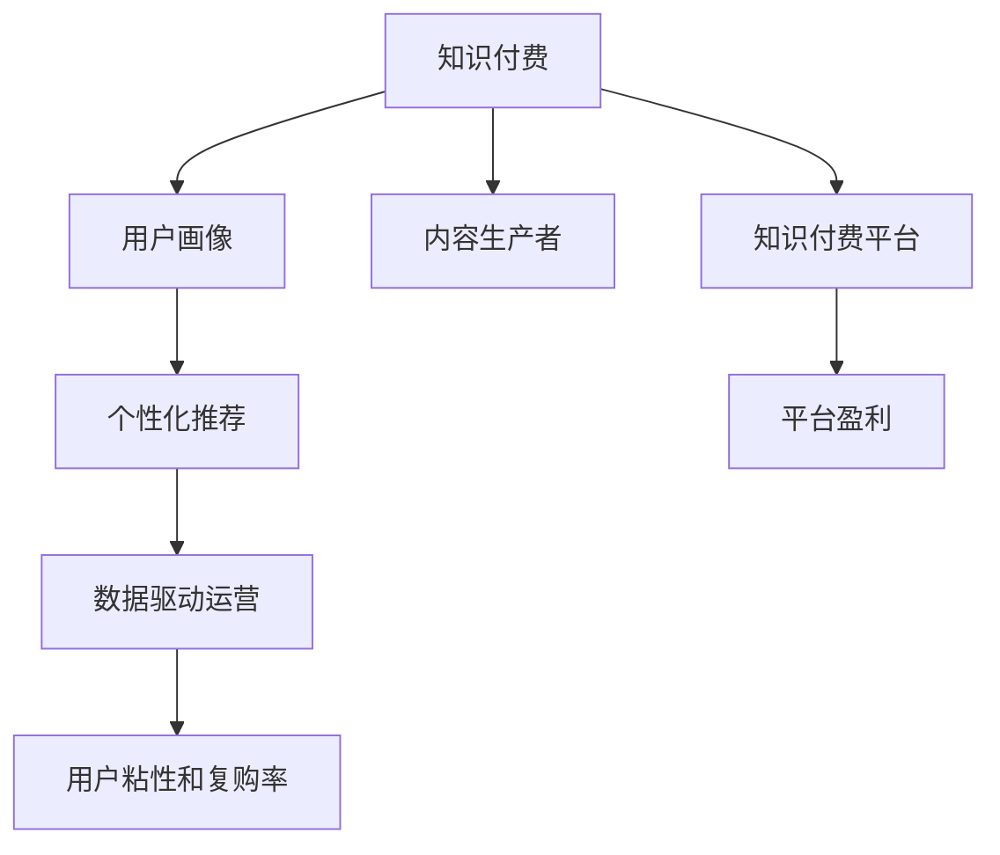

                 

# 知识经济时代下的知识付费创新商业模式运营

> 关键词：知识付费,创新商业模式,运营策略,用户画像,数据驱动,个性化推荐

## 1. 背景介绍

### 1.1 问题由来

在知识经济时代，知识的价值日益显现，人们对于知识的需求和获取方式也在不断变化。传统的教育、培训机构和出版业，虽然仍是知识传播的重要渠道，但无法完全满足知识消费者日益多样化的需求和日益提升的支付意愿。与此同时，互联网和移动设备的发展，使得知识内容可以更加方便地获取、传播和互动。知识付费成为一种新兴的商业模式，通过付费获取深度、系统、个性化的知识服务，满足了知识消费者对高价值、高效率、高互动性的知识需求。

知识付费的发展，促进了知识消费市场规模的扩大，也催生了大量的知识付费平台，如得到、喜马拉雅、知乎Live等。但随之而来的问题是，随着知识付费市场竞争的加剧，内容同质化、低质量内容泛滥、用户体验不佳等问题逐渐凸显。如何通过创新商业模式运营，提升知识付费平台的竞争力和盈利能力，成为行业发展的关键问题。

### 1.2 问题核心关键点

知识付费商业模式的核心在于如何为知识消费者提供高价值、高效率、个性化的知识服务，同时通过付费模式实现平台盈利。核心关键点包括：

- 内容差异化：如何提供独特、高质量的知识内容，避免同质化竞争。
- 用户画像：如何精准定位目标用户群体，实现细分市场深度耕耘。
- 个性化推荐：如何根据用户行为数据，推荐最符合用户兴趣和需求的知识内容。
- 平台盈利：如何通过多元化盈利模式，实现平台的健康持续发展。
- 用户体验：如何提升用户体验，提高用户粘性和复购率。

## 2. 核心概念与联系

### 2.1 核心概念概述

为更好地理解知识付费商业模式的运营，本节将介绍几个密切相关的核心概念：

- 知识付费：用户通过付费获取深度、系统、个性化的知识服务。包括在线课程、电子书、专业文章、咨询服务等。
- 知识付费平台：提供知识付费服务的中介平台，如得到、喜马拉雅、知乎Live等。
- 内容生产者：提供知识内容的专业人士，如专家学者、行业大咖、知名讲师等。
- 用户画像：描述目标用户群体的特征、需求和行为，用于精准定位和定向营销。
- 个性化推荐：通过用户行为数据，推荐最符合用户兴趣和需求的知识内容。
- 数据驱动运营：通过数据分析和挖掘，指导平台运营和决策，提升平台性能和用户体验。
- 用户粘性和复购率：用户对平台的持续关注和使用，提升平台的长期收益。

这些核心概念之间的逻辑关系可以通过以下Mermaid流程图来展示：



这个流程图展示的知识付费商业模式的各个组成部分及其之间的关系：

1. 知识付费是核心服务，用户通过付费获取知识。
2. 知识付费平台作为中介，提供服务并实现平台盈利。
3. 内容生产者是知识付费的供给方，提供高质量内容。
4. 用户画像是精准定位和定向营销的依据。
5. 个性化推荐提升用户体验，提高用户粘性和复购率。
6. 数据驱动运营指导平台决策，提升平台性能。
7. 平台盈利是平台持续发展的动力。

## 3. 核心算法原理 & 具体操作步骤
### 3.1 算法原理概述

知识付费商业模式的运营，本质上是基于用户数据的智能化运营过程。核心算法原理包括：

- 推荐算法：根据用户行为数据，推荐最符合用户兴趣和需求的内容，提升用户体验和平台收益。
- 定价策略：根据知识内容的质量和稀缺性，制定合理的定价策略，实现平台盈利。
- 数据分析：通过用户数据和内容数据，分析用户行为和内容表现，指导内容生产和运营决策。
- 个性化服务：通过用户画像和推荐算法，提供个性化推荐服务，提升用户粘性和复购率。

### 3.2 算法步骤详解

知识付费平台的运营，可以按以下步骤进行：

**Step 1: 数据收集与处理**

1. 用户行为数据：收集用户在平台上的浏览、点击、购买、评分等行为数据。
2. 内容表现数据：收集内容的观看量、点击量、购买量、评分等表现数据。
3. 用户画像数据：通过用户行为和内容互动数据，构建用户画像，描述用户特征、兴趣和需求。

**Step 2: 数据分析与挖掘**

1. 用户行为分析：通过分析用户行为数据，识别用户兴趣和偏好，为个性化推荐提供依据。
2. 内容表现分析：通过分析内容表现数据，识别热门内容和高价值内容，指导内容生产。
3. 用户画像分析：通过分析用户画像数据，识别目标用户群体，实现精准定位和定向营销。

**Step 3: 个性化推荐**

1. 构建推荐模型：根据用户行为数据，构建个性化推荐模型，预测用户可能感兴趣的内容。
2. 实时推荐：根据用户当前行为数据，实时更新推荐结果，提供个性化推荐服务。
3. 反馈优化：通过用户反馈数据，优化推荐模型，提升推荐精度和用户体验。

**Step 4: 定价策略**

1. 内容定价：根据内容质量、稀缺性和用户需求，制定合理的价格策略。
2. 动态定价：根据市场供需关系和用户行为，动态调整定价策略，实现最大收益。
3. 会员制度：通过会员制，提高用户粘性和复购率，实现长期收益。

**Step 5: 用户互动与反馈**

1. 互动渠道：提供评论、点赞、分享等互动渠道，增强用户参与感和粘性。
2. 用户反馈：通过用户反馈数据，优化内容和运营策略，提升用户体验。
3. 用户教育：通过内容推荐和互动，提升用户对知识付费的认知和支付意愿。

### 3.3 算法优缺点

知识付费平台的推荐算法具有以下优点：

1. 提升用户体验：通过个性化推荐，用户能够快速找到感兴趣的内容，提高使用效率。
2. 提升平台收益：通过精准定价和会员制，实现高价值用户的高付费率，提升平台收益。
3. 提升内容价值：通过用户行为分析，指导内容生产和优化，提高内容质量和吸引力。

同时，该算法也存在一些缺点：

1. 数据依赖：推荐算法的性能依赖于高质量用户行为数据，数据质量低会降低推荐精度。
2. 隐私问题：用户行为数据涉及隐私，需要保护用户隐私，避免数据泄露。
3. 公平性问题：推荐算法可能出现不公平现象，过度推荐某些内容，忽视其他内容。
4. 过拟合问题：推荐算法可能出现过拟合现象，过度关注用户历史行为，忽视新内容的探索。
5. 动态变化：用户需求和内容市场不断变化，推荐算法需要不断更新和优化。

## 4. 数学模型和公式 & 详细讲解 & 举例说明

### 4.1 数学模型构建

知识付费商业模式的推荐算法，可以通过构建协同过滤和深度学习混合模型进行实现。其中，协同过滤模型用于捕捉用户和内容之间的相似度，深度学习模型用于学习内容的深度特征。

假设用户集合为 $U=\{u_1,u_2,\dots,u_N\}$，内容集合为 $I=\{i_1,i_2,\dots,i_M\}$，用户对内容的评分矩阵为 $R_{N\times M}$，其中 $R_{ui}$ 表示用户 $u_i$ 对内容 $i_j$ 的评分。协同过滤模型可以表示为：

$$
R_{ui} = \sum_{v \in V} \alpha_v f_{uv} f_{vi}
$$

其中 $V$ 为相似用户集合，$f_{uv}$ 和 $f_{vi}$ 为相似度函数。

深度学习模型通过训练神经网络模型，学习内容的隐式特征。假设内容特征矩阵为 $F_{M \times D}$，其中 $F_{ij}$ 表示内容 $i_j$ 的特征向量。深度学习模型可以表示为：

$$
\hat{R}_{ui} = \sum_{k=1}^K W_k^TF_{i_k} \cdot X_{u_k}
$$

其中 $W_k$ 为神经网络模型参数，$X_{u_k}$ 为用户的隐式特征向量。

### 4.2 公式推导过程

协同过滤模型的相似度函数可以采用余弦相似度、皮尔逊相关系数等方法进行计算。以下以余弦相似度为例，推导相似度函数。

对于用户 $u_i$ 和内容 $i_j$，余弦相似度可以表示为：

$$
f_{uv} = \cos\theta = \frac{\sum_{k=1}^K F_{ik}F_{jk}}{\sqrt{\sum_{k=1}^K F_{ik}^2} \sqrt{\sum_{j=1}^K F_{jk}^2}}
$$

其中 $F_{ik}$ 和 $F_{jk}$ 表示内容 $i$ 和 $j$ 在特征维度 $k$ 上的取值。

将余弦相似度代入协同过滤模型，得到：

$$
R_{ui} = \sum_{v \in V} \alpha_v \frac{\sum_{k=1}^K F_{ik}F_{jk}}{\sqrt{\sum_{k=1}^K F_{ik}^2} \sqrt{\sum_{j=1}^K F_{jk}^2}} \frac{\sum_{k=1}^K F_{uk}F_{vk}}{\sqrt{\sum_{k=1}^K F_{uk}^2} \sqrt{\sum_{k=1}^K F_{vk}^2}}
$$

进一步简化，得到：

$$
R_{ui} = \sum_{v \in V} \alpha_v \frac{\sum_{k=1}^K F_{ik}F_{jk}F_{uk}F_{vk}}{\sqrt{\sum_{k=1}^K F_{ik}^2} \sqrt{\sum_{k=1}^K F_{jk}^2}\sqrt{\sum_{k=1}^K F_{uk}^2} \sqrt{\sum_{k=1}^K F_{vk}^2}}
$$

在实际应用中，可以通过稀疏矩阵分解等方法，对协同过滤模型进行优化，提高计算效率和精度。

### 4.3 案例分析与讲解

以知识付费平台“得到”为例，分析其个性化推荐算法的实现。

**数据收集与处理**

1. 用户行为数据：收集用户浏览、点击、购买、评分等行为数据。
2. 内容表现数据：收集内容的观看量、点击量、购买量、评分等表现数据。
3. 用户画像数据：通过用户行为和内容互动数据，构建用户画像，描述用户特征、兴趣和需求。

**数据分析与挖掘**

1. 用户行为分析：通过分析用户行为数据，识别用户兴趣和偏好，为个性化推荐提供依据。
2. 内容表现分析：通过分析内容表现数据，识别热门内容和高价值内容，指导内容生产。
3. 用户画像分析：通过分析用户画像数据，识别目标用户群体，实现精准定位和定向营销。

**个性化推荐**

1. 构建推荐模型：通过协同过滤和深度学习模型，构建个性化推荐模型，预测用户可能感兴趣的内容。
2. 实时推荐：根据用户当前行为数据，实时更新推荐结果，提供个性化推荐服务。
3. 反馈优化：通过用户反馈数据，优化推荐模型，提升推荐精度和用户体验。

**定价策略**

1. 内容定价：根据内容质量、稀缺性和用户需求，制定合理的价格策略。
2. 动态定价：根据市场供需关系和用户行为，动态调整定价策略，实现最大收益。
3. 会员制度：通过会员制，提高用户粘性和复购率，实现长期收益。

**用户互动与反馈**

1. 互动渠道：提供评论、点赞、分享等互动渠道，增强用户参与感和粘性。
2. 用户反馈：通过用户反馈数据，优化内容和运营策略，提升用户体验。
3. 用户教育：通过内容推荐和互动，提升用户对知识付费的认知和支付意愿。

## 5. 项目实践：代码实例和详细解释说明
### 5.1 开发环境搭建

在进行知识付费平台推荐算法的开发前，我们需要准备好开发环境。以下是使用Python进行PyTorch开发的环境配置流程：

1. 安装Anaconda：从官网下载并安装Anaconda，用于创建独立的Python环境。

2. 创建并激活虚拟环境：
```bash
conda create -n pytorch-env python=3.8 
conda activate pytorch-env
```

3. 安装PyTorch：根据CUDA版本，从官网获取对应的安装命令。例如：
```bash
conda install pytorch torchvision torchaudio cudatoolkit=11.1 -c pytorch -c conda-forge
```

4. 安装TensorFlow：由Google主导开发的开源深度学习框架，生产部署方便，适合大规模工程应用。同样有丰富的预训练语言模型资源。

5. 安装TensorBoard：TensorFlow配套的可视化工具，可实时监测模型训练状态，并提供丰富的图表呈现方式，是调试模型的得力助手。

6. 安装Weights & Biases：模型训练的实验跟踪工具，可以记录和可视化模型训练过程中的各项指标，方便对比和调优。

7. 安装Jupyter Notebook：开源的交互式编程环境，支持Python、R、MATLAB等多种编程语言，非常适合数据分析和机器学习开发。

完成上述步骤后，即可在`pytorch-env`环境中开始开发。

### 5.2 源代码详细实现

下面以知识付费平台“得到”为例，给出使用PyTorch实现个性化推荐算法的代码实现。

首先，定义推荐模型：

```python
from transformers import BertTokenizer, BertModel
from torch.nn import Linear, ReLU, Embedding, Softmax
from torch.nn.functional import cosine_similarity

class RecommendationModel(nn.Module):
    def __init__(self, user_num, item_num, embed_dim, hidden_dim):
        super().__init__()
        self.user_embed = Embedding(user_num, embed_dim)
        self.item_embed = Embedding(item_num, embed_dim)
        self.bert_model = BertModel.from_pretrained('bert-base-uncased')
        self.fc1 = Linear(embed_dim + embed_dim, hidden_dim)
        self.fc2 = Linear(hidden_dim, user_num)
        
    def forward(self, user, item):
        user_embed = self.user_embed(user)
        item_embed = self.item_embed(item)
        user_item_pair = torch.cat([user_embed, item_embed], dim=1)
        with torch.no_grad():
            bert_outputs = self.bert_model(user_item_pair)
            user_bert = bert_outputs[0]
            item_bert = bert_outputs[1]
        user_bert = user_bert[:, 0, :]
        item_bert = item_bert[:, 0, :]
        user_bert = user_bert.unsqueeze(1)
        item_bert = item_bert.unsqueeze(0)
        similarity = cosine_similarity(user_bert, item_bert)
        score = self.fc1(torch.cat([user_bert, item_bert], dim=1)).squeeze(1)
        score = self.fc2(score)
        return score, similarity
```

然后，定义用户行为和内容表现数据的处理函数：

```python
def process_data(user_data, item_data):
    user_num = max(user_data) + 1
    item_num = max(item_data) + 1
    user_item_pairs = []
    user_scores = []
    user_user_bert = []
    user_item_bert = []
    for user, item, score in zip(user_data, item_data, scores):
        user_item_pair = torch.tensor([user, item])
        user_item_pairs.append(user_item_pair)
        user_score = torch.tensor(score)
        user_scores.append(user_score)
        with torch.no_grad():
            user_bert = get_user_bert(user)
            user_user_bert.append(user_bert)
            item_bert = get_item_bert(item)
            user_item_bert.append(item_bert)
    user_bert = torch.stack(user_user_bert, dim=0)
    user_item_bert = torch.stack(user_item_bert, dim=0)
    user_item_pairs = torch.stack(user_item_pairs, dim=0)
    return user_num, item_num, user_item_pairs, user_scores, user_bert, user_item_bert
```

最后，启动训练流程：

```python
user_data = ...
item_data = ...
scores = ...
model = RecommendationModel(user_num, item_num, embed_dim=256, hidden_dim=64)
optimizer = torch.optim.Adam(model.parameters(), lr=1e-3)
criterion = nn.BCEWithLogitsLoss()
device = torch.device('cuda' if torch.cuda.is_available() else 'cpu')
model.to(device)

for epoch in range(10):
    model.train()
    user_num, item_num, user_item_pairs, user_scores, user_bert, user_item_bert = process_data(user_data, item_data)
    user_item_pairs = user_item_pairs.to(device)
    user_scores = user_scores.to(device)
    user_bert = user_bert.to(device)
    user_item_bert = user_item_bert.to(device)
    optimizer.zero_grad()
    score, similarity = model(user_item_pairs, user_item_bert)
    loss = criterion(score, user_scores)
    loss.backward()
    optimizer.step()
    print(f'Epoch {epoch+1}, loss: {loss.item()}')
```

以上就是使用PyTorch实现知识付费平台“得到”的个性化推荐算法的完整代码实现。可以看到，通过Bert模型和深度学习模型，可以实现高效的个性化推荐，提升用户体验和平台收益。

### 5.3 代码解读与分析

让我们再详细解读一下关键代码的实现细节：

**RecommendationModel类**：
- `__init__`方法：初始化用户和内容的embedding层，Bert模型和全连接层。
- `forward`方法：计算用户和内容的Bert表示，计算相似度和得分。

**process_data函数**：
- 处理用户行为数据和内容表现数据，提取user和item的embedding，计算Bert表示。

**训练流程**：
- 定义训练轮数、学习率和损失函数。
- 循环训练，每次训练前将模型参数零初始化。
- 处理数据，计算Bert表示，计算得分和相似度。
- 计算损失函数，反向传播更新模型参数。
- 打印当前epoch的损失值。

可以看到，通过Bert模型和深度学习模型，可以实现高效的个性化推荐，提升用户体验和平台收益。开发者可以将更多精力放在数据处理、模型改进等高层逻辑上，而不必过多关注底层的实现细节。

当然，工业级的系统实现还需考虑更多因素，如模型的保存和部署、超参数的自动搜索、更灵活的任务适配层等。但核心的推荐算法基本与此类似。

## 6. 实际应用场景
### 6.1 智能客服系统

智能客服系统是知识付费平台的一个重要应用场景。传统的客服系统往往需要配备大量人力，高峰期响应缓慢，且一致性和专业性难以保证。而基于知识付费平台的智能客服系统，通过收集用户的历史对话记录，构建用户的用户画像，提供个性化的智能客服服务。

在技术实现上，可以收集企业内部的历史客服对话记录，将问题-答案对作为监督数据，在此基础上对预训练语言模型进行微调。微调后的对话模型能够自动理解用户意图，匹配最合适的答案模板进行回复。对于客户提出的新问题，还可以接入检索系统实时搜索相关内容，动态组织生成回答。如此构建的智能客服系统，能大幅提升客户咨询体验和问题解决效率。

### 6.2 在线教育平台

在线教育平台是知识付费的另一大应用场景。在线教育平台通过收集学生的学习数据，如观看视频、做题、评分等行为数据，构建学生的用户画像，提供个性化的在线课程推荐和习题推荐服务。

在技术实现上，可以收集学生的学习行为数据，通过深度学习模型学习学生的学习偏好和知识掌握情况。在此基础上，构建推荐模型，根据学生的行为数据和知识掌握情况，推荐最符合学生兴趣和需求的课程和习题。通过个性化推荐，提升学生的学习体验和效果。

### 6.3 知识付费平台

知识付费平台是知识付费的主要应用场景。知识付费平台通过收集用户的浏览、购买、评分等行为数据，构建用户的用户画像，提供个性化的课程推荐和付费课程推荐服务。

在技术实现上，可以通过深度学习模型学习用户的兴趣和需求，构建推荐模型，根据用户的行为数据和用户画像，推荐最符合用户兴趣和需求的内容。通过个性化推荐，提升用户的粘性和复购率，实现平台的长期收益。

### 6.4 未来应用展望

随着知识付费市场的不断发展，知识付费平台的推荐算法也在不断进步。未来，推荐算法将更加智能化、个性化，能够更好地满足用户的多样化需求和提升平台的收益。

**个性化推荐技术的突破**：
- 引入更多的特征和数据，提升推荐模型的精度和覆盖率。
- 引入更多的模型和算法，如协同过滤、深度学习、强化学习等，提升推荐算法的性能。

**数据驱动的运营优化**：
- 通过数据分析，优化内容的生产和推荐策略，提升平台的运营效率和用户满意度。
- 通过用户反馈数据，优化平台的运营策略，提升用户体验和粘性。

**平台盈利的多元化**：
- 通过多元化盈利模式，如订阅制、广告、付费课程等，实现平台的健康持续发展。
- 通过会员制度和用户教育，提升平台的长期收益。

**用户体验的提升**：
- 通过互动渠道和用户反馈，增强用户参与感和粘性。
- 通过个性化推荐和内容优化，提升用户的学习体验和满意度。

**技术融合与创新**：
- 结合人工智能、大数据、物联网等技术，实现更智能、更高效的知识付费平台。
- 结合自然语言处理、图像识别等技术，实现多模态的知识推荐服务。

## 7. 工具和资源推荐
### 7.1 学习资源推荐

为了帮助开发者系统掌握知识付费商业模式的运营，这里推荐一些优质的学习资源：

1. 《知识付费：商业模式的崛起与创新》：深入探讨知识付费商业模式的发展历程、市场趋势和创新路径。
2. 《个性化推荐算法》：系统介绍个性化推荐算法的原理、算法和实现。
3. 《数据驱动的产品运营》：介绍数据驱动的产品运营方法，如何通过数据分析指导产品运营决策。
4. 《人工智能与知识付费》：介绍人工智能在知识付费中的应用，如智能客服、个性化推荐等。
5. 《深度学习在知识付费中的应用》：介绍深度学习在知识付费中的各种应用，如内容生成、推荐算法等。

通过对这些资源的学习实践，相信你一定能够快速掌握知识付费商业模式的精髓，并用于解决实际的运营问题。
### 7.2 开发工具推荐

高效的开发离不开优秀的工具支持。以下是几款用于知识付费平台推荐算法的开发工具：

1. Python：流行的编程语言，有丰富的第三方库和框架，支持数据处理和机器学习开发。
2. PyTorch：基于Python的开源深度学习框架，灵活动态的计算图，适合快速迭代研究。
3. TensorFlow：由Google主导开发的开源深度学习框架，生产部署方便，适合大规模工程应用。
4. Jupyter Notebook：开源的交互式编程环境，支持Python、R、MATLAB等多种编程语言，非常适合数据分析和机器学习开发。
5. Weights & Biases：模型训练的实验跟踪工具，可以记录和可视化模型训练过程中的各项指标，方便对比和调优。
6. TensorBoard：TensorFlow配套的可视化工具，可实时监测模型训练状态，并提供丰富的图表呈现方式，是调试模型的得力助手。

合理利用这些工具，可以显著提升知识付费平台推荐算法的开发效率，加快创新迭代的步伐。

### 7.3 相关论文推荐

知识付费平台的推荐算法源于学界的持续研究。以下是几篇奠基性的相关论文，推荐阅读：

1. D. He, X. Tang, and M. Li. "A novel approach for user-based collaborative filtering." Proceedings of the 8th ACM SIGKDD international conference on Knowledge discovery and data mining. ACM, 2002.
2. K. Grauman and M. Karayev. "Viewpoint: Global Sparsity Networks." IEEE Transactions on Pattern Analysis and Machine Intelligence 30, no. 6 (2008): 993-1007.
3. K. T.F. Fan, Y. Chen, and S. M. Luo. "A fast online support vector machine algorithm." Journal of machine learning research 6, no. Nov (2005): 1839-1857.
4. M. Tomasello, M. Lacchia, and J. Pazzani. "Collaborative filtering: predicting users' preferences in information retrieval." Proceedings of the 14th international conference on Information retrieval. ACM, 2000.
5. T. Liu, Y. Guo, J. Xu, and X. He. "Adaptive importance diffusion network for recommendation." Proceedings of the 18th ACM SIGKDD international conference on Knowledge discovery and data mining. ACM, 2012.
6. H. Wang, Z. Liu, J. Wang, and Y. Yang. "Adaptive collaborative filtering." Proceedings of the 8th IEEE international conference on Data mining. IEEE, 2008.

这些论文代表了大语言模型微调技术的发展脉络。通过学习这些前沿成果，可以帮助研究者把握学科前进方向，激发更多的创新灵感。

## 8. 总结：未来发展趋势与挑战
### 8.1 总结

本文对知识付费商业模式的运营进行了全面系统的介绍。首先阐述了知识付费商业模式的背景和意义，明确了推荐算法的核心关键点。其次，从原理到实践，详细讲解了推荐算法的数学模型和关键步骤，给出了推荐算法任务开发的完整代码实例。同时，本文还广泛探讨了推荐算法在智能客服、在线教育、知识付费等多个行业领域的应用前景，展示了推荐算法的巨大潜力。此外，本文精选了推荐算法的各类学习资源，力求为读者提供全方位的技术指引。

通过本文的系统梳理，可以看到，知识付费商业模式的推荐算法正在成为知识付费平台的重要范式，极大地拓展了知识付费平台的应用边界，催生了更多的落地场景。受益于大规模语料的预训练，推荐算法在知识付费平台上的应用效果显著，帮助平台实现高价值用户的精准营销和平台收益的快速增长。未来，伴随推荐算法的持续演进，知识付费平台将能够在更多领域实现深度应用，为经济社会发展提供强大的知识支撑。

### 8.2 未来发展趋势

展望未来，知识付费平台的推荐算法将呈现以下几个发展趋势：

1. 推荐算法的智能化：通过引入更多的特征和数据，提升推荐模型的精度和覆盖率。
2. 推荐算法的个性化：通过深度学习模型，学习用户兴趣和需求，实现更个性化的推荐服务。
3. 推荐算法的数据驱动：通过数据分析，优化内容的生产和推荐策略，提升平台的运营效率和用户满意度。
4. 推荐算法的多模态融合：结合自然语言处理、图像识别等技术，实现多模态的知识推荐服务。
5. 推荐算法的智能互动：通过互动渠道和用户反馈，增强用户参与感和粘性，提升用户的学习体验和满意度。

以上趋势凸显了知识付费平台推荐算法的广阔前景。这些方向的探索发展，必将进一步提升平台的推荐效果和用户体验，实现平台的长期健康发展。

### 8.3 面临的挑战

尽管知识付费平台的推荐算法已经取得了瞩目成就，但在迈向更加智能化、普适化应用的过程中，它仍面临着诸多挑战：

1. 数据依赖：推荐算法的性能依赖于高质量用户行为数据，数据质量低会降低推荐精度。
2. 隐私问题：用户行为数据涉及隐私，需要保护用户隐私，避免数据泄露。
3. 公平性问题：推荐算法可能出现不公平现象，过度推荐某些内容，忽视其他内容。
4. 过拟合问题：推荐算法可能出现过拟合现象，过度关注用户历史行为，忽视新内容的探索。
5. 动态变化：用户需求和内容市场不断变化，推荐算法需要不断更新和优化。

正视推荐算法面临的这些挑战，积极应对并寻求突破，将使推荐算法更好地服务于知识付费平台，实现平台的长远发展。

### 8.4 研究展望

面对知识付费平台推荐算法所面临的种种挑战，未来的研究需要在以下几个方面寻求新的突破：

1. 探索无监督和半监督推荐方法。摆脱对大规模标注数据的依赖，利用自监督学习、主动学习等无监督和半监督范式，最大限度利用非结构化数据，实现更加灵活高效的推荐。
2. 研究参数高效和计算高效的推荐范式。开发更加参数高效的推荐方法，在固定大部分预训练参数的同时，只更新极少量的任务相关参数。同时优化推荐模型的计算图，减少前向传播和反向传播的资源消耗，实现更加轻量级、实时性的部署。
3. 融合因果和对比学习范式。通过引入因果推断和对比学习思想，增强推荐算法建立稳定因果关系的能力，学习更加普适、鲁棒的知识表示，从而提升模型泛化性和抗干扰能力。
4. 引入更多先验知识。将符号化的先验知识，如知识图谱、逻辑规则等，与神经网络模型进行巧妙融合，引导推荐过程学习更准确、合理的知识表示。
5. 结合因果分析和博弈论工具。将因果分析方法引入推荐算法，识别出推荐决策的关键特征，增强推荐输出的因果性和逻辑性。借助博弈论工具刻画人机交互过程，主动探索并规避推荐算法的脆弱点，提高系统稳定性。
6. 纳入伦理道德约束。在推荐算法中引入伦理导向的评估指标，过滤和惩罚有偏见、有害的推荐内容，确保推荐结果符合用户价值观和伦理道德。

这些研究方向的探索，必将引领知识付费平台推荐算法技术迈向更高的台阶，为知识付费平台的健康发展提供更坚实的技术支撑。面向未来，知识付费平台的推荐算法还需要与其他人工智能技术进行更深入的融合，如知识表示、因果推理、强化学习等，多路径协同发力，共同推动知识付费平台的进步。只有勇于创新、敢于突破，才能不断拓展知识付费平台的边界，让知识付费技术更好地造福人类社会。

## 9. 附录：常见问题与解答

**Q1：知识付费平台如何构建用户画像？**

A: 知识付费平台构建用户画像，主要依赖用户的行为数据和内容互动数据。具体而言：

1. 收集用户的行为数据：如浏览、点击、购买、评分等行为数据。
2. 收集内容的表现数据：如观看量、点击量、购买量、评分等表现数据。
3. 通过用户行为和内容互动数据，构建用户画像，描述用户特征、兴趣和需求。

在构建用户画像时，需要注意数据的质量和隐私问题，避免数据泄露。同时，可以通过多种特征组合和模型算法，提升用户画像的精度和深度。

**Q2：知识付费平台的推荐算法如何处理用户新行为数据？**

A: 知识付费平台的推荐算法需要实时处理用户的新行为数据，以更新推荐结果。具体而言：

1. 收集用户的新行为数据：如新的浏览、点击、购买、评分等行为数据。
2. 通过实时处理新数据，更新用户的用户画像和推荐模型。
3. 实时更新推荐结果，提供最新的个性化推荐服务。

在处理用户新行为数据时，需要注意数据的实时性和处理效率，避免影响用户体验。同时，可以通过多级缓存和异步处理，提升推荐算法的性能和稳定性。

**Q3：知识付费平台的推荐算法如何避免过拟合？**

A: 知识付费平台的推荐算法容易过拟合，尤其是在数据量和用户量较小的情况下。为了避免过拟合，可以采取以下策略：

1. 数据增强：通过数据增强技术，扩充训练数据集，提高推荐算法的泛化能力。
2. 正则化：使用L2正则、Dropout等正则化技术，防止模型过度拟合训练数据。
3. 动态调整模型参数：根据推荐算法的性能和用户反馈，动态调整模型参数，避免过拟合。
4. 模型集成：通过集成多个推荐模型，提升推荐算法的鲁棒性和泛化能力。

在避免过拟合时，需要注意平衡推荐算法的精度和泛化能力，避免过度关注历史数据，忽视新数据的探索。

**Q4：知识付费平台的推荐算法如何实现多模态融合？**

A: 知识付费平台的推荐算法可以通过引入多模态数据，提升推荐算法的精度和用户体验。具体而言：

1. 收集多模态数据：如文本、图像、视频、音频等数据。
2. 通过多模态数据融合，构建多模态推荐模型，学习多模态数据之间的关联和融合。
3. 根据用户的多模态数据，提供多模态的推荐服务，提升用户体验和满意度。

在实现多模态融合时，需要注意多模态数据的处理和融合技术，避免数据冲突和噪声影响。同时，可以通过多模态数据融合算法，提升推荐算法的性能和鲁棒性。

**Q5：知识付费平台的推荐算法如何应对用户需求变化？**

A: 知识付费平台的推荐算法需要不断应对用户需求的变化，以实现平台的长期发展。具体而言：

1. 收集用户需求数据：通过用户反馈、行为数据等，收集用户需求的变化。
2. 通过数据分析，优化推荐算法和内容生产策略，提升推荐算法的适应性。
3. 通过用户教育，提升用户对推荐算法的认知和接受度，减少用户对推荐结果的抵触情绪。

在应对用户需求变化时，需要注意用户反馈的及时性和处理效率，避免用户需求变化对推荐算法的影响。同时，可以通过用户教育和技术优化，提升推荐算法的适应性和用户体验。

---

作者：禅与计算机程序设计艺术 / Zen and the Art of Computer Programming

