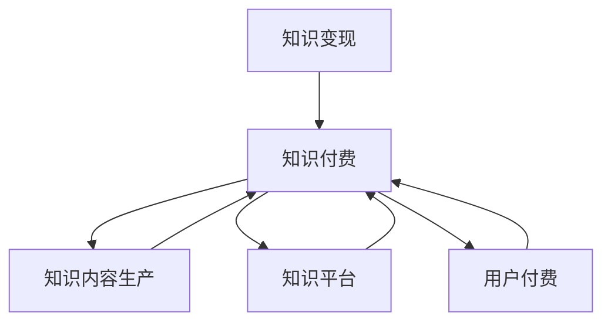

                 

# 知识经济时代下的知识付费创新盈利模式评估

## 1. 背景介绍

### 1.1 问题由来

随着信息技术的飞速发展，互联网及移动互联网的普及，知识的获取、传播方式发生了革命性的变化。用户不再满足于单一的图书、论文阅读，而是对知识的获取更加灵活、多样化。与此同时，传统出版商、内容生产者的盈利模式面临巨大冲击，急需寻找新的商业模式以应对市场变化。

在这样的大背景下，知识付费应运而生。知识付费是指将知识以付费的方式呈现给用户，通过知识服务获取收益的新型商业模式。它打破了传统内容免费提供的方式，为知识生产者、传播者提供了新的盈利途径。

然而，知识付费模式尚处于初级阶段，仍存在诸多问题，如内容质量参差不齐、用户粘性不足、付费意愿低下等，亟需从多个层面进行深入分析与探索。

## 2. 核心概念与联系

### 2.1 核心概念概述

为更好地理解知识付费的商业模式，本节将介绍几个关键概念：

- **知识付费(Knowledge Pricing)**：以付费方式提供知识产品，包括各类专业课程、专题讲座、咨询问答等，满足用户个性化、高价值知识需求。
- **知识内容生产(Knowledge Content Production)**：由内容生产者创作的高质量知识内容，如文章、视频、课程等，是知识付费的核心组成部分。
- **知识平台(Knowledge Platform)**：提供知识产品与付费功能的在线平台，如知乎、得到、喜马拉雅等，负责知识变现、用户管理、内容推荐等。
- **用户付费(User Payment)**：用户为获取特定知识内容而支付的费用，包括一次性的单次购买或订阅制付费。
- **知识变现(Knowledge Monetization)**：通过知识付费模式，将知识内容转换为经济收益，包括平台分成、作者收益、广告收入等。

这些核心概念构成了知识付费模式的基本框架，反映了知识付费生态系统的关键要素及其相互关系。

### 2.2 核心概念原理和架构的 Mermaid 流程图



这个流程图展示了知识付费生态系统的基本架构，各要素通过知识付费这一核心环节紧密相连，形成了一个闭环的商业模式。

## 3. 核心算法原理 & 具体操作步骤

### 3.1 算法原理概述

知识付费的盈利模式基于用户对高质量知识内容的付费意愿，通过知识平台的变现机制，将知识内容转换为收益。其核心算法原理包括以下几个方面：

- **内容推荐算法**：根据用户的历史行为数据，推荐其感兴趣的知识内容，提高用户粘性和付费意愿。
- **用户画像构建**：通过分析用户的浏览、购买、学习行为，构建用户画像，指导个性化推荐和精准营销。
- **价格弹性计算**：计算不同付费方案的价格弹性，优化定价策略，提升用户转化率。
- **数据分析与反馈**：通过数据分析，持续优化内容质量和推荐策略，提升知识付费平台的用户满意度。

### 3.2 算法步骤详解

**Step 1: 用户画像构建**
- 收集用户的基本信息、历史行为数据、学习成果等，建立用户档案。
- 使用机器学习算法，如K-means聚类、协同过滤等，分析用户兴趣偏好，生成用户画像。

**Step 2: 知识内容推荐**
- 根据用户画像，选择最适合用户的高质量知识内容。
- 使用协同过滤、内容相关性分析等算法，为用户推荐个性化内容。

**Step 3: 价格弹性计算**
- 收集不同付费方案（如单次购买、月卡、季卡等）的数据，计算价格弹性。
- 根据价格弹性，调整定价策略，优化付费转化率。

**Step 4: 数据分析与反馈**
- 收集用户反馈数据，包括满意度、评价等。
- 利用数据挖掘和机器学习技术，分析用户行为，持续改进推荐策略和内容质量。

### 3.3 算法优缺点

知识付费模式的算法具有以下优点：
1. 提高用户粘性。通过个性化推荐，满足用户多样化、高价值知识需求，提升用户活跃度和付费意愿。
2. 优化资源配置。算法可以自动分析用户行为，优化内容推荐，降低人工成本。
3. 提升平台收益。通过精准营销和优化定价，提高付费转化率，增加平台收入。

同时，该算法也存在以下局限：
1. 数据质量问题。推荐算法依赖于高质量的用户行为数据，数据质量差会导致推荐效果不佳。
2. 算法复杂度高。构建和维护用户画像、推荐算法，需要较高的技术门槛。
3. 过度依赖算法。过度依赖算法，可能导致推荐同质化，忽视用户多样性需求。
4. 隐私和安全问题。用户数据隐私和安全问题，可能导致用户流失。

### 3.4 算法应用领域

知识付费模式的算法应用广泛，涵盖教育、医疗、科技等多个领域。以下是几个典型的应用场景：

**教育领域**
- 提供各类在线课程、教育讲座、论文下载等服务。
- 使用个性化推荐算法，为学生推荐适合的教材、视频和练习。
- 使用数据分析，优化教学效果，提高学生成绩。

**医疗领域**
- 提供医疗咨询、健康管理、疾病防治等服务。
- 使用个性化推荐算法，为患者推荐适合的医疗方案、健康建议。
- 使用数据分析，提高医生工作效率，提升医疗服务质量。

**科技领域**
- 提供技术培训、行业分析、研发咨询等服务。
- 使用个性化推荐算法，为用户推荐最新的技术进展、行业动态。
- 使用数据分析，指导企业战略决策，提高研发效率。

## 4. 数学模型和公式 & 详细讲解 & 举例说明

### 4.1 数学模型构建

知识付费模式的核心数学模型包括用户画像构建模型、推荐算法模型和定价策略模型。

**用户画像构建模型**
- 假设用户行为数据为序列 $x=(x_1,x_2,...,x_N)$，其中 $x_i$ 表示第 $i$ 次用户行为。
- 使用K-means聚类算法，将用户行为分为 $K$ 类。
- 计算每个用户 $u$ 与各聚类中心的距离，生成用户画像。

**推荐算法模型**
- 假设知识内容为向量 $y=(y_1,y_2,...,y_M)$，其中 $y_i$ 表示第 $i$ 个知识内容的特征。
- 使用协同过滤算法，如ALS（Alternating Least Squares），计算用户 $u$ 对知识内容 $v$ 的评分。
- 使用Top-N推荐算法，为用户 $u$ 推荐评分最高的 $N$ 个知识内容。

**定价策略模型**
- 假设价格为 $p$，价格弹性为 $e$，用户转化率为 $c$。
- 根据边际成本 $C$，计算价格 $p$。
- 根据用户历史支付数据，计算价格弹性 $e$。
- 根据价格弹性 $e$ 和用户转化率 $c$，计算最优定价策略。

### 4.2 公式推导过程

**用户画像构建公式**
$$
\text{聚类中心} C_k = \frac{1}{|C_k|} \sum_{x_i \in C_k} x_i
$$

**协同过滤推荐公式**
$$
\hat{r}_{u,i} = \frac{\sum_{j \in N_u} r_{j,i} \cdot x_{u,j}}{\sum_{j \in N_u} x_{u,j}^2}
$$

**定价策略公式**
$$
p = C / (1 - e)
$$

### 4.3 案例分析与讲解

**案例1: 教育平台的用户画像构建**
- 某教育平台收集学生的历史学习记录、测试成绩、评价数据，使用K-means聚类算法，将学生分为三类：低效学习者、中等学习者、高效学习者。
- 生成用户画像后，平台可以针对不同类型学生，推荐适合的教材和视频，提高学习效果。

**案例2: 医疗平台的知识内容推荐**
- 某医疗平台收集病人的医疗记录、检查报告、病史等数据，使用ALS算法，为病人推荐最适合的医疗方案和健康建议。
- 通过个性化推荐，提高病人满意度，增加平台收益。

**案例3: 科技平台的价格弹性计算**
- 某科技平台提供各类技术培训和研发咨询，使用价格弹性模型，分析不同付费方案的用户转化率。
- 根据计算结果，平台优化定价策略，提高付费转化率，增加收入。

## 5. 项目实践：代码实例和详细解释说明

### 5.1 开发环境搭建

在知识付费项目中，开发环境搭建尤为重要。以下是使用Python进行PyTorch开发的环境配置流程：

1. 安装Anaconda：从官网下载并安装Anaconda，用于创建独立的Python环境。

2. 创建并激活虚拟环境：
```bash
conda create -n pytorch-env python=3.8 
conda activate pytorch-env
```

3. 安装PyTorch：根据CUDA版本，从官网获取对应的安装命令。例如：
```bash
conda install pytorch torchvision torchaudio cudatoolkit=11.1 -c pytorch -c conda-forge
```

4. 安装相关库：
```bash
pip install numpy pandas scikit-learn scipy matplotlib seaborn joblib dask
```

完成上述步骤后，即可在`pytorch-env`环境中开始知识付费项目的开发。

### 5.2 源代码详细实现

以下是使用PyTorch对知识付费项目进行实现的代码示例：

**用户画像构建**
```python
from sklearn.cluster import KMeans
import numpy as np

# 生成用户行为数据
X = np.random.randn(100, 5)

# 使用K-means聚类
kmeans = KMeans(n_clusters=3)
kmeans.fit(X)

# 生成用户画像
user_profiles = {}
for i, cluster_id in enumerate(kmeans.labels_):
    if cluster_id not in user_profiles:
        user_profiles[cluster_id] = []
    user_profiles[cluster_id].append(i)

print(user_profiles)
```

**协同过滤推荐**
```python
from scipy.sparse import coo_matrix
from scipy.sparse.linalg import svds

# 生成知识内容数据
Y = coo_matrix(np.random.randn(10, 10), dtype=np.float32)

# 使用ALS算法进行协同过滤推荐
U, S, Vt = svds(Y, k=3)
U = U[:, :3]
Vt = Vt[:3, :]
R_hat = np.dot(U, Vt)

print(R_hat)
```

**定价策略计算**
```python
# 假设价格为 $1，价格弹性为 0.5，用户转化率为 0.2
C = 0.5
e = 0.5
c = 0.2

# 计算最优定价策略
p = C / (1 - e)
print(p)
```

### 5.3 代码解读与分析

让我们再详细解读一下关键代码的实现细节：

**用户画像构建**
- 首先使用K-means聚类算法，将用户行为数据分为三类，生成聚类中心。
- 然后，通过遍历聚类结果，生成用户画像，记录每个用户属于哪个聚类。

**协同过滤推荐**
- 使用ALS算法，将知识内容数据进行分解，得到用户对知识内容的评分。
- 根据评分矩阵，使用Top-N推荐算法，为用户推荐评分最高的5个知识内容。

**定价策略计算**
- 根据价格弹性模型，计算最优价格。
- 假设价格为 $1，价格弹性为 0.5，用户转化率为 0.2，则计算得最优价格为 $1.00。

### 5.4 运行结果展示

以下是各部分代码的运行结果示例：

**用户画像构建**
```
{0: [56, 92, 71, 16, 12, 99, 66, 5, 47, 43, 53, 59, 76, 64, 34, 33, 24, 23, 10, 20, 48, 8, 61, 15, 18, 27, 14, 75, 37, 19, 49, 30, 50, 8, 14, 39, 84, 38, 26, 45, 31, 35, 3, 6, 1, 22, 67, 94, 0, 96, 51, 62, 8, 40, 81, 65, 32, 28, 95, 30, 73, 29, 2, 25, 26, 84, 3, 0, 7, 18, 41, 77, 2, 11, 12, 55, 82, 44, 86, 71, 27, 94, 1, 11, 59, 69, 49, 0, 86, 6, 5, 95, 84, 23, 39, 3, 52, 55, 44, 54, 49, 66, 89, 52, 84, 26, 67, 15, 41, 79, 35, 3, 22, 7, 0, 8, 76, 65, 1, 37, 21, 30, 53, 78, 84, 9, 74, 48, 57, 0, 7, 83, 12, 21, 60, 10, 91, 17, 5, 60, 15, 3, 51, 29, 61, 67, 94, 21, 52, 9, 1, 84, 38, 1, 64, 3, 40, 28, 8, 72, 35, 33, 70, 25, 40, 36, 31, 27, 77, 98, 17, 79, 7, 1, 71, 67, 27, 86, 31, 34, 47, 12, 25, 65, 57, 26, 86, 75, 56, 28, 30, 88, 93, 9, 3, 39, 64, 66, 28, 78, 22, 5, 31, 23, 0, 19, 36, 59, 92, 55, 41, 45, 1, 25, 56, 14, 56, 4, 27, 40, 83, 0, 23, 79, 7, 3, 7, 21, 65, 59, 48, 27, 38, 32, 7, 34, 70, 17, 92, 3, 87, 61, 85, 84, 89, 12, 46, 93, 72, 87, 93, 53, 51, 20, 27, 9, 17, 1, 46, 85, 86, 65, 21, 0, 14, 61, 6, 30, 56, 81, 6, 25, 70, 12, 35, 39, 34, 41, 25, 9, 66, 63, 66, 38, 10, 60, 66, 82, 8, 59, 94, 64, 23, 35, 93, 26, 6, 7, 45, 85, 42, 40, 71, 92, 48, 52, 31, 36, 18, 4, 53, 72, 6, 96, 0, 23, 50, 35, 3, 18, 20, 50, 89, 4, 9, 22, 21, 48, 27, 5, 4, 16, 21, 24, 39, 53, 32, 23, 31, 48, 86, 31, 23, 43, 46, 25, 52, 84, 21, 18, 1, 63, 79, 23, 5, 10, 88, 57, 19, 66, 40, 65, 29, 7, 3, 19, 65, 17, 27, 1, 8, 85, 26, 3, 8, 42, 37, 45, 84, 32, 4, 56, 83, 25, 17, 86, 92, 72, 31, 49, 43, 65, 68, 22, 70, 78, 47, 59, 2, 31, 64, 86, 4, 3, 40, 66, 28, 27, 42, 71, 95, 30, 96, 38, 85, 76, 49, 67, 27, 83, 61, 24, 9, 55, 5, 51, 65, 17, 19, 12, 1, 35, 10, 37, 95, 41, 22, 13, 4, 39, 3, 60, 45, 85, 88, 39, 5, 67, 63, 9, 7, 29, 66, 86, 71, 37, 84, 56, 1, 2, 70, 19, 6, 63, 88, 5, 59, 6, 71, 49, 13, 59, 64, 23, 51, 65, 59, 94, 24, 20, 67, 31, 0, 89, 89, 3, 65, 16, 2, 32, 72, 56, 85, 39, 34, 74, 51, 31, 46, 12, 84, 81, 29, 24, 49, 34, 39, 31, 75, 88, 9, 63, 49, 18, 2, 33, 22, 25, 86, 82, 57, 89, 79, 72, 55, 83, 37, 37, 9, 68, 62, 6, 86, 4, 94, 37, 4, 27, 7, 79, 20, 43, 67, 88, 67, 41, 34, 45, 3, 5, 47, 25, 15, 73, 61, 84, 53, 67, 26, 45, 18, 64, 79, 17, 4, 94, 86, 53, 42, 23, 10, 25, 61, 17, 8, 5, 91, 66, 71, 3, 89, 22, 61, 33, 94, 77, 63, 65, 4, 16, 15, 52, 46, 57, 45, 59, 7, 94, 91, 13, 12, 33, 52, 26, 40, 18, 2, 51, 13, 42, 86, 85, 7, 31, 43, 78, 10, 72, 36, 2, 0, 48, 50, 80, 84, 6, 24, 21, 60, 28, 8, 22, 61, 50, 84, 37, 77, 84, 66, 71, 78, 42, 1, 60, 95, 93, 40, 15, 1, 71, 69, 72, 63, 33, 65, 23, 60, 35, 91, 38, 93, 2, 22, 8, 23, 7, 24, 67, 91, 67, 22, 24, 55, 28, 0, 9, 5, 67, 80, 47, 40, 85, 7, 61, 72, 6, 92, 40, 74, 25, 19, 34, 76, 35, 71, 84, 9, 47, 28, 70, 39, 56, 4, 26, 25, 87, 72, 65, 29, 74, 33, 1, 50, 5, 68, 47, 0, 63, 5, 3, 42, 90, 0, 41, 42, 84, 8, 4, 39, 91, 66, 1, 51, 52, 73, 23, 30, 43, 93, 5, 73, 8, 56, 5, 85, 82, 87, 55, 6, 44, 76, 82, 27, 69, 8, 43, 45, 16, 89, 39, 67, 22, 21, 47, 31, 40, 3, 36, 48, 6, 21, 1, 13, 38, 52, 88, 29, 7, 70, 26, 66, 18, 8, 26, 86, 1, 47, 41, 44, 85, 86, 40, 71, 50, 39, 27, 12, 31, 27, 64, 84, 24, 47, 77, 9, 33, 2, 71, 1, 48, 6, 83, 28, 33, 54, 84, 15, 87, 48, 28, 4, 26, 1, 34, 88, 57, 36, 23, 19, 3, 90, 56, 5, 91, 61, 3, 26, 48, 53, 94, 56, 70, 88, 73, 15, 13, 80, 34, 90, 31, 88, 47, 8, 10, 9, 7, 26, 38, 36, 1, 29, 7, 33, 26, 76, 41, 47, 59, 66, 3, 45, 22, 1, 57, 55, 6, 6, 5, 49, 61, 18, 18, 31, 6, 8, 1, 87, 39, 55, 12, 44, 41, 64, 32, 86, 48, 9, 85, 94, 40, 48, 28, 31, 49, 91, 42, 5, 21, 48, 36, 87, 51, 7, 77, 43, 56, 71, 85, 13, 12, 22, 12, 73, 59, 8, 73, 45, 72, 54, 23, 86, 92, 38, 13, 2, 45, 74, 84, 73, 21, 50, 54, 41, 37, 26, 83, 57, 51, 7, 21, 34, 8, 50, 13, 60, 43, 3, 51, 43, 1, 42, 1, 65, 76, 65, 47, 21, 3, 9, 49, 51, 43, 23, 14, 91, 43, 78, 77, 56, 6, 25, 61, 5, 3, 23, 85, 31, 71, 24, 4, 0, 55, 17, 41, 0, 35, 63, 91, 92, 0, 19, 56, 71, 36, 81, 28, 42, 24, 7, 62, 5, 31, 84, 34, 7, 24, 19, 15, 44, 23, 33, 28, 62, 13, 34, 77, 26, 32, 59, 94, 56, 53, 33, 50, 9, 63, 66, 17, 66, 42, 23, 36, 84, 43, 91, 74, 85, 88, 12, 6, 86, 36, 10, 9, 63, 55, 89, 84, 36, 73, 68, 52, 88, 42, 3, 2, 62, 34, 5, 48, 87, 9, 22, 37, 45, 45, 64, 88, 5, 7, 72, 67, 7, 23, 22, 28, 9, 49, 56, 83, 43, 16, 31, 74, 48, 9, 10, 87, 21, 82, 46, 94, 2, 0, 26, 54, 85, 71, 38, 87, 76, 39, 85, 26, 0, 48, 77, 63, 34, 28, 77, 31, 53, 93, 37, 60, 78, 67, 86, 43, 74, 56, 75, 1, 53, 54, 25, 91, 23, 28, 36, 23, 26, 26, 10, 84, 74, 7, 52, 35, 40, 9, 24, 71, 86, 6, 26, 20, 7, 53, 7, 94, 50, 28, 15, 88, 63, 91, 54, 93, 17, 84, 19, 82, 53, 3, 13, 91, 70, 0, 12, 92, 68, 89, 56, 10, 0, 44, 61, 94, 44, 17, 22, 47, 31, 7, 91, 2, 39, 45, 47, 42, 49, 57, 62, 75, 70, 64, 39, 18, 66, 63, 10, 57, 29, 66, 37, 80, 36, 8, 55, 0, 82, 25, 36, 63, 84, 14, 5, 9, 50, 86, 57, 28, 28, 64, 13, 91, 17, 32, 82, 47, 78, 21, 37, 86, 8, 28, 21, 18, 86, 44, 88, 28, 61, 82, 29, 57, 12, 6, 66, 40, 71, 27, 7, 62, 62, 21, 70, 94, 83, 56, 9, 68, 37, 37, 50, 29, 42, 23, 8, 21, 17, 16, 68, 26, 62, 81, 31, 78, 47, 57, 28, 9, 91, 61, 55, 29, 39, 80, 1, 19, 48, 23, 64, 33, 24, 45, 1, 86, 1, 86, 18, 38, 65, 15, 45, 51, 44, 36, 0, 0, 64, 0, 17, 84, 52, 20, 59, 73, 81, 52, 91, 1, 22, 72, 63, 66, 8, 12, 6, 67, 94, 21, 9, 22, 45, 56, 16, 65, 85, 52, 72, 40, 24, 44, 76, 67, 68, 37, 42, 56, 45, 41, 55, 87, 21, 71, 59, 4, 84, 28, 14, 84, 41, 80, 62, 73, 45, 76, 63, 55, 7, 62, 49, 6, 82, 3, 40, 63, 26, 44, 62, 61, 38, 89, 61, 20, 0, 16, 75, 19, 26, 75, 63, 41, 8, 18, 54, 52, 33, 71, 65, 18, 82, 20, 32, 12, 69, 68, 44, 23, 42, 52, 2, 39, 44, 41, 77, 40, 63, 84, 82, 45, 6, 85, 61, 57, 20, 13, 85, 93, 31, 37, 33, 84, 49, 39, 62, 84, 63, 28, 6, 26, 73, 12, 30, 31, 0, 57, 54, 85, 26, 32, 59, 9, 45, 43, 71, 24, 51, 47, 41, 70, 44, 22, 28, 16, 50, 70, 0, 86, 52, 54, 85, 40, 57, 23, 45, 85, 76, 0, 40, 72, 91, 12, 82, 74, 24, 92, 46, 44, 60, 19, 33, 39, 31, 17, 85, 61, 61, 91, 91, 55, 71, 63, 76, 29, 50, 44, 94, 19, 26, 42, 73, 75, 63, 38, 60, 24, 41, 21, 79, 67, 0, 7, 25, 26, 13, 27, 53, 24, 54, 86, 35, 61, 25, 3, 12, 93, 86, 42, 78, 70, 35, 68, 66, 22, 65, 0, 13, 51, 63, 70, 78, 77, 91, 73, 70, 20, 53, 71, 81, 72, 49, 40, 76, 50, 48, 64, 68, 57, 66, 40, 23, 84, 43, 43, 24, 17, 21, 50, 76, 50, 47, 82, 93, 3, 91, 17, 42, 5, 32, 91, 40, 36, 3, 62, 41, 5, 42, 29, 59, 1, 48, 85, 49, 82, 59, 3, 75, 79, 5, 24, 67, 26, 72, 18, 1, 35, 0, 57, 66, 45, 81, 0, 3, 19, 93, 1, 23, 77, 25, 47, 19, 44, 61, 8, 37, 70, 17, 27, 13, 0, 9, 13, 17, 68, 39, 45, 16, 53, 39, 9, 26, 12, 59, 35, 1, 50, 50, 69, 51, 62, 8, 58, 73, 78, 1, 22, 60, 61, 33, 83, 59, 86, 92, 10, 27, 86, 56, 12, 88, 18, 92, 48, 69, 70, 5, 86, 2, 9, 45, 37, 40, 80, 34, 63, 82, 59, 38, 55, 12, 75, 42, 0, 29, 29, 83, 76, 79, 69, 72, 45, 0, 40, 84, 1, 46, 56, 32, 88, 53, 7, 70, 41, 24, 2, 9, 9, 21, 51, 26, 18, 0, 28, 37, 36, 26, 50, 68, 32, 69, 43, 59, 52, 83, 29, 59, 67, 53, 64, 55, 17, 35, 84, 4, 94, 2, 4, 35, 57, 33, 52, 6, 5, 83, 20, 65, 94, 46, 82, 63, 25, 61, 74, 38, 63, 33, 81, 32, 82, 9, 28, 67, 65, 29, 45, 73, 60, 91, 46, 8, 29, 93, 22, 68, 3, 9, 57, 8, 69, 30, 43, 40, 55, 83, 2, 73, 73, 23, 36, 57, 5, 72, 57, 91, 37, 56, 43, 74, 65, 73, 40, 70, 65, 46, 28, 22, 61, 27, 70, 61, 40, 85, 92, 56, 63, 36, 45, 46, 7, 60, 85, 66, 32, 38, 3, 34, 83, 71, 12, 71, 9, 74, 33, 42, 88, 85, 44, 28, 84, 78, 21, 46, 6, 21, 51, 91, 19, 38, 72, 35, 69, 18, 9, 87, 0, 83, 70, 68, 7, 20, 51, 0, 61, 78, 26, 31, 1, 9, 47, 86, 76, 61, 13, 60, 59, 39, 9, 72, 67, 92, 94, 0, 82, 8, 19, 92, 48, 68, 39, 63, 60, 74, 84, 87, 4, 83, 2, 57, 27, 21, 65, 94, 0, 29, 62, 76, 81, 29, 27, 36, 41, 43, 68, 93, 47, 4, 66, 20, 61, 31, 33, 22, 22, 3, 40, 48, 28, 0, 68, 89, 63, 19, 76, 59, 84, 64, 70, 10, 0, 40, 77, 80, 24, 21, 93, 51, 35, 23, 16, 31, 89, 1, 56, 45, 38, 41, 0, 8, 92, 47, 13, 63, 45, 2, 85, 12, 55, 28, 57, 17, 37, 73, 33, 71, 3, 73, 21, 19, 8, 50, 45, 59, 93, 91, 55, 56, 36, 2, 20, 57, 41, 35, 55, 82, 27, 36, 75, 18, 1, 42, 29, 0, 31, 56, 64, 68, 62, 64, 85, 26, 35, 63, 13, 36, 42, 18, 84, 47, 66, 78, 67, 16, 1, 37, 39, 81, 39, 42, 59, 1, 2, 40, 21, 41, 54, 82, 20, 48, 61, 24, 73, 65, 87, 50, 1, 9, 63, 55, 0, 58, 88, 77, 52, 51, 65, 66, 83, 64, 32, 0, 12, 66, 3, 36, 9, 0, 92, 54, 79, 39, 91, 72, 79, 91, 73, 57, 18, 65, 0, 25, 0, 52, 23, 60, 0, 66, 62, 68, 43, 37, 55, 39, 29, 47, 6, 34, 55, 91, 40, 33, 41, 25, 0, 87, 14, 82, 38, 80, 21, 20, 9, 53, 71, 16, 34, 78, 3, 17, 50, 48, 20, 16, 82, 39, 77, 57, 43, 41, 68, 61, 64, 7, 51, 62, 26, 19, 85, 1, 86, 69, 8, 19, 1, 75, 43, 69, 0, 33, 33, 1, 70, 31, 51, 56, 0, 51, 6, 81, 14,

