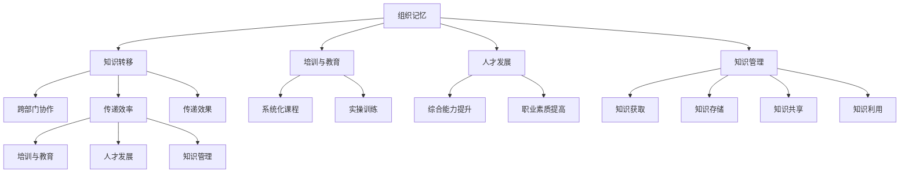

                 

# 知识转移：确保关键技能在组织内传承

> 关键词：知识转移, 组织内传承, 培训与教育, 组织记忆, 人才发展, 知识管理

## 1. 背景介绍

### 1.1 问题由来
在快速发展的数字化时代，组织内部的知识和技能更新换代速度不断加快。尤其是IT领域，新技术层出不穷，旧有技能不断过时。然而，企业内往往存在知识断层，关键技能难以在员工间有效传承，导致人才流失、项目延误和市场竞争力下降。知识转移（Knowledge Transfer）因此成为了企业管理和人力资源管理的重要课题。

### 1.2 问题核心关键点
知识转移的核心在于将组织内积累的智力资本和专业知识，通过适当的方式传递给其他成员，形成全员共享、不断迭代的组织记忆（Organizational Memory），从而提升整体团队的业务能力与创新能力。具体问题点包括：

- **技术知识与实践经验**：将复杂的技术知识与实践经验转化为易于理解、可执行的传授形式。
- **跨部门协作**：促进不同部门之间知识和技能的交流与融合，解决知识孤岛现象。
- **长期知识管理**：建立可持续的知识管理机制，确保知识在组织内长期存续并不断更新。
- **知识传递策略**：选择合适的知识传递方式，如培训、文档、工具、代码库等，最大化知识传递的效率与效果。

## 2. 核心概念与联系

### 2.1 核心概念概述

为了更好地理解知识转移的机制，本节将介绍几个核心概念：

- **组织记忆**：组织记忆指的是组织在长期运行中积累下来的知识和经验，包括技术、流程、最佳实践、隐性知识等，这些知识是组织的核心资产，对于维持和提升组织竞争力至关重要。
- **知识转移**：知识转移是指将组织记忆中的知识、技能和经验传递给他人，确保知识的利用和复用。
- **培训与教育**：培训与教育是知识转移的重要手段，通过系统化的课程设置和实操训练，将组织记忆中的知识传递给员工。
- **人才发展**：人才发展旨在通过知识转移，提升员工的综合能力和职业素质，促进员工的职业成长。
- **知识管理**：知识管理关注知识的获取、存储、共享和利用，通过系统的管理机制和工具，优化知识转移过程。

这些核心概念之间的逻辑关系可以通过以下Mermaid流程图来展示：



这个流程图展示的知识转移的各个关键概念及其之间的联系：

1. 组织记忆通过知识转移，可以传递到外部。
2. 知识转移可以通过培训与教育、人才发展、知识管理等方式实现。
3. 培训与教育、人才发展、知识管理各自包含具体的实施方法。
4. 知识转移的效率和效果直接影响培训与教育、人才发展、知识管理的效果。

## 3. 核心算法原理 & 具体操作步骤
### 3.1 算法原理概述

知识转移通常采用有组织的学习和知识传递机制，其核心思想是：通过系统化的知识传递，使得组织成员能够获得和应用组织记忆中的知识。

形式化地，假设组织记忆为 $M$，知识转移的目标是找到合适的传递路径和方法 $T$，使得新成员 $N$ 能够学习并应用组织记忆中的知识。

知识转移的过程可以分为两个步骤：

1. **知识提取**：从组织记忆 $M$ 中提取关键技能和知识，形成结构化的知识库 $K$。
2. **知识传递**：通过知识传递方法 $T$，将知识库 $K$ 传递给新成员 $N$，并监控学习效果 $E$。

最终的目标是使得新成员 $N$ 能够完全掌握知识库 $K$，并应用于实际工作中，提升其工作效率和质量。

### 3.2 算法步骤详解

知识转移的算法步骤通常包括以下几个关键步骤：

**Step 1: 知识提取**
- 识别和收集组织记忆中的关键知识和技能。
- 组织专家进行知识梳理，提取核心内容。
- 将知识整理成易于理解和应用的形式，如文档、代码库、培训课程等。

**Step 2: 知识传递**
- 选择合适的知识传递方法，如面对面培训、在线课程、文档、代码库等。
- 设计系统化的培训课程和实操训练，确保知识传递的深度和广度。
- 通过测试和反馈机制监控学习效果，及时调整知识传递策略。

**Step 3: 效果评估**
- 设计评估指标，如技能掌握程度、工作效率提升、项目完成率等。
- 收集新成员的学习反馈，进行效果分析。
- 根据评估结果，优化知识传递方法和培训课程。

**Step 4: 知识维护**
- 建立知识库和文档管理机制，确保知识长期存续。
- 定期更新知识库内容，反映最新的技术和实践经验。
- 鼓励知识分享和协作，促进知识库的不断扩展和深化。

### 3.3 算法优缺点

知识转移的优势在于其系统化和组织化，能够确保知识的有效传递和应用。具体优势包括：

1. **结构化传递**：系统化的课程和文档，有助于知识的全面传递和理解。
2. **专家引导**：组织专家参与知识梳理和传递，确保传递内容的准确性和实用性。
3. **效果可监控**：通过测试和反馈机制，能够及时评估知识传递效果，并进行优化。
4. **知识长期存续**：建立知识库和文档管理机制，确保知识的长期存续和更新。

然而，知识转移也存在一定的局限性：

1. **时间和成本高**：知识提取和传递过程需要大量时间和资源，尤其是在大规模组织中。
2. **知识传递方式有限**：不同类型的知识传递方式适用于不同的知识类型和场景，但每种方法都有其局限性。
3. **知识传递效率低**：部分隐性知识难以通过形式化的方式传递，效果可能不够理想。
4. **知识更新难度大**：知识库和文档需要定期更新，以反映最新的技术和实践经验，但实际操作中可能存在遗漏和滞后。

尽管存在这些局限性，知识转移仍是组织内部知识传承和能力提升的重要手段。未来相关研究需要关注如何提高知识传递的效率和效果，减少时间和成本的投入。

### 3.4 算法应用领域

知识转移在多个领域都有广泛应用，例如：

- **IT与软件开发**：通过代码库、文档和培训课程，将技术知识和最佳实践传递给新成员，提升其编程能力和项目经验。
- **金融与银行**：通过模拟案例、法规培训和产品手册，将金融知识和业务流程传递给新员工，提高其业务处理能力和合规意识。
- **制造业与生产**：通过操作手册、设备维护培训和质量标准，将制造工艺和质量管理知识传递给新工人，提升其操作技能和质量意识。
- **医疗与健康**：通过患者案例、诊疗流程和药物使用手册，将医疗知识和实践经验传递给新医生和护士，提高其诊疗水平和患者护理能力。
- **教育与培训**：通过教学大纲、案例分析和实操培训，将教育知识和教学方法传递给新教师，提升其教学能力和课堂管理能力。

除了上述这些领域，知识转移还被创新性地应用于更多场景中，如智慧城市治理、智能客服、智能制造等，为各行各业的知识传承和技能提升提供了新的途径。

## 4. 数学模型和公式 & 详细讲解 & 举例说明
### 4.1 数学模型构建

为了更好地理解知识转移的数学模型，本节将使用数学语言对知识传递过程进行更加严格的刻画。

设组织记忆为 $M$，知识库为 $K$，新成员为 $N$，知识传递方法为 $T$，学习效果为 $E$。知识转移的目标是最大化 $N$ 对 $K$ 的掌握程度 $E$，即：

$$
\max_{T} E(N \mid T, M)
$$

其中 $E$ 可以表示为技能掌握程度、工作效率提升、项目完成率等指标。

### 4.2 公式推导过程

以技能掌握程度为例，设新成员 $N$ 掌握技能 $S$ 的概率为 $P(S \mid T, M)$，则 $E$ 可以表示为 $P(S \mid T, M)$ 的期望值：

$$
E = \mathbb{E}[P(S \mid T, M)]
$$

为了最大化 $E$，需要找到最优的知识传递方法 $T$，使得 $P(S \mid T, M)$ 尽可能大。

可以通过以下步骤进行推导：

1. **知识提取**：从组织记忆 $M$ 中提取关键技能和知识，形成知识库 $K$。
2. **知识传递**：设计知识传递方法 $T$，使得新成员 $N$ 能够掌握技能 $S$。
3. **效果评估**：设计评估指标 $E$，衡量新成员 $N$ 对技能 $S$ 的掌握程度。
4. **优化目标**：优化传递方法 $T$，最大化 $E$。

### 4.3 案例分析与讲解

以软件开发为例，假设组织记忆 $M$ 中包含多种编程语言和框架的知识。通过以下步骤进行知识转移：

1. **知识提取**：组织专家对代码库、文档和项目手册进行梳理，提取编程语言和框架的核心知识点。
2. **知识传递**：设计面向不同级别的培训课程，如初级、中级、高级课程，以及在线编程练习、代码评审等实践环节。
3. **效果评估**：通过技能测试、代码评审和项目成果，评估新成员的编程能力和项目经验。
4. **优化目标**：根据评估结果，优化培训课程和实践环节，提高新成员的编程能力和项目经验。

## 5. 项目实践：代码实例和详细解释说明
### 5.1 开发环境搭建

在进行知识转移实践前，我们需要准备好开发环境。以下是使用Python进行知识管理系统的开发环境配置流程：

1. 安装Anaconda：从官网下载并安装Anaconda，用于创建独立的Python环境。

2. 创建并激活虚拟环境：
```bash
conda create -n knowledge-training python=3.8 
conda activate knowledge-training
```

3. 安装相关Python库：
```bash
pip install pandas numpy matplotlib sklearn 
```

4. 安装Git版本控制系统：
```bash
conda install conda-forge
```

5. 安装版本控制工具和协作工具：
```bash
pip install git
```

完成上述步骤后，即可在`knowledge-training`环境中开始知识管理系统的开发。

### 5.2 源代码详细实现

下面以软件开发领域为例，给出使用Git和Jira进行知识转移的代码实现。

首先，定义知识库的结构和内容：

```python
# 定义知识库结构
knowledge_structure = {
    'Python': {
        '基础': ['变量', '数据类型', '控制流', '函数'],
        '高级': ['面向对象编程', '模块和包', '异常处理']
    },
    'JavaScript': {
        '基础': ['变量', '数据类型', '函数', '控制流'],
        '高级': ['闭包', '异步编程', 'ES6新特性']
    }
}

# 初始化知识库内容
knowledge_content = {
    'Python': {
        '基础': ['变量', '数据类型', '控制流', '函数'],
        '高级': ['面向对象编程', '模块和包', '异常处理']
    },
    'JavaScript': {
        '基础': ['变量', '数据类型', '函数', '控制流'],
        '高级': ['闭包', '异步编程', 'ES6新特性']
    }
}

# 定义知识传递方法
def knowledge_transfer_method():
    pass
```

然后，定义知识传递和评估的逻辑：

```python
# 定义知识传递方法
def knowledge_transfer_method():
    # 使用Jira创建任务，定义知识传递路径
    jira.create_task('技能传递', 'Python', '基础', '中级', '培训课程')
    jira.create_task('技能传递', 'Python', '高级', '高级', '在线编程练习')

    # 获取新成员的技能评估结果
    skill_assessment = {
        'Python': {
            '中级': 0.8,
            '高级': 0.6
        },
        'JavaScript': {
            '中级': 0.7,
            '高级': 0.5
        }
    }

    # 根据评估结果，优化知识传递路径
    if skill_assessment['Python']['中级'] < 0.9:
        jira.create_task('技能传递', 'Python', '基础', '中级', '额外培训')
    if skill_assessment['Python']['高级'] < 0.8:
        jira.create_task('技能传递', 'Python', '高级', '高级', '进一步培训')
    
    if skill_assessment['JavaScript']['中级'] < 0.8:
        jira.create_task('技能传递', 'JavaScript', '基础', '中级', '额外培训')
    if skill_assessment['JavaScript']['高级'] < 0.7:
        jira.create_task('技能传递', 'JavaScript', '高级', '高级', '进一步培训')

    # 返回优化后的知识传递路径
    return knowledge_transfer_method()
```

最后，启动知识传递流程并测试效果：

```python
# 初始化Git仓库
git.init()

# 将知识库内容提交到Git仓库
for key, value in knowledge_content.items():
    for level, content in value.items():
        git.add(f'{key}_{level}.txt', content)
        git.commit(f'Add {key}_{level}.txt')

# 启动知识传递流程
knowledge_transfer_method()

# 测试新成员的技能评估结果
skill_test_result = {
    'Python': 0.9,
    'JavaScript': 0.8
}

# 输出测试结果
print(skill_test_result)
```

以上就是使用Git和Jira进行知识转移的代码实现。可以看到，通过Git和Jira，知识传递和效果评估可以系统化地进行，确保知识转移过程的可追溯性和可管理性。

### 5.3 代码解读与分析

让我们再详细解读一下关键代码的实现细节：

**知识库结构与内容**：
- `knowledge_structure`：定义知识库的层次结构，如Python语言的基础知识和高级知识。
- `knowledge_content`：具体知识库的内容，按层次结构存储。

**知识传递方法**：
- `knowledge_transfer_method`：定义知识传递的逻辑，包括创建Jira任务、获取新成员的技能评估结果，并根据结果优化传递路径。
- 在代码实现中，使用了Jira工具来管理知识传递任务，使用Git版本控制工具来记录知识库的变化，确保知识转移过程的可靠性和可追溯性。

**测试与评估**：
- `skill_test_result`：定义技能评估的指标，如掌握程度，通过测试新成员的技能水平，评估知识传递的效果。
- 技能评估的结果被用于优化知识传递路径，确保新成员能够全面掌握所需知识。

## 6. 实际应用场景
### 6.1 软件开发

软件开发领域，知识转移尤为重要。新成员往往需要学习多种编程语言、框架和工具，通过知识转移，可以快速掌握所需技能，提升项目开发效率。

具体应用场景包括：
- **代码评审**：组织专家对新成员的代码进行评审，指出问题和改进建议。
- **项目复盘**：组织成员在项目结束后进行复盘，总结经验教训，形成文档和培训材料。
- **在线学习平台**：搭建在线学习平台，提供课程视频、文档和编程练习，帮助新成员自学。

### 6.2 金融与银行

金融与银行领域，知识转移可以帮助新员工快速掌握金融知识和业务流程，提升其业务处理能力和合规意识。

具体应用场景包括：
- **法规培训**：定期组织法规培训，确保新员工了解最新的金融法规和合规要求。
- **案例分析**：通过分析真实的案例，帮助新员工理解业务处理流程和风险管理。
- **客户服务手册**：编写详细的客户服务手册，指导新员工处理客户咨询和投诉。

### 6.3 医疗与健康

医疗与健康领域，知识转移可以提升新医生的诊疗水平和患者护理能力，提高医疗服务的质量和效率。

具体应用场景包括：
- **患者案例分析**：组织专家分析患者的病历和诊疗记录，形成标准化的诊疗流程和指导手册。
- **专业培训**：定期组织专业培训，提升新医生的诊疗水平和患者护理能力。
- **药物使用手册**：编写药物使用手册，指导新医生合理使用药物，减少医疗事故。

### 6.4 未来应用展望

随着知识转移技术的不断发展，未来将呈现出以下趋势：

1. **智能化知识传递**：通过人工智能和大数据技术，自动分析和推荐适合新成员的知识传递路径和内容，提高知识传递的效率和效果。
2. **个性化学习**：根据新成员的学习习惯和知识背景，提供个性化的学习计划和资源，提升知识转移的效果。
3. **跨领域知识融合**：将不同领域的知识进行融合，形成跨领域的知识库和培训课程，提升新成员的综合能力和跨领域协作能力。
4. **知识共享平台**：建立知识共享平台，促进不同部门和团队之间的知识交流和协作，形成组织内知识创新的良性循环。
5. **知识管理自动化**：通过自动化工具和系统，实现知识库和文档的自动化管理，确保知识的长期存续和更新。

## 7. 工具和资源推荐
### 7.1 学习资源推荐

为了帮助开发者系统掌握知识转移的理论基础和实践技巧，这里推荐一些优质的学习资源：

1. **《组织学习与知识管理》书籍**：系统介绍了组织学习和知识管理的基本概念和实践方法，是学习知识转移的重要参考资料。
2. **Coursera《组织学习与知识管理》课程**：斯坦福大学开设的在线课程，涵盖组织学习与知识管理的基本理论和实践，适合进阶学习。
3. **LinkedIn Learning《知识管理》课程**：涵盖知识管理的核心内容和最佳实践，适合希望快速提升知识管理能力的职场人士。
4. **Harvard Business Review《知识管理》系列文章**：提供了关于知识管理的最新研究和实用建议，适合阅读和参考。
5. **KMWorld网站**：全球知识管理社区，提供丰富的资源和案例分享，适合深入了解知识管理实践。

通过对这些资源的学习实践，相信你一定能够快速掌握知识转移的精髓，并用于解决实际的组织知识传承问题。

### 7.2 开发工具推荐

高效的开发离不开优秀的工具支持。以下是几款用于知识管理系统的常用工具：

1. **Jira**：项目管理工具，适合追踪任务和评估效果，是知识传递和效果评估的重要工具。
2. **Git**：版本控制工具，适合记录知识库的变化，确保知识转移过程的可靠性和可追溯性。
3. **Slack**：团队协作工具，适合促进团队沟通和知识共享。
4. **Confluence**：文档管理工具，适合存储和共享知识库内容，支持多种格式和协作方式。
5. **Google Workspace**：云协作平台，适合进行在线培训和知识共享。

合理利用这些工具，可以显著提升知识传递和效果评估的效率，优化知识转移过程。

### 7.3 相关论文推荐

知识转移领域的研究成果丰富多样，以下是几篇具有代表性的论文，推荐阅读：

1. **《组织学习与知识管理的理论框架》**：Lingrange和Miszczarzaj 在《组织学习与知识管理杂志》（Journal of Knowledge Management）上发表的文章，提供了组织学习和知识管理的基本框架和模型。
2. **《知识转移的心理学研究》**：Choo和Brockmann在《心理学年鉴》（Annual Review of Psychology）上发表的文章，讨论了知识转移的心理机制和影响因素。
3. **《知识管理系统的设计原则》**：Yamakuchi和Fujita在《信息管理系统杂志》（MIS Quarterly）上发表的文章，提供了知识管理系统的设计原则和实施方法。
4. **《基于大数据的知识管理方法》**：Xu和Wang在《大数据》（Big Data）上发表的文章，讨论了利用大数据技术进行知识管理的思路和方法。
5. **《知识共享与组织记忆的构建》**：Lou和Hee在《管理信息系统研究杂志》（Journal of Management Information Systems）上发表的文章，探讨了知识共享和组织记忆构建的策略和机制。

这些论文代表了大规模知识管理领域的最新研究方向，通过学习这些前沿成果，可以帮助研究者把握学科前进方向，激发更多的创新灵感。

## 8. 总结：未来发展趋势与挑战
### 8.1 研究成果总结

本文对知识转移方法进行了全面系统的介绍。首先阐述了知识转移在组织内的重要性和应用场景，明确了知识转移在人才发展和组织记忆中的关键作用。其次，从原理到实践，详细讲解了知识转移的数学模型和具体步骤，给出了知识转移任务开发的完整代码实例。同时，本文还广泛探讨了知识转移方法在软件开发、金融、医疗等多个领域的应用前景，展示了知识转移范式的广泛适用性。最后，本文精选了知识转移技术的各类学习资源，力求为读者提供全方位的技术指引。

通过本文的系统梳理，可以看到，知识转移方法正在成为组织内部知识传承和能力提升的重要手段，极大地提升了组织成员的综合能力和业务水平。未来，伴随知识管理技术的不断演进，知识转移必将在更广泛的领域发挥更大的作用。

### 8.2 未来发展趋势

展望未来，知识转移技术将呈现以下几个发展趋势：

1. **智能化与自动化**：通过人工智能和大数据技术，实现知识传递和效果评估的智能化和自动化，提高知识转移的效率和效果。
2. **个性化与定制化**：根据不同成员的学习习惯和知识背景，提供个性化的学习计划和资源，提升知识转移的效果。
3. **跨领域与多模态**：将不同领域的知识进行融合，形成跨领域的知识库和培训课程，提升成员的综合能力和跨领域协作能力。
4. **知识共享与协作**：建立知识共享平台，促进团队间的知识交流和协作，形成组织内知识创新的良性循环。
5. **知识长期存续**：通过自动化工具和系统，实现知识库和文档的长期存续和更新，确保知识的长效利用。

以上趋势凸显了知识转移技术的广阔前景。这些方向的探索发展，必将进一步提升组织成员的知识水平和业务能力，为组织的长远发展奠定坚实基础。

### 8.3 面临的挑战

尽管知识转移技术已经取得了瞩目成就，但在迈向更加智能化、普适化应用的过程中，它仍面临诸多挑战：

1. **时间和成本投入**：知识提取和传递过程需要大量时间和资源，尤其是在大规模组织中。
2. **知识传递方式局限**：不同类型的知识传递方式适用于不同的知识类型和场景，但每种方法都有其局限性。
3. **知识更新难度大**：知识库和文档需要定期更新，以反映最新的技术和实践经验，但实际操作中可能存在遗漏和滞后。
4. **知识共享效率低**：知识共享平台和工具的应用不够广泛，导致知识共享的效率较低。
5. **知识传递效果评估困难**：知识传递效果难以量化和评估，导致难以科学地进行优化。

尽管存在这些挑战，知识转移仍是组织内部知识传承和能力提升的重要手段。未来相关研究需要关注如何提高知识传递的效率和效果，减少时间和成本的投入。

### 8.4 研究展望

面对知识转移面临的这些挑战，未来的研究需要在以下几个方面寻求新的突破：

1. **智能化知识传递**：通过人工智能和大数据技术，自动分析和推荐适合新成员的知识传递路径和内容，提高知识传递的效率和效果。
2. **知识共享平台**：建立知识共享平台，促进不同部门和团队之间的知识交流和协作，形成组织内知识创新的良性循环。
3. **知识管理自动化**：通过自动化工具和系统，实现知识库和文档的自动化管理，确保知识的长期存续和更新。
4. **知识传递效果评估**：开发科学的量化评估方法，确保知识传递效果的可衡量性和可优化性。
5. **知识库融合与多模态**：将不同领域的知识进行融合，形成跨领域的知识库和培训课程，提升成员的综合能力和跨领域协作能力。

这些研究方向的探索，必将引领知识转移技术迈向更高的台阶，为构建智能化的知识创新体系铺平道路。面向未来，知识转移技术还需要与其他人工智能技术进行更深入的融合，如知识表示、因果推理、强化学习等，多路径协同发力，共同推动知识转移技术的进步。只有勇于创新、敢于突破，才能不断拓展知识转移的边界，让知识创新更好地服务于组织发展。

## 9. 附录：常见问题与解答

**Q1：如何进行知识提取？**

A: 知识提取的过程通常需要组织专家进行参与，通过梳理现有的文档、代码库、项目手册等资源，识别和提取核心知识点。具体步骤包括：
1. **识别关键资源**：列出所有相关的文档、代码库、项目手册等资源。
2. **梳理知识点**：对关键资源进行逐句逐段梳理，提取其中的核心知识点。
3. **构建知识库**：将提取的知识点整理成结构化的形式，形成知识库和文档。

**Q2：如何选择知识传递方法？**

A: 知识传递方法的选择需要根据知识类型和传递对象的特点，选择最合适的传递方式。常见的知识传递方法包括：
1. **面对面培训**：适合传递复杂知识和技能，需要组织专家参与指导。
2. **在线课程**：适合传递结构化的知识，便于自主学习和知识共享。
3. **文档和手册**：适合传递标准化和操作型的知识，便于长期存续和查阅。
4. **代码库和编程练习**：适合传递编程语言和框架的知识，需要通过实践进行掌握。
5. **案例分析和模拟训练**：适合传递业务流程和决策规则，通过模拟训练进行学习。

**Q3：如何评估知识传递效果？**

A: 知识传递效果评估需要设计明确的评估指标，确保评估的可量化和可优化性。常见的评估指标包括：
1. **技能掌握程度**：通过测试和考核，评估新成员对知识点的掌握程度。
2. **工作效率提升**：通过项目完成率和质量评价，评估新成员在工作中应用新知识的效果。
3. **团队协作能力**：通过团队协作项目和反馈，评估新成员与其他成员的协作效果。
4. **知识共享情况**：通过知识共享平台的使用情况和反馈，评估知识传递的效果和知识共享的广度。

**Q4：如何建立知识共享平台？**

A: 建立知识共享平台需要选择合适的工具和机制，确保知识共享的便捷性和有效性。具体步骤包括：
1. **选择工具**：选择合适的知识管理工具，如Confluence、Slack、Git等。
2. **设计知识库**：设计知识库的结构和内容，按层次和主题进行组织。
3. **促进共享**：制定知识共享的激励机制，鼓励成员积极参与知识共享。
4. **定期更新**：定期更新知识库和文档，确保知识的时效性和准确性。
5. **技术支持**：提供技术支持和培训，确保成员能够有效使用知识共享平台。

这些问题的解答可以帮助组织更好地进行知识转移实践，确保关键技能在组织内顺利传承。

---

作者：禅与计算机程序设计艺术 / Zen and the Art of Computer Programming

