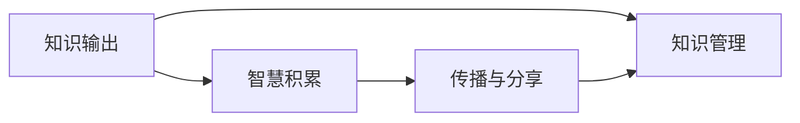
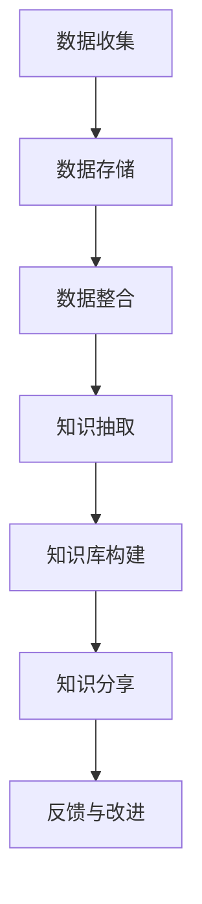

                 

# 知识输出与管理智慧的积累和传播

## 1. 背景介绍

在当今信息爆炸的时代，知识管理不仅是个体终身学习的关键，也是组织在竞争中保持优势的基石。无论是在学术研究、企业运营还是个人成长中，有效地积累和传播知识，都是提升能力和效率的根本途径。本文旨在探讨如何通过知识输出与管理，实现智慧的积累与传播，提升个人及组织的学习与创新能力。

## 2. 核心概念与联系

### 2.1 核心概念概述

- **知识输出 (Knowledge Output)**：指的是个体或组织通过写作、演讲、教学等方式，将所学知识分享出去，以便他人可以借鉴和使用。
- **知识管理 (Knowledge Management)**：指组织通过系统化的策略和方法，对知识资源进行收集、存储、传播和应用，以支持组织的学习、创新和业务发展。
- **智慧积累 (Accumulation of Wisdom)**：是指通过不断学习和实践，积累经验与洞察，提升解决问题的能力和决策质量。
- **传播与分享 (Dissemination and Sharing)**：指的是将个人或组织的见解、经验和成果与他人交流，实现知识的最大化利用。

这些核心概念通过以下几个逻辑关联的图，展示了知识输出、知识管理、智慧积累与传播之间的内在联系：



知识输出是智慧积累和传播的前提和起点，知识管理则是支持知识有效收集、存储和传播的基础，智慧积累和传播则是对知识管理成效的体现和促进。

### 2.2 核心概念原理和架构的 Mermaid 流程图

以下是一个简单的流程图，展示了知识管理的基本流程：



**数据收集**：收集来自不同来源的信息，包括文献、网络资源、实验数据等。
**数据存储**：通过数据库、文档管理系统等工具，将数据安全存储。
**数据整合**：通过ETL工具，将数据进行清洗、转换和加载，便于后续处理。
**知识抽取**：运用自然语言处理、机器学习等技术，从大量数据中提取有用信息。
**知识库构建**：将提取的知识整合并存储到知识库中，供检索和应用。
**知识分享**：通过报告、论文、在线课程等方式，分享知识库中的信息。
**反馈与改进**：通过用户的反馈，持续改进知识管理流程。

## 3. 核心算法原理 & 具体操作步骤

### 3.1 算法原理概述

知识管理涉及到的算法和技术多种多样，包括但不限于：

- **自然语言处理 (NLP)**：用于知识抽取和文本挖掘。
- **机器学习与数据挖掘**：用于模式发现和数据整合。
- **信息检索 (IR)**：用于高效检索知识库中的信息。
- **推荐系统**：用于个性化推荐相关知识。

这些算法和技术，通过数据驱动的方式，帮助实现知识的系统化管理与高效传播。

### 3.2 算法步骤详解

知识管理的一般步骤包括：

1. **数据收集与整合**：
   - 使用ETL工具进行数据清洗、转换和加载。
   - 整合来自不同来源的数据，构建统一的知识库。

2. **知识抽取与存储**：
   - 使用NLP技术进行实体抽取、关系抽取、情感分析等。
   - 将提取的知识存储到知识库中，构建知识图谱。

3. **知识检索与共享**：
   - 使用信息检索技术，实现知识库的快速检索。
   - 提供搜索、浏览、下载等知识共享方式，便于知识传播。

4. **反馈与改进**：
   - 收集用户对知识库的反馈，分析用户行为和知识应用效果。
   - 持续优化知识管理流程，提升知识库的质量和可用性。

### 3.3 算法优缺点

**优点**：
- **效率高**：自动化处理大量数据，提升知识管理效率。
- **质量高**：通过算法抽取和整合知识，提升知识质量。
- **应用广**：涵盖多个领域的知识管理需求，适用范围广泛。

**缺点**：
- **复杂度高**：需要多种技术和工具的集成，实现难度大。
- **依赖数据**：知识质量高度依赖数据的质量和完整性。
- **用户习惯**：需要用户习惯知识管理工具的使用，推广难度大。

### 3.4 算法应用领域

知识管理技术可以应用于多个领域，包括但不限于：

- **企业知识管理**：通过知识库、协作平台等工具，提升企业创新能力。
- **学术研究管理**：使用数据抽取和分析工具，支持科研项目的推进。
- **教育知识管理**：利用在线学习平台，构建知识共享和传播机制。
- **公共知识管理**：通过政府信息公开平台，提供公共服务的知识支撑。

## 4. 数学模型和公式 & 详细讲解 & 举例说明

### 4.1 数学模型构建

知识管理的数学模型通常包括数据模型、知识模型和传播模型。以学术研究为例，可以使用以下数学模型：

**数据模型**：
- 描述数据的结构和属性，如数据的来源、类型、格式等。
- 可以使用元数据模型（Metadata Model），记录数据的详细信息。

**知识模型**：
- 描述知识的表示方式，如知识图谱、本体论等。
- 可以使用图结构（Graph Structure），表示知识元素之间的关联关系。

**传播模型**：
- 描述知识的传播路径和效果，如推荐算法、传播网络等。
- 可以使用复杂网络（Complex Network），表示知识传播的网络结构。

### 4.2 公式推导过程

以知识图谱为例，假设有知识图谱 $G=(V,E)$，其中 $V$ 是节点集，$E$ 是边集。每个节点 $v_i$ 表示一个知识元素，每个边 $e_{ij}$ 表示知识元素之间的关系。

**节点表示**：
- 节点 $v_i$ 的向量表示为 $\mathbf{v_i} = [v_{i1}, v_{i2}, ..., v_{in}]$，其中 $v_{ik}$ 表示节点 $v_i$ 的第 $k$ 个属性值。

**边表示**：
- 边 $e_{ij}$ 的向量表示为 $\mathbf{e_{ij}} = [e_{ij1}, e_{ij2}, ..., e_{ijn}]$，其中 $e_{ijk}$ 表示节点 $v_i$ 和 $v_j$ 之间的关系属性。

**知识传播模型**：
- 假设知识传播服从马尔可夫链，节点 $v_i$ 到 $v_j$ 的概率为 $P(v_i \rightarrow v_j)$，则传播矩阵 $P$ 可以表示为：
  $$
  P = \begin{bmatrix}
  0 & P(v_1 \rightarrow v_2) & \cdots & P(v_1 \rightarrow v_n) \\
  P(v_2 \rightarrow v_1) & 0 & \cdots & P(v_2 \rightarrow v_n) \\
  \vdots & \vdots & \ddots & \vdots \\
  P(v_n \rightarrow v_1) & P(v_n \rightarrow v_2) & \cdots & 0
  \end{bmatrix}
  $$

### 4.3 案例分析与讲解

以Google Scholar为例，Google Scholar使用自然语言处理技术，从学术论文中抽取信息，构建知识图谱。用户可以通过搜索和浏览，发现相关的研究论文和引用关系。系统还使用推荐算法，根据用户的历史行为和兴趣，推荐相关论文和作者。

通过这种知识管理方式，Google Scholar极大地提升了学术研究的效率和质量，同时也促进了知识的传播和交流。

## 5. 项目实践：代码实例和详细解释说明

### 5.1 开发环境搭建

知识管理项目开发需要依赖多个开源工具和库，如ELK Stack、TensorFlow、PyTorch等。以下是基本的开发环境搭建步骤：

1. 安装ELK Stack：
   ```bash
   wget https://artifacts.elastic.co/downloads/elasticsearch/elasticsearch-7.14.1.tar.gz
   tar -xvf elasticsearch-7.14.1.tar.gz
   cd elasticsearch-7.14.1
   bin/elasticsearch -d
   ```

2. 安装TensorFlow和PyTorch：
   ```bash
   pip install tensorflow==2.9.0
   pip install torch==1.11.0+cu116
   ```

3. 配置开发环境：
   ```bash
   source ~/.bashrc
   conda activate pytorch-env
   ```

### 5.2 源代码详细实现

以知识图谱构建为例，使用Python和Neo4j进行实现：

1. 安装Neo4j和Py2neo：
   ```bash
   pip install neo4j==4.7.0
   pip install py2neo==4.7.0
   ```

2. 构建知识图谱：
   ```python
   from py2neo import Graph, Node, Relationship

   graph = Graph("bolt://localhost:7687", auth=("neo4j", "password"))
   db = graph.database

   # 创建节点和关系
   author_node = Node("Person", name="Bob")
   paper_node = Node("Paper", title="Machine Learning")
   relationship = Relationship(author_node, "WRITES", paper_node)

   # 将节点和关系添加到数据库
   db.create(author_node)
   db.create(paper_node)
   db.create(relationship)
   ```

### 5.3 代码解读与分析

**代码解读**：
- 使用Py2neo库连接Neo4j数据库。
- 创建节点和关系，并添加到数据库中。
- 通过自然语言处理技术，从文本中抽取实体和关系。

**分析**：
- Py2neo库提供了便捷的接口，用于连接和操作Neo4j数据库。
- 使用关系型数据库存储知识图谱，便于后续的检索和查询。
- 自然语言处理技术可以自动从文本中提取实体和关系，提升知识图谱构建的效率和准确性。

### 5.4 运行结果展示

运行上述代码，可以在Neo4j数据库中创建知识图谱：

```sql
MATCH (a:Person)-[:WRITES]->(p:Paper)
RETURN a.name, p.title
```

结果：
```json
{
  "rows" : [
    {
      "_fields" : [ "name", "title" ],
      "_values" : [ "Bob", "Machine Learning" ]
    }
  ]
}
```

## 6. 实际应用场景

### 6.1 企业知识管理

企业知识管理是知识管理的典型应用场景之一。通过建立企业知识库、协作平台等，可以有效提升企业的学习效率和创新能力。例如，某大型科技公司通过知识管理平台，实现了知识共享和协作，提升了研发团队的效率和创新成果。

### 6.2 教育知识管理

教育知识管理是指通过在线学习平台，提供知识共享和传播机制，支持学生的学习和教师的教学。例如，Coursera等在线教育平台通过知识图谱和推荐算法，提供个性化的学习路径，提升学习效果。

### 6.3 公共知识管理

公共知识管理是指通过政府信息公开平台，提供公共服务的知识支撑。例如，上海市政府通过知识图谱技术，实现了市民政策的智能检索和问答系统，提升了政务服务的效率和质量。

### 6.4 未来应用展望

未来，知识管理技术将在更多的领域得到应用，如医疗知识管理、金融知识管理等。通过知识图谱和推荐算法，可以实现智能化的知识管理和传播，提升各个行业的效率和创新能力。

## 7. 工具和资源推荐

### 7.1 学习资源推荐

- **《知识管理》 (Knowledge Management) by Michael DW Smith**：全面介绍了知识管理的理论和方法。
- **《数据科学与知识管理》 (Data Science and Knowledge Management) by Dr. Siddhesh Puntambekar**：结合数据科学和知识管理，提供了系统的知识管理实践。
- **Coursera《信息检索与知识管理》课程**：由加州大学欧文分校教授主讲，涵盖信息检索和知识管理的核心内容。
- **Kaggle《知识图谱构建》竞赛**：通过实践项目，掌握知识图谱构建和应用。

### 7.2 开发工具推荐

- **ELK Stack**：用于构建分布式日志和监控系统。
- **TensorFlow & PyTorch**：深度学习框架，支持大规模数据处理和复杂模型构建。
- **Py2neo & Neo4j**：图形数据库，支持知识图谱的存储和查询。
- **Jupyter Notebook**：交互式编程环境，支持Python和R语言。

### 7.3 相关论文推荐

- **《知识图谱构建与表示》 (Knowledge Graph Construction and Representation)**：清华大学王益民教授等，系统介绍了知识图谱的构建和应用。
- **《信息检索理论与方法》 (Theory and Methods of Information Retrieval)**：陈新等，提供了信息检索的全面理论和方法。
- **《基于知识图谱的推荐系统》 (Knowledge-Based Recommendation System)**：华中科技大学孙国峰教授等，介绍了基于知识图谱的推荐算法。

## 8. 总结：未来发展趋势与挑战

### 8.1 研究成果总结

知识管理技术在过去几十年的发展中，取得了显著的成果，广泛应用于学术研究、企业运营和公共服务等领域。通过系统化的知识管理，提升了个体和组织的学习与创新能力，推动了知识的传播和利用。

### 8.2 未来发展趋势

未来，知识管理技术将继续快速发展，呈现以下几个趋势：

1. **智能化与自动化**：通过AI技术，实现知识管理流程的智能化和自动化，提升效率和质量。
2. **多模态融合**：结合文本、图像、视频等多模态数据，构建更全面的知识表示。
3. **跨领域应用**：拓展知识管理技术的应用领域，如医疗、金融、教育等。
4. **协作与共享**：支持跨组织、跨领域的知识协作与共享，构建全球知识网络。
5. **伦理与安全**：加强知识管理的伦理和安全保障，确保数据和知识的安全。

### 8.3 面临的挑战

知识管理技术虽然发展迅速，但仍面临以下挑战：

1. **数据质量**：知识管理的质量高度依赖于数据的质量，如何获取高质量的数据是关键问题。
2. **复杂度**：知识管理的复杂度较高，需要多学科、多技术的整合。
3. **用户习惯**：需要改变用户的知识管理习惯，推广知识管理的工具和平台。
4. **技术更新**：知识管理技术快速发展，需要持续更新和学习。
5. **伦理问题**：需要解决知识管理的伦理问题，确保数据和知识的安全与公平。

### 8.4 研究展望

未来，知识管理技术需要从以下几个方向进行探索：

1. **知识图谱技术**：研究更高效的图谱构建和查询算法。
2. **自然语言处理**：提升自然语言处理技术的准确性和鲁棒性。
3. **推荐系统**：研究更智能化的推荐算法，支持个性化知识传播。
4. **多模态知识管理**：研究如何融合多模态数据，提升知识管理的深度和广度。
5. **用户参与**：研究如何更好地引导用户参与知识管理，提升用户的积极性。

## 9. 附录：常见问题与解答

**Q1: 如何构建一个有效的知识管理平台？**

A: 构建一个有效的知识管理平台需要以下步骤：
1. 确定知识管理的目标和需求。
2. 选择适合的知识管理工具和平台。
3. 设计和实施知识管理流程。
4. 定期评估和优化知识管理的效果。

**Q2: 如何确保知识管理平台的安全性？**

A: 确保知识管理平台的安全性需要以下措施：
1. 数据加密和访问控制。
2. 定期进行安全审计和漏洞扫描。
3. 用户身份认证和权限管理。
4. 建立灾难恢复和应急响应机制。

**Q3: 知识管理与信息检索的区别是什么？**

A: 知识管理与信息检索的主要区别在于：
1. 目标不同：信息检索的主要目标是快速找到相关的信息，而知识管理的目标是管理和传播知识。
2. 内容不同：信息检索主要处理数据和事实，而知识管理处理的是知识结构和关系。
3. 应用场景不同：信息检索广泛应用于搜索引擎和数据库，而知识管理应用于学术研究、企业运营等。

**Q4: 如何评估知识管理的有效性？**

A: 评估知识管理的有效性需要以下指标：
1. 知识库的质量和覆盖率。
2. 知识检索的速度和准确性。
3. 知识传播和共享的效率。
4. 用户对知识管理的满意度和参与度。

**Q5: 知识管理的未来发展方向是什么？**

A: 知识管理的未来发展方向包括：
1. 智能化和自动化。
2. 多模态融合。
3. 跨领域应用。
4. 协作与共享。
5. 伦理与安全。

---

作者：禅与计算机程序设计艺术 / Zen and the Art of Computer Programming

