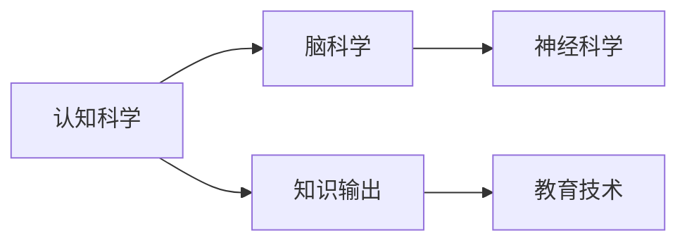

                 

# 知识输出：提高学习效率的法宝

> 关键词：知识输出,学习效率,认知科学,脑科学,神经科学,教育技术

## 1. 背景介绍

在信息爆炸的时代，知识的获取变得越来越容易，但如何高效地吸收、整合、应用这些知识，仍然是一个挑战。知识的输出不仅是一种学习的输出，更是一种输入，能够帮助大脑建立更强的关联和连接，从而进一步提升学习效率。本文章将深入探讨知识输出的原理、方法和应用，为提高学习效率提供法宝。

## 2. 核心概念与联系

### 2.1 核心概念概述

在探讨知识输出之前，我们先了解几个核心概念：

- **知识输出（Knowledge Output）**：指将所学知识通过书写、讲解、演示等方式，进行系统性输出的行为。知识输出不仅巩固了已学内容，还通过回顾、总结、解释等过程，加深了对知识点的理解和掌握。
- **认知科学（Cognitive Science）**：研究人类思维和认知过程的科学，重点关注信息如何在大脑中被处理、存储和应用。
- **脑科学（Neuroscience）**：研究大脑结构和功能的科学，通过揭示神经元如何相互沟通和运作，解释认知过程。
- **神经科学（Neuroscience）**：专注于大脑神经网络如何处理信息和学习的科学，包括记忆、学习、注意力等机制。
- **教育技术（Educational Technology）**：利用信息技术改善教育过程和学习成果的技术和工具。

这些概念通过Mermaid流程图进行联系展示：



认知科学为脑科学和神经科学提供了理论基础，而脑科学和神经科学进一步揭示了认知过程的生理机制。知识输出作为认知科学的应用之一，结合教育技术的支持，有效提升了学习效率。

## 3. 核心算法原理 & 具体操作步骤

### 3.1 算法原理概述

知识输出的核心算法原理基于**费曼学习法**（Feynman Technique），由诺贝尔奖得主理查德·费曼提出，核心思想是通过教学他人来巩固和深化自己的知识。其原理和步骤可以分为：

1. **理解与简化**：首先对复杂概念进行深入理解，并将其简化为易懂的语言。
2. **系统性输出**：通过教学、写作、讲解等方式，系统性地输出所学知识。
3. **回顾与巩固**：通过与他人的交流和反馈，回顾并巩固自己的理解。
4. **持续改进**：不断调整和优化输出的内容，确保清晰和准确。

### 3.2 算法步骤详解

以下详细讲解费曼学习法的步骤：

1. **选择合适的知识点**：挑选一个需要深入理解的知识领域。
2. **理解与简化**：
   - 深度学习这个领域的概念，直到自己可以理解并解释。
   - 将复杂概念转化为易于理解的语言。
3. **系统性输出**：
   - 用简单的语言描述这个概念，尽可能避免使用专业术语。
   - 将输出内容整理成结构化的文本、图表或讲解视频等形式。
4. **回顾与巩固**：
   - 找一位不太了解该领域的听众，如朋友或同事，给他们讲解这个概念。
   - 听取他们的反馈，并根据反馈进行调整和补充。
5. **持续改进**：
   - 将反馈整理后，重新审视和优化输出内容。
   - 不断重复上述步骤，直到自己能够清楚、准确地讲解该知识。

### 3.3 算法优缺点

**优点**：
- **深度理解**：通过讲解他人，加深了对知识点的理解。
- **结构化思考**：系统性输出有助于构建知识框架，便于记忆和应用。
- **反馈机制**：他人的反馈提供了不同视角，帮助发现和纠正错误。

**缺点**：
- **时间成本**：系统性输出和反馈需要时间，适合有较多空闲时间的情况。
- **可能存在误解**：由于语言和表达的局限性，可能存在误解和偏差。
- **依赖他人**：需要找到合适的听众，特别是在线学习时可能不太方便。

### 3.4 算法应用领域

知识输出技术不仅适用于学术研究，还广泛应用于教育、工程、商业等多个领域。具体应用场景包括：

- **学术研究**：科研人员通过撰写论文、报告等方式，输出研究成果，接受同行评审，进一步完善和深化理解。
- **工程设计**：工程师通过编写技术文档、讲解方案等方式，输出设计思路和实现细节，提升团队协作效率。
- **商业培训**：销售、管理等职位需要不断学习和输出，通过培训课程、会议讲解等方式，提升团队能力。
- **个人学习**：学生和自学者通过编写笔记、写博客、讲解视频等方式，巩固和深化所学知识，促进长期记忆。

## 4. 数学模型和公式 & 详细讲解 & 举例说明

### 4.1 数学模型构建

在知识输出过程中，可以使用数学模型来辅助理解和表达。以下是一个简单的知识输出的数学模型：

$$
\text{知识输出效果} = f(\text{理解深度}, \text{表达清晰度}, \text{听众理解度}, \text{反馈质量})
$$

其中：
- **理解深度**：对知识的理解和掌握程度，影响输出的准确性和深度。
- **表达清晰度**：将复杂概念简化为易于理解的语言，影响输出的易接受性和传播效率。
- **听众理解度**：听众对输出的理解和反馈，影响输出的改进方向和效果。
- **反馈质量**：反馈的及时性、准确性和建设性，影响输出的调整和优化。

### 4.2 公式推导过程

假设知识输出效果为 $E$，我们可以根据上式，对每个变量进行量化和分析。例如：

- **理解深度**：$U = \frac{1}{\sqrt{\text{学习时间}}}$
- **表达清晰度**：$C = \text{语言复杂性} \times \text{解释频率}$
- **听众理解度**：$L = \frac{1}{\text{反馈延迟}}$
- **反馈质量**：$F = \text{反馈准确性} \times \text{改进建议}

通过数学推导，我们可以得出：

$$
E = f\left(\frac{1}{\sqrt{\text{学习时间}}}, \text{语言复杂性} \times \text{解释频率}, \frac{1}{\text{反馈延迟}}, \text{反馈准确性} \times \text{改进建议}\right)
$$

### 4.3 案例分析与讲解

**案例一：深度学习模型解释**

- **背景**：一名深度学习工程师需要向非技术人员解释卷积神经网络（CNN）的工作原理。
- **过程**：
  1. **理解与简化**：深入学习CNN的工作机制，将其简化为图像识别过程。
  2. **系统性输出**：
    - 文本形式：“CNN 是一种通过多层滤波器提取图像特征的模型，每层滤波器可以识别不同的特征。”
    - 图表形式：绘制CNN结构图，标注各层的滤波器大小和数量。
  3. **回顾与巩固**：
    - 向同事讲解CNN的图像识别过程，并听取反馈。
    - 根据反馈调整语言和解释方法，确保非技术人员能够理解。
  4. **持续改进**：
    - 通过不断优化解释内容和图表，逐步提升输出效果。

## 5. 项目实践：代码实例和详细解释说明

### 5.1 开发环境搭建

要实现知识输出，我们需要搭建一个开发环境，包括：

1. **软件工具**：如Office、Google Docs、Markdown编辑器等，用于编写和输出文本。
2. **视频工具**：如Zoom、Skype等，用于实时视频讲解和录制讲解视频。
3. **代码管理工具**：如Git、GitHub等，用于版本控制和管理输出内容。

### 5.2 源代码详细实现

以下是一个简单的知识输出的示例代码：

```python
# 知识输出示例代码
# 定义一个函数，输出深度学习的基本概念

def explain_deep_learning():
    # 理解与简化
    # 深入学习深度学习的核心概念，包括神经网络、激活函数、损失函数等
    # 将复杂概念转化为易于理解的语言
    
    # 系统性输出
    # 使用Markdown格式编写知识输出内容，并保存到文件中
    output_content = """
    深度学习是一种通过多层神经网络进行学习的技术，能够处理复杂的非线性问题。
    主要包括以下组件：
    - 神经网络：由多个层次的神经元组成，通过前向传播和反向传播更新参数。
    - 激活函数：如ReLU，用于引入非线性变化，激活神经元。
    - 损失函数：如均方误差，用于衡量模型预测与真实标签的差异。
    """
    with open('output.md', 'w') as f:
        f.write(output_content)
    
    # 系统性输出
    # 使用Git版本控制，管理输出内容的变化
    git add output.md
    git commit -m "新增深度学习解释"
    
    # 回顾与巩固
    # 使用视频工具录制讲解视频，并分享给同事
    record_video('explain_deep_learning.mp4')
    
    # 持续改进
    # 根据同事反馈，优化输出内容和视频
    # 不断调整和完善，直至达到满意的输出效果
    
if __name__ == "__main__":
    explain_deep_learning()
```

### 5.3 代码解读与分析

代码中，我们使用了Python、Markdown、Git等工具，实现了知识输出的全过程。主要步骤如下：

1. **理解与简化**：深入学习深度学习的核心概念，并将复杂概念转化为易于理解的语言。
2. **系统性输出**：使用Markdown格式编写知识输出内容，并保存到文件中，使用Git版本控制，管理输出内容的变化。
3. **回顾与巩固**：使用视频工具录制讲解视频，并分享给同事，根据同事反馈，优化输出内容和视频。
4. **持续改进**：不断调整和完善，直至达到满意的输出效果。

## 6. 实际应用场景

### 6.1 教育培训

在教育培训领域，知识输出成为重要的教学手段。教师可以通过讲解、示范等方式，帮助学生理解复杂概念，促进深度学习。例如，数学教师可以系统性地讲解微积分的导数、积分等概念，并结合实际案例进行讲解和演示。

### 6.2 技术分享

在技术分享和交流中，知识输出同样重要。工程师和科学家可以通过讲解项目、分享论文等方式，促进技术传播和创新。例如，人工智能研究者可以通过讲解深度学习模型的工作原理，促进跨领域的交流和合作。

### 6.3 项目管理

在项目管理中，知识输出帮助团队理解和协同工作。项目经理可以通过编写项目文档、讲解项目方案等方式，确保团队成员理解项目目标和任务，提升团队协作效率。

### 6.4 未来应用展望

未来，随着知识输出的应用场景不断扩展，以下趋势值得关注：

1. **自动化工具**：开发更多的自动化工具，帮助知识输出更高效、更规范。
2. **多模态输出**：结合图像、视频等多模态形式，提升知识输出的表现力。
3. **智能化推荐**：通过智能推荐系统，推荐适合的知识点和输出方式，提高学习效率。
4. **个性化输出**：根据学习者的知识水平和兴趣，生成个性化的知识输出方案。

## 7. 工具和资源推荐

### 7.1 学习资源推荐

为了提高知识输出能力，以下是一些推荐的学习资源：

1. **费曼学习法书籍**：如《费曼学习法》、《如何阅读一本书》等，深入理解费曼学习法的原理和应用。
2. **在线课程**：如Coursera、edX等平台上的深度学习、认知科学等相关课程，提升知识输出能力。
3. **视频讲解**：如TED Talks、Khan Academy等平台上的讲解视频，学习优秀的知识输出范例。
4. **博客和文章**：如Medium、知乎等平台上的技术博客和文章，提升写作和表达能力。

### 7.2 开发工具推荐

以下推荐的开发工具，有助于实现知识输出的全过程：

1. **文本编辑器**：如Visual Studio Code、Atom等，支持Markdown格式和Git版本控制。
2. **视频录制工具**：如Zoom、Skype等，用于实时视频讲解和录制讲解视频。
3. **项目管理工具**：如Jira、Trello等，管理知识输出任务的进度和成果。

### 7.3 相关论文推荐

以下是一些关于知识输出和认知科学的经典论文：

1. **费曼学习法论文**：如Richard Feynman的《费曼物理讲义》等，深入探讨费曼学习法的原理和实践。
2. **认知科学论文**：如Dunlosky等人的《有效的学习策略》等，系统总结了有效的学习策略和知识输出方法。
3. **脑科学论文**：如George Miller的《神奇的数字7±2：我们加工信息的范围》等，揭示认知过程的神经机制。
4. **教育技术论文**：如Paulo Freire的《教育中的对话》等，探讨知识输出在教育中的应用和效果。

## 8. 总结：未来发展趋势与挑战

### 8.1 总结

本文深入探讨了知识输出的原理、方法和应用，为提高学习效率提供了宝贵的指导。知识输出不仅巩固了已学知识，还通过系统性输出和反馈机制，进一步提升了学习效果。通过结合认知科学和脑科学的研究成果，我们更好地理解了知识输出的内在机制，为未来的学习和教学提供了科学的依据。

### 8.2 未来发展趋势

1. **自动化工具**：随着AI技术的进步，未来将开发更多的自动化工具，帮助知识输出更高效、更规范。
2. **多模态输出**：结合图像、视频等多模态形式，提升知识输出的表现力和应用范围。
3. **智能化推荐**：通过智能推荐系统，推荐适合的知识点和输出方式，提高学习效率。
4. **个性化输出**：根据学习者的知识水平和兴趣，生成个性化的知识输出方案。

### 8.3 面临的挑战

1. **时间和精力**：知识输出需要大量的时间和精力，适合有一定空闲时间的情况。
2. **表达和理解**：由于语言和表达的局限性，可能存在误解和偏差。
3. **依赖他人**：需要找到合适的听众，特别是在线学习时可能不太方便。
4. **反馈机制**：如何有效获取和利用反馈，优化知识输出效果，仍是一个挑战。

### 8.4 研究展望

未来，知识输出的研究将在以下几个方向继续深入：

1. **脑机接口**：利用脑机接口技术，直接读取大脑信号，优化知识输出的效果。
2. **自然语言处理**：通过自然语言处理技术，生成更精准、更易于理解的知识输出内容。
3. **交互式系统**：开发交互式知识输出系统，如虚拟助手，实时获取和利用反馈，提升输出效果。
4. **跨文化应用**：结合跨文化研究，开发适用于不同文化背景的知识输出策略。

## 9. 附录：常见问题与解答

### Q1: 知识输出是否适用于所有类型的知识？

A: 知识输出主要适用于需要系统性理解和表达的复杂概念，如科学原理、技术细节、文化历史等。对于简单的、易于记忆的知识，如数学公式、单词列表等，可能不需要过多的输出。

### Q2: 知识输出需要多长时间才能见效？

A: 知识输出的效果因人而异，一般需要多次输出和反馈才能见效。建议每周安排一定时间进行知识输出，逐步提升效果。

### Q3: 知识输出是否需要每次都写详细的文档？

A: 不必每次都写详细的文档，可以逐步简化输出内容。初期可以详细输出，逐步过渡到简略输出。

### Q4: 知识输出是否适用于线上学习？

A: 知识输出完全适用于线上学习，可以通过录制视频、编写博客等方式，进行知识输出和分享。

---

作者：禅与计算机程序设计艺术 / Zen and the Art of Computer Programming

