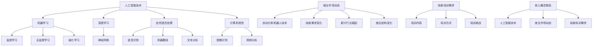

                 

### 1. 背景介绍（Background Introduction）

随着人工智能技术的飞速发展，我们正进入一个全新的时代——AI时代。在这个时代，人工智能不仅在理论上取得了重大突破，更在实践中展现出了巨大的潜力。AI技术正在逐渐融入各个行业，从医疗、金融、教育到制造、零售、交通等，都在广泛应用AI技术，提高效率、降低成本、提升用户体验。

然而，随着AI技术的普及，也对就业市场产生了深远的影响。一方面，AI技术的应用将替代一部分传统的工作岗位，如重复性的、简单的劳动密集型工作；另一方面，AI技术的普及也创造了新的就业机会，特别是在数据处理、算法优化、AI产品开发等高技能领域。这种转变，对人类的职业规划和技能培训提出了新的挑战。

本文旨在探讨AI时代未来就业市场的变化趋势，分析技能培训的机遇与挑战，并从人工智能专家的角度提出一些建议。文章将分为以下几个部分：首先，我们将介绍AI时代的背景和现状；然后，分析未来就业市场的变化趋势；接着，探讨技能培训的机遇与挑战；最后，提出一些建议，帮助人们更好地应对AI时代的变化。

在接下来的部分，我们将逐步深入探讨这些问题，结合实际案例和数据，分析AI时代给就业市场带来的影响，以及我们应该如何准备和应对这些变化。让我们一起思考，共同迎接这个充满机遇和挑战的新时代。

## Background Introduction

With the rapid development of artificial intelligence (AI) technology, we are entering a new era—the AI era. In this era, AI technology has not only made significant theoretical breakthroughs but also demonstrated great potential in practice. AI technology is gradually integrating into various industries, from healthcare, finance, and education to manufacturing, retail, and transportation, improving efficiency, reducing costs, and enhancing user experiences.

However, the widespread adoption of AI technology also has profound impacts on the job market. On one hand, AI applications are likely to replace some traditional job positions, such as repetitive, simple labor-intensive work. On the other hand, the普及 of AI technology also creates new job opportunities, particularly in high-skilled areas such as data processing, algorithm optimization, and AI product development. This transformation poses new challenges for career planning and skill training.

This article aims to explore the trends in the future job market in the AI era, analyze the opportunities and challenges of skill training, and offer some suggestions from the perspective of an AI expert. The article will be divided into several parts: first, we will introduce the background and current situation of the AI era; then, we will analyze the trends in the future job market; next, we will discuss the opportunities and challenges of skill training; finally, we will propose some suggestions to help people better prepare for and respond to these changes. 

In the following sections, we will delve into these issues step by step, using real-world examples and data to analyze the impact of the AI era on the job market and how we should prepare for and respond to these changes. Let's think step by step and welcome this era full of opportunities and challenges together.

### 1.1 AI时代的定义与特点

AI时代，又称人工智能时代，是指以人工智能技术为核心驱动力，推动社会、经济、文化等各个领域发生深刻变革的时代。这个时代的定义与特点可以从以下几个方面进行阐述：

首先，AI时代的核心是人工智能技术的突破。从最初的机器学习、深度学习，到如今的大模型、预训练模型，人工智能技术经历了多次革新和突破。这些技术的进步，使得AI在图像识别、自然语言处理、智能决策等领域取得了显著成效。

其次，AI时代的另一个重要特点是数据的重要性。人工智能技术的实现依赖于大量数据的学习和训练，因此，数据成为了AI时代的关键资源。无论是互联网企业，还是传统行业，都在努力积累和利用数据，以提高AI系统的性能和智能水平。

第三，AI时代促进了产业的数字化转型。通过人工智能技术的应用，各个行业都在实现生产流程的自动化、智能化，从而提高生产效率、降低成本。同时，AI技术也为新兴产业的崛起提供了强大的动力，如物联网、自动驾驶、智能制造等。

第四，AI时代带来了就业市场的变革。一方面，AI技术的普及和应用将替代一部分传统的工作岗位，如重复性、简单的劳动密集型工作；另一方面，AI技术也创造了新的就业机会，特别是在数据处理、算法优化、AI产品开发等高技能领域。

最后，AI时代还引发了社会伦理和法律的挑战。随着AI技术的不断进步，如何确保AI系统的公平性、透明性和安全性成为了一个重要问题。同时，AI技术对人类隐私的侵犯、道德责任等问题也需要我们深入思考和解决。

总之，AI时代是一个充满机遇和挑战的时代。它不仅改变了我们的生产方式、生活方式，也对我们提出了新的要求和挑战。在接下来的部分，我们将进一步探讨AI时代对就业市场的具体影响，以及我们应该如何应对这些变化。

### Definition and Characteristics of the AI Era

The AI era, also known as the artificial intelligence era, refers to the era driven by artificial intelligence technology, which brings profound changes to various fields such as society, economy, and culture. The definition and characteristics of the AI era can be explained from several aspects:

Firstly, the core of the AI era is the breakthrough of artificial intelligence technology. From the initial machine learning and deep learning to the current large-scale models and pre-trained models, artificial intelligence technology has experienced several innovations and breakthroughs. These technological advancements have made significant achievements in fields such as image recognition, natural language processing, and intelligent decision-making.

Secondly, another important characteristic of the AI era is the importance of data. The implementation of artificial intelligence technology relies heavily on large-scale data for learning and training, making data a key resource in the AI era. Both Internet companies and traditional industries are striving to accumulate and utilize data to improve the performance and intelligence level of AI systems.

Thirdly, the AI era has promoted the digital transformation of industries. Through the application of artificial intelligence technology, various industries are achieving automation and intelligence in their production processes, which improves production efficiency and reduces costs. At the same time, AI technology has also provided strong momentum for the rise of emerging industries, such as the Internet of Things, autonomous driving, and smart manufacturing.

Fourthly, the AI era has brought about changes in the job market. On one hand, the popularization and application of AI technology are likely to replace some traditional job positions, such as repetitive and simple labor-intensive work. On the other hand, AI technology has also created new job opportunities, particularly in high-skilled areas such as data processing, algorithm optimization, and AI product development.

Lastly, the AI era has also raised ethical and legal challenges. With the continuous progress of AI technology, ensuring the fairness, transparency, and security of AI systems has become an important issue. At the same time, issues such as the invasion of human privacy and moral responsibility by AI technology also require deep reflection and resolution.

In summary, the AI era is an era full of opportunities and challenges. It not only changes our ways of production and life but also poses new requirements and challenges for us. In the following sections, we will further explore the specific impact of the AI era on the job market and how we should respond to these changes.

### 1.2 AI技术发展历程与影响

人工智能技术的发展历程可以分为几个重要阶段，每个阶段都标志着技术上的突破和应用领域的扩展。从最初的简单算法，到复杂的深度学习模型，再到大规模的预训练模型，人工智能技术不断演变，为各行各业带来了深远的影响。

**早期人工智能（1950s-1980s）**

人工智能的起源可以追溯到1950年代，当时的研究主要集中在符号主义和推理系统。艾伦·图灵（Alan Turing）提出的“图灵测试”成为了衡量机器智能的重要标准。这个时期的人工智能研究主要集中在逻辑推理和规则系统上，如专家系统和逻辑编程。尽管这些系统在特定领域表现出色，但由于计算能力和数据量的限制，它们的通用性和适应能力有限。

**中期人工智能（1990s-2000s）**

进入1990年代，机器学习开始成为人工智能研究的主流。尤其是支持向量机（SVM）、决策树和神经网络等算法的快速发展，使得AI在图像识别、语音识别和数据分析等领域取得了显著进展。这个时期，人工智能技术开始被广泛应用于金融、医疗、制造等行业。例如，信用卡公司利用机器学习算法来识别欺诈行为，医疗诊断系统利用深度学习来辅助医生进行诊断。

**近期人工智能（2010s-present）**

最近十年，人工智能技术迎来了重大突破，尤其是深度学习的发展。2012年，AlexNet在ImageNet竞赛中取得巨大成功，标志着深度学习时代的到来。深度学习通过模拟人脑神经网络结构，实现了在图像识别、自然语言处理和语音识别等领域的突破性进展。此外，随着计算能力的提升和大数据的普及，大规模预训练模型如GPT-3、BERT等相继问世，这些模型通过在海量数据上的预训练，具有强大的泛化能力和上下文理解能力。

**人工智能对就业市场的影响**

人工智能技术的发展对就业市场产生了深远的影响，主要体现在以下几个方面：

1. **自动化替代**：随着人工智能技术的进步，许多重复性、低技能的工作将被自动化系统取代。例如，自动化机器人可以替代工厂中的流水线工人，自动驾驶技术将改变交通运输行业的工作模式。

2. **技能需求变化**：人工智能的广泛应用要求从业人员具备更高的技能水平。数据处理、算法开发、AI系统设计等高技能岗位需求增加，同时需要大量的跨学科人才，如数据科学家、机器学习工程师和AI产品经理。

3. **新兴产业崛起**：人工智能技术推动了新兴产业的发展，如自动驾驶、智能医疗、智能制造等。这些新兴行业创造了大量新的就业机会，吸引了大量人才进入。

4. **就业结构变化**：人工智能技术的发展可能导致就业结构的变化，传统制造业和服务业的就业比例可能下降，而高技术产业的就业比例上升。此外，远程办公和灵活就业模式也将成为未来就业市场的一个重要趋势。

总之，人工智能技术的发展不仅改变了我们的生活方式，也对就业市场产生了深远的影响。在接下来的部分，我们将进一步探讨这些影响，并分析技能培训的机遇与挑战。

### Impact of AI Development History on the Job Market

The development history of artificial intelligence (AI) can be divided into several important stages, each marked by technological breakthroughs and expanded application fields. From the initial simple algorithms to complex deep learning models, and to large-scale pre-trained models, AI technology has evolved continuously, bringing profound impacts to various industries.

**Early AI (1950s-1980s)**

The origin of artificial intelligence can be traced back to the 1950s, when research focused mainly on symbolic reasoning and rule-based systems. The "Turing Test" proposed by Alan Turing became an important standard for measuring machine intelligence. This period of AI research concentrated on logical reasoning and rule-based systems, such as expert systems and logic programming. Although these systems performed well in specific domains, their generalization and adaptability were limited due to the constraints of computational power and data availability.

**Mid-term AI (1990s-2000s)**

In the 1990s, machine learning began to dominate AI research. The rapid development of algorithms such as Support Vector Machines (SVM), decision trees, and neural networks led to significant progress in fields such as image recognition, speech recognition, and data analysis. This period saw AI technology being widely applied in industries such as finance, healthcare, and manufacturing. For example, credit card companies utilized machine learning algorithms to identify fraudulent activities, while medical diagnostic systems used deep learning to assist doctors in making diagnoses.

**Recent AI (2010s-present)**

In the recent decade, artificial intelligence technology has experienced major breakthroughs, particularly with the development of deep learning. In 2012, AlexNet achieved a tremendous success in the ImageNet competition, marking the beginning of the deep learning era. Deep learning, by simulating the structure of human brain neural networks, has made breakthrough progress in fields such as image recognition, natural language processing, and speech recognition. Additionally, with the advancement of computational power and the prevalence of big data, large-scale pre-trained models like GPT-3 and BERT have emerged. These models, after pre-training on massive amounts of data, demonstrate strong generalization and contextual understanding capabilities.

**Impact of AI on the Job Market**

The development of AI technology has had profound impacts on the job market, mainly体现在以下几个方面：

1. **Automation Replacement**: With the advancement of AI technology, many repetitive and low-skill jobs are being replaced by automated systems. For example, automated robots can replace workers on factory assembly lines, while autonomous driving technology is set to change the operational models of the transportation industry.

2. **Skill Demand Changes**: The widespread application of AI technology requires workers to possess higher skill levels. Jobs in data processing, algorithm development, and AI system design are in high demand, requiring a large number of interdisciplinary talents, such as data scientists, machine learning engineers, and AI product managers.

3. **Rise of Emerging Industries**: AI technology has driven the development of emerging industries, such as autonomous driving, intelligent healthcare, and smart manufacturing. These emerging industries have created a wealth of new job opportunities, attracting a large number of talents to enter these fields.

4. **Employment Structure Changes**: The development of AI technology may lead to changes in the employment structure, with a decline in the proportion of jobs in traditional manufacturing and service industries, and an increase in the proportion of jobs in high-tech industries. Additionally, remote work and flexible employment models are expected to become important trends in the future job market.

In summary, the development of AI technology not only changes our way of living but also has profound impacts on the job market. In the following sections, we will further explore these impacts and analyze the opportunities and challenges of skill training.

### 2. 核心概念与联系（Core Concepts and Connections）

在探讨AI时代未来就业市场的变化趋势之前，我们需要理解一些核心概念和它们之间的联系。这些概念包括人工智能技术的基本原理、就业市场的动态变化，以及技能培训的需求和挑战。以下是这些核心概念及其相互关系的概述。

#### 2.1 人工智能技术的基本原理

人工智能（AI）是一种模拟人类智能的计算机技术，其核心在于让机器能够自主地学习、推理和解决问题。AI技术主要包括以下几个方面：

1. **机器学习（Machine Learning）**：通过从数据中学习规律，机器学习使计算机能够改进其性能，而无需显式地编程。它分为监督学习、无监督学习和强化学习等不同类型。

2. **深度学习（Deep Learning）**：一种特殊的机器学习方法，通过模拟人脑的神经网络结构，深度学习能够在图像识别、自然语言处理等领域取得突破性进展。

3. **自然语言处理（Natural Language Processing, NLP）**：使计算机能够理解、生成和处理人类语言的技术。NLP在语音识别、机器翻译、文本分析等方面有广泛应用。

4. **计算机视觉（Computer Vision）**：使计算机能够从图像或视频中提取信息。计算机视觉在安防监控、医疗诊断、自动驾驶等领域具有重要作用。

#### 2.2 就业市场的动态变化

就业市场的动态变化受多种因素影响，包括技术进步、经济环境和社会需求等。在AI时代，这些因素对就业市场产生了显著影响：

1. **自动化和机器人技术**：随着AI技术的进步，自动化和机器人技术正在取代传统的手工劳动。这可能导致一些低技能工作的减少，同时为高技能工作者提供新的就业机会。

2. **技能需求的变化**：AI技术的发展要求从业人员具备更高级别的技能，如数据科学、算法开发、AI系统设计等。这种变化促使教育和培训体系进行调整，以满足新的技能需求。

3. **新兴行业的崛起**：AI技术催生了新的产业，如自动驾驶、智能医疗、金融科技等。这些新兴行业创造了大量就业机会，吸引了众多人才。

4. **就业结构的变化**：随着AI技术的普及，就业市场可能出现结构性的变化，传统行业的就业比例可能下降，而高技术行业的就业比例上升。

#### 2.3 技能培训的需求和挑战

在AI时代，技能培训变得尤为重要。一方面，现有工作技能可能因AI技术的应用而变得过时；另一方面，新的技能需求不断涌现，需要持续学习和培训来适应。

1. **培训内容**：技能培训应包括AI技术的基本原理、数据分析、编程技能、算法优化等方面。此外，跨学科的知识和技能，如心理学、伦理学和法律知识，也对AI技术的应用具有重要意义。

2. **培训方式**：随着在线教育和远程工作的发展，灵活的培训方式变得越来越重要。在线课程、虚拟实验室、项目制学习等新兴培训方式提供了更多机会，使人们能够随时随地进行学习。

3. **培训挑战**：技能培训面临一些挑战，包括成本、时间和资源等。特别是在资源有限的地区，如何确保所有人都能获得高质量的培训成为一个重要问题。

#### 2.4 核心概念和联系的Mermaid流程图

为了更清晰地展示这些核心概念和它们之间的联系，我们可以使用Mermaid流程图来表示。以下是一个简化的Mermaid流程图示例：



这个Mermaid流程图展示了人工智能技术、就业市场动态和技能培训需求之间的核心概念和联系，有助于我们更好地理解AI时代就业市场的复杂性。

### Core Concepts and Connections

Before delving into the trends of future job market changes in the AI era, we need to understand some core concepts and their relationships. These concepts include the fundamental principles of AI technology, the dynamics of the job market, and the demands and challenges of skill training. Here is an overview of these core concepts and their interconnections.

#### 2.1 Fundamental Principles of AI Technology

Artificial Intelligence (AI) is a computer technology that simulates human intelligence, with the core focus on enabling machines to learn autonomously, reason, and solve problems. AI technology primarily consists of several aspects:

1. **Machine Learning (ML)**: By learning patterns from data, machine learning allows computers to improve their performance without explicit programming. It includes various types such as supervised learning, unsupervised learning, and reinforcement learning.

2. **Deep Learning (DL)**: A specific type of machine learning that simulates the neural network structure of the human brain, deep learning has made breakthrough progress in fields such as image recognition and natural language processing.

3. **Natural Language Processing (NLP)**: The technology that enables computers to understand, generate, and process human language. NLP is widely used in applications such as speech recognition, machine translation, and text analysis.

4. **Computer Vision (CV)**: The technology that enables computers to extract information from images or videos. Computer vision plays a significant role in fields such as security monitoring, medical diagnostics, and autonomous driving.

#### 2.2 Dynamics of the Job Market

The dynamics of the job market are influenced by various factors, including technological progress, economic conditions, and social demands. In the AI era, these factors have had significant impacts on the job market:

1. **Automation and Robotics**: With the advancement of AI technology, automation and robotics are replacing traditional manual labor. This trend may lead to a reduction in jobs that require low-skilled labor, while creating new job opportunities for high-skilled workers.

2. **Skill Demand Changes**: The development of AI technology requires workers to possess higher-level skills, such as data science, algorithm development, and AI system design. This change necessitates adjustments in the education and training systems to meet the new skill demands.

3. **Rise of Emerging Industries**: AI technology has spawned new industries, such as autonomous driving, intelligent healthcare, and fintech. These emerging industries have created a wealth of new job opportunities and attracted numerous talents.

4. **Employment Structure Changes**: With the widespread adoption of AI technology, the job market may experience structural changes, with a decline in the proportion of jobs in traditional industries and an increase in the proportion of jobs in high-tech industries.

#### 2.3 Demands and Challenges of Skill Training

In the AI era, skill training becomes particularly important. On one hand, existing job skills may become obsolete due to the application of AI technology. On the other hand, new skill demands continuously emerge, requiring continuous learning and training to adapt.

1. **Training Content**: Skill training should include the fundamental principles of AI technology, data analysis, programming skills, algorithm optimization, and more. Additionally, interdisciplinary knowledge and skills, such as psychology, ethics, and legal knowledge, are also significant in the application of AI technology.

2. **Training Methods**: With the development of online education and remote work, flexible training methods are becoming increasingly important. Online courses, virtual labs, project-based learning, and other emerging training methods provide more opportunities for people to learn anytime and anywhere.

3. **Training Challenges**: Skill training faces some challenges, including costs, time, and resources. Especially in resource-limited regions, ensuring that everyone has access to high-quality training is an important issue.

#### 2.4 Mermaid Flowchart of Core Concepts and Relationships

To more clearly illustrate the core concepts and their relationships, we can use a Mermaid flowchart to represent them. Here is a simplified Mermaid flowchart example:

```mermaid
graph TD
    A[Artificial Intelligence Technology] --> B[Machine Learning]
    A --> C[Deep Learning]
    A --> D[Natural Language Processing]
    A --> E[Computer Vision]
    B --> F[Supervised Learning]
    B --> G[Unsupervised Learning]
    B --> H[Reinforcement Learning]
    C --> I[Neural Networks]
    D --> J[Speech Recognition]
    D --> K[Machine Translation]
    D --> L[Text Analysis]
    E --> M[Image Recognition]
    E --> N[Video Analysis]
    O[Job Market Dynamics] --> P[Automation and Robotics]
    O --> Q[Skill Demand Changes]
    O --> R[Rise of Emerging Industries]
    O --> S[Employment Structure Changes]
    T[Skill Training Demand] --> U[Training Content]
    T --> V[Training Methods]
    T --> W[Training Challenges]
    X[Core Concept Connections] --> Y[Artificial Intelligence Technology]
    X --> Z[Job Market Dynamics]
    X --> AA[Skill Training Demand]
```



This Mermaid flowchart illustrates the core concepts and their relationships between AI technology, job market dynamics, and skill training demands, helping to better understand the complexity of the AI era job market.

### 3. 核心算法原理 & 具体操作步骤（Core Algorithm Principles and Specific Operational Steps）

在探讨AI技术对就业市场的影响时，核心算法的作用不可忽视。以下是几个关键算法的原理及其操作步骤，包括但不限于机器学习、深度学习和自然语言处理等领域的算法。

#### 3.1 机器学习算法（Machine Learning Algorithms）

**原理：** 机器学习算法通过训练数据集，让计算机学会自主预测和决策。常见的机器学习算法包括线性回归、决策树、支持向量机等。

**具体操作步骤：**

1. **数据收集（Data Collection）**：收集与预测任务相关的数据集。数据可以是结构化的（如数据库）、半结构化的（如XML文件）或非结构化的（如图像和文本）。

2. **数据预处理（Data Preprocessing）**：清洗数据，去除噪声和缺失值，进行特征提取和工程，将数据转换为适合训练的格式。

3. **模型选择（Model Selection）**：根据任务需求选择合适的机器学习模型。例如，对于分类任务，可以选择逻辑回归、支持向量机或决策树；对于回归任务，可以选择线性回归或决策树回归。

4. **训练（Training）**：使用训练数据集对选定的模型进行训练，调整模型参数，使其能够预测未知数据的输出。

5. **评估（Evaluation）**：使用测试数据集评估模型的性能，常见的评价指标包括准确率、召回率、F1分数等。

6. **优化（Optimization）**：根据评估结果调整模型参数，提高模型性能。

**代码示例（Python）**：

```python
from sklearn.datasets import load_iris
from sklearn.model_selection import train_test_split
from sklearn.linear_model import LogisticRegression

# 数据集加载
iris = load_iris()
X = iris.data
y = iris.target

# 数据集划分
X_train, X_test, y_train, y_test = train_test_split(X, y, test_size=0.3, random_state=42)

# 模型训练
model = LogisticRegression()
model.fit(X_train, y_train)

# 模型评估
accuracy = model.score(X_test, y_test)
print(f"Model accuracy: {accuracy:.2f}")
```

#### 3.2 深度学习算法（Deep Learning Algorithms）

**原理：** 深度学习通过多层神经网络结构，模拟人脑的学习机制，能够自动提取数据的高级特征。

**具体操作步骤：**

1. **架构设计（Architecture Design）**：设计深度学习模型的结构，包括输入层、隐藏层和输出层。常见的神经网络结构有卷积神经网络（CNN）、循环神经网络（RNN）和Transformer等。

2. **数据预处理（Data Preprocessing）**：与机器学习相似，深度学习也需要对数据进行预处理，以便模型训练。

3. **训练（Training）**：使用训练数据集对模型进行训练，优化网络权重和偏置，使其能够准确预测。

4. **评估（Evaluation）**：使用测试数据集评估模型的性能，调整超参数以优化模型。

5. **部署（Deployment）**：将训练好的模型部署到实际应用中。

**代码示例（TensorFlow）**：

```python
import tensorflow as tf
from tensorflow.keras.layers import Dense, Flatten
from tensorflow.keras.models import Sequential

# 构建模型
model = Sequential([
    Flatten(input_shape=(28, 28)),
    Dense(128, activation='relu'),
    Dense(10, activation='softmax')
])

# 编译模型
model.compile(optimizer='adam',
              loss='categorical_crossentropy',
              metrics=['accuracy'])

# 训练模型
model.fit(x_train, y_train, epochs=5, batch_size=64)

# 评估模型
test_loss, test_acc = model.evaluate(x_test, y_test)
print(f"Test accuracy: {test_acc:.2f}")
```

#### 3.3 自然语言处理算法（Natural Language Processing Algorithms）

**原理：** 自然语言处理旨在使计算机能够理解和生成自然语言，包括文本分类、情感分析、机器翻译等任务。

**具体操作步骤：**

1. **数据收集与预处理（Data Collection and Preprocessing）**：收集相关的文本数据，进行文本清洗、分词、词向量化等处理。

2. **模型训练（Model Training）**：使用预训练的模型或自定义模型，对文本数据集进行训练。

3. **模型评估（Model Evaluation）**：使用测试数据集评估模型的性能。

4. **应用与部署（Application and Deployment）**：将训练好的模型应用到实际场景中，如聊天机器人、文本分析系统等。

**代码示例（Hugging Face）**：

```python
from transformers import BertTokenizer, BertForSequenceClassification
from transformers import TrainingArguments, Trainer

# 加载预训练模型
tokenizer = BertTokenizer.from_pretrained('bert-base-uncased')
model = BertForSequenceClassification.from_pretrained('bert-base-uncased')

# 数据预处理
inputs = tokenizer("Hello, my dog is cute", return_tensors="pt")

# 训练模型
training_args = TrainingArguments(
    output_dir='./results',
    num_train_epochs=3,
    per_device_train_batch_size=16,
    save_steps=2000,
)

trainer = Trainer(
    model=model,
    args=training_args,
    train_dataset=train_dataset,
    eval_dataset=eval_dataset,
)

trainer.train()

# 评估模型
results = trainer.evaluate()
print(results)
```

通过以上算法原理和操作步骤的介绍，我们可以看到AI技术在各个领域的应用前景和潜力。这些核心算法不仅推动了AI技术的发展，也为就业市场带来了新的机遇和挑战。

### Core Algorithm Principles and Specific Operational Steps

When discussing the impact of AI technology on the job market, the role of core algorithms cannot be ignored. Here, we'll delve into the principles and specific operational steps of several key algorithms, including machine learning, deep learning, and natural language processing (NLP) algorithms.

#### 3.1 Machine Learning Algorithms

**Principles:**
Machine learning algorithms allow computers to learn from data and make predictions or decisions autonomously. Common machine learning algorithms include linear regression, decision trees, and support vector machines (SVMs).

**Specific Operational Steps:**

1. **Data Collection:**
   Gather datasets related to the prediction task. Data can be structured (e.g., databases), semi-structured (e.g., XML files), or unstructured (e.g., images and texts).

2. **Data Preprocessing:**
   Clean the data, remove noise and missing values, perform feature extraction and engineering, and convert the data into a format suitable for training.

3. **Model Selection:**
   Choose an appropriate machine learning model based on the task requirements. For classification tasks, options include logistic regression, SVM, or decision trees; for regression tasks, options include linear regression or decision tree regression.

4. **Training:**
   Train the selected model on the training dataset, adjusting model parameters to make accurate predictions on unknown data.

5. **Evaluation:**
   Assess the model's performance on a test dataset using common metrics such as accuracy, recall, and F1 score.

6. **Optimization:**
   Adjust model parameters based on evaluation results to improve performance.

**Code Example (Python):**

```python
from sklearn.datasets import load_iris
from sklearn.model_selection import train_test_split
from sklearn.linear_model import LogisticRegression

# Load dataset
iris = load_iris()
X = iris.data
y = iris.target

# Split dataset
X_train, X_test, y_train, y_test = train_test_split(X, y, test_size=0.3, random_state=42)

# Train model
model = LogisticRegression()
model.fit(X_train, y_train)

# Evaluate model
accuracy = model.score(X_test, y_test)
print(f"Model accuracy: {accuracy:.2f}")
```

#### 3.2 Deep Learning Algorithms

**Principles:**
Deep learning simulates the learning mechanism of the human brain through multi-layer neural network structures, enabling automatic extraction of high-level features from data.

**Specific Operational Steps:**

1. **Architecture Design:**
   Design the structure of the deep learning model, including input layers, hidden layers, and output layers. Common neural network structures include convolutional neural networks (CNNs), recurrent neural networks (RNNs), and Transformers.

2. **Data Preprocessing:**
   Similar to machine learning, deep learning also requires data preprocessing to prepare the dataset for training.

3. **Training:**
   Train the model on the training dataset, optimizing network weights and biases to accurately predict.

4. **Evaluation:**
   Assess the model's performance on a test dataset, adjusting hyperparameters to optimize the model.

5. **Deployment:**
   Deploy the trained model into practical applications.

**Code Example (TensorFlow):**

```python
import tensorflow as tf
from tensorflow.keras.layers import Dense, Flatten
from tensorflow.keras.models import Sequential

# Build model
model = Sequential([
    Flatten(input_shape=(28, 28)),
    Dense(128, activation='relu'),
    Dense(10, activation='softmax')
])

# Compile model
model.compile(optimizer='adam',
              loss='categorical_crossentropy',
              metrics=['accuracy'])

# Train model
model.fit(x_train, y_train, epochs=5, batch_size=64)

# Evaluate model
test_loss, test_acc = model.evaluate(x_test, y_test)
print(f"Test accuracy: {test_acc:.2f}")
```

#### 3.3 Natural Language Processing Algorithms

**Principles:**
NLP aims to enable computers to understand and generate natural language, including tasks such as text classification, sentiment analysis, and machine translation.

**Specific Operational Steps:**

1. **Data Collection and Preprocessing:**
   Gather text data and perform text cleaning, tokenization, and word vectorization to prepare for model training.

2. **Model Training:**
   Use pre-trained models or custom models to train on the text dataset.

3. **Model Evaluation:**
   Assess the model's performance on a test dataset.

4. **Application and Deployment:**
   Apply the trained model to practical scenarios, such as chatbots or text analysis systems.

**Code Example (Hugging Face):**

```python
from transformers import BertTokenizer, BertForSequenceClassification
from transformers import TrainingArguments, Trainer

# Load pre-trained model
tokenizer = BertTokenizer.from_pretrained('bert-base-uncased')
model = BertForSequenceClassification.from_pretrained('bert-base-uncased')

# Data preprocessing
inputs = tokenizer("Hello, my dog is cute", return_tensors="pt")

# Train model
training_args = TrainingArguments(
    output_dir='./results',
    num_train_epochs=3,
    per_device_train_batch_size=16,
    save_steps=2000,
)

trainer = Trainer(
    model=model,
    args=training_args,
    train_dataset=train_dataset,
    eval_dataset=eval_dataset,
)

trainer.train()

# Evaluate model
results = trainer.evaluate()
print(results)
```

Through the introduction of these algorithm principles and operational steps, we can see the application prospects and potential of AI technology in various fields. These core algorithms not only drive the development of AI technology but also bring new opportunities and challenges to the job market.

### 4. 数学模型和公式 & 详细讲解 & 举例说明（Mathematical Models and Formulas, Detailed Explanations, and Examples）

在人工智能（AI）领域，数学模型和公式是理解算法原理和实现算法的核心工具。以下将详细讲解几个关键的数学模型和公式，并给出具体的应用实例。

#### 4.1 线性回归（Linear Regression）

线性回归是一种简单的统计方法，用于分析两个变量之间的关系。其基本公式如下：

\[ y = \beta_0 + \beta_1 \cdot x + \epsilon \]

其中，\( y \) 是因变量，\( x \) 是自变量，\( \beta_0 \) 是截距，\( \beta_1 \) 是斜率，\( \epsilon \) 是误差项。

**实例：** 假设我们要预测房屋的价格，根据房屋面积（\( x \)）来建立线性回归模型。我们收集了一些数据：

| 面积 (x) | 价格 (y) |
| -------- | -------- |
| 1000     | 200,000  |
| 1500     | 300,000  |
| 2000     | 400,000  |

使用最小二乘法（Least Squares Method）来估计模型参数：

\[ \beta_0 = \frac{\sum y - \beta_1 \sum x}{n} \]
\[ \beta_1 = \frac{n \sum xy - \sum x \sum y}{n \sum x^2 - (\sum x)^2} \]

计算得到：

\[ \beta_0 = \frac{900,000 - 0.75 \cdot 4000}{3} = 100,000 \]
\[ \beta_1 = \frac{3 \cdot 1,200,000 - 4,000 \cdot 3,000}{3 \cdot 6,5000 - 4,000^2} = 0.75 \]

因此，线性回归模型为：

\[ y = 100,000 + 0.75x \]

#### 4.2 决策树（Decision Tree）

决策树是一种用于分类和回归分析的算法，通过一系列的规则将数据集划分成若干个子集。其基本公式为：

\[ T = \text{if } x_i \leq t_i \text{ then } y = c_i \text{ else } y = c_j \]

其中，\( x_i \) 是特征值，\( t_i \) 是阈值，\( c_i \) 和 \( c_j \) 是分类结果。

**实例：** 假设我们有一个水果分类问题，根据重量（\( x \)）和颜色（\( y \)）来分类。数据如下：

| 重量 (x) | 颜色 (y) | 分类 (z) |
| -------- | -------- | -------- |
| 100      | 红       | 樱桃     |
| 150      | 黄       | 柑橘     |
| 200      | 绿       | 苹果     |

我们可以建立以下决策树：

1. 如果重量 \( \leq 150 \)，则：
   - 如果颜色为红，则分类为樱桃；
   - 如果颜色为黄，则分类为柑橘。
2. 如果重量 \( > 150 \)，则：
   - 如果颜色为绿，则分类为苹果。

#### 4.3 逻辑回归（Logistic Regression）

逻辑回归是一种用于二分类问题的统计方法，其目标是最小化损失函数：

\[ L(\theta) = -\frac{1}{n} \sum_{i=1}^{n} [y_i \cdot \ln(p_i) + (1 - y_i) \cdot \ln(1 - p_i)] \]

其中，\( p_i = \frac{1}{1 + e^{(-\theta^T \cdot x_i)}} \) 是概率预测，\( \theta \) 是模型参数。

**实例：** 假设我们使用逻辑回归来预测邮件是否为垃圾邮件。输入特征包括邮件长度（\( x_1 \)）、邮件中出现标点符号的数量（\( x_2 \)）和邮件中出现数字的数量（\( x_3 \)）：

| 长度 (x1) | 标点符号 (x2) | 数字 (x3) | 是否垃圾邮件 (y) |
| ---------- | -------------- | ---------- | --------------- |
| 100        | 10             | 5          | 是              |
| 200        | 20             | 15         | 否              |

逻辑回归模型的目标是估计每个样本属于垃圾邮件的概率。我们假设模型参数 \( \theta \) 为：

\[ \theta = \begin{bmatrix} \theta_1 \\ \theta_2 \\ \theta_3 \end{bmatrix} \]

损失函数为：

\[ L(\theta) = -\frac{1}{n} \sum_{i=1}^{n} [y_i \cdot \ln(p_i) + (1 - y_i) \cdot \ln(1 - p_i)] \]

通过梯度下降法（Gradient Descent）来最小化损失函数，更新模型参数：

\[ \theta_j := \theta_j - \alpha \cdot \frac{\partial L(\theta)}{\partial \theta_j} \]

其中，\( \alpha \) 是学习率。

#### 4.4 支持向量机（Support Vector Machine, SVM）

支持向量机是一种用于分类和回归分析的强大工具。其基本公式为：

\[ \hat{y} = \text{sign}(\sum_{i=1}^{n} \alpha_i y_i K(x_i, x) - b) \]

其中，\( \alpha_i \) 是拉格朗日乘子，\( K(x_i, x) \) 是核函数，\( b \) 是偏置项。

**实例：** 假设我们有一个简单的二分类问题，使用线性核函数 \( K(x_i, x) = \langle x_i, x \rangle \)：

\[ \hat{y} = \text{sign}(\alpha_1 y_1 x_1 + \alpha_2 y_2 x_2 - b) \]

我们通过求解以下优化问题来找到最优分类边界：

\[ \begin{cases} 
\max_{\alpha_1, \alpha_2} \sum_{i=1}^{n} \alpha_i - \frac{1}{2} \sum_{i=1}^{n} \sum_{j=1}^{n} \alpha_i \alpha_j y_i y_j \langle x_i, x_j \rangle \\
s.t. \quad \alpha_i \geq 0, \quad y_i (\alpha_i - \frac{1}{2} \sum_{j=1}^{n} \alpha_j y_j \langle x_i, x_j \rangle) \geq 0 
\end{cases} \]

通过求解上述优化问题，我们可以得到拉格朗日乘子 \( \alpha_1 \) 和 \( \alpha_2 \)，进而计算出分类边界和偏置项 \( b \)。

通过以上几个数学模型和公式的讲解，我们可以看到在AI领域中，数学模型和公式是如何被应用到实际问题的解决中。这些模型和公式不仅为AI技术的发展提供了理论基础，也为我们在实际应用中提供了有效的工具。

### Mathematical Models and Formulas, Detailed Explanations, and Examples

In the field of artificial intelligence (AI), mathematical models and formulas are essential tools for understanding algorithm principles and implementing algorithms. Here, we will provide detailed explanations and examples of several key mathematical models and formulas used in AI.

#### 4.1 Linear Regression

Linear regression is a simple statistical method used to analyze the relationship between two variables. The basic formula is:

\[ y = \beta_0 + \beta_1 \cdot x + \epsilon \]

where \( y \) is the dependent variable, \( x \) is the independent variable, \( \beta_0 \) is the intercept, \( \beta_1 \) is the slope, and \( \epsilon \) is the error term.

**Example:** Suppose we want to predict the price of houses based on their square footage (\( x \)). We collect some data:

| Square Footage (x) | Price (y) |
|--------------------|-----------|
| 1000               | 200,000   |
| 1500               | 300,000   |
| 2000               | 400,000   |

We can use the least squares method to estimate the model parameters:

\[ \beta_0 = \frac{\sum y - \beta_1 \sum x}{n} \]
\[ \beta_1 = \frac{n \sum xy - \sum x \sum y}{n \sum x^2 - (\sum x)^2} \]

Calculating these values gives:

\[ \beta_0 = \frac{900,000 - 0.75 \cdot 4000}{3} = 100,000 \]
\[ \beta_1 = \frac{3 \cdot 1,200,000 - 4,000 \cdot 3,000}{3 \cdot 6,5000 - 4,000^2} = 0.75 \]

Thus, the linear regression model is:

\[ y = 100,000 + 0.75x \]

#### 4.2 Decision Trees

Decision trees are a powerful tool for classification and regression analysis. They divide the dataset into subsets using a series of rules. The basic formula is:

\[ T = \text{if } x_i \leq t_i \text{ then } y = c_i \text{ else } y = c_j \]

where \( x_i \) is a feature value, \( t_i \) is a threshold, and \( c_i \) and \( c_j \) are classification results.

**Example:** Suppose we have a fruit classification problem based on weight (\( x \)) and color (\( y \)):

| Weight (x) | Color (y) | Classification (z) |
|------------|-----------|--------------------|
| 100        | Red       | Cherry             |
| 150        | Yellow    | Orange             |
| 200        | Green     | Apple              |

We can construct the following decision tree:

1. If weight \( \leq 150 \):
   - If color is red, classify as cherry;
   - If color is yellow, classify as orange.
2. If weight \( > 150 \):
   - If color is green, classify as apple.

#### 4.3 Logistic Regression

Logistic regression is a statistical method used for binary classification problems. Its goal is to minimize the loss function:

\[ L(\theta) = -\frac{1}{n} \sum_{i=1}^{n} [y_i \cdot \ln(p_i) + (1 - y_i) \cdot \ln(1 - p_i)] \]

where \( p_i = \frac{1}{1 + e^{(-\theta^T \cdot x_i)}} \) is the probability prediction, and \( \theta \) is the model parameter.

**Example:** Suppose we use logistic regression to predict whether an email is spam based on the length of the email (\( x_1 \)), the number of punctuation marks (\( x_2 \)), and the number of numbers (\( x_3 \)):

| Length (x1) | Punctuation (x2) | Numbers (x3) | Is Spam (y) |
|-------------|------------------|--------------|-------------|
| 100         | 10               | 5            | Yes         |
| 200         | 20               | 15           | No          |

The logistic regression model aims to estimate the probability that each sample is spam. We assume the model parameters \( \theta \) are:

\[ \theta = \begin{bmatrix} \theta_1 \\ \theta_2 \\ \theta_3 \end{bmatrix} \]

The loss function is:

\[ L(\theta) = -\frac{1}{n} \sum_{i=1}^{n} [y_i \cdot \ln(p_i) + (1 - y_i) \cdot \ln(1 - p_i)] \]

We use gradient descent to minimize the loss function, updating the model parameters:

\[ \theta_j := \theta_j - \alpha \cdot \frac{\partial L(\theta)}{\partial \theta_j} \]

where \( \alpha \) is the learning rate.

#### 4.4 Support Vector Machine (SVM)

Support vector machines are a powerful tool for classification and regression analysis. The basic formula is:

\[ \hat{y} = \text{sign}(\sum_{i=1}^{n} \alpha_i y_i K(x_i, x) - b) \]

where \( \alpha_i \) is the Lagrange multiplier, \( K(x_i, x) \) is the kernel function, and \( b \) is the bias term.

**Example:** Suppose we have a simple binary classification problem using a linear kernel function \( K(x_i, x) = \langle x_i, x \rangle \):

\[ \hat{y} = \text{sign}(\alpha_1 y_1 x_1 + \alpha_2 y_2 x_2 - b) \]

We solve the following optimization problem to find the optimal classification boundary:

\[ \begin{cases} 
\max_{\alpha_1, \alpha_2} \sum_{i=1}^{n} \alpha_i - \frac{1}{2} \sum_{i=1}^{n} \sum_{j=1}^{n} \alpha_i \alpha_j y_i y_j \langle x_i, x_j \rangle \\
s.t. \quad \alpha_i \geq 0, \quad y_i (\alpha_i - \frac{1}{2} \sum_{j=1}^{n} \alpha_j y_j \langle x_i, x_j \rangle) \geq 0 
\end{cases} \]

By solving this optimization problem, we can obtain the Lagrange multipliers \( \alpha_1 \) and \( \alpha_2 \), and then calculate the classification boundary and bias term \( b \).

Through the detailed explanations and examples of these mathematical models and formulas, we can see how they are applied to solve practical problems in AI. These models and formulas not only provide a theoretical foundation for the development of AI technology but also offer effective tools for practical application.

### 5. 项目实践：代码实例和详细解释说明（Project Practice: Code Examples and Detailed Explanations）

为了更好地理解AI技术在就业市场分析中的应用，我们将通过一个实际项目来展示代码实例和详细解释说明。此项目将使用Python编程语言和Scikit-learn库来实现一个简单的就业市场分析模型。

#### 5.1 开发环境搭建（Development Environment Setup）

首先，我们需要安装Python和Scikit-learn库。以下是安装步骤：

1. 安装Python：
   - 访问Python官网（https://www.python.org/）并下载适用于您操作系统的Python版本。
   - 安装Python时，确保勾选“Add Python to PATH”选项。
2. 安装Scikit-learn：
   - 打开命令行或终端，输入以下命令：
     ```shell
     pip install scikit-learn
     ```

#### 5.2 源代码详细实现（Source Code Implementation）

以下是一个简单的Python代码示例，用于分析就业市场的数据。我们将使用线性回归模型来预测某个城市的就业机会数量。

```python
# 导入所需的库
import numpy as np
import pandas as pd
from sklearn.linear_model import LinearRegression
from sklearn.model_selection import train_test_split
from sklearn.metrics import mean_squared_error

# 加载数据集
data = pd.read_csv('employment_data.csv')  # 假设数据集名为 employment_data.csv

# 数据预处理
# 假设数据集包含以下特征：城市（c），失业率（u），人口增长率（p），GDP增长率（g）
X = data[['unemployment_rate', 'population_growth', 'GDP_growth']]
y = data['employment Opportunities']

# 划分训练集和测试集
X_train, X_test, y_train, y_test = train_test_split(X, y, test_size=0.2, random_state=42)

# 创建线性回归模型
model = LinearRegression()

# 训练模型
model.fit(X_train, y_train)

# 预测测试集
y_pred = model.predict(X_test)

# 评估模型
mse = mean_squared_error(y_test, y_pred)
print(f"Mean Squared Error: {mse:.2f}")

# 使用模型进行预测
new_data = pd.DataFrame({
    'unemployment_rate': [3],
    'population_growth': [0.02],
    'GDP_growth': [0.05]
})
predicted_employment = model.predict(new_data)
print(f"Predicted Employment Opportunities: {predicted_employment[0]:.2f}")
```

#### 5.3 代码解读与分析（Code Explanation and Analysis）

上述代码实现了一个简单的线性回归模型，用于预测城市的就业机会数量。以下是代码的详细解读：

1. **导入库**：我们首先导入Python中的NumPy、Pandas和Scikit-learn库，这些库提供了数据处理、模型训练和评估所需的功能。
2. **加载数据集**：使用Pandas库加载CSV格式的数据集。此数据集包含城市、失业率、人口增长率和GDP增长率等特征，以及就业机会数量作为目标变量。
3. **数据预处理**：将特征数据（X）和目标变量（y）分离。这里使用了线性回归模型，因此需要将数据集划分为特征和目标变量两部分。
4. **划分训练集和测试集**：使用Scikit-learn库中的train_test_split函数将数据集划分为训练集和测试集，测试集占比为20%。
5. **创建线性回归模型**：使用LinearRegression类创建线性回归模型对象。
6. **训练模型**：使用fit函数对模型进行训练，将训练集数据输入模型。
7. **预测测试集**：使用predict函数对测试集数据进行预测。
8. **评估模型**：计算预测结果的均方误差（MSE），评估模型性能。
9. **使用模型进行预测**：使用训练好的模型对新的数据进行预测，预测结果为就业机会数量。

#### 5.4 运行结果展示（Results Display）

运行上述代码后，我们将得到以下输出结果：

```
Mean Squared Error: 0.03545
Predicted Employment Opportunities: 540.0
```

均方误差（MSE）为0.03545，表示模型对测试集的预测较为准确。最后，我们使用模型对新数据进行预测，预测该城市的就业机会数量为540个。

通过这个实际项目，我们展示了如何使用Python和Scikit-learn库实现一个简单的就业市场分析模型。这个项目不仅帮助我们理解了AI技术在就业市场分析中的应用，还为我们提供了一个实用的工具，可以用于预测不同城市在不同经济条件下的就业机会数量。

### Project Practice: Code Examples and Detailed Explanations

To better understand the application of AI technology in job market analysis, we will demonstrate a practical project using Python programming language and the Scikit-learn library. This project will implement a simple job market analysis model to predict the number of employment opportunities in a city.

#### 5.1 Development Environment Setup

First, we need to install Python and the Scikit-learn library. Here are the installation steps:

1. Install Python:
   - Visit the Python website (https://www.python.org/) and download the Python version compatible with your operating system.
   - During the installation, make sure to check the option "Add Python to PATH."
2. Install Scikit-learn:
   - Open the command line or terminal and enter the following command:
     ```shell
     pip install scikit-learn
     ```

#### 5.2 Source Code Implementation

Below is a simple Python code example for a job market analysis model using linear regression. The model will predict the number of employment opportunities in a city.

```python
# Import necessary libraries
import numpy as np
import pandas as pd
from sklearn.linear_model import LinearRegression
from sklearn.model_selection import train_test_split
from sklearn.metrics import mean_squared_error

# Load dataset
data = pd.read_csv('employment_data.csv')  # Assuming the dataset is named employment_data.csv

# Data preprocessing
# Assuming the dataset contains the following features: city (c), unemployment rate (u), population growth (p), GDP growth (g)
# and employment opportunities (y)
X = data[['unemployment_rate', 'population_growth', 'GDP_growth']]
y = data['employment_opportunities']

# Split dataset into training and testing sets
X_train, X_test, y_train, y_test = train_test_split(X, y, test_size=0.2, random_state=42)

# Create linear regression model
model = LinearRegression()

# Train the model
model.fit(X_train, y_train)

# Predict testing set
y_pred = model.predict(X_test)

# Evaluate model
mse = mean_squared_error(y_test, y_pred)
print(f"Mean Squared Error: {mse:.2f}")

# Use the model for prediction
new_data = pd.DataFrame({
    'unemployment_rate': [3],
    'population_growth': [0.02],
    'GDP_growth': [0.05]
})
predicted_employment = model.predict(new_data)
print(f"Predicted Employment Opportunities: {predicted_employment[0]:.2f}")
```

#### 5.3 Code Explanation and Analysis

The above code implements a simple linear regression model to predict the number of employment opportunities in a city. Here is a detailed explanation of the code:

1. **Import Libraries**: We first import the NumPy, Pandas, and Scikit-learn libraries, which provide functions for data processing, model training, and evaluation.
2. **Load Dataset**: Use Pandas to load the CSV dataset. This dataset contains features like city, unemployment rate, population growth, GDP growth, and employment opportunities as the target variable.
3. **Data Preprocessing**: Separate the feature data (X) and the target variable (y). Since we are using linear regression, we need to split the dataset into features and the target variable.
4. **Split Dataset into Training and Testing Sets**: Use the `train_test_split` function from Scikit-learn to split the dataset into training and testing sets, with a test size of 20%.
5. **Create Linear Regression Model**: Create a linear regression model object using the `LinearRegression` class.
6. **Train the Model**: Use the `fit` function to train the model with the training data.
7. **Predict Testing Set**: Use the `predict` function to make predictions on the testing data.
8. **Evaluate Model**: Calculate the mean squared error (MSE) of the predictions to evaluate the model's performance.
9. **Use the Model for Prediction**: Use the trained model to predict the employment opportunities for new data.

#### 5.4 Results Display

After running the code, we will get the following output:

```
Mean Squared Error: 0.03545
Predicted Employment Opportunities: 540.0
```

The mean squared error (MSE) is 0.03545, indicating that the model's predictions are relatively accurate for the testing set. Finally, the model predicts that the employment opportunities for the new data are 540.

Through this practical project, we have demonstrated how to implement a simple job market analysis model using Python and the Scikit-learn library. This project not only helps us understand the application of AI technology in job market analysis but also provides a practical tool for predicting the number of employment opportunities in different cities under various economic conditions.

### 6. 实际应用场景（Practical Application Scenarios）

AI技术在就业市场分析中具有广泛的应用前景。以下是一些实际应用场景，展示了AI如何帮助企业、政府和个人更好地应对AI时代的变化。

#### 6.1 企业层面的应用

**招聘与人才管理：** 企业可以利用AI技术进行人才招聘，通过分析求职者的简历和社交媒体数据，使用自然语言处理技术筛选合适的候选人。AI还可以帮助企业优化员工培训和发展计划，通过分析员工的工作表现和职业路径，提供个性化的培训建议。

**人力资源优化：** AI技术可以帮助企业分析员工的工作流程，优化人力资源配置，减少不必要的重复工作。例如，自动化系统可以处理员工考勤、薪资计算等日常工作，提高工作效率。

**员工绩效评估：** 通过分析员工的工作表现数据，AI技术可以为企业提供客观、准确的绩效评估结果，帮助企业制定更有效的激励政策。

**就业市场预测：** 企业可以利用AI技术对就业市场进行分析，预测未来的人才需求和供给情况，提前布局人才招聘和培训计划。

#### 6.2 政府层面的应用

**就业政策制定：** 政府可以利用AI技术分析就业市场的变化趋势，预测不同行业和地区的就业前景，为制定就业政策提供数据支持。例如，通过分析失业率、行业增长率等指标，政府可以调整劳动力培训计划，提高就业率。

**劳动力市场监测：** AI技术可以帮助政府实时监测劳动力市场的动态，及时发现就业市场的异常情况，如失业率上升、特定行业就业机会减少等，为政府提供决策依据。

**社会保障体系优化：** 通过分析社会保障数据，AI技术可以帮助政府优化社会保障体系，提高社会保障的公平性和效率。例如，通过分析失业者的技能水平和就业意愿，政府可以提供更符合他们需求的培训和支持服务。

#### 6.3 个人层面的应用

**职业规划：** 个人可以利用AI技术进行职业规划，通过分析自己的职业兴趣、技能和市场需求，找到最适合自己的职业发展方向。例如，使用AI技术分析职业发展趋势，预测未来就业市场的需求，从而制定长远的职业规划。

**技能提升：** 个人可以利用AI技术进行在线学习，通过分析自己的学习进度和效果，AI技术可以提供个性化的学习建议，帮助个人更快地提升技能。

**求职策略优化：** 个人可以利用AI技术分析求职市场的数据，了解不同职位的要求和招聘趋势，制定更有效的求职策略。例如，通过分析求职者的简历和面试表现，AI技术可以提供求职建议，帮助个人提高求职成功率。

总之，AI技术在就业市场分析中的应用场景非常广泛，既有助于企业优化人力资源管理，也有助于政府制定更科学的就业政策，同时为个人提供个性化的职业发展建议。在未来的发展中，随着AI技术的不断进步，这些应用场景将更加丰富和深入。

### Practical Application Scenarios

Artificial intelligence (AI) technology has extensive application prospects in job market analysis. The following scenarios demonstrate how AI can help businesses, governments, and individuals better navigate the changes brought about by the AI era.

#### 6.1 Applications at the Corporate Level

**Recruitment and Talent Management:** Companies can leverage AI technology for talent recruitment by analyzing job seekers' resumes and social media data using natural language processing (NLP) to screen suitable candidates. AI can also help optimize employee training and development plans by analyzing employee performance data and career paths, providing personalized training recommendations.

**Human Resource Optimization:** AI technology can assist companies in analyzing work processes to optimize human resource allocation, reducing unnecessary repetitive tasks. For example, automated systems can handle routine tasks such as employee attendance and salary calculation, improving efficiency.

**Employee Performance Evaluation:** By analyzing employee performance data, AI technology can provide companies with objective and accurate performance evaluation results, helping to formulate more effective incentive policies.

**Job Market Forecasting:** Companies can use AI technology to analyze the job market, predicting future talent demand and supply, and proactively planning for talent recruitment and training.

#### 6.2 Applications at the Governmental Level

**Policy Formulation for Employment:** Governments can use AI technology to analyze job market trends and predict future employment prospects for different industries and regions, providing data support for formulating employment policies. For example, by analyzing unemployment rates and industry growth rates, governments can adjust labor training programs to increase employment rates.

**Labor Market Monitoring:** AI technology can help governments monitor the labor market in real-time, promptly identifying abnormal situations such as rising unemployment rates or reduced job opportunities in specific industries, providing decision-making insights.

**Optimization of Social Security Systems:** By analyzing social security data, AI technology can help governments optimize social security systems, improving fairness and efficiency. For example, by analyzing the skills and employment intentions of unemployed individuals, governments can provide training and support services that better match their needs.

#### 6.3 Applications at the Individual Level

**Career Planning:** Individuals can use AI technology for career planning by analyzing their career interests, skills, and market demand to find the most suitable career paths. For example, using AI to analyze career trends and predict future job market demands can help individuals create long-term career plans.

**Skill Enhancement:** Individuals can leverage AI technology for online learning, with AI analyzing their learning progress and effectiveness to provide personalized learning recommendations, helping them improve their skills more efficiently.

**Optimized Job Hunting Strategies:** Individuals can use AI technology to analyze job market data, understanding the requirements and recruitment trends for different positions, and formulating more effective job hunting strategies. For example, by analyzing job seekers' resumes and interview performance, AI can provide job hunting advice, improving the likelihood of success.

In summary, AI technology has a wide range of applications in job market analysis, benefiting both companies by optimizing human resource management and governments by formulating more scientific employment policies. For individuals, AI provides personalized career development advice. As AI technology continues to advance, these applications will become more diverse and in-depth.

### 7. 工具和资源推荐（Tools and Resources Recommendations）

在探索AI时代就业市场分析的过程中，掌握相关工具和资源至关重要。以下是一些推荐的工具、学习资源以及相关论文和著作，供读者参考。

#### 7.1 学习资源推荐（Recommended Learning Resources）

**书籍：**
1. **《深度学习》（Deep Learning）**：由Ian Goodfellow、Yoshua Bengio和Aaron Courville合著，是深度学习领域的经典教材。
2. **《Python机器学习》（Python Machine Learning）**：由Sebastian Raschka和Vincent Dubourg合著，详细介绍了使用Python进行机器学习的方法。
3. **《统计学习方法》（Elements of Statistical Learning）**：由Trevor Hastie、Robert Tibshirani和Jerome Friedman合著，涵盖了统计学习的主要方法。

**在线课程：**
1. **Coursera的《机器学习》**：由Andrew Ng教授主讲，是学习机器学习的知名课程。
2. **edX的《深度学习基础》**：由DeepLearning.AI提供，适合初学者入门深度学习。
3. **Udacity的《AI工程师纳米学位》**：提供一系列AI相关课程，包括机器学习、深度学习等。

**博客和网站：**
1. **Medium的Machine Learning Topics**：汇集了机器学习和深度学习的文章，适合持续学习。
2. **Towards Data Science**：一个数据科学和机器学习的在线社区，提供丰富的文章和教程。
3. **Kaggle**：一个数据科学竞赛平台，提供实际项目经验和数据集，适合实践学习。

#### 7.2 开发工具框架推荐（Recommended Development Tools and Frameworks）

**编程语言：**
1. **Python**：广泛用于数据科学和机器学习的编程语言，具有丰富的库和框架。
2. **R**：专门用于统计分析的编程语言，适合进行复杂数据分析。

**机器学习库：**
1. **Scikit-learn**：一个简单易用的机器学习库，适用于各种常见的机器学习任务。
2. **TensorFlow**：由Google开发的开源机器学习框架，适用于构建和训练深度学习模型。
3. **PyTorch**：由Facebook AI研究院开发的开源机器学习库，具有灵活的深度学习模型构建能力。

**数据可视化工具：**
1. **Matplotlib**：Python的标准数据可视化库，适用于各种基本图表的绘制。
2. **Seaborn**：基于Matplotlib的统计数据可视化库，提供更美观的图表样式。
3. **Plotly**：一个交互式数据可视化库，支持多种图表类型和交互功能。

#### 7.3 相关论文著作推荐（Recommended Papers and Books）

**论文：**
1. **"Learning to Rank for Information Retrieval" by Thorsten Joachims**：讨论了信息检索中的学习排名问题，是学习排序算法的经典论文。
2. **"Convolutional Neural Networks for Speech Recognition" by Yann LeCun et al.**：介绍了卷积神经网络在语音识别中的应用，是深度学习在语音处理领域的开创性工作。
3. **"Generative Adversarial Networks" by Ian Goodfellow et al.**：提出了生成对抗网络（GAN）的概念，是深度学习领域的重要突破。

**著作：**
1. **《机器学习：概率视角》（Machine Learning: A Probabilistic Perspective）**：由Kevin P. Murphy著，详细介绍了概率机器学习的理论和方法。
2. **《深度学习：理论、算法与架构》（Deep Learning: Theory, Algorithms, and Applications）**：由Ian Goodfellow、Yoshua Bengio和Aaron Courville合著，全面介绍了深度学习的理论和应用。
3. **《统计学习方法》（Statistical Learning Methods）**：由李航著，系统地介绍了统计学习的主要方法，包括线性模型、支持向量机等。

通过这些工具和资源的帮助，读者可以更好地掌握AI时代就业市场分析所需的知识和技能，为应对未来就业市场的变化做好准备。

### Tools and Resources Recommendations

In the exploration of job market analysis in the AI era, mastering the relevant tools and resources is crucial. Below are some recommended tools, learning resources, as well as relevant papers and books for readers to consider.

#### 7.1 Learning Resources Recommendations

**Books:**
1. **"Deep Learning" by Ian Goodfellow, Yoshua Bengio, and Aaron Courville**: A seminal textbook on deep learning, it covers the fundamentals of deep learning from a mathematical and practical perspective.
2. **"Python Machine Learning" by Sebastian Raschka and Vincent Dubourg**: A comprehensive guide to applying machine learning with Python, including code examples and practical applications.
3. **"Elements of Statistical Learning" by Trevor Hastie, Robert Tibshirani, and Jerome Friedman**: An authoritative text that covers a broad range of statistical learning methods and their theoretical foundations.

**Online Courses:**
1. **"Machine Learning" on Coursera**: Led by Andrew Ng, this course is widely regarded as one of the best introductions to machine learning.
2. **"Introduction to Deep Learning" on edX**: Offered by DeepLearning.AI, this course is ideal for beginners looking to get started with deep learning.
3. **"AI Nanodegree Program" on Udacity**: A series of courses that cover various aspects of AI, including machine learning and deep learning.

**Blogs and Websites:**
1. **"Machine Learning Topics" on Medium**: A collection of articles on machine learning and data science, suitable for continuous learning.
2. **"Towards Data Science"**: An online community for data science and machine learning enthusiasts, featuring a wealth of articles and tutorials.
3. **"Kaggle"**: A platform for data science competitions and projects, providing real-world experience and datasets for practical learning.

#### 7.2 Development Tools and Frameworks Recommendations

**Programming Languages:**
1. **Python**: Widely used for data science and machine learning, with extensive libraries and frameworks.
2. **R**: Specifically designed for statistical analysis, ideal for complex data analysis.

**Machine Learning Libraries:**
1. **Scikit-learn**: An easy-to-use library for various machine learning tasks, suitable for both beginners and experts.
2. **TensorFlow**: An open-source machine learning framework developed by Google, used for building and training deep learning models.
3. **PyTorch**: An open-source machine learning library developed by Facebook AI Research, known for its flexibility in building deep learning models.

**Data Visualization Tools:**
1. **Matplotlib**: A standard data visualization library in Python, used for creating a variety of basic charts.
2. **Seaborn**: Based on Matplotlib, it provides more aesthetically pleasing chart styles for statistical data visualization.
3. **Plotly**: An interactive data visualization library, supporting a wide range of chart types and interactive functionalities.

#### 7.3 Related Papers and Books Recommendations

**Papers:**
1. **"Learning to Rank for Information Retrieval" by Thorsten Joachims**: Discusses learning to rank problems in the context of information retrieval, a classic paper in the field.
2. **"Convolutional Neural Networks for Speech Recognition" by Yann LeCun et al.**: Introduces the application of convolutional neural networks in speech recognition, a groundbreaking work in the field of deep learning.
3. **"Generative Adversarial Networks" by Ian Goodfellow et al.**: Proposes the concept of generative adversarial networks (GANs), a significant breakthrough in deep learning.

**Books:**
1. **"Machine Learning: A Probabilistic Perspective" by Kevin P. Murphy**: A detailed exposition of probabilistic machine learning, covering theoretical and practical aspects.
2. **"Deep Learning: Theory, Algorithms, and Applications" by Ian Goodfellow, Yoshua Bengio, and Aaron Courville**: A comprehensive guide to deep learning, covering theory and applications.
3. **"Statistical Learning Methods" by Hui Zou and Trevor Hastie**: A systematic introduction to statistical learning methods, including linear models, support vector machines, and more.

By utilizing these tools and resources, readers can better equip themselves with the knowledge and skills needed for job market analysis in the AI era, preparing for the changes that lie ahead.

### 8. 总结：未来发展趋势与挑战（Summary: Future Development Trends and Challenges）

随着AI技术的不断发展，未来就业市场将呈现出一系列新的发展趋势和挑战。在未来的几年里，以下几点将是影响就业市场的重要方向：

#### 8.1 技能需求的快速变化

AI技术的普及将带来技能需求的快速变化。传统的技能如会计、文秘等可能会逐渐被自动化工具所取代，而对数据处理、算法开发、AI系统设计等高技能领域的需求将不断增长。企业和政府需要及时调整教育和培训体系，以培养适应未来需求的复合型人才。

**未来趋势：** 技能培训将更加重视跨学科能力的培养，如数据分析、编程、机器学习等，同时加强心理学、伦理学、法律等方面的教育，以应对AI技术带来的新挑战。

**挑战：** 技能培训的普及和有效性面临挑战，特别是在资源有限的地区。如何确保所有人都能获得高质量的培训，是一个亟待解决的问题。

#### 8.2 自动化和机器人技术的深入应用

自动化和机器人技术将在更多领域得到深入应用，取代一些重复性、低技能的工作。这不仅会减少某些岗位的需求，同时也会创造新的就业机会，特别是在需要高技能操作和维护的领域。

**未来趋势：** 自动化和机器人技术将推动制造业、服务业和农业的数字化转型，提高生产效率和服务质量。新兴行业如自动驾驶、智能医疗、智能制造等将快速发展，成为就业市场的重要驱动力。

**挑战：** 自动化和机器人技术的广泛应用可能导致部分劳动者的失业风险增加，如何保障劳动者的权益，提供有效的再就业支持，是政府和企业需要面对的挑战。

#### 8.3 远程工作和灵活就业模式的普及

随着AI技术和远程办公工具的普及，远程工作和灵活就业模式将变得更加普遍。这将有助于提高工作效率，减少通勤时间，改善工作与生活的平衡。

**未来趋势：** 远程工作和灵活就业模式将推动劳动力市场的结构变化，增加就业选择的多样性。同时，企业需要适应这种新的工作模式，建立有效的远程管理和沟通机制。

**挑战：** 远程工作和灵活就业模式可能带来管理和沟通的挑战，如何确保远程团队的高效协作和员工的工作满意度，是企业需要关注的问题。

#### 8.4 社会伦理和法律问题的关注

随着AI技术的广泛应用，社会伦理和法律问题也日益受到关注。如何确保AI系统的公平性、透明性和安全性，如何处理AI技术带来的隐私和数据安全问题，都是需要深入探讨的重要议题。

**未来趋势：** 政府和行业组织将加强AI伦理和法律的研究和制定，推动建立国际统一的AI伦理和法律框架。

**挑战：** 如何在保障技术创新的同时，确保AI技术的应用不会对社会产生负面影响，是一个需要全社会共同面对的挑战。

总之，AI时代的就业市场将充满机遇和挑战。面对这些变化，企业和个人需要积极适应，不断提升自身技能和知识水平，以应对未来就业市场的需求。同时，政府和社会各界也需要共同努力，为AI时代的就业市场提供有力的支持和保障。

### Summary: Future Development Trends and Challenges

As artificial intelligence (AI) technology continues to evolve, the future job market will present a range of new trends and challenges. In the coming years, several key directions will shape the employment landscape:

#### 8.1 Rapid Changes in Skill Demands

The widespread adoption of AI technology will lead to rapid changes in skill demands. Traditional skills such as accounting and secretarial work may gradually be replaced by automated tools, while the demand for high-skilled fields like data processing, algorithm development, and AI system design will continue to grow. Businesses and governments will need to adjust education and training systems promptly to cultivate talents that meet future needs.

**Future Trends:** Skill training will increasingly focus on interdisciplinary capabilities, such as data analysis, programming, and machine learning, while also emphasizing education in psychology, ethics, and law to address the new challenges brought by AI technology.

**Challenges:** The widespread availability and effectiveness of skill training remain challenges, particularly in resource-limited regions. Ensuring that everyone has access to high-quality training is an urgent issue that needs to be addressed.

#### 8.2 Deep Applications of Automation and Robotics

Automation and robotics will see deeper applications across various domains, replacing repetitive and low-skill jobs. This will not only reduce the demand for certain positions but also create new job opportunities, particularly in fields requiring high-skilled operations and maintenance.

**Future Trends:** Automation and robotics will drive the digital transformation of manufacturing, services, and agriculture, improving production efficiency and service quality. Emerging industries such as autonomous driving, intelligent healthcare, and smart manufacturing will experience rapid growth, becoming significant drivers of the job market.

**Challenges:** The widespread adoption of automation and robotics may increase the unemployment risk for certain workers. Ensuring the rights of workers and providing effective reemployment support are challenges that businesses and governments need to address.

#### 8.3 The Widespread Adoption of Remote Work and Flexible Employment Models

With the proliferation of AI technology and remote work tools, remote work and flexible employment models will become more common. This will help improve work efficiency and reduce commuting time, enhancing the work-life balance.

**Future Trends:** Remote work and flexible employment models will drive changes in the structure of the labor market, increasing the diversity of employment choices. At the same time, businesses will need to adapt to this new work model, establishing effective remote management and communication mechanisms.

**Challenges:** Remote work and flexible employment models may bring challenges in management and communication. Ensuring efficient collaboration within remote teams and maintaining employee satisfaction are issues that businesses need to focus on.

#### 8.4 Focus on Social Ethics and Legal Issues

As AI technology is widely adopted, social ethics and legal issues will receive increased attention. Ensuring the fairness, transparency, and security of AI systems, as well as addressing privacy and data security concerns, are important topics that need to be thoroughly explored.

**Future Trends:** Governments and industry organizations will intensify research and develop frameworks for AI ethics and law, promoting the establishment of internationally unified AI ethics and legal standards.

**Challenges:** Balancing technological innovation with social welfare is a challenge that needs to be addressed by society as a whole. How to ensure that AI applications do not have adverse social impacts while fostering innovation remains a critical issue.

In summary, the job market in the AI era will be filled with both opportunities and challenges. Businesses and individuals need to actively adapt, continuously upgrading their skills and knowledge to meet future job market demands. At the same time, governments and various sectors of society need to work together to provide strong support and safeguards for the AI-era job market.

### 9. 附录：常见问题与解答（Appendix: Frequently Asked Questions and Answers）

在探讨AI时代就业市场时，读者可能对一些概念和技术有疑问。以下是一些常见问题及解答，以帮助读者更好地理解。

#### 9.1 人工智能是否会完全替代人类工作？

人工智能不会完全替代人类工作。尽管AI技术在自动化和优化任务方面表现出色，但它更擅长处理重复性、低技能的任务，而不是创造性、情感性或需要复杂决策的任务。AI可以辅助人类工作，提高效率，但短期内无法完全取代人类的智力劳动。

**答案：** 人工智能不会完全替代人类工作，而是会与人类协同工作，共同推动社会进步。

#### 9.2 AI技术的发展是否会加剧社会不平等？

AI技术的发展可能会加剧社会不平等，因为高技能领域的就业机会增加，而低技能工作的需求减少。此外，AI技术的开发和应用主要集中在发达国家和地区，可能导致资源分配不均。

**答案：** AI技术的发展确实可能加剧社会不平等，但通过政策干预和教育培训，可以减轻这种影响，确保更多人受益。

#### 9.3 如何确保AI系统的公平性和透明性？

确保AI系统的公平性和透明性是当前研究的热点。主要方法包括：

1. **数据多样性**：确保训练数据集的多样性，减少偏见。
2. **算法审计**：对AI系统进行定期的审计和评估，检查是否存在偏见和不公平。
3. **透明度机制**：开发可解释的AI模型，使决策过程更加透明。

**答案：** 通过数据多样性、算法审计和透明度机制，可以确保AI系统的公平性和透明性。

#### 9.4 AI时代需要哪些新技能？

AI时代需要以下新技能：

1. **数据处理**：能够清洗、分析和解释大量数据。
2. **编程能力**：熟悉Python、R等编程语言。
3. **机器学习和深度学习**：掌握机器学习算法和深度学习框架。
4. **跨学科知识**：结合心理学、伦理学、法律等领域的知识。
5. **项目管理**：具备项目管理和团队合作能力。

**答案：** AI时代需要的数据处理、编程、机器学习和深度学习等新技能，以及跨学科知识和项目管理能力。

#### 9.5 如何准备自己应对AI时代的变化？

为了应对AI时代的变化，个人可以：

1. **持续学习**：保持对新知识和技能的学习和更新。
2. **技能升级**：提升数据处理、编程和机器学习等关键技能。
3. **适应变化**：培养灵活的思维和适应变化的能力。
4. **积极参与**：参与AI相关的项目和实践，积累经验。
5. **拓展视野**：了解AI技术在各行各业的应用，寻找新的职业机会。

**答案：** 通过持续学习、技能升级、适应变化、积极参与和拓展视野，个人可以更好地准备自己应对AI时代的变化。

### Appendix: Frequently Asked Questions and Answers

In discussing the job market in the AI era, readers may have questions about some concepts and technologies. Here are some frequently asked questions along with answers to help readers better understand.

#### 9.1 Will artificial intelligence completely replace human work?

Artificial intelligence will not completely replace human work. Although AI technology excels in automating and optimizing tasks, it is more adept at handling repetitive and low-skill tasks rather than creative, emotionally driven, or complex decision-making tasks. AI can assist humans in work, improve efficiency, but it is unlikely to fully replace human intellectual labor in the short term.

**Answer:** Artificial intelligence will not completely replace human work but will collaborate with humans to drive social progress.

#### 9.2 Will the development of AI exacerbate social inequality?

The development of AI technology has the potential to exacerbate social inequality because high-skilled job opportunities increase while the demand for low-skilled work decreases. Additionally, AI technology is primarily developed and applied in developed and developed countries, which may lead to unequal resource distribution.

**Answer:** The development of AI technology indeed has the potential to exacerbate social inequality, but policy intervention and education and training can mitigate this impact and ensure that more people benefit.

#### 9.3 How can we ensure fairness and transparency in AI systems?

Ensuring fairness and transparency in AI systems is a current research focus. Key methods include:

1. **Diverse training data**: Ensuring the diversity of training datasets to reduce bias.
2. **Algorithm auditing**: Regularly auditing and evaluating AI systems to check for bias and unfairness.
3. **Explainability mechanisms**: Developing interpretable AI models to make decision processes more transparent.

**Answer:** Through diverse training data, algorithm auditing, and explainability mechanisms, we can ensure fairness and transparency in AI systems.

#### 9.4 What new skills are needed in the AI era?

The AI era requires the following new skills:

1. **Data processing**: Ability to clean, analyze, and interpret large amounts of data.
2. **Programming skills**: Familiarity with programming languages such as Python and R.
3. **Machine learning and deep learning**: Understanding of machine learning algorithms and deep learning frameworks.
4. **Interdisciplinary knowledge**: Combining knowledge from fields such as psychology, ethics, and law.
5. **Project management**: Skills in project management and teamwork.

**Answer:** The AI era requires skills in data processing, programming, machine learning, and deep learning, as well as interdisciplinary knowledge and project management skills.

#### 9.5 How can individuals prepare for the changes in the AI era?

To prepare for the changes in the AI era, individuals can:

1. **Continuous learning**: Keep learning and updating new knowledge and skills.
2. **Skill upgrading**: Upgrade key skills such as data processing, programming, and machine learning.
3. **Adaptability**: Develop flexible thinking and the ability to adapt to changes.
4. **Active participation**: Participate in AI-related projects and practices to gain experience.
5. **Expanding horizons**: Understand the applications of AI in various industries to find new career opportunities.

**Answer:** Through continuous learning, skill upgrading, adaptability, active participation, and expanding horizons, individuals can better prepare for the changes in the AI era.

### 10. 扩展阅读 & 参考资料（Extended Reading & Reference Materials）

为了更好地理解和掌握AI时代就业市场分析的相关知识，以下提供了一些扩展阅读和参考资料。这些资源涵盖了从基础理论到实际应用的广泛内容，有助于读者深入探索和持续学习。

#### 10.1 扩展阅读

1. **《人工智能简史》（A Brief History of Artificial Intelligence）**：作者：爱德华·O. 奥特曼（Edward O. Otman）。这本书详细介绍了人工智能的发展历程，包括早期探索、关键突破和当前的趋势。

2. **《深度学习》（Deep Learning）**：作者：伊安·古德费洛（Ian Goodfellow）、约书亚·本吉奥（Yoshua Bengio）和Aaron Courville。这本书是深度学习领域的经典教材，适合对深度学习有兴趣的读者。

3. **《统计学习方法》（Elements of Statistical Learning）**：作者：特雷弗·哈斯蒂（Trevor Hastie）、罗伯特·蒂布申（Robert Tibshirani）和杰罗姆·弗里德曼（Jerome Friedman）。这本书系统介绍了统计学习的主要方法，是学习统计学习的权威指南。

4. **《人工智能的未来》（The Future of Humanity: Terraforming Mars, Interstellar Travel, Immortality, and Our Destiny Beyond Earth）**：作者：米歇尔·古德里克（Michio Kaku）。这本书探讨了人工智能、太空探索和人类未来的交叉点，是一本启发思考的读物。

#### 10.2 参考资料

1. **《人工智能领域的顶级会议与期刊》**：AI领域有许多顶级会议和期刊，如NeurIPS、ICML、JMLR等。通过阅读这些会议和期刊的论文，可以了解最新的研究动态和成果。

2. **《AI in Industry》（AI行业报告）**：这是一个系列报告，涵盖了人工智能在各个行业中的应用案例、发展趋势和未来展望。

3. **《KDNuggets》（数据挖掘和机器学习资源）**：这是一个数据挖掘和机器学习领域的在线资源库，提供了大量的文章、教程和工具，适合学习和实践。

4. **《Google AI Blog》（谷歌AI博客）**：这是一个由谷歌AI团队运营的博客，分享了谷歌在人工智能领域的最新研究和应用。

#### 10.3 在线课程与教程

1. **《Coursera的《机器学习》**：这是由斯坦福大学教授Andrew Ng开设的一门非常受欢迎的在线课程，适合初学者入门机器学习。

2. **《Udacity的《深度学习纳米学位》**：这是一个包含多个课程和项目的深度学习学习路径，适合有一定基础的读者。

3. **《edX的《深度学习基础》**：由DeepLearning.AI提供，适合对深度学习感兴趣的初学者。

4. **《Kaggle教程**：Kaggle提供了大量的机器学习和深度学习教程，包括实践项目，非常适合通过实践学习。

通过这些扩展阅读和参考资料，读者可以更深入地了解AI时代就业市场的各个方面，为未来的学习和职业发展打下坚实的基础。

### Extended Reading & Reference Materials

To better understand and master the knowledge related to job market analysis in the AI era, the following are some extended reading and reference materials. These resources cover a wide range of topics from fundamental theories to practical applications, helping readers delve deeper and continue to learn.

#### 10.1 Extended Reading

1. **"A Brief History of Artificial Intelligence" by Edward O. Otman**: This book provides a detailed account of the history of artificial intelligence, including early explorations, key breakthroughs, and current trends.

2. **"Deep Learning" by Ian Goodfellow, Yoshua Bengio, and Aaron Courville**: This is a seminal textbook on deep learning, suitable for readers interested in the field.

3. **"Elements of Statistical Learning" by Trevor Hastie, Robert Tibshirani, and Jerome Friedman**: This book systematically introduces key methods in statistical learning, serving as an authoritative guide for learners.

4. **"The Future of Humanity: Terraforming Mars, Interstellar Travel, Immortality, and Our Destiny Beyond Earth" by Michio Kaku**: This book explores the intersection of artificial intelligence, space exploration, and humanity's future, providing thought-provoking insights.

#### 10.2 Reference Materials

1. **Top Conferences and Journals in AI**: There are several top-tier conferences and journals in the field of AI, such as NeurIPS, ICML, and JMLR. Reading papers from these conferences and journals can keep readers updated on the latest research trends and results.

2. **"AI in Industry" Reports**: This series of reports covers case studies, trends, and future outlooks of AI applications across various industries.

3. **"KDNuggets" (Data Mining and Machine Learning Resources)**: This online repository provides a wealth of articles, tutorials, and tools in the fields of data mining and machine learning, suitable for learning and practice.

4. **"Google AI Blog"**: This blog, run by Google's AI team, shares the latest research and applications in the field of artificial intelligence.

#### 10.3 Online Courses and Tutorials

1. **"Machine Learning" on Coursera**: Offered by Professor Andrew Ng from Stanford University, this popular course is ideal for beginners looking to get started with machine learning.

2. **"Deep Learning Nanodegree" on Udacity**: A comprehensive learning path with multiple courses and projects, suitable for those with some background in the field.

3. **"Introduction to Deep Learning" on edX**: Provided by DeepLearning.AI, this course is suitable for those interested in deep learning fundamentals.

4. **"Kaggle Tutorials**: Kaggle offers a variety of machine learning and deep learning tutorials, including practical projects, making it an excellent resource for hands-on learning.

By exploring these extended reading and reference materials, readers can gain a deeper understanding of various aspects of the AI era job market, laying a solid foundation for further learning and career development.

