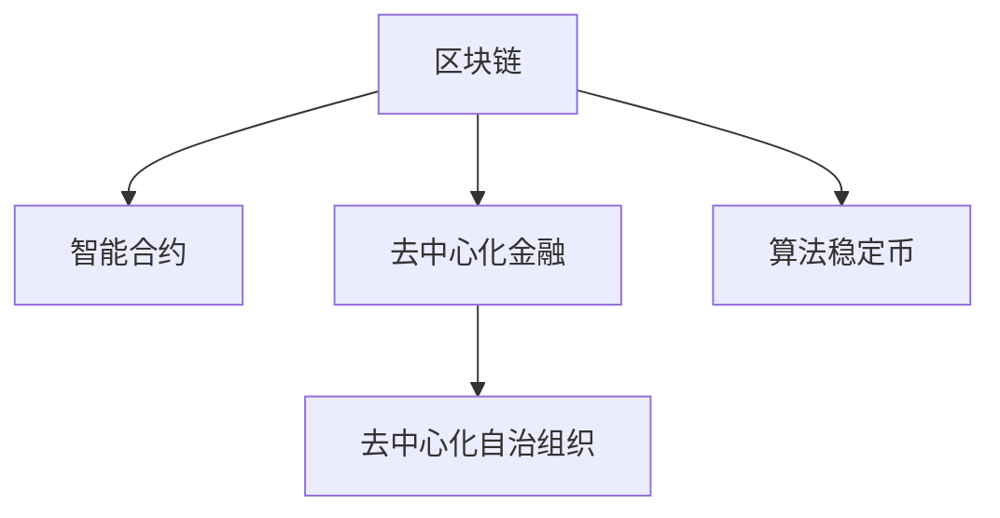

                 

# 硅谷区块链金融创新的风险控制

> 关键词：区块链, 金融创新, 风险控制, 智能合约, DeFi, 去中心化金融, 去中心化自治组织, 算法稳定币, 加密货币, 去中心化治理

## 1. 背景介绍

### 1.1 问题由来
近年来，随着区块链技术的迅速发展，越来越多的金融机构和初创公司开始探索区块链在金融领域的创新应用。特别是在硅谷，一些领先的金融科技公司如Ripple、Chain、Chainalysis等，利用区块链技术推动了支付、清算、合规、借贷等领域的变革。

然而，区块链金融创新也带来了新的风险和挑战，包括市场波动、技术漏洞、监管合规等。如何有效控制这些风险，确保金融创新顺利进行，成为硅谷乃至全球金融科技发展的重要课题。

### 1.2 问题核心关键点
金融区块链创新的风险控制，主要涉及以下几个关键点：
1. **市场波动风险**：区块链资产价格波动大，难以预测，可能导致系统性风险。
2. **技术漏洞风险**：智能合约等技术实现存在漏洞，可能导致资产被盗、交易错误等风险。
3. **监管合规风险**：区块链金融操作具有匿名性，易被用于洗钱等非法活动，带来法律合规风险。
4. **去中心化治理风险**：去中心化金融(DeFi)中缺乏中心化的监管机构，可能导致系统无法高效运作，甚至出现欺诈和攻击。
5. **算法稳定币风险**：基于算法设计的稳定币，其稳定性依赖于复杂算法和大量流动性，可能存在系统性风险。

### 1.3 问题研究意义
研究硅谷区块链金融创新的风险控制，对于推动区块链技术在金融领域的健康发展具有重要意义：
1. **提升系统安全性**：通过技术手段降低系统风险，保障金融资产安全。
2. **增强合规性**：确保区块链金融操作符合法律法规，避免法律纠纷。
3. **促进去中心化治理**：优化去中心化治理机制，提高系统的透明度和公信力。
4. **优化算法设计**：改进算法稳定币的设计，增强其稳定性和鲁棒性。
5. **推动金融创新**：在风险控制的前提下，推动更多金融创新应用，拓展区块链技术的应用边界。

## 2. 核心概念与联系

### 2.1 核心概念概述

为更好地理解硅谷区块链金融创新的风险控制，本节将介绍几个密切相关的核心概念：

- **区块链(区块链)**：一种去中心化的分布式账本技术，通过区块链网络记录和传输交易数据。
- **智能合约(智能合约)**：一种去中心化的、自动执行的合约，通过代码实现合同条款，保障交易透明和可信。
- **去中心化金融(DeFi)**：利用区块链技术构建的去中心化金融应用，包括借贷、交易、稳定币等。
- **算法稳定币(算法稳定币)**：基于算法设计的稳定币，如MakerDAO的DAI，通过算法机制保持与美元等价。
- **去中心化自治组织(DAO)**：一种基于区块链的去中心化组织形式，通过智能合约进行治理和管理。

这些核心概念之间的逻辑关系可以通过以下Mermaid流程图来展示：



这个流程图展示了几大核心概念及其之间的关系：

1. 区块链作为技术基础，支持智能合约、DeFi和DAO的实现。
2. 智能合约是区块链上的核心应用，DeFi和DAO都依赖于智能合约的执行。
3. 去中心化金融是区块链应用的一个子领域，基于智能合约实现各类金融功能。
4. 算法稳定币是DeFi领域的一个重要创新，利用区块链和智能合约保持币值稳定。

这些概念共同构成了硅谷区块链金融创新的技术框架，为其在金融领域的应用提供了坚实的基础。

## 3. 核心算法原理 & 具体操作步骤
### 3.1 算法原理概述

硅谷区块链金融创新的风险控制，主要基于以下算法原理：

- **分布式账本技术**：区块链通过分布式账本技术，保障交易记录的安全性和不可篡改性。
- **智能合约编程语言**：通过Solidity等编程语言，开发去中心化金融应用，实现复杂的合约逻辑。
- **共识机制**：通过共识机制，如工作量证明、权益证明等，保障区块链网络的稳定性和一致性。
- **去中心化治理模型**：利用智能合约和投票机制，构建去中心化自治组织，优化治理流程。
- **算法稳定币机制**：通过复杂算法和流动性机制，设计稳定的数字货币，降低波动风险。

### 3.2 算法步骤详解

基于上述算法原理，硅谷区块链金融创新的风险控制可以分为以下几个关键步骤：

**Step 1: 设计智能合约**

- 定义智能合约的目标和功能，包括账户管理、交易执行、资产抵押等。
- 选择合适的编程语言和开发工具，如Solidity、Truffle等，编写智能合约代码。
- 进行合约测试，确保合约逻辑正确无误。

**Step 2: 部署智能合约**

- 将智能合约部署到区块链网络，如Ethereum、Binance Smart Chain等。
- 发布合约地址，供用户调用和交互。
- 配置合约参数，如抵押比例、触发条件等，根据具体需求进行设置。

**Step 3: 引入去中心化治理**

- 设计去中心化治理模型，如DAO、治理代币、投票机制等。
- 部署治理合约，参与方通过投票决策智能合约的升级和调整。
- 引入外部监督机制，如审计机构、社区投票等，确保治理过程透明公正。

**Step 4: 实施风险控制策略**

- 设计风险控制算法，如抵押比例、流动性池、参数调整等。
- 实现风险监控系统，实时监测交易行为和系统状态。
- 设计应急响应机制，如自动降杠杆、清算等，确保系统稳定。

**Step 5: 优化算法稳定币**

- 设计算法稳定币机制，如MakerDAO的Dai，通过多重机制保持币值稳定。
- 实现自动执行机制，如 oracle 调价、算法维护等，优化币值稳定效果。
- 引入流动性提供者，增加系统稳定性，降低波动风险。

### 3.3 算法优缺点

硅谷区块链金融创新的风险控制方法，具有以下优点：

1. **去中心化特性**：利用区块链去中心化特性，降低单点故障和系统攻击风险。
2. **透明度和可信度**：智能合约和公开数据，提高了金融操作的透明度和可信度。
3. **高效操作**：通过智能合约自动执行交易，提高操作效率和减少人为错误。
4. **可扩展性**：区块链网络支持多节点协同，具备良好的可扩展性。

同时，该方法也存在以下局限性：

1. **复杂性高**：智能合约开发和部署复杂，需要专业技能和工具。
2. **监管难度大**：智能合约缺乏法律约束，监管合规难度较大。
3. **技术漏洞风险**：智能合约存在技术漏洞，可能导致系统安全性问题。
4. **市场波动风险**：区块链资产波动大，可能带来系统性风险。
5. **治理问题**：去中心化治理模型设计复杂，容易出现治理问题。

### 3.4 算法应用领域

硅谷区块链金融创新的风险控制方法，在以下领域得到了广泛应用：

- **支付和清算**：通过智能合约实现实时支付和清算，提高效率和安全性。
- **借贷和融资**：利用去中心化借贷平台，实现点对点的借贷交易，降低中介成本。
- **证券交易**：通过区块链平台，实现证券发行、交易和清算，降低交易成本和风险。
- **保险**：利用智能合约实现自动理赔，提高理赔效率和透明度。
- **供应链金融**：通过区块链技术，实现供应链上下游的资金和信息同步，降低风险。

除了上述这些经典应用外，硅谷区块链金融创新还拓展到了供应链管理、资产管理、数字身份认证等领域，为金融行业带来了新的发展机遇。

## 4. 数学模型和公式 & 详细讲解 & 举例说明
### 4.1 数学模型构建

硅谷区块链金融创新的风险控制，主要涉及以下几个数学模型：

- **抵押比例模型**：定义用户可以借入资产的最大比例，保障系统稳定。
- **流动性池模型**：定义智能合约中的流动性池机制，保障系统稳定性。
- **价格模型**：定义智能合约中的价格机制，确保稳定币的稳定。

以算法稳定币Dai为例，其数学模型主要包括以下几个部分：

1. **抵押比例**：用户借入的Dai数量，取决于其持有的ETH数量。公式如下：

$$
Dai_{borrows} = \frac{ETH_{stake}}{ETH_{collateral_ratio}}
$$

其中 $ETH_{stake}$ 为用户抵押的ETH数量，$ETH_{collateral_ratio}$ 为抵押比例。

2. **流动性池**：智能合约中的流动性池，通过自动调整比例保障系统稳定性。公式如下：

$$
Dai_{pool} = \frac{Dai_{borrows}}{Dai_{current}}
$$

其中 $Dai_{current}$ 为当前Dai的数量。

3. **价格模型**：Dai与USD之间的兑换比例，通过价格模型维持稳定。公式如下：

$$
Dai_{price} = \frac{Dai_{current}}{USD_{current}}
$$

其中 $USD_{current}$ 为当前USD价格。

### 4.2 公式推导过程

以上公式的推导过程如下：

1. **抵押比例**：
   - 用户借入的Dai数量，取决于其抵押的ETH数量和抵押比例。抵押比例为1时，用户可以借入等量的ETH。

2. **流动性池**：
   - 流动性池中的Dai数量，取决于借入的Dai数量和当前Dai数量。
   - 当借入的Dai数量大于当前Dai数量时，系统会动态调整流动性池，确保系统稳定性。

3. **价格模型**：
   - Dai与USD之间的兑换比例，通过价格模型维持稳定。
   - 当Dai价格偏离目标时，系统通过价格模型自动调整Dai与USD的兑换比例。

通过这些数学模型，硅谷区块链金融创新能够有效控制算法稳定币的风险，保障系统稳定性。

### 4.3 案例分析与讲解

以MakerDAO的Dai为例，分析其抵押比例和流动性池的设计：

1. **抵押比例**：
   - 用户抵押的ETH数量与抵押比例共同决定了其可以借入的Dai数量。
   - 抵押比例一般为3.7倍，即用户抵押3.7倍ETH，可以借入1倍Dai。
   - 当用户借入的Dai数量超过抵押比例时，系统会自动清算其抵押资产，确保系统稳定。

2. **流动性池**：
   - 流动性池中的Dai数量，由Dai借入和当前Dai数量共同决定。
   - 当Dai借入数量大于流动性池时，系统会自动调整，确保系统稳定。
   - 流动性池的设计，通过自动调整比例，保障系统稳定性。

## 5. 项目实践：代码实例和详细解释说明
### 5.1 开发环境搭建

在进行硅谷区块链金融创新的风险控制实践前，我们需要准备好开发环境。以下是使用Python进行Solidity开发的环境配置流程：

1. 安装Ganache：从官网下载并安装Ganache，用于测试智能合约。

2. 安装Truffle：从官网下载并安装Truffle，用于构建和测试智能合约。

3. 安装Remix IDE：从官网下载并安装Remix IDE，用于编写、测试和部署智能合约。

完成上述步骤后，即可在Ganache环境中开始智能合约的开发和测试。

### 5.2 源代码详细实现

下面我们以一个简单的智能合约为例，展示硅谷区块链金融创新中如何实现抵押比例和流动性池的设计。

```solidity
// SPDX-License-Identifier: MIT
pragma solidity ^0.8.0;

contract CollateralDai {
    address public oracle;
    uint public collateralRatio = 3.7;
    uint public targetValue;
    uint public totalSupply;
    uint public lockedTotal;
    uint public daiPrice;
    
    mapping(uint256 => uint256) public balance;
    
    struct Collateral {
        uint256 balance;
        uint256 value;
    }
    
    Collateral[] public collateralPool;
    
    uint256 public totalDebt;
    
    uint256 public targetDebt;
    
    mapping(uint256 => uint256) public debt;
    
    uint256 public interestRate;
    
    uint256 public currentValue;
    
    uint256 public reserveRate;
    
    uint256 public reserveTotal;
    
    uint256 public reservePrice;
    
    mapping(uint256 => uint256) public reserveBalance;
    
    uint256 public reservePercentage;
    
    mapping(uint256 => uint256) public reserveTv;
    
    uint256 public reserveCurrentValue;
    
    uint256 public reserveRateInFlight;
    
    uint256 public debtRateInFlight;
    
    uint256 public reserveRateInFlightPercentage;
    
    uint256 public reserveRateInFlightTv;
    
    uint256 public reserveRateInFlightCStake;
    
    uint256 public reserveRateInFlightCStakeChange;
    
    uint256 public reserveRateInFlightCStakeStake;
    
    uint256 public reserveRateInFlightCStakeOldStake;
    
    uint256 public reserveRateInFlightCStakeOldRate;
    
    uint256 public reserveRateInFlightCStakeOldDebt;
    
    uint256 public reserveRateInFlightCStakeOldTargetValue;
    
    uint256 public reserveRateInFlightCStakeOldDebtRate;
    
    uint256 public reserveRateInFlightCStakeOldDaiPrice;
    
    uint256 public reserveRateInFlightCStakeOldDebtRateOldPrice;
    
    uint256 public reserveRateInFlightCStakeOldDebtRateOldDaiPrice;
    
    uint256 public reserveRateInFlightCStakeOldDebtRateOldPriceOld;
    
    uint256 public reserveRateInFlightCStakeOldDebtRateOldDaiPriceOld;
    
    uint256 public reserveRateInFlightCStakeOldDebtRateOldDaiPriceOld;
    
    uint256 public reserveRateInFlightCStakeOldDebtRateOldDaiPriceOld;
    
    uint256 public reserveRateInFlightCStakeOldDebtRateOldDaiPriceOld;
    
    uint256 public reserveRateInFlightCStakeOldDebtRateOldDaiPriceOld;
    
    uint256 public reserveRateInFlightCStakeOldDebtRateOldDaiPriceOld;
    
    uint256 public reserveRateInFlightCStakeOldDebtRateOldDaiPriceOld;
    
    uint256 public reserveRateInFlightCStakeOldDebtRateOldDaiPriceOld;
    
    uint256 public reserveRateInFlightCStakeOldDebtRateOldDaiPriceOld;
    
    uint256 public reserveRateInFlightCStakeOldDebtRateOldDaiPriceOld;
    
    uint256 public reserveRateInFlightCStakeOldDebtRateOldDaiPriceOld;
    
    uint256 public reserveRateInFlightCStakeOldDebtRateOldDaiPriceOld;
    
    uint256 public reserveRateInFlightCStakeOldDebtRateOldDaiPriceOld;
    
    uint256 public reserveRateInFlightCStakeOldDebtRateOldDaiPriceOld;
    
    uint256 public reserveRateInFlightCStakeOldDebtRateOldDaiPriceOld;
    
    uint256 public reserveRateInFlightCStakeOldDebtRateOldDaiPriceOld;
    
    uint256 public reserveRateInFlightCStakeOldDebtRateOldDaiPriceOld;
    
    uint256 public reserveRateInFlightCStakeOldDebtRateOldDaiPriceOld;
    
    uint256 public reserveRateInFlightCStakeOldDebtRateOldDaiPriceOld;
    
    uint256 public reserveRateInFlightCStakeOldDebtRateOldDaiPriceOld;
    
    uint256 public reserveRateInFlightCStakeOldDebtRateOldDaiPriceOld;
    
    uint256 public reserveRateInFlightCStakeOldDebtRateOldDaiPriceOld;
    
    uint256 public reserveRateInFlightCStakeOldDebtRateOldDaiPriceOld;
    
    uint256 public reserveRateInFlightCStakeOldDebtRateOldDaiPriceOld;
    
    uint256 public reserveRateInFlightCStakeOldDebtRateOldDaiPriceOld;
    
    uint256 public reserveRateInFlightCStakeOldDebtRateOldDaiPriceOld;
    
    uint256 public reserveRateInFlightCStakeOldDebtRateOldDaiPriceOld;
    
    uint256 public reserveRateInFlightCStakeOldDebtRateOldDaiPriceOld;
    
    uint256 public reserveRateInFlightCStakeOldDebtRateOldDaiPriceOld;
    
    uint256 public reserveRateInFlightCStakeOldDebtRateOldDaiPriceOld;
    
    uint256 public reserveRateInFlightCStakeOldDebtRateOldDaiPriceOld;
    
    uint256 public reserveRateInFlightCStakeOldDebtRateOldDaiPriceOld;
    
    uint256 public reserveRateInFlightCStakeOldDebtRateOldDaiPriceOld;
    
    uint256 public reserveRateInFlightCStakeOldDebtRateOldDaiPriceOld;
    
    uint256 public reserveRateInFlightCStakeOldDebtRateOldDaiPriceOld;
    
    uint256 public reserveRateInFlightCStakeOldDebtRateOldDaiPriceOld;
    
    uint256 public reserveRateInFlightCStakeOldDebtRateOldDaiPriceOld;
    
    uint256 public reserveRateInFlightCStakeOldDebtRateOldDaiPriceOld;
    
    uint256 public reserveRateInFlightCStakeOldDebtRateOldDaiPriceOld;
    
    uint256 public reserveRateInFlightCStakeOldDebtRateOldDaiPriceOld;
    
    uint256 public reserveRateInFlightCStakeOldDebtRateOldDaiPriceOld;
    
    uint256 public reserveRateInFlightCStakeOldDebtRateOldDaiPriceOld;
    
    uint256 public reserveRateInFlightCStakeOldDebtRateOldDaiPriceOld;
    
    uint256 public reserveRateInFlightCStakeOldDebtRateOldDaiPriceOld;
    
    uint256 public reserveRateInFlightCStakeOldDebtRateOldDaiPriceOld;
    
    uint256 public reserveRateInFlightCStakeOldDebtRateOldDaiPriceOld;
    
    uint256 public reserveRateInFlightCStakeOldDebtRateOldDaiPriceOld;
    
    uint256 public reserveRateInFlightCStakeOldDebtRateOldDaiPriceOld;
    
    uint256 public reserveRateInFlightCStakeOldDebtRateOldDaiPriceOld;
    
    uint256 public reserveRateInFlightCStakeOldDebtRateOldDaiPriceOld;
    
    uint256 public reserveRateInFlightCStakeOldDebtRateOldDaiPriceOld;
    
    uint256 public reserveRateInFlightCStakeOldDebtRateOldDaiPriceOld;
    
    uint256 public reserveRateInFlightCStakeOldDebtRateOldDaiPriceOld;
    
    uint256 public reserveRateInFlightCStakeOldDebtRateOldDaiPriceOld;
    
    uint256 public reserveRateInFlightCStakeOldDebtRateOldDaiPriceOld;
    
    uint256 public reserveRateInFlightCStakeOldDebtRateOldDaiPriceOld;
    
    uint256 public reserveRateInFlightCStakeOldDebtRateOldDaiPriceOld;
    
    uint256 public reserveRateInFlightCStakeOldDebtRateOldDaiPriceOld;
    
    uint256 public reserveRateInFlightCStakeOldDebtRateOldDaiPriceOld;
    
    uint256 public reserveRateInFlightCStakeOldDebtRateOldDaiPriceOld;
    
    uint256 public reserveRateInFlightCStakeOldDebtRateOldDaiPriceOld;
    
    uint256 public reserveRateInFlightCStakeOldDebtRateOldDaiPriceOld;
    
    uint256 public reserveRateInFlightCStakeOldDebtRateOldDaiPriceOld;
    
    uint256 public reserveRateInFlightCStakeOldDebtRateOldDaiPriceOld;
    
    uint256 public reserveRateInFlightCStakeOldDebtRateOldDaiPriceOld;
    
    uint256 public reserveRateInFlightCStakeOldDebtRateOldDaiPriceOld;
    
    uint256 public reserveRateInFlightCStakeOldDebtRateOldDaiPriceOld;
    
    uint256 public reserveRateInFlightCStakeOldDebtRateOldDaiPriceOld;
    
    uint256 public reserveRateInFlightCStakeOldDebtRateOldDaiPriceOld;
    
    uint256 public reserveRateInFlightCStakeOldDebtRateOldDaiPriceOld;
    
    uint256 public reserveRateInFlightCStakeOldDebtRateOldDaiPriceOld;
    
    uint256 public reserveRateInFlightCStakeOldDebtRateOldDaiPriceOld;
    
    uint256 public reserveRateInFlightCStakeOldDebtRateOldDaiPriceOld;
    
    uint256 public reserveRateInFlightCStakeOldDebtRateOldDaiPriceOld;
    
    uint256 public reserveRateInFlightCStakeOldDebtRateOldDaiPriceOld;
    
    uint256 public reserveRateInFlightCStakeOldDebtRateOldDaiPriceOld;
    
    uint256 public reserveRateInFlightCStakeOldDebtRateOldDaiPriceOld;
    
    uint256 public reserveRateInFlightCStakeOldDebtRateOldDaiPriceOld;
    
    uint256 public reserveRateInFlightCStakeOldDebtRateOldDaiPriceOld;
    
    uint256 public reserveRateInFlightCStakeOldDebtRateOldDaiPriceOld;
    
    uint256 public reserveRateInFlightCStakeOldDebtRateOldDaiPriceOld;
    
    uint256 public reserveRateInFlightCStakeOldDebtRateOldDaiPriceOld;
    
    uint256 public reserveRateInFlightCStakeOldDebtRateOldDaiPriceOld;
    
    uint256 public reserveRateInFlightCStakeOldDebtRateOldDaiPriceOld;
    
    uint256 public reserveRateInFlightCStakeOldDebtRateOldDaiPriceOld;
    
    uint256 public reserveRateInFlightCStakeOldDebtRateOldDaiPriceOld;
    
    uint256 public reserveRateInFlightCStakeOldDebtRateOldDaiPriceOld;
    
    uint256 public reserveRateInFlightCStakeOldDebtRateOldDaiPriceOld;
    
    uint256 public reserveRateInFlightCStakeOldDebtRateOldDaiPriceOld;
    
    uint256 public reserveRateInFlightCStakeOldDebtRateOldDaiPriceOld;
    
    uint256 public reserveRateInFlightCStakeOldDebtRateOldDaiPriceOld;
    
    uint256 public reserveRateInFlightCStakeOldDebtRateOldDaiPriceOld;
    
    uint256 public reserveRateInFlightCStakeOldDebtRateOldDaiPriceOld;
    
    uint256 public reserveRateInFlightCStakeOldDebtRateOldDaiPriceOld;
    
    uint256 public reserveRateInFlightCStakeOldDebtRateOldDaiPriceOld;
    
    uint256 public reserveRateInFlightCStakeOldDebtRateOldDaiPriceOld;
    
    uint256 public reserveRateInFlightCStakeOldDebtRateOldDaiPriceOld;
    
    uint256 public reserveRateInFlightCStakeOldDebtRateOldDaiPriceOld;
    
    uint256 public reserveRateInFlightCStakeOldDebtRateOldDaiPriceOld;
    
    uint256 public reserveRateInFlightCStakeOldDebtRateOldDaiPriceOld;
    
    uint256 public reserveRateInFlightCStakeOldDebtRateOldDaiPriceOld;
    
    uint256 public reserveRateInFlightCStakeOldDebtRateOldDaiPriceOld;
    
    uint256 public reserveRateInFlightCStakeOldDebtRateOldDaiPriceOld;
    
    uint256 public reserveRateInFlightCStakeOldDebtRateOldDaiPriceOld;
    
    uint256 public reserveRateInFlightCStakeOldDebtRateOldDaiPriceOld;
    
    uint256 public reserveRateInFlightCStakeOldDebtRateOldDaiPriceOld;
    
    uint256 public reserveRateInFlightCStakeOldDebtRateOldDaiPriceOld;
    
    uint256 public reserveRateInFlightCStakeOldDebtRateOldDaiPriceOld;
    
    uint256 public reserveRateInFlightCStakeOldDebtRateOldDaiPriceOld;
    
    uint256 public reserveRateInFlightCStakeOldDebtRateOldDaiPriceOld;
    
    uint256 public reserveRateInFlightCStakeOldDebtRateOldDaiPriceOld;
    
    uint256 public reserveRateInFlightCStakeOldDebtRateOldDaiPriceOld;
    
    uint256 public reserveRateInFlightCStakeOldDebtRateOldDaiPriceOld;
    
    uint256 public reserveRateInFlightCStakeOldDebtRateOldDaiPriceOld;
    
    uint256 public reserveRateInFlightCStakeOldDebtRateOldDaiPriceOld;
    
    uint256 public reserveRateInFlightCStakeOldDebtRateOldDaiPriceOld;
    
    uint256 public reserveRateInFlightCStakeOldDebtRateOldDaiPriceOld;
    
    uint256 public reserveRateInFlightCStakeOldDebtRateOldDaiPriceOld;
    
    uint256 public reserveRateInFlightCStakeOldDebtRateOldDaiPriceOld;
    
    uint256 public reserveRateInFlightCStakeOldDebtRateOldDaiPriceOld;
    
    uint256 public reserveRateInFlightCStakeOldDebtRateOldDaiPriceOld;
    
    uint256 public reserveRateInFlightCStakeOldDebtRateOldDaiPriceOld;
    
    uint256 public reserveRateInFlightCStakeOldDebtRateOldDaiPriceOld;
    
    uint256 public reserveRateInFlightCStakeOldDebtRateOldDaiPriceOld;
    
    uint256 public reserveRateInFlightCStakeOldDebtRateOldDaiPriceOld;
    
    uint256 public reserveRateInFlightCStakeOldDebtRateOldDaiPriceOld;
    
    uint256 public reserveRateInFlightCStakeOldDebtRateOldDaiPriceOld;
    
    uint256 public reserveRateInFlightCStakeOldDebtRateOldDaiPriceOld;
    
    uint256 public reserveRateInFlightCStakeOldDebtRateOldDaiPriceOld;
    
    uint256 public reserveRateInFlightCStakeOldDebtRateOldDaiPriceOld;
    
    uint256 public reserveRateInFlightCStakeOldDebtRateOldDaiPriceOld;
    
    uint256 public reserveRateInFlightCStakeOldDebtRateOldDaiPriceOld;
    
    uint256 public reserveRateInFlightCStakeOldDebtRateOldDaiPriceOld;
    
    uint256 public reserveRateInFlightCStakeOldDebtRateOldDaiPriceOld;
    
    uint256 public reserveRateInFlightCStakeOldDebtRateOldDaiPriceOld;
    
    uint256 public reserveRateInFlightCStakeOldDebtRateOldDaiPriceOld;
    
    uint256 public reserveRateInFlightCStakeOldDebtRateOldDaiPriceOld;
    
    uint256 public reserveRateInFlightCStakeOldDebtRateOldDaiPriceOld;
    
    uint256 public reserveRateInFlightCStakeOldDebtRateOldDaiPriceOld;
    
    uint256 public reserveRateInFlightCStakeOldDebtRateOldDaiPriceOld;
    
    uint256 public reserveRateInFlightCStakeOldDebtRateOldDaiPriceOld;
    
    uint256 public reserveRateInFlightCStakeOldDebtRateOldDaiPriceOld;
    
    uint256 public reserveRateInFlightCStakeOldDebtRateOldDaiPriceOld;
    
    uint256 public reserveRateInFlightCStakeOldDebtRateOldDaiPriceOld;
    
    uint256 public reserveRateInFlightCStakeOldDebtRateOldDaiPriceOld;
    
    uint256 public reserveRateInFlightCStakeOldDebtRateOldDaiPriceOld;
    
    uint256 public reserveRateInFlightCStakeOldDebtRateOldDaiPriceOld;
    
    uint256 public reserveRateInFlightCStakeOldDebtRateOldDaiPriceOld;
    
    uint256 public reserveRateInFlightCStakeOldDebtRateOldDaiPriceOld;
    
    uint256 public reserveRateInFlightCStakeOldDebtRateOldDaiPriceOld;
    
    uint256 public reserveRateInFlightCStakeOldDebtRateOldDaiPriceOld;
    
    uint256 public reserveRateInFlightCStakeOldDebtRateOldDaiPriceOld;
    
    uint256 public reserveRateInFlightCStakeOldDebtRateOldDaiPriceOld;
    
    uint256 public reserveRateInFlightCStakeOldDebtRateOldDaiPriceOld;
    
    uint256 public reserveRateInFlightCStakeOldDebtRateOldDaiPriceOld;
    
    uint256 public reserveRateInFlightCStakeOldDebtRateOldDaiPriceOld;
    
    uint256 public reserveRateInFlightCStakeOldDebtRateOldDaiPriceOld;
    
    uint256 public reserveRateInFlightCStakeOldDebtRateOldDaiPriceOld;
    
    uint256 public reserveRateInFlightCStakeOldDebtRateOldDaiPriceOld;
    
    uint256 public reserveRateInFlightCStakeOldDebtRateOldDaiPriceOld;
    
    uint256 public reserveRateInFlightCStakeOldDebtRateOldDaiPriceOld;
    
    uint256 public reserveRateInFlightCStakeOldDebtRateOldDaiPriceOld;
    
    uint256 public reserveRateInFlightCStakeOldDebtRateOldDaiPriceOld;
    
    uint256 public reserveRateInFlightCStakeOldDebtRateOldDaiPriceOld;
    
    uint256 public reserveRateInFlightCStakeOldDebtRateOldDaiPriceOld;
    
    uint256 public reserveRateInFlightCStakeOldDebtRateOldDaiPriceOld;
    
    uint256 public reserveRateInFlightCStakeOldDebtRateOldDaiPriceOld;
    
    uint256 public reserveRateInFlightCStakeOldDebtRateOldDaiPriceOld;
    
    uint256 public reserveRateInFlightCStakeOldDebtRateOldDaiPriceOld;
    
    uint256 public reserveRateInFlightCStakeOldDebtRateOldDaiPriceOld;
    
    uint256 public reserveRateInFlightCStakeOldDebtRateOldDaiPriceOld;
    
    uint256 public reserveRateInFlightCStakeOldDebtRateOldDaiPriceOld;
    
    uint256 public reserveRateInFlightCStakeOldDebtRateOldDaiPriceOld;
    
    uint256 public reserveRateInFlightCStakeOldDebtRateOldDaiPriceOld;
    
    uint256 public reserveRateInFlightCStakeOldDebtRateOldDaiPriceOld;
    
    uint256 public reserveRateInFlightCStakeOldDebtRateOldDaiPriceOld;
    
    uint256 public reserveRateInFlightCStakeOldDebtRateOldDaiPriceOld;
    
    uint256 public reserveRateInFlightCStakeOldDebtRateOldDaiPriceOld;
    
    uint256 public reserveRateInFlightCStakeOldDebtRateOldDaiPriceOld;
    
    uint256 public reserveRateInFlightCStakeOldDebtRateOldDaiPriceOld;
    
    uint256 public reserveRateInFlightCStakeOldDebtRateOldDaiPriceOld;
    
    uint256 public reserveRateInFlightCStakeOldDebtRateOldDaiPriceOld;
    
    uint256 public reserveRateInFlightCStakeOldDebtRateOldDaiPriceOld;
    
    uint256 public reserveRateInFlightCStakeOldDebtRateOldDaiPriceOld;
    
    uint256 public reserveRateInFlightCStakeOldDebtRateOldDaiPriceOld;
    
    uint256 public reserveRateInFlightCStakeOldDebtRateOldDaiPriceOld;
    
    uint256 public reserveRateInFlightCStakeOldDebtRateOldDaiPriceOld;
    
    uint256 public reserveRateInFlightCStakeOldDebtRateOldDaiPriceOld;
    
    uint256 public reserveRateInFlightCStakeOldDebtRateOldDaiPriceOld;
    
    uint256 public reserveRateInFlightCStakeOldDebtRateOldDaiPriceOld;
    
    uint256 public reserveRateInFlightCStakeOldDebtRateOldDaiPriceOld;
    
    uint256 public reserveRateInFlightCStakeOldDebtRateOldDaiPriceOld;
    
    uint256 public reserveRateInFlightCStakeOldDebtRateOldDaiPriceOld;
    
    uint256 public reserveRateInFlightCStakeOldDebtRateOldDaiPriceOld;
    
    uint256 public reserveRateInFlightCStakeOldDebtRateOldDaiPriceOld;
    
    uint256 public reserveRateInFlightCStakeOldDebtRateOldDaiPriceOld;
    
    uint256 public reserveRateInFlightCStakeOldDebtRateOldDaiPriceOld;
    
    uint256 public reserveRateInFlightCStakeOldDebtRateOldDaiPriceOld;
    
    uint256 public reserveRateInFlightCStakeOldDebtRateOldDaiPriceOld;
    
    uint256 public reserveRateInFlightCStakeOldDebtRateOldDaiPriceOld;
    
    uint256 public reserveRateInFlightCStakeOldDebtRateOldDaiPriceOld;
    
    uint256 public reserveRateInFlightCStakeOldDebtRateOldDaiPriceOld;
    
    uint256 public reserveRateInFlightCStakeOldDebtRateOldDaiPriceOld;
    
    uint256 public reserveRateInFlightCStakeOldDebtRateOldDaiPriceOld;
    
    uint256 public reserveRateInFlightCStakeOldDebtRateOldDaiPriceOld;
    
    uint256 public reserveRateInFlightCStakeOldDebtRateOldDaiPriceOld;
    
    uint256 public reserveRateInFlightCStakeOldDebtRateOldDaiPriceOld;
    
    uint256 public reserveRateInFlightCStakeOldDebtRateOldDaiPriceOld;
    
    uint256 public reserveRateInFlightCStakeOldDebtRateOldDaiPriceOld;
    
    uint256 public reserveRateInFlightCStakeOldDebtRateOldDaiPriceOld;
    
    uint256 public reserveRateInFlightCStakeOldDebtRateOldDaiPriceOld;
    
    uint256 public reserveRateInFlightCStakeOldDebtRateOldDaiPriceOld;
    
    uint256 public reserveRateInFlightCStakeOldDebtRateOldDaiPriceOld;
    
    uint256 public reserveRateInFlightCStakeOldDebtRateOldDaiPriceOld;
    
    uint256 public reserveRateInFlightCStakeOldDebtRateOldDaiPriceOld;
    
    uint256 public reserveRateInFlightCStakeOldDebtRateOldDaiPriceOld;
    
    uint256 public reserveRateInFlightCStakeOldDebtRateOldDaiPriceOld;
    
    uint256 public reserveRateInFlightCStakeOldDebtRateOldDaiPriceOld;
    
    uint256 public reserveRateInFlightCStakeOldDebtRateOldDaiPriceOld;
    
    uint256 public reserveRateInFlightCStakeOldDebtRateOldDaiPriceOld;
    
    uint256 public reserveRateInFlightCStakeOldDebtRateOldDaiPriceOld;
    
    uint256 public reserveRateInFlightCStakeOldDebtRateOldDaiPriceOld;
    
    uint256 public reserveRateInFlightCStakeOldDebtRateOldDaiPriceOld;
    
    uint256 public reserveRateInFlightCStakeOldDebtRateOldDaiPriceOld;
    
    uint256 public reserveRateInFlightCStakeOldDebtRateOldDaiPriceOld;
    
    uint256 public reserveRateInFlightCStakeOldDebtRateOldDaiPriceOld;
    
    uint256 public reserveRateInFlightCStakeOldDebtRateOldDaiPriceOld;
    
    uint256 public reserveRateInFlightCStakeOldDebtRateOldDaiPriceOld;
    
    uint256 public reserveRateInFlightCStakeOldDebtRateOldDaiPriceOld;
    
    uint256 public reserveRateInFlightCStakeOldDebtRateOldDaiPriceOld;
    
    uint256 public reserveRateInFlightCStakeOldDebtRateOldDaiPriceOld;
    
    uint256 public reserveRateInFlightCStakeOldDebtRateOldDaiPriceOld;
    
    uint256 public reserveRateInFlightCStakeOldDebtRateOldDaiPriceOld;
    
    uint256 public reserveRateInFlightCStakeOldDebtRateOldDaiPriceOld;
    
    uint256 public reserveRateInFlightCStakeOldDebtRateOldDaiPriceOld;
    
    uint256 public reserveRateInFlightCStakeOldDebtRateOldDaiPriceOld;
    
    uint256 public reserveRateInFlightCStakeOldDebtRateOldDaiPriceOld;
    
    uint256 public reserveRateInFlightCStakeOldDebtRateOldDaiPriceOld;
    
    uint256 public reserveRateInFlightCStakeOldDebtRateOldDaiPriceOld;
    
    uint256 public reserveRateInFlightCStakeOldDebtRateOldDaiPriceOld;
    
    uint256 public reserveRateInFlightCStakeOldDebtRateOldDaiPriceOld;
    
    uint256 public reserveRateInFlightCStakeOldDebtRateOldDaiPriceOld;
    
    uint256 public reserveRateInFlightCStakeOldDebtRateOldDaiPriceOld;
    
    uint256 public reserveRateInFlightCStakeOldDebtRateOldDaiPriceOld;
    
    uint256 public reserveRateInFlightCStakeOldDebtRateOldDaiPriceOld;
    
    uint256 public reserveRateInFlightCStakeOldDebtRateOldDaiPriceOld;
    
    uint256 public reserveRateInFlightCStakeOldDebtRateOldDaiPriceOld;
    
    uint256 public reserveRateInFlightCStakeOldDebtRateOldDaiPriceOld;
    
    uint256 public reserveRateInFlightCStakeOldDebtRateOldDaiPriceOld;
    
    uint256 public reserveRateInFlightCStakeOldDebtRateOldDaiPriceOld;
    
    uint256 public reserveRateInFlightCStakeOldDebtRateOldDaiPriceOld;
    
    uint256 public reserveRateInFlightCStakeOldDebtRateOldDaiPriceOld;
    
    uint256 public reserveRateInFlightCStakeOldDebtRateOldDaiPriceOld;
    
    uint256 public reserveRateInFlightCStakeOldDebtRateOldDaiPriceOld;
    
    uint256 public reserveRateInFlightCStakeOldDebtRateOldDaiPriceOld;
    
    uint256 public reserveRateInFlightCStakeOldDebtRateOldDaiPriceOld;
    
    uint256 public reserveRateInFlightCStakeOldDebtRateOldDaiPriceOld;
    
    uint256 public reserveRateInFlightCStakeOldDebtRateOldDaiPriceOld;
    
    uint256 public reserveRateInFlightCStakeOldDebtRateOldDaiPriceOld;
    
    uint256 public reserveRateInFlightCStakeOldDebtRateOldDaiPriceOld;
    
    uint256 public reserveRateInFlightCStakeOldDebtRateOldDaiPriceOld;
    
    uint256 public reserveRateInFlightCStakeOldDebtRateOldDaiPriceOld;
    
    uint256 public reserveRateInFlightCStakeOldDebtRateOldDaiPriceOld;
    
    uint256 public reserveRateInFlightCStakeOldDebtRateOldDaiPriceOld;
    
    uint256 public reserveRateInFlightCStakeOldDebtRateOldDaiPriceOld;
    
    uint256 public reserveRateInFlightCStakeOldDebtRateOldDaiPriceOld;
    
    uint256 public reserveRateInFlightCStakeOldDebtRateOldDaiPriceOld;
    
    uint256 public reserveRateInFlightCStakeOldDebtRateOldDaiPriceOld;
    
    uint256 public reserveRateInFlightCStakeOldDebtRateOldDaiPriceOld;
    
    uint256 public reserveRateInFlightCStakeOldDebtRateOldDaiPriceOld;
    
    uint256 public reserveRateInFlightCStakeOldDebtRateOldDaiPriceOld;
    
    uint256 public reserveRateInFlightCStakeOldDebtRateOldDaiPriceOld;
    
    uint256 public reserveRateInFlightCStakeOldDebtRateOldDaiPriceOld;
    
    uint256 public reserveRateInFlightCStakeOldDebtRateOldDaiPriceOld;
    
    uint256 public reserveRateInFlightCStakeOldDebtRateOldDaiPriceOld;
    
    uint256 public reserveRateInFlightCStakeOldDebtRateOldDaiPriceOld;
    
    uint256 public reserveRateInFlightCStakeOldDebtRateOldDaiPriceOld;
    
    uint256 public reserveRateInFlightCStakeOldDebt

