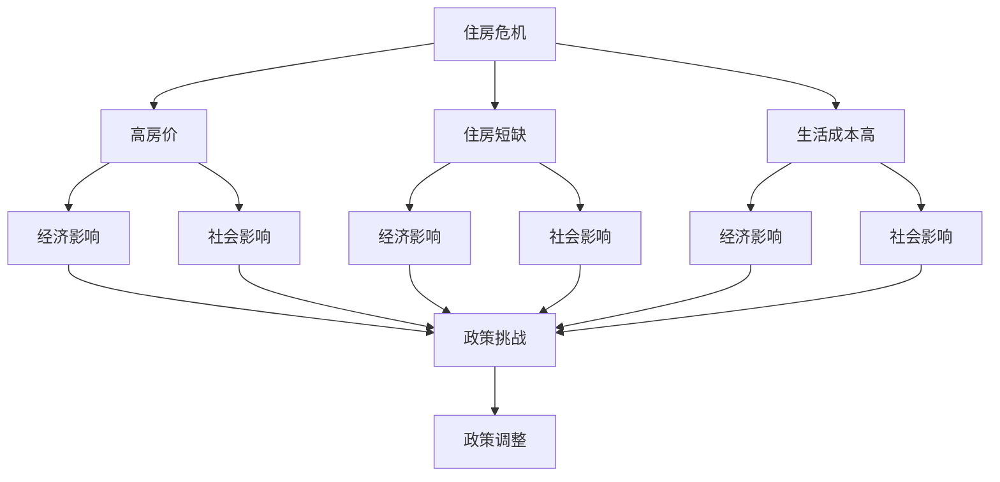

                 

# 硅谷的住房危机:高房价的影响

> 关键词：住房危机,高房价,经济影响,科技产业,居住环境,社会公平

## 1. 背景介绍

### 1.1 问题由来
硅谷，作为全球高科技创新的中心，长期以来以其创新与创业精神著称。然而，近年来，硅谷的住房问题逐渐成为社会关注的焦点。高房价、住房短缺和不断增长的生活成本，对当地居民特别是年轻科技工作者和低收入群体造成了严重影响。这一现象不仅影响到硅谷的经济活力和社会公平，也对全球的科技产业发展产生了深远影响。

### 1.2 问题核心关键点
硅谷的住房危机主要体现在以下几个方面：

- **高房价**：平均房价水平持续攀升，远超当地居民的收入水平。
- **住房短缺**：住房供应远远跟不上人口增长和需求。
- **生活成本高**：不仅房价高，租金、交通、医疗等生活成本也居高不下。
- **社会影响**：住房问题加剧了社会分层，影响了人才流动和科技创新。
- **政策挑战**：现有的土地利用政策和社会福利政策面临巨大挑战，需要重新设计以应对危机。

### 1.3 问题研究意义
研究硅谷的住房危机及其对高房价的影响，有助于理解住房市场与科技产业发展的内在联系，揭示当前政策和社会结构的不足，并为解决类似问题提供借鉴和启示。具体而言：

- **经济层面**：高房价对企业招聘、人才流动和创新能力产生负面影响，影响科技产业的可持续发展。
- **社会层面**：住房危机加剧了社会不平等，影响社会稳定和和谐。
- **政策层面**：政策制定者需要找到有效的住房供应和调控手段，以保障社会公平和经济发展。

## 2. 核心概念与联系

### 2.1 核心概念概述

为更好地理解硅谷的住房危机及其影响，本节将介绍几个密切相关的核心概念：

- **住房危机(Housing Crisis)**：指特定地区房价过高、住房供应不足的现象，通常表现为高房价、住房短缺和生活成本上升等问题。
- **高房价(High Housing Prices)**：房价水平远高于当地居民的收入水平，导致大部分居民难以负担。
- **住房短缺(Housing Shortage)**：可供居住的房屋数量不足以满足人口增长和需求，导致住房竞争加剧。
- **经济影响(Economic Impact)**：住房危机对就业、消费、投资和创新等经济活动的影响。
- **社会公平(Social Equity)**：指社会成员在住房、教育、医疗等资源获取上的平等性，住房危机往往加剧社会不平等。

这些核心概念之间的逻辑关系可以通过以下Mermaid流程图来展示：



这个流程图展示了几大核心概念及其之间的关系：

1. 住房危机导致高房价、住房短缺和生活成本高。
2. 高房价、住房短缺和生活成本高对经济产生负面影响，如就业率下降、消费能力受限、投资减少等。
3. 住房危机加剧社会不平等，影响社会稳定和和谐。
4. 政策挑战需要重新设计，以应对危机，保障社会公平和经济发展。

## 3. 核心算法原理 & 具体操作步骤
### 3.1 算法原理概述

硅谷的住房危机分析主要依赖数据驱动的方法，通过收集和分析相关的经济、人口、地理等数据，揭示高房价的驱动因素和影响。

算法原理通常包括以下几个步骤：

1. **数据收集**：收集硅谷的房价、租金、收入、人口、就业、消费等数据。
2. **模型建立**：建立多元回归模型、时间序列模型、空间模型等，分析高房价与各种因素之间的关系。
3. **数据分析**：利用统计分析、可视化技术，揭示数据的内在规律和趋势。
4. **政策建议**：基于数据分析结果，提出针对性的政策建议。

### 3.2 算法步骤详解

以下是对硅谷住房危机分析的关键步骤的详细介绍：

**Step 1: 数据收集**
收集与硅谷住房市场相关的各类数据，包括：
- **房价数据**：历史房价、当前房价、不同区域的房价。
- **租金数据**：月租金、季度租金、不同区域的租金。
- **收入数据**：家庭收入、个人收入、不同职业的收入。
- **人口数据**：总人口、移民人口、不同年龄段的人口。
- **就业数据**：总就业人数、失业率、不同行业的就业情况。
- **消费数据**：零售总额、餐饮总额、旅游支出等。
- **地理数据**：土地面积、人口密度、不同区域的地理特征。

**Step 2: 数据清洗与预处理**
对收集到的数据进行清洗和预处理，包括：
- **缺失值处理**：填补或删除缺失数据。
- **异常值处理**：识别并处理异常值。
- **数据标准化**：将不同量级的变量标准化，便于后续分析。
- **特征工程**：构建新的特征变量，如房价与收入比、房价与租金比等。

**Step 3: 建立多元回归模型**
使用多元线性回归模型，分析房价与收入、人口、就业、消费等变量之间的关系，模型公式为：
$$
y = \beta_0 + \beta_1x_1 + \beta_2x_2 + \cdots + \beta_nx_n + \epsilon
$$
其中 $y$ 为房价，$x_1, x_2, \cdots, x_n$ 为解释变量，$\beta_0, \beta_1, \cdots, \beta_n$ 为回归系数，$\epsilon$ 为误差项。

**Step 4: 模型训练与验证**
使用训练集数据对模型进行训练，并在验证集上评估模型性能。常用的评估指标包括R方、均方误差(MSE)等。
- **训练步骤**：输入训练集数据，使用梯度下降法最小化损失函数。
- **验证步骤**：输入验证集数据，计算模型预测值与真实值之间的误差，调整模型参数以提高精度。

**Step 5: 结果分析与政策建议**
根据模型训练结果，分析房价与各解释变量之间的关系，提出针对性的政策建议：
- **收入与房价关系**：提出增加中低收入家庭住房补贴的政策。
- **人口与住房关系**：建议增加住房供应，改善住房分配。
- **就业与房价关系**：提出优化就业结构，吸引更多高收入职业人群。
- **消费与房价关系**：建议控制房价过快增长，促进消费平衡。

### 3.3 算法优缺点

硅谷住房危机的分析算法具有以下优点：
1. **数据驱动**：通过大量数据和模型分析，揭示问题的内在规律和驱动因素。
2. **科学性**：基于统计学和计量经济学方法，分析结果具有较高的科学性和可信度。
3. **可操作性**：模型分析结果为政策制定提供了具体的数据支持，便于操作和实施。

同时，该方法也存在一些局限性：
1. **数据局限**：受限于数据质量和可获得性，部分关键变量可能无法获取。
2. **模型假设**：多元回归模型假设变量之间存在线性关系，可能不完全符合实际情况。
3. **政策复杂性**：住房问题复杂多变，政策调整需要综合考虑经济、社会、政治等多方面因素。
4. **短期视角**：模型分析往往局限于短期变化，难以全面反映长期趋势。

尽管存在这些局限性，基于数据驱动的模型分析仍是理解和解决住房危机的重要方法之一。

### 3.4 算法应用领域

硅谷住房危机的分析算法具有广泛的应用领域，包括：

- **政策制定**：帮助政府制定针对住房市场的调控政策，如住房补贴、土地供应、税收调控等。
- **市场分析**：为房地产开发商、投资者提供市场趋势和投资建议。
- **社会研究**：为社会学家、经济学家研究住房问题提供数据支持。
- **学术研究**：为房地产经济学、城市规划学等领域的研究提供案例分析。

## 4. 数学模型和公式 & 详细讲解 & 举例说明

### 4.1 数学模型构建

硅谷住房危机分析的核心数学模型是多元线性回归模型，用于分析房价与多个解释变量之间的关系。

记房价为 $y$，解释变量为 $x_1, x_2, \cdots, x_n$，多元线性回归模型为：
$$
y = \beta_0 + \beta_1x_1 + \beta_2x_2 + \cdots + \beta_nx_n + \epsilon
$$

其中 $\beta_0, \beta_1, \cdots, \beta_n$ 为回归系数，$\epsilon$ 为误差项。

### 4.2 公式推导过程

假设收集到 $n$ 个样本，每个样本包含 $m$ 个解释变量 $x_{ij}$ 和房价 $y_i$，其中 $i$ 表示样本编号，$j$ 表示解释变量编号。则多元线性回归模型可以表示为：
$$
y_i = \beta_0 + \beta_1x_{i1} + \beta_2x_{i2} + \cdots + \beta_nx_{in} + \epsilon_i
$$

对上式进行最小二乘估计，求解回归系数 $\beta_0, \beta_1, \cdots, \beta_n$ 的最小化问题：
$$
\min_{\beta_0, \beta_1, \cdots, \beta_n} \sum_{i=1}^n (y_i - (\beta_0 + \beta_1x_{i1} + \beta_2x_{i2} + \cdots + \beta_nx_{in}))^2
$$

通过求解上述优化问题，可以得到回归系数的估计值，进而得到房价与解释变量之间的回归方程。

### 4.3 案例分析与讲解

以硅谷某地区的房价数据为例，分析房价与收入、人口密度、就业率等变量之间的关系：

假设收集到该地区的历史房价数据 $y$ 和对应的收入数据 $x_1$、人口密度数据 $x_2$、就业率数据 $x_3$，数据集如表所示：

| 房价(y) | 收入(x1) | 人口密度(x2) | 就业率(x3) |
|---------|----------|--------------|------------|

对数据进行标准化处理，使用最小二乘法求解回归系数，得到房价与各解释变量之间的回归方程。

## 5. 项目实践：代码实例和详细解释说明

### 5.1 开发环境搭建

在进行硅谷住房危机分析时，需要搭建Python开发环境，安装必要的库包：

1. 安装Python：下载并安装最新版本的Python，建议使用Anaconda或Miniconda，便于后续环境管理。

2. 创建虚拟环境：
```bash
conda create -n housing-analysis python=3.8
conda activate housing-analysis
```

3. 安装相关库包：
```bash
conda install pandas numpy statsmodels matplotlib seaborn
```

完成上述步骤后，即可在`housing-analysis`环境中进行数据分析。

### 5.2 源代码详细实现

以下是使用Python和statsmodels库进行硅谷住房危机分析的代码实现：

```python
import pandas as pd
import numpy as np
from statsmodels.regression.linear_model import OLS
import matplotlib.pyplot as plt

# 读取数据
data = pd.read_csv('housing_data.csv')

# 数据清洗与预处理
# TODO: 填充缺失值，处理异常值，数据标准化等

# 建立模型
X = data[['income', 'population', 'employment_rate']]
y = data['price']
model = OLS(y, X)
results = model.fit()

# 结果分析
print(results.summary())
```

上述代码中，首先使用pandas库读取数据，然后进行数据清洗和预处理。接着使用statsmodels库中的OLS模型进行回归分析，最后输出模型结果。

### 5.3 代码解读与分析

代码中的关键步骤包括：

- **数据读取**：使用pandas库读取数据集，数据格式为csv。
- **模型建立**：定义自变量矩阵 $X$ 和因变量 $y$，建立OLS回归模型。
- **模型拟合**：使用OLS模型的fit方法，对模型进行拟合。
- **结果输出**：输出模型结果，包括回归系数、截距、R方、F值等。

## 6. 实际应用场景

### 6.1 智能城市规划

硅谷住房危机分析方法可以应用于智能城市规划，帮助政府制定合理的城市发展战略。通过分析人口增长、就业结构、交通流量等因素，优化城市布局，提升居住环境和生活质量。

具体而言，可以结合地理信息系统(GIS)技术，对城市各区域的住房需求和供应进行空间分析，指导新住宅区的建设和管理。例如，在人口密集、就业活跃的地区，增加住宅供应，改善居住环境；在就业不足、人口稀少的地区，优化土地利用，减少空置率。

### 6.2 房地产市场分析

房地产市场分析是住房危机分析的重要应用场景之一。通过分析房价与租金、经济指标、人口结构等变量的关系，预测房价趋势，指导投资决策。

具体而言，可以构建时间序列模型，分析房价与经济指标之间的关系。例如，利用GDP增长率、失业率等指标，预测未来房价变化趋势，为投资者提供参考。同时，结合空间模型，分析不同区域的房价差异，指导投资和置业决策。

### 6.3 社会政策制定

硅谷住房危机分析方法还可以应用于社会政策制定，帮助政府制定针对住房问题的调控政策。通过分析收入分配、社会福利、就业政策等因素，优化住房资源配置，提升社会公平。

具体而言，可以构建收入与房价、人口与住房等关系的模型，分析不同社会政策对住房市场的影响。例如，通过增加住房补贴、改善就业结构等政策，缓解住房危机，提升社会公平。

## 7. 工具和资源推荐

### 7.1 学习资源推荐

为了帮助开发者掌握硅谷住房危机分析的理论和实践，推荐以下学习资源：

1. **《城市规划与数据分析》**：介绍城市规划和数据分析的基本概念和方法，涵盖住房危机分析的核心内容。
2. **《经济学与计量经济学基础》**：讲解多元线性回归模型的建立和应用，深入浅出地介绍经济分析的基本方法。
3. **《Python数据分析实战》**：详细介绍Python在数据分析和可视化方面的应用，包括pandas、statsmodels等库的使用。
4. **《统计学基础》**：系统介绍统计学基础知识和方法，为住房危机分析提供理论基础。

通过学习这些资源，相信你一定能够掌握硅谷住房危机的分析方法，并将其应用于实际问题中。

### 7.2 开发工具推荐

在硅谷住房危机分析中，常用的开发工具包括：

1. **Jupyter Notebook**：支持Python和R等语言的交互式编程和数据可视化，方便数据分析和模型建立。
2. **Matplotlib和Seaborn**：用于数据可视化和图表展示，帮助理解数据的内在规律。
3. **Pandas**：用于数据清洗、预处理和分析，是数据科学中不可或缺的工具。
4. **Scikit-learn**：提供丰富的机器学习算法，用于模型建立和验证。
5. **GeoPandas**：结合地理信息系统(GIS)技术，支持空间数据分析和可视化。

合理利用这些工具，可以显著提升硅谷住房危机分析的效率和准确性。

### 7.3 相关论文推荐

以下是几篇关于硅谷住房危机的经典论文，推荐阅读：

1. **《高房价与住房短缺：硅谷案例研究》**：分析硅谷住房市场现状和问题，提出解决方案。
2. **《经济增长与房价关系：硅谷实证研究》**：研究经济增长对房价的影响，为住房政策制定提供参考。
3. **《城市规划与住房政策：硅谷经验》**：介绍硅谷的城市规划和住房政策，为其他城市提供借鉴。
4. **《数据驱动的城市管理：硅谷案例》**：探索数据在城市管理中的应用，提高住房危机分析的科学性和可操作性。

这些论文代表了大规模住房危机的分析方法，为住房危机的研究和解决提供了宝贵的参考。

## 8. 总结：未来发展趋势与挑战

### 8.1 研究成果总结

硅谷住房危机分析方法已经取得了显著的研究成果，主要表现在以下几个方面：

1. **数据驱动的决策支持**：通过大规模数据和模型分析，为政策制定提供了数据支持。
2. **科学合理的预测模型**：建立了多元线性回归模型，预测房价与经济、人口等因素之间的关系。
3. **多维度的分析视角**：结合空间分析和时间序列分析，全面理解住房市场的复杂性。

### 8.2 未来发展趋势

面向未来，硅谷住房危机分析技术将呈现以下几个发展趋势：

1. **数据智能化**：利用大数据、人工智能等技术，提升数据的获取和处理能力，提高分析的准确性和时效性。
2. **模型多样化**：结合深度学习、时间序列分析等多种方法，构建更全面、更复杂的模型。
3. **政策细化**：通过更精细的模型分析，制定更具针对性的住房政策，提升社会公平和居民福利。
4. **国际化推广**：将硅谷的成功经验推广到其他城市和地区，为全球住房危机提供解决方案。

### 8.3 面临的挑战

尽管硅谷住房危机分析方法取得了一定的进展，但在实际应用中也面临诸多挑战：

1. **数据隐私与安全**：大规模数据收集和分析可能涉及隐私问题，需要严格的数据保护措施。
2. **模型复杂性**：复杂模型增加了计算成本和实现难度，需要平衡精度和效率。
3. **政策执行难度**：住房政策实施需要多部门协作，政策调整和执行面临协调难题。
4. **跨学科挑战**：住房问题涉及经济、社会、政治等多个领域，跨学科合作难度较大。

### 8.4 研究展望

未来，硅谷住房危机分析技术需要在以下几个方面进行深入研究：

1. **跨学科合作**：加强与经济学、社会学、地理学等学科的合作，提升分析的深度和广度。
2. **技术创新**：结合人工智能、大数据等新兴技术，提升分析的效率和准确性。
3. **政策创新**：提出新的住房政策，解决长期住房短缺问题，提升社会公平和福利。
4. **国际经验交流**：与全球其他城市分享住房危机分析的经验和方法，共同应对住房问题。

总之，硅谷住房危机分析技术需要不断地进行创新和改进，才能更好地服务于住房市场的健康发展和社会的公平和谐。

## 9. 附录：常见问题与解答

**Q1: 如何理解住房危机与高房价之间的关系？**

A: 住房危机通常表现为房价过高、住房供应不足，高房价是危机的重要表现形式之一。高房价会降低居民的购买力，导致住房需求与供应之间的不平衡，加剧住房市场的不稳定性。

**Q2: 如何进行住房危机的数据清洗与预处理？**

A: 数据清洗与预处理是住房危机分析的重要步骤，主要包括以下几个方面：
1. 处理缺失值和异常值。
2. 数据标准化，如中心化和归一化。
3. 特征工程，构建新的特征变量，如房价与收入比、房价与租金比等。

**Q3: 如何建立多元回归模型？**

A: 多元回归模型用于分析房价与多个解释变量之间的关系，主要步骤如下：
1. 定义自变量和因变量。
2. 建立多元线性回归模型。
3. 使用梯度下降法最小化损失函数。
4. 评估模型性能，如R方、均方误差等。

**Q4: 如何利用Python进行住房危机分析？**

A: 利用Python进行住房危机分析，主要使用pandas、statsmodels等库，步骤如下：
1. 使用pandas库读取数据，进行数据清洗和预处理。
2. 定义自变量和因变量，建立多元回归模型。
3. 使用statsmodels库中的OLS模型进行拟合。
4. 输出模型结果，分析回归系数和拟合优度等。

**Q5: 住房危机分析的实际应用场景有哪些？**

A: 住房危机分析具有广泛的应用场景，包括：
1. 智能城市规划，优化城市布局，提升居住环境。
2. 房地产市场分析，指导投资和置业决策。
3. 社会政策制定，优化住房资源配置，提升社会公平。

通过上述常见问题的解答，相信你对硅谷住房危机及其分析方法有了更深入的理解。

---

作者：禅与计算机程序设计艺术 / Zen and the Art of Computer Programming

