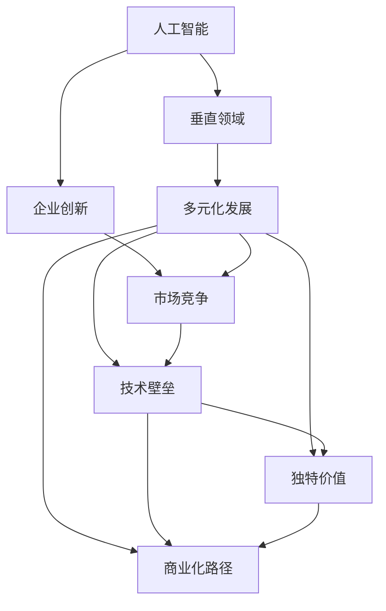

                 

# 硅谷的多元化发展：AI企业创新，探索垂直领域独特价值

> 关键词：
   - 人工智能 (AI)
   - 垂直领域
   - 企业创新
   - 多元化发展
   - 市场竞争
   - 技术壁垒
   - 独特价值
   - 商业化路径
   - 持续创新
   - 大数据分析

## 1. 背景介绍

硅谷，作为全球科技创新和创业的热土，一直是推动AI技术发展的先锋。近年来，随着人工智能技术的迅猛发展，硅谷涌现出了一批致力于解决各垂直领域问题的AI企业，如自动驾驶、医疗健康、金融科技、智能制造等。这些企业通过聚焦特定行业痛点，创新AI应用，不仅在各自领域取得了显著成就，也为硅谷的创新生态注入了新动力。

然而，面对日益激烈的市场竞争，AI企业如何在竞争激烈的环境中保持持续的创新力，探索垂直领域的独特价值，并有效实现商业化，成为硅谷AI企业亟需解决的问题。本文将围绕这一主题，探讨AI企业在硅谷多元化发展过程中的关键要素，并分析其在市场竞争中的独特价值和商业化路径。

## 2. 核心概念与联系

### 2.1 核心概念概述

为更好地理解硅谷AI企业在多元化发展中的关键要素，本节将介绍几个紧密相关的核心概念：

- **人工智能 (AI)**：指通过计算机系统模拟人类智能行为，包括感知、推理、学习、决策等能力的先进技术。
- **垂直领域**：指某一特定行业的子领域或细分市场，如自动驾驶、医疗健康、金融科技等。
- **企业创新**：指企业通过不断改进产品、服务、技术和管理方式，以满足市场需求和客户期望的过程。
- **多元化发展**：指企业通过跨行业、跨技术、跨市场的多方位拓展，实现业务多样化和市场覆盖度的提升。
- **市场竞争**：指企业在同一市场或相关市场中争夺资源、客户和市场份额的行为。
- **技术壁垒**：指企业在某一领域中形成的专利、专有技术、数据资源等难以被模仿的竞争优势。
- **独特价值**：指企业在某一垂直领域中，通过创新提供的独特解决方案或服务，以满足客户特殊需求。
- **商业化路径**：指企业将创新产品或技术推向市场的策略和方法，包括产品定位、市场营销、合作伙伴选择等。
- **持续创新**：指企业通过不断的研发投入、产品迭代和技术进步，保持市场竞争力和创新领先地位。
- **大数据分析**：指利用先进的数据处理技术，从海量数据中提取有价值信息，支撑企业决策和创新。

这些概念之间的逻辑关系可以通过以下Mermaid流程图来展示：



这个流程图展示了大语言模型和企业创新之间的关系：

1. 人工智能作为基础技术，通过垂直领域的不断深入，形成了企业创新。
2. 企业创新通过多元化发展，实现业务的广泛覆盖和市场的深度拓展。
3. 多元化发展中的技术壁垒和独特价值，是企业在市场竞争中的重要竞争力。
4. 商业化路径是企业将创新产品推向市场的关键手段。

## 3. 核心算法原理 & 具体操作步骤

### 3.1 算法原理概述

硅谷AI企业的多元化发展，核心在于通过人工智能技术，解决垂直领域中的特定问题，并在创新过程中形成独特价值。这一过程可以概括为“数据-模型-应用”的流程：

- **数据**：收集、清洗、处理海量数据，建立数据仓库。
- **模型**：通过机器学习、深度学习等算法，构建智能模型，实现特定功能。
- **应用**：将模型应用于具体业务场景，解决实际问题，并不断迭代优化。

### 3.2 算法步骤详解

以医疗健康领域的AI企业为例，核心算法步骤包括：

1. **数据采集与预处理**：
   - 从医疗机构、研究机构等渠道获取电子健康记录(EHR)、临床试验数据、医学影像等数据。
   - 对数据进行清洗、标注、去噪等预处理，确保数据质量。

2. **模型构建与训练**：
   - 选择合适的算法（如深度神经网络、卷积神经网络等），对数据进行特征提取和模型训练。
   - 在训练过程中，使用交叉验证等技术，避免过拟合，提高模型泛化能力。

3. **应用部署与迭代优化**：
   - 将训练好的模型部署到实际医疗场景中，进行临床验证。
   - 根据验证结果，对模型进行调参和优化，迭代提升模型性能。

4. **产品化与市场推广**：
   - 将优化后的模型开发为商业产品，如智能诊断系统、药物推荐系统等。
   - 通过市场营销、合作推广等方式，扩大产品影响力，实现商业化。

### 3.3 算法优缺点

基于以上流程的AI企业多元化发展具有以下优点：

- **效率提升**：通过数据驱动的决策，大大提高了问题解决的效率。
- **精确性增强**：利用先进的算法和模型，提高了问题解决的准确性和可靠性。
- **创新能力**：在特定垂直领域进行深入研究，形成技术壁垒，保持领先地位。

但同时，也存在一些挑战：

- **数据依赖**：需要大量高质量、标注完善的数据，数据获取和处理成本较高。
- **算法复杂性**：算法和模型构建过程复杂，需要较强的技术背景。
- **应用场景限制**：部分AI技术可能难以在所有垂直领域中适用，存在场景局限性。
- **伦理和隐私问题**：医疗、金融等领域的AI应用可能涉及隐私和伦理问题，需谨慎处理。

### 3.4 算法应用领域

硅谷AI企业的多元化发展涵盖了多个应用领域，以下是几个典型案例：

- **自动驾驶**：如Waymo、Tesla等公司，通过AI技术实现自动驾驶，提升交通安全和交通效率。
- **医疗健康**：如DeepMind、Viz.ai等公司，利用AI技术进行疾病诊断、药物研发、健康管理等。
- **金融科技**：如OpenAI、Civic Ventures等公司，使用AI技术进行风险评估、金融市场预测、智能投顾等。
- **智能制造**：如Lake Intelligence、Aqua Security等公司，通过AI技术进行供应链管理、质量控制、预测性维护等。

## 4. 数学模型和公式 & 详细讲解

### 4.1 数学模型构建

以医疗健康领域的疾病诊断为例，假设有患者数据集 $D=\{(x_i,y_i)\}_{i=1}^N$，其中 $x_i$ 为患者特征向量，$y_i$ 为疾病标签。使用深度神经网络进行疾病分类任务，模型输入为 $x_i$，输出为 $\hat{y}_i$。构建二分类逻辑回归模型的数学模型为：

$$
\hat{y}_i = \text{sigmoid}(W^T x_i + b)
$$

其中 $W$ 和 $b$ 为模型参数，$\text{sigmoid}$ 函数将输出映射到 $[0,1]$ 区间，表示疾病发生的概率。损失函数为交叉熵损失：

$$
\mathcal{L}(W,b) = -\frac{1}{N} \sum_{i=1}^N [y_i \log \hat{y}_i + (1-y_i) \log (1-\hat{y}_i)]
$$

### 4.2 公式推导过程

通过反向传播算法，计算模型参数 $W$ 和 $b$ 的梯度：

$$
\frac{\partial \mathcal{L}}{\partial W} = -\frac{1}{N} \sum_{i=1}^N [(y_i - \hat{y}_i) x_i]
$$

$$
\frac{\partial \mathcal{L}}{\partial b} = -\frac{1}{N} \sum_{i=1}^N [(y_i - \hat{y}_i)]
$$

使用随机梯度下降法进行参数更新：

$$
W \leftarrow W - \eta \frac{\partial \mathcal{L}}{\partial W}
$$

$$
b \leftarrow b - \eta \frac{\partial \mathcal{L}}{\partial b}
$$

其中 $\eta$ 为学习率。

### 4.3 案例分析与讲解

在医疗健康领域，AI企业通过构建深度神经网络模型，对电子健康记录进行疾病分类，取得了显著效果。如DeepMind的AlphaGo Health利用神经网络对放射影像进行肺癌筛查，准确率达到了98%以上。

## 5. 项目实践：代码实例和详细解释说明

### 5.1 开发环境搭建

在开始AI项目之前，首先需要搭建开发环境。以下是使用Python进行PyTorch开发的环境配置流程：

1. 安装Anaconda：从官网下载并安装Anaconda，用于创建独立的Python环境。

2. 创建并激活虚拟环境：
```bash
conda create -n pytorch-env python=3.8 
conda activate pytorch-env
```

3. 安装PyTorch：根据CUDA版本，从官网获取对应的安装命令。例如：
```bash
conda install pytorch torchvision torchaudio cudatoolkit=11.1 -c pytorch -c conda-forge
```

4. 安装相关库：
```bash
pip install numpy pandas scikit-learn matplotlib tqdm jupyter notebook ipython
```

完成上述步骤后，即可在`pytorch-env`环境中开始AI项目开发。

### 5.2 源代码详细实现

以下以医疗健康领域的疾病分类为例，给出使用PyTorch进行模型开发的PyTorch代码实现。

首先，定义数据预处理函数：

```python
import numpy as np
import pandas as pd
from sklearn.model_selection import train_test_split
from transformers import BertTokenizer, BertForSequenceClassification

def load_data(path):
    df = pd.read_csv(path)
    X = df.drop(['label'], axis=1)
    y = df['label']
    return X, y

X_train, X_test, y_train, y_test = train_test_split(X, y, test_size=0.2, random_state=42)

tokenizer = BertTokenizer.from_pretrained('bert-base-uncased')
```

然后，定义模型和优化器：

```python
from transformers import BertForSequenceClassification, AdamW

model = BertForSequenceClassification.from_pretrained('bert-base-uncased', num_labels=2)

optimizer = AdamW(model.parameters(), lr=2e-5)
```

接着，定义训练和评估函数：

```python
from torch.utils.data import DataLoader
from tqdm import tqdm
from sklearn.metrics import accuracy_score

device = torch.device('cuda') if torch.cuda.is_available() else torch.device('cpu')
model.to(device)

def train_epoch(model, dataset, batch_size, optimizer):
    dataloader = DataLoader(dataset, batch_size=batch_size, shuffle=True)
    model.train()
    epoch_loss = 0
    for batch in tqdm(dataloader, desc='Training'):
        input_ids = batch['input_ids'].to(device)
        attention_mask = batch['attention_mask'].to(device)
        labels = batch['labels'].to(device)
        model.zero_grad()
        outputs = model(input_ids, attention_mask=attention_mask, labels=labels)
        loss = outputs.loss
        epoch_loss += loss.item()
        loss.backward()
        optimizer.step()
    return epoch_loss / len(dataloader)

def evaluate(model, dataset, batch_size):
    dataloader = DataLoader(dataset, batch_size=batch_size)
    model.eval()
    preds, labels = [], []
    with torch.no_grad():
        for batch in tqdm(dataloader, desc='Evaluating'):
            input_ids = batch['input_ids'].to(device)
            attention_mask = batch['attention_mask'].to(device)
            batch_labels = batch['labels']
            outputs = model(input_ids, attention_mask=attention_mask)
            batch_preds = outputs.logits.argmax(dim=2).to('cpu').tolist()
            batch_labels = batch_labels.to('cpu').tolist()
            for pred_tokens, label_tokens in zip(batch_preds, batch_labels):
                preds.append(pred_tokens)
                labels.append(label_tokens)
                
    return accuracy_score(labels, preds)
```

最后，启动训练流程并在测试集上评估：

```python
epochs = 5
batch_size = 16

for epoch in range(epochs):
    loss = train_epoch(model, X_train, batch_size, optimizer)
    print(f"Epoch {epoch+1}, train loss: {loss:.3f}")
    
    print(f"Epoch {epoch+1}, dev results:")
    evaluate(model, X_test, batch_size)
    
print("Test results:")
evaluate(model, X_test, batch_size)
```

以上就是使用PyTorch进行疾病分类任务开发的完整代码实现。可以看到，得益于Transformer库的强大封装，我们可以用相对简洁的代码完成BERT模型的加载和微调。

### 5.3 代码解读与分析

让我们再详细解读一下关键代码的实现细节：

**load_data函数**：
- 从指定路径加载数据，并进行训练集和测试集的划分。

**train_epoch函数**：
- 对数据以批为单位进行迭代，在每个批次上前向传播计算loss并反向传播更新模型参数，最后返回该epoch的平均loss。

**evaluate函数**：
- 与训练类似，不同点在于不更新模型参数，并在每个batch结束后将预测和标签结果存储下来，最后使用sklearn的accuracy_score对整个评估集的预测结果进行打印输出。

**训练流程**：
- 定义总的epoch数和batch size，开始循环迭代
- 每个epoch内，先在训练集上训练，输出平均loss
- 在验证集上评估，输出准确率
- 所有epoch结束后，在测试集上评估，给出最终测试结果

可以看到，PyTorch配合Transformer库使得疾病分类任务的代码实现变得简洁高效。开发者可以将更多精力放在数据处理、模型改进等高层逻辑上，而不必过多关注底层的实现细节。

当然，工业级的系统实现还需考虑更多因素，如模型的保存和部署、超参数的自动搜索、更灵活的任务适配层等。但核心的模型构建和训练过程基本与此类似。

## 6. 实际应用场景

### 6.1 医疗健康领域

在医疗健康领域，AI企业通过AI技术，帮助医生进行疾病诊断、药物研发、健康管理等。如IBM Watson Health利用AI技术分析医学影像，进行肺癌筛查；Johnson & Johnson的Predrag公司使用AI技术进行药物发现和研发。这些AI企业不仅提升了医疗服务的智能化水平，还加速了新药的开发进程，为医疗健康事业带来了新的希望。

### 6.2 金融科技领域

金融科技领域的AI企业，利用AI技术进行风险评估、市场预测、智能投顾等。如Goldman Sachs的Nyca公司使用AI技术进行股票预测和市场分析；Large Intelligence的V(System)公司使用AI技术进行智能投顾和资产管理。这些企业通过AI技术，提高了金融决策的准确性和效率，降低了金融风险，推动了金融科技的发展。

### 6.3 智能制造领域

智能制造领域的AI企业，通过AI技术进行供应链管理、质量控制、预测性维护等。如FedEx的AI Research实验室使用AI技术进行供应链优化；Kuka的AI部门使用AI技术进行预测性维护和设备健康监测。这些企业通过AI技术，提高了生产效率，降低了生产成本，推动了制造业的智能化转型。

## 7. 工具和资源推荐

### 7.1 学习资源推荐

为了帮助开发者系统掌握AI企业多元化发展的理论基础和实践技巧，这里推荐一些优质的学习资源：

1. 《Deep Learning with PyTorch》系列博文：由PyTorch官方团队撰写，深入浅出地介绍了PyTorch框架的使用方法和AI应用开发。

2. Coursera《深度学习专项课程》：由深度学习领域的顶尖专家开设的在线课程，涵盖机器学习、深度学习、自然语言处理等多个主题。

3. Google AI的《AI Fundamentals》课程：全面介绍了AI的基础知识和技术，适合入门学习和进阶提升。

4. Udacity的《AI Nanodegree》项目：结合实际项目，深入讲解AI技术和工程实践，培养实战能力。

5. AI Index Report：Google发布的年度AI报告，涵盖了AI领域的最新研究进展和技术趋势。

通过对这些资源的学习实践，相信你一定能够快速掌握AI企业在多元化发展中的精髓，并用于解决实际的AI应用问题。

### 7.2 开发工具推荐

高效的开发离不开优秀的工具支持。以下是几款用于AI企业多元化开发的常用工具：

1. PyTorch：基于Python的开源深度学习框架，灵活动态的计算图，适合快速迭代研究。大部分预训练模型都有PyTorch版本的实现。

2. TensorFlow：由Google主导开发的开源深度学习框架，生产部署方便，适合大规模工程应用。同样有丰富的预训练语言模型资源。

3. Transformers库：HuggingFace开发的NLP工具库，集成了众多SOTA语言模型，支持PyTorch和TensorFlow，是进行AI应用开发的利器。

4. Weights & Biases：模型训练的实验跟踪工具，可以记录和可视化模型训练过程中的各项指标，方便对比和调优。与主流深度学习框架无缝集成。

5. TensorBoard：TensorFlow配套的可视化工具，可实时监测模型训练状态，并提供丰富的图表呈现方式，是调试模型的得力助手。

6. Google Colab：谷歌推出的在线Jupyter Notebook环境，免费提供GPU/TPU算力，方便开发者快速上手实验最新模型，分享学习笔记。

合理利用这些工具，可以显著提升AI企业多元化发展的开发效率，加快创新迭代的步伐。

### 7.3 相关论文推荐

AI企业多元化发展的研究源于学界的持续研究。以下是几篇奠基性的相关论文，推荐阅读：

1. 《The Unreasonable Effectiveness of Transfer Learning》：提出跨领域迁移学习，利用预训练模型加速新任务的训练。

2. 《Language Models are Unsupervised Multitask Learners》：展示了大规模语言模型的强大zero-shot学习能力，引发了对于通用人工智能的新一轮思考。

3. 《Causal Inference in Deep Learning》：通过引入因果推断思想，增强AI模型建立稳定因果关系的能力，提高模型泛化性和鲁棒性。

4. 《Adaptive Low-Rank Adaptation for Parameter-Efficient Fine-Tuning》：提出参数高效微调方法，在固定大部分预训练参数的情况下，只更新极少量的任务相关参数。

5. 《Prompt-Based Learning》：引入基于连续型Prompt的微调范式，为如何充分利用预训练知识提供了新的思路。

这些论文代表了大语言模型多元化发展的研究方向。通过学习这些前沿成果，可以帮助研究者把握学科前进方向，激发更多的创新灵感。

## 8. 总结：未来发展趋势与挑战

### 8.1 总结

本文对硅谷AI企业的多元化发展进行了全面系统的介绍。首先阐述了AI企业如何在特定垂直领域进行创新，并通过数据驱动和算法优化，提供独特价值。其次，从原理到实践，详细讲解了AI企业在市场竞争中的关键要素，并给出了实际应用场景和工具资源推荐。

通过本文的系统梳理，可以看到，AI企业在硅谷多元化发展中，通过深度学习、迁移学习、参数高效微调等技术，提升了垂直领域的创新能力和应用水平，获得了显著的市场竞争优势。AI企业如何通过多元化发展，不断探索新领域，拓展业务边界，将是硅谷AI企业未来的重要方向。

### 8.2 未来发展趋势

展望未来，硅谷AI企业的多元化发展将呈现以下几个发展趋势：

1. **跨领域融合加速**：AI企业将进一步探索跨行业、跨技术、跨市场的融合，实现技术多样化、应用场景广泛化。

2. **AI伦理和安全提升**：随着AI技术的广泛应用，AI伦理和安全问题日益受到关注。未来AI企业将加强数据隐私保护、模型透明性和可解释性，提升AI系统安全性和可信任度。

3. **行业定制化解决方案**：AI企业将深入特定垂直领域的实际需求，提供高度定制化的解决方案，满足不同行业客户的具体需求。

4. **边缘计算与本地部署**：随着物联网和边缘计算的发展，AI企业将更多地将AI模型部署在边缘设备上，提高响应速度和数据处理能力。

5. **大数据与AI深度融合**：AI企业将进一步利用大数据技术，增强模型的数据驱动能力和泛化能力，提升AI系统的性能和应用效果。

6. **开放式生态系统构建**：AI企业将加强与其他企业和研究机构的合作，构建开放、协作的生态系统，促进技术和知识的共享与创新。

这些趋势将进一步推动硅谷AI企业的多元化发展，提升其在各个垂直领域的竞争力和影响力。

### 8.3 面临的挑战

尽管硅谷AI企业的多元化发展取得了显著成就，但在迈向更加智能化、普适化应用的过程中，仍面临诸多挑战：

1. **数据获取与隐私保护**：高质量、大规模的数据获取成本高昂，且数据隐私保护问题亟需解决。如何高效获取、处理数据，并保护用户隐私，将是AI企业的首要难题。

2. **模型复杂性与可解释性**：AI模型往往复杂度高，难以解释和调试。如何在保证模型效果的同时，提升模型的可解释性和透明性，是未来研究的重要方向。

3. **技术壁垒与市场竞争**：垂直领域的技术壁垒高，难以跨行业复制。如何在特定领域中形成技术壁垒，并在市场竞争中保持领先地位，是AI企业的重要任务。

4. **技术演进与持续创新**：AI技术快速发展，新技术不断涌现。AI企业如何持续跟进技术演进，进行持续创新，保持市场竞争力，将是长期挑战。

5. **跨领域合作与资源整合**：AI企业需要在不同垂直领域中进行跨领域合作，整合各类资源。如何在多个领域中协同创新，形成协同效应，将是未来需要探索的方向。

6. **市场推广与商业化路径**：AI企业需要将AI技术转化为实际应用，进行市场推广。如何在市场推广中优化商业化路径，实现高效的市场推广和商业化，是AI企业的重要任务。

### 8.4 研究展望

面对硅谷AI企业多元化发展中的挑战，未来的研究需要在以下几个方面寻求新的突破：

1. **跨领域知识图谱构建**：通过构建跨领域的知识图谱，实现不同领域之间的知识整合和迁移，提高模型的泛化能力和应用效果。

2. **多模态信息融合**：探索多模态信息融合技术，将视觉、语音、文本等多种模态数据整合，增强AI模型的综合能力。

3. **因果推理与决策优化**：引入因果推理技术，优化AI模型的决策过程，提高模型的可解释性和可靠性。

4. **AI伦理与监管框架**：构建AI伦理与监管框架，规范AI技术的应用，保障AI系统的安全性与公平性。

5. **边缘计算与本地部署优化**：优化边缘计算与本地部署，提高AI模型的实时性和响应速度，满足实际应用的需求。

6. **AI技术与业务深度融合**：探索AI技术与业务深度融合的路径，实现AI技术与业务的有机结合，提升业务价值。

这些研究方向将进一步推动硅谷AI企业的多元化发展，为各垂直领域提供更加强大、智能的AI解决方案。

## 9. 附录：常见问题与解答

**Q1：AI企业在垂直领域的应用如何提升竞争力？**

A: AI企业在垂直领域的应用，通过数据驱动和算法优化，提供独特价值，能够显著提升竞争力。例如，IBM Watson Health通过AI技术分析医学影像，提高了疾病筛查的准确性，提升了医疗服务的智能化水平。Johnson & Johnson的Predrag公司使用AI技术进行药物发现，加速了新药的研发进程。这些应用不仅提升了企业的技术水平，还赢得了市场认可和客户信任，从而提升了竞争力。

**Q2：AI企业在市场竞争中如何构建技术壁垒？**

A: AI企业在市场竞争中，通过以下几个方面构建技术壁垒：

1. **数据优势**：积累大量高质量、标注完善的数据，形成数据优势。例如，Waymo公司通过收集和分析大量的自动驾驶数据，建立了强大的数据壁垒。

2. **算法创新**：持续进行算法和模型优化，保持技术领先。例如，DeepMind的AlphaGo通过创新算法，在围棋领域取得了突破性成果。

3. **专利保护**：通过申请专利保护技术核心，防止被竞争对手复制。例如，Tesla公司通过专利保护其自动驾驶技术，形成了技术壁垒。

4. **人才优势**：吸引和培养高水平的技术人才，保持人才优势。例如，Google通过高薪招聘和人才培养，吸引了全球顶尖的AI人才。

**Q3：AI企业在商业化过程中如何实现高效推广？**

A: AI企业在商业化过程中，可以采取以下几个策略实现高效推广：

1. **合作推广**：与行业领先的企业或研究机构合作，借助其品牌和资源进行推广。例如，IBM Watson与医院合作，推广其在医疗领域的应用。

2. **内容营销**：通过发布技术白皮书、行业报告、技术文章等，传递技术价值和应用效果，吸引潜在客户。例如，Johnson & Johnson的Predrag公司发布多篇技术文章，介绍了其药物发现技术的应用效果。

3. **示范应用**：通过构建示范项目，展示AI技术的实际应用效果，赢得客户信任。例如，Goldman Sachs的Nyca公司通过多个金融预测项目，展示了其在市场预测和风险评估方面的能力。

4. **客户反馈**：积极收集客户反馈，优化产品和服务，提高客户满意度和忠诚度。例如，Large Intelligence的V(System)公司通过客户反馈，不断改进其智能投顾系统。

通过以上策略，AI企业可以在市场竞争中获得更多资源和机会，实现高效推广和商业化。

---

作者：禅与计算机程序设计艺术 / Zen and the Art of Computer Programming

