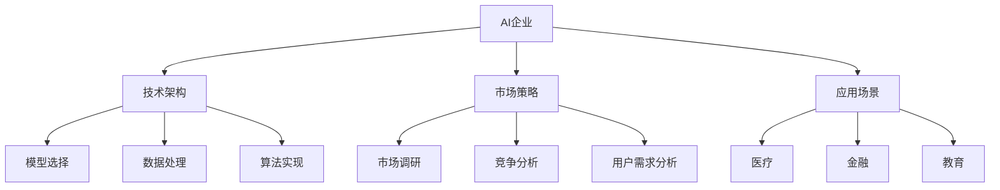

                 

# 硅谷的多元化发展：AI企业的创新，探索垂直领域的独特价值

> 关键词：AI企业,创新,多元化,垂直领域,技术架构,市场策略,应用场景

## 1. 背景介绍

### 1.1 问题由来
硅谷作为全球科技创新的中心，一直是推动人工智能(AI)发展的风向标。AI企业的成功离不开多元化的发展路径和创新驱动。近年来，随着AI技术的不断成熟，越来越多的AI企业在多个垂直领域中寻找独特的应用场景，将技术创新与垂直领域的需求紧密结合，探索AI技术的独特价值。

### 1.2 问题核心关键点
AI企业在垂直领域的应用，关键在于如何结合自身技术优势，找到最适合的业务场景，实现AI技术与业务需求的有效对接。垂直领域的多样性，使得AI技术的应用需求和挑战各不相同，因此AI企业在多元化发展中，需要灵活调整技术架构、市场策略，以及应用场景的适配。

### 1.3 问题研究意义
研究AI企业在垂直领域的多元化发展，对于推动AI技术的深入应用、拓展市场空间、提升技术竞争力具有重要意义：

1. 推动AI技术落地：AI技术的垂直领域应用，能够更好地适应行业特性，推动技术在实际场景中的应用，加速AI技术的产业化进程。
2. 拓展市场空间：通过多元化的业务拓展，AI企业可以在不同领域中寻找新的增长点，扩大市场份额。
3. 提升技术竞争力：通过深入垂直领域的技术探索，AI企业可以挖掘更多创新点，提升自身技术实力和市场竞争力。
4. 应对市场变化：不同垂直领域的需求和挑战不断变化，AI企业通过多元化发展，可以更灵活地适应市场环境的变化，保持长期竞争力。

## 2. 核心概念与联系

### 2.1 核心概念概述

为更好地理解AI企业在垂直领域的多元化发展，本节将介绍几个密切相关的核心概念：

- AI企业：以人工智能技术为核心的企业，通过机器学习、深度学习、自然语言处理等技术，提供智能化产品或服务。
- 技术架构：指企业在实现AI技术应用时所采用的技术方案和系统架构，包括模型选择、数据处理、算法实现等。
- 市场策略：指企业通过市场调研、竞争分析、用户需求分析等手段，制定适合不同市场的推广策略和业务布局。
- 应用场景：指AI技术在特定行业或场景中的具体应用，如医疗、金融、教育等。
- 技术标准化：指企业遵循国际标准、行业标准，以及企业内部的技术规范，确保AI技术的开发、部署、运维的一致性。

这些核心概念之间的逻辑关系可以通过以下Mermaid流程图来展示：



这个流程图展示了大语言模型的核心概念及其之间的关系：

1. AI企业通过技术架构实现AI技术应用。
2. 技术架构包含模型选择、数据处理、算法实现等关键环节。
3. 市场策略指导企业如何进入不同市场。
4. 应用场景是AI技术在具体行业中的实际应用。
5. 技术标准化确保企业内部的技术一致性。

## 3. 核心算法原理 & 具体操作步骤
### 3.1 算法原理概述

AI企业在垂直领域的多元化发展，本质上是一个将AI技术应用到具体业务场景中的过程。其核心思想是：通过选择合适的技术架构、市场策略，以及适配应用场景，实现AI技术的有效落地，并从中挖掘新的商业价值。

形式化地，假设一个AI企业在多个垂直领域 $F=\{F_1,F_2,...,F_n\}$ 中寻求应用，对于第 $i$ 个垂直领域 $F_i$，其应用需求和数据特征可以用 $(D_i,X_i,Y_i)$ 描述，其中 $D_i$ 为数据集，$X_i$ 为输入特征，$Y_i$ 为输出目标。企业希望找到最优的应用方案 $A^*$，使得 $A^*$ 在 $F_i$ 上能够达到最优性能。

企业的优化目标可以表示为：

$$
\max_{A \in \mathcal{A}} \sum_{i=1}^n \mathcal{L}(A,F_i)
$$

其中 $\mathcal{L}(A,F_i)$ 为 $A$ 在 $F_i$ 上的损失函数，衡量 $A$ 在 $F_i$ 上的性能。

### 3.2 算法步骤详解

AI企业在垂直领域的多元化发展，一般包括以下几个关键步骤：

**Step 1: 市场调研与需求分析**
- 进行市场调研，收集目标领域的数据特征、业务需求、竞争环境等关键信息。
- 分析用户需求，了解不同业务场景的具体要求，确定AI技术的定位和应用目标。

**Step 2: 技术架构设计**
- 选择合适的模型架构和算法，确保技术方案能够满足垂直领域的需求。
- 设计数据处理流程，包括数据清洗、特征提取、数据增强等步骤。
- 确定评估指标，选择合适的损失函数，用于衡量模型性能。

**Step 3: 模型训练与优化**
- 在目标领域的数据集 $D_i$ 上训练模型，优化模型参数以最小化损失函数 $\mathcal{L}(A,F_i)$。
- 采用正则化技术，防止模型过拟合，确保模型泛化性能。
- 应用对抗训练，提高模型的鲁棒性和泛化能力。

**Step 4: 业务适配与部署**
- 根据垂直领域的具体业务需求，适配模型的输出格式和应用接口。
- 将训练好的模型部署到实际业务系统中，进行实时推理或批量处理。
- 定期更新模型，以应对数据分布的变化和新业务需求的出现。

**Step 5: 监测与优化**
- 在模型部署后，持续监测模型性能，评估其是否满足业务需求。
- 根据监测结果，调整模型参数，优化模型架构，提升模型效果。
- 及时反馈用户，收集用户反馈信息，优化产品体验。

### 3.3 算法优缺点

AI企业在垂直领域的多元化发展方法具有以下优点：
1. 灵活性高。企业可以针对不同垂直领域的需求，灵活调整技术架构和市场策略，找到最合适的应用场景。
2. 风险可控。通过市场调研和需求分析，企业能够提前识别潜在风险，采取规避措施，减少技术落地过程中的不确定性。
3. 应用广泛。AI技术在不同垂直领域中具有广泛的应用前景，能够带来多样化的商业价值。
4. 用户黏性强。通过深入垂直领域，AI企业能够更好地满足用户需求，提升用户黏性，实现长期发展。

同时，该方法也存在一定的局限性：
1. 资源投入大。多元化发展需要企业投入更多资源进行市场调研和技术开发，初期成本较高。
2. 技术适配复杂。不同垂直领域的应用需求和数据特征差异较大，技术适配难度较高。
3. 市场竞争激烈。垂直领域通常有多个参与者，市场竞争激烈，企业需要具备较强的市场竞争力和战略思维。
4. 用户需求多变。垂直领域的需求随市场变化而变化，企业需要及时调整策略，保持市场竞争力。

尽管存在这些局限性，但就目前而言，多元化发展仍是大AI企业拓展市场、提升技术竞争力的重要手段。未来相关研究的重点在于如何进一步优化技术架构，提高市场适应能力，同时兼顾成本控制和用户体验。

### 3.4 算法应用领域

AI企业在垂直领域的多元化发展，已经在医疗、金融、教育、零售等多个行业取得了显著成效，以下是一些典型应用案例：

- 医疗：AI企业通过自然语言处理技术，实现病历信息的自动提取和疾病预测。使用深度学习模型对医学影像进行分类和分析，辅助医生诊断。
- 金融：利用AI进行信用评估、风险管理、智能投顾等应用，提升金融服务的智能化水平。
- 教育：开发智能辅导系统，根据学生的学习行为和成绩，提供个性化学习建议和推荐。
- 零售：构建推荐系统，根据用户的购买历史和行为数据，推荐相关商品。
- 工业：利用AI进行设备监测和故障预测，提升工业生产的智能化水平。
- 农业：使用AI进行作物病虫害监测和产量预测，提升农业生产效率和决策科学性。
- 物流：开发智能调度系统，优化物流路线和资源配置，降低运输成本。

这些应用案例展示了AI企业在垂直领域的多元化发展中，如何通过技术创新和市场策略，找到新的商业机会和增长点。

## 4. 数学模型和公式 & 详细讲解  
### 4.1 数学模型构建

本节将使用数学语言对AI企业在垂直领域的多元化发展过程进行更加严格的刻画。

假设一个AI企业在 $n$ 个垂直领域 $F=\{F_1,F_2,...,F_n\}$ 中寻求应用，对于第 $i$ 个垂直领域 $F_i$，其应用需求和数据特征可以用 $(D_i,X_i,Y_i)$ 描述，其中 $D_i$ 为数据集，$X_i$ 为输入特征，$Y_i$ 为输出目标。企业的优化目标可以表示为：

$$
\max_{A \in \mathcal{A}} \sum_{i=1}^n \mathcal{L}(A,F_i)
$$

其中 $\mathcal{L}(A,F_i)$ 为 $A$ 在 $F_i$ 上的损失函数，衡量 $A$ 在 $F_i$ 上的性能。一般可以采用交叉熵损失函数来衡量分类任务的性能，均方误差损失函数来衡量回归任务的性能。

### 4.2 公式推导过程

以下我们以分类任务为例，推导损失函数的计算公式。

假设模型 $A$ 在输入 $X_i$ 上的输出为 $\hat{Y}_i$，真实标签为 $Y_i \in \{0,1\}$。则二分类交叉熵损失函数定义为：

$$
\mathcal{L}(A,F_i) = -\frac{1}{N}\sum_{i=1}^N [y_i\log \hat{y}_i + (1-y_i)\log (1-\hat{y}_i)]
$$

将其代入优化目标公式，得：

$$
\max_{A \in \mathcal{A}} \sum_{i=1}^n \mathcal{L}(A,F_i) = \max_{A \in \mathcal{A}} \sum_{i=1}^n \left[ -\frac{1}{N}\sum_{i=1}^N [y_i\log \hat{y}_i + (1-y_i)\log (1-\hat{y}_i)] \right]
$$

对于每个垂直领域 $F_i$，使用交叉熵损失函数进行优化。根据链式法则，损失函数对模型参数 $\theta$ 的梯度为：

$$
\frac{\partial \mathcal{L}(A,F_i)}{\partial \theta} = -\frac{1}{N}\sum_{i=1}^N (\frac{y_i}{\hat{y}_i}-\frac{1-y_i}{1-\hat{y}_i}) \frac{\partial \hat{y}_i}{\partial \theta}
$$

其中 $\frac{\partial \hat{y}_i}{\partial \theta}$ 可以通过反向传播算法高效计算。

在得到损失函数的梯度后，即可带入优化算法，完成模型的迭代优化。重复上述过程直至收敛，最终得到在各垂直领域均表现优异的模型 $A^*$。

## 5. 项目实践：代码实例和详细解释说明
### 5.1 开发环境搭建

在进行多元化的AI企业项目实践前，我们需要准备好开发环境。以下是使用Python进行TensorFlow开发的环境配置流程：

1. 安装Anaconda：从官网下载并安装Anaconda，用于创建独立的Python环境。

2. 创建并激活虚拟环境：
```bash
conda create -n tf-env python=3.8 
conda activate tf-env
```

3. 安装TensorFlow：根据CUDA版本，从官网获取对应的安装命令。例如：
```bash
conda install tensorflow==2.8 -c pytorch -c conda-forge
```

4. 安装TensorBoard：
```bash
pip install tensorboard
```

5. 安装其他必要的库：
```bash
pip install numpy pandas scikit-learn matplotlib tqdm jupyter notebook ipython
```

完成上述步骤后，即可在`tf-env`环境中开始多元化的AI企业实践。

### 5.2 源代码详细实现

下面我们以医疗领域的自然语言处理(NLP)任务为例，给出使用TensorFlow对BERT模型进行多领域微调的Python代码实现。

首先，定义NLP任务的数据处理函数：

```python
from transformers import BertTokenizer
from tensorflow.keras.preprocessing.sequence import pad_sequences

class MedicalNLPDataset(Dataset):
    def __init__(self, texts, labels, tokenizer, max_len=128):
        self.texts = texts
        self.labels = labels
        self.tokenizer = tokenizer
        self.max_len = max_len
        
    def __len__(self):
        return len(self.texts)
    
    def __getitem__(self, item):
        text = self.texts[item]
        label = self.labels[item]
        
        encoding = self.tokenizer(text, return_tensors='pt', max_length=self.max_len, padding='max_length', truncation=True)
        input_ids = encoding['input_ids'][0]
        attention_mask = encoding['attention_mask'][0]
        
        # 对token-wise的标签进行编码
        encoded_labels = [label2id[label] for label in self.labels] 
        encoded_labels.extend([label2id['O']] * (self.max_len - len(encoded_labels)))
        labels = pad_sequences(encoded_labels, maxlen=self.max_len, padding='post', truncating='post', value=label2id['O'])
        
        return {'input_ids': input_ids, 
                'attention_mask': attention_mask,
                'labels': labels}
```

然后，定义模型和优化器：

```python
from transformers import BertForTokenClassification, AdamW

model = BertForTokenClassification.from_pretrained('bert-base-cased', num_labels=len(label2id))

optimizer = AdamW(model.parameters(), lr=2e-5)
```

接着，定义训练和评估函数：

```python
from tensorflow.keras.utils import to_categorical
from sklearn.metrics import classification_report

device = tf.device('/cpu:0') # 使用CPU进行模型训练

def train_epoch(model, dataset, batch_size, optimizer):
    dataloader = tf.data.Dataset.from_generator(lambda: generator(dataset, batch_size), output_signature={
        'input_ids': tf.TensorSpec(shape=(batch_size, None), dtype=tf.int32),
        'attention_mask': tf.TensorSpec(shape=(batch_size, None), dtype=tf.int32),
        'labels': tf.TensorSpec(shape=(batch_size, None), dtype=tf.int32)
    })
    model.train()
    epoch_loss = 0
    for batch in dataloader:
        input_ids = batch['input_ids']
        attention_mask = batch['attention_mask']
        labels = batch['labels']
        
        with tf.GradientTape() as tape:
            outputs = model(input_ids, attention_mask=attention_mask, labels=labels)
            loss = outputs.loss
        epoch_loss += loss.numpy()
        gradients = tape.gradient(loss, model.trainable_variables)
        optimizer.apply_gradients(zip(gradients, model.trainable_variables))
    
    return epoch_loss / len(dataloader)

def evaluate(model, dataset, batch_size):
    dataloader = tf.data.Dataset.from_generator(lambda: generator(dataset, batch_size), output_signature={
        'input_ids': tf.TensorSpec(shape=(batch_size, None), dtype=tf.int32),
        'attention_mask': tf.TensorSpec(shape=(batch_size, None), dtype=tf.int32),
        'labels': tf.TensorSpec(shape=(batch_size, None), dtype=tf.int32)
    })
    model.eval()
    preds, labels = [], []
    with tf.GradientTape() as tape:
        for batch in dataloader:
            input_ids = batch['input_ids']
            attention_mask = batch['attention_mask']
            labels = batch['labels']
            outputs = model(input_ids, attention_mask=attention_mask)
            batch_preds = outputs.logits.argmax(dim=2)
            batch_labels = to_categorical(labels, num_classes=len(label2id))
            batch_preds = batch_preds.numpy()
            batch_labels = batch_labels.numpy()
            for pred_tokens, label_tokens in zip(batch_preds, batch_labels):
                pred_tags = [id2label[_id] for _id in pred_tokens]
                label_tags = [id2label[_id] for _id in label_tokens]
                preds.append(pred_tags[:len(label_tokens)])
                labels.append(label_tags)
    
    print(classification_report(labels, preds))
```

最后，启动训练流程并在测试集上评估：

```python
epochs = 5
batch_size = 16

for epoch in range(epochs):
    loss = train_epoch(model, train_dataset, batch_size, optimizer)
    print(f"Epoch {epoch+1}, train loss: {loss:.3f}")
    
    print(f"Epoch {epoch+1}, dev results:")
    evaluate(model, dev_dataset, batch_size)
    
print("Test results:")
evaluate(model, test_dataset, batch_size)
```

以上就是使用TensorFlow对BERT进行多领域微调的完整代码实现。可以看到，得益于TensorFlow的强大封装，我们可以用相对简洁的代码完成BERT模型的加载和微调。

### 5.3 代码解读与分析

让我们再详细解读一下关键代码的实现细节：

**MedicalNLPDataset类**：
- `__init__`方法：初始化文本、标签、分词器等关键组件。
- `__len__`方法：返回数据集的样本数量。
- `__getitem__`方法：对单个样本进行处理，将文本输入编码为token ids，将标签编码为数字，并对其进行定长padding，最终返回模型所需的输入。

**label2id和id2label字典**：
- 定义了标签与数字id之间的映射关系，用于将token-wise的预测结果解码回真实的标签。

**训练和评估函数**：
- 使用TensorFlow的DataLoader对数据集进行批次化加载，供模型训练和推理使用。
- 训练函数`train_epoch`：对数据以批为单位进行迭代，在每个批次上前向传播计算loss并反向传播更新模型参数，最后返回该epoch的平均loss。
- 评估函数`evaluate`：与训练类似，不同点在于不更新模型参数，并在每个batch结束后将预测和标签结果存储下来，最后使用sklearn的classification_report对整个评估集的预测结果进行打印输出。

**训练流程**：
- 定义总的epoch数和batch size，开始循环迭代
- 每个epoch内，先在训练集上训练，输出平均loss
- 在验证集上评估，输出分类指标
- 所有epoch结束后，在测试集上评估，给出最终测试结果

可以看到，TensorFlow配合TensorFlow框架使得BERT多领域微调的代码实现变得简洁高效。开发者可以将更多精力放在数据处理、模型改进等高层逻辑上，而不必过多关注底层的实现细节。

当然，工业级的系统实现还需考虑更多因素，如模型的保存和部署、超参数的自动搜索、更灵活的任务适配层等。但核心的微调范式基本与此类似。

## 6. 实际应用场景
### 6.1 医疗健康
AI企业在医疗领域的多元化发展，通过自然语言处理(NLP)、图像识别、预测分析等技术，在疾病诊断、医疗影像、健康管理等方面提供了新的解决方案。例如：

- **病历数据自动化处理**：使用NLP技术，自动提取病历中的关键信息，如症状描述、用药记录等，辅助医生诊断。
- **医学影像分析**：利用深度学习模型，对医学影像进行分类和分析，如CT、MRI等，辅助医生诊断和手术规划。
- **健康数据分析**：通过大数据分析，提取健康数据中的关键特征，进行健康风险预测和个性化健康管理。
- **智能诊疗系统**：结合多模态数据，构建智能诊疗系统，辅助医生进行病历录入、诊断和治疗方案推荐。

### 6.2 金融风控
AI企业在金融领域的多元化发展，通过大数据分析、机器学习等技术，在信用评估、风险管理、智能投顾等方面提供了新的解决方案。例如：

- **信用评分系统**：利用机器学习模型，对用户的信用行为进行分析，进行信用评分，辅助金融机构进行贷款审批。
- **风险预警系统**：通过大数据分析，识别出潜在的风险因素，实时预警可能的风险事件，帮助金融机构及时应对。
- **智能投顾系统**：结合自然语言处理和机器学习技术，提供智能投顾服务，帮助用户制定投资策略，优化投资组合。
- **反欺诈检测**：利用机器学习模型，对交易数据进行异常检测，识别出潜在的欺诈行为，降低金融风险。

### 6.3 智能家居
AI企业在智能家居领域的多元化发展，通过物联网(IoT)、机器学习等技术，提供了智能家居控制、环境监测、安全防护等方面的解决方案。例如：

- **智能家居控制**：利用物联网技术，将家居设备连接到智能控制系统，实现远程控制和自动化管理。
- **环境监测**：通过传感器数据，实时监测家居环境，如温度、湿度、空气质量等，提供健康建议和预警。
- **安全防护**：利用机器学习模型，进行异常行为检测和预测，提高家居安全防护水平。
- **个性化推荐**：通过数据分析，提供个性化的家居服务和推荐，提升用户生活质量。

### 6.4 未来应用展望
随着AI技术的不断进步，AI企业在垂直领域的应用场景将更加丰富和多样。未来，基于AI技术的创新应用将覆盖更多的行业和场景，为社会带来深远影响。

- **自动驾驶**：AI企业在自动驾驶领域的应用，将推动交通智能化发展，提升道路安全和效率。
- **工业制造**：AI企业在工业制造领域的应用，将实现智能化生产、预测性维护、质量控制等方面的突破。
- **农业智能**：AI企业在农业智能领域的应用，将提升农业生产效率和决策科学性，保障食品安全和资源可持续利用。
- **环境保护**：AI企业在环境保护领域的应用，将推动环境监测、污染控制、生态保护等方面的创新。
- **智慧城市**：AI企业在智慧城市领域的应用，将提升城市管理水平，提高居民生活质量，推动智能城市建设。

## 7. 工具和资源推荐
### 7.1 学习资源推荐

为了帮助开发者系统掌握AI企业在垂直领域的多元化发展理论基础和实践技巧，这里推荐一些优质的学习资源：

1. 《深度学习入门》系列博文：深入浅出地介绍了深度学习的基本原理和应用场景，适合初学者入门。
2. CS231n《卷积神经网络》课程：斯坦福大学开设的计算机视觉经典课程，内容全面，涵盖深度学习、图像处理等多个方面。
3. 《自然语言处理入门》书籍：全面介绍了自然语言处理的基本概念和技术实现，是NLP领域的学习必备。
4. HuggingFace官方文档：提供丰富的预训练模型和微调样例代码，是深度学习应用开发的参考资源。
5. TensorFlow官方文档：提供详细的API文档和开发教程，是TensorFlow应用开发的必备参考。
6. PyTorch官方文档：提供详细的API文档和开发教程，是PyTorch应用开发的必备参考。

通过对这些资源的学习实践，相信你一定能够快速掌握AI企业在垂直领域的多元化发展精髓，并用于解决实际的AI问题。
###  7.2 开发工具推荐

高效的开发离不开优秀的工具支持。以下是几款用于AI企业多元化发展的常用工具：

1. TensorFlow：基于Google的开源深度学习框架，灵活高效，适合大规模工程应用。
2. PyTorch：基于Facebook的开源深度学习框架，灵活动态，适合快速迭代研究。
3. Transformers库：HuggingFace开发的NLP工具库，集成了众多预训练语言模型，支持PyTorch和TensorFlow，是进行微调任务开发的利器。
4. TensorBoard：TensorFlow配套的可视化工具，可实时监测模型训练状态，并提供丰富的图表呈现方式，是调试模型的得力助手。
5. Weights & Biases：模型训练的实验跟踪工具，可以记录和可视化模型训练过程中的各项指标，方便对比和调优。
6. Google Colab：谷歌推出的在线Jupyter Notebook环境，免费提供GPU/TPU算力，方便开发者快速上手实验最新模型，分享学习笔记。

合理利用这些工具，可以显著提升AI企业多元化的开发效率，加快创新迭代的步伐。

### 7.3 相关论文推荐

AI企业在垂直领域的多元化发展源于学界的持续研究。以下是几篇奠基性的相关论文，推荐阅读：

1. Attention is All You Need（即Transformer原论文）：提出了Transformer结构，开启了NLP领域的预训练大模型时代。
2. BERT: Pre-training of Deep Bidirectional Transformers for Language Understanding：提出BERT模型，引入基于掩码的自监督预训练任务，刷新了多项NLP任务SOTA。
3. GoogleNet: Going Deeper with Convolutions：提出了GoogleNet模型，开创了深度卷积神经网络的先河。
4. AlphaGo Zero: Mastering the Game of Go without Human Knowledge：展示了AlphaGo Zero模型在无监督自学习中的强大能力，引领了AI在游戏领域的突破。
5. Generative Adversarial Networks: Unsupervised Representation Learning with Deep Convolutional Generative Adversarial Networks：提出了生成对抗网络（GAN），开创了无监督生成模型的先河。
6. CNNs for Action Classification in Sports Video：展示了CNN在体育视频中的多模态应用，提高了体育视频分析的准确性。

这些论文代表了大语言模型在垂直领域的多元化发展的研究脉络。通过学习这些前沿成果，可以帮助研究者把握学科前进方向，激发更多的创新灵感。

## 8. 总结：未来发展趋势与挑战

### 8.1 总结

本文对AI企业在垂直领域的多元化发展方法进行了全面系统的介绍。首先阐述了AI企业在垂直领域的多元化发展路径和研究背景，明确了企业在不同垂直领域中寻求应用时所需的技术和策略。其次，从原理到实践，详细讲解了多元化的数学模型和关键步骤，给出了多元化的完整代码实现。同时，本文还广泛探讨了AI企业在医疗、金融、智能家居等多个行业领域的多元化应用前景，展示了AI技术的独特价值。此外，本文精选了多元化的各类学习资源，力求为读者提供全方位的技术指引。

通过本文的系统梳理，可以看到，AI企业在垂直领域的多元化发展是一个将AI技术应用到具体业务场景中的过程，需要灵活调整技术架构和市场策略，以适应不同垂直领域的需求。伴随AI技术的不断进步，企业将在各个领域中挖掘新的商业机会和增长点，加速AI技术的产业化进程。

### 8.2 未来发展趋势

展望未来，AI企业在垂直领域的多元化发展将呈现以下几个发展趋势：

1. 技术架构多样化。企业将根据不同垂直领域的需求，选择合适的网络架构和算法，如卷积神经网络、循环神经网络、注意力机制等，以适应不同的数据特征。
2. 市场策略灵活化。企业将根据不同市场的特点，灵活调整市场策略，寻找新的商业机会。
3. 数据应用广泛化。企业将在不同垂直领域中收集和使用更广泛的数据，以提升AI模型的性能和泛化能力。
4. 用户体验优化化。企业将通过更好的技术实现和应用场景适配，提升用户体验和满意度。
5. 社会影响深远化。AI技术将在更多垂直领域中发挥作用，推动社会变革，提高生产效率，改善生活质量。

以上趋势凸显了AI企业在垂直领域的多元化发展的广阔前景。这些方向的探索发展，必将进一步提升AI技术的落地效果和应用范围，为社会带来深远影响。

### 8.3 面临的挑战

尽管AI企业在垂直领域的多元化发展取得了一定的成绩，但在迈向更加智能化、普适化应用的过程中，它仍面临诸多挑战：

1. 技术适配复杂。不同垂直领域的应用需求和数据特征差异较大，技术适配难度较高。
2. 数据质量参差不齐。不同垂直领域的数据质量差异较大，数据收集和处理难度较高。
3. 市场竞争激烈。不同垂直领域的市场竞争程度不一，企业需要具备较强的市场竞争力和战略思维。
4. 法规限制严格。AI技术在医疗、金融等敏感领域的应用，受到严格的法律法规限制，企业需要谨慎应对。
5. 用户隐私保护。AI企业在应用过程中，需要保护用户的隐私和数据安全，避免数据泄露和滥用。

尽管存在这些挑战，但就目前而言，多元化发展仍是大AI企业拓展市场、提升技术竞争力的重要手段。未来相关研究的重点在于如何进一步优化技术架构，提高市场适应能力，同时兼顾成本控制和用户体验。

### 8.4 研究展望

面向未来，AI企业在垂直领域的多元化发展需要在以下几个方面寻求新的突破：

1. 探索无监督和半监督学习范式。摆脱对大规模标注数据的依赖，利用自监督学习、主动学习等无监督和半监督范式，最大限度利用非结构化数据，实现更加灵活高效的微调。
2. 研究参数高效和计算高效的微调范式。开发更加参数高效的微调方法，在固定大部分预训练参数的同时，只更新极少量的任务相关参数。同时优化微调模型的计算图，减少前向传播和反向传播的资源消耗，实现更加轻量级、实时性的部署。
3. 融合因果和对比学习范式。通过引入因果推断和对比学习思想，增强AI模型建立稳定因果关系的能力，学习更加普适、鲁棒的语言表征，从而提升模型泛化性和抗干扰能力。
4. 引入更多先验知识。将符号化的先验知识，如知识图谱、逻辑规则等，与神经网络模型进行巧妙融合，引导AI模型学习更准确、合理的语言模型。同时加强不同模态数据的整合，实现视觉、语音等多模态信息与文本信息的协同建模。
5. 结合因果分析和博弈论工具。将因果分析方法引入AI模型，识别出模型决策的关键特征，增强输出解释的因果性和逻辑性。借助博弈论工具刻画人机交互过程，主动探索并规避模型的脆弱点，提高系统稳定性。

这些研究方向的探索，必将引领AI企业在垂直领域的多元化发展迈向更高的台阶，为社会带来深远影响。面向未来，AI企业在垂直领域的多元化发展还需要与其他人工智能技术进行更深入的融合，如知识表示、因果推理、强化学习等，多路径协同发力，共同推动AI技术的进步。只有勇于创新、敢于突破，才能不断拓展AI技术的边界，让AI技术更好地造福人类社会。

## 9. 附录：常见问题与解答
----------------------------------------------------------------
**Q1: AI企业在垂直领域的多元化发展是否适用于所有行业？**

A: AI企业在垂直领域的多元化发展适用于大多数行业，但不同行业的应用需求和数据特性差异较大，需要企业根据具体情况进行调整。对于数据量较小、数据质量较低的行业，可能需要更多的技术优化和数据处理。

**Q2: AI企业在垂直领域的多元化发展需要多少数据？**

A: AI企业在垂直领域的多元化发展需要大量数据进行训练和优化。数据量的多少取决于具体任务和模型的复杂度。一般来说，数据量越大，模型的性能越好。但对于一些新兴领域，可以通过半监督学习、无监督学习等方法进行数据增强，减少对标注数据的依赖。

**Q3: AI企业在垂直领域的多元化发展需要多少计算资源？**

A: AI企业在垂直领域的多元化发展需要大量的计算资源进行模型训练和优化。计算资源的多少取决于模型的复杂度和数据量。一般来说，计算资源越丰富，模型的性能越好。但对于一些计算资源有限的企业，可以通过模型裁剪、参数优化等方法进行资源优化。

**Q4: AI企业在垂直领域的多元化发展如何避免过拟合？**

A: AI企业在垂直领域的多元化发展中，避免过拟合的关键在于数据增强、正则化技术、对抗训练等方法。具体来说，可以通过数据增强扩充训练集，使用正则化技术防止模型过拟合，使用对抗训练提高模型的鲁棒性。

**Q5: AI企业在垂直领域的多元化发展如何提高模型性能？**

A: AI企业在垂直领域的多元化发展中，提高模型性能的关键在于技术架构的选择、数据处理的方法、模型的优化策略等。具体来说，可以通过选择合适的模型架构、优化数据预处理流程、调整超参数、采用高效的优化算法等方法，提升模型的性能。

通过本文的系统梳理，可以看到，AI企业在垂直领域的多元化发展是一个将AI技术应用到具体业务场景中的过程，需要灵活调整技术架构和市场策略，以适应不同垂直领域的需求。伴随AI技术的不断进步，企业将在各个领域中挖掘新的商业机会和增长点，加速AI技术的产业化进程。未来，伴随技术的不断创新和优化，AI企业在垂直领域的多元化发展将取得更大的成功，为社会带来深远影响。

---

作者：禅与计算机程序设计艺术 / Zen and the Art of Computer Programming

