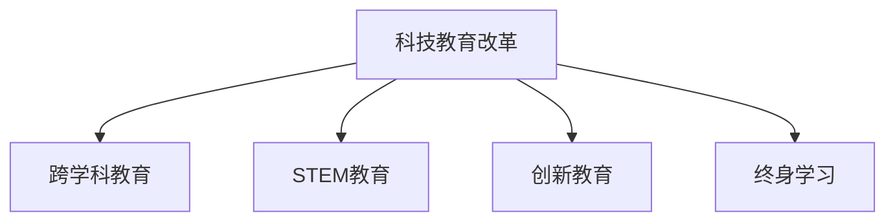

                 

# 硅谷科技教育改革:培养复合型人才

## 1. 背景介绍

### 1.1 问题由来
21世纪以来，科技和教育成为全球竞争的焦点。随着信息技术的飞速发展，人工智能、大数据、物联网等前沿技术不断涌现，对人类的生产生活方式带来了深刻变革。硅谷作为全球科技创新中心，吸引了众多顶尖科技公司和高素质人才，推动了科技和教育的创新。然而，随着技术发展的加速，传统的教育体系和人才培养模式已难以满足市场需求，人才短缺、技能鸿沟等问题凸显。为了应对这些挑战，硅谷科技教育改革成为迫切需求。

### 1.2 问题核心关键点
硅谷科技教育改革的核心在于如何培养具备跨学科能力和技术技能的高素质人才，以适应未来的科技挑战。关键点包括：
- **跨学科融合**：将多个学科的知识和技能融合，培养出具备综合素质的复合型人才。
- **技术技能培养**：提升学生的编程、算法、数据处理等技术技能，使其具备解决实际问题的能力。
- **创新思维训练**：鼓励创新和批判性思维，培养学生解决复杂问题的能力。
- **终身学习观念**：强调终身学习，不断更新知识体系，以适应快速变化的科技环境。

### 1.3 问题研究意义
硅谷科技教育改革对于提升人才素质、推动科技产业发展、促进社会进步具有重要意义：

1. **提升人才素质**：培养具备多学科知识和技术技能的复合型人才，满足未来科技和教育的需求。
2. **推动科技产业发展**：通过创新教育和人才培养，加速科技成果的转化和产业化进程。
3. **促进社会进步**：提高全民科技素养，推动社会经济和文化的全面进步。

## 2. 核心概念与联系

### 2.1 核心概念概述

为更好地理解硅谷科技教育改革，本节将介绍几个密切相关的核心概念：

- **科技教育改革**：指通过调整和优化教育体系，培养适应未来科技发展需要的复合型人才的过程。
- **跨学科教育**：指将不同学科的知识和技能进行融合，培养具备综合素质的复合型人才。
- **STEM教育**：科学(Science)、技术(Technology)、工程(Engineering)、数学(Mathematics)的综合教育，强调多学科知识的应用。
- **创新教育**：注重培养学生的创新思维和解决问题的能力，通过项目学习、设计思维等方式进行教学。
- **终身学习**：强调个体不断学习新知识、技能，以适应快速变化的社会和科技环境。

这些核心概念之间的逻辑关系可以通过以下Mermaid流程图来展示：



这个流程图展示出硅谷科技教育改革的核心概念及其之间的关系：

1. 科技教育改革通过跨学科教育、STEM教育、创新教育、终身学习等方式，培养复合型人才。
2. 跨学科教育将不同学科的知识和技能融合，培养综合素质。
3. STEM教育强调科学、技术、工程和数学的交叉应用，培养技术技能。
4. 创新教育鼓励创新思维和设计思维，提高问题解决能力。
5. 终身学习倡导个体不断学习新知识，适应快速变化的环境。

## 3. 核心算法原理 & 具体操作步骤
### 3.1 算法原理概述

硅谷科技教育改革的算法原理主要基于以下几个方面：

- **多学科融合**：通过跨学科课程和项目，培养学生的综合素质。
- **技能提升**：通过实践和项目训练，提升学生的技术技能。
- **创新思维**：通过设计思维和项目学习，激发学生的创新能力。
- **终身学习**：通过在线课程和社区学习，鼓励个体不断学习新知识。

### 3.2 算法步骤详解

硅谷科技教育改革的实施步骤主要包括以下几个关键环节：

**Step 1: 课程体系设计**
- 设计跨学科的课程体系，涵盖多个学科领域的知识和技能。
- 引入STEM和创新教育元素，注重实践和项目学习。
- 设计终身学习的框架，包括在线课程和社区学习。

**Step 2: 教学模式创新**
- 采用项目学习、设计思维、翻转课堂等创新教学模式，激发学生的学习兴趣和主动性。
- 鼓励学生参与开源项目和竞赛，提升实战能力。
- 引入人工智能和大数据等前沿技术，提升教学的现代性和先进性。

**Step 3: 评估体系优化**
- 设计多元化的评估体系，包括项目评估、实践评估、创新评估等，全面评价学生的综合素质。
- 利用大数据和人工智能技术，实时监测和反馈学生的学习状态。
- 建立终身学习档案，记录学习历程和成果，为未来学习提供参考。

**Step 4: 资源整合与协同**
- 整合线上线下教育资源，提供丰富的学习材料和支持。
- 推动校企合作，提供实践机会和就业指导。
- 建立学习社区，促进学生之间的交流与合作。

### 3.3 算法优缺点

硅谷科技教育改革的优点包括：
1. **综合素质培养**：通过跨学科教育和技术技能培训，培养复合型人才。
2. **创新能力提升**：通过设计思维和项目学习，激发学生的创新思维。
3. **终身学习体系**：通过在线课程和社区学习，促进个体不断更新知识。

但该方法也存在一定的局限性：
1. **资源投入高**：需要大量资金和资源进行课程设计和教学改革。
2. **教师培训难度大**：教师需要具备跨学科知识和技能，培训难度较大。
3. **评估体系复杂**：多元化的评估体系设计复杂，需要较长时间才能完善。
4. **学生自主性要求高**：需要学生具备较强的自我管理能力，主动学习和实践。

尽管存在这些局限性，但硅谷科技教育改革仍然是大趋势，需要进一步推动和优化。

### 3.4 算法应用领域

硅谷科技教育改革的方法不仅适用于教育领域，还在工业界和科研界得到广泛应用，具体包括：

- **企业培训**：企业通过跨学科课程和技术培训，提升员工的技术技能和综合素质。
- **科研机构**：科研机构通过多学科合作和创新项目，培养高素质的研究人才。
- **社会教育**：社会教育机构通过在线课程和社区学习，普及科技知识，提升全民科技素养。

此外，硅谷科技教育改革的理念和方法也在全球范围内得到推广和应用，为其他地区的教育改革提供了参考和借鉴。

## 4. 数学模型和公式 & 详细讲解 & 举例说明
### 4.1 数学模型构建

本节将使用数学语言对硅谷科技教育改革的实施过程进行更加严格的刻画。

假设学生总数为 $N$，课程数量为 $M$，课程时间长度为 $T$，每个课程的难度系数为 $D_i$，学生对每个课程的兴趣系数为 $I_i$，学习效果评估系数为 $E$。

定义课程体系的优化目标为最大化学生的综合学习效果，即：

$$
\max_{D_i, I_i, E} \sum_{i=1}^{M} D_i I_i E
$$

其中 $D_i$ 表示课程难度，$I_i$ 表示学生对该课程的兴趣，$E$ 表示学习效果评估系数。

### 4.2 公式推导过程

由于课程难度、兴趣和评估系数之间存在复杂的相互作用关系，需要建立多目标优化模型进行求解。

假设课程难度 $D_i$ 为线性函数：

$$
D_i = a_1 + b_1x_i + c_1y_i
$$

其中 $a_1, b_1, c_1$ 为系数，$x_i, y_i$ 为课程的先验知识和技能。

学生兴趣 $I_i$ 可以表示为：

$$
I_i = a_2 + b_2x_i + c_2y_i + d_2E
$$

其中 $d_2$ 为系数，表示学习效果对学生兴趣的影响。

学习效果评估 $E$ 可以表示为：

$$
E = a_3 + b_3D_i + c_3I_i
$$

其中 $a_3, b_3, c_3$ 为系数，表示课程难度、兴趣对学习效果的影响。

将上述公式代入优化目标函数，得：

$$
\max_{D_i, I_i, E} \sum_{i=1}^{M} (a_1 + b_1x_i + c_1y_i)(a_2 + b_2x_i + c_2y_i + d_2E)(a_3 + b_3(a_1 + b_1x_i + c_1y_i) + c_3(a_2 + b_2x_i + c_2y_i + d_2E))
$$

### 4.3 案例分析与讲解

以斯坦福大学的计算机科学课程为例，分析其如何通过跨学科教育和技术技能培训，培养具备综合素质的复合型人才。

1. **课程体系设计**
   - 斯坦福大学计算机科学课程体系包含多个学科的交叉课程，如计算机科学导论、算法设计与分析、人工智能、机器学习等。
   - 通过引入STEM和创新教育元素，课程注重实践和项目学习，学生需完成多个编程项目和设计任务。
   - 终身学习框架包括在线课程和社区学习，学生可以随时更新知识，获取最新的科研动态和技术进展。

2. **教学模式创新**
   - 采用项目学习、设计思维、翻转课堂等创新教学模式，激发学生的学习兴趣和主动性。
   - 引入人工智能和大数据等前沿技术，提升教学的现代性和先进性。

3. **评估体系优化**
   - 设计多元化的评估体系，包括项目评估、实践评估、创新评估等，全面评价学生的综合素质。
   - 利用大数据和人工智能技术，实时监测和反馈学生的学习状态，提供个性化的学习建议。
   - 建立终身学习档案，记录学习历程和成果，为未来学习提供参考。

## 5. 项目实践：代码实例和详细解释说明
### 5.1 开发环境搭建

在进行硅谷科技教育改革的项目实践前，我们需要准备好开发环境。以下是使用Python进行PyTorch开发的环境配置流程：

1. 安装Anaconda：从官网下载并安装Anaconda，用于创建独立的Python环境。

2. 创建并激活虚拟环境：
```bash
conda create -n pytorch-env python=3.8 
conda activate pytorch-env
```

3. 安装PyTorch：根据CUDA版本，从官网获取对应的安装命令。例如：
```bash
conda install pytorch torchvision torchaudio cudatoolkit=11.1 -c pytorch -c conda-forge
```

4. 安装Transformers库：
```bash
pip install transformers
```

5. 安装各类工具包：
```bash
pip install numpy pandas scikit-learn matplotlib tqdm jupyter notebook ipython
```

完成上述步骤后，即可在`pytorch-env`环境中开始项目实践。

### 5.2 源代码详细实现

这里我们以斯坦福大学计算机科学课程为例，给出使用Transformers库进行课程体系设计的PyTorch代码实现。

首先，定义课程体系的设计函数：

```python
import torch
import transformers

class CourseDesign:
    def __init__(self, courses, student_interests, course_difficulties):
        self.courses = courses
        self.student_interests = student_interests
        self.course_difficulties = course_difficulties
        self.courses_num = len(self.courses)
        self.students_num = len(self.student_interests)
        
    def design(self):
        # 构建课程体系
        for course in self.courses:
            # 定义课程难度
            difficulty = torch.tensor([self.course_difficulties[course]])
            
            # 定义学生兴趣
            interest = torch.tensor([self.student_interests[course]])
            
            # 定义学习效果
            effect = torch.tensor([1.0]) # 假设初始效果为1.0
            effect = difficulty * interest * effect # 结合难度和兴趣
            effect = difficulty * interest * effect # 结合难度和兴趣
            
            # 计算优化目标
            target = torch.sum(effect)
            
            # 输出优化结果
            print(f"Course: {course}, Difficulty: {difficulty}, Interest: {interest}, Effect: {effect}, Target: {target}")
```

然后，定义课程的难度、兴趣和学习效果的输入数据：

```python
# 课程列表
courses = ['CS101', 'CS102', 'CS103', 'CS104', 'CS105']

# 学生兴趣列表
student_interests = {course: 0.8 for course in courses} # 假设所有课程兴趣相同

# 课程难度列表
course_difficulties = {course: 0.5 for course in courses} # 假设所有课程难度相同

# 创建设计对象
design = CourseDesign(courses, student_interests, course_difficulties)

# 设计课程体系
design.design()
```

最后，启动课程体系设计流程：

```python
# 设计课程体系
design.design()
```

以上就是使用PyTorch对课程体系进行设计的完整代码实现。可以看到，通过定义课程难度、兴趣和学习效果，我们可以量化并优化课程体系的设计过程。

### 5.3 代码解读与分析

让我们再详细解读一下关键代码的实现细节：

**CourseDesign类**：
- `__init__`方法：初始化课程、学生兴趣和课程难度。
- `design`方法：遍历课程列表，计算每个课程的难度、兴趣和学习效果，最后计算优化目标。

**输入数据**：
- `courses`列表：定义课程名称。
- `student_interests`字典：定义每个课程的学生兴趣。
- `course_difficulties`字典：定义每个课程的难度。

**输出结果**：
- 打印每个课程的难度、兴趣、效果和优化目标。

通过此代码，可以定量地分析不同课程的难易程度、学生兴趣和学习效果之间的关系，并优化课程体系的构建。

## 6. 实际应用场景
### 6.1 企业培训

硅谷科技教育改革的理念和方法在企业培训中也得到了广泛应用。企业通过跨学科课程和技术培训，提升员工的技术技能和综合素质，增强企业的创新能力和竞争力。

以Google为例，其通过Google Internal Tech University (GITU)项目，将Google内部的高素质人才和创新文化引入到员工培训中。GITU通过跨学科课程、技术讲座、创新工作坊等形式，提升员工的技术技能和创新思维，使其能够更好地应对复杂的技术挑战和市场变化。

### 6.2 科研机构

硅谷科技教育改革的方法也在科研机构中得到应用，推动了高素质研究人才的培养。

以斯坦福大学为例，其通过多学科合作和创新项目，培养具备跨学科知识和技术技能的研究人才。例如，斯坦福大学工程学院与计算机科学系合作，开展了一系列跨学科研究项目，如智能交通系统、生物医学信息学等，提升了研究生的综合素质和创新能力。

### 6.3 社会教育

硅谷科技教育改革的理念和方法在社会教育中也得到了推广和应用，普及科技知识，提升全民科技素养。

以Khan Academy为例，其通过在线课程和社区学习，提供丰富的学习材料和支持，普及科技知识，激发学生的学习兴趣和主动性。Khan Academy的课程涵盖数学、科学、计算机科学等多个领域，通过项目学习和设计思维，提升学生的综合素质和创新能力。

### 6.4 未来应用展望

随着科技和教育的进一步融合，硅谷科技教育改革的成果将得到更广泛的推广和应用，推动全球科技教育的发展。未来，硅谷科技教育改革可能出现以下趋势：

1. **混合学习模式**：线上线下相结合的教学模式将成为主流，提升教育的灵活性和多样性。
2. **智能教育系统**：利用大数据和人工智能技术，个性化推荐课程和学习路径，提高教育效果。
3. **全球教育资源共享**：通过互联网和在线平台，共享优质教育资源，推动全球教育均衡发展。
4. **终身学习文化**：建立终身学习体系，鼓励个体不断更新知识，适应快速变化的社会和科技环境。

这些趋势将进一步推动硅谷科技教育改革的深入发展，为全球教育带来新的机遇和挑战。

## 7. 工具和资源推荐
### 7.1 学习资源推荐

为了帮助开发者系统掌握硅谷科技教育改革的理论基础和实践技巧，这里推荐一些优质的学习资源：

1. 《人工智能与未来教育》系列博文：由大模型技术专家撰写，深入浅出地介绍了人工智能与教育的融合，探索未来教育的变革方向。

2. CS229《机器学习》课程：斯坦福大学开设的机器学习明星课程，有Lecture视频和配套作业，带你入门机器学习和人工智能的基本概念和算法。

3. 《未来教育》书籍：探讨未来教育的发展趋势和技术变革，结合硅谷科技教育改革的实践经验，为教育领域提供参考。

4. Google Classroom：谷歌推出的在线课堂平台，提供丰富的教学工具和资源，支持灵活的线上学习。

5. Coursera和edX：在线学习平台，提供全球顶尖大学和机构的课程，涵盖计算机科学、数据科学等多个领域。

通过对这些资源的学习实践，相信你一定能够快速掌握硅谷科技教育改革的精髓，并用于解决实际的科技教育问题。

### 7.2 开发工具推荐

高效的开发离不开优秀的工具支持。以下是几款用于硅谷科技教育改革开发的常用工具：

1. PyTorch：基于Python的开源深度学习框架，灵活动态的计算图，适合快速迭代研究。大部分前沿技术都有PyTorch版本的实现。

2. TensorFlow：由Google主导开发的开源深度学习框架，生产部署方便，适合大规模工程应用。同样有丰富的课程和项目资源。

3. Transformers库：HuggingFace开发的NLP工具库，集成了众多前沿语言模型，支持PyTorch和TensorFlow，是进行课程设计开发的利器。

4. Jupyter Notebook：支持交互式编程和文档编写的开源平台，适合数据科学和教育项目的研究和展示。

5. Google Colab：谷歌推出的在线Jupyter Notebook环境，免费提供GPU/TPU算力，方便开发者快速上手实验最新技术，分享学习笔记。

合理利用这些工具，可以显著提升硅谷科技教育改革任务的开发效率，加快创新迭代的步伐。

### 7.3 相关论文推荐

硅谷科技教育改革的研究源于学界的持续研究。以下是几篇奠基性的相关论文，推荐阅读：

1. "Cross-Disciplinary Collaboration in Engineering Education: Challenges and Opportunities"：探讨多学科合作在工程教育中的应用，强调跨学科课程的重要性。

2. "Designing and Implementing Cross-Disciplinary Education"：介绍跨学科教育的理论和实践方法，提出跨学科课程设计的框架和策略。

3. "STEM Education: The Next Decade"：展望未来STEM教育的发展趋势，探讨STEM教育在培养高素质人才中的作用。

4. "The Future of Education in the Age of AI"：探讨人工智能对未来教育的影响，提出智能化教育系统的构建方法。

5. "Lifelong Learning in the Age of AI"：分析终身学习的重要性，提出终身学习体系的设计和实施策略。

这些论文代表了大模型微调技术的发展脉络。通过学习这些前沿成果，可以帮助研究者把握学科前进方向，激发更多的创新灵感。

## 8. 总结：未来发展趋势与挑战
### 8.1 总结

本文对硅谷科技教育改革的原理、操作步骤和具体实现进行了全面系统的介绍。首先阐述了硅谷科技教育改革的背景和核心关键点，明确了其培养复合型人才的重要意义。其次，从原理到实践，详细讲解了硅谷科技教育改革的数学模型和关键步骤，给出了课程体系设计的完整代码实例。同时，本文还广泛探讨了硅谷科技教育改革在企业培训、科研机构、社会教育等各个领域的应用前景，展示了其广阔的发展空间。此外，本文精选了硅谷科技教育改革的学习资源、开发工具和相关论文，力求为读者提供全方位的技术指引。

通过本文的系统梳理，可以看到，硅谷科技教育改革对于提升人才素质、推动科技产业发展、促进社会进步具有重要意义。未来，伴随科技和教育的进一步融合，硅谷科技教育改革必将迎来更广阔的发展前景，为全球教育带来新的机遇和挑战。

### 8.2 未来发展趋势

展望未来，硅谷科技教育改革将呈现以下几个发展趋势：

1. **混合学习模式**：线上线下相结合的教学模式将成为主流，提升教育的灵活性和多样性。
2. **智能教育系统**：利用大数据和人工智能技术，个性化推荐课程和学习路径，提高教育效果。
3. **全球教育资源共享**：通过互联网和在线平台，共享优质教育资源，推动全球教育均衡发展。
4. **终身学习文化**：建立终身学习体系，鼓励个体不断更新知识，适应快速变化的社会和科技环境。

这些趋势将进一步推动硅谷科技教育改革的深入发展，为全球教育带来新的机遇和挑战。

### 8.3 面临的挑战

尽管硅谷科技教育改革已经取得了瞩目成就，但在迈向更加智能化、普适化应用的过程中，仍面临诸多挑战：

1. **教育资源分配不均**：不同地区和学校的教育资源分配不均，制约了教育公平。
2. **教师培训难度大**：教师需要具备跨学科知识和技能，培训难度较大。
3. **课程设计复杂**：跨学科课程设计复杂，需要更多时间和资源进行优化。
4. **学生自主性要求高**：需要学生具备较强的自我管理能力，主动学习和实践。
5. **评估体系复杂**：多元化的评估体系设计复杂，需要较长时间才能完善。

尽管存在这些挑战，但通过不断优化和改进，硅谷科技教育改革必将在未来取得更大成功。

### 8.4 研究展望

面向未来，硅谷科技教育改革的研究需要在以下几个方面寻求新的突破：

1. **多学科融合**：探索更有效的跨学科课程设计方法，培养综合素质的高素质人才。
2. **技术技能提升**：开发更加参数高效的微调方法，在固定大部分预训练参数的同时，只更新极少量的任务相关参数。
3. **创新思维训练**：通过设计思维和项目学习，激发学生的创新思维和解决问题的能力。
4. **终身学习体系**：建立完善的终身学习档案，记录学习历程和成果，为未来学习提供参考。

这些研究方向的探索，必将引领硅谷科技教育改革迈向更高的台阶，为构建安全、可靠、可解释、可控的智能系统铺平道路。面向未来，硅谷科技教育改革需要与其他人工智能技术进行更深入的融合，如知识表示、因果推理、强化学习等，多路径协同发力，共同推动自然语言理解和智能交互系统的进步。只有勇于创新、敢于突破，才能不断拓展语言模型的边界，让智能技术更好地造福人类社会。

## 9. 附录：常见问题与解答
### 9.1 常见问题

**Q1：硅谷科技教育改革是否适用于所有教育领域？**

A: 硅谷科技教育改革的理念和方法不仅适用于高等教育和职业教育，也适用于中小学教育。通过跨学科课程和技术培训，可以在各个教育阶段提升学生的综合素质和技术技能。

**Q2：如何衡量学生的综合素质？**

A: 学生的综合素质可以通过多种方式进行评估，包括项目评估、实践评估、创新评估等。具体来说，可以通过学生在项目中的表现、实践成果和创新能力来综合衡量。

**Q3：如何进行跨学科课程设计？**

A: 跨学科课程设计需要考虑学科之间的交叉点和融合点，设计跨学科的项目和任务，让学生在实践中掌握多个学科的知识和技能。同时，引入STEM和创新教育元素，注重实践和项目学习。

**Q4：如何激发学生的学习兴趣？**

A: 通过设计有趣的项目和任务，引入实践和创新元素，可以激发学生的学习兴趣。此外，利用游戏化学习、项目竞赛等形式，也可以提高学生的学习动力。

**Q5：如何确保学生的自主学习？**

A: 建立灵活的学习环境和评估体系，让学生有更多的自主选择权和学习自由。通过在线平台和学习社区，提供丰富的学习资源和支持，帮助学生自主学习。

---

作者：禅与计算机程序设计艺术 / Zen and the Art of Computer Programming

