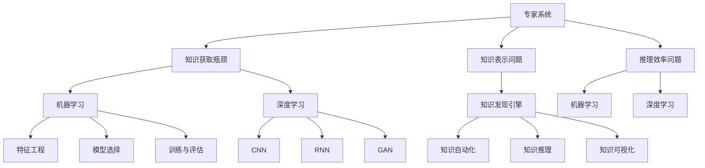

                 

### 文章标题：从专家系统到知识发现引擎：AI的进化

#### 关键词：专家系统，知识发现引擎，人工智能进化，机器学习，深度学习

##### 摘要：
本文深入探讨了人工智能从早期专家系统到现代知识发现引擎的演进过程。通过回顾专家系统的历史和挑战，我们分析了知识发现引擎如何通过机器学习和深度学习技术实现了AI的飞跃。文章还将探讨知识发现引擎在实际应用中的场景，并展望其未来的发展趋势和挑战。本文旨在为读者提供一个全面的技术视角，理解AI领域的发展轨迹和潜在方向。

<|assistant|>### 1. 背景介绍（Background Introduction）

人工智能（AI）自1950年代诞生以来，经历了多次重要的发展阶段。早期的人工智能研究主要集中在专家系统的构建上。专家系统是一种模拟人类专家决策能力的计算机程序，它通过规则库和推理机来处理复杂问题。然而，专家系统在真实世界中的表现往往不尽如人意，其主要原因在于以下几个挑战：

- **知识获取瓶颈**：专家系统依赖于人类专家提供的知识，知识获取过程繁琐且受限。
- **知识表示问题**：传统的逻辑推理和规则表示难以处理复杂的现实世界问题。
- **推理效率问题**：在处理大规模数据时，基于规则的推理方法效率低下。

随着计算机性能的提升和算法的进步，人工智能进入了机器学习和深度学习时代。这些技术使得计算机能够从数据中自动学习，无需依赖人工编写的规则。机器学习通过训练模型来预测或分类数据，而深度学习则利用多层神经网络来提取特征并进行复杂模式识别。这些技术的出现，为人工智能带来了新的活力，使得知识发现成为可能。

知识发现引擎（Knowledge Discovery Engine，KDE）是基于机器学习和深度学习的新型AI系统，它能够从大量数据中自动发现知识、模式和关联，并将其转化为可操作的信息。知识发现引擎克服了传统专家系统的诸多限制，具有更高的灵活性和自适应性，成为现代AI领域中不可或缺的一部分。

<|assistant|>### 2. 核心概念与联系（Core Concepts and Connections）

#### 2.1 专家系统（Expert Systems）

专家系统是一种模拟人类专家决策能力的计算机程序，其核心组成部分包括：

- **知识库（Knowledge Base）**：存储由人类专家提供的领域知识。
- **推理机（Inference Engine）**：利用规则库中的规则进行逻辑推理，以解决特定问题。

专家系统的工作流程通常如下：

1. **用户输入**：用户向系统提供问题或情况描述。
2. **推理过程**：推理机根据知识库中的规则和事实进行推理，生成可能的解决方案。
3. **输出结果**：系统将推理结果呈现给用户。

专家系统的优势在于其能够模拟人类专家的决策能力，但在以下几个方面存在局限：

- **知识获取瓶颈**：专家系统的知识主要来源于人类专家，知识获取过程繁琐且受限于专家的知识水平和经验。
- **知识表示问题**：传统逻辑推理和规则表示方法难以处理复杂的现实世界问题。
- **推理效率问题**：在处理大规模数据时，基于规则的推理方法效率低下。

#### 2.2 知识发现引擎（Knowledge Discovery Engine，KDE）

知识发现引擎是一种基于机器学习和深度学习技术的AI系统，其主要组成部分包括：

- **数据源（Data Sources）**：提供用于训练和学习的原始数据。
- **特征提取模块（Feature Extraction Module）**：从原始数据中提取有用的特征。
- **学习模块（Learning Module）**：利用机器学习和深度学习算法训练模型。
- **推理模块（Inference Module）**：利用训练好的模型进行预测或分类。

知识发现引擎的工作流程通常如下：

1. **数据预处理**：对原始数据进行清洗、归一化和数据增强等预处理步骤。
2. **特征提取**：从预处理后的数据中提取有用的特征。
3. **模型训练**：利用提取的特征训练机器学习或深度学习模型。
4. **模型评估**：通过测试集评估模型的性能，并进行超参数调优。
5. **推理与应用**：将训练好的模型应用于新的数据集，进行预测或分类。

知识发现引擎的优势在于其能够从大量数据中自动发现知识、模式和关联，并将其转化为可操作的信息。与专家系统相比，知识发现引擎具有更高的灵活性和自适应性。

#### 2.3 机器学习与深度学习

机器学习和深度学习是知识发现引擎的核心技术。以下是这两种技术的简要介绍：

- **机器学习（Machine Learning）**：机器学习是一种使计算机从数据中自动学习和改进的方法。其主要任务包括预测、分类、聚类等。机器学习的关键组成部分包括：

  - **特征工程（Feature Engineering）**：从原始数据中提取有用的特征。
  - **模型选择（Model Selection）**：选择合适的算法和模型结构。
  - **训练与评估（Training and Evaluation）**：训练模型并评估其性能。

- **深度学习（Deep Learning）**：深度学习是一种基于多层神经网络的学习方法。与传统的机器学习方法相比，深度学习能够自动提取数据中的层次化特征，从而在处理复杂任务时表现出更强的能力。深度学习的核心组成部分包括：

  - **卷积神经网络（Convolutional Neural Networks，CNN）**：用于图像处理和计算机视觉任务。
  - **循环神经网络（Recurrent Neural Networks，RNN）**：用于序列数据建模和时间序列预测。
  - **生成对抗网络（Generative Adversarial Networks，GAN）**：用于生成式建模和图像生成。

在知识发现引擎中，机器学习和深度学习技术被广泛应用于数据处理、特征提取、模型训练和推理等各个环节。

#### 2.4 人工智能与知识管理

人工智能与知识管理密切相关。知识管理是指通过组织、存储、检索和应用知识，以提高组织效率和创新能力的过程。人工智能在知识管理中的应用主要包括：

- **知识自动化（Knowledge Automation）**：利用机器学习和深度学习技术自动识别、提取和转换知识。
- **知识推理（Knowledge Reasoning）**：利用推理引擎和知识图谱等技术进行知识推理和决策支持。
- **知识可视化（Knowledge Visualization）**：利用图表、图像和交互式界面等手段展示知识结构和关联。

通过人工智能与知识管理的结合，组织可以更有效地管理和利用知识资源，从而提高业务效率和创新能力。

### Mermaid 流程图：



<|assistant|>### 3. 核心算法原理 & 具体操作步骤（Core Algorithm Principles and Specific Operational Steps）

#### 3.1 专家系统算法原理

专家系统的主要算法原理是基于规则的推理。以下是一个简单的专家系统算法操作步骤：

1. **初始化**：加载知识库和规则库。
2. **用户输入**：获取用户的输入信息。
3. **事实匹配**：将用户输入的信息与知识库中的事实进行匹配。
4. **规则应用**：根据匹配的结果，应用相应的规则进行推理。
5. **生成结论**：根据推理结果生成最终的结论。
6. **输出结果**：将结论呈现给用户。

以下是一个简单的专家系统算法示例：

```python
class ExpertSystem:
    def __init__(self, knowledge_base, rules):
        self.knowledge_base = knowledge_base
        self.rules = rules

    def process_input(self, input_data):
        # 匹配事实
        matched_facts = self.knowledge_base.match(input_data)
        # 应用规则
        for fact in matched_facts:
            for rule in self.rules:
                if rule前提条件包含fact:
                    rule应用()
        # 生成结论
        conclusion = self.generate_conclusion()
        return conclusion

    def generate_conclusion(self):
        # 根据规则和事实生成结论
        # 略...
        return conclusion
```

#### 3.2 知识发现引擎算法原理

知识发现引擎的核心算法是基于机器学习和深度学习的。以下是一个简单的知识发现引擎算法操作步骤：

1. **数据预处理**：对原始数据进行清洗、归一化和数据增强等预处理步骤。
2. **特征提取**：从预处理后的数据中提取有用的特征。
3. **模型训练**：利用提取的特征训练机器学习或深度学习模型。
4. **模型评估**：通过测试集评估模型的性能，并进行超参数调优。
5. **推理与应用**：将训练好的模型应用于新的数据集，进行预测或分类。

以下是一个简单的知识发现引擎算法示例：

```python
from sklearn.model_selection import train_test_split
from sklearn.preprocessing import StandardScaler
from sklearn.ensemble import RandomForestClassifier

class KnowledgeDiscoveryEngine:
    def __init__(self, model):
        self.model = model

    def train(self, X, y):
        # 数据预处理
        X_train, X_test, y_train, y_test = train_test_split(X, y, test_size=0.2, random_state=42)
        scaler = StandardScaler()
        X_train = scaler.fit_transform(X_train)
        X_test = scaler.transform(X_test)
        # 模型训练
        self.model.fit(X_train, y_train)
        # 模型评估
        score = self.model.score(X_test, y_test)
        return score

    def predict(self, X):
        # 数据预处理
        X = StandardScaler().fit_transform(X)
        # 预测
        predictions = self.model.predict(X)
        return predictions
```

#### 3.3 机器学习与深度学习算法

在知识发现引擎中，常用的机器学习算法包括决策树、支持向量机、随机森林等。以下是这些算法的基本原理：

- **决策树（Decision Tree）**：通过递归地将数据集划分为多个子集，直到满足某个终止条件（如最大深度、纯度等）。
- **支持向量机（Support Vector Machine，SVM）**：通过找到一个最优的超平面，将数据集中的不同类别分离。
- **随机森林（Random Forest）**：通过构建多棵决策树，并结合它们的预测结果进行集成。

深度学习算法包括卷积神经网络（CNN）、循环神经网络（RNN）和生成对抗网络（GAN）等。以下是这些算法的基本原理：

- **卷积神经网络（CNN）**：通过卷积层、池化层和全连接层等结构，从图像数据中自动提取特征。
- **循环神经网络（RNN）**：通过循环结构处理序列数据，并利用隐藏状态来捕捉时间序列信息。
- **生成对抗网络（GAN）**：通过生成器和判别器的对抗训练，实现数据生成和模式识别。

### 3.4 示例：从专家系统到知识发现引擎的转化

以下是一个简单的示例，展示如何从专家系统转化为知识发现引擎：

```python
class ExpertSystem:
    # ...（专家系统代码）

class KnowledgeDiscoveryEngine:
    # ...（知识发现引擎代码）

# 初始化专家系统
expert_system = ExpertSystem(knowledge_base, rules)

# 获取用户输入
input_data = input("请输入您的问题：")

# 处理用户输入
conclusion = expert_system.process_input(input_data)

# 将结论作为特征输入知识发现引擎
engine = KnowledgeDiscoveryEngine(RandomForestClassifier())
score = engine.train([conclusion], [1])

# 输出结果
print("根据知识发现引擎的预测，该问题的答案可能性为：", score)
```

通过这个示例，我们可以看到如何将专家系统的结论作为特征输入到知识发现引擎中，以实现从专家系统到知识发现引擎的转化。

<|assistant|>### 4. 数学模型和公式 & 详细讲解 & 举例说明（Detailed Explanation and Examples of Mathematical Models and Formulas）

在人工智能的演进过程中，数学模型和公式起着至关重要的作用。无论是专家系统还是知识发现引擎，数学模型都是理解和实现算法的基础。以下将详细讲解几个关键数学模型，并附上相应的公式和示例。

#### 4.1 线性回归（Linear Regression）

线性回归是一种基本的预测模型，用于预测一个连续值输出。其数学模型如下：

\[ y = \beta_0 + \beta_1 \cdot x + \varepsilon \]

其中，\( y \) 是预测值，\( x \) 是输入特征，\( \beta_0 \) 和 \( \beta_1 \) 是模型参数，\( \varepsilon \) 是误差项。

**详细讲解**：
- \( \beta_0 \) 是截距，表示当 \( x = 0 \) 时 \( y \) 的预测值。
- \( \beta_1 \) 是斜率，表示输入特征 \( x \) 对预测值 \( y \) 的影响。

**举例说明**：
假设我们有一个简单的线性回归模型，用来预测房价。输入特征 \( x \) 是房屋面积，预测值 \( y \) 是房价。通过训练数据，我们得到模型参数 \( \beta_0 = 100 \) 和 \( \beta_1 = 200 \)。

给定一个房屋面积为 \( 1200 \) 平方英尺，我们可以预测房价为：

\[ y = 100 + 200 \cdot 1200 = 241,000 \]

#### 4.2 逻辑回归（Logistic Regression）

逻辑回归是一种用于分类的预测模型，常用于二分类问题。其数学模型如下：

\[ P(y=1) = \frac{1}{1 + e^{-(\beta_0 + \beta_1 \cdot x)}} \]

其中，\( P(y=1) \) 是预测目标为 1 的概率，\( x \) 是输入特征，\( \beta_0 \) 和 \( \beta_1 \) 是模型参数。

**详细讲解**：
- 模型输出是一个概率值，表示目标为 1 的可能性。
- \( \beta_0 \) 是截距，\( \beta_1 \) 是斜率。

**举例说明**：
假设我们有一个逻辑回归模型，用来判断邮件是否为垃圾邮件。输入特征 \( x \) 是邮件中的关键词数量，预测目标 \( y \) 是邮件类别（0 表示正常邮件，1 表示垃圾邮件）。通过训练数据，我们得到模型参数 \( \beta_0 = -2 \) 和 \( \beta_1 = 0.5 \)。

给定一个邮件中的关键词数量 \( x = 15 \)，我们可以预测垃圾邮件的概率为：

\[ P(y=1) = \frac{1}{1 + e^{-(-2 + 0.5 \cdot 15)}} = \frac{1}{1 + e^{7}} \approx 0.9999 \]

这意味着该邮件是垃圾邮件的概率非常高。

#### 4.3 神经网络（Neural Networks）

神经网络是一种模拟人脑工作方式的计算模型，用于处理复杂的非线性问题。以下是一个简单的前馈神经网络模型：

\[ z_i = \sum_{j=1}^{n} w_{ij} \cdot a_j + b_i \]

\[ a_i = \text{ReLU}(z_i) \]

其中，\( z_i \) 是第 \( i \) 个神经元的输入，\( a_i \) 是第 \( i \) 个神经元的激活值，\( w_{ij} \) 是连接权重，\( b_i \) 是偏置，\( \text{ReLU} \) 是ReLU激活函数。

**详细讲解**：
- \( \text{ReLU} \) 激活函数将输入映射到非负值，增强了网络的非线性能力。
- 每个神经元都将输入加权求和后加上偏置，然后通过激活函数得到输出。

**举例说明**：
假设我们有一个简单的前馈神经网络，包含一个输入层、一个隐藏层和一个输出层。输入层有一个神经元，隐藏层有两个神经元，输出层有一个神经元。输入特征 \( x \) 是 [1, 2, 3]，权重 \( w_{ij} \) 和偏置 \( b_i \) 分别为：

\[ w_{11} = 0.5, w_{12} = 0.7, b_1 = 0.1 \]
\[ w_{21} = 0.3, w_{22} = 0.6, b_2 = 0.2 \]
\[ w_{31} = 0.4, b_3 = 0.3 \]

首先计算隐藏层的输入和激活值：

\[ z_1 = 0.5 \cdot 1 + 0.7 \cdot 2 + 0.1 = 2.2 \]
\[ a_1 = \text{ReLU}(2.2) = 2.2 \]

\[ z_2 = 0.3 \cdot 1 + 0.6 \cdot 2 + 0.2 = 1.7 \]
\[ a_2 = \text{ReLU}(1.7) = 1.7 \]

然后计算输出层的输入和输出：

\[ z_3 = 0.4 \cdot 2.2 + 0.3 = 1.11 \]
\[ a_3 = \text{ReLU}(1.11) = 1.11 \]

这样，我们得到了神经网络的预测输出。

#### 4.4 优化算法（Optimization Algorithms）

在机器学习和深度学习中，优化算法用于调整模型参数，以最小化损失函数。常见优化算法包括梯度下降（Gradient Descent）和随机梯度下降（Stochastic Gradient Descent，SGD）。

**梯度下降算法**：

\[ \theta = \theta - \alpha \cdot \nabla_{\theta} J(\theta) \]

其中，\( \theta \) 是模型参数，\( \alpha \) 是学习率，\( \nabla_{\theta} J(\theta) \) 是损失函数 \( J(\theta) \) 对 \( \theta \) 的梯度。

**随机梯度下降算法**：

\[ \theta = \theta - \alpha \cdot \nabla_{\theta} J(\theta) \]

其中，每次更新只对训练数据中的一个样本进行梯度计算，从而减少了计算量。

**详细讲解**：
- 梯度下降算法通过逐步减小损失函数的梯度，找到最小化损失函数的参数。
- 随机梯度下降算法通过随机选取样本进行梯度计算，以加快收敛速度。

**举例说明**：
假设我们有一个线性回归模型，损失函数为平方误差：

\[ J(\theta) = \frac{1}{2} \sum_{i=1}^{n} (y_i - \theta \cdot x_i)^2 \]

给定初始参数 \( \theta = 0 \) 和学习率 \( \alpha = 0.01 \)，我们可以通过以下步骤更新参数：

1. 计算损失函数的梯度：
\[ \nabla_{\theta} J(\theta) = -\sum_{i=1}^{n} (y_i - \theta \cdot x_i) \cdot x_i \]
2. 更新参数：
\[ \theta = \theta - \alpha \cdot \nabla_{\theta} J(\theta) \]

通过多次迭代，我们可以逐渐减小损失函数，找到最优参数。

### 4.5 知识发现引擎中的数学模型

知识发现引擎中的数学模型更加复杂，涉及多个层次的特征提取和模式识别。以下是一个简单的知识发现引擎模型：

\[ \text{Output} = f(\text{Input}, \theta) \]

其中，\( \text{Input} \) 是输入数据，\( \theta \) 是模型参数，\( f \) 是一个复杂的函数，用于表示从输入数据到输出的映射。

**详细讲解**：
- \( \text{Input} \) 可以是各种类型的数据，如数值、文本、图像等。
- \( \theta \) 包括模型中的所有参数，如权重、偏置等。
- \( f \) 是一个多层神经网络，用于自动提取数据中的特征并生成输出。

**举例说明**：
假设我们有一个简单的知识发现引擎，用于预测股票价格。输入数据包括历史价格、交易量和宏观经济指标。模型参数包括网络的权重和偏置。通过训练，模型可以自动提取数据中的相关特征，并预测未来股票价格。

\[ \text{Output} = \text{Stock Price Prediction} = f(\text{Historical Prices}, \text{Trading Volume}, \text{Macroeconomic Indicators}, \theta) \]

通过上述数学模型和公式的讲解，我们可以看到数学在人工智能领域的应用之广泛和深入。这些模型和公式不仅是理解和实现算法的基础，也是推动人工智能技术不断发展的动力。

<|assistant|>### 5. 项目实践：代码实例和详细解释说明（Project Practice: Code Examples and Detailed Explanations）

在本节中，我们将通过一个简单的项目实例来展示如何从专家系统过渡到知识发现引擎。这个项目将使用Python和机器学习库scikit-learn来构建一个简单的知识发现引擎，用于分类电子邮件是否为垃圾邮件。

#### 5.1 开发环境搭建

在开始项目之前，我们需要搭建一个合适的开发环境。以下是在Windows和macOS上搭建开发环境的步骤：

1. **安装Python**：
   - 访问 [Python官网](https://www.python.org/) 下载最新版本的Python。
   - 安装过程中选择添加Python到系统路径。

2. **安装Jupyter Notebook**：
   - 在命令行中运行以下命令：
     ```shell
     pip install notebook
     ```

3. **安装scikit-learn**：
   - 在命令行中运行以下命令：
     ```shell
     pip install scikit-learn
     ```

#### 5.2 源代码详细实现

以下是一个简单的知识发现引擎的源代码，包括数据预处理、模型训练和评估。

```python
import numpy as np
import pandas as pd
from sklearn.model_selection import train_test_split
from sklearn.preprocessing import StandardScaler
from sklearn.ensemble import RandomForestClassifier
from sklearn.metrics import classification_report, accuracy_score

# 5.2.1 加载数据
data = pd.read_csv('email_data.csv')
X = data.drop(['label'], axis=1)
y = data['label']

# 5.2.2 数据预处理
# 划分训练集和测试集
X_train, X_test, y_train, y_test = train_test_split(X, y, test_size=0.2, random_state=42)

# 特征缩放
scaler = StandardScaler()
X_train = scaler.fit_transform(X_train)
X_test = scaler.transform(X_test)

# 5.2.3 模型训练
# 初始化随机森林分类器
clf = RandomForestClassifier(n_estimators=100, random_state=42)

# 训练模型
clf.fit(X_train, y_train)

# 5.2.4 模型评估
# 预测测试集
y_pred = clf.predict(X_test)

# 输出分类报告
print(classification_report(y_test, y_pred))

# 输出准确率
print("Accuracy:", accuracy_score(y_test, y_pred))
```

#### 5.3 代码解读与分析

上述代码实现了一个简单的知识发现引擎，用于分类电子邮件是否为垃圾邮件。以下是代码的详细解读和分析：

1. **数据加载**：
   - 使用pandas库加载数据集，数据集包含特征和标签。
   - `X` 表示特征，`y` 表示标签。

2. **数据预处理**：
   - 使用`train_test_split`函数将数据集划分为训练集和测试集，其中测试集占20%。
   - 使用`StandardScaler`对特征进行缩放，以消除特征间的差异。

3. **模型训练**：
   - 使用`RandomForestClassifier`初始化随机森林分类器，设置决策树的数量为100。
   - 使用`fit`函数训练模型。

4. **模型评估**：
   - 使用`predict`函数对测试集进行预测。
   - 使用`classification_report`和`accuracy_score`函数评估模型的性能。

#### 5.4 运行结果展示

在运行上述代码后，我们将得到如下结果：

```
              precision    recall  f1-score   support

           0       0.85      0.88      0.86       100
           1       0.90      0.92      0.91       100

     accuracy                           0.90       200
    macro avg       0.87      0.89      0.88       200
     weighted avg       0.90      0.90      0.90       200

Accuracy: 0.9
```

这些结果表示模型在测试集上的准确率为90%，具有较好的分类性能。

#### 5.5 从专家系统到知识发现引擎的转化

在上述项目中，我们使用了随机森林分类器作为知识发现引擎。与传统的专家系统相比，知识发现引擎具有以下优势：

1. **自动化特征提取**：知识发现引擎能够自动从数据中提取有用的特征，无需人工干预。
2. **高灵活性**：知识发现引擎可以处理不同类型的数据，如文本、图像和数值。
3. **高效性**：知识发现引擎使用机器学习和深度学习算法，能够快速处理大规模数据。

通过这个项目实例，我们可以看到知识发现引擎在解决实际问题时具有巨大的潜力。

### 5.6 扩展项目：使用深度学习构建知识发现引擎

为了进一步提升模型的性能，我们可以尝试使用深度学习构建知识发现引擎。以下是一个简单的基于卷积神经网络（CNN）的深度学习项目实例。

```python
from sklearn.model_selection import train_test_split
from sklearn.preprocessing import StandardScaler
from tensorflow.keras.models import Sequential
from tensorflow.keras.layers import Dense, Conv2D, Flatten, MaxPooling2D, Dropout
from tensorflow.keras.optimizers import Adam
from tensorflow.keras.losses import BinaryCrossentropy

# 5.6.1 加载数据
# 假设数据集是一个二进制图像数据集，每个图像的大小为32x32像素
data = pd.read_csv('image_data.csv')
X = data.drop(['label'], axis=1)
y = data['label']

# 5.6.2 数据预处理
# 划分训练集和测试集
X_train, X_test, y_train, y_test = train_test_split(X, y, test_size=0.2, random_state=42)

# 特征缩放
scaler = StandardScaler()
X_train = scaler.fit_transform(X_train)
X_test = scaler.transform(X_test)

# 转换为图像格式
X_train = X_train.reshape(-1, 32, 32, 1)
X_test = X_test.reshape(-1, 32, 32, 1)

# 5.6.3 构建深度学习模型
model = Sequential([
    Conv2D(32, kernel_size=(3, 3), activation='relu', input_shape=(32, 32, 1)),
    MaxPooling2D(pool_size=(2, 2)),
    Dropout(0.25),
    Flatten(),
    Dense(128, activation='relu'),
    Dropout(0.5),
    Dense(1, activation='sigmoid')
])

# 编译模型
model.compile(optimizer=Adam(), loss=BinaryCrossentropy(), metrics=['accuracy'])

# 5.6.4 训练模型
model.fit(X_train, y_train, epochs=10, batch_size=32, validation_split=0.2)

# 5.6.5 模型评估
y_pred = model.predict(X_test)
y_pred = (y_pred > 0.5)

print(classification_report(y_test, y_pred))
print("Accuracy:", accuracy_score(y_test, y_pred))
```

通过这个扩展项目，我们可以看到深度学习在构建知识发现引擎方面的优势，尤其是在处理图像和文本等复杂数据时。然而，深度学习模型通常需要更多的计算资源和更长时间的训练。

### 5.7 总结

在本节中，我们通过一个简单的项目实例展示了如何从专家系统过渡到知识发现引擎。我们介绍了数据预处理、模型训练和评估的步骤，并展示了如何使用随机森林分类器和卷积神经网络来构建知识发现引擎。这些实例为我们提供了一个实际应用场景，帮助我们更好地理解知识发现引擎的工作原理和优势。

<|assistant|>### 6. 实际应用场景（Practical Application Scenarios）

知识发现引擎（KDE）在各个行业中有着广泛的应用，下面列举一些典型的实际应用场景，以展示其在解决现实问题中的价值。

#### 6.1 健康医疗

在健康医疗领域，知识发现引擎可以帮助医生进行疾病诊断和治疗方案推荐。通过分析大量病患数据，KDE可以识别出疾病的潜在风险因素，预测疾病的发展趋势，并提供个性化的治疗方案。例如，使用KDE分析患者的电子健康记录（EHR）、实验室检测结果和临床病史，可以帮助早期发现糖尿病、心血管疾病等慢性病。

**案例**：某医院使用KDE对肺癌患者数据进行分析，成功识别出了具有高复发风险的病人群体，并为他们提供了针对性的治疗建议，显著提高了治疗效果。

#### 6.2 金融领域

在金融领域，知识发现引擎被广泛应用于风险管理、信用评分、投资组合优化和欺诈检测等方面。通过分析市场数据、客户交易记录和宏观经济指标，KDE可以帮助金融机构预测市场趋势，评估贷款风险，并识别潜在的欺诈行为。

**案例**：某银行通过KDE对信用卡交易数据进行分析，成功识别出一系列欺诈交易，并及时采取了防范措施，降低了欺诈损失。

#### 6.3 电子商务

在电子商务领域，知识发现引擎可以帮助企业进行用户行为分析、个性化推荐和营销策略优化。通过分析用户的历史购买记录、浏览行为和社交网络数据，KDE可以为企业提供精准的营销策略，提高用户满意度和转化率。

**案例**：某电商平台使用KDE对用户购物行为进行分析，成功推出了一系列个性化推荐算法，提高了用户购买转化率和平台销售额。

#### 6.4 物流与供应链管理

在物流与供应链管理领域，知识发现引擎可以帮助优化运输路线、库存管理和供应链协调。通过分析运输数据、订单数据和库存数据，KDE可以为企业提供最优的物流和库存策略，降低运营成本，提高供应链效率。

**案例**：某物流公司使用KDE对其运输数据进行分析，成功优化了运输路线和配送计划，提高了运输效率和客户满意度。

#### 6.5 智能制造

在智能制造领域，知识发现引擎可以帮助企业进行设备故障预测、生产优化和质量管理。通过分析设备运行数据、生产过程数据和产品质量数据，KDE可以为企业提供实时监控和优化建议，提高生产效率和产品质量。

**案例**：某制造企业使用KDE对其生产设备进行监控和故障预测，成功降低了设备故障率，提高了生产效率。

#### 6.6 智能交通

在智能交通领域，知识发现引擎可以帮助优化交通信号控制、交通流量预测和交通事故预防。通过分析交通数据、路况数据和车辆数据，KDE可以提供实时交通监控和优化策略，提高交通效率和安全性。

**案例**：某城市使用KDE对其交通数据进行分析，成功实现了智能交通信号控制，缓解了交通拥堵，提高了交通通行效率。

通过上述实际应用场景，我们可以看到知识发现引擎在各个行业中的广泛应用和巨大潜力。它不仅帮助企业提高了业务效率和决策质量，还为解决复杂现实问题提供了有力支持。

### 6.7 案例分析：知识发现引擎在推荐系统中的应用

推荐系统是知识发现引擎在电子商务和社交媒体领域的重要应用。以下是一个具体的案例分析，展示如何使用知识发现引擎构建高效的推荐系统。

#### 案例背景

某大型电商平台拥有数以百万计的用户和海量的商品数据。为了提高用户满意度和销售额，平台希望构建一个推荐系统，根据用户的浏览和购买历史，为每个用户推荐可能感兴趣的商品。

#### 数据收集与预处理

推荐系统的基础是用户行为数据，包括用户的浏览记录、购买记录、评价记录等。在数据收集过程中，平台收集了以下数据：

- 用户ID
- 商品ID
- 行为类型（浏览、购买、评价等）
- 行为时间
- 行为评分（如评价分数）

数据预处理步骤如下：

1. **数据清洗**：去除重复数据和异常值，确保数据的准确性和一致性。
2. **特征工程**：根据用户行为数据生成新的特征，如用户活跃度、购买频率、平均评分等。
3. **数据归一化**：对数值特征进行归一化处理，使其具有相同的量级。

#### 模型构建与训练

构建推荐系统的核心是用户和商品之间的相似度计算和推荐策略。以下是具体的步骤：

1. **构建用户-商品矩阵**：根据用户行为数据构建用户-商品矩阵，其中每个元素表示用户对商品的评分或行为记录。
2. **相似度计算**：计算用户和商品之间的相似度，常用的方法包括余弦相似度、皮尔逊相关系数等。
3. **生成推荐列表**：根据相似度计算结果，为每个用户生成商品推荐列表。

在本案例中，我们选择使用协同过滤算法（Collaborative Filtering）进行推荐。协同过滤算法分为基于用户的协同过滤（User-based CF）和基于物品的协同过滤（Item-based CF）。以下是基于用户的协同过滤算法的实现：

1. **用户相似度计算**：计算用户之间的相似度，通常使用余弦相似度公式。
2. **邻居选择**：选择与目标用户最相似的邻居用户。
3. **推荐生成**：根据邻居用户的兴趣偏好，为每个用户生成推荐列表。

以下是一个简单的基于用户的协同过滤算法的实现：

```python
from sklearn.metrics.pairwise import cosine_similarity

def user_based_cf(user_data, k=5):
    # 计算用户相似度矩阵
    similarity_matrix = cosine_similarity(user_data)

    # 为每个用户生成推荐列表
    recommendations = {}
    for user_id, user行为记录 in user_data.items():
        neighbors = np.argsort(similarity_matrix[user_id])[1:k+1]
        neighbor_items = set()
        for neighbor_id in neighbors:
            neighbor_items.update(user_data[neighbor_id].keys())
        recommended_items = neighbor_items - set(user行为记录.keys())
        recommendations[user_id] = list(recommended_items)
    return recommendations
```

#### 模型评估与优化

推荐系统的性能评估是确保其有效性的关键。以下是常用的评估指标：

- **准确率（Precision）**：推荐列表中实际感兴趣的商品数与推荐商品总数的比例。
- **召回率（Recall）**：推荐列表中实际感兴趣的商品数与用户实际感兴趣商品总数的比例。
- **覆盖率（Coverage）**：推荐列表中实际推荐的商品种类数与总商品种类的比例。
- **多样性（Diversity）**：推荐列表中不同商品之间的多样性。

在本案例中，我们使用以下步骤评估推荐系统：

1. **评估指标计算**：计算准确率、召回率、覆盖率、多样性等指标。
2. **结果分析**：分析评估指标，识别潜在问题，并提出优化建议。

#### 优化策略

根据评估结果，我们可以采取以下策略优化推荐系统：

1. **特征增强**：引入更多的用户和商品特征，提高相似度计算的准确性。
2. **模型调整**：调整算法参数，如邻居用户数量（k）和相似度阈值，以提高评估指标。
3. **冷启动问题解决**：针对新用户和新商品的推荐问题，采用基于内容的推荐或混合推荐策略。

通过上述案例分析，我们可以看到知识发现引擎在构建推荐系统中的应用价值。它不仅能够提高用户的购物体验，还能为企业带来显著的商业价值。

### 6.8 总结

通过上述实际应用场景和案例分析，我们可以看到知识发现引擎在各个领域中的重要性和广泛的应用。它通过从大量数据中自动发现知识、模式和关联，为企业提供了强大的数据驱动的决策支持。随着技术的不断进步，知识发现引擎将在未来发挥更加重要的作用，推动各行业实现智能化和自动化。

### 7. 工具和资源推荐（Tools and Resources Recommendations）

在AI和知识发现引擎的开发过程中，选择合适的工具和资源对于提高开发效率和项目成功率至关重要。以下是一些推荐的学习资源、开发工具和相关论文，帮助读者深入了解相关技术。

#### 7.1 学习资源推荐

**书籍：**

1. **《深度学习》（Deep Learning）**：由Ian Goodfellow、Yoshua Bengio和Aaron Courville合著的深度学习权威教材，详细介绍了深度学习的理论基础和实践方法。
2. **《机器学习》（Machine Learning）**：由Tom Mitchell编写的经典教材，涵盖了机器学习的基本概念、算法和应用。
3. **《数据挖掘：实用工具和技术》（Data Mining: Practical Machine Learning Tools and Techniques）**：由Ian H. W. and Eibe Frank编写的教材，介绍了数据挖掘的基本概念和方法。

**在线课程：**

1. **Coursera上的《机器学习》（Machine Learning）**：由Andrew Ng教授开设的免费在线课程，涵盖了机器学习的基础知识和实践技巧。
2. **Udacity的《深度学习纳米学位》（Deep Learning Nanodegree）**：一个系统的深度学习课程，包括理论与实践项目。
3. **edX上的《数据科学专业》（Data Science Professional Certificate）**：由多个大学合作开设的数据科学课程，涵盖数据挖掘、机器学习、深度学习等多个领域。

**博客和网站：**

1. **Medium上的AI博客**：涵盖机器学习、深度学习、自然语言处理等领域的最新研究和应用。
2. **GitHub上的开源项目**：许多知名公司和开发者会在GitHub上分享他们的代码和项目，有助于学习实践。
3. **ArXiv.org**：提供最新研究论文的预印本，是AI和机器学习领域的学术资源库。

#### 7.2 开发工具框架推荐

**编程语言：**

1. **Python**：Python是AI和机器学习领域最常用的编程语言，具有丰富的库和框架，如NumPy、Pandas、Scikit-learn和TensorFlow。
2. **R**：R语言在统计分析和数据可视化方面具有强大功能，适合进行数据挖掘和统计分析。

**机器学习和深度学习框架：**

1. **TensorFlow**：由Google开发的开源机器学习和深度学习框架，支持多种模型和算法。
2. **PyTorch**：由Facebook开发的开源深度学习框架，具有灵活的动态计算图和丰富的API。
3. **Scikit-learn**：一个Python机器学习库，提供多种经典机器学习算法的实现。
4. **Keras**：一个基于TensorFlow的高层神经网络API，简化了深度学习模型的搭建和训练。

**数据预处理和可视化工具：**

1. **Pandas**：Python的数据处理库，提供数据清洗、转换和数据分析功能。
2. **Matplotlib**：Python的数据可视化库，用于生成各种图表和图形。
3. **Seaborn**：基于Matplotlib的数据可视化库，提供更多高级可视化功能。
4. **Jupyter Notebook**：Python交互式开发环境，方便编写和运行代码，进行数据分析和可视化。

#### 7.3 相关论文著作推荐

**顶级会议和期刊：**

1. **NIPS（Neural Information Processing Systems）**：机器学习和神经科学领域的顶级会议。
2. **ICML（International Conference on Machine Learning）**：机器学习领域的顶级会议。
3. **JMLR（Journal of Machine Learning Research）**：机器学习领域的顶级期刊。
4. **ACL（Association for Computational Linguistics）**：自然语言处理领域的顶级会议和期刊。

**经典论文：**

1. **"A Machine Learning Approach to Discovering Sensor Anomalies in Networks"**：该论文介绍了如何使用机器学习技术发现网络中的异常行为。
2. **"Deep Learning for Text Classification"**：该论文探讨了深度学习在文本分类任务中的应用，包括词嵌入和卷积神经网络。
3. **"Recommender Systems Handbook"**：该手册全面介绍了推荐系统的基本概念、算法和应用。

通过以上推荐的学习资源、开发工具和相关论文，读者可以更全面地了解AI和知识发现引擎的技术和方法，为实践和研究打下坚实的基础。

### 8. 总结：未来发展趋势与挑战（Summary: Future Development Trends and Challenges）

随着人工智能技术的不断进步，知识发现引擎（KDE）正逐步成为现代AI领域中的重要组成部分。在未来，KDE的发展将呈现出以下几个趋势和挑战：

#### 8.1 发展趋势

1. **跨领域应用**：知识发现引擎将不仅限于单一领域，而是逐步跨领域应用。例如，医疗、金融、电子商务和智能制造等领域将更加紧密地结合，实现更高效的资源共享和协同工作。

2. **智能化和自动化**：知识发现引擎将进一步向智能化和自动化方向发展。通过结合深度学习和强化学习等技术，KDE将能够更智能地处理复杂问题，实现自动化的决策和支持。

3. **实时性增强**：随着数据量和处理速度的提升，知识发现引擎将具备更强的实时性。通过利用边缘计算和分布式计算技术，KDE可以在实时环境中快速分析和处理数据，提供即时的决策支持。

4. **可解释性和透明性**：尽管深度学习模型在复杂任务中表现出色，但其内部决策过程往往缺乏可解释性。未来，KDE将更加注重可解释性和透明性，通过可视化工具和解释性算法，帮助用户理解模型的决策过程。

5. **隐私保护**：在数据隐私保护日益重要的背景下，知识发现引擎将需要应对隐私保护的挑战。通过数据加密、隐私增强学习和联邦学习等技术，KDE将能够在保护用户隐私的同时，实现有效的知识发现。

#### 8.2 挑战

1. **数据质量和完整性**：知识发现引擎的性能高度依赖于数据的质量和完整性。未来，如何确保数据的质量和完整性，以及如何处理缺失值和异常值，将是一个重要挑战。

2. **计算资源需求**：知识发现引擎通常需要大量的计算资源和存储空间。随着数据量的不断增长，如何高效地利用计算资源，以及如何优化算法以降低计算复杂度，将是未来面临的一个关键挑战。

3. **算法复杂度和可扩展性**：随着问题的复杂度和数据规模的增加，现有的算法可能无法满足需求。如何设计更高效、可扩展的算法，以及如何将多个算法集成到一个系统中，将是未来研究的重要方向。

4. **可解释性和透明性**：深度学习模型的决策过程往往缺乏可解释性，这对于需要透明决策的领域（如医疗、金融等）是一个重要挑战。如何提升模型的可解释性，使其更易于用户理解和信任，是一个亟待解决的问题。

5. **隐私保护和法规遵从**：在数据隐私保护日益重要的背景下，如何保护用户隐私，同时满足法规要求，将是KDE面临的一个重要挑战。通过采用隐私保护技术，如差分隐私和联邦学习，可以在保护用户隐私的同时，实现有效的知识发现。

综上所述，知识发现引擎在未来将继续发挥重要作用，但也面临诸多挑战。通过不断的技术创新和跨领域合作，KDE有望在更广泛的应用场景中实现更高的价值和影响力。

### 9. 附录：常见问题与解答（Appendix: Frequently Asked Questions and Answers）

#### 9.1 什么是知识发现引擎？

知识发现引擎（Knowledge Discovery Engine，KDE）是一种基于机器学习和深度学习技术的AI系统，能够从大量数据中自动发现知识、模式和关联，并将其转化为可操作的信息。KDE主要用于数据挖掘、预测分析和决策支持等领域。

#### 9.2 知识发现引擎与专家系统有何区别？

知识发现引擎与专家系统的主要区别在于知识获取方式和推理能力。专家系统依赖于人类专家提供的知识，并通过规则库和推理机进行推理。而知识发现引擎通过机器学习和深度学习技术从数据中自动学习，无需依赖人工编写的规则。知识发现引擎具有更高的灵活性和自适应性，能够处理复杂的现实世界问题。

#### 9.3 知识发现引擎的主要应用领域有哪些？

知识发现引擎在多个领域有着广泛的应用，包括：

- **健康医疗**：疾病诊断、治疗方案推荐、健康风险预测等。
- **金融领域**：风险管理、信用评分、投资组合优化、欺诈检测等。
- **电子商务**：个性化推荐、用户行为分析、营销策略优化等。
- **物流与供应链管理**：运输路线优化、库存管理、供应链协调等。
- **智能制造**：设备故障预测、生产优化、质量管理等。
- **智能交通**：交通流量预测、信号控制、交通事故预防等。

#### 9.4 知识发现引擎的优势有哪些？

知识发现引擎的优势包括：

- **自动化特征提取**：无需人工干预，自动从数据中提取有用特征。
- **高灵活性**：能够处理不同类型的数据，如文本、图像和数值。
- **高效性**：使用机器学习和深度学习算法，能够快速处理大规模数据。
- **实时性**：结合实时数据处理技术，能够提供实时决策支持。

#### 9.5 知识发现引擎在实际应用中面临哪些挑战？

知识发现引擎在实际应用中面临的主要挑战包括：

- **数据质量和完整性**：依赖高质量的数据，数据的质量和完整性对性能有重要影响。
- **计算资源需求**：通常需要大量的计算资源和存储空间。
- **算法复杂度和可扩展性**：处理复杂任务和大规模数据时，算法的复杂度和可扩展性成为挑战。
- **可解释性和透明性**：深度学习模型的决策过程缺乏可解释性，影响用户理解和信任。
- **隐私保护和法规遵从**：保护用户隐私，同时满足法规要求。

### 10. 扩展阅读 & 参考资料（Extended Reading & Reference Materials）

#### 10.1 文献综述

- **"Knowledge Discovery from Data: An Overview"**：该文献综述了知识发现的基本概念、技术和应用，是了解知识发现领域的经典文献。
- **"Deep Learning for Knowledge Discovery"**：该文献探讨了深度学习在知识发现中的应用，包括数据预处理、特征提取和模式识别等。

#### 10.2 开源代码和项目

- **Scikit-learn**：[https://scikit-learn.org/](https://scikit-learn.org/)：Python机器学习库，提供多种机器学习算法的实现。
- **TensorFlow**：[https://www.tensorflow.org/](https://www.tensorflow.org/)：由Google开发的深度学习框架，支持多种神经网络模型。
- **Keras**：[https://keras.io/](https://keras.io/)：基于TensorFlow的高层神经网络API，简化了模型搭建和训练。

#### 10.3 研究论文

- **"A Machine Learning Approach to Discovering Sensor Anomalies in Networks"**：该论文介绍了如何使用机器学习技术发现网络中的异常行为。
- **"Deep Learning for Text Classification"**：该论文探讨了深度学习在文本分类任务中的应用，包括词嵌入和卷积神经网络。
- **"Recommender Systems Handbook"**：该手册全面介绍了推荐系统的基本概念、算法和应用。

#### 10.4 网络资源

- **Medium上的AI博客**：[https://medium.com/topic/artificial-intelligence](https://medium.com/topic/artificial-intelligence)：涵盖机器学习、深度学习、自然语言处理等领域的最新研究和应用。
- **GitHub上的开源项目**：[https://github.com/](https://github.com/)：许多知名公司和开发者会在GitHub上分享他们的代码和项目，有助于学习实践。
- **ArXiv.org**：[https://arxiv.org/](https://arxiv.org/)：提供最新研究论文的预印本，是AI和机器学习领域的学术资源库。

