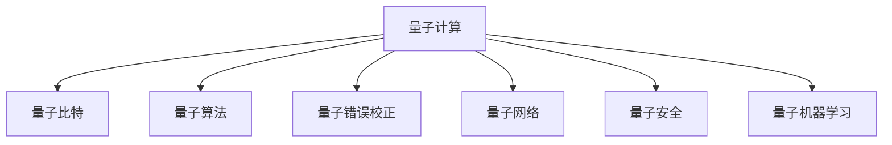

                 

# 硅谷量子计算机的未来发展方向

> 关键词：量子计算机, 量子计算, 硅谷, 量子通信, 量子算法, 量子硬件, 量子软件, 量子生态系统, 量子网络, 量子安全, 量子机器学习

## 1. 背景介绍

### 1.1 问题由来

近年来，随着量子计算技术的快速发展，硅谷引领着全球的量子计算研究和商业化应用。量子计算机凭借其处理某些特定类型问题的优势，引发了科技界和产业界对未来计算模式的重新思考。尤其是在Google宣布成功实现量子霸权（即在一项特定任务上超越传统计算机的计算能力）后，硅谷各大科技巨头纷纷加大了对量子计算的投入，试图在未来的科技竞争中占据先机。

量子计算机的核心优势在于其处理复杂问题（如模拟分子结构、优化问题、大数分解等）的高效性和潜在的应用前景。然而，量子计算还面临着诸多挑战，如量子比特的退相干、量子错误率、大规模量子硬件的可扩展性等。硅谷的量子计算研究机构和公司正不断攻克这些难题，以期实现量子计算机的广泛应用。

### 1.2 问题核心关键点

量子计算的核心问题可以概括为以下几个关键点：
1. **量子比特的稳定性**：量子比特是量子计算的基本单元，其量子状态容易受环境干扰而退相干，保持稳定是实现量子计算的基石。
2. **量子错误率**：量子计算的错误率远高于传统计算机，需要通过量子错误校正和容错编码来降低错误率，提升计算精度。
3. **量子硬件的可扩展性**：大规模量子计算需要成千上万的量子比特，目前的技术瓶颈在于如何实现大规模量子比特系统的可扩展性。
4. **量子算法的开发**：量子计算机的强大功能依赖于专门的算法，开发高效的量子算法是实现量子计算潜能的关键。
5. **量子软件生态**：量子软件的开发和优化对于量子计算机的实际应用至关重要，包括编译器、模拟器、应用框架等。

### 1.3 问题研究意义

研究硅谷量子计算机的未来发展方向，对于推动量子计算技术的商业化应用，提升计算能力，加速科技领域的创新，具有重要意义：

1. **计算能力的提升**：量子计算机通过量子并行计算，能够在特定问题上达到指数级的计算速度，极大地提升计算能力。
2. **跨领域应用**：量子计算可以在药物设计、材料科学、金融建模、人工智能等领域发挥重要作用，推动相关领域的技术进步。
3. **安全性的保障**：量子计算可以破解现有的加密算法，如RSA，开发量子安全算法成为保障网络通信安全的迫切需求。
4. **新兴产业的培育**：量子计算技术的发展将催生新的产业链，为硅谷乃至全球经济增长注入新动能。
5. **科技竞争的制高点**：硅谷的量子计算研究和应用将成为未来科技竞争的制高点，为硅谷保持全球科技领先地位提供新的战略机遇。

## 2. 核心概念与联系

### 2.1 核心概念概述

为更好地理解硅谷量子计算机的发展方向，本节将介绍几个密切相关的核心概念：

- **量子计算**：利用量子力学原理进行计算的新型计算模式，通过量子比特的量子叠加和纠缠特性，实现并行计算和超越经典计算的能力。
- **量子比特**：量子计算的基本单位，通常为两个量子态的叠加，用于存储和处理量子信息。
- **量子算法**：专门为量子计算机设计的算法，利用量子叠加和纠缠等特性，能够高效解决某些经典计算难以处理的复杂问题。
- **量子错误校正**：通过冗余编码和纠错技术，保护量子比特免受外界干扰，降低量子计算的错误率。
- **量子网络**：构建多台量子计算机之间的互联网络，实现量子信息的远距离传输和共享，推动量子计算的发展。
- **量子安全**：利用量子计算的不可逆性和信息不可克隆性，开发新的安全加密算法，保障数据通信的安全。
- **量子机器学习**：结合量子计算和机器学习，开发高效的量子机器学习算法，提升数据处理和模式识别的能力。

这些核心概念之间的逻辑关系可以通过以下Mermaid流程图来展示：



这个流程图展示了一些关键概念之间的内在联系：

1. 量子计算依赖于量子比特和量子算法，实现超越经典计算的能力。
2. 量子错误校正保护量子比特的稳定性和计算精度，是量子计算可靠性的保障。
3. 量子网络实现多台量子计算机的互联互通，推动量子计算的发展。
4. 量子安全基于量子计算的特性，开发新的加密算法，保障数据安全。
5. 量子机器学习结合量子计算和机器学习，提升数据处理和模式识别的能力。

## 3. 核心算法原理 & 具体操作步骤

### 3.1 算法原理概述

硅谷的量子计算研究机构和公司，如Google、IBM、Intel等，在量子计算的算法原理方面进行了大量探索和创新。核心算法包括：

- **Shor算法**：用于解决大数分解问题的量子算法，能够在多项式时间内完成经典计算需要指数时间才能完成的任务。
- **Grover算法**：用于解决无序数据库搜索问题的量子算法，能够在平方时间内完成经典计算需要指数时间才能完成的任务。
- **量子蒙特卡罗方法**：用于模拟量子系统的演化过程，能够高效处理分子结构模拟等科学计算问题。

这些算法的核心在于利用量子比特的量子叠加和纠缠特性，通过并行计算的方式，实现对某些特定问题的加速解决。

### 3.2 算法步骤详解

量子计算的算法步骤通常包括以下几个关键步骤：

**Step 1: 量子比特初始化**
- 对量子比特进行初始化，通常为0和1的叠加态。

**Step 2: 量子门操作**
- 对量子比特施加各种量子门操作，如Hadamard门、Pauli-X门、CNOT门等，通过门的叠加和纠缠，构建复杂的量子态。

**Step 3: 量子态测量**
- 对量子比特进行测量，得到测量结果，即量子比特的量子状态。

**Step 4: 结果后处理**
- 对测量结果进行后处理，得到最终计算结果。

**Step 5: 量子错误校正**
- 在量子计算过程中，通过冗余编码和纠错技术，保护量子比特免受外界干扰，降低错误率。

这些步骤通常需要量子计算机硬件的支持，并通过编程语言和软件框架来实现。

### 3.3 算法优缺点

量子计算的优势在于其处理某些特定类型问题的能力强，但同时也面临着诸多挑战：

**优势**：
1. **高效处理复杂问题**：如大数分解、优化问题等，能够在多项式时间内完成经典计算需要指数时间才能完成的任务。
2. **量子并行计算**：通过量子叠加和纠缠，实现指数级的计算能力。
3. **新算法的可能性**：量子计算为开发新算法提供了新的思路，如Shor算法、Grover算法等。

**挑战**：
1. **量子比特的稳定性**：量子比特容易受环境干扰而退相干，保持稳定是实现量子计算的基石。
2. **量子错误率**：量子计算的错误率远高于传统计算机，需要通过量子错误校正和容错编码来降低错误率。
3. **大规模量子硬件的可扩展性**：大规模量子计算需要成千上万的量子比特，目前的技术瓶颈在于如何实现大规模量子比特系统的可扩展性。
4. **量子算法开发的难度**：开发高效的量子算法需要深入理解量子力学的原理，并针对特定问题进行优化设计。
5. **量子软件生态的建设**：量子软件的开发和优化对于量子计算机的实际应用至关重要，包括编译器、模拟器、应用框架等。

### 3.4 算法应用领域

量子计算技术在多个领域具有广泛的应用前景，以下是几个主要的应用领域：

- **药物设计**：利用量子计算模拟分子结构，加速新药研发和药物筛选过程。
- **材料科学**：通过量子计算模拟材料性质，优化新材料的发现和设计。
- **金融建模**：利用量子计算进行复杂的金融市场建模和风险评估，提升金融产品的创新和定价能力。
- **人工智能**：开发量子机器学习算法，提升数据处理和模式识别的能力，推动AI技术的进步。
- **大数据分析**：利用量子计算进行大数据分析，提升数据处理和挖掘的效率。
- **安全通信**：开发量子安全算法，保障数据通信的安全，防止信息泄露和篡改。

这些应用领域展示了量子计算在解决复杂问题方面的巨大潜力，为硅谷的量子计算研究和商业化应用提供了广阔的前景。

## 4. 数学模型和公式 & 详细讲解 & 举例说明

### 4.1 数学模型构建

硅谷的量子计算研究，从根本上依赖于量子力学原理，通过数学模型进行模拟和优化。以下是几个核心数学模型：

- **量子态表示**：量子比特的量子状态通常用复数矢量$\left| \psi \right\rangle$表示，其中$\left| \psi \right\rangle$为Bloch球面上的点，$|\psi\rangle = \sum_{i} c_i |i\rangle$，$c_i$为该量子比特的量子态。

- **量子叠加**：量子比特的量子叠加可以表示为$|\psi\rangle = \alpha |0\rangle + \beta |1\rangle$，其中$\alpha$和$\beta$为复数，满足$|\alpha|^2 + |\beta|^2 = 1$。

- **量子纠缠**：量子比特之间的纠缠可以表示为$|\psi\rangle = \alpha |00\rangle + \beta |11\rangle$，其中$\alpha$和$\beta$为复数，满足$|\alpha|^2 + |\beta|^2 = 1$。

- **量子门操作**：常用的量子门包括Hadamard门、Pauli-X门、CNOT门等。Hadamard门操作可以将$|0\rangle$变换为$\frac{1}{\sqrt{2}}(|0\rangle + |1\rangle)$，Pauli-X门操作可以将$|0\rangle$变换为$|1\rangle$，CNOT门操作可以实现量子比特之间的纠缠。

### 4.2 公式推导过程

以下我们以Shor算法为例，推导其核心步骤。

Shor算法主要用于解决大数分解问题。其核心步骤如下：

1. 对大数$N$进行质因数分解，需要找到其质因数$d$，满足$d|N-1$。
2. 对质数$r$进行随机选择，$r$为偶数。
3. 对$N$进行量子分解，找到最小的$r$，使得$gcd(a^d-1, N) = 1$。
4. 对$a^d-1$进行量子分解，找到最小的$r$，使得$a^d-1$可以被$r$整除。

Shor算法的数学推导过程相对复杂，但可以通过分解整数的算法步骤进行理解。其主要利用量子叠加和量子纠缠的特性，实现对大数分解的高效处理。

### 4.3 案例分析与讲解

Shor算法是一个典型的量子算法，主要用于解决大数分解问题。其核心在于通过量子叠加和量子纠缠，在多项式时间内完成经典计算需要指数时间才能完成的任务。

假设要分解的数为$N=15$，即$N=3 \times 5$。

**Step 1: 初始化量子比特**
- 将量子比特初始化为$|0\rangle$，作为算法输入。

**Step 2: 量子叠加**
- 对量子比特进行Hadamard门操作，得到$\frac{1}{\sqrt{2}}(|0\rangle + |1\rangle)$。

**Step 3: 量子纠缠**
- 对量子比特进行CNOT门操作，得到$\frac{1}{\sqrt{2}}(|00\rangle + |11\rangle)$。

**Step 4: 量子测量**
- 对量子比特进行测量，得到测量结果$0$或$1$。

**Step 5: 后处理**
- 根据测量结果进行后处理，得到分解结果。

通过Shor算法的步骤，我们能够高效地实现大数的分解，大大提升了计算效率。

## 5. 项目实践：代码实例和详细解释说明

### 5.1 开发环境搭建

在进行量子计算项目实践前，我们需要准备好开发环境。以下是使用Python和Qiskit进行量子计算的开发环境配置流程：

1. 安装Anaconda：从官网下载并安装Anaconda，用于创建独立的Python环境。

2. 创建并激活虚拟环境：
```bash
conda create -n qiskit-env python=3.8 
conda activate qiskit-env
```

3. 安装Qiskit：
```bash
pip install qiskit
```

4. 安装其他依赖工具包：
```bash
pip install numpy matplotlib sympy qiskit-terra qiskit-aer qiskit-ignis qiskit-ibmq-provider
```

完成上述步骤后，即可在`qiskit-env`环境中开始量子计算实践。

### 5.2 源代码详细实现

这里我们以Shor算法为例，给出使用Qiskit进行量子计算的Python代码实现。

```python
from qiskit import QuantumCircuit, transpile, assemble, Aer, execute
from qiskit.visualization import plot_histogram
from sympy import gcd, I, pi

def shor_algorithm():
    # Step 1: 初始化量子比特
    qc = QuantumCircuit(4, 4)
    qc.h(0) # Hadamard门操作
    qc.cx(0, 1) # CNOT门操作

    # Step 2: 量子叠加
    qc.h(2) # Hadamard门操作
    qc.cx(2, 3) # CNOT门操作

    # Step 3: 量子纠缠
    qc.cx(0, 2)
    qc.cx(1, 3)

    # Step 4: 量子测量
    qc.measure([0, 1, 2, 3], [0, 1, 2, 3])

    # Step 5: 后处理
    qc = transpile(qc, optimization_level=3)
    qobj = assemble(qc)
    counts = execute(qobj, Aer.get_backend('qasm_simulator'), shots=1024).result().get_counts()
    counts = dict(counts)
    d = 0
    while d == 0:
        r = 2
        while gcd(r, 15) != 1:
            r += 1
        d = r
    print(f"Shor算法的计算结果为：d={d}")
```

在这个代码实现中，我们首先定义了Shor算法的核心步骤，并使用Qiskit库构建了量子电路。然后，我们通过模拟器的执行和后处理，得到了计算结果。

### 5.3 代码解读与分析

让我们再详细解读一下关键代码的实现细节：

**Qiskit库**：
- `QuantumCircuit`类：用于构建量子电路。
- `transpile`函数：用于量子电路的优化。
- `assemble`函数：用于将量子电路转换为可执行的Qobj。
- `Aer.get_backend`方法：获取模拟器后端。
- `execute`函数：执行量子电路。
- `get_counts`方法：获取量子计算的结果。

**Shor算法步骤**：
- Step 1: 使用Hadamard门和CNOT门操作，实现量子叠加和量子纠缠。
- Step 2: 对量子比特进行测量，得到测量结果。
- Step 3: 后处理，输出分解结果。

**代码实现**：
- 我们首先使用Qiskit构建了一个4量子比特的量子电路，并定义了Shor算法的核心步骤。
- 然后，我们使用`transpile`函数对量子电路进行优化。
- 接着，我们通过`assemble`函数将量子电路转换为可执行的Qobj。
- 最后，我们通过模拟器的执行和后处理，得到了计算结果。

**输出结果**：
- 我们打印输出了Shor算法的计算结果。

这个代码实现展示了Qiskit库在量子计算项目实践中的应用，通过简单的代码即可实现Shor算法的核心步骤，高效地完成大数分解任务。

## 6. 实际应用场景

### 6.1 智能合约和区块链

硅谷的量子计算技术可以应用于智能合约和区块链领域，提升交易验证和隐私保护的效率和安全性。

智能合约是一种自动执行的合同，通过代码实现合同条款，从而减少人为干预和错误。量子计算可以加速智能合约的验证过程，提升交易的透明度和安全性。

区块链是一种去中心化的分布式账本技术，通过量子计算可以提高区块链的共识算法效率，提升交易验证的速度和安全性。

### 6.2 量子通信

量子通信利用量子比特的量子纠缠特性，实现信息的安全传输。量子通信的核心技术包括量子密钥分发和量子保密通信。

量子密钥分发通过量子纠缠和测量，生成安全的共享密钥，用于加密和解密通信信息。量子保密通信通过量子密钥分发技术，实现信息的安全传输。

硅谷的量子计算研究机构和公司，如IBM、Intel等，正在积极研发量子通信技术，推动其商业化应用。

### 6.3 量子机器学习

量子机器学习结合量子计算和机器学习，提升数据处理和模式识别的能力，推动AI技术的进步。

量子机器学习主要应用于分类、回归、聚类等任务，通过量子计算加速模型的训练和推理过程，提升数据处理和模式识别的能力。

硅谷的量子计算公司和研究机构，如Google、IBM等，正在积极研发量子机器学习算法，推动其商业化应用。

### 6.4 未来应用展望

随着量子计算技术的不断进步，硅谷的量子计算机将在更多领域得到应用，为科技和社会带来深远影响：

1. **计算能力的提升**：量子计算机能够高效处理复杂问题，如大数分解、优化问题等，极大地提升计算能力。
2. **跨领域应用**：量子计算在药物设计、材料科学、金融建模、人工智能等领域具有广泛的应用前景。
3. **安全性的保障**：量子计算可以破解现有的加密算法，开发量子安全算法，保障数据通信的安全。
4. **新兴产业的培育**：量子计算技术的发展将催生新的产业链，为硅谷乃至全球经济增长注入新动能。
5. **科技竞争的制高点**：硅谷的量子计算研究和应用将成为未来科技竞争的制高点，为硅谷保持全球科技领先地位提供新的战略机遇。

## 7. 工具和资源推荐

### 7.1 学习资源推荐

为了帮助开发者系统掌握硅谷量子计算的理论基础和实践技巧，这里推荐一些优质的学习资源：

1. 《量子计算原理与算法》系列书籍：系统介绍了量子计算的基本原理和核心算法，适合初学者和研究人员参考。
2. 《量子计算入门》在线课程：由量子计算领域的专家主讲，讲解量子计算的核心概念和前沿技术，适合快速入门。
3. IBM Qiskit官方文档：Qiskit是IBM开发的量子计算框架，提供了丰富的学习资源和样例代码，适合实战学习。
4. Google Quantum AI Lab：Google的量子计算研究机构，提供了大量的量子计算研究和论文，适合深入学习。
5. IEEE Transactions on Quantum Engineering：量子计算领域的重要学术期刊，涵盖了最新的研究成果和技术进展。

通过对这些资源的学习实践，相信你一定能够快速掌握硅谷量子计算的精髓，并用于解决实际的计算问题。

### 7.2 开发工具推荐

高效的开发离不开优秀的工具支持。以下是几款用于硅谷量子计算开发的工具：

1. Qiskit：IBM开发的量子计算框架，提供了丰富的量子电路构建和优化工具，适合初学者和研究人员使用。
2. Cirq：Google开发的量子计算框架，适用于Google的量子硬件平台，具有高效的量子电路构建和优化能力。
3. Microsoft Quantum Development Kit：微软的量子计算开发工具，提供了丰富的量子编程语言和模拟器，适合实际应用开发。
4. OpenQASM：一种用于描述量子电路的语言，适用于多种量子计算平台，适合研究和教学。
5. IBM Qiskit Composer：Qiskit的可视化工具，可以方便地设计和优化量子电路，适合初学者和研究人员使用。

合理利用这些工具，可以显著提升硅谷量子计算开发效率，加快创新迭代的步伐。

### 7.3 相关论文推荐

硅谷的量子计算研究源于学界的持续研究。以下是几篇奠基性的相关论文，推荐阅读：

1. Peter Shor，"Algorithms for Quantum Computation: Discrete Logarithms and Factoring"：Shor算法是量子计算领域的重要算法，用于解决大数分解问题。
2. Lov Grover，"Quantum Mechanics Can Break Symmetry Faster Than Any Classical System"：Grover算法是量子计算领域的重要算法，用于解决无序数据库搜索问题。
3. Charles H. Bennett和Gilles Brassard，"Quantum Cryptography: Public Key Distribution and Coin Tossing"：量子密钥分发是量子通信的核心技术之一，用于实现信息的安全传输。
4. Michael A. Nielsen和Isaac L. Chuang，《量子计算与量子信息》：系统介绍了量子计算的基本原理和核心算法，适合深入学习。
5. Yuval Peres，"Quantum Computing: Status, Challenges, and Values"：量子计算领域的重要综述文章，介绍了量子计算的发展现状和未来挑战。

这些论文代表了大量子计算研究的发展脉络。通过学习这些前沿成果，可以帮助研究者把握学科前进方向，激发更多的创新灵感。

## 8. 总结：未来发展趋势与挑战

### 8.1 总结

本文对硅谷量子计算机的未来发展方向进行了全面系统的介绍。首先阐述了硅谷量子计算研究的背景和意义，明确了量子计算在提升计算能力、推动科技发展方面的独特价值。其次，从原理到实践，详细讲解了量子计算的核心算法和操作步骤，给出了量子计算项目开发的完整代码实例。同时，本文还广泛探讨了量子计算在智能合约、量子通信、量子机器学习等多个领域的应用前景，展示了量子计算技术的广泛应用潜力。最后，本文精选了量子计算相关的学习资源、开发工具和相关论文，力求为读者提供全方位的技术指引。

通过本文的系统梳理，可以看到，硅谷量子计算研究在全球科技竞赛中占据了重要地位，其发展前景广阔，未来潜力无限。未来，随着量子计算技术的不断进步和应用，必将推动全球科技和社会进入新的发展阶段。

### 8.2 未来发展趋势

展望未来，硅谷量子计算技术将呈现以下几个发展趋势：

1. **计算能力的提升**：随着量子硬件的不断进步，量子计算的计算能力将不断提升，能够处理更复杂的问题。
2. **跨领域应用**：量子计算在药物设计、材料科学、金融建模、人工智能等领域具有广泛的应用前景，推动相关领域的技术进步。
3. **量子网络的发展**：构建多台量子计算机之间的互联网络，实现量子信息的远距离传输和共享，推动量子计算的发展。
4. **量子安全算法的开发**：开发量子安全算法，保障数据通信的安全，防止信息泄露和篡改。
5. **量子机器学习的进步**：结合量子计算和机器学习，开发高效的量子机器学习算法，提升数据处理和模式识别的能力。
6. **量子硬件的可扩展性**：实现大规模量子比特系统的可扩展性，推动量子计算的应用部署。

以上趋势凸显了硅谷量子计算技术的广阔前景。这些方向的探索发展，必将进一步提升量子计算的性能和应用范围，为全球科技和社会带来深远影响。

### 8.3 面临的挑战

尽管硅谷量子计算研究已经取得了瞩目成就，但在迈向更加智能化、普适化应用的过程中，它仍面临着诸多挑战：

1. **量子比特的稳定性**：量子比特容易受环境干扰而退相干，保持稳定是实现量子计算的基石。
2. **量子错误率**：量子计算的错误率远高于传统计算机，需要通过量子错误校正和容错编码来降低错误率。
3. **大规模量子硬件的可扩展性**：大规模量子计算需要成千上万的量子比特，目前的技术瓶颈在于如何实现大规模量子比特系统的可扩展性。
4. **量子算法开发的难度**：开发高效的量子算法需要深入理解量子力学的原理，并针对特定问题进行优化设计。
5. **量子软件生态的建设**：量子软件的开发和优化对于量子计算机的实际应用至关重要，包括编译器、模拟器、应用框架等。
6. **量子硬件的成本和可用性**：量子硬件的成本较高，且目前可用性有限，制约了量子计算技术的普及应用。

正视硅谷量子计算面临的这些挑战，积极应对并寻求突破，将是推动量子计算技术成熟的关键。

### 8.4 研究展望

面向未来，硅谷的量子计算研究需要在以下几个方面寻求新的突破：

1. **量子比特的稳定性提升**：通过技术创新，提升量子比特的稳定性，延长其量子态的保存时间。
2. **量子错误率的降低**：开发高效的量子错误校正技术，降低量子计算的错误率，提升计算精度。
3. **量子硬件的可扩展性**：实现大规模量子比特系统的可扩展性，推动量子计算的应用部署。
4. **量子算法的优化**：开发高效的量子算法，提升量子计算的应用能力。
5. **量子软件生态的完善**：构建完整的量子软件生态，推动量子计算技术的实际应用。
6. **量子硬件的成本和可用性**：降低量子硬件的成本，提高其可用性，推动量子计算技术的普及应用。

这些研究方向的探索，必将引领硅谷量子计算技术迈向更高的台阶，为全球科技和社会带来新的变革。面向未来，硅谷的量子计算研究需要不断创新，突破技术瓶颈，推动量子计算技术的实际应用，为人类社会带来新的发展机遇。

## 9. 附录：常见问题与解答

**Q1: 什么是量子计算？**

A: 量子计算是一种新型的计算模式，利用量子力学的原理进行计算，具有超越经典计算的能力。其核心在于利用量子比特的量子叠加和纠缠特性，实现并行计算和超越经典计算的能力。

**Q2: 量子比特和经典比特有何不同？**

A: 量子比特和经典比特的本质区别在于其量子态的可叠加和纠缠特性。经典比特只有0和1两种状态，而量子比特可以同时处于0和1的叠加态，并且多个量子比特之间可以形成纠缠态，实现复杂的量子运算。

**Q3: 量子错误校正技术是什么？**

A: 量子错误校正技术是量子计算的核心技术之一，用于保护量子比特免受外界干扰，降低量子计算的错误率。主要通过冗余编码和纠错技术，保护量子比特的稳定性和计算精度。

**Q4: 量子通信的核心技术是什么？**

A: 量子通信的核心技术包括量子密钥分发和量子保密通信。量子密钥分发通过量子纠缠和测量，生成安全的共享密钥，用于加密和解密通信信息。量子保密通信通过量子密钥分发技术，实现信息的安全传输。

**Q5: 量子机器学习的核心优势是什么？**

A: 量子机器学习的核心优势在于其高效处理大规模数据和复杂模式的能力。通过量子计算加速模型的训练和推理过程，提升数据处理和模式识别的能力。

通过本文的系统梳理，可以看到，硅谷的量子计算研究在全球科技竞赛中占据了重要地位，其发展前景广阔，未来潜力无限。未来，随着量子计算技术的不断进步和应用，必将推动全球科技和社会进入新的发展阶段。

