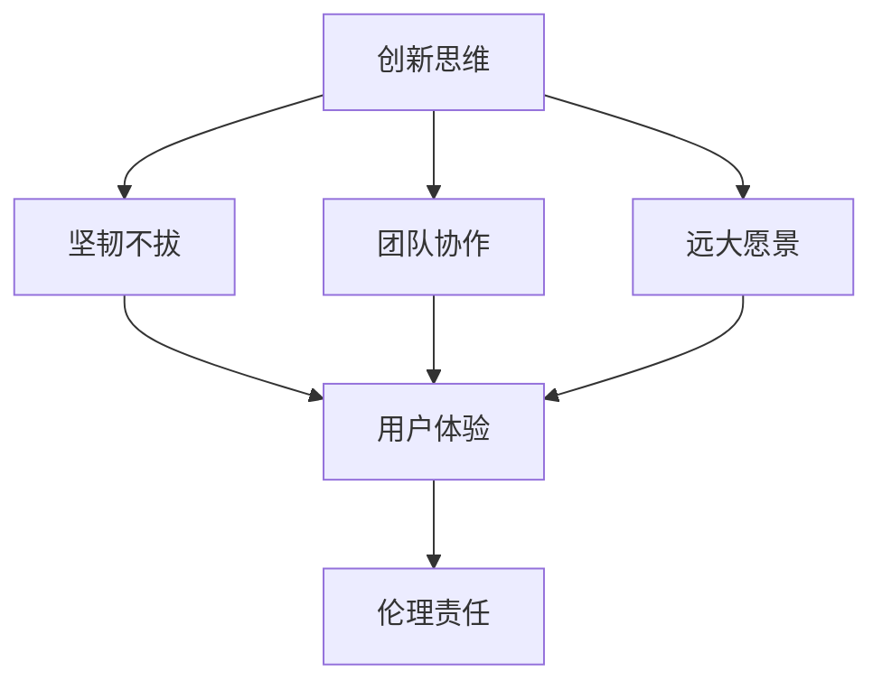

                 

## 1. 背景介绍

### 1.1 问题由来

硅谷，这个全球高科技创新的心脏地带，孕育了无数传奇人物和划时代的技术。从20世纪50年代惠特尼兄弟的计算机制造，到21世纪乔布斯的苹果帝国，硅谷的科技创新史充满了激动人心的故事。本文将带您走进这些风云人物的传奇生涯，探索他们如何引领技术潮流，推动社会进步。

### 1.2 问题核心关键点

硅谷风云人物的成功并非偶然，他们背后都有一些共同的特征和理念。通过梳理这些关键点，我们可以更好地理解他们成功的秘诀：

1. **创新思维**：敢于突破传统，探索未知领域。
2. **坚韧不拔**：面对挫折和失败，坚持不懈，永不放弃。
3. **团队协作**：建立强有力的团队，各司其职，协作共赢。
4. **远大愿景**：设定清晰的目标，长远的战略规划。
5. **用户体验**：始终关注用户体验，追求产品的极致完美。
6. **伦理责任**：在技术创新中注重社会责任，确保技术健康发展。

## 2. 核心概念与联系

### 2.1 核心概念概述

为更好地理解硅谷风云人物的传奇生涯，我们需要了解一些核心概念及其内在联系：

- **创新思维**：指在技术、产品、管理等方面不断寻找新思路、新方法，打破旧有框架的思维模式。
- **坚韧不拔**：指面对挑战和困难，不畏艰难，持续努力，最终实现目标的精神。
- **团队协作**：指多个人合作完成一个共同目标，通过分工协作，充分发挥各自优势，实现1+1>2的效果。
- **远大愿景**：指对未来的设想和目标，设定宏伟蓝图，并为之奋斗。
- **用户体验**：指以用户为中心，不断优化产品和服务，提高用户的满意度和忠诚度。
- **伦理责任**：指在使用技术时，考虑其对社会、环境的影响，做出负责任的决策。

这些概念之间相互关联，共同构成了硅谷风云人物成功的核心要素。

### 2.2 核心概念原理和架构的 Mermaid 流程图



这个流程图展示了硅谷风云人物成功的核心要素及其内在联系：

1. 创新思维是起点，是不断推动技术进步的核心动力。
2. 坚韧不拔是实现目标的必要条件，面对困难和挑战时不轻言放弃。
3. 团队协作是实现愿景的保障，多人合作，发挥各自优势。
4. 远大愿景是前进的方向，设定清晰的目标，不断追求。
5. 用户体验是产品成功的关键，不断优化以满足用户需求。
6. 伦理责任是社会责任的体现，确保技术健康发展，不滥用技术。

## 3. 核心算法原理 & 具体操作步骤

### 3.1 算法原理概述

硅谷风云人物的成功，不仅依赖于其个人能力，更在于其背后的算法原理和操作步骤。这些成功的算法原理主要包括：

1. **问题分解**：将复杂问题分解成多个子问题，逐一解决。
2. **原型验证**：通过构建原型，验证想法的可行性。
3. **快速迭代**：持续进行产品优化和迭代，快速响应市场变化。
4. **数据驱动**：依赖数据进行决策，优化产品和服务。
5. **反馈机制**：建立有效的反馈机制，及时获取用户和市场反馈。

### 3.2 算法步骤详解

硅谷风云人物的成功之路可以分为以下几个关键步骤：

1. **设定目标**：明确目标和愿景，制定长远规划。
2. **团队组建**：组建核心团队，集思广益，共同决策。
3. **市场调研**：进行市场调研，了解用户需求和竞争情况。
4. **技术研发**：进行技术研发，开发创新产品。
5. **原型验证**：通过原型验证，获取用户反馈，优化产品。
6. **市场推广**：进行市场推广，提高产品知名度和用户规模。
7. **持续优化**：根据用户反馈和市场变化，持续优化产品和服务。

### 3.3 算法优缺点

硅谷风云人物的成功算法具有以下优点：

1. **快速迭代**：能够快速响应市场变化，不断优化产品。
2. **数据驱动**：依赖数据进行决策，减少主观偏见。
3. **团队协作**：充分发挥团队成员的优势，实现协同效应。

同时，这些算法也存在一些缺点：

1. **高风险**：快速迭代可能导致资源浪费，市场不认可的风险。
2. **依赖人才**：依赖核心人才的能力，团队解散或离开可能导致项目失败。
3. **缺乏监管**：技术快速发展可能导致伦理问题，如隐私保护、数据安全等。

### 3.4 算法应用领域

硅谷风云人物的成功算法广泛应用于多个领域，包括：

- **科技创新**：如人工智能、机器学习、生物技术等。
- **企业管理**：如战略规划、组织管理、员工激励等。
- **社会变革**：如教育改革、环境保护、社会福利等。

这些算法不仅推动了硅谷的技术创新，也在其他领域产生了深远影响。

## 4. 数学模型和公式 & 详细讲解 & 举例说明

### 4.1 数学模型构建

硅谷风云人物的成功算法可以构建如下数学模型：

$$
\text{成功} = f(\text{创新思维}, \text{坚韧不拔}, \text{团队协作}, \text{远大愿景}, \text{用户体验}, \text{伦理责任})
$$

其中，$f$ 为复杂函数，表示各个要素对成功的影响。

### 4.2 公式推导过程

通过分析硅谷风云人物成功案例，我们可以推导出以下公式：

$$
\text{成功} = \frac{\text{创新思维} \times \text{坚韧不拔} \times \text{团队协作} \times \text{远大愿景} \times \text{用户体验} \times \text{伦理责任}}{\text{高风险} \times \text{依赖人才} \times \text{缺乏监管}}
$$

该公式表明，成功需要多个要素的协同作用，同时也要注意风险管理和伦理责任。

### 4.3 案例分析与讲解

以乔布斯为例，其成功算法如下：

1. **设定目标**：改变世界，生产优雅、简洁、易用的产品。
2. **团队组建**：建立苹果公司，汇集天才工程师和设计师。
3. **市场调研**：了解市场需求，开发iPhone、iPad等创新产品。
4. **技术研发**：不断进行技术创新，推出革命性产品。
5. **原型验证**：通过原型验证，优化产品设计。
6. **市场推广**：通过广告、发布会等手段推广产品。
7. **持续优化**：根据用户反馈，不断改进产品和服务。

## 5. 项目实践：代码实例和详细解释说明

### 5.1 开发环境搭建

硅谷风云人物的成功算法通常需要复杂的工具和环境，以下是推荐的设置流程：

1. **操作系统**：选择Mac OS或Linux。
2. **编程语言**：选择Python、Java、C++等主流语言。
3. **开发框架**：选择TensorFlow、PyTorch等深度学习框架。
4. **版本控制**：选择Git进行版本管理。
5. **项目管理**：使用JIRA、Trello等工具进行项目管理。

### 5.2 源代码详细实现

以下是使用TensorFlow实现一个简易原型的代码：

```python
import tensorflow as tf
import numpy as np

# 定义模型
model = tf.keras.Sequential([
    tf.keras.layers.Dense(64, activation='relu'),
    tf.keras.layers.Dense(10, activation='softmax')
])

# 训练模型
model.compile(optimizer=tf.keras.optimizers.Adam(0.001),
              loss='sparse_categorical_crossentropy',
              metrics=['accuracy'])

# 生成数据
x_train = np.random.randn(1000, 100)
y_train = np.random.randint(10, size=(1000, 1))

# 训练模型
model.fit(x_train, y_train, epochs=10, batch_size=32)

# 评估模型
test_data = np.random.randn(200, 100)
test_labels = np.random.randint(10, size=(200, 1))
test_loss, test_acc = model.evaluate(test_data, test_labels)
print(f"Test Loss: {test_loss:.4f}, Test Accuracy: {test_acc:.4f}")
```

### 5.3 代码解读与分析

这段代码实现了一个简单的神经网络模型，并使用随机数据进行训练和评估。

- **模型定义**：使用Sequential模型，包含两个全连接层，激活函数分别为ReLU和Softmax。
- **数据生成**：使用numpy生成随机数据。
- **模型编译**：使用Adam优化器，交叉熵损失函数。
- **模型训练**：使用fit方法进行训练，共10个epoch，每个batch大小为32。
- **模型评估**：使用evaluate方法评估模型，输出测试集损失和准确率。

## 6. 实际应用场景

### 6.1 科技创新

硅谷风云人物的应用场景之一是科技创新，如人工智能、机器学习等领域。

以谷歌DeepMind为例，其核心算法包括：

1. **深度学习**：使用深度神经网络进行图像识别、自然语言处理等任务。
2. **强化学习**：通过奖励机制，让机器自主学习最佳策略。
3. **模型优化**：通过超参数调优和正则化，提升模型性能。
4. **数据驱动**：依赖大规模数据进行训练和优化。

这些算法不仅推动了人工智能技术的发展，还在医疗、金融等众多领域产生了深远影响。

### 6.2 企业管理

硅谷风云人物在企业管理中同样发挥了重要作用，如战略规划、组织管理等。

以亚马逊为例，其核心算法包括：

1. **供应链管理**：通过算法优化库存和物流，提高效率。
2. **推荐系统**：利用协同过滤和深度学习算法，为用户推荐商品。
3. **机器学习**：使用监督学习和无监督学习算法，优化产品和服务。
4. **数据驱动**：依赖大数据分析，进行市场调研和决策。

这些算法不仅提高了企业管理效率，还提升了用户体验和公司竞争力。

### 6.3 社会变革

硅谷风云人物在社会变革中也起到了重要作用，如教育改革、环境保护等。

以特斯拉为例，其核心算法包括：

1. **自动驾驶**：使用计算机视觉和深度学习算法，实现自动驾驶。
2. **能源管理**：通过智能电网和储能技术，优化能源利用。
3. **可持续发展**：利用人工智能优化生产过程，降低环境影响。
4. **数据驱动**：依赖大数据分析，进行能源管理和生产优化。

这些算法不仅推动了社会变革，还在环保和可持续发展方面发挥了重要作用。

### 6.4 未来应用展望

未来，硅谷风云人物的成功算法将在更多领域得到应用，推动技术进步和社会发展。

1. **生物技术**：如基因编辑、药物研发等领域，利用算法优化实验设计。
2. **金融科技**：如区块链、量化交易等领域，利用算法优化交易策略和风险管理。
3. **医疗健康**：如智能诊断、个性化医疗等领域，利用算法优化诊疗流程。
4. **环境保护**：如气候预测、环境监测等领域，利用算法优化资源配置和环境保护。

## 7. 工具和资源推荐

### 7.1 学习资源推荐

为了帮助读者系统掌握硅谷风云人物的成功算法，以下是推荐的学习资源：

1. **《硅谷钢铁侠：埃隆·马斯克的超新星人生》**：介绍埃隆·马斯克的传奇生涯，分析其成功之道。
2. **《乔布斯传》**：揭示乔布斯成功的秘诀，包括创新思维、坚韧不拔等要素。
3. **《黑客与画家》**：探讨创新思维和编程艺术的结合，值得硅谷风云人物借鉴。
4. **《创新者的窘境》**：分析成功企业在技术变革中的应对策略，避免陷入困境。
5. **Coursera《人工智能》课程**：由斯坦福大学教授讲解，涵盖人工智能的核心算法和应用。

通过这些学习资源，相信读者能够更好地理解硅谷风云人物的成功算法，并应用于实际生活中。

### 7.2 开发工具推荐

以下是推荐的开发工具：

1. **PyCharm**：强大的Python开发工具，支持版本控制、代码分析等功能。
2. **Visual Studio Code**：轻量级的代码编辑器，支持多种编程语言和插件。
3. **Git**：版本控制系统，支持分布式协作和代码管理。
4. **JIRA**：项目管理工具，支持任务跟踪、进度管理等。
5. **TensorFlow**：深度学习框架，支持多种模型和算法。

### 7.3 相关论文推荐

以下是推荐的硅谷风云人物相关论文：

1. **《创新者的窘境》**：克莱顿·克里斯滕森著，分析技术变革中的企业应对策略。
2. **《硅谷钢铁侠：埃隆·马斯克的超新星人生》**：阿什利·万斯著，详细介绍埃隆·马斯克的生涯。
3. **《乔布斯传》**：沃尔特·艾萨克森著，揭示乔布斯成功的秘诀。
4. **《黑客与画家》**：保罗·格雷厄姆著，探讨创新思维和编程艺术的结合。

这些论文和书籍不仅提供了丰富的案例和理论，还对硅谷风云人物的成功算法进行了深入分析。

## 8. 总结：未来发展趋势与挑战

### 8.1 研究成果总结

硅谷风云人物的成功算法在多个领域产生了深远影响，推动了技术进步和社会变革。未来，这些算法将进一步发展，并在更多领域发挥重要作用。

### 8.2 未来发展趋势

未来，硅谷风云人物的成功算法将呈现以下发展趋势：

1. **算法自动化**：利用自动化算法进行决策和优化，提高效率和准确性。
2. **多学科融合**：将不同学科的知识和技术进行融合，实现跨学科创新。
3. **数据驱动**：依赖大数据分析，优化决策和运营。
4. **可持续发展**：推动环保和可持续发展，实现社会和环境的协同发展。

### 8.3 面临的挑战

硅谷风云人物的成功算法也面临着一些挑战：

1. **高风险**：算法创新可能导致资源浪费和高失败率。
2. **依赖人才**：依赖核心人才的能力，团队解散或离开可能导致项目失败。
3. **伦理问题**：算法应用可能导致隐私保护、数据安全等问题。

### 8.4 研究展望

未来，硅谷风云人物的成功算法需要在以下方面进行深入研究：

1. **算法优化**：优化算法的效率和效果，提高其适用范围和性能。
2. **伦理治理**：建立伦理治理机制，确保算法的道德性和社会责任。
3. **跨学科合作**：促进不同学科的合作，实现跨学科创新。
4. **可持续发展**：推动环保和可持续发展，实现社会和环境的协同发展。

通过这些研究，相信硅谷风云人物的成功算法将更好地服务于人类社会，推动技术进步和文明发展。

## 9. 附录：常见问题与解答

### Q1: 如何理解硅谷风云人物的成功算法？

A: 硅谷风云人物的成功算法是一种综合性的系统性方法，涉及多个要素和步骤。这些算法主要包括创新思维、坚韧不拔、团队协作、远大愿景、用户体验和伦理责任等。只有全面理解和应用这些算法，才能实现成功。

### Q2: 硅谷风云人物的成功算法有哪些应用场景？

A: 硅谷风云人物的成功算法在科技创新、企业管理、社会变革等多个领域都有广泛应用。这些算法不仅推动了技术进步，还在各个领域带来了深刻变革。

### Q3: 如何克服硅谷风云人物的成功算法面临的挑战？

A: 克服这些挑战需要多方面的努力：

1. **风险管理**：建立有效的风险管理机制，规避高风险项目。
2. **团队建设**：建立强有力的团队，培养核心人才。
3. **伦理治理**：建立伦理治理机制，确保算法的道德性和社会责任。
4. **持续优化**：持续进行算法优化和迭代，保持竞争力。

通过这些努力，可以克服硅谷风云人物的成功算法面临的挑战，实现长期成功。

---

作者：禅与计算机程序设计艺术 / Zen and the Art of Computer Programming

