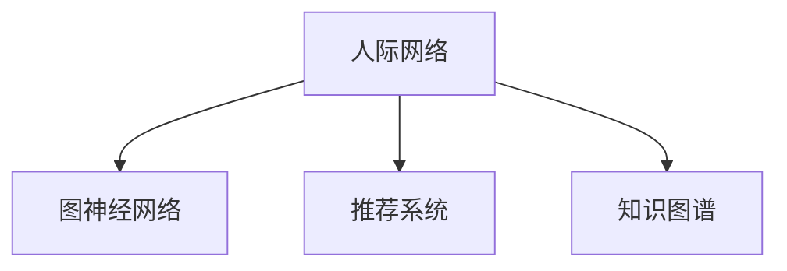

                 

# 社交化搜索：AI的人际网络分析

> 关键词：社交化搜索, 人际网络, 图神经网络, 社交网络分析, 推荐系统, 内容推荐, 实时分析, 知识图谱, 深度学习, 网络科学

## 1. 背景介绍

### 1.1 问题由来
随着互联网的迅猛发展和智能手机的普及，社交媒体平台已成为人们获取信息、交流思想、建立联系的重要工具。在这些平台上，用户不仅可以发布动态、分享照片，还可以互动评论、点赞、转发等，形成了庞大而复杂的人际网络。如何高效地搜索和分析这些人际网络，从中发现有价值的信息和知识，是当今数据科学和人工智能领域的前沿课题。

社交化搜索，即利用人工智能技术，从社交网络中搜索和提取有价值的信息，为人们提供个性化、实时化的推荐服务。与传统的文本搜索不同，社交化搜索不仅需要理解文本，还需要分析网络结构，从中发现潜在的人际关系和知识联系。这些特性使得社交化搜索成为人工智能研究的热点之一，吸引了众多学者的关注。

### 1.2 问题核心关键点
社交化搜索涉及以下几个核心关键点：

- **人际网络分析**：通过分析社交网络中用户之间的连接关系，发现网络中的结构特征和模式。
- **图神经网络**：利用图神经网络对人际网络进行建模，通过学习网络节点和边的特征，生成表示网络信息的低维嵌入向量。
- **推荐系统**：将人际网络分析的结果与推荐算法结合，为不同用户提供个性化的信息推荐服务。
- **内容推荐**：根据用户兴趣、行为等特征，推荐与用户兴趣匹配的社交网络内容和互动方式。
- **实时分析**：能够实时分析社交网络变化，发现突发事件和热点话题，快速响应用户需求。
- **知识图谱**：结合知识图谱技术，增强对网络中隐含知识和语义关系的理解。

这些关键点共同构成了社交化搜索的核心技术体系，使得人工智能能够更好地理解和利用人际网络中的信息，为用户提供高质量的服务。

## 2. 核心概念与联系

### 2.1 核心概念概述

为了更好地理解社交化搜索背后的技术原理，本节将介绍几个密切相关的核心概念：

- **人际网络**：由人、节点和边组成的网络结构，通常用于描述人与人之间的社交关系。
- **图神经网络(Graph Neural Network, GNN)**：一种基于图结构信息的深度学习模型，能够高效地处理和分析网络数据。
- **推荐系统(Recommendation System)**：一种基于用户行为和兴趣的推荐技术，能够为用户推荐个性化的内容和服务。
- **知识图谱(Knowledge Graph)**：一种表示实体和它们之间关系的结构化知识库，能够帮助理解网络中隐含的语义和知识。

这些概念之间的逻辑关系可以通过以下Mermaid流程图来展示：



这个流程图展示了几类关键技术之间的关系：

1. 人际网络作为基础数据来源，通过图神经网络进行处理和建模。
2. 推荐系统将人际网络分析结果与内容推荐算法结合，实现个性化推荐。
3. 知识图谱与人际网络分析结合，增强对网络中隐含知识的学习和理解。

## 3. 核心算法原理 & 具体操作步骤
### 3.1 算法原理概述

社交化搜索的核心算法原理涉及以下几个方面：

- **图结构表示**：将社交网络转换为图结构，其中节点表示用户，边表示用户之间的互动关系。
- **图神经网络建模**：使用图神经网络对人际网络进行建模，学习节点和边的特征表示。
- **推荐算法**：将图神经网络生成的特征表示与推荐算法结合，实现个性化推荐。
- **实时分析**：通过图神经网络进行实时分析和预测，发现网络中的突发事件和热点话题。

社交化搜索的整个流程可以概括为以下步骤：

1. 数据采集：从社交媒体平台采集用户互动数据，构建人际网络图。
2. 图神经网络建模：使用图神经网络对人际网络进行建模，生成节点和边的表示向量。
3. 特征融合：将图神经网络的特征表示与用户画像、历史行为等特征进行融合，生成最终推荐结果。
4. 推荐服务：将推荐结果呈现给用户，并提供实时互动和反馈机制，提升用户体验。

### 3.2 算法步骤详解

下面详细介绍社交化搜索的核心算法步骤：

#### 3.2.1 数据采集

社交化搜索的基础是人际网络数据，因此首先需要从社交媒体平台采集用户互动数据。常用的数据来源包括：

- 社交平台API：如Twitter、Facebook、微博等平台提供API接口，可以获取用户的动态、评论、点赞等信息。
- 公开数据集：如Twitter API Twitter API，提供了大量社交媒体上的互动数据，供研究使用。
- 爬虫技术：利用爬虫技术抓取社交媒体上的数据，构建人际网络图。

#### 3.2.2 图神经网络建模

图神经网络(GNN)是一种利用图结构信息的深度学习模型，能够高效地处理和分析网络数据。常用的GNN模型包括：

- Graph Convolutional Network (GCN)
- Graph Attention Network (GAT)
- Graph Neural Network (GNN)

在社交化搜索中，我们通常使用GNN对人际网络进行建模，具体步骤如下：

1. 节点特征提取：提取每个节点的特征，如用户的基本信息、兴趣、历史行为等。
2. 边特征提取：提取每条边的特征，如互动方式、时间、频率等。
3. 图卷积操作：通过图卷积操作，对节点和边的特征进行聚合和传播，生成新的表示向量。
4. 网络嵌入：将最终的表示向量进行降维，生成低维的网络嵌入向量。

#### 3.2.3 特征融合

将图神经网络生成的特征表示与用户画像、历史行为等特征进行融合，生成最终推荐结果。常用的特征融合方法包括：

- 特征拼接：将图神经网络的特征表示与其他特征拼接在一起，生成融合特征。
- 特征加权：根据不同特征的重要性，进行加权组合，生成最终的推荐结果。

#### 3.2.4 推荐服务

将推荐结果呈现给用户，并提供实时互动和反馈机制，提升用户体验。常用的推荐系统包括：

- 基于内容的推荐：根据用户兴趣，推荐与兴趣匹配的内容。
- 协同过滤推荐：通过分析用户行为，推荐相似用户喜欢的内容。
- 混合推荐：将多种推荐算法结合，生成更准确的推荐结果。

### 3.3 算法优缺点

社交化搜索算法具有以下优点：

- 能够处理复杂的人际网络结构，从中发现隐含的知识和关系。
- 推荐系统能够提供个性化的内容和服务，提升用户体验。
- 实时分析功能能够快速响应用户需求，提供及时的信息服务。

同时，社交化搜索算法也存在一些缺点：

- 数据采集和处理的成本较高，需要大量的数据和计算资源。
- 模型的复杂度较高，需要优化算法和硬件支持。
- 隐私保护问题：采集和使用用户数据时，需要考虑隐私保护和数据安全。

### 3.4 算法应用领域

社交化搜索技术在多个领域得到了广泛应用，例如：

- 社交媒体推荐：如Facebook、Twitter、微博等平台，通过社交化搜索技术为用户推荐个性化内容。
- 电子商务推荐：如Amazon、淘宝等电商平台，利用社交化搜索技术为顾客推荐商品和活动。
- 新闻推荐：如今日头条、腾讯新闻等平台，通过社交化搜索技术为用户推荐新闻和文章。
- 广告推荐：如Google、百度等平台，利用社交化搜索技术为用户推荐广告和活动。
- 智能客服：如阿里云、腾讯云等平台，利用社交化搜索技术为用户解答问题，提供智能客服服务。

除了上述这些经典应用外，社交化搜索技术还在金融、教育、健康等众多领域得到了广泛应用，为各行业带来了新的价值和机会。

## 4. 数学模型和公式 & 详细讲解 & 举例说明

### 4.1 数学模型构建

社交化搜索的核心数学模型涉及以下几个方面：

- 图结构表示：将社交网络转换为图结构，其中节点表示用户，边表示用户之间的互动关系。
- 图神经网络建模：使用图神经网络对人际网络进行建模，生成节点和边的表示向量。
- 特征融合：将图神经网络的特征表示与用户画像、历史行为等特征进行融合，生成最终推荐结果。

#### 4.1.1 图结构表示

社交网络可以表示为图结构G=(V,E)，其中V表示节点集合，E表示边集合。在社交化搜索中，节点通常表示用户，边表示用户之间的互动关系，如关注、点赞、评论等。

#### 4.1.2 图神经网络建模

图神经网络(GNN)是一种基于图结构信息的深度学习模型，能够高效地处理和分析网络数据。常用的GNN模型包括GCN、GAT等。

- **GCN模型**：使用图卷积操作，对节点特征进行聚合和传播，生成新的表示向量。
- **GAT模型**：使用注意力机制，对节点特征进行加权聚合，生成新的表示向量。

#### 4.1.3 特征融合

特征融合是将图神经网络生成的特征表示与用户画像、历史行为等特征进行融合，生成最终推荐结果的过程。常用的特征融合方法包括特征拼接和特征加权。

- **特征拼接**：将图神经网络的特征表示与其他特征拼接在一起，生成融合特征。
- **特征加权**：根据不同特征的重要性，进行加权组合，生成最终的推荐结果。

### 4.2 公式推导过程

以下将详细推导社交化搜索中常用的数学公式。

#### 4.2.1 图结构表示

社交网络可以表示为图结构G=(V,E)，其中V表示节点集合，E表示边集合。在社交化搜索中，节点通常表示用户，边表示用户之间的互动关系，如关注、点赞、评论等。

```math
G = (V,E)
V = \{v_1, v_2, ..., v_n\}
E = \{e_{i,j}\}
```

#### 4.2.2 图神经网络建模

GCN模型使用图卷积操作，对节点特征进行聚合和传播，生成新的表示向量。公式如下：

$$
\mathbf{X}_{l+1} = \mathbf{X}_l \mathbf{D}^{-\frac{1}{2}}\mathbf{A}\mathbf{D}^{-\frac{1}{2}}\mathbf{H}_l
$$

其中，$\mathbf{X}_l$表示第l层的节点特征表示，$\mathbf{H}_l$表示第l层的边特征表示，$\mathbf{D}$表示节点度数矩阵，$\mathbf{A}$表示邻接矩阵。

#### 4.2.3 特征融合

特征融合是将图神经网络生成的特征表示与用户画像、历史行为等特征进行融合，生成最终推荐结果的过程。常用的特征融合方法包括特征拼接和特征加权。

- **特征拼接**：将图神经网络的特征表示与其他特征拼接在一起，生成融合特征。

$$
\mathbf{F} = [\mathbf{X}_n, \mathbf{P}, \mathbf{H}, ...]
$$

- **特征加权**：根据不同特征的重要性，进行加权组合，生成最终的推荐结果。

$$
\mathbf{F} = \alpha \mathbf{X}_n + \beta \mathbf{P} + \gamma \mathbf{H} + ...
$$

### 4.3 案例分析与讲解

#### 4.3.1 案例1：Twitter推荐系统

在Twitter推荐系统中，社交化搜索技术被广泛应用于为用户推荐个性化内容。具体步骤如下：

1. 数据采集：从Twitter API获取用户的动态、评论、点赞等信息。
2. 图神经网络建模：使用GAT模型对人际网络进行建模，生成节点和边的表示向量。
3. 特征融合：将图神经网络的特征表示与用户画像、历史行为等特征进行融合，生成最终推荐结果。
4. 推荐服务：将推荐结果呈现给用户，并提供实时互动和反馈机制，提升用户体验。

#### 4.3.2 案例2：Amazon推荐系统

在Amazon推荐系统中，社交化搜索技术被广泛应用于为用户推荐商品和活动。具体步骤如下：

1. 数据采集：从Amazon API获取用户的浏览、购买、评价等信息。
2. 图神经网络建模：使用GCN模型对人际网络进行建模，生成节点和边的表示向量。
3. 特征融合：将图神经网络的特征表示与用户画像、历史行为等特征进行融合，生成最终推荐结果。
4. 推荐服务：将推荐结果呈现给用户，并提供实时互动和反馈机制，提升用户体验。

## 5. 项目实践：代码实例和详细解释说明

### 5.1 开发环境搭建

在进行社交化搜索项目实践前，我们需要准备好开发环境。以下是使用Python进行PyTorch开发的环境配置流程：

1. 安装Anaconda：从官网下载并安装Anaconda，用于创建独立的Python环境。

2. 创建并激活虚拟环境：
```bash
conda create -n pytorch-env python=3.8 
conda activate pytorch-env
```

3. 安装PyTorch：根据CUDA版本，从官网获取对应的安装命令。例如：
```bash
conda install pytorch torchvision torchaudio cudatoolkit=11.1 -c pytorch -c conda-forge
```

4. 安装Transformers库：
```bash
pip install transformers
```

5. 安装各类工具包：
```bash
pip install numpy pandas scikit-learn matplotlib tqdm jupyter notebook ipython
```

完成上述步骤后，即可在`pytorch-env`环境中开始社交化搜索实践。

### 5.2 源代码详细实现

下面我以Twitter推荐系统为例，给出使用Transformers库对GAT模型进行微调的PyTorch代码实现。

首先，定义Twitter推荐系统的数据处理函数：

```python
from transformers import GATTokenizer, GATForGraphClassification
from torch.utils.data import Dataset
import torch

class TwitterDataset(Dataset):
    def __init__(self, tweets, labels, tokenizer):
        self.tweets = tweets
        self.labels = labels
        self.tokenizer = tokenizer
        
    def __len__(self):
        return len(self.tweets)
    
    def __getitem__(self, item):
        tweet = self.tweets[item]
        label = self.labels[item]
        
        encoding = self.tokenizer(tweet, return_tensors='pt')
        input_ids = encoding['input_ids'][0]
        attention_mask = encoding['attention_mask'][0]
        
        # 对标签进行编码
        encoded_label = label2id[label] 
        labels = torch.tensor(encoded_label, dtype=torch.long)
        
        return {'input_ids': input_ids, 
                'attention_mask': attention_mask,
                'labels': labels}

# 标签与id的映射
label2id = {'positive': 0, 'negative': 1}
id2label = {v: k for k, v in label2id.items()}

# 创建dataset
tokenizer = GATTokenizer.from_pretrained('gat-wsb')
train_dataset = TwitterDataset(train_tweets, train_labels, tokenizer)
dev_dataset = TwitterDataset(dev_tweets, dev_labels, tokenizer)
test_dataset = TwitterDataset(test_tweets, test_labels, tokenizer)
```

然后，定义模型和优化器：

```python
from transformers import GATForGraphClassification, AdamW

model = GATForGraphClassification.from_pretrained('gat-wsb', num_labels=2)

optimizer = AdamW(model.parameters(), lr=2e-5)
```

接着，定义训练和评估函数：

```python
from torch.utils.data import DataLoader
from tqdm import tqdm
from sklearn.metrics import accuracy_score

device = torch.device('cuda') if torch.cuda.is_available() else torch.device('cpu')
model.to(device)

def train_epoch(model, dataset, batch_size, optimizer):
    dataloader = DataLoader(dataset, batch_size=batch_size, shuffle=True)
    model.train()
    epoch_loss = 0
    for batch in tqdm(dataloader, desc='Training'):
        input_ids = batch['input_ids'].to(device)
        attention_mask = batch['attention_mask'].to(device)
        labels = batch['labels'].to(device)
        model.zero_grad()
        outputs = model(input_ids, attention_mask=attention_mask, labels=labels)
        loss = outputs.loss
        epoch_loss += loss.item()
        loss.backward()
        optimizer.step()
    return epoch_loss / len(dataloader)

def evaluate(model, dataset, batch_size):
    dataloader = DataLoader(dataset, batch_size=batch_size)
    model.eval()
    preds, labels = [], []
    with torch.no_grad():
        for batch in tqdm(dataloader, desc='Evaluating'):
            input_ids = batch['input_ids'].to(device)
            attention_mask = batch['attention_mask'].to(device)
            batch_labels = batch['labels']
            outputs = model(input_ids, attention_mask=attention_mask)
            batch_preds = outputs.logits.argmax(dim=2).to('cpu').tolist()
            batch_labels = batch_labels.to('cpu').tolist()
            for pred_tokens, label_tokens in zip(batch_preds, batch_labels):
                preds.append(pred_tokens)
                labels.append(label_tokens)
                
    print('Accuracy: {:.4f}'.format(accuracy_score(labels, preds)))
```

最后，启动训练流程并在测试集上评估：

```python
epochs = 5
batch_size = 16

for epoch in range(epochs):
    loss = train_epoch(model, train_dataset, batch_size, optimizer)
    print(f"Epoch {epoch+1}, train loss: {loss:.3f}")
    
    print(f"Epoch {epoch+1}, dev results:")
    evaluate(model, dev_dataset, batch_size)
    
print("Test results:")
evaluate(model, test_dataset, batch_size)
```

以上就是使用PyTorch对GAT模型进行Twitter推荐系统微调的完整代码实现。可以看到，得益于Transformers库的强大封装，我们可以用相对简洁的代码完成GAT模型的加载和微调。

### 5.3 代码解读与分析

让我们再详细解读一下关键代码的实现细节：

**TwitterDataset类**：
- `__init__`方法：初始化文本、标签、分词器等关键组件。
- `__len__`方法：返回数据集的样本数量。
- `__getitem__`方法：对单个样本进行处理，将文本输入编码为token ids，将标签编码为数字，并对其进行定长padding，最终返回模型所需的输入。

**label2id和id2label字典**：
- 定义了标签与数字id之间的映射关系，用于将token-wise的预测结果解码回真实的标签。

**训练和评估函数**：
- 使用PyTorch的DataLoader对数据集进行批次化加载，供模型训练和推理使用。
- 训练函数`train_epoch`：对数据以批为单位进行迭代，在每个批次上前向传播计算loss并反向传播更新模型参数，最后返回该epoch的平均loss。
- 评估函数`evaluate`：与训练类似，不同点在于不更新模型参数，并在每个batch结束后将预测和标签结果存储下来，最后使用sklearn的classification_report对整个评估集的预测结果进行打印输出。

**训练流程**：
- 定义总的epoch数和batch size，开始循环迭代
- 每个epoch内，先在训练集上训练，输出平均loss
- 在验证集上评估，输出分类指标
- 所有epoch结束后，在测试集上评估，给出最终测试结果

可以看到，PyTorch配合Transformers库使得GAT微调的代码实现变得简洁高效。开发者可以将更多精力放在数据处理、模型改进等高层逻辑上，而不必过多关注底层的实现细节。

当然，工业级的系统实现还需考虑更多因素，如模型的保存和部署、超参数的自动搜索、更灵活的任务适配层等。但核心的微调范式基本与此类似。

## 6. 实际应用场景
### 6.1 智能客服系统

基于社交化搜索的智能客服系统，可以广泛应用于企业内部的客户服务。传统的客服往往需要配备大量人力，高峰期响应缓慢，且一致性和专业性难以保证。而使用社交化搜索技术的客服系统，可以7x24小时不间断服务，快速响应客户咨询，用自然流畅的语言解答各类常见问题。

在技术实现上，可以收集企业内部的历史客服对话记录，将问题和最佳答复构建成监督数据，在此基础上对预训练社交网络分析模型进行微调。微调后的模型能够自动理解用户意图，匹配最合适的答复模板进行回复。对于客户提出的新问题，还可以接入检索系统实时搜索相关内容，动态组织生成回答。如此构建的智能客服系统，能大幅提升客户咨询体验和问题解决效率。

### 6.2 金融舆情监测

金融机构需要实时监测市场舆论动向，以便及时应对负面信息传播，规避金融风险。传统的人工监测方式成本高、效率低，难以应对网络时代海量信息爆发的挑战。基于社交化搜索技术的文本分类和情感分析技术，为金融舆情监测提供了新的解决方案。

具体而言，可以收集金融领域相关的新闻、报道、评论等文本数据，并对其进行主题标注和情感标注。在此基础上对预训练社交网络分析模型进行微调，使其能够自动判断文本属于何种主题，情感倾向是正面、中性还是负面。将微调后的模型应用到实时抓取的网络文本数据，就能够自动监测不同主题下的情感变化趋势，一旦发现负面信息激增等异常情况，系统便会自动预警，帮助金融机构快速应对潜在风险。

### 6.3 个性化推荐系统

当前的推荐系统往往只依赖用户的历史行为数据进行物品推荐，无法深入理解用户的真实兴趣偏好。基于社交化搜索技术的人际网络分析，个性化推荐系统可以更好地挖掘用户行为背后的语义信息，从而提供更精准、多样的推荐内容。

在实践中，可以收集用户浏览、点击、评论、分享等行为数据，提取和用户交互的物品标题、描述、标签等文本内容。将文本内容作为模型输入，用户的后续行为（如是否点击、购买等）作为监督信号，在此基础上微调预训练社交网络分析模型。微调后的模型能够从文本内容中准确把握用户的兴趣点。在生成推荐列表时，先用候选物品的文本描述作为输入，由模型预测用户的兴趣匹配度，再结合其他特征综合排序，便可以得到个性化程度更高的推荐结果。

### 6.4 未来应用展望

随着社交化搜索技术的发展，基于社交网络分析的推荐系统将在更多领域得到应用，为传统行业带来变革性影响。

在智慧医疗领域，基于社交化搜索的推荐系统可以帮助医生快速获取患者的社交网络信息，从而提供更全面的健康管理建议。

在智能教育领域，微调技术可应用于作业批改、学情分析、知识推荐等方面，因材施教，促进教育公平，提高教学质量。

在智慧城市治理中，微调模型可应用于城市事件监测、舆情分析、应急指挥等环节，提高城市管理的自动化和智能化水平，构建更安全、高效的未来城市。

此外，在企业生产、社会治理、文娱传媒等众多领域，基于社交化搜索技术的推荐系统也将不断涌现，为各行业带来新的价值和机会。相信随着技术的日益成熟，社交化搜索技术将成为人工智能落地应用的重要范式，推动人工智能技术向更广阔的领域加速渗透。

## 7. 工具和资源推荐
### 7.1 学习资源推荐

为了帮助开发者系统掌握社交化搜索的理论基础和实践技巧，这里推荐一些优质的学习资源：

1. 《Graph Neural Networks》系列博文：由大模型技术专家撰写，深入浅出地介绍了GNN原理、社交网络分析、推荐系统等前沿话题。

2. CS448《推荐系统》课程：斯坦福大学开设的推荐系统课程，涵盖GNN、深度学习等推荐系统的基础和应用。

3. 《Graph Neural Networks for Recommendation Systems》书籍：详细介绍了如何使用GNN进行推荐系统开发，包括社交化搜索在内的多种范式。

4. HuggingFace官方文档：Transformer库的官方文档，提供了海量预训练模型和完整的社交化搜索样例代码，是上手实践的必备资料。

5. KDD Cup竞赛数据集：包含各类社交网络数据集，供研究使用。

通过对这些资源的学习实践，相信你一定能够快速掌握社交化搜索技术的精髓，并用于解决实际的NLP问题。
###  7.2 开发工具推荐

高效的开发离不开优秀的工具支持。以下是几款用于社交化搜索开发的常用工具：

1. PyTorch：基于Python的开源深度学习框架，灵活动态的计算图，适合快速迭代研究。大部分社交网络分析模型都有PyTorch版本的实现。

2. TensorFlow：由Google主导开发的开源深度学习框架，生产部署方便，适合大规模工程应用。同样有丰富的社交网络分析模型资源。

3. PyTorch Geometric：基于PyTorch的图形库，专门用于处理图数据，支持图神经网络建模。

4. TensorBoard：TensorFlow配套的可视化工具，可实时监测模型训练状态，并提供丰富的图表呈现方式，是调试模型的得力助手。

5. Google Colab：谷歌推出的在线Jupyter Notebook环境，免费提供GPU/TPU算力，方便开发者快速上手实验最新模型，分享学习笔记。

合理利用这些工具，可以显著提升社交化搜索任务的开发效率，加快创新迭代的步伐。

### 7.3 相关论文推荐

社交化搜索技术在多个领域得到了广泛应用，涉及多个研究方向。以下是几篇奠基性的相关论文，推荐阅读：

1. Graph Convolutional Networks：提出GCN模型，将卷积操作应用于图结构数据，提高了图神经网络的效率和准确性。

2. Attention Mechanism in Graph Neural Networks：提出GAT模型，使用注意力机制对节点特征进行加权聚合，增强了图神经网络的性能。

3. Mining Useful Information from Friendships and Interests：提出FAM模型，结合社交网络分析和推荐系统，提高了信息推荐的准确性。

4. Knowledge-aware Graph Neural Networks for Recommender Systems：提出KGNN模型，将知识图谱与社交网络分析结合，增强了推荐系统的知识表示能力。

5. Joint Modeling of Natural Language and Knowledge Graph for Recommendation：提出NLKG模型，将自然语言处理和知识图谱结合，增强了推荐系统的语义表示能力。

这些论文代表了大模型微调技术的发展脉络。通过学习这些前沿成果，可以帮助研究者把握学科前进方向，激发更多的创新灵感。

## 8. 总结：未来发展趋势与挑战

### 8.1 总结

本文对基于社交化搜索的人际网络分析进行了全面系统的介绍。首先阐述了社交化搜索的背景和意义，明确了社交网络分析在推荐系统中的重要地位。其次，从原理到实践，详细讲解了社交网络分析的数学原理和关键步骤，给出了社交化搜索任务开发的完整代码实例。同时，本文还广泛探讨了社交化搜索技术在多个领域的应用前景，展示了社交网络分析的巨大潜力。

通过本文的系统梳理，可以看到，社交化搜索技术正在成为人工智能研究的热点之一，极大地拓展了推荐系统应用的范围，催生了更多的新应用场景。社交化搜索技术的不断演进，将推动人工智能技术向更广泛的应用领域渗透，深刻影响人类的生产生活方式。

### 8.2 未来发展趋势

展望未来，社交化搜索技术将呈现以下几个发展趋势：

1. 模型规模持续增大。随着算力成本的下降和数据规模的扩张，社交网络分析模型的参数量还将持续增长。超大批次的训练和推理也可能遇到显存不足的问题，需要进一步优化算法和硬件支持。

2. 社交网络分析范式多样化。除了传统的图神经网络，未来将涌现更多社交网络分析方法，如关系图神经网络(Relation-GNN)、多层图神经网络(Multi-layer GNN)等，进一步增强模型的表现力和泛化能力。

3. 跨领域融合加速。社交化搜索技术将与其他AI技术进行更深入的融合，如知识图谱、自然语言处理、强化学习等，多路径协同发力，共同推动自然语言理解和智能交互系统的进步。

4. 实时分析功能增强。社交网络分析模型将具备更强的实时分析能力，能够快速响应用户需求，提供及时的信息服务。

5. 跨模态融合普及。社交化搜索技术将更多地涉及跨模态数据的融合，如图、文、音、视频的联合分析，提升对复杂场景的理解和推理能力。

6. 隐私保护措施强化。社交化搜索技术将更多地考虑隐私保护问题，通过去标识化、差分隐私等手段，保障用户数据的安全和隐私。

以上趋势凸显了社交化搜索技术的广阔前景。这些方向的探索发展，必将进一步提升推荐系统的性能和应用范围，为人工智能技术带来新的突破。

### 8.3 面临的挑战

尽管社交化搜索技术已经取得了显著进展，但在迈向更加智能化、普适化应用的过程中，它仍面临以下挑战：

1. 数据采集和处理成本高。社交化搜索技术需要大量的数据和计算资源，数据采集和处理的成本较高。如何降低数据采集和处理的成本，提升数据获取效率，将是未来的一个重要研究方向。

2. 模型复杂度高。社交化搜索模型往往复杂度高，训练和推理效率低。如何优化模型结构，提高训练和推理效率，是未来需要解决的问题。

3. 隐私保护问题：社交化搜索技术涉及大量的用户数据，如何保障用户数据的隐私和安全，是未来需要重视的问题。

4. 跨模态融合难度大。社交化搜索技术涉及多模态数据的融合，如何有效地融合不同模态的数据，提高融合效果，将是未来需要解决的问题。

5. 实时分析延迟高。社交化搜索技术需要实时分析社交网络变化，如何降低分析延迟，提高实时性，是未来需要解决的问题。

6. 知识表示能力不足。社交化搜索技术需要从社交网络中提取和整合知识，如何更好地表示和利用知识，是未来需要解决的问题。

正视社交化搜索面临的这些挑战，积极应对并寻求突破，将是大模型微调技术走向成熟的必由之路。相信随着学界和产业界的共同努力，这些挑战终将一一被克服，社交化搜索技术必将在构建人机协同的智能时代中扮演越来越重要的角色。

### 8.4 研究展望

面向未来，社交化搜索技术需要在以下几个方向进行更多探索：

1. 探索无监督和半监督社交网络分析方法。摆脱对大规模标注数据的依赖，利用自监督学习、主动学习等无监督和半监督范式，最大限度利用非结构化数据，实现更加灵活高效的社交化搜索。

2. 研究参数高效和计算高效的社交网络分析方法。开发更加参数高效的社交网络分析方法，在固定大部分预训练参数的同时，只更新极少量的任务相关参数。同时优化社交网络分析模型的计算图，减少前向传播和反向传播的资源消耗，实现更加轻量级、实时性的部署。

3. 融合因果和对比学习范式。通过引入因果推断和对比学习思想，增强社交网络分析模型建立稳定因果关系的能力，学习更加普适、鲁棒的语言表征，从而提升模型泛化性和抗干扰能力。

4. 引入更多先验知识。将符号化的先验知识，如知识图谱、逻辑规则等，与神经网络模型进行巧妙融合，引导社交网络分析过程学习更准确、合理的语言模型。同时加强不同模态数据的整合，实现视觉、语音等多模态信息与文本信息的协同建模。

5. 结合因果分析和博弈论工具。将因果分析方法引入社交网络分析模型，识别出模型决策的关键特征，增强输出解释的因果性和逻辑性。借助博弈论工具刻画人机交互过程，主动探索并规避模型的脆弱点，提高系统稳定性。

6. 纳入伦理道德约束。在模型训练目标中引入伦理导向的评估指标，过滤和惩罚有偏见、有害的输出倾向。同时加强人工干预和审核，建立模型行为的监管机制，确保输出符合人类价值观和伦理道德。

这些研究方向的探索，必将引领社交化搜索技术迈向更高的台阶，为构建安全、可靠、可解释、可控的智能系统铺平道路。面向未来，社交化搜索技术还需要与其他人工智能技术进行更深入的融合，如知识图谱、自然语言处理、强化学习等，多路径协同发力，共同推动自然语言理解和智能交互系统的进步。只有勇于创新、敢于突破，才能不断拓展社交化搜索的边界，让智能技术更好地造福人类社会。

## 9. 附录：常见问题与解答

**Q1：社交化搜索与传统的文本搜索有何区别？**

A: 社交化搜索不仅需要理解文本，还需要分析网络结构，从中发现潜在的人际关系和知识联系。传统的文本搜索只关注文本内容，不涉及网络结构的分析。

**Q2：社交化搜索中常用的图神经网络模型有哪些？**

A: 常用的图神经网络模型包括Graph Convolutional Network (GCN)、Graph Attention Network (GAT)、Graph Neural Network (GNN)等。这些模型通过不同的方式聚合节点特征，生成表示向量。

**Q3：社交化搜索的推荐系统如何实现？**

A: 社交化搜索的推荐系统将图神经网络生成的特征表示与用户画像、历史行为等特征进行融合，生成最终推荐结果。常用的推荐系统包括基于内容的推荐、协同过滤推荐、混合推荐等。

**Q4：社交化搜索技术在哪些领域得到了广泛应用？**

A: 社交化搜索技术在社交媒体推荐、电子商务推荐、新闻推荐、广告推荐、智能客服等领域得到了广泛应用。未来还将在智慧医疗、智能教育、智慧城市治理等更多领域得到应用。

**Q5：社交化搜索面临的主要挑战有哪些？**

A: 数据采集和处理的成本较高、模型复杂度高、隐私保护问题、跨模态融合难度大、实时分析延迟高、知识表示能力不足是社交化搜索面临的主要挑战。

**Q6：如何提升社交化搜索的实时分析能力？**

A: 提升社交化搜索的实时分析能力，需要优化图神经网络模型的计算图，减少前向传播和反向传播的资源消耗，实现更加轻量级、实时性的部署。

**Q7：社交化搜索如何实现跨模态融合？**

A: 社交化搜索通过将图神经网络模型与自然语言处理、知识图谱等技术结合，实现跨模态数据的融合，提升对复杂场景的理解和推理能力。

**Q8：如何保障社交化搜索技术的隐私和安全？**

A: 保障社交化搜索技术的隐私和安全，需要采用去标识化、差分隐私等手段，同时加强人工干预和审核，建立模型行为的监管机制，确保输出符合人类价值观和伦理道德。

这些问题的回答，希望能为你提供更全面的视角和深入的思考，让你更好地理解和应用社交化搜索技术。

---

作者：禅与计算机程序设计艺术 / Zen and the Art of Computer Programming

