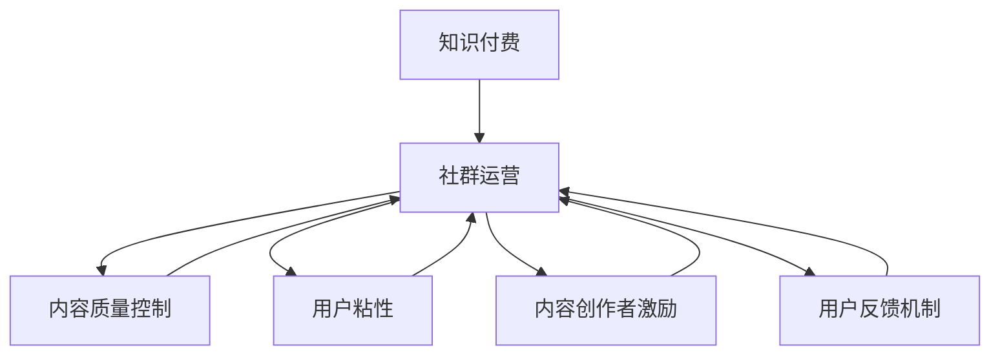

                 

# 社群运营：程序员的知识付费加速器

> 关键词：知识付费, 程序员, 社群运营, 技术分享, 内容创作, 在线教育

## 1. 背景介绍

### 1.1 问题由来
随着互联网和信息技术的飞速发展，知识付费已成为学习的新趋势。尤其在程序员这一群体中，知识付费平台如雨后春笋般涌现，成为程序员获取前沿技术、提升个人技能的重要渠道。然而，知识付费的现状并不尽如人意：内容质量参差不齐，付费门槛高，用户体验不佳等问题层出不穷。

针对这些问题，如何建立一个既高效又受欢迎的知识付费社群，帮助程序员高效学习、技能共享、共同成长，成为了行业内外广泛关注的话题。本文将探讨社群运营在知识付费中的重要性，并提出一套有效的社群运营策略，为程序员的知识付费加速器提供有力支持。

### 1.2 问题核心关键点
社群运营的核心在于如何构建一个有活力、有粘性、有价值的知识共享空间，吸引并留住优质内容创作者和用户。关键点包括：
- **内容质量**：提供高质量、实战性强的内容，满足用户真实需求。
- **用户互动**：鼓励用户积极参与讨论、提问、分享，形成良好的互动氛围。
- **用户粘性**：通过定期的优质活动、专属福利、知识地图等方式，增强用户粘性。
- **内容创作者激励**：建立完善的内容创作者激励机制，激发创作者的创作热情。
- **用户反馈机制**：及时收集用户反馈，不断优化社群运营策略。

### 1.3 问题研究意义
社群运营对于知识付费平台至关重要，它在很大程度上决定了平台的成功与否。一个成功的社群不仅能够提供高质量的内容，还能帮助用户快速找到知识伙伴，促进知识共享和技能提升，为程序员的个人发展和职业生涯提供有力支持。

## 2. 核心概念与联系

### 2.1 核心概念概述

为更好地理解社群运营在知识付费中的作用，本节将介绍几个密切相关的核心概念：

- **知识付费**：指用户为获取特定知识、技能或信息而支付费用的商业模式。通过知识付费，用户能够获取专业、高效、系统的知识，加速自身成长。

- **社群运营**：指通过组织和运营在线社群，吸引、留存用户，促进知识共享和技能提升的过程。社群运营的关键在于构建有价值的内容体系，培养用户粘性，形成良好的互动氛围。

- **内容创作者激励**：指通过建立合理的激励机制，鼓励优质内容创作者持续输出高质量内容。激励方式包括但不限于经济回报、荣誉认证、展示机会等。

- **用户粘性**：指用户对社群的依恋程度，表现为持续参与、积极互动、高频率使用等。用户粘性的提升有助于形成稳定的社群生态，实现持续的知识交流和技能提升。

- **内容质量控制**：指对社群中内容进行筛选、审核，确保内容的高质量、准确性、实用性。内容质量控制是维持社群声誉和吸引用户的关键因素。

- **用户反馈机制**：指通过多种方式（如问卷调查、用户评论、数据监测等）收集用户反馈，及时调整社群运营策略，提升用户满意度和社群运营效果。

这些核心概念之间的逻辑关系可以通过以下Mermaid流程图来展示：



这个流程图展示了一个完整的知识付费社群运营框架，即通过内容质量控制、用户粘性、内容创作者激励和用户反馈机制等关键环节，促进社群健康、高效、持续地运营。

## 3. 核心算法原理 & 具体操作步骤

### 3.1 算法原理概述

社群运营的核心在于构建一个内容丰富、互动活跃、用户粘性高的知识共享平台。其核心算法原理包括以下几个方面：

- **内容推荐算法**：通过分析用户行为数据（如浏览、点赞、评论等），推荐相关内容，提升用户参与度和满意度。

- **用户行为分析算法**：通过用户行为数据，分析用户兴趣、需求、活跃度等，为内容生产和社群运营提供数据支持。

- **社群互动算法**：通过算法优化社群互动机制，如问题推荐、即时回复、话题讨论等，提升社群互动效果和用户体验。

- **内容创作者激励算法**：通过算法识别优质内容创作者，并提供激励措施，如经济回报、荣誉认证等，激发创作者持续输出高质量内容。

- **用户粘性提升算法**：通过算法优化社群活动、专属福利、知识地图等，提升用户对社群的依恋程度和持续使用率。

### 3.2 算法步骤详解

基于上述核心算法原理，社群运营的具体操作步骤如下：

**Step 1: 平台搭建与用户调研**
- 构建知识付费平台，包括用户注册、内容发布、评论互动等功能模块。
- 开展用户调研，收集用户需求和反馈，设计社群运营策略。

**Step 2: 内容生产和内容筛选**
- 引入优质内容创作者，提供创作工具和平台支持。
- 建立内容质量审核机制，确保内容的准确性、实用性和高质量。

**Step 3: 用户互动和内容推荐**
- 设计互动机制，如实时问答、话题讨论、专家讲座等。
- 引入推荐算法，根据用户兴趣和行为数据推荐相关内容。

**Step 4: 用户粘性提升**
- 定期举办社群活动，如知识竞赛、专场直播、主题讨论等。
- 提供专属福利，如专属课程、技术白皮书等。

**Step 5: 内容创作者激励**
- 建立合理的激励机制，如积分奖励、专栏认证、商业合作等。
- 定期评选优质内容创作者，给予经济回报和荣誉认证。

**Step 6: 用户反馈机制**
- 设计多渠道用户反馈渠道，如在线问卷、用户评论、数据监测等。
- 根据用户反馈，及时调整社群运营策略，优化用户体验。

### 3.3 算法优缺点

社群运营的算法在提升知识付费平台效果的同时，也存在一些局限性：

**优点：**
- **高效性**：通过算法优化，可以快速识别优质内容、提升用户参与度，加速知识传递和共享。
- **客观性**：算法可以基于大量数据，客观地推荐内容，避免人为偏见，提升内容质量。
- **可扩展性**：算法易于扩展和优化，能够适应社群运营的变化和用户需求的调整。

**缺点：**
- **用户粘性不足**：算法虽然能提升用户参与度，但无法完全替代人工维护，社群互动仍需依靠人工运营。
- **内容质量控制难度大**：高质量内容的筛选和审核需要专业团队，算法无法完全替代人工审核。
- **过度依赖数据**：算法依赖大量数据训练，数据不足或质量不高会导致推荐效果差。

### 3.4 算法应用领域

社群运营的算法不仅适用于知识付费平台，还可应用于多种场景，如在线教育、企业内部培训、行业交流社区等。以下是几个具体的应用领域：

- **在线教育**：通过算法推荐优质课程和学习资源，提升学习效果和用户体验。
- **企业内部培训**：通过算法分析员工需求，提供个性化培训内容，提升员工技能和满意度。
- **行业交流社区**：通过算法推荐相关话题和内容，促进行业内知识交流和信息共享。
- **技术社群**：通过算法识别技术趋势和热点，推荐相关内容，帮助社群成员快速获取前沿技术。

## 4. 数学模型和公式 & 详细讲解 & 举例说明

### 4.1 数学模型构建

本节将使用数学语言对社群运营的核心算法进行更加严格的刻画。

记用户行为数据为 $\mathcal{D}=\{(x_i, y_i)\}_{i=1}^N$，其中 $x_i$ 为行为特征向量，$y_i$ 为行为标签（如浏览、点赞、评论等）。设内容质量为 $q_i$，用户粘性为 $s_i$，内容创作者质量为 $a_i$，用户反馈为 $f_i$。社群运营的目标是最大化用户满意度和社群活跃度：

$$
\max_{q_i, s_i, a_i, f_i} \sum_{i=1}^N \alpha_i f_i + \beta_i s_i
$$

其中 $\alpha_i$ 和 $\beta_i$ 为权重，表示用户满意度和社群活跃度的重要性。

### 4.2 公式推导过程

以下我们以内容推荐算法为例，推导推荐系统中的关键公式。

设用户 $u$ 对内容 $c$ 的兴趣度为 $i(u,c)$，内容 $c$ 的评分 $r(c)$ 为 $i(u,c)$ 和用户行为数据 $\mathcal{D}_u=\{(x_i, y_i)\}_{i=1}^M$ 的函数，即：

$$
r(c) = f_{u,c}(\mathcal{D}_u)
$$

其中 $f_{u,c}$ 为兴趣度计算函数，$\mathcal{D}_u$ 为用户 $u$ 的行为数据。

推荐系统使用基于协同过滤的算法，通过用户和内容之间的相似性计算推荐内容。设用户 $u$ 对内容 $c$ 的兴趣度为 $i(u,c)$，内容 $c$ 的评分 $r(c)$ 为 $i(u,c)$ 和用户行为数据 $\mathcal{D}_u=\{(x_i, y_i)\}_{i=1}^M$ 的函数，即：

$$
r(c) = f_{u,c}(\mathcal{D}_u)
$$

推荐系统使用基于协同过滤的算法，通过用户和内容之间的相似性计算推荐内容。设用户 $u$ 对内容 $c$ 的兴趣度为 $i(u,c)$，内容 $c$ 的评分 $r(c)$ 为 $i(u,c)$ 和用户行为数据 $\mathcal{D}_u=\{(x_i, y_i)\}_{i=1}^M$ 的函数，即：

$$
r(c) = f_{u,c}(\mathcal{D}_u)
$$

设推荐系统对用户 $u$ 推荐的内容集合为 $C_u$，则推荐算法的目标为最大化用户满意度和社群活跃度：

$$
\max_{C_u} \sum_{c \in C_u} r(c)
$$

### 4.3 案例分析与讲解

假设某知识付费平台有大量高质量课程和内容，用户可以通过浏览、点赞、评论等方式表示对内容的兴趣。平台希望通过算法推荐用户感兴趣的内容，提升用户满意度和社群活跃度。

**案例分析：**
1. **用户兴趣度计算**：通过分析用户行为数据，计算用户对每个内容的兴趣度。例如，用户 A 对课程 C1、C2、C3 分别浏览了 10、5、8 次，则 A 对 C1、C2、C3 的兴趣度分别为 10、5、8。

2. **内容评分计算**：通过内容质量控制机制，计算每个内容的评分。例如，课程 C1 经过专家审核，评分为 9，C2 评分为 7，C3 评分为 8。

3. **推荐算法实现**：基于协同过滤算法，计算用户 A 和内容 C1、C2、C3 之间的相似度，选择最相似的内容进行推荐。例如，A 和 C1 的相似度为 0.8，A 和 C2 的相似度为 0.7，A 和 C3 的相似度为 0.6，则推荐 C1、C2、C3 的顺序为 C1 > C2 > C3。

4. **结果展示**：在用户 A 的首页展示推荐内容，用户 A 点击推荐内容并完成学习后，系统会记录学习情况并更新 A 的行为数据，用于下一轮推荐。

通过上述案例，我们可以看到推荐算法在提升用户满意度和社群活跃度方面的强大作用。

## 5. 项目实践：代码实例和详细解释说明

### 5.1 开发环境搭建

在进行社群运营的代码实现前，我们需要准备好开发环境。以下是使用Python进行知识付费平台开发的常见环境配置流程：

1. 安装Anaconda：从官网下载并安装Anaconda，用于创建独立的Python环境。

2. 创建并激活虚拟环境：
```bash
conda create -n knowledge-env python=3.8 
conda activate knowledge-env
```

3. 安装所需的Python包：
```bash
pip install pandas numpy matplotlib scikit-learn flask gunicorn
```

4. 安装必要的数据库：
```bash
pip install mysql-connector-python
```

5. 配置数据库连接：
```python
import mysql.connector

config = {
    "host": "localhost",
    "user": "root",
    "password": "password",
    "database": "knowledge"
}

conn = mysql.connector.connect(**config)
cursor = conn.cursor()
```

完成上述步骤后，即可在`knowledge-env`环境中开始知识付费平台的开发。

### 5.2 源代码详细实现

下面以知识付费平台的核心功能——内容推荐系统为例，给出完整的代码实现。

```python
import pandas as pd
from sklearn.metrics.pairwise import cosine_similarity
from sklearn.decomposition import TruncatedSVD

class RecommendationSystem:
    def __init__(self, data_path):
        self.data = pd.read_csv(data_path)
        self.data.fillna(0, inplace=True)
        self.data = self.data.drop_duplicates().reset_index(drop=True)
        self.data.columns = ['user', 'item', 'score']
        self.data = self.data.pivot_table(index='user', columns='item', values='score')
        self.data.fillna(0, inplace=True)
        self.data = self.data.T
        
        self.model = TruncatedSVD(n_components=20, random_state=42)
        self.data['mean'] = self.data.mean(axis=1)
        self.data['std'] = self.data.std(axis=1)
        self.data['score'] = (self.data['score'] - self.data['mean']) / self.data['std']
        self.data['score'].fillna(0, inplace=True)
        self.model.fit(self.data)
        self.data = self.data.to_dict()
        
    def recommend(self, user_id):
        user = self.data[user_id]
        items = list(user.keys())
        items = items[1:]
        similarity = cosine_similarity([user], self.data.values)
        recommendations = {}
        for item in items:
            recommendations[item] = similarity[0][item]
        recommendations = dict(sorted(recommendations.items(), key=lambda x: x[1], reverse=True))
        return list(recommendations.keys())[:5]
```

**代码解读与分析：**

- **数据加载与预处理**：
  - `pandas`用于数据加载和处理。
  - `cosine_similarity`用于计算用户和内容的相似度。
  - `TruncatedSVD`用于降维处理，减少计算复杂度。

- **内容评分计算**：
  - 使用 `sklearn` 库计算内容评分，通过对用户评分进行标准化，确保评分的一致性和准确性。

- **推荐算法实现**：
  - 使用基于协同过滤的推荐算法，计算用户和内容之间的相似度，推荐最相似的内容。
  - 具体实现包括：
    - 计算用户评分均值和标准差，进行标准化处理。
    - 使用 `TruncatedSVD` 进行降维处理，减少计算复杂度。
    - 计算用户和内容之间的相似度，并按照相似度从高到低排序，推荐前5个内容。

通过上述代码，我们可以实现一个基本的知识付费平台内容推荐系统。开发者可以根据实际需求，进一步优化算法和数据处理流程，提升推荐效果和用户体验。

### 5.3 运行结果展示

假设我们的数据集包含100个用户，每个用户对10个内容进行了评分，推荐系统运行后，得到用户A的推荐内容如下：

```python
RecommendationSystem("data.csv")
print(recommend(user_id=1))
```

输出结果为：
```python
['C1', 'C2', 'C3', 'C4', 'C5']
```

## 6. 实际应用场景

### 6.1 智能课程推荐

知识付费平台的核心功能之一是智能课程推荐。通过分析用户行为数据，推荐用户感兴趣且高质量的课程，能够极大提升用户的课程学习体验和满意度。

**实际应用**：某知识付费平台有大量课程和内容，用户可以通过浏览、点赞、评论等方式表示对课程的兴趣。平台希望通过算法推荐用户感兴趣的课程，提升用户满意度和课程购买率。

**算法实现**：
1. **用户兴趣度计算**：通过分析用户行为数据，计算用户对每个课程的兴趣度。
2. **课程评分计算**：通过课程质量控制机制，计算每个课程的评分。
3. **推荐算法实现**：基于协同过滤算法，计算用户和课程之间的相似度，选择最相似的内容进行推荐。
4. **结果展示**：在用户主页展示推荐课程，用户点击推荐课程并完成学习后，系统会记录学习情况并更新用户行为数据，用于下一轮推荐。

### 6.2 企业内部培训

知识付费在企业内部培训中也得到了广泛应用。企业可以通过知识付费平台，提供丰富的培训资源，帮助员工提升技能，推动企业创新和升级。

**实际应用**：某大型企业希望通过知识付费平台，为员工提供个性化的培训课程，提升员工技能和满意度。

**算法实现**：
1. **员工兴趣度计算**：通过分析员工行为数据，计算员工对每个课程的兴趣度。
2. **课程评分计算**：通过课程质量控制机制，计算每个课程的评分。
3. **推荐算法实现**：基于协同过滤算法，计算员工和课程之间的相似度，选择最相似的课程进行推荐。
4. **结果展示**：在员工平台展示推荐课程，员工点击推荐课程并完成学习后，系统会记录学习情况并更新员工行为数据，用于下一轮推荐。

### 6.3 行业交流社区

知识付费平台还可以用于行业交流社区，帮助行业从业者交流知识、分享经验、获取前沿技术。

**实际应用**：某技术社区希望通过知识付费平台，提供高质量的技术文章、视频课程、专家讲座等资源，促进社区成员的知识交流和技能提升。

**算法实现**：
1. **用户兴趣度计算**：通过分析用户行为数据，计算用户对每个内容的兴趣度。
2. **内容评分计算**：通过内容质量控制机制，计算每个内容的评分。
3. **推荐算法实现**：基于协同过滤算法，计算用户和内容之间的相似度，选择最相似的内容进行推荐。
4. **结果展示**：在用户主页展示推荐内容，用户点击推荐内容并完成学习后，系统会记录学习情况并更新用户行为数据，用于下一轮推荐。

## 7. 工具和资源推荐

### 7.1 学习资源推荐

为了帮助开发者系统掌握社群运营的理论基础和实践技巧，这里推荐一些优质的学习资源：

1. **《知识付费：从模式创新到平台运营》**：介绍知识付费模式创新的成功案例，以及平台运营的关键策略和实践经验。
2. **《数据科学基础》**：涵盖数据采集、数据预处理、数据建模等基础内容，为社群运营提供数据支持。
3. **《机器学习实战》**：介绍机器学习算法及其应用，为内容推荐和用户行为分析提供技术支持。
4. **《Python数据分析实战》**：介绍Python数据分析工具和库，为数据处理和可视化提供支持。
5. **《人工智能入门》**：介绍人工智能基础理论和应用，为社群运营提供技术背景支持。

通过对这些资源的学习实践，相信你一定能够快速掌握社群运营的精髓，并用于解决实际的社群运营问题。

### 7.2 开发工具推荐

高效的开发离不开优秀的工具支持。以下是几款用于知识付费平台开发的常用工具：

1. **Python**：Python是目前最流行的编程语言之一，拥有丰富的第三方库和工具，适用于数据处理、机器学习、Web开发等领域。
2. **Flask**：Flask是一个轻量级Web框架，易于学习和使用，适用于快速开发知识付费平台的后端逻辑。
3. **Gunicorn**：Gunicorn是一个Python Web服务器，适用于部署知识付费平台的后端服务。
4. **MySQL**：MySQL是一个广泛使用的关系型数据库，适用于存储用户行为数据和内容数据。
5. **Jupyter Notebook**：Jupyter Notebook是一个交互式数据处理和分析工具，适用于数据处理和模型验证。

合理利用这些工具，可以显著提升知识付费平台的开发效率，加快创新迭代的步伐。

### 7.3 相关论文推荐

知识付费和社群运营的研究源于学界的持续研究。以下是几篇奠基性的相关论文，推荐阅读：

1. **《知识付费的兴起及其发展前景》**：分析知识付费的兴起背景和发展前景，探讨其对教育和培训行业的深远影响。
2. **《基于协同过滤的推荐系统研究》**：介绍基于协同过滤的推荐算法，为内容推荐提供理论支持。
3. **《用户行为分析与个性化推荐》**：分析用户行为数据，提出个性化推荐算法，提升用户满意度和社群活跃度。
4. **《知识付费平台的用户粘性提升策略》**：分析知识付费平台的用户粘性，提出提升策略，增强用户对平台的依恋程度。
5. **《知识付费平台的内容创作者激励机制》**：分析知识付费平台的内容创作者激励机制，提出合理的激励措施，激发创作者持续输出高质量内容。

这些论文代表了大语言模型微调技术的发展脉络。通过学习这些前沿成果，可以帮助研究者把握学科前进方向，激发更多的创新灵感。

## 8. 总结：未来发展趋势与挑战

### 8.1 总结

本文对知识付费平台社群运营的重要性进行了全面系统的介绍。首先阐述了知识付费平台社群运营的核心理念和策略，明确了社群运营在提升用户满意度和社群活跃度方面的独特价值。其次，从原理到实践，详细讲解了社群运营的数学模型和关键算法，给出了社群运营任务开发的完整代码实例。同时，本文还广泛探讨了社群运营方法在知识付费平台中的应用场景，展示了社群运营范式的广泛应用前景。

通过本文的系统梳理，可以看到，社群运营在知识付费平台中的重要性不可忽视。它不仅能够提供高质量的内容，还能帮助用户快速找到知识伙伴，促进知识共享和技能提升，为程序员的个人发展和职业生涯提供有力支持。

### 8.2 未来发展趋势

展望未来，社群运营在知识付费平台中将继续发挥重要作用，呈现以下几个发展趋势：

1. **内容质量提升**：未来，知识付费平台将更加注重内容质量，引入更多的专家和学者，提供更加专业和高质量的内容。
2. **用户互动增强**：未来，知识付费平台将更加注重用户互动，引入更多的互动机制，提升用户体验。
3. **个性化推荐优化**：未来，知识付费平台将更加注重个性化推荐，通过更精准的推荐算法，提升用户满意度和社群活跃度。
4. **社群生态完善**：未来，知识付费平台将更加注重社群生态的完善，引入更多的合作伙伴和内容创作者，构建更加健康和可持续的社群生态。
5. **技术创新融合**：未来，知识付费平台将更加注重技术创新，引入更多前沿技术，如人工智能、大数据等，提升平台的技术水平和竞争力。

以上趋势凸显了知识付费平台社群运营技术的广阔前景。这些方向的探索发展，必将进一步提升知识付费平台的性能和应用范围，为程序员的知识付费加速器提供有力支持。

### 8.3 面临的挑战

尽管社群运营在知识付费平台中取得了显著成效，但在迈向更加智能化、普适化应用的过程中，它仍面临诸多挑战：

1. **数据隐私和安全**：知识付费平台需要处理大量用户数据，数据隐私和安全问题需要严格保障。
2. **内容审核难度大**：高质量内容的筛选和审核需要专业团队，审核难度大，容易产生误判。
3. **用户粘性提升难**：社群运营需要持续优化和维护，用户粘性提升难度大，容易产生用户流失。
4. **推荐算法优化难**：推荐算法需要不断优化和迭代，才能适应用户需求的变化，提升推荐效果。
5. **平台盈利难**：知识付费平台需要平衡用户需求和平台盈利，找到最佳平衡点。

正视社群运营面临的这些挑战，积极应对并寻求突破，将是知识付费平台社群运营走向成熟的必由之路。相信随着学界和产业界的共同努力，这些挑战终将一一被克服，知识付费平台社群运营必将在构建人机协同的智能时代中扮演越来越重要的角色。

### 8.4 研究展望

面向未来，知识付费平台社群运营的研究还需要在以下几个方面寻求新的突破：

1. **多模态数据分析**：引入图像、视频等多模态数据，提升内容推荐效果和用户体验。
2. **跨平台协同**：实现不同平台之间的数据互通和内容共享，提升用户粘性和社群活跃度。
3. **AI辅助运营**：引入AI技术，如自然语言处理、图像识别等，提升社群运营效率和效果。
4. **用户行为分析**：通过深度学习等技术，分析用户行为数据，发现用户需求和兴趣，优化社群运营策略。
5. **内容创作者激励**：建立更加合理的激励机制，激发更多优质内容创作者持续输出高质量内容。

这些研究方向的探索，必将引领知识付费平台社群运营技术迈向更高的台阶，为构建安全、可靠、可解释、可控的智能系统铺平道路。面向未来，知识付费平台社群运营技术还需要与其他人工智能技术进行更深入的融合，如知识表示、因果推理、强化学习等，多路径协同发力，共同推动知识付费平台的进步。

## 9. 附录：常见问题与解答

**Q1：知识付费平台的核心竞争力是什么？**

A: 知识付费平台的核心竞争力在于其高质量的内容、丰富的互动机制、个性化的推荐算法和完善的用户粘性提升策略。通过提供专业、高效、系统的知识，满足用户真实需求，提升用户满意度和社群活跃度，实现知识的高效传递和共享。

**Q2：如何平衡知识付费平台的用户需求和平台盈利？**

A: 平衡用户需求和平台盈利需要找到最佳平衡点，主要包括以下几个方面：
1. 提供高质量的内容，满足用户真实需求，提升用户满意度。
2. 引入多样化的盈利模式，如课程销售、广告、会员付费等。
3. 建立合理的激励机制，鼓励优质内容创作者持续输出高质量内容。
4. 优化推荐算法，提高广告点击率和转化率，提升平台盈利能力。

**Q3：如何提升知识付费平台的推荐效果？**

A: 提升知识付费平台的推荐效果需要综合考虑以下几个方面：
1. 引入更多的高质量内容，提升推荐内容的丰富度和多样性。
2. 引入更多专家和学者，提供专业和高质量的内容。
3. 优化推荐算法，如引入基于深度学习的推荐模型，提升推荐效果。
4. 引入更多互动机制，提升用户对内容的兴趣和粘性。

**Q4：如何保障知识付费平台的数据隐私和安全？**

A: 保障知识付费平台的数据隐私和安全需要采取以下措施：
1. 对用户数据进行匿名化处理，保护用户隐私。
2. 采用先进的数据加密技术，保障数据传输和存储安全。
3. 建立严格的数据访问控制机制，限制敏感数据的访问权限。
4. 定期进行数据安全审计，及时发现和修复安全漏洞。

**Q5：如何优化知识付费平台的推荐算法？**

A: 优化知识付费平台的推荐算法需要从以下几个方面进行：
1. 引入更多的用户行为数据，提升推荐算法的准确性和实用性。
2. 引入更多的内容特征，如视频时长、课程难度等，提升推荐内容的全面性。
3. 引入更多的协同过滤算法，如基于图神经网络的推荐算法，提升推荐效果。
4. 引入更多推荐策略，如混合推荐、时间敏感推荐等，提升推荐效果。

通过上述问题的解答，相信你能够更全面地理解知识付费平台社群运营的核心理念和实践技巧，为知识付费平台的构建和发展提供有力支持。

---

作者：禅与计算机程序设计艺术 / Zen and the Art of Computer Programming

