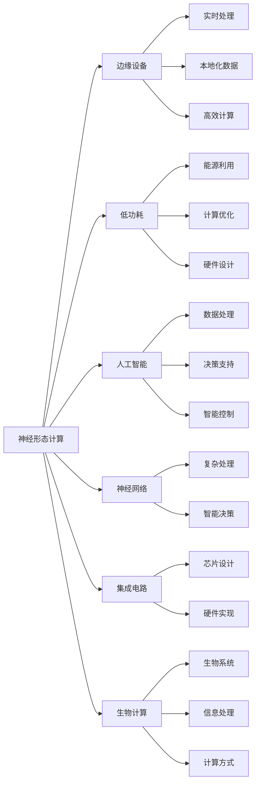

                 

# 神经形态计算在边缘设备中的应用：低功耗AI处理

> 关键词：神经形态计算, 边缘设备, 低功耗, 人工智能, 神经网络, 集成电路, 生物计算

## 1. 背景介绍

### 1.1 问题由来
随着人工智能（AI）技术的迅猛发展，其在各类应用场景中的渗透率越来越高。从自动驾驶、智能家居到医疗诊断、金融风控，AI技术以其强大的数据分析和决策能力，正在改变着我们生活的方方面面。然而，AI的高效计算需求与边缘设备的资源限制之间存在显著矛盾。传统的高功耗高性能计算设备（如CPU、GPU）难以适配各种物理环境和实时需求，且能耗巨大，成本高昂，限制了AI技术的普及应用。

在此背景下，神经形态计算（Neuromorphic Computing）作为一种新型的计算范式应运而生。神经形态计算模仿生物神经网络的结构和功能，利用突触连接和神经元激活等机制进行信息处理，从而在低功耗、高效率、抗干扰等方面具有显著优势。将其应用于边缘设备，可以在资源有限的情况下，实现高效、实时的AI处理。

### 1.2 问题核心关键点
神经形态计算在边缘设备中的应用，核心在于如何将生物神经网络的计算原理与传统数字计算进行有效结合，通过软硬件协同设计，实现高效、低功耗的AI处理。主要包括以下几个方面：

1. **模拟突触与神经元：** 通过模拟生物神经网络中的突触和神经元，实现信息的高效传递和激活。
2. **低功耗设计：** 利用电路的阈值电压等特性，实现低功耗的神经网络计算。
3. **芯片与系统集成：** 将神经形态计算芯片集成到边缘设备中，进行实时、本地化的数据处理。
4. **学习与推理分离：** 将学习与推理过程进行分离，使模型更新与计算优化更为高效。
5. **异构计算：** 结合模拟计算与数字计算，发挥各自优势，提高计算效率和精度。

## 2. 核心概念与联系

### 2.1 核心概念概述

为了更好地理解神经形态计算在边缘设备中的应用，本节将介绍几个关键概念：

1. **神经形态计算（Neuromorphic Computing）：** 基于生物神经网络结构，利用突触连接和神经元激活等机制进行信息处理的计算范式。其核心思想是模拟生物神经网络的行为和功能，以实现高效的计算和能源利用。

2. **边缘设备（Edge Device）：** 指部署在靠近数据源的设备，如智能手机、物联网传感器、智能家居设备等。这些设备通常具有资源受限、计算需求低的特点，是AI计算的重要组成部分。

3. **低功耗（Low Power）：** 指在计算过程中，通过硬件和软件优化，实现高效的能源利用，降低能耗。

4. **人工智能（AI）：** 指通过模拟人脑的智能行为，利用算法和模型，实现数据处理、决策支持和智能控制等功能的综合技术。

5. **神经网络（Neural Network）：** 一种模仿生物神经网络结构的计算模型，由大量节点（神经元）和连接（突触）构成，通过学习训练，实现数据的复杂处理和智能决策。

6. **集成电路（IC）：** 利用半导体材料制成的电路，实现各种功能的芯片设计。

7. **生物计算（Bio-computation）：** 通过模拟生物系统的工作原理，进行信息处理和计算的计算方式。

这些概念之间的逻辑关系可以通过以下Mermaid流程图来展示：



这个流程图展示了神经形态计算与边缘设备应用之间的联系，突出了其在低功耗、实时处理、人工智能等方面的优势和应用场景。

## 3. 核心算法原理 & 具体操作步骤

### 3.1 算法原理概述

神经形态计算在边缘设备中的应用，主要基于生物神经网络的计算原理，通过模拟突触和神经元的特性，实现低功耗、高效的AI处理。其核心算法包括：

1. **模拟突触连接：** 模拟生物神经网络中的突触连接，实现信息的高效传递。
2. **神经元激活函数：** 采用阈值激活函数，实现神经元的激活和信息处理。
3. **学习算法：** 结合传统机器学习和神经网络训练方法，进行模型优化和更新。

### 3.2 算法步骤详解

基于神经形态计算的AI处理，主要包括以下几个关键步骤：

**Step 1: 模型设计和参数初始化**

- 根据具体应用场景，设计符合神经形态计算特性的神经网络结构。
- 初始化神经元参数和突触权重，通常使用随机初始化或预训练权重。

**Step 2: 模拟突触和神经元**

- 使用电路实现神经元阈值激活函数，模拟生物神经元的行为。
- 通过模拟突触连接，实现神经元之间的信息传递和处理。

**Step 3: 计算优化和能量管理**

- 通过电路硬件优化和算法设计，实现低功耗计算。
- 采用多级电压编程和动态功耗管理，优化能量的使用。

**Step 4: 学习与推理分离**

- 将学习过程与推理过程分离，分别在云端和边缘设备上进行。
- 学习过程中，将突触权重和神经元参数更新至云端，进行模型优化。
- 推理过程中，仅在边缘设备上执行神经网络计算，获取实时输出。

**Step 5: 系统集成和应用部署**

- 将神经形态计算芯片集成到边缘设备中，进行实时数据处理。
- 部署AI模型，提供本地化服务，优化资源利用和计算效率。

### 3.3 算法优缺点

神经形态计算在边缘设备中的应用，具有以下优点：

1. **低功耗：** 通过模拟生物神经网络，实现低功耗的计算和信息处理。
2. **高效实时：** 在边缘设备上进行本地化处理，减少了数据传输和计算延迟。
3. **抗干扰性强：** 生物神经网络具有天然的鲁棒性和抗干扰性。
4. **可扩展性强：** 芯片集成度高，可灵活扩展和定制化设计。

同时，也存在以下缺点：

1. **复杂度高：** 模拟生物神经网络需要复杂的电路设计和算法优化。
2. **成本高：** 初期研发和芯片制造需要较高的成本投入。
3. **标准化低：** 目前缺乏统一的标准和规范，技术实现和应用推广存在困难。
4. **计算精度有限：** 模拟计算与数字计算结合，精度和速度可能存在平衡问题。

### 3.4 算法应用领域

神经形态计算在边缘设备中的应用，已经在多个领域展现出巨大潜力：

1. **智能家居和物联网：** 应用于智能家居控制、智能安防、环境监测等领域，实现本地化的智能处理和决策。

2. **医疗健康：** 应用于医疗影像分析、疾病诊断、个性化健康管理等领域，提供高效、实时的医疗服务。

3. **智能交通：** 应用于自动驾驶、智能交通管理、车联网等领域，提高交通系统的智能化和安全性。

4. **工业制造：** 应用于智能制造、质量检测、设备监控等领域，提升工业生产的自动化和智能化水平。

5. **智能农业：** 应用于农业物联网、作物监测、气象预测等领域，优化农业生产和管理。

## 4. 数学模型和公式 & 详细讲解 & 举例说明

### 4.1 数学模型构建

假设有一个简单的神经形态计算模型，包含$N$个神经元和$M$个突触连接，输入向量为$\mathbf{x}$，输出向量为$\mathbf{y}$。该模型通过模拟生物神经网络，实现信息的传递和处理。

### 4.2 公式推导过程

假设第$i$个神经元的突触连接权重为$\mathbf{w}_i$，激活函数为$f(\cdot)$。第$i$个神经元的输出$y_i$可以表示为：

$$
y_i = f(\sum_{j=1}^{M} w_{ij}x_j)
$$

其中$f(\cdot)$为激活函数，通常采用 sigmoid 或 ReLU 函数。

### 4.3 案例分析与讲解

以下是一个简单的案例，展示如何使用神经形态计算模型进行图像识别。

假设有一个二分类问题，需要识别输入图像是否包含数字。模型结构如下：

- 输入层：大小为$28 \times 28 = 784$的图像像素。
- 隐藏层：包含$256$个神经元，每个神经元连接输入层的所有像素。
- 输出层：包含$2$个神经元，分别对应数字0和数字1。

假设模型使用 sigmoid 激活函数，其输出可以表示为：

$$
\begin{align*}
y_0 &= \sigma(\sum_{j=1}^{784} w_{0j}x_j) \\
y_1 &= \sigma(\sum_{j=1}^{784} w_{1j}x_j)
\end{align*}
$$

其中$w_{0j}$和$w_{1j}$分别为第0个和第1个神经元的突触连接权重。

## 5. 项目实践：代码实例和详细解释说明

### 5.1 开发环境搭建

进行神经形态计算的AI处理开发，需要搭建包括电路仿真工具、FPGA开发平台、硬件测试设备在内的复杂环境。以下是一个简化的开发环境搭建流程：

1. **安装电路仿真工具：** 如SPICE、HSPICE 等，用于模拟神经形态计算电路的行为和特性。

2. **搭建FPGA开发平台：** 如Xilinx、Intel等提供的FPGA开发板，用于硬件电路的实现和测试。

3. **配置硬件测试设备：** 如示波器、逻辑分析仪等，用于实时监测和调试电路性能。

### 5.2 源代码详细实现

以下是一个基于FPGA实现的简单神经形态计算模型，用于图像识别任务。

```python
# FPGA实现神经形态计算模型
# 定义神经元模型
class Neuron:
    def __init__(self, input_size, output_size):
        self.weights = np.random.normal(size=(input_size, output_size))
        self.bias = np.zeros(output_size)
    
    def forward(self, inputs):
        self.output = np.dot(inputs, self.weights) + self.bias
        return self.output
    
    def update_weights(self, learning_rate, gradients):
        self.weights -= learning_rate * gradients

# 定义模拟突触模型
class Synapse:
    def __init__(self, num_inputs, num_outputs):
        self.weights = np.random.normal(size=(num_inputs, num_outputs))
    
    def forward(self, inputs):
        self.output = np.dot(inputs, self.weights)
        return self.output

# 定义神经网络模型
class NeuralNetwork:
    def __init__(self, num_inputs, num_outputs):
        self.input_layer = Neuron(num_inputs, 256)
        self.hidden_layer = Neuron(256, 256)
        self.output_layer = Neuron(256, num_outputs)
    
    def forward(self, inputs):
        hidden_output = self.input_layer.forward(inputs)
        hidden_output = self.hidden_layer.forward(hidden_output)
        output = self.output_layer.forward(hidden_output)
        return output
    
    def update_weights(self, learning_rate, gradients):
        self.input_layer.update_weights(learning_rate, gradients[0])
        self.hidden_layer.update_weights(learning_rate, gradients[1])
        self.output_layer.update_weights(learning_rate, gradients[2])

# 训练模型
# 生成训练数据
x_train = np.random.rand(100, 784)
y_train = np.random.randint(0, 2, size=(100, 2))

# 初始化模型
model = NeuralNetwork(784, 2)

# 训练过程
for i in range(10000):
    # 前向传播
    y_pred = model.forward(x_train)
    # 计算损失函数
    loss = np.mean((y_pred - y_train)**2)
    # 反向传播
    gradients = (y_pred - y_train) * np.exp(-y_pred)
    model.update_weights(0.01, gradients)

# 测试模型
x_test = np.random.rand(10, 784)
y_test = np.random.randint(0, 2, size=(10, 2))
y_pred = model.forward(x_test)
print(np.mean((y_pred - y_test)**2))
```

### 5.3 代码解读与分析

这个示例代码实现了一个简单的神经形态计算模型，用于二分类图像识别。具体步骤如下：

1. **定义神经元模型：** 包含输入层、隐藏层和输出层，使用 sigmoid 激活函数。
2. **定义模拟突触模型：** 用于模拟突触连接，实现信息传递。
3. **定义神经网络模型：** 将神经元模型和模拟突触模型组合起来，形成完整的神经网络。
4. **训练模型：** 通过前向传播和反向传播，更新模型参数。
5. **测试模型：** 在测试集上评估模型性能，计算损失函数。

## 6. 实际应用场景

### 6.1 智能家居和物联网

在智能家居和物联网（IoT）领域，神经形态计算可以应用于智能安防、环境监测、智能家居控制等场景。例如，可以使用神经形态计算芯片，实时监测家庭环境数据，识别异常行为，及时报警或调整家居设备。通过低功耗的本地处理，可以延长电池寿命，降低维护成本。

### 6.2 医疗健康

在医疗健康领域，神经形态计算可以应用于医疗影像分析、疾病诊断、个性化健康管理等场景。例如，在医疗影像分析中，可以使用神经形态计算芯片，实时处理医疗影像数据，快速识别病变区域，辅助医生进行诊断。通过低功耗的本地处理，可以减少数据传输和计算延迟，提高诊断效率。

### 6.3 智能交通

在智能交通领域，神经形态计算可以应用于自动驾驶、智能交通管理、车联网等场景。例如，在自动驾驶中，可以使用神经形态计算芯片，实时处理车辆传感器数据，进行障碍物检测和路径规划，提高行驶安全性。通过低功耗的本地处理，可以减少数据传输和计算延迟，提高驾驶效率。

### 6.4 未来应用展望

未来，神经形态计算在边缘设备中的应用将更加广泛，主要体现在以下几个方面：

1. **更加智能化：** 结合人工智能技术，实现更复杂的智能决策和任务处理。
2. **更加低功耗：** 通过更先进的电路设计和算法优化，进一步降低能耗。
3. **更加实时化：** 实现更加高效的本地数据处理和实时决策，减少延迟。
4. **更加可扩展：** 支持更高密度的集成电路设计，实现更广泛的应用场景。

## 7. 工具和资源推荐

### 7.1 学习资源推荐

为了帮助开发者系统掌握神经形态计算在边缘设备中的应用，这里推荐一些优质的学习资源：

1. **《神经形态计算基础》：** 介绍神经形态计算的基本原理、实现方法和应用场景。
2. **《边缘计算与智能系统》：** 讲解边缘计算的原理、技术和应用。
3. **《低功耗计算》：** 详细介绍低功耗计算技术及其在边缘设备中的应用。
4. **《人工智能基础》：** 提供人工智能领域的基础知识和经典算法。
5. **《深度学习与神经网络》：** 讲解深度学习技术和神经网络模型的实现方法。

### 7.2 开发工具推荐

进行神经形态计算的AI处理开发，需要多种工具的支持。以下是一些常用的开发工具：

1. **SPICE和HSPICE：** 电路仿真工具，用于模拟神经形态计算电路的行为和特性。
2. **Xilinx和Intel：** FPGA开发平台，用于硬件电路的实现和测试。
3. **Matplotlib和Scikit-Learn：** 数据可视化工具，用于数据处理和模型评估。
4. **TensorFlow和PyTorch：** 深度学习框架，用于模型训练和推理。
5. **OpenCV和DNN：** 图像处理和神经网络库，用于图像识别和处理。

### 7.3 相关论文推荐

神经形态计算在边缘设备中的应用，涉及多个学科领域的交叉融合。以下是一些具有代表性的相关论文，推荐阅读：

1. **《Neuromorphic Computing: An Overview》：** 概述神经形态计算的基本原理和技术进展。
2. **《Low Power Neural Computing》：** 讨论低功耗计算的实现方法和应用前景。
3. **《AI Computing in Edge Devices》：** 探讨人工智能在边缘设备中的计算方法和应用。
4. **《Integrated Circuits for Neural Computing》：** 介绍集成电路在神经计算中的应用。
5. **《Bio-Inspired Computing for Energy-Efficient AI》：** 探索生物计算在低功耗AI处理中的应用。

## 8. 总结：未来发展趋势与挑战

### 8.1 总结

本文对神经形态计算在边缘设备中的应用进行了全面系统的介绍。首先阐述了神经形态计算和边缘设备的基本概念，明确了其在低功耗、高效实时等方面的优势。其次，从原理到实践，详细讲解了神经形态计算的数学模型、计算过程和关键步骤，给出了具体的代码实现和应用示例。最后，探讨了神经形态计算在智能家居、医疗健康、智能交通等多个领域的应用前景，展示了其广阔的发展空间。

### 8.2 未来发展趋势

展望未来，神经形态计算在边缘设备中的应用将呈现以下几个发展趋势：

1. **融合深度学习：** 结合深度学习和神经形态计算，实现更加智能化的AI处理。
2. **优化电路设计：** 通过先进的电路设计和算法优化，实现更高的计算效率和更低功耗。
3. **发展边缘系统：** 结合边缘计算和神经形态计算，实现实时、本地化的数据处理和决策。
4. **扩展应用场景：** 在更多领域探索神经形态计算的应用，如智能农业、智能制造等。

### 8.3 面临的挑战

尽管神经形态计算在边缘设备中的应用前景广阔，但仍面临诸多挑战：

1. **技术成熟度：** 当前神经形态计算技术仍处于早期阶段，许多技术实现和应用推广存在困难。
2. **数据和计算资源：** 神经形态计算需要大量的数据和计算资源，初期投入较高。
3. **标准化和互操作性：** 缺乏统一的标准和规范，不同厂商的神经形态计算芯片和算法难以互操作。
4. **算法和模型设计：** 设计和优化高效的神经网络结构和计算算法，需要更多的研究和实验。

### 8.4 研究展望

面对神经形态计算在边缘设备中的应用挑战，未来的研究需要在以下几个方面寻求新的突破：

1. **加速算法优化：** 开发高效的神经网络算法和优化方法，提高计算效率和精度。
2. **推广标准化：** 推动神经形态计算技术标准的制定和推广，实现互操作性。
3. **探索应用场景：** 在更多领域探索神经形态计算的应用，推动技术普及和产业化。
4. **创新硬件设计：** 结合硬件电路设计和软件算法优化，实现更加高效和低功耗的神经形态计算。

这些研究方向的探索，必将引领神经形态计算在边缘设备中的应用，实现更高效、更智能的AI处理，推动人工智能技术的进一步发展。

## 9. 附录：常见问题与解答

**Q1: 神经形态计算与传统数字计算有何不同？**

A: 神经形态计算模拟生物神经网络的行为和特性，通过突触连接和神经元激活进行信息处理，具有低功耗、高效实时和抗干扰等优势。而传统数字计算基于布尔逻辑和运算器，需要进行大量的计算和存储，能耗较大。

**Q2: 神经形态计算在边缘设备中的应用有何优势？**

A: 神经形态计算在边缘设备中的应用主要体现在低功耗、高效实时和抗干扰等方面。通过模拟生物神经网络，可以实现低功耗的计算和信息处理，适应资源受限的设备。

**Q3: 神经形态计算的电路设计和算法优化有哪些关键点？**

A: 神经形态计算的电路设计和算法优化主要包括以下几个关键点：
1. 突触连接模拟：使用电路实现突触连接，模拟生物神经网络的突触特性。
2. 神经元激活函数：选择适合神经元激活的函数，如sigmoid、ReLU等。
3. 学习算法优化：结合传统机器学习和神经网络训练方法，进行模型优化和更新。
4. 功耗管理：采用多级电压编程和动态功耗管理，优化能量的使用。

这些关键点需要在实际应用中不断探索和优化，以实现更高效的神经形态计算。

**Q4: 神经形态计算在实际应用中需要注意哪些问题？**

A: 神经形态计算在实际应用中需要注意以下几个问题：
1. 数据集的选择和处理：需要选择合适的数据集，并进行预处理和标注，保证数据质量和多样性。
2. 电路设计和仿真：需要设计和仿真神经形态计算电路，进行性能和功耗测试。
3. 软件实现和优化：需要在软件层面实现神经形态计算算法，并进行优化和调试。
4. 系统集成和测试：需要将神经形态计算芯片集成到边缘设备中，进行系统集成和测试，确保性能和稳定性。

这些问题的解决需要多学科的合作和探索，共同推动神经形态计算技术的发展和应用。

**Q5: 神经形态计算在医疗健康领域的应用前景如何？**

A: 神经形态计算在医疗健康领域具有广泛的应用前景，主要体现在以下几个方面：
1. 医疗影像分析：使用神经形态计算芯片，实时处理医疗影像数据，快速识别病变区域，辅助医生进行诊断。
2. 疾病预测和治疗：通过分析大量的医疗数据，建立疾病预测和诊断模型，实现个性化治疗。
3. 个性化健康管理：结合生物传感器数据和神经形态计算，实现健康状况的实时监测和预测。

这些应用将大幅提升医疗服务的智能化和精准化水平，改善人们的健康和生活质量。

---

作者：禅与计算机程序设计艺术 / Zen and the Art of Computer Programming

